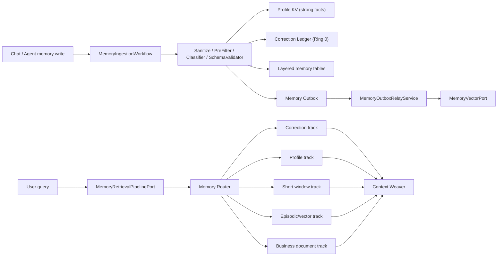

# Seahorse Agent 记忆系统 Gemini 对齐差距补齐开发设计与执行计划

## Goal

基于 `docs/Seahorse Agent记忆系统差距分析与Gemini对齐改进方案.md` 的差距分析，继续补齐 Seahorse Agent 记忆系统与 Gemini 式记忆系统之间的实现缺口。目标不是推倒现有实现，而是在当前已经落地的 Profile KV、Correction Ledger、Memory Router、Context Weaver、MemoryIngestionWorkflow、生命周期治理和观测基础上，补强仍然薄弱的工程闭环：

1. Profile KV 从“当前值表”升级为具备版本、历史、CAS 语义和读反馈的强事实源。
2. Memory Outbox 从“失败入队”升级为可调度、可重试、可观测的补偿执行链路。
3. 读取逻辑从 `DefaultMemoryEnginePort` 内部方法抽离为独立 `MemoryRetrievalPipelinePort`，显式承载 Router、召回、过滤、去重、预算和反馈阶段。
4. 生命周期治理覆盖派生向量索引和 Profile 历史，不让过期 generation 通过向量召回或旧碎片污染 Prompt。
5. Profile slot 覆盖从职业身份扩展到姓名、技术栈、回答风格等高频强事实，并通过策略和观测支持动态调整。

## Architecture

本次补齐采用“兼容承载层 + 新权威组件”的架构：

- 现有 `t_short_term_memory`、`t_long_term_memory`、`t_semantic_memory` 继续作为渐进迁移承载层。
- `t_user_profile_fact` 是用户强事实源，Profile active 行只表达当前事实，历史行保留审计和回滚依据。
- `t_memory_correction_ledger` 是 Ring 0，读取期和 Prompt 期优先级高于 Profile KV、短期窗口、长期情节和业务文档。
- `MemoryIngestionWorkflowPort` 继续拥有最终写入权威，LLM 或规则分类只产出候选动作，确定性代码负责校验、写库、失效旧 generation 和写入 Outbox。
- `MemoryRetrievalPipelinePort` 成为读取编排 owner，`DefaultMemoryEnginePort.loadMemory()` 退化为门面。
- `MemoryOutboxRelayService` 成为派生索引补偿 owner，负责 `VECTOR_UPSERT` 等 Outbox 任务的执行和失败重试。



## Tech Stack

- Java 21 / Maven multi-module。
- Spring Boot starter 自动配置。
- JDBC repository adapter，兼容 PostgreSQL 与 H2 测试模式。
- Jackson `ObjectMapper` 作为 JSON 序列化边界。
- JUnit 5 + AssertJ，按 TDD 先写 RED 测试再实现。

## Baseline/Authority Refs

- `docs/Gemini Agent记忆系统完整设计方案.md`
- `docs/Seahorse Agent记忆系统差距分析与Gemini对齐改进方案.md`
- `docs/aegis/plans/2026-05-20-memory-filtering-implementation.md`
- `docs/aegis/work/2026-05-20-memory-p2-ingestion-workflow/*`
- `docs/aegis/work/2026-05-20-memory-p3-router-context-weaver/*`
- `docs/aegis/work/2026-05-20-memory-p4-retrieval-outbox/*`
- `docs/aegis/work/2026-05-20-memory-p5-lifecycle-management/*`
- `docs/aegis/work/2026-05-20-memory-p6-observability-policy/*`

## Compatibility Boundary

1. 不删除现有分层记忆表和现有 `MemoryEnginePort` public API。
2. `DefaultMemoryEnginePort` 的构造器兼容已有测试和自动配置；新增依赖必须有 noop/default fallback。
3. JDBC schema upgrade 必须支持已有 Docker volume 的增量升级，不能依赖重建库。
4. H2 测试 schema 与 PostgreSQL 初始化 SQL 同步维护。
5. 纠错和 Profile 强事实优先级不能下降，Prompt 分区顺序保持 `Correction Ledger` 先于 `Profile KV`。
6. 向量后端未真实接入时，`MemoryVectorPort.noop()` 路径必须保持无副作用。

## Verification

最小回归命令：

```powershell
.\mvnw.cmd -pl seahorse-agent-tests,seahorse-agent-adapter-repository-jdbc -am "-Dtest=DefaultMemoryEnginePortTests,MemoryWorkflowRoutingTests,KernelMemoryLifecycleServiceTests,KernelMemoryObservabilityServiceTests,JdbcMemoryRepositoryAdapterTests,JdbcChatSchemaUpgradeTests" test "-Dspotless.check.skip=true" "-Dsurefire.failIfNoSpecifiedTests=false"
```

每个阶段先跑更窄测试：

```powershell
.\mvnw.cmd -pl seahorse-agent-adapter-repository-jdbc -Dtest=JdbcMemoryRepositoryAdapterTests,JdbcChatSchemaUpgradeTests test "-Dspotless.check.skip=true"
.\mvnw.cmd -pl seahorse-agent-tests -am "-Dtest=DefaultMemoryEnginePortTests,MemoryWorkflowRoutingTests,KernelMemoryObservabilityServiceTests" test "-Dspotless.check.skip=true" "-Dsurefire.failIfNoSpecifiedTests=false"
```

## Current Baseline

当前 `main` 已包含以下能力：

- `t_user_profile_fact` 与 `ProfileMemoryPort` 已存在，但 upsert 仍原地覆盖 active 行。
- `t_memory_correction_ledger` 与 `CorrectionLedgerPort` 已存在，显式职业纠错可写入 Ring 0。
- `MemoryIngestionWorkflowPort` 已被聊天捕获和 Agent `memory_write` 工具使用。
- `DefaultMemoryRouter` 已能按问题激活 `CORRECTION`、`PROFILE`、`EPISODIC`、`BUSINESS_DOCUMENT`、`SHORT_WINDOW`。
- `DefaultContextWeaver` 已输出 `[Correction Ledger]`、`[Profile KV]`、`[Short Window]`、`[Business / Semantic Memory]`、`[Long-Term Episodic]`。
- `MemoryOutboxPort` 与 JDBC repository 已支持 enqueue、poll、markSucceeded、markFailed，但缺少消费 worker。
- `KernelMemoryManagementService.memoryHealth()` 已聚合 Profile、Correction、operation、conflict、outbox 和 policy alert，但指标还不完整。

## Confirmed Gaps

| Gap | Current State | Impact | Closure Strategy |
| --- | --- | --- | --- |
| Profile KV 缺少版本历史 | `JdbcProfileMemoryRepositoryAdapter.upsert()` 原地更新 active 行 | 无法审计、回滚和 CAS 防并发覆盖 | 增加 `version`、`last_referenced_at`、`access_count`；upsert 改为旧 active 转 `HISTORICAL`，插入新 active |
| Profile 读反馈缺失 | 读取 Profile 不更新引用时间和次数 | 生命周期无法判断哪些强事实被频繁使用 | `ProfileMemoryPort.recordRead()` 默认方法 + JDBC 实现 |
| Outbox 无 worker | 向量失败只入队 | 失败后不会自动补偿，重启后仍丢索引 | 新增 `MemoryOutboxRelayService`，自动配置定时 job |
| 读取管道 owner 不清晰 | `DefaultMemoryEnginePort.loadMemory()` 内联路由、召回、过滤和反馈 | 后续 rerank、预算、图检索难以扩展 | 新增 `MemoryRetrievalPipelinePort` 和 `DefaultMemoryRetrievalPipeline` |
| 向量 generation 硬过滤不足 | vector port 只返回 memoryId，过滤依赖主记录查回 | 真实向量库可能召回 obsolete id，成本和污染风险偏高 | 端口扩展查询上下文或 payload 元数据；本阶段先保证查回后强过滤，后续真实向量适配器落硬谓词 |
| Profile slot 覆盖窄 | 主要识别 `identity.occupation` | 用户姓名、技术栈、回答风格仍退化为普通短期文本 | 扩展 slot resolver，先用规则覆盖高确定性表达 |
| 观测指标未闭环 | health 有聚合但无 relay 指标、Profile 版本指标、召回命中指标 | 线上定位“记住但读不到”困难 | 增加 outbox relay 成功/失败统计和 retrieval summary |

## Data Model Changes

### `t_user_profile_fact`

新增字段：

| Column | Type | Meaning |
| --- | --- | --- |
| `version` | `BIGINT NOT NULL DEFAULT 1` | 同一 `(user_id, tenant_id, slot_key)` 的事实版本 |
| `last_referenced_at` | `TIMESTAMP` | 最近被读取并织入上下文的时间 |
| `access_count` | `INTEGER NOT NULL DEFAULT 0` | 被读取次数 |

写入规则：

1. 首次写入 slot 时插入 `ACTIVE version=1`。
2. 更新 slot 时先把旧 active 行置为 `HISTORICAL`，设置 `valid_until=now`。
3. 再插入新 active 行，`version=old.version + 1`。
4. `uk_user_profile_active_slot` 仍保证同一 slot 只有一个 active 当前值。
5. `findActive()`、`listActive()` 只读 `ACTIVE AND deleted=0`。

### `t_long_term_memory_vector`

本阶段只在初始化 SQL 和 schema upgrade 中补齐兼容字段，为真实向量 adapter 做准备：

| Column | Type | Meaning |
| --- | --- | --- |
| `tenant_id` | `VARCHAR(64) DEFAULT 'default'` | 租户过滤 |
| `generation_id` | `VARCHAR(64)` | 关联事实或派生 generation |
| `status` | `VARCHAR(32) DEFAULT 'ACTIVE'` | 生命周期状态 |
| `last_referenced_at` | `TIMESTAMP` | 召回反馈 |
| `access_count` | `INTEGER NOT NULL DEFAULT 0` | 召回次数 |

## Module Design

### 1. Profile KV Versioning

Files:

- `seahorse-agent-kernel/src/main/java/com/miracle/ai/seahorse/agent/ports/outbound/memory/ProfileFact.java`
- `seahorse-agent-kernel/src/main/java/com/miracle/ai/seahorse/agent/ports/outbound/memory/ProfileMemoryPort.java`
- `seahorse-agent-adapter-repository-jdbc/src/main/java/com/miracle/ai/seahorse/agent/adapters/repository/jdbc/JdbcProfileMemoryRepositoryAdapter.java`
- `seahorse-agent-adapter-repository-jdbc/src/main/java/com/miracle/ai/seahorse/agent/adapters/repository/jdbc/JdbcChatSchemaUpgrade.java`
- `resources/database/seahorse_init.sql`
- `seahorse-agent-adapter-repository-jdbc/src/test/java/com/miracle/ai/seahorse/agent/adapters/repository/jdbc/JdbcMemoryRepositoryAdapterTests.java`

Acceptance:

- 同一 slot 两次 upsert 后，active 只有新值，旧值仍以 `HISTORICAL` 保留。
- `ProfileFact.version()` 返回新值版本。
- `recordRead()` 能增加 active Profile 的 `access_count` 并刷新 `last_referenced_at`。

### 2. Memory Outbox Relay

Files:

- `seahorse-agent-kernel/src/main/java/com/miracle/ai/seahorse/agent/kernel/application/memory/MemoryOutboxRelayService.java`
- `seahorse-agent-spring-boot-starter/src/main/java/com/miracle/ai/seahorse/agent/adapters/spring/SeahorseAgentKernelMemoryAutoConfiguration.java`
- `seahorse-agent-tests/src/test/java/com/miracle/ai/seahorse/agent/kernel/application/memory/MemoryOutboxRelayServiceTests.java`

Behavior:

- `processBatch(limit)` 拉取 pending outbox。
- `VECTOR_UPSERT` payload 必须包含 `memoryId`、`content`、`embeddingModel`。
- 成功调用 `MemoryVectorPort.upsert()` 后 `markSucceeded(taskId)`。
- 任意异常都 `markFailed(taskId, message)`，不阻断同批后续任务。
- 未知 task type 进入 failed，错误信息含 `unsupported task type`。

Spring:

- 默认注册 service。
- 定时 job 由 `seahorse-agent.memory.outbox.relay-enabled` 控制，默认开启。
- batch size 使用 `seahorse-agent.memory.outbox.relay-batch-size`，默认 50。

### 3. Memory Retrieval Pipeline

Files:

- `seahorse-agent-kernel/src/main/java/com/miracle/ai/seahorse/agent/ports/outbound/memory/MemoryRetrievalPipelinePort.java`
- `seahorse-agent-kernel/src/main/java/com/miracle/ai/seahorse/agent/kernel/application/memory/DefaultMemoryRetrievalPipeline.java`
- `seahorse-agent-kernel/src/main/java/com/miracle/ai/seahorse/agent/kernel/application/memory/DefaultMemoryEnginePort.java`
- `seahorse-agent-spring-boot-starter/src/main/java/com/miracle/ai/seahorse/agent/adapters/spring/SeahorseAgentKernelMemoryAutoConfiguration.java`
- `seahorse-agent-tests/src/test/java/com/miracle/ai/seahorse/agent/kernel/application/memory/MemoryRetrievalPipelineTests.java`

Pipeline stages:

1. Validate request。
2. Route by `MemoryRouterPort`。
3. Load Ring 0 Correction。
4. Load Profile KV。
5. Load Short Window。
6. Load Episodic layered memories and vector hits。
7. Load Business Docs。
8. Suppress legacy profile slot fragments when Profile active exists。
9. Deduplicate by id and profile slot。
10. Record lifecycle read feedback for layered memory and Profile facts。
11. Build `MemoryContext`。

Compatibility:

- `DefaultMemoryEnginePort.loadMemory()` 调用 pipeline。
- 若没有注入 pipeline，使用内部 default pipeline，保持旧构造器可用。

### 4. Profile Slot Expansion

Files:

- `seahorse-agent-kernel/src/main/java/com/miracle/ai/seahorse/agent/kernel/application/memory/DefaultMemoryEnginePort.java`
- 后续可抽出 `ProfileSlotResolver`，但本阶段只在现有规则附近小步扩展，降低重构风险。
- `seahorse-agent-tests/src/test/java/com/miracle/ai/seahorse/agent/kernel/application/memory/DefaultMemoryEnginePortTests.java`

Initial slots:

| Slot | Accepted expressions |
| --- | --- |
| `identity.occupation` | 我是学生、我的职业是老师、我现在是后端工程师 |
| `identity.name` | 我叫张三、我的名字是 Alice |
| `skills.tech_stack` | 我主要使用 Java/Spring/React、我的技术栈是 Java 和 Vue |
| `preferences.response_style` | 我喜欢简短回答、以后回答详细一点 |

Guardrails:

- 只接受第一人称、明确归属、低敏感表达。
- 模糊表达仍写短期候选，不进入 Profile KV。
- 与职业纠错相同，Profile active 存在后旧碎片软失效。

### 5. Observability Closure

Files:

- `seahorse-agent-kernel/src/main/java/com/miracle/ai/seahorse/agent/ports/outbound/memory/MemoryHealthReport.java`
- `seahorse-agent-kernel/src/main/java/com/miracle/ai/seahorse/agent/kernel/application/memory/KernelMemoryManagementService.java`
- `seahorse-agent-tests/src/test/java/com/miracle/ai/seahorse/agent/kernel/application/memory/KernelMemoryObservabilityServiceTests.java`

新增或强化指标：

- `outboxBacklogCount` 已存在，增加 relay failure 在 operation/alert 的可见性。
- `profileCompleteness` 从固定 4 个目标 slot 调整为基于目标 slot set。
- alert 增加 `memory.profile.low-completeness` 与 `memory.conflict.density` 的策略入口时机。

## Execution Plan

### Phase G1: Profile KV Versioning and Read Feedback

Why:

强事实源必须可审计、可回滚、可防旧碎片污染。当前原地覆盖会让“我曾经是学生，现在是老师”的变更缺少历史证据。

Steps:

1. 在 `JdbcMemoryRepositoryAdapterTests` 写 RED：两次 upsert 同一 slot 后，DB 内一条 `HISTORICAL` 一条 `ACTIVE`，active version 为 2。
2. 写 RED：调用 `profileAdapter.recordRead("user-1","default","identity.occupation", fixedInstant)` 后 active 行 `access_count=1` 且 `last_referenced_at` 非空。
3. 更新 `ProfileFact` record 添加 `long version`、`Instant lastReferencedAt`、`int accessCount`，提供 canonical default。
4. `ProfileMemoryPort` 添加默认 `recordRead(...)` noop。
5. 更新 JDBC schema、schema upgrade、test schema。
6. 修改 `JdbcProfileMemoryRepositoryAdapter.upsert()`：旧 active 转 `HISTORICAL`，插入新 active。
7. 跑 adapter 测试，确认 GREEN。

Verification:

```powershell
.\mvnw.cmd -pl seahorse-agent-adapter-repository-jdbc -Dtest=JdbcMemoryRepositoryAdapterTests,JdbcChatSchemaUpgradeTests test "-Dspotless.check.skip=true"
```

### Phase G2: Outbox Relay Worker

Why:

向量索引失败后只入队不消费，实际会导致“关系库记住了，但语义召回找不到”。

Steps:

1. 新增 `MemoryOutboxRelayServiceTests` RED：成功任务调用 vector upsert 并 markSucceeded。
2. 新增 RED：vector 抛异常时 markFailed 且同批下一条继续执行。
3. 新增 `MemoryOutboxRelayService`。
4. Spring 自动配置注册 service 和可选定时 job。
5. 跑 kernel test GREEN。

Verification:

```powershell
.\mvnw.cmd -pl seahorse-agent-tests -am "-Dtest=MemoryOutboxRelayServiceTests,DefaultMemoryEnginePortTests" test "-Dspotless.check.skip=true" "-Dsurefire.failIfNoSpecifiedTests=false"
```

### Phase G3: Retrieval Pipeline Extraction

Why:

读取管道是 Gemini 对齐里最重要的 owner 之一。继续把路由、召回、过滤、反馈放在 `DefaultMemoryEnginePort` 内，会让 P4-P6 难以扩展和验证。

Steps:

1. 新增 `MemoryRetrievalPipelinePort`。
2. 新增 `DefaultMemoryRetrievalPipeline`，迁移 `loadMemory()` 读取逻辑。
3. `DefaultMemoryEnginePort.loadMemory()` 委托 pipeline。
4. 迁移后保持既有 `DefaultMemoryEnginePortTests` 全部通过。
5. 新增 `MemoryRetrievalPipelineTests` 覆盖 Correction/Profile 优先、Profile active suppress、Profile read feedback。

Verification:

```powershell
.\mvnw.cmd -pl seahorse-agent-tests -am "-Dtest=MemoryRetrievalPipelineTests,DefaultMemoryEnginePortTests,MemoryWorkflowRoutingTests" test "-Dspotless.check.skip=true" "-Dsurefire.failIfNoSpecifiedTests=false"
```

### Phase G4: Vector Generation and Lifecycle Guard

Why:

如果真实向量库返回过期 generation，当前只靠查回主表过滤。短期内可接受，但必须补齐表字段和 adapter 契约，为后续真实向量后端硬过滤准备。

Steps:

1. `resources/database/seahorse_init.sql` 为 `t_long_term_memory_vector` 添加 lifecycle columns。
2. `JdbcChatSchemaUpgrade` 在表存在时补齐 vector lifecycle columns。
3. `JdbcChatSchemaUpgradeTests` RED/GREEN 验证老表升级。
4. 保持 `MemoryVectorPort` 当前签名；真实 adapter 接入前不做 breaking change。

Verification:

```powershell
.\mvnw.cmd -pl seahorse-agent-adapter-repository-jdbc -Dtest=JdbcChatSchemaUpgradeTests test "-Dspotless.check.skip=true"
```

### Phase G5: Profile Slot Expansion

Why:

用户画像不能只识别职业。姓名、技术栈、回答风格是跨会话体验中最常用的强事实。

Steps:

1. 写 RED：`我叫张三` 写入 `identity.name=张三`。
2. 写 RED：`我的技术栈是 Java 和 Spring` 写入 `skills.tech_stack=Java 和 Spring`。
3. 写 RED：`我喜欢简短回答` 写入 `preferences.response_style=简短回答`。
4. 扩展 `profileSlot()` 和 `profileValue()`。
5. 保持低价值和敏感信息过滤测试不回退。

Verification:

```powershell
.\mvnw.cmd -pl seahorse-agent-tests -am "-Dtest=DefaultMemoryEnginePortTests,MemoryCapturePolicyTests" test "-Dspotless.check.skip=true" "-Dsurefire.failIfNoSpecifiedTests=false"
```

### Phase G6: Observability and Regression Closure

Why:

补齐后需要能回答“写入是否被接受、Profile 是否完整、Outbox 是否堵塞、读取是否命中强事实”。

Steps:

1. 扩展 `KernelMemoryObservabilityServiceTests`，覆盖低 Profile 完整度与 outbox backlog alert。
2. 如不引入新字段，则在 `latestQualitySnapshot` 和 `alerts` 中表达新增状态，避免 Web API contract 大改。
3. 跑完整目标回归。
4. 更新本文档的执行状态。

Verification:

```powershell
.\mvnw.cmd -pl seahorse-agent-tests,seahorse-agent-adapter-repository-jdbc -am "-Dtest=DefaultMemoryEnginePortTests,MemoryWorkflowRoutingTests,KernelMemoryLifecycleServiceTests,KernelMemoryObservabilityServiceTests,JdbcMemoryRepositoryAdapterTests,JdbcChatSchemaUpgradeTests" test "-Dspotless.check.skip=true" "-Dsurefire.failIfNoSpecifiedTests=false"
```

## Risk and Rollback

| Risk | Mitigation | Rollback |
| --- | --- | --- |
| Profile upsert 先 update 后 insert 中途失败导致无 active | 优先使用 transaction；无事务时限制 JDBC 顺序并测试主路径 | 将 HISTORICAL 行重新置 ACTIVE |
| H2 与 PostgreSQL DDL 差异 | schema upgrade 使用 `addColumnIfMissing`，测试 schema 用 TEXT/DOUBLE 兼容 | 只回滚新增字段读取，不删列 |
| 新 pipeline 与旧 engine 逻辑不一致 | 先迁移原方法逻辑，不同时引入 rerank 新行为 | `DefaultMemoryEnginePort` 保留旧构造兼容，必要时内联回退 |
| Profile slot 误写 | 仅接受高确定性第一人称规则，低确定性留在短期 | 删除 slot active 或写 correction 覆盖 |
| Outbox relay 重复执行 | vector upsert 必须幂等；Outbox markSucceeded 后不再 poll | 暂停 `seahorse-agent.memory.outbox.relay-enabled` |

## Delivery Checklist

- [x] 文档落地。
- [x] G1 Profile KV 版本历史与读反馈完成。
- [x] G2 Outbox Relay 完成。
- [x] G3 Retrieval Pipeline 抽离完成。
- [x] G4 Vector lifecycle schema guard 完成。
- [x] G5 Profile slot 扩展完成。
- [x] G6 观测与完整回归完成。
- [x] G7 Memory trace plumbing 与 health 摘要完成。

## Execution Evidence

| Phase | Status | Evidence |
| --- | --- | --- |
| G1 | Done | `JdbcMemoryRepositoryAdapterTests` and `JdbcChatSchemaUpgradeTests` cover Profile version history, active/historical split, and read feedback. |
| G2 | Done | `MemoryOutboxRelayServiceTests` covers successful `VECTOR_UPSERT`, per-task failure, and unsupported task isolation. |
| G3 | Done | `MemoryRetrievalPipelineTests` and existing engine tests cover Router-driven retrieval, Profile/Correction priority, active slot suppression, and Profile read feedback. |
| G4 | Done | `JdbcChatSchemaUpgradeTests` covers backfilling vector lifecycle columns on an existing table; init SQL contains the same columns. |
| G5 | Done | `DefaultMemoryEnginePortTests#shouldWriteProfileFactsForNameTechStackAndResponseStyle` verifies `identity.name`, `skills.tech_stack`, and `preferences.response_style` Profile slot writes. |
| G6 | Done | `KernelMemoryObservabilityServiceTests` covers outbox backlog, schema failure, Profile completeness, and `memory.profile.low-completeness` alerts. |
| G7 | Done | `InMemoryMemoryTraceRecorderTests`, `MemoryAggregationServiceTests`, `KernelMemoryReviewServiceTests`, `DefaultMemoryMaintenanceServiceTests`, `MemoryOutboxRelayServiceTests`, and `KernelMemoryObservabilityServiceTests` cover trace recorder behavior, aggregation/review/maintenance/outbox trace emission, and health trace summary. |
| M5-write-index | Done | `DefaultMemoryEnginePortTests#shouldEnqueueDerivedIndexOutboxTasksWhenConfigured` and `SeahorseAgentKernelAutoConfigurationTests#shouldEnqueueDerivedIndexTasksFromMemoryEngineOnlyWhenIndexPortsExist` cover main ADD writes enqueueing `KEYWORD_UPSERT` / `GRAPH_UPSERT` only when derived-index capability is explicitly available. |
| M2-adapter-boundary | Done | `OpenAiCompatibleMemoryRefinerAutoConfigurationTests` and `SeahorseAgentKernelAutoConfigurationTests#shouldLeaveLlmMemoryRefinerRegistrationToAdapterAutoConfiguration` cover that OpenAI-compatible owns `LlmMemoryRefinerAdapter` auto-configuration while the kernel starter only consumes `MemoryRefinerPort`. |
| M3-review-apply-directive | Done | `KernelMemoryReviewServiceTests` covers approve/modify passing `MemoryReviewApplyDirective`; `DefaultMemoryEnginePortTests#shouldApplyReviewDirectiveTargetProfileSlotWithoutReclassification` and `#shouldApplyReviewDirectiveTargetSemanticLayerWithoutReclassification` cover preserving `requestedAction`, `targetLayer`, `targetKind`, and `targetKey` during review apply. |
| M3-review-delete-apply | Done | `DefaultMemoryEnginePortTests#shouldApplyReviewDirectiveDeleteTargetMemoryAndDerivedIndexes` covers human-approved DELETE logically deleting the targeted four-layer memory and enqueueing derived-index deletes; `#shouldRejectReviewDirectiveDeleteWhenTargetMemoryIsMissing` covers missing targets staying rejected; `KernelMemoryReviewServiceTests#shouldApproveDeleteCandidateWithTargetKeyAsApplyContent` covers blank DELETE candidate replay. |

## Acceptance Matrix Against Original P0-P6

| Original Phase | Current Alignment After This Plan |
| --- | --- |
| P0 基线确认 | 保持现有表与端口兼容，文档明确 owner 和边界 |
| P1 Correction Ledger + Profile KV | 补齐 Profile 版本历史、读反馈和强事实审计 |
| P2 写入工作流与信息筛选 | 保持 workflow 最终写入权威，扩展 Profile slot |
| P3 Router + Context Weaver | 读取 pipeline 独立化，继续保证 Ring 0 / Profile 优先 |
| P4 向量/BM25/业务文档 | 补齐 Outbox Relay，vector schema 为 generation hard filter 做准备 |
| P5 生命周期治理 | Profile 历史状态和 vector lifecycle 字段补齐 |
| P6 观测与策略 | Outbox、schema failure、Profile completeness、conflict density 进入 health/alert |
| M7 观测、灰度与回滚 | `MemoryTraceRecorder` 作为可插拔 outbound port 接入，默认内存实现可被自定义 bean 覆盖；trace 只作为横向观测层，不改变四层记忆模型。 |
| M5 派生索引补齐 | 主 ADD 写入路径通过 `MemoryEngineOptions` 和 Spring index-port presence gate 可选生成 keyword/graph upsert outbox；派生索引保持插件化，不进入四层记忆 source-of-truth。 |
