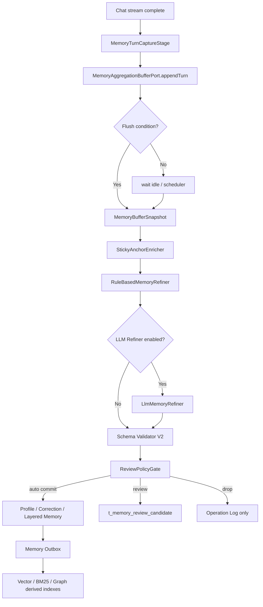
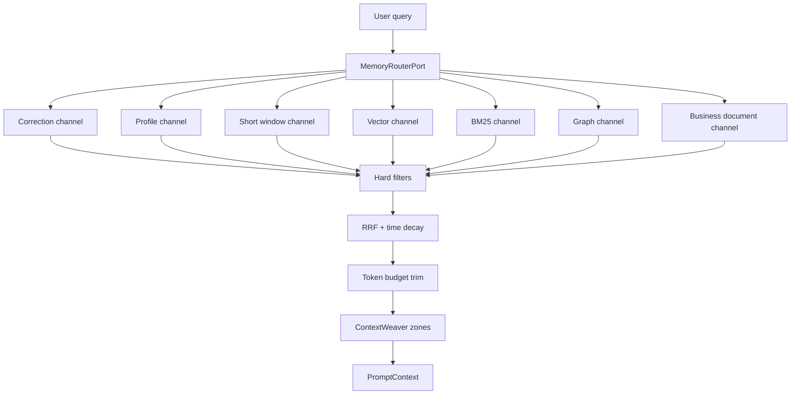
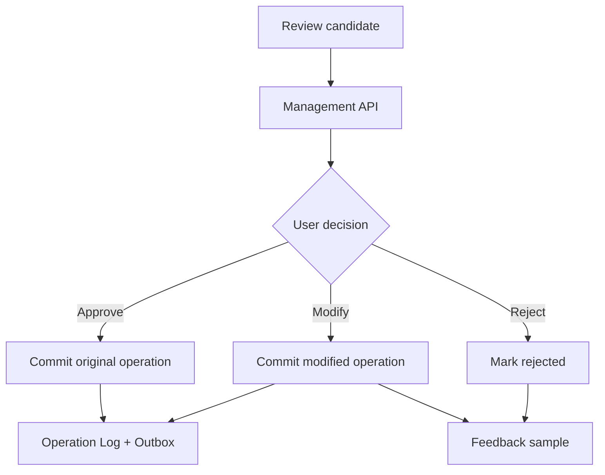
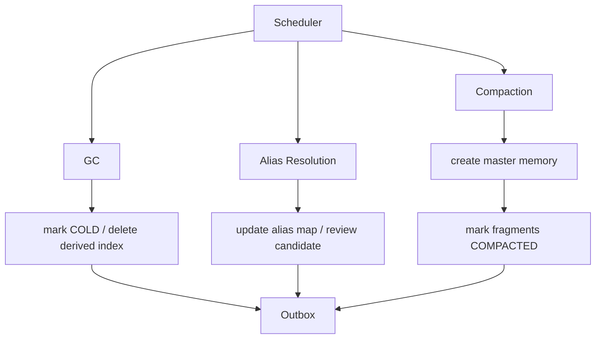

# Seahorse Agent 记忆系统 Gemini 架构深度分析与实施方案

> 日期：2026-05-21
> 输入文档：`docs/gemini-design.md`
> 当前代码基线：`seahorse-agent-kernel`、`seahorse-agent-adapter-repository-jdbc`、`seahorse-agent-adapter-web`、`seahorse-agent-spring-boot-starter` 中的记忆相关实现
> 目标：把 Gemini 式长期记忆系统设计拆解为 Seahorse Agent 当前架构下可落地的模块、接口、数据流和分阶段实施方案。

## 1. 结论摘要

`docs/gemini-design.md` 描述的是一套生产级长期记忆系统：写入侧通过防抖聚合和 LLM Refiner 把多轮对话提炼成结构化操作；读取侧通过 Vector、BM25、Graph 多路召回和重排把相关记忆织入 Prompt；治理侧通过 REVIEW 人工审核闭环、Compaction、Alias Resolution、GC 保持记忆库长期干净。

Seahorse Agent 当前已经具备一部分关键地基：

- `DefaultMemoryEnginePort` 已是记忆门面，同时实现 `MemoryIngestionWorkflowPort`，包含 sanitizer、pre-filter、规则分类、schema validator、operation log、Profile KV 写入、Correction Ledger 写入、vector outbox。
- `DefaultMemoryRetrievalPipeline` 已成为读取 owner，支持 Router、Correction/Profile/Short/Episodic/Business tracks、Profile slot 压制、vector hit id 查回、读反馈。
- `DefaultContextWeaver` 已输出分区 Prompt：`Correction Ledger`、`Profile KV`、`Short Window`、`Business Documents`、`Semantic Memory`、`Long-Term Episodic`，并有总预算。
- JDBC 层已有 `t_user_profile_fact`、`t_memory_correction_ledger`、`t_memory_operation_log`、`t_memory_outbox`、生命周期字段和读反馈字段。
- 管理接口已暴露 Profile、Correction、operations、outbox、health、policy、conflict 和 governance。

主要差距仍集中在五个方向：

1. **写入入口仍是单轮触发**：`MemoryCaptureStage` 在流式回答完成后提交当前用户问题，不具备跨轮 buffer、静默期防抖、硬阈值 flush。
2. **LLM Refiner 已有可插拔适配器但未完全闭环**：已新增 `LlmMemoryRefinerAdapter` 产出 ADD/UPDATE/DELETE/IGNORE/REVIEW 结构化 delta；后续仍需补齐更强 schema 校验、反馈样本驱动优化和多轮聚合上下文输入。
3. **记忆多路召回仍不完整**：`MemoryVectorPort` 只有内核端口和 outbox relay，真实 adapter 未接入；BM25/Graph 尚未成为记忆读取 track；当前 RAG 知识库有多路检索能力，但记忆侧未复用成完整闭环。
4. **REVIEW 只有状态概念，没有审核候选表和闭环 API/UI**：`MemoryIngestionAction.REVIEW`、`MemoryPolicyConfig.reviewEnabled` 已存在，但没有 `t_memory_review_candidate`、审核决策流和训练样本回收。
5. **自动维护仍是局部治理**：已有短期衰减、Profile slot obsolete、读反馈和质量快照，但缺 Compaction、Alias Resolution、长期/向量/BM25/Graph GC 的完整任务。

推荐实施路线：不要推倒当前架构，也不要新增第五层记忆。保留现有 `WORKING`、`SHORT_TERM`、`LONG_TERM`、`SEMANTIC` 四层模型，以及 Profile KV、Correction Ledger、Operation Log、Outbox、Router、Context Weaver，以“端口扩展 + 默认关闭 + 规则优先 + LLM 可选”的方式补齐 Gemini 设计。Gemini 中的防抖、Refiner、多路召回、Review 和维护机制都应做成可插拔能力，而不是替代当前核心模型。

## 2. 当前项目记忆架构事实

### 2.1 当前写入链路

当前聊天完成后的记忆捕获链路：

```text
KernelChatPipeline.execute()
  -> KernelChatPreparationSupport.installMemoryCapture()
  -> MemoryCaptureStage.wrap(callback, MemoryIngestionWorkflowPort, context)
  -> callback.onComplete() / onError()
  -> MemoryIngestionWorkflowPort.ingest(MemoryIngestionCommand.chatCompleted(writeRequest))
  -> DefaultMemoryEnginePort.ingest()
  -> MemorySanitizer
  -> MemoryPreFilter
  -> MemorySemanticClassifier
  -> MemorySchemaValidator
  -> shortTermPort.save()
  -> optional ProfileMemoryPort.upsert()
  -> optional CorrectionLedgerPort.upsert()
  -> MemoryVectorPort.upsert() or MemoryOutboxPort.enqueue()
  -> MemoryOperationLogPort.markCompleted()
```

关键代码：

- `seahorse-agent-kernel/src/main/java/com/miracle/ai/seahorse/agent/kernel/application/chat/MemoryCaptureStage.java`
- `seahorse-agent-kernel/src/main/java/com/miracle/ai/seahorse/agent/kernel/application/memory/DefaultMemoryEnginePort.java`
- `seahorse-agent-kernel/src/main/java/com/miracle/ai/seahorse/agent/kernel/application/memory/MemorySanitizer.java`
- `seahorse-agent-kernel/src/main/java/com/miracle/ai/seahorse/agent/kernel/application/memory/MemorySemanticClassifier.java`
- `seahorse-agent-kernel/src/main/java/com/miracle/ai/seahorse/agent/kernel/application/memory/MemorySchemaValidator.java`

优点：

- 聊天主链路不直接信任原始问题，写入可信判断集中在 memory engine。
- 规则捕获高精度，低价值闲聊、问题句、敏感凭据会被拒绝。
- `operationId` 提供幂等边界。
- Profile 和 Correction 已形成强事实轨道。

不足：

- 只提交当前用户问题，没有助手回答，也没有多轮 context block。
- `onError()` 也会触发捕获，当前规则会过滤大部分噪声，但从语义上更适合作为可配置策略。
- 没有静默期、force flush、topic switch、CAS flush。
- Refiner 还不是 LLM 结构化算子。

### 2.2 当前读取链路

当前读取链路：

```text
KernelChatPipeline.execute()
  -> loadMemory()       ConversationMemoryPort.loadAndAppend()
  -> activateMemory()   MemoryEnginePort.loadMemory()
  -> DefaultMemoryRetrievalPipeline.load()
       -> DefaultMemoryRouter.route()
       -> CorrectionLedgerPort.listActive()
       -> ProfileMemoryPort.listActive()
       -> ShortTermMemoryPort.listByUser()
       -> LongTermMemoryPort.listByUser()
       -> SemanticMemoryPort.listByUser()
       -> MemoryVectorPort.search() -> findById()
       -> MemoryBusinessDocumentRetrieverPort.retrieve()
       -> profile slot suppression
       -> read feedback
  -> ContextWeaverPort.weave()
  -> PromptContext.memoryContext
```

关键代码：

- `DefaultMemoryRetrievalPipeline`
- `DefaultMemoryRouter`
- `DefaultContextWeaver`
- `LocalRagPromptAdapter`
- `KernelChatResponseSupport`

优点：

- `Correction Ledger` 和 `Profile KV` 已有高优先级 Prompt zone。
- Router 已能区分 profile、correction、business、episodic、short window 等 track。
- Business document 已独立于 semantic memory。
- Profile active slot 会压制旧碎片，避免 Prompt 同时出现新旧画像。
- 读取后会调用 `ProfileMemoryPort.recordRead()` 和 `MemoryLifecyclePort.recordRead()`。

不足：

- Router 是规则版关键词判断，缺少路由置信度、预算计划和可观测 trace。
- Vector 只返回 memory id，不携带 score、rank、generation、channel 信息。
- BM25 和 Graph 未进入记忆读取 pipeline。
- 没有 RRF、Cross-Encoder rerank、时间衰减综合排序。
- 当前 `PromptContext.hasMemory()` 没把 `businessDocumentMemories` 纳入判断，虽然 `LocalRagPromptAdapter` 直接调用 weaver，不影响主路径，但领域对象语义应补齐。

### 2.3 当前存储和治理

已存在的关键表：

- `t_short_term_memory`
- `t_long_term_memory`
- `t_semantic_memory`
- `t_user_profile_fact`
- `t_memory_correction_ledger`
- `t_memory_operation_log`
- `t_memory_outbox`
- `t_memory_conflict_log`
- `t_memory_quality_snapshot`
- `t_long_term_memory_vector`

已存在的治理能力：

- `KernelMemoryGovernanceService.runGovernance()`：短期晋升长期/语义、可选规则推理、冲突记录、质量快照。
- `KernelMemoryGovernanceService.runDecay()`：通过 `ShortTermMemoryMaintenancePort` 扫描过期或低衰减短期记忆。
- `JdbcMemoryLifecycleRepositoryAdapter.markObsoleteByProfileSlot()`：Profile slot 更新后将旧分层碎片置为 `OBSOLETE`。
- `MemoryOutboxRelayService`：消费 `VECTOR_UPSERT` outbox 任务，调用 `MemoryVectorPort.upsert()`，失败不阻断同批后续任务。
- `KernelMemoryManagementService.memoryHealth()`：聚合 profile、correction、pending conflict、outbox、operation、quality snapshot 和 alert。

不足：

- 没有 compaction job。
- 没有 alias registry 和 alias resolution job。
- 没有长期/语义/向量派生索引的完整 GC worker。
- 没有 REVIEW staging candidate。
- 没有 LLM feedback dataset collection。

## 3. `gemini-design.md` 核心技术拆解

### 3.1 LLM Refiner

Gemini 设计里的 LLM Refiner 是写入侧最关键的语义算子。它不负责最终写库，只负责把多轮 context block 转换为结构化候选操作。

核心输入：

```json
{
  "session_id": "sess_99812",
  "trigger_type": "IDLE_TIMEOUT",
  "context_blocks": [
    {"role": "user", "text": "我现在在调优 Dubbo 的消费端线程池。"},
    {"role": "assistant", "text": "明白，遇到了线程饥饿还是拒绝策略问题？"},
    {"role": "user", "text": "是拒绝策略，我想改成 CallerRuns。"}
  ],
  "sticky_anchors": {
    "runtime_env": "Java 17, Spring Boot 3.x, Dubbo 3.2",
    "current_epic": "Optimizing Consumer Thread Pool Reject Policy"
  },
  "existing_memory_snapshot": []
}
```

核心输出：

```json
{
  "operations": [
    {
      "op": "ADD",
      "targetLayer": "SHORT_TERM",
      "targetKind": "PROJECT_FACT",
      "targetKey": "project.thread_pool.reject_policy",
      "content": "用户正在调优 Dubbo 消费端线程池拒绝策略，关注 CallerRuns 反压效果。",
      "confidence": 0.86,
      "importance": 0.72,
      "riskTags": [],
      "sourceMessageIds": ["msg-1", "msg-3"]
    }
  ],
  "discardReasons": []
}
```

Refiner 的三条规则：

- **只提炼稳定事实**：不把情绪、寒暄、一次性表达写成长期记忆。
- **识别显式更正**：用户说“不是/错了/改成/以后别/忘记”时输出 UPDATE 或 DELETE，而不是新增冲突事实。
- **输出置信度和风险标签**：后续策略网关决定自动提交、审核或丢弃。

当前 Seahorse 对应能力：

- `MemorySanitizer` 覆盖敏感凭据拒绝。
- `MemoryPreFilter` 覆盖低价值闲聊拒绝。
- `MemorySemanticClassifier` 规则识别 ADD/UPDATE。
- `MemorySchemaValidator` 做 ADD/UPDATE 的基础字段校验。

差距：

- 输入不是多轮 context block。
- 没有 LLM 结构化输出。
- 不支持复杂 DELETE、REVIEW、实体关系、多 source span。
- 置信度来自规则评分，不能处理复杂语义。

适配原则：

- 保留当前规则链作为 **Pre-Filter + fast path**。
- LLM Refiner 作为可选后置语义算子，默认关闭。
- LLM 不直接写库，只产出 `RefinedMemoryOperation`。
- 所有输出必须经过 Java schema validator 和 policy gate。

### 3.2 防抖聚合

Gemini 设计不是每轮对话都写库，而是先进入 session buffer，再由双触发机制 flush：

- **Idle timeout**：用户静默一段时间后 flush。
- **Force flush**：轮数或 token 达到硬上限时强制 flush。
- **CAS/shadow flush**：flush 时只切走已确认范围，新消息留在下一轮，避免竞态丢失。

当前 Seahorse 对应能力：

- `MemoryCaptureStage` 能在回答完成时触发候选写入。
- 有 `KeyValueCachePort`、`MessageQueuePort`、`MessageSubscriptionPort`、`PubSubPort`、`DistributedLockPort` 等基础端口。

差距：

- `KeyValueCachePort` 是简单 string KV，不适合承载 Redis Stream/List 的原子 append/trim。
- `MessageQueuePort` 当前没有延迟消息语义。
- 目前 capture stage 没有收集 assistant response，也没有 session buffer。

适配原则：

- 新增专用 `MemoryAggregationBufferPort`，不要把 Redis Stream 语义硬塞进 `KeyValueCachePort`。
- 初版可用 JDBC buffer 或 in-memory buffer 通过测试，生产用 Redis adapter。
- 触发策略抽象成 `MemoryAggregationPolicy`，避免 40s、10 turns、2000 tokens 等魔法值散落代码。
- Flush 输出仍调用 `MemoryIngestionWorkflowPort`，保持写入权威不变。

### 3.3 多路召回

Gemini 设计的多路召回：

```text
Query
  -> Vector route
  -> BM25 route
  -> Graph route
  -> RRF fusion
  -> time decay
  -> rerank
  -> Top-K memory context
```

当前 Seahorse 对应能力：

- 记忆侧有 `MemoryVectorPort.search(userId, query, topK)`。
- 知识库侧已有 `VectorSearchPort`、`KeywordSearchPort`、`RrfFusionPostProcessorFeature`、`RerankPostProcessorFeature`、`KernelMultiChannelRetrievalEngine` 等成熟抽象。
- `MemoryBusinessDocumentRetrieverPort` 已把业务文档作为独立 track。

差距：

- `MemoryVectorPort` 返回 `List<String>`，无法支持 score/rank/channel/generation filter。
- 记忆侧没有 `MemoryKeywordSearchPort`。
- 记忆侧没有 `MemoryGraphPort` 或实体关系表。
- RRF/rerank 没有接入 `DefaultMemoryRetrievalPipeline`。

适配原则：

- 短期不要复用知识库 `RetrievedChunk` 作为记忆内部核心模型，避免业务文档和用户记忆语义混淆。
- 新增记忆召回统一结果 `MemoryRecallCandidate`，保留 channel、rank、rawScore、generationId、metadata。
- RRF 算法可复用现有 retrieval feature 的思想，但实现为 memory 专用 post-processor。
- Graph 初版先做轻量关系表和 alias map，不强制引入 Neo4j。

### 3.4 REVIEW 人工审核闭环

Gemini 设计中的 REVIEW 由三部分组成：

1. **Shadow writing**：候选先进入 staging，不污染 active memory。
2. **Policy gate**：按置信度、风险、冲突、操作类型分流到 auto commit、auto drop、pending review。
3. **Human feedback loop**：用户或管理员 approve/modify/reject，结果写入训练样本或策略反馈。

当前 Seahorse 对应能力：

- `MemoryIngestionAction.REVIEW` 已存在。
- `MemoryPolicyConfig.reviewEnabled` 已存在。
- `MemoryOperationStatus.REVIEW` 已存在。
- 管理端已有 `/memories/operations`、`/memories/conflicts`、`/memories/health` 等接口。

差距：

- 没有 review candidate 表。
- 没有 approve/modify/reject 端口。
- 没有 UI 卡片或弱提醒。
- 没有把 reject/modify 变成 Refiner 训练样本的回收链路。

适配原则：

- REVIEW 不应阻塞聊天主响应。
- auto commit 只允许低风险高置信 ADD。
- UPDATE/DELETE、敏感风险、高冲突、低置信都进入 staging。
- 初版只做管理 API，不必立即做前端复杂交互。

### 3.5 自动维护机制

Gemini 设计中有三类后台自愈任务：

- **Compaction**：把同实体碎片合并成 master memory。
- **Alias Resolution**：把多个称呼归一到 canonical id。
- **GC**：按生命周期、衰减、显式否定、obsolete generation 清理 active store 和派生索引。

当前 Seahorse 对应能力：

- 短期 decay 清理。
- Profile slot 更新后旧碎片 obsolete。
- 读取反馈。
- 质量快照和冲突记录。
- Outbox relay 可补偿向量写入。

差距：

- 没有实体 canonical registry。
- 没有 alias map。
- 没有 compaction job 和 master memory。
- 没有长期/语义/向量/BM25/Graph 的完整 GC。
- 没有冷归档表或对象存储归档策略。

适配原则：

- 生命周期状态机复用现有 `status` 字段：`ACTIVE`、`REFERENCED`、`COMPACTED`、`HISTORICAL`、`OBSOLETE`、`COLD`、`PHYSICAL_DELETED`。
- 先做规则版 compaction/alias，LLM 合并默认关闭。
- 派生索引清理通过 outbox，不在事务内强同步外部系统。

## 4. 冲突与差异分析

| 设计点 | Gemini 方案 | 当前 Seahorse | 差异利弊 | 适配建议 |
| --- | --- | --- | --- | --- |
| 入口防抖 | Redis Stream/List + 延迟队列 + Lua CAS | 回答完成后单轮提交 | 当前简单稳定，但容易断章取义；Gemini 更准但复杂 | 新增 buffer 端口和聚合服务，初版用 polling + lock，生产 Redis adapter |
| Refiner | LLM 输出结构化 delta | 规则分类 + 价值评估 | 当前成本低、误写少；覆盖范围窄 | 规则 fast path + LLM slow path，默认关闭 |
| 强事实源 | 文档偏概念化 | Seahorse 已有 Profile KV + Correction Ledger | Seahorse 在用户画像事实源上更强 | 保留并作为 Refiner target 的首选落点 |
| 多路召回 | Vector/BM25/Graph + rerank | 记忆侧 Vector id search + 分层读取；知识库侧有多路 RAG | 记忆侧不足，但项目已有可复用经验 | 新增 memory recall candidate 和 RRF；复用知识库 adapter 思路 |
| REVIEW | staging + UI + feedback data | 只有 action/status/policy 基础 | 现有未闭环 | 新增 `t_memory_review_candidate` 和管理 API |
| 自动维护 | Compaction/Alias/GC 完整后台任务 | 短期 decay + obsolete + read feedback | 当前局部有效，长期会冗余 | 补 lifecycle jobs，先规则后 LLM |
| 基础设施耦合 | 文档直接假设 Redis/RabbitMQ/RocketMQ | Seahorse 是 Clean Architecture + ports/adapters | Seahorse 可替换性更好 | 所有 Redis/队列/图谱行为必须经端口 |

值得借鉴的部分：

- 防抖聚合和 context block 是最值得补的写入质量提升点。
- LLM Refiner 的 ADD/UPDATE/DELETE/IGNORE/REVIEW 结构化输出值得引入，但必须被 policy gate 约束。
- 多路召回和 RRF 值得引入，尤其是 BM25 对专有名词的保护。
- REVIEW 闭环值得引入，但应从管理 API 开始，不要一开始做重 UI。
- 自动维护必须做，否则 Profile 之外的短期/长期/语义记忆会逐渐冗余。

不建议照搬的部分：

- 不建议在内核代码里直接写 Redis Lua、RabbitMQ 延迟队列等基础设施细节。
- 不建议让 LLM 决定最终写库。
- 不建议一开始引入真实图数据库；轻量关系表足以支撑第一版 alias 和 1-hop recall。
- 不建议绕过当前 Profile KV 和 Correction Ledger，二者应是强事实源。

### 4.1 四层记忆兼容性与可插拔架构

结论：现有四层记忆模型与 Gemini 式方案**不冲突**，前提是不要把 Gemini 文档里的 Profile KV、Correction Ledger、Review、Vector/BM25/Graph 当成新的持久化层。Seahorse 当前的 `MemoryLayer` 只有 `WORKING`、`SHORT_TERM`、`LONG_TERM`、`SEMANTIC`，这已经是稳定领域契约；Gemini 能力应作为写入侧算子、读取侧召回通道和治理侧插件叠加在四层之上。

兼容映射：

| 能力/概念 | 在 Seahorse 中的定位 | 是否新增层 | 说明 |
| --- | --- | --- | --- |
| `WORKING` | 当前会话窗口、Prompt 临时上下文 | 否 | 不应持久化为长期事实；可作为 Sticky Anchors 的候选来源。 |
| `SHORT_TERM` | Refiner 输出事实、事件、上下文块的第一落点 | 否 | 防抖 buffer 位于它之前，是写入暂存，不是记忆层。 |
| `LONG_TERM` | 被晋升或 compact 后的事件性/经历性记忆 | 否 | Compaction master 可写入这里，碎片置 `COMPACTED`。 |
| `SEMANTIC` | 稳定偏好、实体属性、规则化知识 | 否 | Profile 事实可投影到独立 KV 表，同时保持语义层可解释。 |
| Profile KV | 强事实投影轨道 | 否 | `t_user_profile_fact` 是强事实索引/投影，不替代 `SEMANTIC`。 |
| Correction Ledger | Ring 0 硬规则覆盖层 | 否 | `t_memory_correction_ledger` 在读取和写入时优先约束其他层。 |
| Review staging | 人工审核影子区 | 否 | `t_memory_review_candidate` 只保存候选，不参与默认 recall。 |
| Vector/BM25/Graph | 派生召回索引 | 否 | 通过 outbox 与源记忆同步，不能成为 source of truth。 |
| Alias registry | 实体归一化治理索引 | 否 | 影响写入 targetKey 和 Graph recall，不改变四层存储。 |

为什么不增加第五层：

- `MemoryLayer` 已被 `MemoryItem`、`MemoryStorePort`、`KernelMemoryManagementService.store()`、`SeahorseMemoryController` 和 JDBC 表结构共同依赖。新增层会扩大 API、测试和迁移面。
- 当前四层已经覆盖“临时上下文、短期事实、长期经历、稳定语义”。Gemini 文档里的新增概念是横切能力，不是同级存储分类。
- Profile KV 与 Correction Ledger 比普通层更“强”，如果做成第五层，Prompt 优先级、冲突压制和生命周期语义反而会混乱。

可插拔设计边界：

| 插件类别 | 端口 | 默认实现 | 可替换 adapter |
| --- | --- | --- | --- |
| 写入聚合 | `MemoryAggregationBufferPort`、`MemoryAggregationSchedulerPort` | Noop / InMemory | Redis Stream/List、JDBC buffer、Kafka/RocketMQ 延迟队列 |
| 语义提纯 | `MemoryRefinerPort`、可选 `MemoryRefinerModelPort` | `RuleBasedMemoryRefiner` | OpenAI/通义/本地模型 Tool Calling adapter |
| 审核候选 | `MemoryReviewCandidatePort`、`MemoryReviewInboundPort` | Noop / JDBC | JDBC、外部审核系统、消息队列审批流 |
| 召回通道 | `MemoryRecallChannelPort` 列表注入 | Profile/Correction/Layered fallback | pgvector、Milvus、Lucene、Elasticsearch、关系图表、Neo4j |
| 融合排序 | `MemoryRecallFusionPort` | `RrfMemoryFusion` | Cross-Encoder rerank、业务权重 rerank |
| 生命周期维护 | `MemoryCompactionPort`、`MemoryAliasPort`、`MemoryGarbageCollectionPort` | Noop / 规则版 | LLM compactor、图数据库 alias、对象存储归档 |

落地原则：

- 四层 API 保持稳定：不改 `MemoryEnginePort`、不改 `MemoryStorePort` 主契约，不强迫现有调用方理解 Review/Graph/BM25。
- 新能力通过 `ObjectProvider`、`@ConditionalOnMissingBean`、`@ConditionalOnProperty` 装配，默认关闭，缺失实现时使用 noop。
- `HybridMemoryRecallPipeline` 应作为 `MemoryRetrievalPipelinePort` 的一种实现插入，而不是修改 `MemoryEnginePort.loadMemory()` 签名。
- 内核只依赖端口，不直接使用 Redis/Lucene/Elasticsearch/Milvus/Neo4j SDK；基础设施细节留在 adapter。
- LLM 只产出候选 delta，最终写库必须经过 schema validator、policy gate、review gate 和确定性 persistence。
- 写入主链路 fail-open：聚合、Refiner、Review staging、outbox 失败不能阻断聊天回复；后台维护 fail-record：记录 operation/outbox/maintenance run 的失败原因，便于重试。

## 5. 目标模块设计

### 5.1 包结构建议

在现有 `kernel/application/memory` 基础上做小步拆分：

```text
seahorse-agent-kernel
  ports/inbound/memory
    MemoryReviewInboundPort.java
    MemoryMaintenanceInboundPort.java

  ports/outbound/memory
    MemoryAggregationBufferPort.java
    MemoryAggregationSchedulerPort.java
    MemoryRefinerPort.java
    MemoryRefinerModelPort.java
    MemoryStickyAnchorPort.java
    MemoryReviewCandidatePort.java
    MemoryReviewFeedbackPort.java
    MemoryRecallChannelPort.java
    MemoryKeywordSearchPort.java
    MemoryGraphPort.java
    MemoryRecallFusionPort.java
    MemoryAliasPort.java
    MemoryCompactionPort.java
    MemoryGarbageCollectionPort.java

  kernel/application/memory/aggregation
    DefaultMemoryAggregationService.java
    MemoryAggregationPolicy.java
    MemoryTurnEvent.java
    MemoryBufferState.java
    MemoryBufferSnapshot.java
    MemoryFlushTrigger.java
    MemoryContextBlock.java

  kernel/application/memory/refiner
    RuleBasedMemoryRefiner.java
    LlmMemoryRefiner.java
    MemoryRefinerPromptBuilder.java

  kernel/application/memory/review
    DefaultMemoryReviewService.java
    MemoryReviewPolicyGate.java

  kernel/application/memory/retrieval
    HybridMemoryRecallPipeline.java
    VectorMemoryRecallChannel.java
    KeywordMemoryRecallChannel.java
    GraphMemoryRecallChannel.java
    RrfMemoryFusion.java

  kernel/application/memory/maintenance
    MemoryCompactionService.java
    MemoryAliasResolutionService.java
    MemoryGarbageCollectionService.java

seahorse-agent-kernel
  kernel/application/chat
    MemoryTurnCaptureStage.java

seahorse-agent-adapter-repository-jdbc
  adapters/repository/jdbc
    JdbcMemoryReviewCandidateRepositoryAdapter.java
    JdbcMemoryReviewFeedbackRepositoryAdapter.java
    JdbcMemoryKeywordSearchAdapter.java
    JdbcMemoryGraphRepositoryAdapter.java
    JdbcMemoryAliasRepositoryAdapter.java

seahorse-agent-adapter-web
  adapters/web
    SeahorseMemoryReviewController.java

seahorse-agent-spring-boot-starter
  adapters/spring
    SeahorseAgentMemoryRepositoryAutoConfiguration.java
    SeahorseAgentKernelMemoryAutoConfiguration.java
```

说明：

- 如果不想立即搬包，可以先放在 `kernel/application/memory`，但类名必须明确 owner。
- 出站端口仍放 `ports/outbound/memory`，JDBC/Redis/Lucene/pgvector 实现在 adapter 模块。
- 不改 `MemoryEnginePort` public API，保持现有聊天链路稳定。
- `MemoryTurnCaptureStage` 必须放在 `kernel/application/chat`，因为当前 `MemoryCaptureStage` 是包私有类且直接包裹 `StreamCallback`。
- Review 管理入口不要塞进现有 `MemoryManagementInboundPort`，新增 `MemoryReviewInboundPort` 更符合 ISP；Web 层可以新增独立 controller。

### 5.2 防抖聚合模块

#### 5.2.1 配置

```java
public record MemoryAggregationPolicy(
        boolean enabled,
        long idleFlushMillis,
        int maxTurns,
        int maxTokens,
        int maxContextBlocks,
        long bufferTtlMillis
) {
    public static MemoryAggregationPolicy defaults() {
        return new MemoryAggregationPolicy(false, 40_000L, 10, 2_000, 32, 86_400_000L);
    }
}
```

这些默认值必须从配置注入：

```properties
seahorse-agent.memory.aggregation.enabled=false
seahorse-agent.memory.aggregation.idle-flush-millis=40000
seahorse-agent.memory.aggregation.max-turns=10
seahorse-agent.memory.aggregation.max-tokens=2000
seahorse-agent.memory.aggregation.buffer-ttl-millis=86400000
```

默认建议先关闭，避免改变现有写入语义。

#### 5.2.2 端口

```java
public interface MemoryAggregationBufferPort {

    MemoryBufferState appendTurn(MemoryTurnEvent event);

    Optional<MemoryBufferSnapshot> flushReady(String sessionId,
                                              String tenantId,
                                              MemoryFlushTrigger trigger,
                                              Instant now);

    Optional<MemoryBufferState> state(String sessionId, String tenantId);

    void discardSnapshot(String snapshotId);

    static MemoryAggregationBufferPort noop() {
        return new NoopMemoryAggregationBufferPort();
    }
}
```

```java
public record MemoryTurnEvent(
        String tenantId,
        String userId,
        String conversationId,
        String sessionId,
        String userMessageId,
        String assistantMessageId,
        String userText,
        String assistantText,
        Instant completedAt,
        int estimatedTokens
) {
}
```

```java
public record MemoryBufferSnapshot(
        String snapshotId,
        String tenantId,
        String userId,
        String conversationId,
        String sessionId,
        MemoryFlushTrigger trigger,
        List<MemoryTurnEvent> turns,
        int totalTokens,
        Instant from,
        Instant to
) {
}
```

```java
public record MemoryBufferState(
        String tenantId,
        String userId,
        String conversationId,
        String sessionId,
        int turnCount,
        int totalTokens,
        Instant lastActivityAt,
        boolean forceFlushRequired,
        MemoryFlushTrigger forceFlushTrigger
) {
}
```

```java
public enum MemoryFlushTrigger {
    IDLE_TIMEOUT,
    FORCE_TURNS,
    FORCE_TOKENS,
    MANUAL,
    SESSION_CLOSED
}
```

#### 5.2.3 接入点

把当前 `MemoryCaptureStage` 保留为 fallback，新建 `MemoryTurnCaptureStage`：

```text
StreamCallback.onContent()
  -> append assistant token to local StringBuilder
StreamCallback.onComplete()
  -> build MemoryTurnEvent(userText + assistantText)
  -> aggregationBuffer.appendTurn()
  -> if state exceeds maxTurns/maxTokens: aggregationService.flush()
  -> else scheduler.scheduleIdleCheck()
```

初版实现策略：

- `seahorse-agent.memory.aggregation.enabled=false` 时仍走当前单轮 `MemoryCaptureStage`。
- 开启后只向 buffer append，不立即写短期记忆。
- force flush 可同步触发；idle flush 通过 `SeahorseMemoryAggregationJob` 定期扫描。
- Redis adapter 可后续实现原子 append 和 watermark flush。
- 聚合 flush 后不直接调用 `MemoryEnginePort.writeMemory()`，而是调用新增的 `DefaultMemoryAggregationService.flushReady()`，由它构造 `MemoryRefinementRequest` 并走 Refiner 工作流。
- `MemoryAggregationSchedulerPort` 第一版可以只有 `scheduleIdleCheck(sessionId, tenantId, runAt)` 和 noop 实现；本地开发可用定时 job 扫描，生产再接延迟队列。

### 5.3 Context Block 与 Sticky Anchors

为解决长对话断章取义，防抖 flush 后不直接交给 Refiner，而是先补全上下文。

```java
public record MemoryContextBlock(
        String snapshotId,
        String userId,
        String tenantId,
        String conversationId,
        String sessionId,
        MemoryFlushTrigger trigger,
        List<MemoryTurnEvent> turns,
        MemoryStickyAnchors anchors,
        List<MemoryItem> existingRelevantMemories,
        Instant from,
        Instant to
) {
}
```

```java
public interface MemoryStickyAnchorPort {
    MemoryStickyAnchors load(String userId, String tenantId, String conversationId);
    void update(MemoryAnchorUpdate update);
}
```

```java
public record MemoryAnchorUpdate(
        String userId,
        String tenantId,
        String conversationId,
        Map<String, String> globalInvariants,
        List<String> activeEntities,
        Instant updatedAt
) {
}
```

```java
public record MemoryStickyAnchors(
        String userId,
        String tenantId,
        String conversationId,
        Map<String, String> globalInvariants,
        List<String> activeEntities,
        Instant updatedAt
) {
}
```

初版 anchor 来源：

- Profile KV：姓名、职业、技术栈、回答风格。
- Correction Ledger：当前强纠错规则。
- 当前会话最近 N 轮里规则提取出的 project/entity 关键词。

不要在第一版引入单独 LLM anchor extractor。先用确定性规则和现有 Profile/Correction，降低误注入风险。

### 5.4 LLM Refiner 模块

#### 5.4.1 端口

```java
public interface MemoryRefinerPort {
    MemoryRefinementResult refine(MemoryRefinementRequest request);

    static MemoryRefinerPort noop() {
        return request -> MemoryRefinementResult.empty("noop");
    }
}
```

```java
public interface MemoryRefinerModelPort {
    MemoryRefinerModelResponse complete(MemoryRefinerModelRequest request);

    static MemoryRefinerModelPort noop() {
        return request -> new MemoryRefinerModelResponse("{}", "noop", "noop");
    }
}
```

`MemoryRefinerPort` 是业务语义端口，负责 prompt 构造、JSON schema 解析、fallback 和 validator；`MemoryRefinerModelPort` 只是模型调用端口。这样 LLM provider 替换不会影响记忆工作流。

```java
public record MemoryRefinerModelRequest(
        String operationId,
        String prompt,
        String jsonSchema,
        String promptVersion,
        int maxOutputTokens
) {
}
```

```java
public record MemoryRefinerModelResponse(
        String content,
        String model,
        String finishReason
) {
}
```

```java
public record MemoryRefinementRequest(
        String operationId,
        String userId,
        String tenantId,
        MemoryBufferSnapshot snapshot,
        MemoryStickyAnchors anchors,
        List<MemoryItem> existingRelevantMemories,
        String schemaVersion,
        String policyVersion
) {
}
```

```java
public record RefinedMemoryOperation(
        String op,
        String targetLayer,
        String targetKind,
        String targetKey,
        String content,
        double confidence,
        double importance,
        List<String> riskTags,
        List<String> sourceMessageIds,
        Map<String, Object> attributes
) {
}
```

```java
public record MemoryRefinementResult(
        List<RefinedMemoryOperation> operations,
        List<String> discardReasons,
        String model,
        String promptVersion,
        String reason
) {
    public static MemoryRefinementResult empty(String reason) {
        return new MemoryRefinementResult(List.of(), List.of(), "", "", reason);
    }
}
```

#### 5.4.2 工作流位置

目标写入链路：

```text
MemoryBufferSnapshot
  -> StickyAnchorEnricher
  -> RuleBasedMemoryRefiner fast path
  -> optional LlmMemoryRefiner slow path
  -> MemorySchemaValidatorV2
  -> MemoryReviewPolicyGate
  -> Persistence:
       ProfileMemoryPort
       CorrectionLedgerPort
       ShortTermMemoryPort
       LongTermMemoryPort
       SemanticMemoryPort
       MemoryReviewCandidatePort
       MemoryOperationLogPort
       MemoryOutboxPort
```

#### 5.4.3 策略

```properties
seahorse-agent.memory.refiner.llm-enabled=false
seahorse-agent.memory.refiner.min-confidence-auto-commit=0.85
seahorse-agent.memory.refiner.min-confidence-review=0.50
seahorse-agent.memory.refiner.max-context-chars=12000
seahorse-agent.memory.refiner.prompt-version=memory-refiner-v1
```

当前落地状态：`LlmMemoryRefinerAdapter` 已在 `seahorse-agent-adapter-ai-openai-compatible` 中实现，复用通用 `ChatModelPort`、`PromptTemplatePort`、`ObjectMapper`，提示词资源为 `prompt/memory-refiner.st`。Spring 装配在 `SeahorseAgentKernelMemoryAutoConfiguration` 中受 `seahorse-agent.memory.refiner.llm-enabled=true` 控制，并且要求存在 `ChatModelPort`；`seahorse-agent.memory.refiner.enabled` 仍是 `DefaultMemoryEnginePort` 是否调用 refiner 的执行开关。该适配器只输出结构化候选 `MemoryRefinementResult`，不会直接写入四层记忆、Profile、Correction 或 REVIEW 表。

规则：

- `confidence >= min-confidence-auto-commit` 且 `riskTags` 为空且 `op=ADD`：可自动提交。
- `UPDATE`、`DELETE`、`riskTags` 非空、冲突 detected：进入 REVIEW，除非是用户显式纠错且规则高置信。
- `confidence < min-confidence-review`：拒绝或仅记录 operation log。
- LLM 解析失败：降级为空结果，不阻断聊天。
- `targetLayer` 必须只允许 `SHORT_TERM`、`LONG_TERM`、`SEMANTIC`，不得让 LLM 写 `WORKING`、Profile 表或 Correction 表；Profile/Correction 由 `targetKind` 映射到确定性 projection。
- `targetKind=PROFILE_SLOT` 时走 `ProfileMemoryPort.upsert(ProfileFactUpdate)`，同时可在四层记忆中保留源碎片；`targetKind=CORRECTION_RULE` 时走 `CorrectionLedgerPort.upsert(CorrectionCommand)` 并压制相关 profile/semantic 碎片。
- 每个 `RefinedMemoryOperation` 都必须写 `MemoryOperationLogPort` 的 decision JSON，哪怕最终被拒绝或进入 REVIEW。

### 5.5 REVIEW 模块

#### 5.5.1 表结构

```sql
CREATE TABLE t_memory_review_candidate (
    id VARCHAR(128) PRIMARY KEY,
    operation_id VARCHAR(128) NOT NULL,
    user_id VARCHAR(64) NOT NULL,
    tenant_id VARCHAR(64) NOT NULL DEFAULT 'default',
    op_type VARCHAR(32) NOT NULL,
    target_layer VARCHAR(32),
    target_kind VARCHAR(64),
    target_key VARCHAR(128),
    proposed_content TEXT NOT NULL,
    proposed_json JSONB NOT NULL,
    original_context TEXT,
    existing_memory_snapshot JSONB,
    confidence_level NUMERIC(4, 3) DEFAULT 0,
    risk_tags JSONB,
    review_status VARCHAR(32) NOT NULL DEFAULT 'PENDING_REVIEW',
    reviewer_id VARCHAR(64),
    reviewer_comment TEXT,
    chosen_json JSONB,
    create_time TIMESTAMP DEFAULT CURRENT_TIMESTAMP,
    update_time TIMESTAMP DEFAULT CURRENT_TIMESTAMP,
    deleted SMALLINT DEFAULT 0
);

CREATE INDEX idx_memory_review_user_status
ON t_memory_review_candidate (user_id, tenant_id, review_status, create_time);
```

#### 5.5.2 端口

```java
public interface MemoryReviewCandidatePort {
    void save(MemoryReviewCandidate candidate);
    List<MemoryReviewCandidate> listPending(String userId, String tenantId, int limit);
    Optional<MemoryReviewCandidate> findById(String candidateId);
    void decide(MemoryReviewDecision decision);
}
```

```java
public interface MemoryReviewInboundPort {
    List<MemoryReviewCandidate> listCandidates(String userId, String tenantId, String status, int limit);
    Optional<MemoryReviewCandidate> findCandidate(String candidateId);
    MemoryReviewResult approve(String candidateId, String reviewerId, String comment);
    MemoryReviewResult modify(MemoryReviewDecision decision);
    MemoryReviewResult reject(String candidateId, String reviewerId, String comment);
}
```

```java
public record MemoryReviewDecision(
        String candidateId,
        String reviewerId,
        String action,
        String modifiedContent,
        Map<String, Object> modifiedAttributes,
        String comment
) {
}
```

```java
public record MemoryReviewResult(
        String candidateId,
        String status,
        String writtenMemoryId,
        String feedbackSampleId,
        String reason
) {
}
```

`action` 取值：

- `APPROVE`
- `MODIFY`
- `REJECT`

#### 5.5.3 服务

```java
public class DefaultMemoryReviewService implements MemoryReviewInboundPort {
    // APPROVE/MODIFY -> 调用确定性 persistence，不直接信任 candidate JSON。
    // REJECT -> 标记 rejected，并写 feedback sample。
}
```

`DefaultMemoryReviewService` 需要组合下列端口：

- `MemoryReviewCandidatePort`：读写候选和状态。
- `MemoryReviewFeedbackPort`：写 `t_memory_refiner_feedback_sample`。
- `ShortTermMemoryPort`、`LongTermMemoryPort`、`SemanticMemoryPort`、`ProfileMemoryPort`、`CorrectionLedgerPort`：按候选 target 落库。
- `MemoryOperationLogPort`：把审核结果写回 decision。
- `MemoryOutboxPort`：为落库结果生成 `VECTOR_UPSERT`、`KEYWORD_UPSERT`、`GRAPH_UPSERT` 等派生索引任务。

Spring 装配建议：

- 在 `SeahorseAgentMemoryRepositoryAutoConfiguration` 中注册 `JdbcMemoryReviewCandidateRepositoryAdapter` 和 `JdbcMemoryReviewFeedbackRepositoryAdapter`，受 `seahorse-agent.adapters.repository.type=jdbc` 控制。
- 在 `SeahorseAgentKernelMemoryAutoConfiguration` 中用 `ObjectProvider<MemoryReviewCandidatePort>`、`ObjectProvider<MemoryReviewFeedbackPort>` 创建 `DefaultMemoryReviewService`，并用 `@ConditionalOnProperty(prefix="seahorse-agent.memory.review", name="enabled", havingValue="true")` 默认关闭。
- 在 `SeahorseMemoryReviewController` 里沿用当前 `SeahorseMemoryController` 的 `ObjectProvider` 风格：服务缺失时返回 `code=1`，不要让未开启 review 影响主 Web 启动。

管理 API 建议：

```text
GET  /memories/review-candidates?userId=&tenantId=&status=&limit=
POST /memories/review-candidates/{candidateId}/approve
POST /memories/review-candidates/{candidateId}/modify
POST /memories/review-candidates/{candidateId}/reject
```

反馈样本：

```sql
CREATE TABLE t_memory_refiner_feedback_sample (
    id VARCHAR(128) PRIMARY KEY,
    candidate_id VARCHAR(128) NOT NULL,
    user_id VARCHAR(64) NOT NULL,
    tenant_id VARCHAR(64) NOT NULL DEFAULT 'default',
    prompt_input JSONB NOT NULL,
    rejected_output JSONB,
    chosen_output JSONB NOT NULL,
    feedback_type VARCHAR(32) NOT NULL,
    create_time TIMESTAMP DEFAULT CURRENT_TIMESTAMP
);
```

### 5.6 记忆多路召回模块

#### 5.6.1 候选模型

```java
public record MemoryRecallCandidate(
        String memoryId,
        String channel,
        int rank,
        double rawScore,
        String userId,
        String tenantId,
        String layer,
        String type,
        String content,
        String generationId,
        String status,
        Map<String, Object> metadata
) {
}
```

```java
public interface MemoryRecallChannelPort {
    String channelName();
    List<MemoryRecallCandidate> recall(MemoryRecallRequest request);

    default int order() {
        return 0;
    }
}
```

```java
public record MemoryRecallRequest(
        String userId,
        String tenantId,
        String query,
        Set<MemoryTrack> activeTracks,
        int topK,
        Map<String, Object> filters
) {
}
```

#### 5.6.2 Channels

| Channel | 初版实现 | 后续实现 |
| --- | --- | --- |
| Profile | 直接读取 `ProfileMemoryPort` | 基于 slot query 精确读取 |
| Correction | 直接读取 `CorrectionLedgerPort` | 增加 target filter |
| Vector | 扩展 `MemoryVectorPort` 或新增 `MemoryVectorSearchPort` | pgvector/Milvus adapter，带 score/generation |
| BM25 | 新增 `MemoryKeywordSearchPort` | 复用 Lucene/Elasticsearch adapter 思路 |
| Graph | 新增 `MemoryGraphPort` | 轻量关系表，后续 Neo4j |
| Business | 现有 `MemoryBusinessDocumentRetrieverPort` | 接知识库多路 RAG |

兼容当前 `MemoryVectorPort` 的做法：

```java
public interface ScoredMemoryVectorPort {
    List<ScoredMemoryVectorHit> search(String userId, String tenantId, String query, int topK);

    static ScoredMemoryVectorPort fromLegacy(MemoryVectorPort legacy) {
        return (userId, tenantId, query, topK) -> legacy.search(userId, query, topK).stream()
                .map(id -> new ScoredMemoryVectorHit(id, 0D, "", ""))
                .toList();
    }
}
```

第一版 `VectorMemoryRecallChannel` 可通过 legacy adapter 包装当前 `MemoryVectorPort.search()`，后续 pgvector/Milvus adapter 再返回真实 score、generationId、embeddingModel。这样不会破坏现有 `MemoryOutboxRelayService` 和测试。

#### 5.6.3 RRF 融合

```java
public interface MemoryRecallFusionPort {
    List<MemoryRecallCandidate> fuse(List<List<MemoryRecallCandidate>> channelResults,
                                     MemoryFusionPolicy policy,
                                     Instant now);
}
```

```java
public record MemoryFusionPolicy(
        int rrfK,
        double decayLambda,
        int finalTopK,
        boolean enableTimeDecay
) {
    public static MemoryFusionPolicy defaults() {
        return new MemoryFusionPolicy(60, 0.05D, 8, true);
    }
}
```

公式：

```text
rrf(candidate) = Σ channelWeight(channel) * (1 / (rrfK + rank))
timeFactor = exp(-decayLambda * ln(daysSinceLastReference + 1))
finalScore = rrf(candidate) * timeFactor
```

配置：

```properties
seahorse-agent.memory.recall.rrf-k=60
seahorse-agent.memory.recall.decay-lambda=0.05
seahorse-agent.memory.recall.final-top-k=8
seahorse-agent.memory.recall.channel-timeout-millis=50
```

不要把 RRF 常数写死在算法内部。

接入当前读取链路：

```text
MemoryEnginePort.loadMemory()
  -> MemoryRetrievalPipelinePort.load()
       if hybrid-enabled:
         HybridMemoryRecallPipeline.load()
       else:
         DefaultMemoryRetrievalPipeline.load()
```

`HybridMemoryRecallPipeline` 不直接替代 `DefaultContextWeaver`。它只负责产生 `MemoryContext` 中各 zone 的候选列表，最后仍交给现有 `ContextWeaverPort` 分区织入 Prompt。这样 Correction/Profile 的硬优先级、business document 独立 zone 和 token budget 都能复用。

推荐装配方式：

- 保留 `DefaultMemoryRetrievalPipeline` bean 的默认行为。
- 新增 `HybridMemoryRecallPipeline` bean 时使用 `@ConditionalOnProperty(prefix="seahorse-agent.memory.recall", name="hybrid-enabled", havingValue="true")`。
- 如果 hybrid 开启，则该 bean 作为 `MemoryRetrievalPipelinePort` 暴露；如果关闭，仍由现有 `seahorseMemoryRetrievalPipeline()` 提供默认实现。
- `List<MemoryRecallChannelPort>` 使用 Spring 自动收集，channel 失败时捕获异常并返回空列表。

### 5.7 Graph 与 Alias 模块

#### 5.7.1 表结构

```sql
CREATE TABLE t_memory_entity (
    id VARCHAR(128) PRIMARY KEY,
    user_id VARCHAR(64) NOT NULL,
    tenant_id VARCHAR(64) NOT NULL DEFAULT 'default',
    canonical_key VARCHAR(256) NOT NULL,
    entity_type VARCHAR(64) NOT NULL,
    display_name VARCHAR(256) NOT NULL,
    attributes_json JSONB,
    status VARCHAR(32) DEFAULT 'ACTIVE',
    create_time TIMESTAMP DEFAULT CURRENT_TIMESTAMP,
    update_time TIMESTAMP DEFAULT CURRENT_TIMESTAMP,
    deleted SMALLINT DEFAULT 0
);

CREATE TABLE t_memory_entity_alias (
    id VARCHAR(128) PRIMARY KEY,
    user_id VARCHAR(64) NOT NULL,
    tenant_id VARCHAR(64) NOT NULL DEFAULT 'default',
    alias_text VARCHAR(256) NOT NULL,
    canonical_entity_id VARCHAR(128) NOT NULL,
    confidence_level NUMERIC(4, 3) DEFAULT 0,
    source_type VARCHAR(64),
    status VARCHAR(32) DEFAULT 'ACTIVE',
    create_time TIMESTAMP DEFAULT CURRENT_TIMESTAMP,
    update_time TIMESTAMP DEFAULT CURRENT_TIMESTAMP,
    deleted SMALLINT DEFAULT 0
);

CREATE TABLE t_memory_entity_relation (
    id VARCHAR(128) PRIMARY KEY,
    user_id VARCHAR(64) NOT NULL,
    tenant_id VARCHAR(64) NOT NULL DEFAULT 'default',
    source_entity_id VARCHAR(128) NOT NULL,
    target_entity_id VARCHAR(128) NOT NULL,
    relation_type VARCHAR(64) NOT NULL,
    weight NUMERIC(6, 4) DEFAULT 1,
    source_memory_ids JSONB,
    status VARCHAR(32) DEFAULT 'ACTIVE',
    create_time TIMESTAMP DEFAULT CURRENT_TIMESTAMP,
    update_time TIMESTAMP DEFAULT CURRENT_TIMESTAMP,
    deleted SMALLINT DEFAULT 0
);
```

#### 5.7.2 端口

```java
public interface MemoryGraphPort {
    List<MemoryRecallCandidate> recallNeighborhood(MemoryRecallRequest request, int maxHops);
    void upsertEntitiesAndRelations(MemoryGraphMutation mutation);
    void markObsoleteByGeneration(String userId, String tenantId, String generationId);
}
```

```java
public interface MemoryAliasPort {
    Optional<String> resolveCanonicalId(String userId, String tenantId, String aliasText);
    void upsertAlias(MemoryAliasCommand command);
    List<MemoryAliasCandidate> findMergeCandidates(String userId, String tenantId, int limit);
}
```

初版 alias 策略：

- 完全同义词和大小写归一：规则处理。
- `K8s`/`Kubernetes`、`OB`/`OceanBase` 这类可通过配置字典。
- 复杂别名合并进入 REVIEW，不自动合并。

### 5.8 自动维护模块

#### 5.8.1 Compaction

触发条件：

- 同一 `profileSlot`、`semanticKey` 或 `canonicalEntityId` 下 ACTIVE/REFERENCED 碎片超过阈值。
- 相似内容重复率高。
- 长期未被直接引用但被同主题频繁间接召回。

端口：

```java
public interface MemoryCompactionPort {
    List<MemoryCompactionCandidate> scanCandidates(int limit);
    MemoryCompactionResult compact(MemoryCompactionCandidate candidate);
}
```

结果：

- 生成一条 master `LONG_TERM` 或 `SEMANTIC` memory。
- 原碎片置 `COMPACTED`。
- 向 outbox 发送 `VECTOR_DELETE`、`KEYWORD_DELETE`、`VECTOR_UPSERT`、`KEYWORD_UPSERT`。

Outbox 任务类型建议集中定义常量，避免 `MemoryOutboxRelayService` 继续只识别字符串字面量：

```text
VECTOR_UPSERT
VECTOR_DELETE
KEYWORD_UPSERT
KEYWORD_DELETE
GRAPH_UPSERT
GRAPH_DELETE
ALIAS_UPSERT
```

`MemoryOutboxRelayService` 应改为按 task type 分发到可选 handler：

```java
public interface MemoryOutboxTaskHandler {
    String taskType();
    default boolean builtIn() { return false; }
    void handle(MemoryOutboxPort.MemoryOutboxTask task);
}
```

默认只注册现有 vector handler；keyword/graph/alias handler 在对应 adapter 存在时注册。未知 task type 标记失败但不影响同批其他任务。默认 handler 应通过 `builtIn()` 标记为内置能力；业务/第三方自定义 handler 默认不要返回 `true`，除非它明确作为等价框架默认能力发布。自定义 handler 不需要继承任何基类，只要实现同一接口即可覆盖同 task type 的内置 handler；同一 task type 出现多个自定义 handler 时必须启动失败，避免路由不确定。

#### 5.8.2 GC

```java
public interface MemoryGarbageCollectionPort {
    MemoryGcRunResult run(MemoryGcPolicy policy);
}
```

GC 策略：

- `OBSOLETE` 超过保留期：转 `COLD` 或归档。
- `COMPACTED` 超过保留期：派生索引删除。
- `PHYSICAL_DELETED`：物理删除或脱敏归档。
- Profile `HISTORICAL` 默认保留较长审计期，不与普通记忆一起清理。

#### 5.8.3 Alias Resolution

```java
public interface MemoryAliasResolutionPort {
    MemoryAliasResolutionRunResult run(int limit);
}
```

初版执行：

1. 扫描近期新增实体。
2. 按 normalized name、配置字典、共同邻居数量找候选。
3. 高置信自动写 alias。
4. 中置信生成 REVIEW。
5. 低置信忽略。

## 6. 端到端数据流

### 6.1 新写入数据流



### 6.2 新读取数据流



### 6.3 REVIEW 闭环数据流



### 6.4 自动维护数据流



## 7. 具体实施步骤

### Phase M0：基线补齐与架构护栏

目标：不改变默认行为，先补齐当前语义缺口，并为后续插件化扩展打护栏。

创建文件：

- `seahorse-agent-kernel/src/main/java/com/miracle/ai/seahorse/agent/kernel/application/memory/ProfileSlotResolver.java`

修改文件：

- `seahorse-agent-kernel/src/main/java/com/miracle/ai/seahorse/agent/kernel/domain/chat/PromptContext.java`：`hasMemory()` 纳入 `businessDocumentMemories`。
- `seahorse-agent-kernel/src/main/java/com/miracle/ai/seahorse/agent/kernel/domain/chat/MemoryPromptFormatter.java`：确认私有 `hasMemory(MemoryContext)` 与 `PromptContext.hasMemory()` 语义一致，纳入 business document。
- `seahorse-agent-kernel/src/main/java/com/miracle/ai/seahorse/agent/kernel/application/memory/DefaultContextWeaver.java`：确认私有 `hasMemory(MemoryContext)` 与分区 Prompt 输出语义一致，避免 business document zone 被误判为空上下文。
- `seahorse-agent-kernel/src/main/java/com/miracle/ai/seahorse/agent/ports/outbound/memory/MemoryEnginePort.java`：noop empty context 补齐 `correctionMemories`、`profileMemories`、`businessDocumentMemories`。
- `seahorse-agent-kernel/src/main/java/com/miracle/ai/seahorse/agent/kernel/application/memory/DefaultMemoryRetrievalPipeline.java`：增加 debug summary，包括 route tracks、各 zone 数量、vector hit 数、suppressed profile slots。
- `seahorse-agent-kernel/src/main/java/com/miracle/ai/seahorse/agent/kernel/application/memory/DefaultMemoryEnginePort.java` 和 `DefaultMemoryRetrievalPipeline.java`：把重复的 profile slot key 迁移到 `ProfileSlotResolver`，避免后续 Refiner/Review 再复制常量。

测试文件：

- 修改 `seahorse-agent-tests/src/test/java/com/miracle/ai/seahorse/agent/kernel/application/memory/MemoryWorkflowRoutingTests.java`：增加 business document 能触发 `PromptContext.hasMemory()` 的断言。
- 修改 `seahorse-agent-tests/src/test/java/com/miracle/ai/seahorse/agent/kernel/application/memory/MemoryRetrievalPipelineTests.java`：覆盖 empty context 和 profile/correction/business list null-safe。

验收：

- 默认配置下现有记忆写入、读取测试结果不变。
- `MemoryLayer` 不新增枚举值。
- Controller 仍只接受 `working`、`short_term`、`long_term`、`semantic` 四层查询。

### Phase M1：防抖聚合与双消息捕获

目标：把单轮用户问题写入升级为可选多轮 `User-Assistant` context block，默认关闭，不破坏当前 `MemoryCaptureStage`。

创建文件：

- `seahorse-agent-kernel/src/main/java/com/miracle/ai/seahorse/agent/ports/outbound/memory/MemoryAggregationBufferPort.java`
- `seahorse-agent-kernel/src/main/java/com/miracle/ai/seahorse/agent/ports/outbound/memory/MemoryAggregationSchedulerPort.java`
- `seahorse-agent-kernel/src/main/java/com/miracle/ai/seahorse/agent/ports/outbound/memory/MemoryStickyAnchorPort.java`
- `seahorse-agent-kernel/src/main/java/com/miracle/ai/seahorse/agent/kernel/application/memory/aggregation/MemoryAggregationPolicy.java`
- `seahorse-agent-kernel/src/main/java/com/miracle/ai/seahorse/agent/kernel/application/memory/aggregation/MemoryTurnEvent.java`
- `seahorse-agent-kernel/src/main/java/com/miracle/ai/seahorse/agent/kernel/application/memory/aggregation/MemoryBufferState.java`
- `seahorse-agent-kernel/src/main/java/com/miracle/ai/seahorse/agent/kernel/application/memory/aggregation/MemoryBufferSnapshot.java`
- `seahorse-agent-kernel/src/main/java/com/miracle/ai/seahorse/agent/kernel/application/memory/aggregation/MemoryFlushTrigger.java`
- `seahorse-agent-kernel/src/main/java/com/miracle/ai/seahorse/agent/kernel/application/memory/aggregation/MemoryContextBlock.java`
- `seahorse-agent-kernel/src/main/java/com/miracle/ai/seahorse/agent/kernel/application/memory/aggregation/DefaultMemoryAggregationService.java`
- `seahorse-agent-kernel/src/main/java/com/miracle/ai/seahorse/agent/kernel/application/memory/aggregation/InMemoryMemoryAggregationBufferPort.java`
- `seahorse-agent-kernel/src/main/java/com/miracle/ai/seahorse/agent/kernel/application/chat/MemoryTurnCaptureStage.java`
- `seahorse-agent-spring-boot-starter/src/main/java/com/miracle/ai/seahorse/agent/adapters/spring/SeahorseMemoryAggregationJob.java`

修改文件：

- `KernelChatPreparationSupport.installMemoryCapture()`：根据 `seahorse-agent.memory.aggregation.enabled` 选择 `MemoryCaptureStage` 或 `MemoryTurnCaptureStage`。
- `ChatPreparationPorts`：新增可选聚合服务端口时保持旧构造器兼容；如果构造器爆炸，可引入 `ChatMemoryCapturePorts` 小 record。
- `SeahorseAgentKernelMemoryAutoConfiguration`：注册 `MemoryAggregationPolicy`、noop scheduler、`InMemoryMemoryAggregationBufferPort`、`DefaultMemoryAggregationService`、`SeahorseMemoryAggregationJob`，全部受 property 控制。

实现要点：

- `MemoryTurnCaptureStage.onContent()` 用 `StringBuilder` 收集 assistant 输出，`onComplete()` 生成 `MemoryTurnEvent`。
- `onError()` 默认不写入聚合 buffer，可加 `seahorse-agent.memory.aggregation.capture-on-error=false` 控制，避免失败回答污染上下文。
- `DefaultMemoryAggregationService.appendTurn()` 只 append 和判断是否 force flush；真正 idle flush 由 job 调用 `flushReady()`。
- `flushReady()` 必须用 snapshot 隔离语义：flush 期间追加的新 turn 留在 buffer，下一轮再处理。

测试文件：

- 新增 `MemoryAggregationServiceTests`
- 新增 `MemoryTurnCaptureStageTests`
- 修改 `MemoryWorkflowRoutingTests`：验证 aggregation disabled 时仍走旧 `MemoryCaptureStage`。

验收：

- 连续 3 轮同会话只产生 1 个 snapshot。
- 达到 `maxTurns` 或 `maxTokens` 立即 force flush。
- assistant answer 能进入 `MemoryTurnEvent.assistantText`。
- aggregation disabled 时当前测试全部不变。

### Phase M2：结构化 Refiner 与写入工作流拆分

目标：引入 ADD/UPDATE/DELETE/IGNORE/REVIEW 结构化候选模型，先规则版，LLM 默认关闭。

创建文件：

- `seahorse-agent-kernel/src/main/java/com/miracle/ai/seahorse/agent/ports/outbound/memory/MemoryRefinerPort.java`
- `seahorse-agent-kernel/src/main/java/com/miracle/ai/seahorse/agent/ports/outbound/memory/MemoryRefinerModelPort.java`
- `seahorse-agent-kernel/src/main/java/com/miracle/ai/seahorse/agent/kernel/application/memory/refiner/MemoryRefinerModelRequest.java`
- `seahorse-agent-kernel/src/main/java/com/miracle/ai/seahorse/agent/kernel/application/memory/refiner/MemoryRefinerModelResponse.java`
- `seahorse-agent-kernel/src/main/java/com/miracle/ai/seahorse/agent/kernel/application/memory/refiner/MemoryRefinementRequest.java`
- `seahorse-agent-kernel/src/main/java/com/miracle/ai/seahorse/agent/kernel/application/memory/refiner/MemoryRefinementResult.java`
- `seahorse-agent-kernel/src/main/java/com/miracle/ai/seahorse/agent/kernel/application/memory/refiner/RefinedMemoryOperation.java`
- `seahorse-agent-kernel/src/main/java/com/miracle/ai/seahorse/agent/kernel/application/memory/refiner/RuleBasedMemoryRefiner.java`
- `seahorse-agent-kernel/src/main/java/com/miracle/ai/seahorse/agent/kernel/application/memory/refiner/LlmMemoryRefiner.java`
- `seahorse-agent-kernel/src/main/java/com/miracle/ai/seahorse/agent/kernel/application/memory/refiner/MemoryRefinedOperationValidator.java`
- `seahorse-agent-kernel/src/main/java/com/miracle/ai/seahorse/agent/kernel/application/memory/DefaultMemoryIngestionWorkflow.java`

修改文件：

- `DefaultMemoryEnginePort`：保留 `MemoryEnginePort` 门面职责，把 `ingest()` 主体迁移到 `DefaultMemoryIngestionWorkflow`；旧构造器继续可用，内部组合 workflow。
- `MemorySemanticClassifier`、`MemorySchemaValidator`：规则分类能力迁移或包装进 `RuleBasedMemoryRefiner`，validator 增加 op、target、confidence、risk tags、source ids 校验。
- `DefaultMemoryAggregationService`：flush snapshot 后调用 `MemoryRefinerPort.refine()`，并把结果交给 `DefaultMemoryIngestionWorkflow` 的批处理方法。
- `SeahorseAgentKernelMemoryAutoConfiguration`：注入可选 `MemoryRefinerPort`；`LlmMemoryRefinerAdapter` 受 `seahorse-agent.memory.refiner.llm-enabled=false` 控制，只有存在 `ChatModelPort` 时注册。

实现要点：

- `RuleBasedMemoryRefiner` 必须复用现有 `MemoryCaptureCandidateExtractor`、`MemoryValueAssessor`、`MemorySemanticClassifier` 的规则，不改变已有识别行为。
- LLM 输出只能变成候选 operation，不能绕过 `MemorySchemaValidator` 和 `MemoryReviewPolicyGate`。
- `UPDATE`/`DELETE` 低置信必须进入 REVIEW 或拒绝，不自动覆盖。
- malformed JSON、模型超时、schema failure 都写 operation log，聊天路径 fail-open。

测试文件：

- 新增 `MemoryRefinerWorkflowTests`
- 修改 `DefaultMemoryEnginePortTests`
- 修改 `MemoryCapturePolicyTests`
- 修改 `MemoryWorkflowRoutingTests`

验收：

- 当前“我是学生”“我不是学生了，我现在是老师”“我喜欢简短回答”等规则测试继续通过。
- LLM disabled 时不调用 `MemoryRefinerModelPort`。
- LLM malformed JSON 不写 active memory，operation log 有失败原因。
- Profile/Correction projection 仍通过确定性端口写入。

### Phase M3：REVIEW 人工审核闭环

目标：让中风险、低置信、冲突和敏感候选进入 staging，并支持 approve/modify/reject。

创建文件：

- `seahorse-agent-kernel/src/main/java/com/miracle/ai/seahorse/agent/ports/inbound/memory/MemoryReviewInboundPort.java`
- `seahorse-agent-kernel/src/main/java/com/miracle/ai/seahorse/agent/ports/outbound/memory/MemoryReviewCandidatePort.java`
- `seahorse-agent-kernel/src/main/java/com/miracle/ai/seahorse/agent/ports/outbound/memory/MemoryReviewFeedbackPort.java`
- `seahorse-agent-kernel/src/main/java/com/miracle/ai/seahorse/agent/kernel/application/memory/review/MemoryReviewCandidate.java`
- `seahorse-agent-kernel/src/main/java/com/miracle/ai/seahorse/agent/kernel/application/memory/review/MemoryReviewDecision.java`
- `seahorse-agent-kernel/src/main/java/com/miracle/ai/seahorse/agent/kernel/application/memory/review/MemoryReviewResult.java`
- `seahorse-agent-kernel/src/main/java/com/miracle/ai/seahorse/agent/kernel/application/memory/review/MemoryReviewPolicyGate.java`
- `seahorse-agent-kernel/src/main/java/com/miracle/ai/seahorse/agent/kernel/application/memory/review/DefaultMemoryReviewService.java`
- `seahorse-agent-adapter-repository-jdbc/src/main/java/com/miracle/ai/seahorse/agent/adapters/repository/jdbc/JdbcMemoryReviewCandidateRepositoryAdapter.java`
- `seahorse-agent-adapter-repository-jdbc/src/main/java/com/miracle/ai/seahorse/agent/adapters/repository/jdbc/JdbcMemoryReviewFeedbackRepositoryAdapter.java`
- `seahorse-agent-adapter-web/src/main/java/com/miracle/ai/seahorse/agent/adapters/web/SeahorseMemoryReviewController.java`

修改文件：

- `resources/database/seahorse_init.sql`：增加 `t_memory_review_candidate`、`t_memory_refiner_feedback_sample`。
- `JdbcChatSchemaUpgrade`：补齐 review 表增量升级。
- `SeahorseAgentMemoryRepositoryAutoConfiguration`：注册 review candidate/feedback JDBC adapter。
- `SeahorseAgentKernelMemoryAutoConfiguration`：注册 `DefaultMemoryReviewService`，默认关闭。
- `DefaultMemoryIngestionWorkflow`：接入 `MemoryReviewPolicyGate`，`REVIEW` action 不写 active memory。
- `KernelMemoryManagementService.memoryHealth()` 或 `MemoryHealthReport`：增加 pending review count。若不想改现有 report 构造器，可先在 review controller 单独暴露统计。

测试文件：

- 新增 `MemoryReviewServiceTests`
- 新增 `JdbcMemoryReviewCandidateRepositoryAdapterTests`
- 新增 `SeahorseMemoryReviewControllerTests`
- 修改 `DefaultMemoryEnginePortTests` 或 `MemoryRefinerWorkflowTests`：覆盖 `REVIEW` action。

验收：

- `confidence=0.7` 的 UPDATE 进入 pending review。
- approve 后写入目标四层/Profile/Correction，并生成派生索引 outbox。
- modify 后以审核修改内容写入，并生成 feedback sample。
- reject 不写 active memory，只生成 rejected feedback sample。
- review disabled 时候选按 policy 被拒绝或走现有规则，不影响启动。

### Phase M4：记忆侧多路召回与融合

目标：在记忆读取侧补齐 Vector/BM25/Graph/RRF，不依赖业务文档 RAG 代替用户记忆。

创建文件：

- `seahorse-agent-kernel/src/main/java/com/miracle/ai/seahorse/agent/ports/outbound/memory/MemoryRecallChannelPort.java`
- `seahorse-agent-kernel/src/main/java/com/miracle/ai/seahorse/agent/ports/outbound/memory/MemoryRecallFusionPort.java`
- `seahorse-agent-kernel/src/main/java/com/miracle/ai/seahorse/agent/ports/outbound/memory/MemoryKeywordSearchPort.java`
- `seahorse-agent-kernel/src/main/java/com/miracle/ai/seahorse/agent/ports/outbound/memory/MemoryGraphPort.java`
- `seahorse-agent-kernel/src/main/java/com/miracle/ai/seahorse/agent/ports/outbound/memory/ScoredMemoryVectorPort.java`
- `seahorse-agent-kernel/src/main/java/com/miracle/ai/seahorse/agent/kernel/application/memory/retrieval/MemoryRecallCandidate.java`
- `seahorse-agent-kernel/src/main/java/com/miracle/ai/seahorse/agent/kernel/application/memory/retrieval/MemoryRecallRequest.java`
- `seahorse-agent-kernel/src/main/java/com/miracle/ai/seahorse/agent/kernel/application/memory/retrieval/MemoryFusionPolicy.java`
- `seahorse-agent-kernel/src/main/java/com/miracle/ai/seahorse/agent/kernel/application/memory/retrieval/RrfMemoryFusion.java`
- `seahorse-agent-kernel/src/main/java/com/miracle/ai/seahorse/agent/kernel/application/memory/retrieval/VectorMemoryRecallChannel.java`
- `seahorse-agent-kernel/src/main/java/com/miracle/ai/seahorse/agent/kernel/application/memory/retrieval/KeywordMemoryRecallChannel.java`
- `seahorse-agent-kernel/src/main/java/com/miracle/ai/seahorse/agent/kernel/application/memory/retrieval/GraphMemoryRecallChannel.java`
- `seahorse-agent-kernel/src/main/java/com/miracle/ai/seahorse/agent/kernel/application/memory/retrieval/HybridMemoryRecallPipeline.java`

修改文件：

- `SeahorseAgentKernelMemoryAutoConfiguration`：当 `seahorse-agent.memory.recall.hybrid-enabled=true` 时注册 `HybridMemoryRecallPipeline` 为 `MemoryRetrievalPipelinePort`；否则保持现有 `DefaultMemoryRetrievalPipeline`。
- `DefaultMemoryRetrievalPipeline`：不需要删除现有 vector id search，可先作为 fallback；hybrid pipeline 单独实现，降低风险。
- `MemoryPolicyConfig.defaultTracks()`：后续可增加 `memory_vector`、`memory_keyword`、`memory_graph` track，但第一版可用独立 recall 配置，避免影响现有 router。

实现要点：

- `VectorMemoryRecallChannel` 通过 `ScoredMemoryVectorPort.fromLegacy(MemoryVectorPort)` 兼容当前只返回 id 的端口。
- `KeywordMemoryRecallChannel` 第一版可用 JDBC `ILIKE`/全文索引，不直接引入 Elasticsearch。
- `GraphMemoryRecallChannel` 第一版基于 `t_memory_entity_relation` 做 1-hop，不接 Neo4j。
- 每个 channel 独立 try/catch 和超时控制，失败返回空列表。
- RRF 融合后按 layer 回填到 `MemoryContext` 的 profile/correction/short/business/long/semantic zone，仍由 `DefaultContextWeaver` 控制 Prompt。

测试文件：

- 新增 `HybridMemoryRecallPipelineTests`
- 新增 `RrfMemoryFusionTests`
- 新增 `MemoryRecallChannelFailureTests`
- 修改 `MemoryRetrievalPipelineTests`：确保 hybrid disabled 时默认行为不变。

验收：

- 专有词通过 BM25 命中，即使 vector 无结果。
- vector 和 keyword 同时命中同一 memoryId 时 RRF 去重融合。
- `OBSOLETE`、`COLD`、generation mismatch 候选不会进入 Prompt。
- 任一 channel 异常不阻断其他 channel。

### Phase M5：派生索引 Outbox 与 handler 化

目标：让 Vector/BM25/Graph/Alias 索引都通过 outbox 最终一致更新，不把外部索引写入塞进业务事务。

创建文件：

- `seahorse-agent-kernel/src/main/java/com/miracle/ai/seahorse/agent/ports/outbound/memory/MemoryOutboxTaskHandler.java`
- `seahorse-agent-kernel/src/main/java/com/miracle/ai/seahorse/agent/kernel/application/memory/outbox/MemoryOutboxTaskTypes.java`
- `seahorse-agent-kernel/src/main/java/com/miracle/ai/seahorse/agent/kernel/application/memory/outbox/VectorMemoryOutboxTaskHandler.java`
- `seahorse-agent-kernel/src/main/java/com/miracle/ai/seahorse/agent/kernel/application/memory/outbox/KeywordMemoryOutboxTaskHandler.java`
- `seahorse-agent-kernel/src/main/java/com/miracle/ai/seahorse/agent/kernel/application/memory/outbox/GraphMemoryOutboxTaskHandler.java`

修改文件：

- `MemoryOutboxPort.MemoryOutboxTask`：增加静态工厂 `vectorDelete()`、`keywordUpsert()`、`keywordDelete()`、`graphUpsert()`、`graphDelete()`，不改变现有 `vectorUpsert()`。
- `MemoryOutboxRelayService`：从硬编码 `VECTOR_UPSERT` 改为 `Map<String, MemoryOutboxTaskHandler>` 分发；未知类型 markFailed，但继续处理同批其他任务。
- `SeahorseAgentKernelMemoryAutoConfiguration`：用 `ObjectProvider<MemoryOutboxTaskHandler>` 注入 handler list；没有 handler 时保留现有 vector 行为。
- `DefaultMemoryIngestionWorkflow`、`DefaultMemoryReviewService`、`MemoryCompactionService`、`MemoryGarbageCollectionService`：落库、审核、压缩、GC 后按需 enqueue 派生索引任务。

测试文件：

- 修改 `MemoryOutboxRelayServiceTests`
- 新增 `MemoryOutboxTaskHandlerDispatchTests`
- 新增 JDBC outbox task type 持久化兼容测试。

验收：

- 现有 `VECTOR_UPSERT` 测试继续通过。
- `KEYWORD_UPSERT` handler 存在时被处理，不存在时任务失败但同批后续任务继续。
- `VECTOR_DELETE`、`KEYWORD_DELETE` 可由 GC/Compaction 触发。

当前已落地切片（2026-05-21）：

- 已新增 `MemoryOutboxTaskHandler` 和 `MemoryOutboxTaskTypes`，其中 task type 常量位于 `ports/outbound/memory`，避免 kernel application 反向污染端口模型。
- `MemoryOutboxRelayService` 已改为 handler map 分发；未知类型会 markFailed，但不会阻断同批任务。handler 注册规则是：忽略 null/空 task type；允许自定义 handler 覆盖 `builtIn()` 内置 handler；拒绝同 task type 的重复自定义 handler；如果自定义 handler 先注册，后续同类型内置 handler 会被忽略。
- 已提供 `VectorMemoryOutboxTaskHandler`、`KeywordMemoryOutboxTaskHandler`、`GraphMemoryOutboxTaskHandler`。`VectorMemoryOutboxTaskHandler` 已支持 `VECTOR_UPSERT` 与 `VECTOR_DELETE` 两种 task type；`MemoryOutboxRelayService(MemoryOutboxPort, MemoryVectorPort)` 兼容构造器也会注册 vector upsert/delete 两个 handler，避免旧调用路径遗漏 delete。
- `VectorMemoryOutboxTaskHandler`、`KeywordMemoryOutboxTaskHandler`、`GraphMemoryOutboxTaskHandler` 均只通过 `MemoryOutboxTaskHandler.builtIn()` 暴露内置身份，relay 不再依赖具体类 `instanceof`，保持派生索引 handler 可插拔。
- `MemoryVectorPort` 已扩展 `delete(memoryId, userId, tenantId)`：默认实现显式抛出 unsupported，避免真实 adapter 未实现删除时被误判成功；`MemoryVectorPort.noop()` 覆盖为空操作，用于未接入向量派生索引的安全降级。
- Spring 自动配置默认注册 vector upsert/delete handler；keyword/graph handler 只在对应 index port 存在时注册，不注册 noop handler，避免任务被错误标记成功。
- `MemoryOutboxPort.MemoryOutboxTask` 已提供 `vectorDelete()`、`keywordUpsert()`、`keywordDelete()`、`graphUpsert()`、`graphDelete()`。
- 仍未完成：真实 Lucene/Elasticsearch keyword index adapter、Graph index adapter，以及所有写入/审核路径上的全量派生索引 enqueue。当前 M5 已完成的是 outbox 协议和 handler 扩展点；压缩路径已在 M6 第一版接入 master upsert 与 fragment delete outbox。

### Phase M6：Compaction、Alias、GC 自动维护

目标：形成长期自维护闭环，但不让 `KernelMemoryGovernanceService` 继续膨胀。

创建文件：

- `seahorse-agent-kernel/src/main/java/com/miracle/ai/seahorse/agent/ports/inbound/memory/MemoryMaintenanceInboundPort.java`
- `seahorse-agent-kernel/src/main/java/com/miracle/ai/seahorse/agent/ports/inbound/memory/MemoryMaintenanceRunCommand.java`
- `seahorse-agent-kernel/src/main/java/com/miracle/ai/seahorse/agent/ports/inbound/memory/MemoryMaintenanceRunResult.java`
- `seahorse-agent-kernel/src/main/java/com/miracle/ai/seahorse/agent/ports/outbound/memory/MemoryCompactionPort.java`
- `seahorse-agent-kernel/src/main/java/com/miracle/ai/seahorse/agent/ports/outbound/memory/MemoryAliasPort.java`
- `seahorse-agent-kernel/src/main/java/com/miracle/ai/seahorse/agent/ports/outbound/memory/MemoryGarbageCollectionPort.java`
- `seahorse-agent-kernel/src/main/java/com/miracle/ai/seahorse/agent/kernel/application/memory/maintenance/MemoryCompactionService.java`
- `seahorse-agent-kernel/src/main/java/com/miracle/ai/seahorse/agent/kernel/application/memory/maintenance/MemoryAliasResolutionService.java`
- `seahorse-agent-kernel/src/main/java/com/miracle/ai/seahorse/agent/kernel/application/memory/maintenance/MemoryGarbageCollectionService.java`
- `seahorse-agent-kernel/src/main/java/com/miracle/ai/seahorse/agent/kernel/application/memory/maintenance/DefaultMemoryMaintenanceService.java`
- `seahorse-agent-spring-boot-starter/src/main/java/com/miracle/ai/seahorse/agent/adapters/spring/SeahorseMemoryMaintenanceJob.java`
- `seahorse-agent-adapter-web/src/main/java/com/miracle/ai/seahorse/agent/adapters/web/SeahorseMemoryMaintenanceController.java`
- `seahorse-agent-adapter-repository-jdbc/src/main/java/com/miracle/ai/seahorse/agent/adapters/repository/jdbc/JdbcMemoryAliasRepositoryAdapter.java`
- `seahorse-agent-adapter-repository-jdbc/src/main/java/com/miracle/ai/seahorse/agent/adapters/repository/jdbc/JdbcMemoryGraphRepositoryAdapter.java`

修改文件：

- `resources/database/seahorse_init.sql`：增加 `t_memory_entity`、`t_memory_entity_alias`、`t_memory_entity_relation`、可选 `t_memory_maintenance_run`。
- `JdbcChatSchemaUpgrade`：增加维护表升级逻辑。
- `SeahorseAgentKernelMemoryAutoConfiguration`：注册 `DefaultMemoryMaintenanceService` 和 job，分别受 `compaction-enabled`、`alias-enabled`、`gc-enabled` 控制。
- `SeahorseMemoryController` 或新增 `SeahorseMemoryMaintenanceController`：暴露 `POST /memories/maintenance/run`、`GET /memories/maintenance-runs`。

实现要点：

- Compaction 第一版只按 `semanticKey`、profile slot、canonical entity 做规则合并，LLM compaction 默认关闭。
- Alias 第一版只自动处理大小写、trim、配置字典和高置信完全匹配；复杂 alias 进入 REVIEW。
- GC 第一版只处理 `OBSOLETE`、`COMPACTED` 的派生索引删除和状态迁移；不要物理删除 active/source of truth。
- `KernelMemoryGovernanceService` 继续负责短期晋升和质量快照，不塞入 compaction/alias/gc，避免 SRP 破坏。

当前已落地切片（2026-05-21）：

- 已落地 GC 的最小规则版闭环：`MemoryGarbageCollectionPort` 扫描 `OBSOLETE`/`COMPACTED` 候选，`MemoryGarbageCollectionService` 只生成派生索引 delete outbox task，不物理删除四层 source-of-truth 记录。
- 已新增 `MemoryGarbageCollectionCandidate`、`MemoryGarbageCollectionResult`、`MemoryGarbageCollectionOptions`，GC 配置支持 `scan-limit`、`retention-days`、`dry-run` 以及 vector/keyword/graph 三类派生索引开关。
- `MemoryGarbageCollectionService` 对 vector/keyword/graph delete task 逐项入队：某一派生索引 enqueue 失败不会阻断其他已启用索引；只有所有已尝试启用索引都入队成功后，才标记 `derived_indexes_deleted_at`，避免部分索引漏删后被误判完成。
- JDBC 侧由 `JdbcMemoryLifecycleRepositoryAdapter` 扩展实现 `MemoryGarbageCollectionPort`，并通过 `derived_indexes_deleted_at` 做候选幂等标记；`JdbcMemoryOutboxRepositoryAdapter` 还会按 `user_id`、`tenant_id`、`task_type`、`target_id` 查找已有 `PENDING`/`SUCCEEDED` delete task，避免重复生成派生索引 delete outbox。
- Spring 侧已新增 `SeahorseMemoryGarbageCollectionJob`，受 `seahorse-agent.memory.gc.scheduler-enabled` 控制。默认会生成 vector delete outbox，并且自动配置保证 `VECTOR_DELETE` handler 存在；keyword/graph delete 只有在对应 index port 存在时才会入队。
- 四层记忆仍是唯一事实源：GC 当前只处理派生索引清理和幂等标记，不引入第五层，不改变 `WORKING`、`SHORT_TERM`、`LONG_TERM`、`SEMANTIC` 的主契约。
- 已新增统一维护入口 `MemoryMaintenanceInboundPort`、`MemoryMaintenanceRunCommand`、`MemoryMaintenanceRunResult` 与 `DefaultMemoryMaintenanceService`。该服务保持窄门面，只编排已存在的 compaction/GC 能力；当调用方请求 alias 时，结果会通过 `ALIAS_UNAVAILABLE` 明确标记跳过，而不是伪装成功。
- 已落地规则版 `MemoryCompactionService`、`MemoryCompactionOptions`、`MemoryCompactionPort`、`MemoryCompactionCandidate`、`MemoryCompactionFragment`、`MemoryCompactionResult`。第一版按 `semanticKey`、`profileSlot` 对 `SHORT_TERM`、`LONG_TERM`、`SEMANTIC` 的碎片分组，生成 `LONG_TERM` master memory，类型为 `COMPACTED_SUMMARY`，metadata 包含 `sourceMemoryIds`、`compactionGroupKey`、`compactionStrategy`、`compactionGenerationId`、`compactedAt`。
- JDBC 侧由 `JdbcMemoryLifecycleRepositoryAdapter` 扩展实现 `MemoryCompactionPort`，扫描 short/long/semantic 中仍处于 active/reference 状态且带分组键的候选；压缩完成后只把这些 durable fragment 标记为 `COMPACTED`，并写入 `obsolete_reason='compacted into <masterId>'`。`WORKING` 记忆没有 `status` 字段，不参与 `COMPACTED` 标记，避免与现有四层记忆边界冲突。
- short/long/semantic 的 JDBC list/find/search 路径已排除 `COMPACTED` fragment，因此压缩碎片不会继续进入召回；master memory 作为 long-term 记录继续参与原有读取链路。
- `MemoryCompactionService` 会为 master 生成 `VECTOR_UPSERT`、`KEYWORD_UPSERT`、`GRAPH_UPSERT`，并为 fragment 生成 `VECTOR_DELETE`、`KEYWORD_DELETE`、`GRAPH_DELETE` outbox task。是否启用三类派生索引由 `MemoryCompactionOptions` 控制。
- Spring 自动配置已注册 `MemoryCompactionService` 与 `DefaultMemoryMaintenanceService`，受 `seahorse-agent.memory.maintenance.compaction-enabled`、`seahorse-agent.memory.maintenance.alias-enabled`、`seahorse-agent.memory.maintenance.gc-enabled` 控制；默认 compaction/alias 关闭，GC 打开。
- 已新增规则版 Alias registry 基础：`MemoryAliasPort`、`MemoryAliasCommand`、`MemoryAliasResolution`、`MemoryAliasCandidate` 与 `JdbcMemoryAliasRepositoryAdapter`。JDBC 表 `t_memory_entity_alias` 记录 `alias_text`、`normalized_alias`、`canonical_entity_id`、`canonical_name`、`entity_type`、置信度和来源；初版只做 trim/case/空白归一，不做复杂语义合并。
- 已新增轻量 Graph relation 派生索引：`JdbcMemoryGraphRepositoryAdapter` 同时实现 `MemoryGraphPort` 和 `MemoryGraphIndexPort`，落表 `t_memory_entity_relation`。Graph upsert 从派生索引 document metadata 中读取 `canonicalEntityId`、`canonicalName`、`relatedEntityIds`/`targetEntityId`、`relationType`；Graph recall 先经 alias registry 解析 query token 到 canonical entity，再返回 1-hop 相关 memory；Graph delete 软删除 relation 行。
- Spring JDBC repository 自动配置已注册 `MemoryAliasPort`、`MemoryGraphPort`、`MemoryGraphIndexPort` 的 JDBC 默认实现；企业环境仍可用自定义 bean 覆盖，保持可插拔。
- compaction group key 已补齐 `canonicalEntityId` 第三优先级，保留 `semanticKey` 和 `profileSlot` 的既有优先级，因而可以在不破坏旧分组的前提下把实体归一后的 durable fragments 聚到同一压缩候选组中。
- Web 侧已新增 `SeahorseMemoryMaintenanceController`，暴露 `POST /memories/maintenance/run`，参数为 `reason`、`compaction`、`alias`、`gc`。控制器单独成类，不继续膨胀 `SeahorseMemoryController`。
- 已新增维护运行记录持久化：`MemoryMaintenanceRunRepositoryPort`、`MemoryMaintenanceRunRecord`、`MemoryMaintenanceRunQuery`、`MemoryMaintenanceRunPage`，JDBC 表 `t_memory_maintenance_run` 与 `JdbcMemoryMaintenanceRunRepositoryAdapter`。`DefaultMemoryMaintenanceService` 每次运行后记录请求开关、compaction 扫描/压缩统计、GC 统计、跳过项、错误和最终状态；记录失败不影响维护执行语义。
- Web 侧已新增 `GET /memories/maintenance-runs`，支持按 `status` 分页查询维护运行历史，用于排查后台维护和手工维护结果。
- 已新增可插拔 LLM Refiner 适配器：`LlmMemoryRefinerAdapter` 通过 `ChatModelPort` 调用模型，解析严格 JSON 或 fenced JSON，非法 action/解析失败降级为空结果；Spring 中由 `seahorse-agent.memory.refiner.llm-enabled` 显式开启，且不会绕过现有 `seahorse-agent.memory.refiner.enabled` 执行开关、policy gate 和 REVIEW staging。
- 仍未完成：LLM compactor、canonical entity 驱动的 compaction 分组、Alias 自动合并 job、复杂 alias REVIEW 闭环、真实 Graph 数据库 adapter。

测试文件：

- 新增 `MemoryCompactionServiceTests`
- 新增 `MemoryAliasResolutionServiceTests`
- 新增 `MemoryGarbageCollectionServiceTests`
- 新增 `DefaultMemoryMaintenanceServiceTests`
- 新增 `JdbcMemoryGraphRepositoryAdapterTests`
- 新增 `JdbcMemoryAliasRepositoryAdapterTests`

验收：

- 同 semantic key 超过阈值的碎片合并成 master memory，旧碎片 `COMPACTED`。
- alias map 生效后，BM25/Graph 查询可从 alias 收敛到 canonical entity。
- `OBSOLETE` 记忆超期后触发派生索引 delete outbox。
- 维护 job disabled 时不会启动后台任务。

### Phase M7：观测、灰度与回滚

目标：线上能定位“为什么记住/没记住/读不到/读错”，并能按能力快速回滚。

创建文件：

- `seahorse-agent-kernel/src/main/java/com/miracle/ai/seahorse/agent/kernel/application/memory/MemoryTraceEvent.java`
- `seahorse-agent-kernel/src/main/java/com/miracle/ai/seahorse/agent/kernel/application/memory/MemoryTraceRecorder.java`
- 可选 `seahorse-agent-kernel/src/main/java/com/miracle/ai/seahorse/agent/ports/outbound/memory/MemoryMaintenanceRunRepositoryPort.java`

修改文件：

- `KernelMemoryManagementService.memoryHealth()`：增加 aggregation/refiner/review/recall/outbox/maintenance 的摘要指标。
- `DefaultMemoryAggregationService`：记录 buffer size、flush count、flush latency。
- `RuleBasedMemoryRefiner`、`LlmMemoryRefiner`：记录 call count、parse failure、schema failure、review rate。
- `HybridMemoryRecallPipeline`：记录 channel latency、candidate count、fusion topK。
- `DefaultContextWeaver`：记录 prompt memory chars、zone item count。
- `MemoryOutboxRelayService`：按 task type 记录 backlog、success、failure。

接口：

```text
GET /memories/health
GET /memories/operations
GET /memories/outbox
GET /memories/review-candidates
GET /memories/maintenance-runs
```

灰度配置：

```properties
seahorse-agent.memory.aggregation.enabled=false
seahorse-agent.memory.aggregation.capture-on-error=false
seahorse-agent.memory.refiner.llm-enabled=false
seahorse-agent.memory.review.enabled=false
seahorse-agent.memory.recall.hybrid-enabled=false
seahorse-agent.memory.maintenance.compaction-enabled=false
seahorse-agent.memory.maintenance.alias-enabled=false
seahorse-agent.memory.maintenance.gc-enabled=false
```

回滚策略：

- 写入异常：关闭 `aggregation.enabled` 和 `refiner.llm-enabled`，回到当前单轮规则捕获。
- 审核堆积：关闭 `review.enabled` 或提高 review threshold，pending candidate 保留不丢。
- 召回异常：关闭 `recall.hybrid-enabled`，回到 `DefaultMemoryRetrievalPipeline`。
- 维护误伤：关闭对应 maintenance flag；source of truth 只做状态迁移，不做不可逆物理删除。

## 8. 开发规范适配

### 8.1 组合优于继承

- 新能力通过端口组合到 `DefaultMemoryEnginePort` 和 `DefaultMemoryRetrievalPipeline`，不继承现有 engine。
- `MemoryRecallChannelPort` 每个 channel 单独实现，pipeline 组合 channel list。

### 8.2 避免魔法值

- idle timeout、max turns、max tokens、RRF k、decay lambda、review thresholds 全部进入配置类。
- 默认值只集中在 `MemoryAggregationPolicy.defaults()`、`MemoryFusionPolicy.defaults()`、`MemoryReviewPolicy.defaults()`。

### 8.3 DRY

- Profile slot 识别当前散落在 `DefaultMemoryEnginePort` 和 `DefaultMemoryRetrievalPipeline`，建议抽出 `ProfileSlotResolver`，写入和读取共享。
- metadata 解析当前用字符串 contains，可抽出 `MemoryMetadataAccessor`，用 Jackson 解析，避免 brittle string matching。

### 8.4 SRP

- `DefaultMemoryEnginePort` 后续只保留门面和兼容 API。
- 写入工作流 owner：`DefaultMemoryIngestionWorkflow`。
- 默认读取 owner：`DefaultMemoryRetrievalPipeline`；混合召回 owner：`HybridMemoryRecallPipeline`。
- 审核 owner：`DefaultMemoryReviewService`。
- 生命周期 owner：各 maintenance service。

### 8.5 OCP

- 新 recall channel 通过 `List<MemoryRecallChannelPort>` 注册，不修改 pipeline 核心分支。
- 新 review 策略通过 `MemoryReviewPolicyRule` 扩展。

### 8.6 ISP

- 不把所有能力塞入 `MemoryEnginePort`。
- 保持 `ProfileMemoryPort`、`CorrectionLedgerPort`、`MemoryOutboxPort`、`MemoryLifecyclePort` 等小端口。
- 新增端口按能力拆分，不做巨型 `MemorySystemPort`。

### 8.7 DIP

- 内核只依赖端口，不直接依赖 Redis、Lucene、Elasticsearch、Milvus、pgvector、Neo4j。
- LLM Refiner 依赖模型端口或专用 `MemoryRefinerModelPort`，不是直接依赖 OpenAI adapter。

### 8.8 KISS / YAGNI

- 初版不引入图数据库。
- 初版 review 只做管理 API。
- 初版 compaction 先规则合并，LLM 合并默认关闭。
- 初版 aggregation 可用 polling job，不强制延迟队列。

## 9. 推荐测试矩阵

新增测试类：

- `MemoryAggregationServiceTests`
- `MemoryTurnCaptureStageTests`
- `MemoryRefinerWorkflowTests`
- `MemoryReviewServiceTests`
- `HybridMemoryRecallPipelineTests`
- `MemoryCompactionServiceTests`
- `MemoryAliasResolutionServiceTests`
- `MemoryGarbageCollectionServiceTests`

关键场景：

| 场景 | 验收 |
| --- | --- |
| 多轮聚合 | 三轮同主题只 flush 一次，context block 含 user 和 assistant |
| force flush | 达到 max turns 或 max tokens 后立即 flush |
| 竞态 flush | flush 时追加的新 turn 留到下一 snapshot |
| LLM Refiner | 结构化 ADD/UPDATE/DELETE/IGNORE/REVIEW 可解析并校验 |
| 敏感拒绝 | API key、密码、身份证不进入 active memory |
| REVIEW | 中风险 UPDATE 进入 staging，approve/modify/reject 均可追踪 |
| Vector/BM25 fusion | 单路强命中可进入 Top-K，多路重复去重 |
| Graph recall | alias 命中 canonical entity 后可带出 1-hop 相关记忆 |
| Profile correction | Correction target slot 压制 active profile 和旧碎片 |
| Compaction | master 写入，fragment `COMPACTED`，outbox 生成派生索引任务 |
| GC | `OBSOLETE` 超期转 `COLD` 或派生索引删除 |

建议回归命令：

```powershell
.\mvnw.cmd -pl seahorse-agent-tests,seahorse-agent-adapter-repository-jdbc -am "-Dtest=DefaultMemoryEnginePortTests,MemoryWorkflowRoutingTests,MemoryRetrievalPipelineTests,MemoryOutboxRelayServiceTests,KernelMemoryLifecycleServiceTests,KernelMemoryObservabilityServiceTests,JdbcMemoryRepositoryAdapterTests,JdbcChatSchemaUpgradeTests" test "-Dspotless.check.skip=true" "-Dsurefire.failIfNoSpecifiedTests=false"
```

新增阶段测试按模块窄跑：

```powershell
.\mvnw.cmd -pl seahorse-agent-tests -am "-Dtest=MemoryAggregationServiceTests,MemoryRefinerWorkflowTests,MemoryReviewServiceTests,HybridMemoryRecallPipelineTests" test "-Dspotless.check.skip=true" "-Dsurefire.failIfNoSpecifiedTests=false"
```

## 10. 最小优先级建议

如果只选最短路径提升记忆质量，优先级如下：

1. **M0 小修**：补齐 `PromptContext.hasMemory()` 和空 context 语义，成本最低。
2. **M1 防抖聚合**：直接解决多轮断章取义，是写入质量最大增益。
3. **M2 Refiner 结构化模型**：先规则版抽象，再接 LLM 默认关闭。
4. **M3 REVIEW**：防止 LLM Refiner 引入污染。
5. **M4 BM25 记忆召回**：优先做 BM25，再做真实 vector 和 graph。专有词、项目名、API 名称的收益更确定。
6. **M5 派生索引 outbox**：为 BM25/Graph/Vector delete 建立最终一致更新通道。
7. **M6 自动维护**：当记忆量增长后再开启 compaction/alias/gc。

不建议优先投入：

- 直接上 Neo4j。
- 直接让 LLM 自动覆盖长期记忆。
- 直接做复杂前端审核卡片。
- 在未完成 REVIEW 前开启 LLM DELETE auto commit。

## 11. 与当前已有文档的关系

本方案不是替代以下文档，而是把 `docs/gemini-design.md` 中的关键技术实现细节映射到当前代码并补齐接口级落地方案：

- `docs/zh/content/架构设计/智能体记忆系统架构设计.md`：描述 Seahorse 记忆系统总体架构和阶段状态。
- `docs/Seahorse Agent记忆系统差距分析与Gemini对齐改进方案.md`：完成过一次宏观差距分析。
- `docs/Seahorse Agent记忆系统Gemini对齐差距补齐开发设计与执行计划.md`：记录了 Profile、Outbox、Retrieval Pipeline 等补齐工作。
- `docs/Seahorse Agent记忆系统Gemini对齐二次Review与补齐执行计划.md`：记录了业务文档独立轨道、Correction 硬压制、Context 元数据等二次补齐。

本方案的新重点是：

- 深入拆解 `LLM Refiner`、`Debounce`、`Hybrid Recall`、`REVIEW`、`Compaction/Alias/GC`。
- 明确每个能力与当前代码的实际差距。
- 给出可以直接进入开发计划的模块、接口、表结构、数据流和验收步骤。
