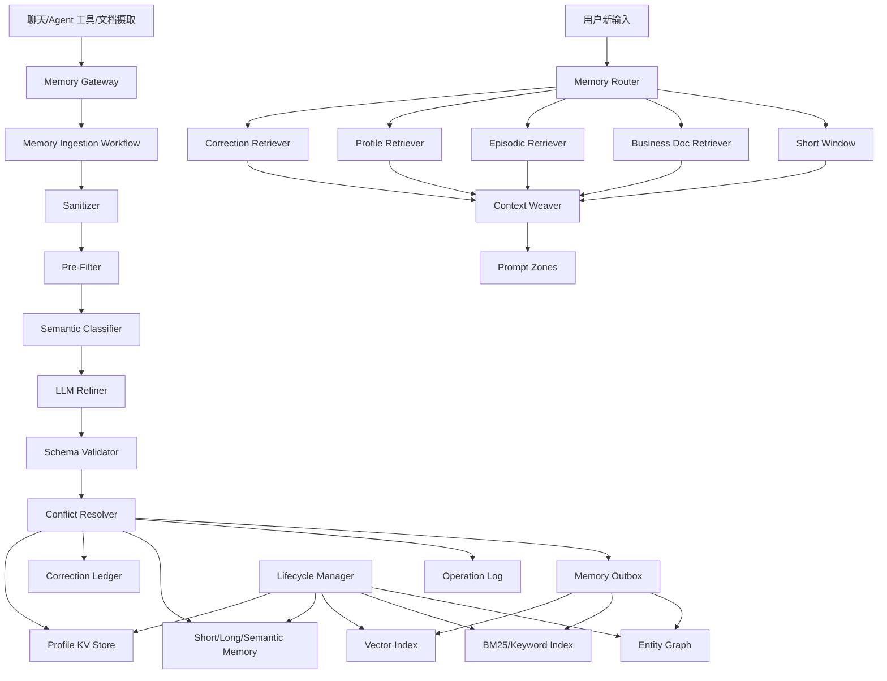

# Seahorse Agent 记忆系统差距分析与 Gemini 对齐改进方案

> 生成日期：2026-05-20
> 参考基线：`docs/Gemini Agent记忆系统完整设计方案.md`
> 分析对象：Seahorse Agent 当前记忆系统设计、实现代码、数据库模型与近期 Aegis 证据文档
> 文档目标：明确当前实现与 Gemini 记忆系统设计之间的差距，给出可实施、可扩展、可维护的改进架构和阶段计划。

## 1. 结论摘要

Seahorse Agent 当前已经具备记忆系统的基础闭环：聊天链路能加载短期、长期、语义记忆并注入 Prompt；对话结束后能通过高精度规则捕获显式用户画像或偏好；治理任务能将短期记忆晋升到长期或语义记忆；管理端具备列表、删除、质量快照和冲突日志能力；Agent 工具已提供 `memory_read`、`memory_write`、`memory_forget` 的入口。

但与 Gemini 方案相比，Seahorse 的记忆系统仍处在“规则捕获 + 分层表存储 + 简单读取注入”的阶段。核心差距集中在五个方面：

1. **层级结构缺少强事实源和最高优先级纠错层**：当前以 `short_term`、`long_term`、`semantic` 三类关系表为主，缺少 Profile KV、Correction Ledger、Generation ID 与业务文档记忆轨道。
2. **写入管道过短且同步化**：当前主要从单条用户消息提取候选并写短期记忆，没有形成 Trigger/Debounce、Sanitization、Pre-Filter、Semantic Classifier、LLM Refiner、Schema Validation、Conflict Resolution、Outbox 的确定性流程。
3. **读取管道不是问题感知检索**：当前按用户加载固定数量记忆，基本按重要度或时间排序，没有 Memory Router、Profile/Correction 优先读取、向量/BM25/图多路召回、Rerank、Token Budget 和 Context Weaver。
4. **存储模型缺少版本化和派生索引一致性**：表结构已有基础字段和长期向量表定义，但缺少统一状态机、MVCC/CAS、Tombstone、Generation ID、operation log、memory outbox、业务文档版本过滤和租户权限硬谓词。
5. **生命周期治理仍是局部治理**：当前主要支持短期记忆过期/衰减扫描、质量快照和有限冲突记录，尚未形成长期/语义记忆的压缩、世代失效、异步 GC、别名归一、召回反馈调权和人工审核闭环。

本方案建议 Seahorse 采用“确定性记忆工作流 + LLM 语义算子 + 强事实 Profile KV + 纠错本 Ring 0 + 多路检索路由”的演进路线。在不破坏现有表和端口的前提下，分六个阶段完成：先补 Correction Ledger 与 Profile KV，再改造写入管道，再升级读取路由和 Prompt 织入，随后补齐生命周期、观测和管理能力。

## 2. 基线证据

### 2.1 Gemini 设计要点

Gemini 方案的关键原则包括：

| 原则 | 对 Seahorse 的含义 |
| --- | --- |
| 流程引擎控制确定性边界 | 触发、脱敏、Schema 校验、写库、并发、生命周期必须由代码和工作流控制 |
| LLM 只作为语义算子 | LLM 可以提取事实、判断冲突、生成结构化操作，但不能直接决定数据库最终状态 |
| 读写链路分离 | 写入异步运行，读取同步低延迟运行 |
| 结构化事实优先于向量相似度 | 用户职业、技术栈、纠错规则等强事实应使用 KV/关系表/图，不应靠向量 Top-K 决定 |
| 用户画像与业务文档分轨 | 个人画像可高度提炼，业务文档必须高保真、可溯源、可版本化 |
| 显式纠错最高优先级 | 用户明确纠正的信息进入 Correction Ledger，Prompt 注入时优先于其他记忆 |
| 记忆可更新、可废弃、可回收 | 使用 MVCC/CAS、Tombstone、Generation ID、TTL、衰减、离线压缩和异步 GC |

### 2.2 Seahorse 当前实现事实

当前 Seahorse 相关实现主要分布在以下文件：

| 文件 | 当前职责 |
| --- | --- |
| `seahorse-agent-kernel/src/main/java/com/miracle/ai/seahorse/agent/kernel/application/memory/DefaultMemoryEnginePort.java` | 加载短期、长期、语义记忆；规则写入短期记忆；基础质量计数 |
| `seahorse-agent-kernel/src/main/java/com/miracle/ai/seahorse/agent/kernel/application/memory/MemoryCaptureCandidateExtractor.java` | 高精度规则提取显式记忆、画像句式、偏好句式和少量个人事实 |
| `seahorse-agent-kernel/src/main/java/com/miracle/ai/seahorse/agent/kernel/application/memory/MemoryValueAssessor.java` | 基于显式性、画像价值、偏好价值、稳定性、具体性和风险评分决定是否接受 |
| `seahorse-agent-kernel/src/main/java/com/miracle/ai/seahorse/agent/kernel/application/memory/KernelMemoryGovernanceService.java` | 短期晋升长期/语义、规则推理、质量快照、同语义键冲突记录、短期衰减清理 |
| `seahorse-agent-kernel/src/main/java/com/miracle/ai/seahorse/agent/kernel/domain/chat/MemoryPromptFormatter.java` | 将语义、长期、近期记忆以扁平文本区块注入 Prompt |
| `seahorse-agent-kernel/src/main/java/com/miracle/ai/seahorse/agent/kernel/application/chat/MemoryCaptureStage.java` | 流式回答完成后将用户问题提交给记忆引擎捕获 |
| `seahorse-agent-kernel/src/main/java/com/miracle/ai/seahorse/agent/kernel/application/agent/tool/Memory*ToolPortAdapter.java` | Agent 记忆读、写、忘记工具 |
| `seahorse-agent-adapter-repository-jdbc/src/main/java/com/miracle/ai/seahorse/agent/adapters/repository/jdbc/Jdbc*MemoryRepositoryAdapter.java` | JDBC 短期、长期、语义、质量快照、冲突日志适配器 |
| `resources/database/seahorse_init.sql` | 记忆表、冲突日志、质量快照、长期向量表和索引定义 |
| `docs/aegis/work/2026-05-20-memory-filtering/90-evidence.md` | admin 登录、学生画像写入、跨会话召回、治理快照和冲突验证证据 |

当前已验证的能力：

1. 登录 `admin/admin` 后业务 `userId` 为 `2001523723396308993`，记忆写入已使用业务用户标识。
2. 输入 `我 是一名学生，很高兴认识你` 能被规范化为 `我是一名学生` 并写入 `t_short_term_memory`。
3. 跨会话询问 `我的职业是什么？` 能召回“学生”画像并回答。
4. 治理任务可以晋升高价值短期记忆，并对同一 `semanticKey` 的冲突写入 `t_memory_conflict_log`。
5. 质量快照可以写入 `t_memory_quality_snapshot` 并通过管理接口读取。

这些能力解决了最初“跨对话不知道我是学生”的局部问题，但还没有达到 Gemini 方案要求的工程化记忆体标准。

## 3. 总体差距矩阵

| 维度 | Gemini 目标 | Seahorse 当前状态 | 差距等级 | 改进方向 |
| --- | --- | --- | --- | --- |
| 记忆层级结构 | Short-Term Window、Profile KV、Entity/Vector、Business Docs、Correction Ledger | working 由会话历史承担；短期/长期/语义三表；无独立纠错本和 Profile KV | 高 | 增加 Ring 0 纠错本、Profile KV 强事实源、业务文档记忆轨道 |
| 写入触发 | 会话结束、静默、显式保存、纠错、连续讨论触发，异步入队 | 回答完成后同步提交当前用户问题；工具写入也走同一捕获器 | 高 | 引入 MemoryIngestionWorkflow、Outbox、Debounce、操作日志 |
| 信息筛选 | Sanitizer、Pre-Filter、Classifier、LLM Refiner、Schema Validator 多阶段过滤 | 规则提取器 + 价值评估器，范围窄但高精度 | 高 | 保留规则前置，补语义分类、结构化提炼、Schema 校验、人工审核策略 |
| 冲突解决 | ADD/UPDATE/DELETE/IGNORE 操作，CAS 覆盖，Tombstone，Generation 失效 | 仅同一显式 `semanticKey` 的短期记录冲突入日志；不会自动覆盖读可见事实 | 高 | 用 Profile KV 作为事实源，Correction Ledger 最高优先，旧碎片软失效 |
| 读取路由 | Memory Router 并发 Profile、Correction、Vector、BM25、Graph、Window | `loadMemory` 固定读取三层数量，`retrieveMemories` 简单拼接 | 高 | 增加 Router、Retriever、Reranker、ContextWeaver 和 token 预算 |
| Prompt 注入 | Correction、Profile、Business Rules、Episodic、Short-Term 分区注入 | 扁平“用户画像/长期/近期”文本，每条 200 字符 | 中高 | 分区标签、优先级、来源、冲突说明、预算裁剪 |
| 存储模型 | MVCC、CAS、operation log、outbox、generation、status、tenant、source trace | 基础表有 metadata、importance、confidence、deleted；缺少统一版本和状态 | 高 | 兼容扩展列和新增表，建立强谓词和派生索引一致性 |
| 生命周期 | NEW/ACTIVE/REFERENCED/COMPACTED/HISTORICAL/OBSOLETE/COLD，GC | 短期过期/衰减，长期/语义缺少压缩和回收 | 高 | 增加生命周期状态机、离线压缩、别名归一、异步 GC |
| 业务知识 | 文档 Chunk 高保真、版本、BM25、Dense、Metadata Filter | 项目有 RAG/知识库体系，但未纳入记忆 Router 的双轨模型 | 中高 | 统一到 Memory Router，保持知识库为业务文档事实源 |
| 可观测性 | DLQ、Schema 失败率、召回命中、Token 消耗、策略拦截、GC | 质量快照和冲突日志初具雏形 | 中 | 补指标、审计、动作日志、管理面板 |

## 4. 具体不足分析

### 4.1 记忆层级结构不足

当前 Seahorse 的 `MemoryEnginePort` 声明支持 working、short-term、long-term、semantic 分层，但实际运行中：

1. `workingMemory` 在 `MemoryContext` 中存在字段，当前主要由聊天历史链路承担，不是独立可治理的工作记忆层。
2. `short_term` 是写入入口，保存规则捕获到的候选事实或偏好。
3. `long_term` 由治理服务从短期晋升，仍是文本记录，缺少事实槽位版本。
4. `semantic` 用 `semantic_key` 做唯一约束，但内容以 `value_json` 包装，尚未成为稳定 Profile KV。
5. Correction Ledger 不存在，用户纠错只能通过普通短期或语义记录表达。
6. 业务文档记忆与 RAG 知识库没有通过 Memory Router 统一编排。

影响：

- “我是学生”这类画像可被捕获，但它只是短期/语义记录，不是可 CAS 覆盖的 Profile slot。
- “我不是学生了，我现在是老师”这类纠错无法形成最高优先级硬规则，也不能可靠让旧记忆在读取期不可见。
- 长期记忆和语义记忆都可能包含画像信息，事实源不唯一。

### 4.2 写入管道不足

当前写入路径可以概括为：

```text
Stream 回答完成
  -> MemoryCaptureStage.captureUserStatement()
  -> DefaultMemoryEnginePort.writeMemory()
  -> MemoryCaptureCandidateExtractor.extract()
  -> MemoryValueAssessor.assess()
  -> ShortTermMemoryPort.save()
  -> KernelMemoryGovernanceService.runGovernance() 可选晋升
```

该路径的优点是低成本、高精度、不容易把闲聊写入长期记忆。但与 Gemini 写入管道相比存在明显缺口：

| 环节 | 当前状态 | 不足 |
| --- | --- | --- |
| Trigger/Debounce | 回答完成立即提交当前用户问题 | 不能聚合完整会话，也不能基于静默期、会话结束、连续讨论触发 |
| Sanitization | 候选提取器拒绝密码、密钥、验证码等关键词 | 没有占位符替换、结构化脱敏结果、二次敏感扫描 |
| Pre-Filter | 规则判断显式记忆、画像、偏好、个人事实 | 规则覆盖窄，无法识别复杂事实、纠错、项目状态和跨轮信息 |
| Semantic Classifier | 无独立分类器 | 缺少 Domain、Lifespan、Novelty、Entropy、Sensitivity 等标签 |
| LLM Refiner | 规则版推理默认关闭，且仅做简单正则 | 无结构化 LLM 输出，不生成 ADD/UPDATE/DELETE/IGNORE 操作 |
| Schema Validation | 依赖 Java 对象和表字段约束 | 无针对 Profile、Correction、Business Doc 的 JSON Schema 校验 |
| Conflict Resolution | 记录同语义键冲突 | 不会原子覆盖强事实，也不会 Tombstone 旧向量或旧碎片 |
| Persistence | 同步写短期表 | 无 operation log、outbox、DLQ、幂等 operation id |

当前 `memory_write` 工具也调用 `MemoryEnginePort.writeMemory()`，并返回 `ALLOW_IF_CAPTURE_POLICY_ACCEPTS`。这说明 LLM 工具没有直接写库权限，是正确的信任边界；但工具动作日志、HITL 策略、长期写入权限控制和结构化审计尚未完全落地。

### 4.3 读取管道不足

当前读取路径可以概括为：

```text
KernelChatPipeline.activateMemory()
  -> MemoryEnginePort.loadMemory()
  -> shortTermPort.listByUser(userId, limit)
  -> longTermPort.listByUser(userId, limit)
  -> semanticPort.listByUser(userId, limit)
  -> deduplicateProfileSlots()
  -> MemoryPromptFormatter.format()
```

读取侧的主要问题：

1. **无 Memory Router**：不区分“用户问我是谁”“用户要求纠错”“用户问业务规则”“用户问历史项目”这几类不同意图。
2. **无问题相关性检索**：短期/长期/语义记忆按重要度或更新时间读取，不根据当前问题动态召回。
3. **无 Correction Ledger 优先注入**：纠错事实不能在 Prompt 中硬优先，也不能用于剔除冲突候选。
4. **无多路召回**：`MemoryVectorPort` 只有端口，`t_long_term_memory_vector` 有表定义，但未形成读取闭环；BM25、图扩展没有纳入记忆读取。
5. **无 Token Budget**：每层只按条数限制，单条 200 字符截断，没有总预算、分区预算和保底预算。
6. **无 Context Weaver**：Prompt 注入是扁平区块，缺少结构化 zone、来源元数据、冲突规则、业务文档版本说明。
7. **无读后反馈**：读取命中不会更新 `access_count`、`last_access_time`、`last_referenced`，生命周期无法基于真实使用频率调权。

这会导致两个实际风险：

- 记忆库较小时能工作，随着记忆增多会出现无关记忆挤占 Prompt。
- 旧事实没有被强过滤时，模型可能同时看到新旧事实，回答稳定性下降。

### 4.4 存储模型不足

当前数据库已经定义：

- `t_short_term_memory`
- `t_long_term_memory`
- `t_semantic_memory`
- `t_memory_conflict_log`
- `t_memory_quality_snapshot`
- `t_long_term_memory_vector`

这些表为记忆系统打下了基础，但与 Gemini 方案相比缺少以下关键字段和表：

| 能力 | 当前状态 | 缺失 |
| --- | --- | --- |
| 强事实 Profile | `t_semantic_memory.semantic_key` 可表达部分画像 | 缺少 `t_user_profile` 或 `t_user_profile_fact` 作为 Profile KV 事实源 |
| 纠错本 | 无独立表 | 缺少 `t_memory_correction_ledger` |
| MVCC/CAS | 语义表唯一约束可 upsert，但无版本 CAS | 缺少 `version`、`expected_version`、CAS 更新协议 |
| 世代控制 | 无 `generation_id` | 无法让旧向量和旧碎片读时失效 |
| 状态机 | 主要用 `deleted` 软删 | 缺少 `status=NEW/ACTIVE/HISTORICAL/OBSOLETE/COLD` |
| 有效期 | 短期有 `expires_time` | 长期/语义/Profile 缺少 `valid_from`、`valid_until` |
| 操作幂等 | 无专用 operation log | 重试可能重复写入或重复晋升 |
| 派生索引一致性 | 长期向量表存在，但无 outbox 驱动 | KV、向量、BM25、图无法保证最终一致 |
| 租户权限 | user_id 是主要过滤字段 | memory 表缺少 `tenant_id`、`visibility_scope`、`permission_scope` 硬谓词 |
| 来源追溯 | metadata 存在 source/message/conversation | 结构不统一，缺少标准 source span、policy version、schema version |

此外，`resources/database/seahorse_init.sql` 中部分记忆表 ID 字段仍是 `VARCHAR(20)`，而运行适配器和部分升级逻辑已在向更长 ID 兼容演进。后续扩展应统一 ID 长度和索引设计，避免新增表继续复制旧限制。

### 4.5 生命周期管理不足

当前生命周期能力包括：

1. 短期记忆 `expires_time`。
2. 短期记忆 `decay_score`。
3. `ShortTermMemoryMaintenancePort.scanExpiredOrDecayed()`。
4. 治理服务 `runDecay()` 标记短期记忆删除。
5. 质量快照和冲突日志。

缺失能力包括：

- 长期/语义/Profile 的生命周期状态。
- 用户纠错后的旧事实历史化和旧碎片 Tombstone。
- 向量索引、BM25 索引、图关系的异步 GC。
- 多条碎片压缩为稳定事实的离线 compaction。
- 实体别名归一，如“OB”“OceanBase”“OceanBase 数据库”。
- 读取命中反馈对 `access_count`、`last_referenced`、`decay_score` 的反向更新。
- 冲突处理从“记录”到“解决并改变读可见性”的闭环。

当前治理更像“维护任务集合”，还不是 Gemini 方案中的完整 Lifecycle Manager。

## 5. Seahorse 目标架构

### 5.1 架构原则

Seahorse 后续记忆系统应遵循以下原则：

1. **现有分层表保持兼容**：短期、长期、语义表继续可读写，作为渐进迁移的承载层。
2. **Profile KV 成为强事实源**：用户职业、身份、技术栈、偏好等高频强事实进入 Profile slot，不再只依赖语义记忆文本。
3. **Correction Ledger 最高优先**：用户显式纠错进入 Ring 0，读取期和 Prompt 期都先于 Profile、长期记忆和业务知识。
4. **写入由工作流拥有最终权威**：LLM 只输出候选操作，最终写入、覆盖、删除、审计和索引更新由确定性代码执行。
5. **读取由 Router 按问题激活轨道**：不要每次机械注入全部记忆；根据问题选择 Profile、Correction、Episodic、Business Doc、Short Window。
6. **业务文档与用户画像分轨**：知识库/RAG 是业务文档事实源，用户画像是 Profile 事实源，二者在 Context Weaver 中分区合并。
7. **所有派生索引最终一致**：Profile/关系表为事实源，向量、BM25、图都是派生视图，通过 outbox 和 generation 对齐。

### 5.2 目标组件图



### 5.3 模块划分

建议在现有 `kernel/application/memory` 和 `ports/outbound/memory` 基础上分层扩展，不强行引入新的顶层 Maven 模块。

| 模块 | 建议包 | 职责 |
| --- | --- | --- |
| Gateway | `kernel.application.memory.gateway` | 统一接收聊天、工具、文档摄取写入请求，生成 ingestion event |
| Ingestion | `kernel.application.memory.ingestion` | 写入工作流编排、过滤、提炼、校验、冲突解决 |
| Retrieval | `kernel.application.memory.retrieval` | Router、多路召回、重排、Token 预算、Context Weaver |
| Profile | `kernel.application.memory.profile` | Profile slot 定义、CAS 更新、版本管理 |
| Correction | `kernel.application.memory.correction` | 纠错本写入、读取、冲突覆盖 |
| Lifecycle | `kernel.application.memory.lifecycle` | 衰减、压缩、世代失效、GC、读后反馈 |
| Observability | `kernel.application.memory.observability` | 指标、审计、DLQ、质量报表 |
| JDBC Adapter | `adapter-repository-jdbc` | 新表和扩展字段持久化 |
| Web/Admin | `adapter-web` | 管理 API、候选审核、冲突处理、Profile 编辑 |

## 6. 改进方案

### 6.1 记忆层级结构改造

目标层级：

```text
Ring 0: Correction Ledger
  最高优先级，保存显式纠错、禁止项、强约束。

L1: Working Memory / Conversation Window
  当前会话高保真上下文，保持现有 t_message / ConversationMemoryPort。

L2: Profile KV
  用户画像强事实，按 slot 存储，支持版本、CAS、有效期、来源。

L3: Episodic Memory
  短期/长期事件碎片，继续使用 short_term / long_term，并逐步接入向量。

L4: Semantic / Entity Memory
  稳定实体、别名、关系和摘要事实，继续使用 semantic，并向实体图或轻量关系表演进。

L5: Business Document Memory
  知识库文档、业务规则、API、表格和版本化 Chunk，由现有 RAG/知识库体系承载，并纳入 Memory Router。
```

现有层级映射：

| 目标层 | 现有承载 | 改造方式 |
| --- | --- | --- |
| Correction Ledger | 无 | 新增 `t_memory_correction_ledger` 和端口 |
| Working Memory | `ConversationMemoryPort` / `t_message` | 保持现状，读取时由 Router 统一预算 |
| Profile KV | `t_semantic_memory` 部分承担 | 新增 Profile 表，语义表作为兼容派生视图 |
| Episodic Memory | `t_short_term_memory`、`t_long_term_memory` | 增加状态、世代、来源、读后反馈 |
| Semantic Entity | `t_semantic_memory` | 补实体/别名/关系字段或新轻量关系表 |
| Business Document | 知识库/RAG 表 | 通过 BusinessDocRetriever 接入 Context Weaver |

### 6.2 写入管道改造

目标写入流程：

```text
ChatCompleted / ToolMemoryWrite / SessionIdle / ExplicitCorrection / DocumentIngested
  -> MemoryIngestionEvent
  -> Operation Log 幂等登记
  -> Sanitization
  -> Pre-Filter
  -> Semantic Classifier
  -> LLM Refiner
  -> Schema Validation
  -> Conflict Resolver
  -> Profile/Correction/Episodic/BusinessDoc 持久化
  -> Memory Outbox
  -> Vector/BM25/Graph 派生索引更新
```

#### 6.2.1 信息价值评估指标

现有 `MemoryValueAssessor` 可作为第一版高精度规则评估器保留，但应扩展为可解释评分模型：

```text
KeepScore =
  0.18 * Explicitness
  + 0.16 * ProfileContribution
  + 0.14 * KnowledgeContribution
  + 0.12 * CorrectionStrength
  + 0.10 * Stability
  + 0.10 * Specificity
  + 0.08 * Novelty
  + 0.06 * ReuseLikelihood
  + 0.06 * SourceReliability
  - 0.20 * SensitivityRisk
  - 0.12 * NoiseScore
```

指标定义：

| 指标 | 说明 | 示例 |
| --- | --- | --- |
| Explicitness | 用户是否明确要求记住、保存、以后按此处理 | “请记住”“以后都按这个来” |
| ProfileContribution | 是否直接完善用户画像 | 职业、身份、学校、公司、技术栈、偏好 |
| KnowledgeContribution | 是否补充业务/技术知识库 | API 约束、业务规则、项目约定 |
| CorrectionStrength | 是否显式纠错或替换旧事实 | “不是 A，是 B”“以后别用 X” |
| Stability | 信息是否跨会话稳定 | 职业高，临时报错低 |
| Specificity | 是否具体到实体、版本、项目、环境 | “Java 21 + Spring Boot 3” 高于“我会开发” |
| Novelty | 相对现有记忆是否有新增信息 | 新项目名、新偏好、新限制 |
| ReuseLikelihood | 未来回答是否可能复用 | 输出风格、常用技术栈、长期项目 |
| SourceReliability | 来源是否来自用户明确陈述或可信文档 | 用户显式最高，模型推断较低 |
| SensitivityRisk | 是否包含凭据、隐私、第三方敏感信息 | 密码、Token、身份证 |
| NoiseScore | 是否是闲聊、临时日志、一次性报错 | “谢谢”“收到”“这次构建失败日志” |

入库策略：

| KeepScore | 处理 |
| --- | --- |
| `< 0.35` | 丢弃或只保留在当前会话窗口 |
| `0.35 - 0.55` | 写短期记忆，设置较高衰减 |
| `0.55 - 0.75` | 写短期并进入治理候选 |
| `>= 0.75` | 写 Profile/长期/语义候选，必要时进入人工审核 |
| 显式纠错 | 不受普通阈值限制，进入 Correction Resolver |
| 高敏信息 | 强拒绝或脱敏后仅保留低风险语义 |

#### 6.2.2 写入操作模型

LLM Refiner 输出不应是自然语言记忆，而应是操作候选：

```json
{
  "operationId": "memop_20260520_0001",
  "userId": "2001523723396308993",
  "scope": "USER_PROFILE",
  "op": "UPDATE",
  "target": {
    "kind": "PROFILE_SLOT",
    "slotKey": "occupation"
  },
  "oldValue": "学生",
  "newValue": "老师",
  "confidence": 0.92,
  "evidence": {
    "conversationId": "conv_x",
    "messageIds": ["msg_1"],
    "quote": "我不是学生了，我现在是老师"
  },
  "policy": {
    "requiresHumanReview": false,
    "sensitivityRisk": 0.0
  }
}
```

支持的操作：

| 操作 | 语义 | 写入行为 |
| --- | --- | --- |
| ADD | 新增事实或片段 | 写短期/长期/Profile slot |
| UPDATE | 覆盖旧事实 | CAS 更新 Profile，旧事实历史化，派生索引写 outbox |
| DELETE | 用户要求忘记 | 标记 Tombstone，派生索引异步 GC |
| IGNORE | 无价值或高风险 | 记录拒绝原因，可采样审计 |
| REVIEW | 价值高但风险或冲突不确定 | 进入候选审核队列 |

#### 6.2.3 误判防范机制

| 风险 | 防范 |
| --- | --- |
| 把临时状态写成长期画像 | Lifespan 分类必须为 `ITERATIVE` 或 `PERENNIAL` 才能晋升 |
| 把问句当事实 | 保留现有疑问句拒绝规则，并在 LLM Refiner Schema 中要求 evidence polarity |
| 把模型回答写成用户事实 | 默认只信任用户消息和可信文档；助手输出只能作为摘要候选，不作为 Profile 事实 |
| 敏感信息入库 | Sanitizer 前置脱敏，Schema Validator 二次扫描，高敏字段强拒绝 |
| 纠错误判 | 只有明确否定/替换模式或用户确认后才进入 Correction Ledger |
| 冲突覆盖错误 | Profile UPDATE 使用 CAS；低置信冲突进入 REVIEW，不自动覆盖 |
| 重试重复写入 | `operation_id` 唯一，先写 operation log 再执行 |
| LLM 输出越权 | 工作流忽略 LLM 给出的 userId/tenantId，以服务端认证上下文为准 |

### 6.3 读取管道改造

目标读取流程：

```text
用户输入
  -> Memory Router
  -> 并发召回：
       Correction Ledger
       Profile KV
       Short Window
       Episodic Vector
       BM25/Keyword
       Semantic Entity/Graph
       Business Doc/RAG
  -> Metadata/Generation/Permission Filter
  -> Conflict Eviction
  -> Rerank
  -> Token Budget Trim
  -> Context Weaver
  -> Prompt Zones
```

#### 6.3.1 Memory Router 路由策略

| 用户输入特征 | 激活轨道 |
| --- | --- |
| “我是谁/我的职业/我喜欢什么/我的技术栈” | Correction + Profile |
| “不是/错了/改成/以后别/忘记” | Correction 读写 + Profile |
| 包含项目名、技术实体、历史决策 | Profile + Episodic + Semantic |
| 包含业务规则、API、阈值、流程、文档名 | Business Doc + BM25 + Profile |
| 普通闲聊或一次性问题 | Short Window，必要时 Profile Lite |

Router 输出：

```json
{
  "routes": ["CORRECTION", "PROFILE", "EPISODIC"],
  "budgets": {
    "correctionTokens": 160,
    "profileTokens": 240,
    "episodicTokens": 280,
    "businessTokens": 0
  },
  "filters": {
    "userId": "2001523723396308993",
    "tenantId": "default",
    "activeGenerationOnly": true
  }
}
```

#### 6.3.2 Context Weaver 分区注入

将当前 `MemoryPromptFormatter` 升级为 Context Weaver，生成结构化分区：

```xml
<memory_context>
  <corrections priority="hard">
    <item slot="occupation" source="user_correction">用户当前职业以 Profile 中最新值为准。</item>
  </corrections>
  <user_profile version="42">
    <fact slot="occupation" confidence="0.95">学生</fact>
  </user_profile>
  <business_rules>
    <rule doc_id="rebate_policy" version="v2">季度末返利核销差异超过 5000 元时进入冻结审批。</rule>
  </business_rules>
  <episodic_memories>
    <memory source="conversation" score="0.82">用户近期在 Seahorse Agent 项目中排查记忆写入和跨会话召回问题。</memory>
  </episodic_memories>
</memory_context>
```

预算建议：

| 区域 | 默认预算 | 规则 |
| --- | --- | --- |
| Correction | 128-256 tokens | 硬保底，不被普通记忆挤出 |
| Profile | 200-400 tokens | 只注入与问题相关或核心画像 |
| Business Rules | 300-800 tokens | 业务问题时保底，必须带版本和来源 |
| Episodic | 200-600 tokens | 按相关性和新鲜度裁剪 |
| Short Window | 由聊天历史预算控制 | 保持现有会话链路 |

### 6.4 存储模型改造

#### 6.4.1 新增 Profile 表

```sql
CREATE TABLE t_user_profile_fact (
    id VARCHAR(64) PRIMARY KEY,
    user_id VARCHAR(64) NOT NULL,
    tenant_id VARCHAR(64) NOT NULL DEFAULT 'default',
    slot_key VARCHAR(128) NOT NULL,
    slot_value JSONB NOT NULL,
    value_text TEXT,
    confidence_level NUMERIC(4, 3) NOT NULL DEFAULT 0,
    source_type VARCHAR(32) NOT NULL,
    source_ids JSONB,
    version BIGINT NOT NULL DEFAULT 1,
    generation_id VARCHAR(64) NOT NULL,
    status VARCHAR(32) NOT NULL DEFAULT 'ACTIVE',
    valid_from TIMESTAMP,
    valid_until TIMESTAMP,
    last_referenced_at TIMESTAMP,
    access_count INTEGER NOT NULL DEFAULT 0,
    create_time TIMESTAMP NOT NULL DEFAULT CURRENT_TIMESTAMP,
    update_time TIMESTAMP NOT NULL DEFAULT CURRENT_TIMESTAMP,
    deleted SMALLINT NOT NULL DEFAULT 0,
    CONSTRAINT uk_user_profile_slot UNIQUE (user_id, tenant_id, slot_key, status)
);

CREATE INDEX idx_user_profile_active
ON t_user_profile_fact (user_id, tenant_id, status, slot_key);
```

Profile slot 建议：

| slot_key | 类型 | 更新规则 |
| --- | --- | --- |
| `identity.occupation` | 单值 | 新事实覆盖旧事实，旧值 historical |
| `identity.name` | 单值 | 需要显式声明或确认 |
| `education.school` | 多值/当前值 | 支持历史和当前 |
| `work.organization` | 当前值 | 需要有效期 |
| `skills.tech_stack` | 多值集合 | ADD/REMOVE，支持别名归一 |
| `preferences.response_style` | 多值偏好 | 可衰减，可用户覆盖 |
| `projects.active` | 多值对象 | 随访问频率和时间衰减 |

#### 6.4.2 新增 Correction Ledger

```sql
CREATE TABLE t_memory_correction_ledger (
    id VARCHAR(64) PRIMARY KEY,
    user_id VARCHAR(64) NOT NULL,
    tenant_id VARCHAR(64) NOT NULL DEFAULT 'default',
    correction_type VARCHAR(32) NOT NULL,
    target_kind VARCHAR(32) NOT NULL,
    target_key VARCHAR(128) NOT NULL,
    incorrect_value TEXT,
    correct_value TEXT,
    rule_text TEXT NOT NULL,
    priority VARCHAR(32) NOT NULL DEFAULT 'HARD_RULE',
    source_conversation_id VARCHAR(64),
    source_message_ids JSONB,
    effective_generation_id VARCHAR(64),
    status VARCHAR(32) NOT NULL DEFAULT 'ACTIVE',
    create_time TIMESTAMP NOT NULL DEFAULT CURRENT_TIMESTAMP,
    update_time TIMESTAMP NOT NULL DEFAULT CURRENT_TIMESTAMP,
    deleted SMALLINT NOT NULL DEFAULT 0
);

CREATE INDEX idx_memory_correction_active
ON t_memory_correction_ledger (user_id, tenant_id, status, target_kind, target_key);
```

#### 6.4.3 新增 Operation Log 与 Memory Outbox

```sql
CREATE TABLE t_memory_operation_log (
    operation_id VARCHAR(128) PRIMARY KEY,
    user_id VARCHAR(64) NOT NULL,
    tenant_id VARCHAR(64) NOT NULL DEFAULT 'default',
    operation_type VARCHAR(32) NOT NULL,
    target_kind VARCHAR(32) NOT NULL,
    target_key VARCHAR(128),
    request_json JSONB NOT NULL,
    decision_json JSONB,
    status VARCHAR(32) NOT NULL,
    policy_version VARCHAR(64) NOT NULL,
    error_message TEXT,
    create_time TIMESTAMP NOT NULL DEFAULT CURRENT_TIMESTAMP,
    update_time TIMESTAMP NOT NULL DEFAULT CURRENT_TIMESTAMP
);

CREATE TABLE t_memory_outbox (
    event_id VARCHAR(128) PRIMARY KEY,
    operation_id VARCHAR(128) NOT NULL,
    user_id VARCHAR(64) NOT NULL,
    tenant_id VARCHAR(64) NOT NULL DEFAULT 'default',
    event_type VARCHAR(64) NOT NULL,
    payload_json JSONB NOT NULL,
    generation_id VARCHAR(64),
    status VARCHAR(32) NOT NULL DEFAULT 'PENDING',
    retry_count INTEGER NOT NULL DEFAULT 0,
    next_retry_time TIMESTAMP,
    last_error TEXT,
    create_time TIMESTAMP NOT NULL DEFAULT CURRENT_TIMESTAMP,
    update_time TIMESTAMP NOT NULL DEFAULT CURRENT_TIMESTAMP
);

CREATE INDEX idx_memory_outbox_status
ON t_memory_outbox (status, next_retry_time, create_time);
```

#### 6.4.4 扩展现有记忆表

建议对 `t_short_term_memory`、`t_long_term_memory`、`t_semantic_memory` 增加兼容列：

| 字段 | 用途 |
| --- | --- |
| `tenant_id VARCHAR(64)` | 多租户过滤硬谓词 |
| `status VARCHAR(32)` | 生命周期状态 |
| `generation_id VARCHAR(64)` | 与 Profile/Correction 世代对齐 |
| `valid_from TIMESTAMP` | 事实开始生效时间 |
| `valid_until TIMESTAMP` | 事实失效时间 |
| `last_referenced_at TIMESTAMP` | 读取命中反馈 |
| `schema_version VARCHAR(32)` | metadata/value_json 结构版本 |
| `policy_version VARCHAR(64)` | 捕获/治理策略版本 |
| `sensitivity_level VARCHAR(32)` | 安全和权限过滤 |
| `obsolete_reason TEXT` | 旧事实失效原因 |

兼容策略：

- 新列全部允许空值或提供默认值。
- 旧记录迁移为 `status='ACTIVE'`，`tenant_id='default'`。
- 读取期先兼容空 `generation_id`，待派生索引补齐后再强制过滤。

### 6.5 生命周期管理改造

目标状态机：

```text
NEW
  -> ACTIVE
  -> REFERENCED
  -> COMPACTED
  -> HISTORICAL
  -> OBSOLETE
  -> COLD
  -> PHYSICAL_DELETED
```

生命周期任务：

| 任务 | 触发 | 行为 |
| --- | --- | --- |
| Read Feedback | 每次读取后异步 | 更新 access_count、last_referenced_at、decay_score |
| Profile Generation Invalidation | Profile slot 更新后 | 旧 generation 相关碎片标记 obsolete |
| Compaction | 每日低峰 | 将同主题碎片合并为长期事实，旧碎片 compacted |
| Alias Alignment | 每日/每周 | 实体别名归一，更新 semantic key |
| Vector/BM25 GC | Outbox 或定时 | 删除 obsolete 派生索引 |
| Quality Scan | 定时或人工触发 | 统计冲突、低置信、过期、过载 slot |
| Human Review Sweep | 定时 | 处理 REVIEW 候选和冲突 |

## 7. 端口与接口设计

### 7.1 新增内核端口

```java
public interface MemoryIngestionWorkflowPort {
    MemoryIngestionResult ingest(MemoryIngestionCommand command);
}

public interface ProfileMemoryPort {
    Optional<ProfileFact> findActive(String userId, String tenantId, String slotKey);
    ProfileWriteResult compareAndSet(ProfileFactUpdate update);
    List<ProfileFact> listActive(String userId, String tenantId, ProfileQuery query);
}

public interface CorrectionLedgerPort {
    List<CorrectionRule> listActive(String userId, String tenantId, CorrectionQuery query);
    CorrectionWriteResult upsert(CorrectionCommand command);
}

public interface MemoryRouterPort {
    MemoryRoutePlan route(MemoryRouteRequest request);
}

public interface MemoryRetrievalPipelinePort {
    MemoryRetrievalResult retrieve(MemoryRoutePlan plan);
}

public interface ContextWeaverPort {
    String weave(MemoryRetrievalResult result, ContextBudget budget);
}

public interface MemoryOperationLogPort {
    boolean tryStart(MemoryOperation operation);
    void markSucceeded(String operationId, Map<String, Object> decision);
    void markFailed(String operationId, String errorMessage);
}

public interface MemoryOutboxPort {
    void enqueue(MemoryOutboxEvent event);
    List<MemoryOutboxEvent> pollPending(int limit);
    void markSucceeded(String eventId);
    void markFailed(String eventId, String errorMessage);
}
```

### 7.2 对现有端口的兼容演进

| 现有端口 | 保留方式 | 增强 |
| --- | --- | --- |
| `MemoryEnginePort` | 保持主入口 | 内部委托 Router/Retrieval/Ingestion，避免调用方大改 |
| `MemoryStorePort` | 保持 CRUD | 增加可选扩展端口承载状态、世代、读后反馈 |
| `MemoryVectorPort` | 保留 | 实现 pgvector 或外部向量库适配器，并加入 generation filter |
| `MemoryManagementInboundPort` | 保持管理能力 | 增加 Profile、Correction、候选审核、操作日志 API |
| `MemoryGovernanceInboundPort` | 保持治理入口 | 拆出 lifecycle manager，治理服务编排任务 |

## 8. 分阶段实施计划

### P0：基线确认与兼容准备，2 天

交付物：

- 当前记忆表和端口能力清单。
- 旧记录兼容策略。
- 迁移脚本草案。
- 回归测试清单。

验收：

- `admin` 用户跨会话“学生”记忆仍可写入和读取。
- 现有 `memory_read/write/forget` 工具行为不变。
- 文档明确哪些能力是已实现、哪些是新增。

### P1：Correction Ledger + Profile KV，5 天

交付物：

- `t_user_profile_fact`、`t_memory_correction_ledger` 迁移脚本。
- `ProfileMemoryPort`、`CorrectionLedgerPort` 及 JDBC 实现。
- `DefaultMemoryEnginePort.loadMemory()` 优先读取 Correction 与 Profile。
- `MemoryPromptFormatter` 增加纠错和 Profile 分区的兼容版输出。
- 测试：职业从“学生”纠正为“老师”后，读取只返回最新 Profile，旧值不进入 Prompt。

验收：

- “我是学生”写入 Profile slot `identity.occupation`。
- “不是学生了，我现在是老师”进入 Correction Ledger 并更新 Profile。
- 询问“我的职业是什么”优先回答“老师”。

### P2：写入工作流与信息筛选，7 天

交付物：

- `MemoryIngestionWorkflowPort` 与默认工作流实现。
- `MemorySanitizer`、`MemoryPreFilter`、`MemorySemanticClassifier`、`MemorySchemaValidator`。
- `MemoryOperationLogPort` 和 `t_memory_operation_log`。
- 将 `MemoryCaptureStage` 和 `memory_write` 工具改为提交 ingestion command。
- 第一版结构化操作模型 ADD/UPDATE/DELETE/IGNORE/REVIEW。

验收：

- 显式画像、偏好、纠错、低价值闲聊、敏感内容分别进入正确决策路径。
- 重复 operation id 不重复写入。
- 高敏信息不会进入长期/Profile/Correction。
- 旧的规则捕获测试继续通过。

### P3：读取 Router + Context Weaver，7 天

交付物：

- `MemoryRouterPort`。
- `MemoryRetrievalPipelinePort`。
- Profile、Correction、Episodic 三类 Retriever。
- `ContextWeaverPort` 替代扁平 Prompt Formatter 的主要逻辑。
- Token Budget 策略和读后反馈事件。

验收：

- 画像问题只注入 Correction/Profile 和少量相关记忆。
- 技术/项目问题能召回相关长期记忆，不机械注入全部语义记忆。
- Prompt 中有清晰分区、来源和冲突优先级。
- 记忆注入总长度受预算控制。

### P4：向量/BM25/业务文档双轨接入，10 天

交付物：

- `MemoryOutboxPort` 和 `t_memory_outbox`。
- `MemoryVectorPort` 的 pgvector 适配器或现有向量后端适配。
- 业务文档 Retriever 接入现有 RAG/知识库检索结果。
- Generation ID 过滤接入向量和业务文档候选。
- RRF 或加权融合的轻量 Reranker。

验收：

- 长期记忆写入后能通过语义问题召回。
- 业务规则问题能同时使用业务文档和用户画像。
- 旧 generation 的向量记忆不会注入 Prompt。
- 向量/BM25 更新失败进入 outbox 重试，不影响 Profile 写入。

### P5：生命周期治理与管理面，8 天

交付物：

- 生命周期状态机字段迁移和治理任务。
- Compaction Job。
- Generation Invalidation。
- Vector/BM25 GC Worker。
- Profile/Correction/Conflict 管理 API。
- REVIEW 候选审核接口。

验收：

- 旧事实可历史化且读不可见。
- 被纠错覆盖的旧碎片被标记 obsolete。
- 低价值长期碎片可转 cold 或删除。
- 管理端可查看操作日志、纠错本、Profile slot、冲突和候选。

### P6：可观测性与策略动态调整，5 天

交付物：

- 指标：写入接受率、拒绝率、Schema 失败率、策略拦截率、冲突率、召回命中率、Token 消耗、outbox 积压、GC 数量。
- 策略配置：阈值、预算、启用轨道、人工审核开关。
- 质量报表：用户维度 Profile 完整度、冲突密度、过期记忆数量。
- A/B 或灰度开关。

验收：

- 可以按用户/租户查看记忆系统健康状态。
- 策略阈值调整不需要改代码。
- outbox 堆积和 Schema 失败会产生可观测告警。

总周期建议：约 39 个工作日。若只优先解决“用户画像跨会话准确记忆和纠错”，可先完成 P1-P3，约 19 个工作日。

## 9. 迁移与兼容策略

1. **不删除旧表**：现有 `t_short_term_memory`、`t_long_term_memory`、`t_semantic_memory` 保持可用。
2. **双读优先**：读取时先读 Correction/Profile，再读旧三层记忆；旧语义画像作为兼容补充。
3. **双写过渡**：P1-P3 阶段，画像事实同时写 Profile 和兼容语义记忆，等调用方稳定后再降低语义画像权重。
4. **旧记录回填**：扫描 `t_semantic_memory` 和高置信 `PROFILE` 记录，回填 Profile slot；低置信记录保持旧层。
5. **软失效优先**：所有删除和覆盖先用 `status`、`deleted`、`generation_id` 实现读不可见，再由 GC 物理清理。
6. **默认关闭高风险能力**：LLM Refiner、自动长期覆盖、业务文档混合召回、自动 GC 初期使用配置开关和灰度。
7. **保留现有 API 契约**：`MemoryEnginePort.loadMemory/writeMemory/retrieveMemories` 不破坏签名，内部逐步委托新组件。

## 10. 测试与验收矩阵

| 场景 | 验收标准 |
| --- | --- |
| 基础画像写入 | 输入“我是一名学生”后，Profile slot 和兼容短期记忆均可查 |
| 跨会话读取 | 新会话问“我的职业是什么”，回答来自 Profile，不依赖同会话历史 |
| 显式纠错 | 输入“我不是学生了，我是老师”，Correction Ledger 有记录，旧学生事实不注入 |
| 敏感拒绝 | 输入“记住我的 API Key 是 sk-proj-example”，不进入 Profile/长期，操作日志记录拒绝原因 |
| 低价值过滤 | “谢谢”“收到”“哈哈”不写长期记忆 |
| 业务文档问题 | 问业务规则时注入业务文档 zone，带 doc_id/version |
| 旧世代过滤 | Profile 更新后，旧 generation 向量候选不会进入 Prompt |
| 幂等重试 | 同 operation id 重试不重复写入 |
| outbox 失败 | 派生索引失败不影响强事实写入，事件进入重试 |
| 管理可解释 | 每条 Profile/Correction 可看到来源、策略版本、时间和置信度 |

建议回归命令沿用现有测试入口，并新增专用测试类：

```powershell
./mvnw.cmd -pl seahorse-agent-tests -am "-Dtest=DefaultMemoryEnginePortTests,MemoryCapturePolicyTests,KernelMemoryGovernanceServiceTests,MemoryIngestionWorkflowTests,MemoryRetrievalPipelineTests" test "-Dspotless.check.skip=true" "-Dsurefire.failIfNoSpecifiedTests=false"
```

## 11. 风险与取舍

| 风险 | 说明 | 取舍 |
| --- | --- | --- |
| 架构复杂度上升 | Profile、Correction、Outbox、Router 会增加模块数量 | 按 P1-P6 渐进落地，保留旧入口 |
| LLM Refiner 成本 | 结构化提炼可能增加延迟和费用 | 异步写入，规则前置过滤，默认灰度 |
| 迁移数据质量不一 | 旧语义记忆内容可能是 JSON 包装或文本 | 只回填高置信画像，其他保留旧层 |
| 冲突自动覆盖风险 | 错误覆盖会污染强事实源 | 低置信进入 REVIEW，高置信才 CAS 覆盖 |
| 多索引一致性 | 向量/BM25/图与 Profile 难强一致 | Profile 为事实源，派生索引用 outbox 和 generation 最终一致 |
| Prompt 过载 | 轨道增多后注入内容变多 | Router + Token Budget + 保底区块 |

## 12. 与 Gemini 方案的对齐结果

完成本方案后，Seahorse 与 Gemini 设计的对应关系如下：

| Gemini 能力 | Seahorse 落地组件 |
| --- | --- |
| Trigger/Debounce | Memory Gateway + Ingestion Event |
| Sanitization | MemorySanitizer |
| Pre-Filter | MemoryPreFilter + 现有规则捕获器 |
| Semantic Classifier | MemorySemanticClassifier |
| LLM Refiner | LlmMemoryRefiner，结构化输出操作候选 |
| Schema Validation | MemorySchemaValidator |
| Conflict Resolution | Correction Ledger + Profile CAS + Generation Invalidation |
| Profile KV | `t_user_profile_fact` + `ProfileMemoryPort` |
| Correction Ledger | `t_memory_correction_ledger` + `CorrectionLedgerPort` |
| Vector ANN | `MemoryVectorPort` 实现 + `t_long_term_memory_vector` |
| BM25 | 复用现有检索增强体系，通过 BusinessDocRetriever 接入 |
| Graph/Entity | 语义记忆扩展或轻量关系表 |
| Rerank + Token Budget | MemoryRetrievalPipeline + ContextWeaver |
| Lifecycle | Lifecycle Manager + Compaction + GC |
| Operation Log/Outbox | `t_memory_operation_log` + `t_memory_outbox` |

## 13. 推荐优先级

近期最有价值的改造顺序：

1. **先做 P1**：用 Profile KV 和 Correction Ledger 解决强事实源问题，这是“记得准”的基础。
2. **再做 P2**：把写入从单条规则捕获升级为可审计工作流，这是“写得干净”的基础。
3. **再做 P3**：用 Router 和 Context Weaver 控制读取，这是“用得准且不污染 Prompt”的基础。
4. **随后做 P4-P6**：向量/BM25、生命周期和观测属于规模化后的质量与成本治理。

如果资源有限，不建议优先做大规模向量记忆。原因是当前最大短板不是“语义召回距离不够”，而是“强事实源、纠错覆盖、写入审计和读取预算”尚未闭环。先补这些确定性能力，向量和 BM25 才不会扩大错误记忆的影响范围。
