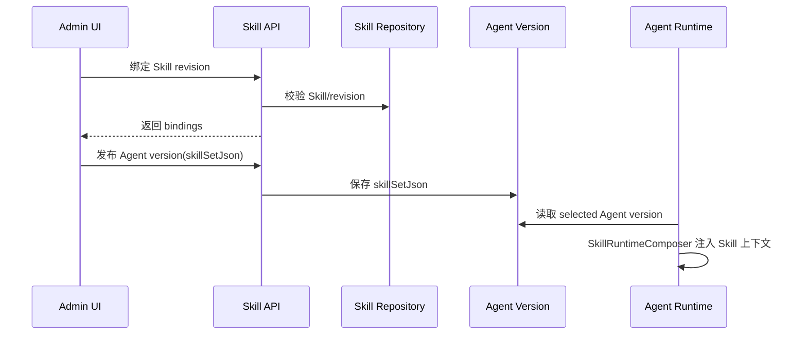

# Chat Skill Selection and Loading Detailed Design

> 本文用于落地“聊天对话框可直接选择 Skill”后的运行时设计决策，并回答是否仍需要按需加载。

## 结论

当前阶段不需要把“运行时按需加载”作为必做能力。

对话框已经能让用户显式选择 Skill，因此 MVP 应采用“显式选择 + 服务端解析 + 本轮消息注入”的确定性方案。按需加载保留为增强能力，用在长 Skill、多 Skill、自动推荐 Skill、token 预算紧张等场景。

也就是说：

- 用户在聊天框选了 Skill，本轮对话就应明确使用该 Skill。
- 服务端必须把本轮选择解析成受控的 `SkillRuntimeBlock`，而不是只把 `@skill-name` 当普通文本。
- 默认加载策略使用 `METADATA_AND_BODY`，直接注入 Skill 正文，保证用户选择马上生效。
- 当 Skill 正文很长、同时选择多个 Skill、或未来进入自动匹配模式时，再切到 `METADATA_ONLY + load_skill`。

## 背景

当前系统里已有三类 Skill 相关入口：

1. `AgentSkillBindingPanel`
   - 管理端为 Agent 绑定 Skill revision。
   - 发布 Agent version 时写入 `skillSetJson`。
   - 运行时通过 `KernelChatInboundService` 读取 version snapshot，并交给 `SkillRuntimeComposer` 注入。

2. `SkillTrigger`
   - 聊天输入框中通过按钮、`@` 或 `/` 选择 Skill。
   - 当前主要效果是把 `@skill-name` 插入输入框文本。
   - 它还不是完整的后端运行时选择协议。

3. `KernelAgentLoop.load_skill`
   - 内核已有 `load_skill` 工具处理逻辑。
   - 只有当 `AgentLoopRequest.skillRuntimeBlocks` 中存在带正文的 Skill 时，模型才能通过工具加载对应内容。
   - 这更适合作为“已选择 Skill 的正文延迟展开”，而不是替代用户显式选择。

## 设计目标

1. 用户选择 Skill 后，本轮请求可确定地应用该 Skill。
2. 不让 Skill 选择绕过 Tool Gateway 或 Agent version 权限边界。
3. 支持聊天框临时 Skill 与 Agent version 固定 Skill 共存。
4. 保持 token 可控，避免一次注入大量长 Skill。
5. 为未来自动推荐和按需加载留扩展点，但不让 MVP 复杂化。

## 非目标

- 不做模型自动判断全库 Skill 并自行加载。
- 不允许用户通过 `@不存在的skill` 注入任意文件内容。
- 不把 Skill 的 `allowed_tools` 变成真实工具授权。
- 不在前端拼完整 Skill 正文发送给后端。

## 核心决策：是否还需要按需加载

### MVP：不强制需要

因为用户已经在对话框里明确选择了 Skill，本轮请求的意图非常清楚。此时最可靠的做法是：

1. 前端发送选中的 Skill 名称或 revision id。
2. 后端校验 Skill 存在、启用、未删除。
3. 后端读取 latest revision 或指定 revision。
4. 后端组装 `SkillRuntimeBlock`。
5. 默认按 `METADATA_AND_BODY` 注入。

这样能避免一个常见问题：用户明明选了 Skill，但模型因为没有主动调用 `load_skill` 而没有使用它。

### 二期：保留按需加载

按需加载仍然有价值，但它应该是优化策略：

- Skill 正文超过单 Skill 预算，例如大于 6000 字符。
- 本轮选择多个 Skill，直接注入会超过总预算。
- 用户没有显式选择，但系统未来做了自动候选推荐。
- Agent version 固定绑定了很多 Skill，但每轮只可能用其中一两个。

二期模式应是：

1. 首轮只注入 Skill name、description、allowed tools、revision id。
2. 暴露 `load_skill` 工具。
3. 模型只有在确实需要时调用 `load_skill({ "name": "..." })`。
4. 后端只允许加载本轮已选择或 Agent version 已绑定的 Skill。

## 运行时加载模式

### 1. 直接注入模式：`METADATA_AND_BODY`

适用：

- 用户在对话框显式选择 Skill。
- Skill 正文不长。
- 选择数量较少，通常 1 到 3 个。
- 需要保证选择立即生效。

行为：

- `SkillRuntimeComposer` 注入 name、revision、description、advisory tools、instructions。
- 单 Skill 正文按 `DEFAULT_PER_SKILL_CHAR_BUDGET` 截断。
- 总 Skill 上下文按 `DEFAULT_TOTAL_CHAR_BUDGET` 截断。

这是默认模式。

### 2. 元数据优先模式：`METADATA_ONLY`

适用：

- 长 Skill。
- 多 Skill。
- 只想让模型知道候选能力，不想立即展开正文。
- 未来自动推荐候选 Skill。

行为：

- prompt 只注入 Skill 元数据。
- `AgentLoopRequest.skillRuntimeBlocks` 仍保留正文。
- `KernelAgentLoop` 暴露 `load_skill`。
- 模型按需调用 `load_skill` 获取正文。

### 3. 混合模式

适用：

- 用户显式选择一个主 Skill，同时系统推荐若干辅助 Skill。

行为：

- 用户显式选择的主 Skill 使用 `METADATA_AND_BODY`。
- 系统推荐或长正文 Skill 使用 `METADATA_ONLY`。

## 端到端数据流

### 当前 Agent version 绑定流



### 新增聊天框本轮选择流

```mermaid
sequenceDiagram
  participant User as User
  participant ChatUI as ChatInput + SkillTrigger
  participant ChatAPI as /rag/v3/chat
  participant SkillRepo as Skill Repository
  participant ChatSvc as KernelChatInboundService
  participant Loop as KernelAgentLoop

  User->>ChatUI: 选择 Skill
  ChatUI->>ChatUI: 记录 selectedSkills
  ChatUI->>ChatAPI: question + selectedSkillNames
  ChatAPI->>ChatSvc: StreamChatCommand(selectedSkillNames)
  ChatSvc->>SkillRepo: 校验并加载 enabled Skill latest revision
  ChatSvc->>ChatSvc: 合并 version-bound skills + per-turn skills
  ChatSvc->>Loop: AgentLoopRequest(skillRuntimeContext, skillRuntimeBlocks)
  Loop->>Loop: 直接注入或暴露 load_skill
```

## API 设计

### 前端请求参数

建议在 `/rag/v3/chat` 增加查询参数：

```http
GET /rag/v3/chat?question=...&selectedSkillNames=deep-research&selectedSkillNames=data-analysis
```

参数：

- `selectedSkillNames: List<String>`
  - 本轮聊天显式选择的 Skill。
  - 后端按名称加载当前 tenant 下 enabled/latest revision。

可选后续增强：

- `selectedSkillRevisionIds: List<String>`
  - 用于用户明确选择历史 revision。
  - MVP 不需要。

不建议仅依赖 `@skill-name` 文本解析，原因：

- 文本可能来自用户普通表达，不一定是选择动作。
- 前端已经知道真实选择项，应直接发送结构化参数。
- 结构化参数更容易做审计、校验和测试。

### 后端命令模型

`StreamChatCommand` 增加：

```java
List<String> selectedSkillNames
```

规范化规则：

- null 视为 `List.of()`。
- trim、lowercase、kebab-case normalization。
- 去重，保留用户选择顺序。
- 最多允许 5 个，超出时报错或截断，建议 MVP 报错。

### Controller

`SeahorseChatController.chat(...)` 增加：

```java
@RequestParam(required = false) List<String> selectedSkillNames
```

并传入 `StreamChatCommand`。

## 后端解析与合并策略

### 解析本轮 Skill

新增应用服务：

```java
ChatSelectedSkillResolver
```

职责：

1. 接收 tenantId、selectedSkillNames。
2. 校验 Skill 存在。
3. 校验 Skill `enabled=true`，`status=ACTIVE`。
4. 加载 latest revision。
5. 生成 `SkillRuntimeBlock`。
6. 根据预算决定 `injectMode`。

### 合并顺序

本轮最终 Skill 集合来源：

1. Agent version `skillSetJson` 中固定绑定的 Skill。
2. 聊天框本轮选择的 Skill。

合并规则：

- key 使用 `skill.name`。
- 如果重名，本轮选择覆盖 version-bound Skill 的 `injectMode`，但 revision 处理需谨慎：
  - MVP：本轮选择 latest revision，覆盖 version-bound revision。
  - 如果业务要求版本绝对确定，则本轮选择只能追加，不能覆盖已有 version-bound skill。

推荐 MVP 选择：

- 对 Consumer Chat：本轮选择 latest revision。
- 对已发布 Agent version：固定绑定仍按 version snapshot。
- 如果同名，优先 version snapshot，避免破坏发布版本确定性。

也就是：

```text
version-bound skill > per-turn selected skill
```

原因：Agent version 是已发布契约，本轮选择不应悄悄改变已绑定 revision。

## 注入策略

### 默认策略

```text
selectedSkillCount <= 3 且 totalContentLength <= 12000:
  METADATA_AND_BODY
否则:
  METADATA_ONLY
```

### 预算

沿用当前：

- 单 Skill：`SkillRuntimeComposer.DEFAULT_PER_SKILL_CHAR_BUDGET = 6000`
- 总 Skill：`SkillRuntimeComposer.DEFAULT_TOTAL_CHAR_BUDGET = 24000`

建议新增配置：

```properties
seahorse-agent.skill.runtime.max-selected-per-turn=5
seahorse-agent.skill.runtime.direct-inject-total-threshold=12000
seahorse-agent.skill.runtime.default-chat-inject-mode=METADATA_AND_BODY
```

## 前端设计

### 当前问题

`SkillTrigger` 当前把选择结果写入文本，如：

```text
@deep-research 请帮我调研...
```

这不够，因为后端无法区分：

- 用户通过 UI 选择了 Skill。
- 用户手打了普通文本。
- 用户提到了一个不存在或无权限的 Skill。

### 改造方案

`ChatInput` 增加状态：

```ts
const [selectedSkills, setSelectedSkills] = React.useState<AgentSkill[]>([]);
```

`SkillTrigger` 的选择回调从“只改文本”改为：

```ts
onSelectSkill(skill)
```

行为：

- 在输入框显示 chip，例如 `deep-research`。
- 可选：仍插入 `@deep-research` 作为可见提示。
- 发送请求时传 `selectedSkillNames`。
- 发送后清空 selected skills。

### UI 交互

- 点击 Skill 按钮打开选择器。
- 选择后显示在输入框上方的 chips。
- chip 可删除。
- 如果用户删除文本里的 `@skill-name`，不自动删除 chip；以 chip 为准。
- 如果用户只手打 `@skill-name`，可以触发候选选择；确认后才成为 chip。

## 安全与权限

1. 后端永远重新校验 Skill，不能信任前端。
2. 只允许加载当前 tenant 下 enabled + active 的 Skill。
3. PUBLIC/CUSTOM 均可用于聊天，但 CUSTOM 仅当前 tenant 可见。
4. `allowed_tools` 只作为 advisory metadata，不扩展 `allowedToolIds`。
5. `load_skill` 只能加载本轮已经选择或 Agent version 已绑定的 Skill。
6. 本轮选择应写入 run snapshot/audit，方便排查“为什么用了某个 Skill”。

## 是否支持自动按需匹配

暂不做。

原因：

- 自动匹配需要召回、排序、阈值、误触发治理。
- 当前用户已经能直接选，收益不如先打通显式选择链路。
- 自动匹配一旦误选，会改变模型行为且难以解释。

未来可做：

- 基于 skill description/tags 的 top-k 推荐。
- 只推荐不自动注入。
- 用户确认后进入 selected skills。

## 实施计划

### Phase 1：显式选择端到端打通

后端：

- `StreamChatCommand` 增加 `selectedSkillNames`。
- `SeahorseChatController` 接收 `selectedSkillNames`。
- 新增 `ChatSelectedSkillResolver`。
- `KernelChatInboundService` 合并 version-bound 与 per-turn selected skills。
- 增加 tests：
  - 用户选择 enabled skill 后，`AgentLoopRequest.skillRuntimeBlocks` 包含该 Skill。
  - disabled/deleted/nonexistent skill 被拒绝。
  - `allowed_tools` 不进入 `allowedToolIds`。

前端：

- `SkillTrigger` 输出结构化选择事件。
- `ChatInput` 保存 selected skill chips。
- `chatStore.sendMessage` 支持 `selectedSkillNames`。
- SSE 请求 query 增加 `selectedSkillNames`。
- 增加 tests：
  - 选择 skill 后发送请求包含 `selectedSkillNames`。
  - 删除 chip 后不发送。
  - 手打文本不自动成为结构化选择。

### Phase 2：预算驱动的元数据优先模式

- 增加 runtime 配置。
- 根据总正文长度决定 `METADATA_AND_BODY` 或 `METADATA_ONLY`。
- 确认 `load_skill` 工具仅对本轮 selected/version-bound skills 可用。
- 增加 tests：
  - 长 Skill 只注入 metadata。
  - 调用 `load_skill` 可返回正文。
  - 未选择 Skill 调用 `load_skill` 返回失败。

### Phase 3：推荐但不自动加载

- 根据输入文本、Skill name、description、tags 做本地/后端候选推荐。
- UI 展示“推荐 Skill”，用户点击后才成为 selected skill。
- 不做静默自动注入。

## 验收标准

1. 用户在聊天框选择 `deep-research` 后，请求中包含 `selectedSkillNames=deep-research`。
2. 后端 run 构建出的 `AgentLoopRequest.skillRuntimeBlocks` 包含 `deep-research`。
3. 默认模式下 prompt 中出现该 Skill instructions。
4. disabled/deleted/nonexistent skill 不会被注入。
5. Skill `allowed_tools` 不会改变实际工具授权。
6. 多 Skill 或长 Skill 时不会超过 runtime 预算。
7. Agent version 已绑定 Skill 与本轮选择 Skill 可共存。

## 最终建议

现在不需要把“按需加载”作为主路径。

当前最应该做的是把对话框直接选择 Skill 变成结构化、可校验、可审计的 per-turn Skill selection。按需加载保留为预算优化和未来自动推荐的二期能力。
