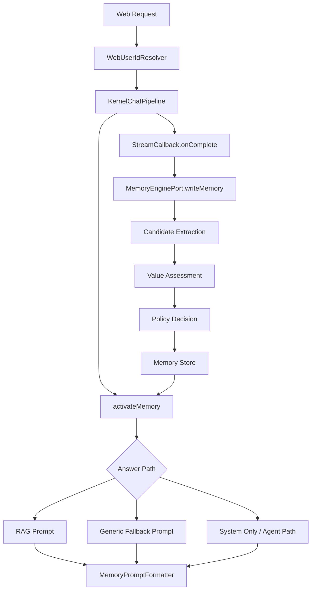

# 记忆筛选与跨会话召回架构方案

## 目标

本方案用于系统性完善 Seahorse Agent 的记忆系统，解决用户在一个会话中表达“我是一名学生”，但另一个会话询问“我的职业是什么”时模型无法知道的问题。

目标覆盖四类可进入记忆系统的信息：

1. 对用户人物画像有直接贡献的信息，例如身份、职业、学习阶段、所在地、职责、长期偏好。
2. 对知识库完善有实质帮助的信息，例如用户确认的术语、业务背景、文档缺口、问答纠错。
3. 用户明确标识为重要的内容，例如“请记住”“以后都按这个来”。
4. 系统通过算法判定为潜在有用的信息，例如多次出现、稳定、具体、低风险的信息。

第一批落地优先修复现有链路缺口：登录用户归属、候选记忆提取、跨回答路径记忆注入。评分模型、人工确认队列和治理任务作为后续可扩展阶段推进。

## 当前证据

本地 Docker 数据库现象：

- `t_message` 中相关聊天消息写入到了 `user_id = default`，说明登录态没有成为聊天业务链路的默认 `userId`。
- `t_short_term_memory` 没有写入用户自我介绍，说明当前候选提取规则漏掉了 `我 是一名学生，很高兴认识你` 这类带空格和社交尾句的输入。
- `KernelChatPipeline.activateMemory()` 已经加载记忆，但空检索的通用兜底回答此前没有把 `MemoryContext` 注入模型输入。

由此判断问题不是单点“记忆功能开关失效”，而是身份归属、写入筛选和读取注入三个环节同时存在缺口。

## 设计原则

- 高精度优先：第一批只写入明确有价值的信息，避免把普通问题、寒暄、模型猜测写入用户事实。
- 单一所有者：Web 层身份解析由一个组件负责，prompt 记忆格式化由一个组件负责。
- 兼容现有接口：保留 `MemoryEnginePort` 方法签名，保留 `userId` 参数和 `X-User-Id` 调试入口。
- 失败不阻塞聊天：记忆加载、写入、格式化失败不得中断主回答链路。
- 可观测可回滚：每个阶段都有可执行验证命令和数据库证据。

## 目标架构



## 组件设计

### WebUserIdResolver

Web 入站统一使用以下优先级解析业务 `userId`：

```text
request parameter userId
-> X-User-Id header
-> Sa-Token loginId
-> default fallback
```

策略说明：

- `userId` 参数继续最高优先级，保留脚本和调试兼容性。
- `X-User-Id` 继续支持后端调试和内部调用。
- 登录用户默认使用 Sa-Token 的 loginId，用户通过 `admin` 登录时，聊天、会话、反馈和记忆应归属同一个认证态业务 `userId`。本地样本中该值为 `2001523723396308993`，不是用户名字面量 `admin`。
- `default` 只作为无登录上下文的开发降级，不作为生产主路径身份。
- 返回值最长保留 64 个字符，避免异常长身份污染下游索引。

### 记忆候选提取

第一批在 `DefaultMemoryEnginePort` 内增强规则提取，后续再拆出独立 `MemoryCandidateExtractor`。

候选类型：

| 类型 | 示例 | 第一批决策 |
| --- | --- | --- |
| `PROFILE` | `我是学生`、`我 是一名学生`、`我来自上海`、`我负责后端` | 写入短期记忆，后续可晋升画像 |
| `PREFERENCE` | `我喜欢简短回答`、`我偏好 Java`、`我常用 Windows` | 写入短期记忆，后续可晋升长期记忆 |
| `PERSONAL_FACT` | `我的职业是学生`、`我的系统是 Windows` | 写入短期记忆 |
| `EXPLICIT_IMPORTANT` | `请记住：...`、`以后都按这个来：...` | 写入短期记忆并标记高置信 |

拒绝类型：

- 普通问题：`我的职业是什么？`
- 低价值寒暄：`你好`、`很高兴认识你`
- 助手回答中的推断内容
- 过短、过长、疑问句、明显不确定的句子
- 只有情绪、礼貌用语、一次性操作指令的信息

第一批规则改造：

- 归一化中文前缀中的空白，例如 `我 是` -> `我是`。
- 裁剪低价值社交尾句，例如 `，很高兴认识你`。
- 支持显式重要表达，例如 `请记住`、`以后都按这个来`。
- 保持严格长度和疑问句拦截，避免噪声扩大。

### 信息价值评估指标

后续 `MemoryValueAssessor` 使用 0 到 1 的分值，并输出可解释指标。

| 指标 | 含义 | 高分信号 | 降分信号 |
| --- | --- | --- | --- |
| `explicitness` | 用户是否明确要求记住 | `请记住`、`这很重要`、`以后按这个来` | 无明确标识 |
| `profile_value` | 是否直接完善用户画像 | 身份、职业、角色、长期偏好 | 一次性问题、闲聊 |
| `knowledge_value` | 是否补充知识库或业务事实 | 纠错、术语解释、业务约束 | 与知识库无关 |
| `stability` | 信息是否稳定 | 职业、偏好、长期职责 | 当天状态、临时任务 |
| `specificity` | 信息是否具体可复用 | 有对象、范围、条件 | 泛泛表态 |
| `recurrence` | 是否多次出现 | 多会话重复表达 | 首次且低价值 |
| `confidence` | 提取置信度 | 结构清晰、主语明确 | 模糊、反问、转述 |
| `risk_score` | 隐私、安全、冲突风险 | 低敏、用户主动给出 | 高敏、身份凭证、冲突事实 |

建议初始评分公式：

```text
value_score =
  0.25 * explicitness
+ 0.20 * profile_value
+ 0.20 * knowledge_value
+ 0.15 * stability
+ 0.10 * specificity
+ 0.10 * recurrence
- 0.30 * risk_score
```

决策阈值：

| 条件 | 决策 |
| --- | --- |
| `risk_score >= 0.70` | 拒绝，除非用户再次明确确认 |
| `value_score >= 0.75` | 写入目标记忆层 |
| `0.50 <= value_score < 0.75` | 低权重短期候选或进入确认队列 |
| `value_score < 0.50` | 丢弃 |
| 与既有记忆冲突 | 进入冲突队列，不直接覆盖 |

### 记忆写入流程

```text
assistant completion finished
-> capture latest user message
-> normalize text
-> extract candidate
-> reject question/noise/risk
-> infer memory type
-> write short-term memory
-> add metadata: userId, conversationId, messageId, source, capturePolicy
```

第一批不改数据库表结构，继续写入现有短期记忆表。

### 记忆读取与注入

`MemoryPromptFormatter` 是 prompt 中记忆格式化的唯一所有者。

输出格式：

```text
用户记忆上下文：
用户画像：
- ...
长期记忆：
- ...
近期记忆：
- ...
注意：若用户记忆与知识库上下文冲突，以知识库上下文为准，除非问题明确询问用户偏好或历史。
```

约束：

- 记忆只注入 system message，不拼接到用户问题里。
- 单条记忆最多 200 字符。
- 空记忆不生成区块。
- RAG path 和 generic fallback path 使用同一个 formatter。

### 误判防范机制

- 只从用户消息提取，不从助手回答中提取用户事实。
- 疑问句默认不写入，避免把“我的职业是什么”当作事实。
- 明显寒暄和低价值尾句裁剪或拒绝。
- 高风险内容拒绝或要求用户确认，包括凭证、密钥、身份证号、支付信息。
- 冲突内容不覆盖旧记忆，进入后续治理队列。
- 记忆 prompt 中明确规定知识库上下文优先，避免用户偏好覆盖事实知识。

### 动态调整策略

后续阶段引入以下治理能力：

- 记忆命中反馈：根据用户点赞、踩、纠错调整阈值。
- 衰减机制：近期记忆按时间和重复度衰减，稳定信息晋升长期或画像层。
- 去重与合并：相似记忆合并，避免 prompt 膨胀。
- 冲突处理：保留新旧事实、来源和时间，要求用户确认后替换。
- 指标看板：记录候选数、写入率、拒绝率、命中率、用户纠错率。
- 策略版本：每次阈值和规则变更记录版本，支持回滚和对比。

## 阶段交付

| 阶段 | 时间 | 交付物 | 验证 |
| --- | --- | --- | --- |
| Phase 0 | 2026-05-20 | Aegis spec、plan、work 记录 | 文档可读且索引更新 |
| Phase 1 | 2026-05-20 至 2026-05-21 | 登录用户归属、规则提取增强、统一 prompt 注入 | 后端编译、目标回归测试、Docker DB 证据 |
| Phase 2 | 2026-05-22 至 2026-05-27 | `MemoryCandidateExtractor`、`MemoryValueAssessor`、评分日志 | 单元测试、候选拒绝/写入样本集 |
| Phase 3 | 2026-05-28 至 2026-06-02 | 记忆管理与冲突确认接口 | API 契约测试、管理端手工验证 |
| Phase 4 | 2026-06-03 至 2026-06-05 | 治理任务、指标看板、策略版本化 | 定时任务测试、数据看板抽样 |

## 验收标准

Phase 1 完成时必须满足：

- 登录为 `admin` 后，无显式 `userId` 的聊天请求归属认证态业务 `userId`。本地样本为 `2001523723396308993`。
- 输入 `我 是一名学生，很高兴认识你` 能写入短期记忆，内容规范化为 `我是一名学生`。
- 新会话询问 `我的职业是什么` 时，模型输入包含 `用户记忆上下文` 和 `我是一名学生`。
- RAG path 与 generic fallback path 使用同一套记忆 prompt 格式。
- 生产模块编译通过。
- 如 `seahorse-agent-tests` 因无关基线失败无法执行目标测试，必须记录阻塞类名和命令输出摘要。
