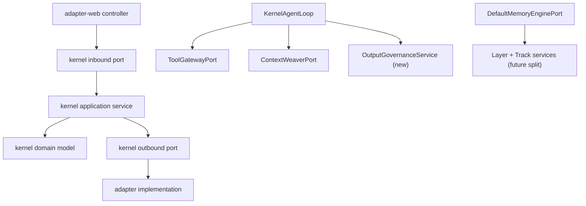

# 设计对齐后续开发指导规格

- 日期：2026-05-24
- 状态：Draft for review
- 适用范围：Seahorse Agent 设计文档与当前代码对齐后的下一轮开发
- 依据：
  - `docs/aegis/work/2026-05-24-design-alignment-review/REVIEW.md`
  - `docs/agent-capability-phased-implementation-plan.md`
  - `docs/agent-capability-phases/phase-c-skill-state-hitl-design.md`
  - `docs/agent-capability-phases/phase-d-output-governance-design.md`
  - `docs/code-standard-review.md`
  - `docs/aegis/BASELINE-GOVERNANCE.md`
- 当前代码基线：`2b73c0e4` 附近的主线代码，实际实施前必须重新执行基准核对。

---

## 1. 目标

本规格用于指导开发者完成下一轮架构对齐开发，目标不是无条件让代码追随旧设计文档，而是把**仍然合理的设计意图**落到当前代码，同时规避已经被证明不合理或过时的设计形态。

下一轮开发必须同时满足三件事：

1. 修正 source-of-truth：明确当前系统真正的架构边界，避免旧文档继续误导实现。
2. 补齐关键能力缺口：优先落地 Agent Phase D 输出治理，而不是先做低价值清理。
3. 降低后续扩展风险：逐步拆解 memory god-class、starter 配置和生产 noop 退路，但不做无保护的大重构。

---

## 2. 第一性原则

### 2.1 不可退让目标

系统必须让开发者能清楚回答：

- 代码当前由哪个 owner 负责某个能力？
- 哪份文档是这个能力的 source-of-truth？
- 当前实现偏离设计时，是代码漂移，还是设计文档已经失效？
- 每个新增端口、fallback、noop、adapter 是否有明确生命周期和生产语义？

### 2.2 不可退让约束

- kernel 继续保持六边形纯净：不得引入 Spring、Redis、Pulsar、Milvus 等基础设施依赖。
- inbound port 仍在 kernel，outbound port 仍由 adapter 实现。
- Web controller 不承担业务治理逻辑，只做入站转换、鉴权上下文和响应格式化。
- 新增能力必须接入已有观测体系，至少能记录成功、失败和降级事件。
- 生产环境不得静默丢写入、跳过审计或吞掉关键治理失败。

### 2.3 必须丢弃的历史假设

旧文档中以下假设不再作为开发依据：

1. **“Gemini 七层记忆”是 canonical 模型。** 当前更合理的模型是 `4 layer × N track`。`MemoryLayer` 只表达时间/抽象度维度，`profile/correction/business-doc` 是横向语义轨，不应塞进同一个 enum。
2. **Phase C 文档中的 `AgentTask` / `SkillDefinition` / `PhaseHandler` 已经落地。** 当前代码真实 owner 是 `AgentRun` / `AgentDefinition` / `AgentStep` / `KernelAgentLoop` / runtime services。后续设计必须跟随真实术语，除非重新发起大规模 runtime 改造。
3. **Phase D 可以直接照旧文档接入 `PhaseHandler` decorator。** 当前没有 `PhaseHandler` runtime，因此 Phase D MVP 不能依赖不存在的 owner。
4. **所有 noop 都只是本地开发便利。** 部分 noop 在生产会造成写入、审计、索引或观测缺失，必须分类治理。

---

## 3. 当前架构基线

### 3.1 真实 owner

| 能力 | 当前 canonical owner | 说明 |
|---|---|---|
| 单次 ReAct loop | `seahorse-agent-kernel/.../application/agent/KernelAgentLoop.java` | 负责模型回合、工具调用、审批等待、runtime context 注入 |
| Agent 运行时记录 | `kernel/application/agent/runtime/*` + `kernel/domain/agent/runtime/*` | 当前真实术语是 `AgentRun`、`AgentStep`、`AgentCheckpoint` |
| 工具目录与输出 schema 字段 | `kernel/domain/agent/tool/ToolCatalogEntry.java` | 已有 `outputSchemaJson`，但无统一输出验证调用方 |
| 工具调用策略/审计 | `LocalToolGatewayPort`、`ToolInvocationAuditPort`、`ToolPolicy*` | Phase F 审计基础存在 |
| 记忆 layer | `kernel/domain/memory/MemoryLayer.java` | 仅 `WORKING / SHORT_TERM / LONG_TERM / SEMANTIC` |
| 记忆 track | `MemoryContext` 字段：`profileMemories`、`correctionMemories`、`businessDocumentMemories` | 横向语义轨，不属于 `MemoryLayer` |
| 记忆 prompt 格式化 | `kernel/domain/chat/MemoryPromptFormatter.java` | 注意当前 `semanticMemories` 标题也写成“用户画像”，实施时应顺手修正为“语义记忆”或等价标题 |
| 记忆总编排 | `kernel/application/memory/DefaultMemoryEnginePort.java` | 2178 行，属后续拆分对象 |
| memory auto configuration | `seahorse-agent-spring-boot-starter/.../SeahorseAgentKernelMemoryAutoConfiguration.java` | 1075 行 / 83 处 `@Value`，属后续配置拆分对象 |

### 3.2 架构边界



规则：

- 新增 Phase D 输出治理先作为 kernel application service，不能内联到 Web，也不能把验证逻辑硬写进 `KernelAgentLoop` 私有方法。
- `KernelAgentLoop` 可以调用一个小而稳定的输出治理端口或服务，但不拥有 schema 校验规则。
- 记忆系统拆分必须保持 `MemoryEnginePort` 外部契约兼容，先拆内部 service，再考虑接口变化。

---

## 4. 推荐开发顺序

| 顺序 | 切片 | 优先级 | 乐观 / 保守工作量 | Risk | 建议 DRI | 目标 |
|---|---|---|---|---|---|---|
| 0 | 基准固定、source-of-truth 修订、`MemoryPromptFormatter` 标题 hotfix | P0 前置 | 0.5 / 1 天 | 低 | 架构 owner | 防止开发者继续按失效文档实现，并修正已确认的小型文案 bug |
| 1a | Phase D 真 MVP：JSON 输出治理 | P0 | 1 / 2 天 | 中 | Agent runtime owner | `OutputGovernanceService` + JSON validator + `KernelAgentLoop` 接入 + 观测事件，不含 self-heal |
| 1b | Phase D DDL 安全 validator | P0/P1 | 0.5 / 1 天 | 中 | Agent runtime owner | 增加最小黑名单 DDL 阻断能力 |
| 1c | Phase D self-heal | P1 | 1 / 2 天 | 中高 | Model adapter owner | 引入 `OutputRepairModelPort` 和一次修复重试，先完成 adapter 设计决策 |
| 1d | Phase D Markdown / Mermaid validators | P2 | 1 / 2 天 | 中 | Agent runtime owner | 补齐弱语义结构校验，避免塞进首个 PR |
| 1e | Phase D ContextReducer | P2 | 1 / 2 天 | 中 | Agent runtime owner | 独立处理阶段间上下文降维，不绑定 validator 交付 |
| 2 | 生产 noop 风险治理 | P1 | 1 / 2 天 | 中 | Starter owner | 防止生产静默丢写入、跳过审计或跳过索引 |
| 3 | `DefaultMemoryEnginePort` 拆分护栏审计与第一刀 | P1 | 2 / 4 天 | 高 | Memory owner | 审计现有测试盲区后迁出一个真实职责 |
| 4 | `MemoryProperties` 与 auto configuration 拆分 | P2 | 1 / 3 天 | 中 | Starter owner | 让 starter 配置可维护 |
| 5 | Phase C 术语回写与 `SnapshotDiffAnalyzer` | P2 | 1 / 2 天 | 中 | Agent runtime owner | 消除文档/API 术语漂移，补智能失效 |
| 6 | controller 响应样板治理 | P3 | 0.5 / 1 天 | 低 | Web adapter owner | 低风险清理重复，并保持 API 序列化兼容 |
| 7 | capture magic value 配置化 | P3 | 1 / 2 天 | 低 | Memory owner | 为多语言和策略调优做准备 |

不要把 P3 清理项排到 P0 能力缺口前，除非团队明确选择先用半天做低风险卫生改造。

---

## 5. 切片 0：基准固定与 source-of-truth 修订

### 5.1 目标

在任何代码开发前，先修正会误导实现的文档。否则后续 PR 会在旧术语和真实代码之间反复摇摆。

### 5.2 必须修改的文档

1. `docs/aegis/work/2026-05-24-design-alignment-review/REVIEW.md`
   - 保留为证据报告，不作为 runtime 设计权威。
   - 第 5 节“推荐下一刀顺序”如仍保留旧顺序，应增加 v2 修订说明或指向本规格。
2. Gemini 记忆设计相关 canonical 文档
   - 将“七层记忆”修订为 `4 layer × N track`。
   - 明确 `profile/correction/business-doc` 不进入 `MemoryLayer` enum。
3. `docs/agent-capability-phases/phase-c-skill-state-hitl-design.md`
   - 标记旧术语与当前实现不一致。
   - 后续如继续采用 `AgentRun` runtime，文档必须改用 `AgentRun`、`AgentDefinition`、`AgentStep`。
4. `docs/agent-capability-phases/phase-d-output-governance-design.md`
   - 保留输出治理目标。
   - 删除或降级“接入 `PhaseHandler` decorator”的第一阶段要求，因为当前代码不存在该 owner。

### 5.3 新 canonical 术语

| 概念 | 采用术语 | 禁止误用 |
|---|---|---|
| 单次智能体运行 | `AgentRun` | 不再新建并行的 `AgentTask`，除非明确做 runtime 重构 |
| 单步模型/工具交互 | `AgentStep` | 不把它称为 phase |
| Agent 配置 | `AgentDefinition` | 不新增重复 `SkillDefinition` owner |
| 输出治理 | `OutputGovernanceService` + validator ports | 不把 validator 逻辑散落在 loop/controller/tool adapter |
| 记忆纵向分层 | `MemoryLayer` 4 项 | 不新增 `PROFILE`、`CORRECTION`、`BUSINESS_DOCUMENT` enum |
| 记忆横向轨 | `MemoryTrack` 文档概念或 service 命名 | 不和 layer 混用 |

### 5.4 验收标准

- 文档中明确写出 `MemoryLayer = 4`，并解释为什么不扩成 7。
- Phase D 文档不再要求第一阶段依赖不存在的 `PhaseHandler`。
- INDEX 能找到本规格和后续计划。
- 开发计划引用本规格，而不是只引用旧 Gemini/Phase 文档。
- `MemoryPromptFormatter` 中 `semanticMemories` 的标题错标归属清晰：作为 Slice 0 附带 hotfix 修正为“语义记忆”或等价标题，并用现有 formatter 测试覆盖。

---

## 6. 切片 1：Phase D 输出治理分阶段交付

### 6.1 为什么优先做

当前系统已经能运行 Agent loop、调用工具、记录运行步骤，也已有 `ToolCatalogEntry.outputSchemaJson`。缺口在于：模型最终输出没有统一验证、没有输出治理观测事件，也没有后续自愈边界。企业级场景要求 JSON、Mermaid、DDL、Markdown 等结构化产物时，这会直接形成质量和安全风险。

### 6.2 分阶段范围

Phase D 不能把 JSON、DDL、Markdown、Mermaid、self-heal、ContextReducer 一次塞进首个 PR。后续开发按以下顺序拆分：

| 子切片 | 范围 | 不包含 |
|---|---|---|
| 1a 真 MVP | `OutputGovernanceService`、`OutputValidatorPort`、`JsonSchemaOutputValidator`、`KernelAgentLoop` 接入、观测事件 | DDL、Markdown、Mermaid、self-heal、ContextReducer |
| 1b DDL 安全 | `DdlSafetyOutputValidator`，先做 `DROP` / `TRUNCATE` / `DELETE FROM` 等黑名单阻断 | DDL 全语义解析 |
| 1c self-heal | `SelfHealingOutputRepairService`、`OutputRepairModelPort`、一次修复重试 | 多轮修复、业务事实补造 |
| 1d Markdown / Mermaid | Markdown 必备章节检查、Mermaid 基础语法检查 | Mermaid 全语义渲染 |
| 1e ContextReducer | 阶段间上下文降维、token 预算、omitted summary | 与 validator 强绑定 |

### 6.3 设计原则

- 输出治理是 kernel application 能力，不是 Web 能力。
- `KernelAgentLoop` 只负责调用治理服务，不持有具体 schema、DDL、Mermaid 规则。
- 1a 只治理最终回答，不治理每个工具 observation。
- 1a 不包含 self-heal；self-heal 需要单独决定 model 来源和 adapter 边界。
- validator 失败时必须有清晰语义：`PASS`、`WARN`、`BLOCK`。`HEALED`、`FAILED_AFTER_HEAL` 只在 1c 引入。

### 6.4 推荐包结构

1a 必需文件：

```text
seahorse-agent-kernel/src/main/java/com/miracle/ai/seahorse/agent/kernel/domain/agent/output/
  OutputArtifactType.java
  OutputValidationDecision.java
  OutputValidationIssue.java
  OutputValidationResult.java
  OutputValidationRequest.java
  OutputGovernanceResult.java

seahorse-agent-kernel/src/main/java/com/miracle/ai/seahorse/agent/kernel/application/agent/output/
  OutputGovernanceService.java
  JsonSchemaOutputValidator.java

seahorse-agent-kernel/src/main/java/com/miracle/ai/seahorse/agent/ports/outbound/agent/
  OutputValidatorPort.java
  OutputValidationRecordPort.java
```

1b 追加：

```text
seahorse-agent-kernel/src/main/java/com/miracle/ai/seahorse/agent/kernel/application/agent/output/
  DdlSafetyOutputValidator.java
```

1c 追加：

```text
seahorse-agent-kernel/src/main/java/com/miracle/ai/seahorse/agent/kernel/application/agent/output/
  SelfHealingOutputRepairService.java

seahorse-agent-kernel/src/main/java/com/miracle/ai/seahorse/agent/ports/outbound/agent/
  OutputRepairModelPort.java
```

1d 追加：

```text
seahorse-agent-kernel/src/main/java/com/miracle/ai/seahorse/agent/kernel/application/agent/output/
  MarkdownStructureOutputValidator.java
  MermaidSyntaxOutputValidator.java
```

说明：

- `OutputValidatorPort` 表达输出验证能力；如果 validator 不依赖外部基础设施，默认实现可保留在 kernel application。
- `OutputValidationRecordPort` 1a 可先 noop，但接口要留出保存运行记录的边界。
- `OutputRepairModelPort` 不在 1a 出现；它需要单独决定走 OpenAI 兼容 adapter、本地模型，还是复用当前 agent model 实例。

### 6.5 核心对象

```java
public enum OutputArtifactType {
    PLAIN_TEXT,
    JSON,
    MARKDOWN,
    MERMAID,
    DDL
}

public enum OutputValidationDecision {
    PASS,
    WARN,
    BLOCK
}

public record OutputValidationIssue(
        String code,
        String path,
        String message,
        OutputValidationDecision decision) {
}

public record OutputValidationResult(
        OutputValidationDecision decision,
        List<OutputValidationIssue> issues,
        String normalizedContent) {
}

public record OutputValidationRequest(
        String runId,
        String agentId,
        String tenantId,
        String userId,
        OutputArtifactType artifactType,
        String schemaJson,
        String content,
        Map<String, Object> attributes) {
}
```

### 6.6 接入点

1a 推荐在 `KernelAgentLoop` 生成 final answer 后调用 `OutputGovernanceService`：

```text
model returns final answer
-> OutputGovernanceService.validateFinalAnswer(...)
-> if PASS/WARN: emit governed content
-> if BLOCK: return governed failure result or configured fallback message
```

1c 引入 self-heal 后再扩展为：

```text
BLOCK and self-heal enabled
-> repair once
-> validate again
-> if PASS/WARN: emit repaired content
-> if still BLOCK: return governed failure result
```

注意：

- 不要把 validator 逻辑直接放进 `KernelAgentLoop.run()`。
- 不要让 controller 在响应前二次校验。
- 不要让 tool adapter 自己解释最终回答 schema。

### 6.7 artifact type 来源

第一阶段按以下优先级推断：

1. `AgentLoopRequest` 后续新增 `expectedOutputArtifactType` 和 `expectedOutputSchemaJson`。
2. 如果后续引入 `OutputContract` 或 `ContextPack` metadata，可由该 metadata 覆盖 agent definition 默认值。当前 `ContextPack` 没有 `outputSchemaJson` 字段，不能把它写成现有事实。
3. 如果当前请求来自某个 tool/agent definition，可从 `ToolCatalogEntry.outputSchemaJson` 或 agent metadata 读取。
4. 默认 `PLAIN_TEXT`，只做长度、空白等弱校验，不做 JSON schema。

### 6.8 self-heal 边界

self-heal 从 1c 开始引入，只做结构修复，不改业务事实：

- 可以修复 JSON 缺字段、Markdown 缺章节、Mermaid 基础语法。
- 不可以补造没有证据的业务内容。
- 修复 prompt 必须包含 validator issues 和原始输出。
- 修复后必须再次 validate。
- 一次失败后不继续循环，避免无限成本和幻觉累积。

### 6.9 观测

新增观测事件使用项目现有 kebab-case 风格：

| eventName | tags |
|---|---|
| `agent-output-validation` | `artifactType`、`decision`、`validator` |
| `agent-output-validation-failed` | `artifactType`、`topIssueCode` |
| `agent-output-self-heal` | `attempt`、`outcome`、`issueCount` |

1a 必须先落 `agent-output-validation`；`agent-output-self-heal` 到 1c 再落。

### 6.10 测试要求

1a 必须覆盖：

- JSON 必填字段缺失返回 `BLOCK`。
- JSON 合法输出返回 `PASS`。
- `KernelAgentLoop` 在无输出治理配置时保持现有行为。
- `agent-output-validation` 至少能被测试端口捕获一次。

1b 追加：

- DDL 出现 `DROP`、`TRUNCATE`、`DELETE FROM` 返回 `BLOCK`。

1c 追加：

- self-heal 第一次修复成功时最终返回修复后内容。
- self-heal 第二次仍失败时不会继续重试。

1d 追加：

- Markdown 缺必需章节返回 `WARN` 或 `BLOCK`，由 request 策略控制。
- Mermaid 基础语法错误返回 `WARN` 或 `BLOCK`。

### 6.11 明确规避的旧设计

旧 Phase D 文档要求 `OutputGovernancePhaseDecorator` 包装 `PhaseHandler`。当前代码没有 `PhaseHandler` runtime。第一阶段不得为了照文档而新建一套空壳 `PhaseHandler`，否则会制造第二个 runtime owner。正确做法是先接入当前真实 owner `KernelAgentLoop`，但把治理逻辑放在独立 service，未来如引入 phase runtime，再迁移接入点。

`ContextReducer` 没有废弃，但不属于 1a 真 MVP。它作为 1e 独立切片处理，避免把上下文降维和输出验证绑定成一个大 PR。

---

## 7. 切片 2：生产 noop 风险治理

### 7.1 问题

当前大量端口提供 `noop()`，starter 中大量 `getIfAvailable(::noop)`。仅 `seahorse-agent-kernel/.../ports/outbound/memory/` 子树当前就有 24 个 `static noop()`。这对本地开发友好，但在生产中可能静默丢失关键能力。

### 7.2 分类策略

| 类别 | 风险 | 策略 | 示例 |
|---|---|---|---|
| A | 丢写入、跳过审计、跳过关键持久化 | prod fail-fast | memory store、outbox、audit、review candidate |
| B | 跳过索引、观测、异步增强 | prod warning + metric | vector index、keyword index、observation |
| C | 纯增强降级 | 允许 noop | refiner、summarizer、graph enhancement |

### 7.3 设计

先新增一个 marker interface：

```java
// seahorse-agent-kernel/src/main/java/com/miracle/ai/seahorse/agent/ports/common/NoopFallback.java
package com.miracle.ai.seahorse.agent.ports.common;

public interface NoopFallback {
}
```

然后新增一个 starter 侧检查组件：

```text
seahorse-agent-spring-boot-starter/.../SeahorseAgentNoopPortGuard.java
```

职责：

- 在启动阶段收集关键端口实际 bean。
- 通过 `instanceof NoopFallback` 判断是否是显式 noop fallback。
- 根据 `seahorse-agent.runtime.profile` 或 Spring active profile 判断生产策略。
- A 类在 prod 抛异常。
- B 类记录 WARN，并通过 `ObservationPort` 记录 `seahorse-noop-port-hit`。
- C 类不处理。

改造注意：

- 当前部分 `noop()` 使用 lambda，部分使用匿名类。不能假设匿名类能直接额外 `implements NoopFallback`。
- 预备 PR 应把关键 noop 改成命名内部类或统一 wrapper，使返回对象可被 `instanceof NoopFallback` 稳定识别。
- marker 改造是机械化边界扩展，但仍需跑编译和相关端口 contract tests；不要把它描述成无需验证的零风险改动。

### 7.4 约束

- 不改端口方法签名。
- 不删除现有 noop。
- 不影响单元测试和本地最小启动。
- 生产策略必须可通过配置临时降级，但默认应安全。

---

## 8. 切片 3：`DefaultMemoryEnginePort` 拆分

### 8.1 拆分前提

不能直接大拆。`DefaultMemoryEnginePortTests.java` 当前已有 62 个 `@Test`，所以入口不是机械加测试，而是先审计现有测试护栏的盲区。重点确认：

- ingest 用户事实写入短期记忆。
- profile track 写入和读取。
- correction track 写入和读取。
- business document track 参与 prompt/context。
- derived index outbox 派发 vector/keyword/graph task。
- recall 不因拆分改变排序和 layer attribution。

仅在上述场景缺覆盖时补测试，避免用无意义增量测试制造维护负担。

### 8.2 目标结构

```text
DefaultMemoryEnginePort
  -> MemoryIngestionCoordinator
  -> MemoryRecallCoordinator
  -> MemoryTrackWriteService
  -> MemoryDerivedIndexDispatchService
  -> MemoryRefinementWorkflowService
```

职责：

| 类 | 职责 |
|---|---|
| `DefaultMemoryEnginePort` | 保持外部 facade，委托给内部 service |
| `MemoryIngestionCoordinator` | 候选提取、分类、策略、写入编排 |
| `MemoryRecallCoordinator` | 调用 retrieval pipeline 与 context 构建 |
| `MemoryTrackWriteService` | 统一处理 profile/correction/business-doc track 写入 |
| `MemoryDerivedIndexDispatchService` | 派发 vector/keyword/graph outbox task |
| `MemoryRefinementWorkflowService` | LLM refiner、review、feedback 导出 |

### 8.3 关键规避点

- 不新增 `PROFILE`、`CORRECTION`、`BUSINESS_DOCUMENT` 到 `MemoryLayer`。
- 不把 track service 做成 adapter；它是 kernel application 内部服务。
- 不一次性重写 `DefaultMemoryEnginePort` 全部方法。
- facade 拆分后仍可以超过 500 行一段时间，但每次 PR 必须减少一个真实职责。

### 8.4 验收标准

- `DefaultMemoryEnginePort` 外部方法签名不变。
- 第一刀后至少一个职责从 god-class 迁出，例如 `MemoryDerivedIndexDispatchService`，并有独立测试。
- 第一刀后 facade 行数减少至少 200 行；如果因为兼容构造函数导致行数未达标，必须在 PR 说明中解释保留原因和下一刀删除点。
- 行为回归测试通过。
- 新 service 没有 Spring 注解和基础设施 import。

---

## 9. 切片 4：Memory auto configuration 配置治理

### 9.1 问题

`SeahorseAgentKernelMemoryAutoConfiguration` 目前 1075 行、83 处 `@Value`。这让配置项难以发现、迁移和测试。

### 9.2 目标

新增：

```text
seahorse-agent-spring-boot-starter/.../properties/MemoryProperties.java
seahorse-agent-spring-boot-starter/.../SeahorseAgentMemoryRecallAutoConfiguration.java
seahorse-agent-spring-boot-starter/.../SeahorseAgentMemoryAggregationAutoConfiguration.java
seahorse-agent-spring-boot-starter/.../SeahorseAgentMemoryMaintenanceAutoConfiguration.java
seahorse-agent-spring-boot-starter/.../SeahorseAgentMemoryOutboxAutoConfiguration.java
```

### 9.3 迁移原则

- 保留所有现有 property key，不做破坏性重命名。
- 先引入 `@ConfigurationProperties`，再逐步删除方法参数上的 `@Value`。
- 每个子 auto configuration 聚焦一个能力域。
- 所有 bean name 继续保持 `seahorse...` 前缀。
- `@ConditionalOnMissingBean` 必须保留。

### 9.4 验收标准

- 原配置 key 仍可启动。
- memory starter 相关 auto configuration 测试覆盖默认值绑定。
- `SeahorseAgentKernelMemoryAutoConfiguration` 行数显著下降。
- 新 `MemoryProperties` 有清晰嵌套结构：`policy`、`recall`、`aggregation`、`outbox`、`maintenance`、`refiner`。

---

## 10. 切片 5：Phase C 术语回写与 SnapshotDiff

### 10.1 目标

消除文档中 `AgentTask`/`SkillDefinition`/`PhaseHandler` 与真实代码 `AgentRun`/`AgentDefinition`/`AgentStep` 的漂移，并补最小 `SnapshotDiffAnalyzer` 能力。

### 10.2 推荐设计

不要第一阶段实现完整旧 Phase C task runtime。先在当前 runtime 上补轻量 diff：

```text
kernel/application/agent/runtime/SnapshotDiffAnalyzer.java
kernel/domain/agent/runtime/AgentCheckpointDiff.java
```

最小功能：

- 输入：previous checkpoint、current input hash、artifact hash。
- 输出：`UNCHANGED`、`SOFT_PATCH`、`HARD_CASCADE`。
- 第一阶段不做复杂语义 diff，只做 hash + phase dependency hint。

最小决策表：

| 条件 | 决策 |
|---|---|
| previous checkpoint 不存在 | `HARD_CASCADE`，按首跑处理 |
| input hash + artifact hash 都未变 | `UNCHANGED` |
| input hash 未变、artifact hash 变 | `SOFT_PATCH`，只重算当前 artifact 相关摘要 |
| input hash 变但只触及非依赖字段，如 user trace metadata | `SOFT_PATCH` |
| input hash 变且触及上游 phase、agent definition、allowed tools、output contract 等依赖字段 | `HARD_CASCADE` |
| 依赖字段无法判断 | `HARD_CASCADE`，宁可重算也不保留错误快照 |

### 10.3 规避点

- 不新建 `AgentTaskRepositoryPort`，除非团队决定重做 runtime。
- 不把 `AgentRun` 和 `AgentTask` 两套概念并行暴露给 Web。
- 不让 diff analyzer 调 LLM；第一阶段必须可预测、可单测。

---

## 11. 切片 6：controller 响应样板治理

### 11.1 目标

清理 16 个 controller 中 44 处 `Service not available` 重复样板。

### 11.2 设计

新增：

```text
seahorse-agent-adapter-web/src/main/java/com/miracle/ai/seahorse/agent/adapters/web/ApiResponse.java
seahorse-agent-adapter-web/src/main/java/com/miracle/ai/seahorse/agent/adapters/web/ApiResponses.java
```

建议接口：

```java
@JsonInclude(JsonInclude.Include.NON_NULL)
public record ApiResponse<T>(String code, String message, T data) {
    public static <T> ApiResponse<T> ok(T data) { ... }
    public static <T> ApiResponse<T> error(String message) { ... }
}
```

`ApiResponses` 提供：

```java
public static <P, T> ApiResponse<T> requireService(
        ObjectProvider<P> provider,
        Function<P, T> action)
```

### 11.3 约束

- 不改变 HTTP 路径。
- 不改变 `{code,message,data}` 响应形状。
- `ApiResponse` 必须使用 `@JsonInclude(JsonInclude.Include.NON_NULL)`，避免成功响应出现 `"message": null`。
- 不碰 kernel。
- 第一刀只替换 1 个非关键 controller，例如 `SeahorseToolCatalogController`。
- 第一刀必须跑 `SeahorseWebApiContractTests`，确认 record 序列化没有破坏既有响应契约后，再每次替换 2 到 4 个 controller。

---

## 12. 切片 7：Memory capture magic value 配置化

### 12.1 问题

`MemoryCaptureCandidateExtractor` 中存在中文前缀、拒绝原因、长度阈值等硬编码。后续多语言和策略调优会被源码绑定。

### 12.2 设计

新增：

```text
kernel/application/memory/MemoryCaptureRejectionReason.java
starter/.../properties/MemoryCaptureRuleProperties.java
```

其中：

- enum 管理 `TOO_SHORT`、`QUESTION`、`NO_HIGH_VALUE_SIGNAL`、`RISKY_CONTENT` 等拒绝原因。
- properties 管理语言前缀、显式记忆 cue、长度阈值、疑问句规则。
- 默认值与当前行为保持一致。
- PR 顺序敏感：先落 `MemoryCaptureRejectionReason` enum 和现有拒绝原因迁移，再落 `MemoryCaptureRuleProperties`。否则 properties 结构会被未稳定的 enum 形态反复牵动。

### 12.3 规避点

- 不把 i18n 文案放进 kernel domain。
- 不引入外部 NLP 依赖。
- 不在第一阶段重写 capture 评分模型。

---

## 13. 验证策略

每个切片至少包含三层验证：

1. **单元测试**：覆盖新 domain/service 的边界逻辑。
2. **集成测试**：覆盖 starter 装配、port fallback、controller 响应形状。
3. **架构检查**：确认 kernel 没有新增 Spring/Redis/Pulsar/Milvus import，确认 source-of-truth 文档已同步。

推荐命令：

```powershell
.\mvnw.cmd -pl seahorse-agent-kernel -am test
.\mvnw.cmd -pl seahorse-agent-spring-boot-starter -am test
.\mvnw.cmd -pl seahorse-agent-adapter-web -am test
```

等价 Bash 形式：

```bash
./mvnw -pl seahorse-agent-kernel -am test
./mvnw -pl seahorse-agent-spring-boot-starter -am test
./mvnw -pl seahorse-agent-adapter-web -am test
```

如果全量测试因既有基线失败阻塞，必须记录：

- 命令
- 失败模块
- 失败类
- 是否与当前切片相关
- 后续补证据命令

---

## 14. 开发者禁止事项

以下行为会制造新的架构漂移，除非先经过架构评审：

- 不得把 `PROFILE`、`CORRECTION`、`BUSINESS_DOCUMENT` 加进 `MemoryLayer`。
- 不得为了照旧 Phase D 文档而新建空壳 `PhaseHandler` runtime。
- 不得把输出校验逻辑写进 controller。
- 不得让 `KernelAgentLoop` 持有 JSON Schema、DDL、Mermaid 的具体规则。
- 不得新增第二套 `AgentTask` Web API 与现有 `AgentRun` API 并行。
- 不得在生产关键写链路继续静默 noop。
- 不得做无测试护栏的 `DefaultMemoryEnginePort` 大重构。
- 不得重命名现有配置 key 破坏用户配置兼容。

---

## 15. ADR 与后续计划信号

本规格触及 durable architecture surfaces：canonical owner、public runtime contract、fallback/noop policy、source-of-truth、Phase D 输出治理 owner、memory layer/track 模型。

完成对应实现后，应考虑补 ADR：

1. `ADR-0001: Memory Layer and Track Model`
   - 记录为什么采用 `4 layer × N track`。
   - 记录为什么不把 profile/correction/business-doc 放入 `MemoryLayer`。
2. `ADR-0002: Agent Output Governance Owner`
   - 记录为什么 Phase D 第一阶段以 `OutputGovernanceService` 接入 `KernelAgentLoop`，而不是实现旧 `PhaseHandler` decorator。
3. `ADR-0003: Production Noop Port Policy`
   - 记录 A/B/C 三类 noop 的生产策略和降级边界。

---

## 16. 交付判定

下一轮开发可认为“设计对齐进入稳定轨道”的条件：

- source-of-truth 文档不再要求失效的七层 enum 或不存在的 PhaseHandler。
- Phase D 1a 真 MVP 完成：JSON validator 通过 / 阻断两种场景有单测，`KernelAgentLoop` 无治理配置时行为不变，`agent-output-validation` 事件可被测试端口捕获。
- Phase D 1b 完成：DDL 黑名单阻断有单测覆盖。
- 生产关键 noop 有 fail-fast 或 warning/metric，且关键 noop fallback 可通过 `NoopFallback` 稳定识别。
- `DefaultMemoryEnginePort` 第一刀完成：一个职责独立成 service，facade 行数减少至少 200 行，测试证明行为不变。
- `MemoryProperties` 已建立，并且至少 1 个 memory auto-configuration 子域切换到 properties 绑定。
- `MemoryPromptFormatter` 中 semantic memories 标题错标已修复并有测试覆盖。
- 后续实施计划引用本规格作为基线。
