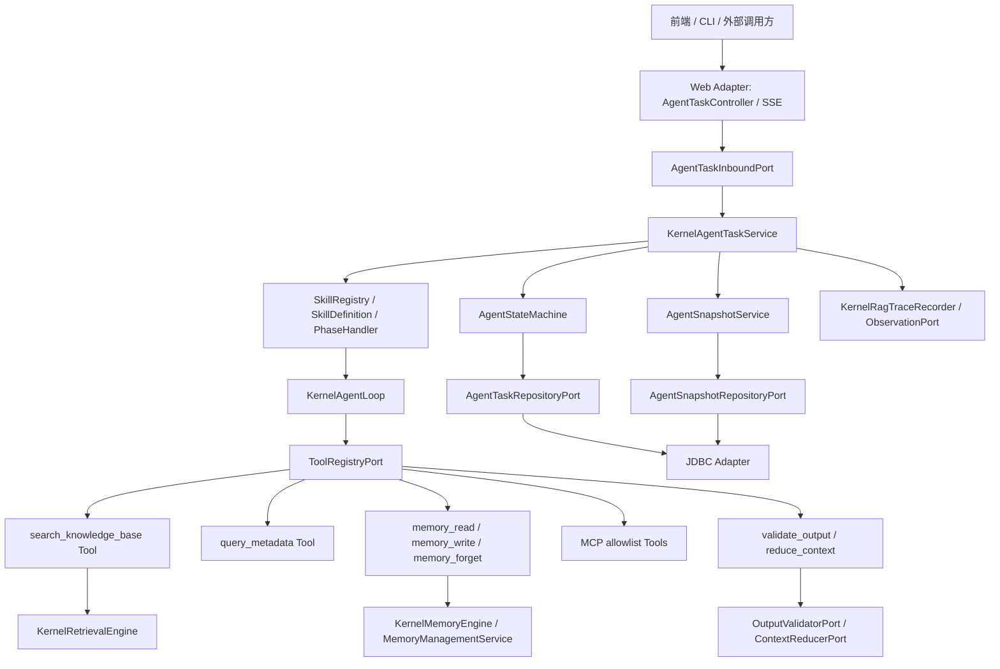

# Seahorse Agent 真 Agent 能力分阶段落地方案

> **2026-05-24 修订说明（执行计划已被 spec 替代）：**
> 本方案描述的 Phase A–F 仍是能力地图，但**下一轮开发的执行计划**以 `docs/aegis/specs/2026-05-24-design-alignment-next-development.md` 为 source-of-truth：
> - Phase D 的接入点不再是 `PhaseHandler` decorator；按 spec §6 在 `KernelAgentLoop` 上以独立 `OutputGovernanceService` 接入，并拆 1a / 1b / 1c / 1d / 1e 分阶段交付。
> - Phase C 文档中的 `AgentTask` / `SkillDefinition` / `PhaseHandler` 已被真实 owner `AgentRun` / `AgentDefinition` / `AgentStep` / `KernelAgentLoop` 替代；阅读 phase-c 文档时请参照其 2026-05-24 修订说明做术语替换。
> - 记忆系统的 layer/track 关系以 `gemini-design.md` 与该 Gemini 完整设计方案的 2026-05-24 canonical 修订说明为准（4 layer × N track，不扩 `MemoryLayer` enum）。
> - 阶段排期按 spec §4 表（Slice 0 → 1a → 1b → 2 → 3 → 1c → 1d → 4 → 5 → 1e → 6 → 7）。
> 现存背景描述保留，但**新任务执行不要单独引用本文档**——必须通过 spec 入口。

> 基线来源：`docs/agent-vs-rag-capability-baseline.md`  
> 目标：在不破坏现有 RAG 闭环的前提下，补齐 Agentic Search、Skill 注册中心、持久化状态机、任务快照、Human-in-the-Loop、输出治理、记忆工具化和企业治理能力。  
> 最后更新：2026-05-19（spec 引入修订：2026-05-24）

---

## 1. 总体目标与边界

### 1.1 目标

当前项目已具备 Phase A 基础能力：`chatMode=agent`、`KernelAgentLoop`、OpenAI-compatible function-calling、`ToolPort` / `ToolRegistryPort` 和 MCP allowlist adapter。后续建设重点不是重写 Agent Loop，而是补齐 Agent Runtime 所需的长期任务底座和工具生态：

1. 让检索、记忆、MCP、输出校验等能力成为 Agent 可调度的一等工具。
2. 让多阶段任务具备可暂停、可恢复、可人工确认、可回滚的状态机。
3. 让 Skill / Agent Definition 成为领域任务编排的一等公民。
4. 让输出、记忆、权限、审计和评测形成闭环治理。

### 1.2 非目标

- 不引入 Temporal、Camunda 等外部工作流引擎作为第一阶段依赖。
- 不复制现有 RAG 检索链路，不新增第二套向量检索 owner。
- 不让 LLM 参数决定权限范围；所有权限、租户和数据范围由服务端强制注入。
- 不默认把所有聊天请求切到 Agent 模式；`chatMode=rag` 仍是稳定默认路径。

### 1.3 架构原则

- **Clean Architecture**：领域模型和应用编排留在 `seahorse-agent-kernel`；Web、JDBC、模型、向量库、MCP 等外部依赖通过 adapter 接入。
- **单一 owner**：`KernelRetrievalEngine` 继续拥有检索语义；`KernelMemoryEngine` / memory services 继续拥有记忆语义；Agent Runtime 只做编排。
- **插件化扩展**：Tool、Skill、Validator、ContextReducer、Governance Policy 都通过端口或 Feature 注册，不硬编码到 Web 层。
- **兼容优先**：RAG 默认链路、现有接口和已有评测体系保持可回归。

---

## 2. 目标架构



核心新增层是 **Agent Runtime**：

- `KernelAgentTaskService`：任务入口、状态流转、Skill 调度、恢复与取消。
- `AgentStateMachine`：只负责合法状态迁移，不执行 LLM。
- `AgentSnapshotService`：保存阶段产物、版本链、diff 和失效状态。
- `SkillRegistry`：加载和查询 Skill 定义，映射到 `PhaseHandler`。
- `Tool adapters`：把现有 RAG、Memory、MCP、Output Governance 包装为 `ToolPort`。

---

## 3. 分层模块设计

### 3.1 Kernel 领域层

建议新增包：

| 包 | 主要对象 | 职责 |
|---|---|---|
| `kernel/domain/agent/task` | `AgentTask`、`AgentTaskStatus`、`AgentTaskAction`、`AgentTaskEvent` | 任务生命周期、动作和事件定义 |
| `kernel/domain/agent/snapshot` | `AgentSnapshot`、`SnapshotStatus`、`SnapshotDiff`、`InvalidationScope` | 快照版本链、失效范围和回滚目标 |
| `kernel/domain/agent/skill` | `SkillDefinition`、`SkillPhase`、`PhaseTransition`、`PhaseRequirement` | Skill 与阶段编排定义 |
| `kernel/domain/agent/output` | `OutputArtifact`、`OutputValidationResult`、`ContextSlice` | 输出工件、校验结果和上下文切片 |
| `kernel/domain/agent/governance` | `DataScopeContext`、`ToolAuditEvent`、`BudgetPolicy` | 权限、审计和预算策略 |

### 3.2 Kernel 应用层

| 应用服务 | 职责 |
|---|---|
| `KernelAgentTaskService` | 创建任务、恢复任务、处理用户 action、驱动 Skill phase |
| `AgentStateMachine` | 校验状态迁移：`CREATED -> RUNNING -> WAITING_FOR_HUMAN -> RUNNING -> COMPLETED` |
| `AgentSnapshotService` | 新建 snapshot、比较 diff、标记后续 phase outdated、回滚到历史 snapshot |
| `KernelSkillRegistry` | 注册内置 Skill、读取持久化 SkillDefinition、校验 phase DAG |
| `RequirementAnalysisSkill` | 首个内置 Skill：原型识别、业务逻辑、技术方案、开发计划 |
| `SearchKnowledgeBaseToolPortAdapter` | 将 `KernelRetrievalEngine` 包装为 Agent 检索工具 |
| `MemoryToolPortAdapter` | 将 memory read/write/forget 包装为 Agent 记忆工具 |
| `SelfHealingLoop` | 调用 validator，失败时把错误反馈给 LLM 进行有限重试 |
| `DefaultContextReducer` | 阶段间上下文压缩，只传 confirmed snapshot 和必要摘要 |

### 3.3 端口设计

新增 inbound ports：

```java
public interface AgentTaskInboundPort {
    AgentTaskView create(CreateAgentTaskCommand command);
    AgentTaskView get(String taskId, AgentTaskQuery query);
    AgentTaskActionResult act(AgentTaskActionCommand command);
    AgentTaskPage list(AgentTaskPageCommand command);
}

public interface SkillInboundPort {
    List<SkillDefinitionView> listEnabled();
    SkillDefinitionView get(String skillId);
}
```

新增 outbound ports：

```java
public interface AgentTaskRepositoryPort {
    void create(AgentTaskRecord record);
    Optional<AgentTaskRecord> findById(String taskId);
    boolean compareAndSetStatus(String taskId, long expectedVersion, AgentTaskStatus nextStatus);
    void updateActiveSnapshot(String taskId, String snapshotId, long expectedVersion);
}

public interface AgentSnapshotRepositoryPort {
    void save(AgentSnapshotRecord record);
    Optional<AgentSnapshotRecord> findById(String snapshotId);
    List<AgentSnapshotRecord> listByTask(String taskId);
    void markOutdated(String taskId, List<String> phaseIds, String reason);
}

public interface OutputValidatorPort {
    OutputValidationResult validate(OutputValidationRequest request);
}

public interface ContextReducerPort {
    ContextSlice reduce(ContextReduceRequest request);
}

public interface DataScopePolicyPort {
    DataScopeContext resolve(String userId, String tenantId, Map<String, Object> requestScope);
}
```

---

## 4. 数据库设计草案

### 4.1 任务状态表

```sql
CREATE TABLE seahorse_agent_task (
    task_id varchar(64) PRIMARY KEY,
    skill_id varchar(128) NOT NULL,
    skill_version varchar(64) NOT NULL DEFAULT '1',
    user_id varchar(64) NOT NULL,
    tenant_id varchar(64),
    status varchar(32) NOT NULL,
    current_phase varchar(128),
    active_snapshot_id varchar(64),
    input_payload jsonb NOT NULL DEFAULT '{}'::jsonb,
    runtime_options jsonb NOT NULL DEFAULT '{}'::jsonb,
    failure_reason text,
    version bigint NOT NULL DEFAULT 0,
    created_at timestamp NOT NULL,
    updated_at timestamp NOT NULL
);

CREATE INDEX idx_agent_task_user_status ON seahorse_agent_task(user_id, status);
CREATE INDEX idx_agent_task_tenant_status ON seahorse_agent_task(tenant_id, status);
CREATE INDEX idx_agent_task_skill ON seahorse_agent_task(skill_id, created_at);
```

### 4.2 快照版本表

```sql
CREATE TABLE seahorse_agent_snapshot (
    snapshot_id varchar(64) PRIMARY KEY,
    task_id varchar(64) NOT NULL,
    parent_snapshot_id varchar(64),
    phase_id varchar(128) NOT NULL,
    status varchar(32) NOT NULL,
    payload jsonb NOT NULL,
    artifact_type varchar(64) NOT NULL,
    diff_summary jsonb NOT NULL DEFAULT '{}'::jsonb,
    invalidation_reason text,
    created_by varchar(64) NOT NULL,
    created_at timestamp NOT NULL
);

CREATE INDEX idx_agent_snapshot_task_phase ON seahorse_agent_snapshot(task_id, phase_id);
CREATE INDEX idx_agent_snapshot_parent ON seahorse_agent_snapshot(parent_snapshot_id);
CREATE INDEX idx_agent_snapshot_status ON seahorse_agent_snapshot(task_id, status);
```

### 4.3 人工动作与审计表

```sql
CREATE TABLE seahorse_agent_action_log (
    action_id varchar(64) PRIMARY KEY,
    task_id varchar(64) NOT NULL,
    user_id varchar(64) NOT NULL,
    action_type varchar(32) NOT NULL,
    base_snapshot_id varchar(64),
    payload jsonb NOT NULL DEFAULT '{}'::jsonb,
    result_status varchar(32) NOT NULL,
    created_at timestamp NOT NULL
);

CREATE INDEX idx_agent_action_task ON seahorse_agent_action_log(task_id, created_at);
```

```sql
CREATE TABLE seahorse_agent_tool_audit (
    audit_id varchar(64) PRIMARY KEY,
    task_id varchar(64),
    phase_id varchar(128),
    tool_call_id varchar(128),
    tool_id varchar(128) NOT NULL,
    user_id varchar(64),
    tenant_id varchar(64),
    argument_hash varchar(128) NOT NULL,
    scope_summary jsonb NOT NULL DEFAULT '{}'::jsonb,
    success boolean NOT NULL,
    latency_ms bigint NOT NULL,
    result_summary jsonb NOT NULL DEFAULT '{}'::jsonb,
    error_message text,
    created_at timestamp NOT NULL
);

CREATE INDEX idx_agent_tool_audit_task ON seahorse_agent_tool_audit(task_id, created_at);
CREATE INDEX idx_agent_tool_audit_tool ON seahorse_agent_tool_audit(tool_id, created_at);
```

### 4.4 Skill 定义表

第一阶段可内置 Java Skill；当需要运行时配置时再启用持久化定义：

```sql
CREATE TABLE seahorse_skill_definition (
    skill_id varchar(128) PRIMARY KEY,
    skill_version varchar(64) NOT NULL,
    name varchar(128) NOT NULL,
    description text,
    enabled boolean NOT NULL DEFAULT true,
    definition jsonb NOT NULL,
    created_at timestamp NOT NULL,
    updated_at timestamp NOT NULL
);

CREATE UNIQUE INDEX uk_skill_definition_version
    ON seahorse_skill_definition(skill_id, skill_version);
```

---

## 5. API 与前端交互契约

### 5.1 创建 Agent 任务

```http
POST /api/seahorse-agent/agent-tasks
Content-Type: application/json
```

```json
{
  "skillId": "requirement-analysis",
  "input": {
    "prompt": "根据原型图生成 PRD、技术方案和开发计划",
    "attachments": [
      {
        "type": "image",
        "objectKey": "upload/prototype.png"
      }
    ]
  },
  "runtimeOptions": {
    "mode": "agent",
    "requireHumanConfirmation": true,
    "maxStepsPerPhase": 8
  }
}
```

响应：

```json
{
  "taskId": "agt_20260519_001",
  "skillId": "requirement-analysis",
  "status": "RUNNING",
  "currentPhase": "extract_prototype",
  "eventStreamUrl": "/api/seahorse-agent/agent-tasks/agt_20260519_001/events"
}
```

### 5.2 SSE 事件

```http
GET /api/seahorse-agent/agent-tasks/{taskId}/events
Accept: text/event-stream
```

事件类型：

| event | payload |
|---|---|
| `task_meta` | taskId、skillId、phase、status |
| `phase_started` | phaseId、phaseName |
| `tool_call` | toolId、toolCallId、maskedArguments |
| `tool_observation` | toolId、success、summary |
| `artifact_delta` | markdown / json / mermaid 增量 |
| `confirmation_required` | renderType、snapshotId、actions |
| `task_finished` | finalSnapshotId、summary |
| `task_failed` | errorCode、message、recoverable |

### 5.3 Human-in-the-Loop 动作

```http
POST /api/seahorse-agent/agent-tasks/{taskId}/actions
Content-Type: application/json
```

```json
{
  "actionId": "act_001",
  "actionType": "REVISE",
  "baseSnapshotId": "snap_phase_2_v1",
  "payload": {
    "instruction": "增加支付模块，并重新生成后续技术方案",
    "targetPhase": "business_logic"
  }
}
```

服务端行为：

1. 校验 `baseSnapshotId` 是否仍是当前任务可见版本。
2. 通过 Intent Router 判断是当前 phase 修订还是跨阶段逆向修改。
3. 新建 snapshot，不覆盖旧 snapshot。
4. 根据 diff 结果标记后续 phase 为 `OUTDATED` 或执行局部 patch。
5. 返回最新任务状态，并继续 SSE 推送。

---

## 6. 分阶段实施方案

### Phase B：Agentic Search

### 目标

让 LLM 在 Agent Loop 中主动决定何时检索、查什么、查几次，而不是只走固定 RAG pipeline。

### 技术实现路径

1. 新增 `SearchKnowledgeBaseToolPortAdapter implements ToolPort`。
2. 通过 `ToolDescriptor` 暴露 `search_knowledge_base`：
   - `query`：必填，检索问题。
   - `knowledgeBaseIds`：可选，由服务端 scope policy 过滤。
   - `topK`：可选，默认 5，上限 20。
   - `filters`：可选，映射到现有 `RetrievalFilter`。
   - `searchMode`：`AUTO` / `VECTOR` / `KEYWORD` / `HYBRID`。
3. 内部调用 `KernelRetrievalEngine.retrieveKnowledgeChannels(...)`，不直接调用 vector 或 keyword adapter。
4. 返回结构化 observation，包含 chunk、score、source、metadata、qualitySignals。
5. 注册 `query_metadata` 工具，用于查询 schema / metadata dictionary，而不是让 LLM 猜字段。
6. 在 trace 中新增 agent tool node，记录 query、filter、topK、结果数和耗时。

### 与 RAG 集成策略

- RAG 默认链路保持不变。
- Agentic Search 只复用 RAG 的多通道检索和后处理链。
- 检索评测继续使用现有 dataset，新增 agentic search case 集合。

### 验收标准

| 项 | 标准 |
|---|---|
| 功能 | Agent 模式下模型可调用 `search_knowledge_base` 并基于 observation 继续决策 |
| 兼容 | `chatMode=rag` 行为和输出不变 |
| 性能 | 单次 search tool 非 LLM P95 小于 2s |
| 质量 | 现有 RAG `recall@k` 不低于当前基线 |
| 治理 | 每次 search tool 调用都有 trace node 和 tool audit |

### 风险与应对

| 风险 | 应对 |
|---|---|
| LLM 反复检索导致成本失控 | `maxSearchCallsPerTask`、`maxToolCalls`、超时和预算 observation |
| LLM 传入越权知识库 | 忽略 LLM scope，由 `DataScopePolicyPort` 服务端注入 |
| 检索结果过长 | `ContextReducerPort` 截断并保留 source metadata |

---

### Phase C：Skill / 状态机 / 快照 / Human-in-the-Loop

### 目标

让多阶段 Agent 任务成为可持久化、可恢复、可人工确认、可回滚的长期任务。

### 技术实现路径

1. 新增 `AgentTaskInboundPort` 和 `KernelAgentTaskService`。
2. 新增 `AgentStateMachine`，集中定义合法迁移：
   - `CREATED -> RUNNING`
   - `RUNNING -> WAITING_FOR_HUMAN`
   - `WAITING_FOR_HUMAN -> RUNNING`
   - `RUNNING -> COMPLETED`
   - 任意非终态可 `CANCELLED`
   - 可恢复错误进入 `FAILED_RECOVERABLE`
3. 新增 `AgentSnapshotService`：
   - 每个 phase 结束生成 snapshot。
   - 人工修订生成新 snapshot，不原地更新。
   - 跨阶段修改通过 diff analyzer 判断 soft patch 或 hard cascade。
4. 新增 `SkillDefinition` / `PhaseHandler`：
   - 第一阶段内置 `RequirementAnalysisSkill`。
   - 后续再支持 DB / 文件方式配置 Skill。
5. 新增 HITL 协议：
   - `CONFIRM`
   - `REVISE`
   - `ROLLBACK`
   - `SKIP`
   - `CANCEL`
   - `RESUME`
6. 前端新增 Agent 工作台：
   - 左侧 phase timeline。
   - 中间 artifact viewer。
   - 右侧 action / diff / trace 面板。

### RequirementAnalysisSkill 初始阶段

| phaseId | 输入 | 输出 | 是否需要确认 |
|---|---|---|---|
| `extract_prototype` | 原型图、用户补充描述 | Mermaid、页面元素、流程节点 JSON | 是 |
| `business_logic` | Phase 1 confirmed snapshot | 业务场景、角色、流程、异常 JSON/Markdown | 是 |
| `technical_design` | Phase 1/2 confirmed snapshot + RAG 规范检索 | DDL、API、模块设计、安全方案 | 是 |
| `implementation_plan` | Phase 1/2/3 confirmed snapshot | 开发任务、依赖、测试、部署计划 | 是 |

### 与 RAG 集成策略

- Phase 3 必须通过 `search_knowledge_base` 检索团队架构规范、API 规范、数据库规范。
- Skill 的 phase prompt 不直接拼完整历史，只读取 confirmed snapshot 和必要检索结果。
- 旧 RAG 对话仍可作为普通问答入口，不强制进入 Skill。

### 验收标准

| 项 | 标准 |
|---|---|
| 状态机 | 服务重启后 `WAITING_FOR_HUMAN` 任务可继续 |
| 快照 | 每次确认、修订、回滚都有 snapshot 和 action log |
| 并发 | 基于 `version` 和 `baseSnapshotId` 防止覆盖新版本 |
| 前端 | 可展示 phase timeline、当前 artifact、确认/修改/回滚动作 |
| 性能 | 创建任务接口 P95 小于 300ms；恢复动作 P95 小于 500ms，不含 LLM 执行 |

### 风险与应对

| 风险 | 应对 |
|---|---|
| 状态机和 Agent Loop 职责混乱 | `KernelAgentLoop` 只执行一次 phase 内工具循环；`KernelAgentTaskService` 管任务生命周期 |
| 快照体积过大 | 只保存 confirmed artifact、summary、diff；原始大附件走 object storage |
| 用户跨阶段修改导致结果错乱 | Intent Router + Diff Analyzer + Cascade Invalidation |
| 前端断线 | SSE 只负责展示轨，任务逻辑轨落库，可重新订阅 |

---

### Phase D：输出可信度治理

### 目标

让 Agent 输出从“看起来像正确”变为“结构可校验、失败可修复、上下文可控”。

### 技术实现路径

1. 新增 `OutputValidatorPort`。
2. 实现 validators：
   - `JsonSchemaOutputValidator`
   - `MermaidOutputValidator`
   - `DdlOutputValidator`
   - `MarkdownStructureValidator`
3. 新增 `SelfHealingLoop`：
   - 第一次输出失败时，将 validator errors 作为 observation 回给 LLM。
   - 最多重试 2 次。
   - 仍失败则进入 `WAITING_FOR_HUMAN` 或 `FAILED_RECOVERABLE`。
4. 新增 `ContextReducerPort`：
   - 阶段间只传 schema 化结果、摘要和必要引用。
   - 对长 chunk 只传 source、summary、关键字段和 citation。
5. 将 validator 接入 `PhaseHandler`，每个 phase 定义 required artifact schema。

### 与 RAG 集成策略

- RAG 检索结果进入 Agent 前先经过 reducer，避免把大量 chunk 原文直接跨阶段传播。
- 检索结果质量信号成为 output validation 的参考输入，例如 source 数量、metadata 完整度、rerank score。

### 验收标准

| 项 | 标准 |
|---|---|
| JSON | phase 结构化输出必须通过 schema 才能进入确认态 |
| Mermaid | Mermaid 输出语法校验失败可自动修复 |
| DDL | DDL 至少通过语法、命名、禁止危险语句检查 |
| token | 单 phase prompt token 不超过配置预算，例如模型上下文的 60% |
| 失败处理 | 连续修复失败时返回可读错误和人工修订入口 |

### 风险与应对

| 风险 | 应对 |
|---|---|
| validator 过严导致大量失败 | validator 分 warning/error，只有 error 阻塞 |
| LLM 反复修复浪费 token | 限制重试次数，失败转人工确认 |
| DDL 校验不完整 | 第一阶段只做静态语法和黑名单；后续接入数据库 dry-run |

---

### Phase E：记忆闭环

### 目标

让 Agent 在运行时主动读写记忆，而不是只在 RAG pipeline 起点被动注入。

### 技术实现路径

1. 新增 `memory_read` 工具：
   - 参数：`query`、`layers`、`limit`、`scope`。
   - 返回：memory items、confidence、updatedAt、source。
2. 新增 `memory_write` 工具：
   - 参数：`content`、`layer`、`tags`、`reason`、`sourceSnapshotId`。
   - 先执行敏感信息过滤、质量评分、冲突检测。
3. 新增 `memory_forget` 工具：
   - 参数：`memoryId`、`reason`。
   - 默认只允许删除当前 user scope 下的记忆。
4. 将记忆写入事件关联到 task、phase、snapshot。
5. 高风险写入触发 HITL，例如长期偏好、身份信息、组织规则。

### 与 RAG 集成策略

- RAG 的 `activateMemory` 保留，兼容普通聊天。
- Agent 模式下，memory tool 是主动能力；是否读取由 LLM 决定，但权限和写入策略由服务端控制。
- 记忆内容可作为 Agentic Search 的补充，但不得绕过知识库权限。

### 验收标准

| 项 | 标准 |
|---|---|
| 读记忆 | Agent 可根据任务主动调用 `memory_read` |
| 写记忆 | 写入前经过质量评分、scope 校验和冲突检测 |
| 可追溯 | memory 记录包含 taskId、phaseId、sourceSnapshotId |
| 隔离 | 多用户/多租户测试无记忆串用 |
| 治理 | 冲突写入进入 conflict log，不静默覆盖 |

### 风险与应对

| 风险 | 应对 |
|---|---|
| 错误记忆污染长期上下文 | 默认写 short-term；long-term 需要高置信度或人工确认 |
| 隐私泄露 | PII 检测、tenant/user scope、审计 |
| LLM 过度依赖旧记忆 | 返回 memory freshness 和 confidence，并允许模型忽略低置信记忆 |

---

### Phase F：企业治理与评测回流

### 目标

让 Agent 能力满足企业级权限、审计、多租户、知识治理和质量回流要求。

### 技术实现路径

1. 新增 `DataScopeContext`，贯穿 Web -> Inbound Command -> Tool adapter。
2. 所有工具调用写 `seahorse_agent_tool_audit`。
3. 检索工具强制注入 `tenantId`、`userId`、`knowledgeBaseIds` 和 role scope。
4. 新增 `KnowledgeGraphQueryPort`，先定义端口和 tool schema，后续再绑定图库实现。
5. 在线评测回流：
   - 用户差评。
   - 检索为空。
   - Self-healing 失败。
   - 人工大幅修改 artifact。
   这些事件进入 eval candidate。
6. 管理端展示：
   - Agent tool success rate。
   - 平均 tool calls。
   - HITL 等待时长。
   - 输出修复成功率。
   - 检索 groundedness。

### 与 RAG 集成策略

- 复用现有 Retrieval Evaluation，新增 Agent 维度指标。
- RAG 和 Agent 都走同一权限策略端口，避免双标准。
- 知识图谱先作为 RAG 增强能力进入，再按工具暴露给 Agent。

### 验收标准

| 项 | 标准 |
|---|---|
| 权限 | 未授权知识库无法通过 Agent tool 访问 |
| 审计 | tool call 审计覆盖率 100% |
| 多租户 | tenant 级隔离测试通过 |
| 评测 | 低质量样本可进入 evaluation candidate |
| 管理 | 可按 tenant/user/task 查询 Agent 执行轨迹 |

### 风险与应对

| 风险 | 应对 |
|---|---|
| 权限逻辑分散 | 所有 tool adapter 必须依赖 `DataScopePolicyPort` |
| 审计数据量大 | argument hash + result summary，原始大内容走对象存储或不保存 |
| 指标不可解释 | 每个指标保留 taskId / traceId / snapshotId 反查路径 |

---

## 7. 优先级与里程碑计划

| 里程碑 | 阶段 | 优先级 | 建议周期 | 主要交付物 |
|---|---|---:|---|---|
| M0 | Runtime 契约整理 | P0 | 1 周 | task/snapshot/skill/output 领域模型、端口草案、配置项 |
| M1 | Agentic Search | P0 | 1-2 周 | `search_knowledge_base`、`query_metadata`、trace/audit |
| M2 | 状态机与快照 | P0 | 2 周 | task/snapshot DDL、repository、state machine、resume action |
| M3 | Skill + HITL | P1 | 2-3 周 | `RequirementAnalysisSkill`、phase handler、SSE 事件、前端工作台 |
| M4 | 输出治理 | P1 | 1-2 周 | validators、self-healing、context reducer |
| M5 | 记忆工具化 | P1 | 1-2 周 | `memory_read/write/forget`、冲突和质量治理 |
| M6 | 企业治理 | P2 | 2-4 周 | data scope、审计、知识图谱端口、评测回流 |

推荐实施顺序：

1. 先做 Phase B，最快把 RAG 基础设施变成 Agent 可调用能力。
2. 再做 Phase C 的状态机和快照，这是长期任务、HITL 和 Skill 的基础。
3. 之后做 Phase D/E，提升输出可靠性和上下文记忆能力。
4. 最后做 Phase F，把权限、审计和评测治理产品化。

---

## 8. 测试与验证矩阵

| 测试层级 | 覆盖内容 | 关键用例 |
|---|---|---|
| 单元测试 | State machine、snapshot diff、validator、tool adapter | 非法状态迁移拒绝；tool 参数越权被覆盖；validator 错误可读 |
| 应用服务测试 | `KernelAgentTaskService`、Skill phase 调度 | 创建任务、暂停、确认、恢复、回滚、取消 |
| Adapter 测试 | JDBC repository、Web controller、SSE | DDL 兼容；action 幂等；SSE 断线重连 |
| 回归测试 | RAG 默认路径、Agent Loop 原有测试 | `chatMode=rag` 不变；`KernelAgentLoopTests` 不回退 |
| 集成测试 | RequirementAnalysisSkill 端到端 | 四阶段跑通、人工确认、跨阶段修改、快照失效 |
| 性能测试 | tool call、状态恢复、SSE | search P95、resume P95、事件延迟 |
| 安全测试 | 多租户、知识库权限、记忆隔离 | 未授权 KB 不可查；tenant/user 记忆不串 |

建议基础命令：

```powershell
.\mvnw.cmd -pl seahorse-agent-tests -am "-DfailIfNoTests=false" test
```

文档和格式检查：

```powershell
git diff --check
```

---

## 9. 关键指标

| 指标 | 目标 |
|---|---|
| Agent tool call success rate | 大于 95% |
| Search tool P95 latency | 小于 2s，不含 LLM |
| Resume action P95 latency | 小于 500ms，不含 LLM |
| HITL waiting task recoverability | 服务重启后 100% 可恢复 |
| Output schema pass rate | 首次大于 80%，self-healing 后大于 95% |
| Self-healing max retry | 默认 2 次 |
| Unauthorized retrieval leakage | 0 |
| Tool audit coverage | 100% |
| RAG default regression | 现有测试全部通过，核心检索指标不下降 |

---

## 10. 总结

这套落地路径的核心是把当前项目已经成熟的 RAG、记忆、Trace、MCP 和评测能力，逐步包装为 Agent Runtime 可调度、可治理、可恢复的基础设施：

1. **Phase B** 解决“Agent 会不会查”的问题。
2. **Phase C** 解决“长期任务能不能停、改、回滚、继续”的问题。
3. **Phase D** 解决“输出是否可信、可修复、可控”的问题。
4. **Phase E** 解决“Agent 是否能主动读写记忆”的问题。
5. **Phase F** 解决“企业环境下是否安全、可审计、可评测”的问题。

最终形态不是一个独立于 Seahorse RAG 的新系统，而是在现有微内核与端口适配器体系上的 Agent Runtime 增量层。
