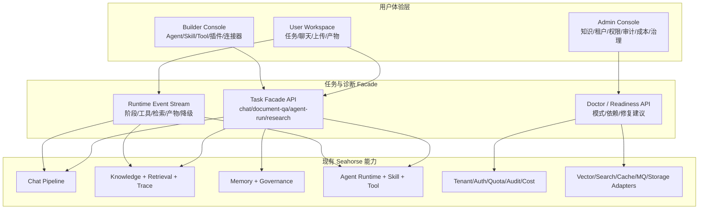

# Seahorse Agent 易用性与产品化优化落地方案

> 基于 `docs/analysis/seahorse-agent-vs-deerflow-comparison.md` 的结论，本方案聚焦一个目标：在不推翻 Seahorse Agent 现有企业级内核和适配器架构的前提下，把首次使用路径、任务执行体验、配置诊断和运行可观测性补齐到接近 DeerFlow 的易用水平。

## 1. 优化目标

### 1.1 总目标

让 Seahorse Agent 从“企业 AI 平台控制台”升级为“双层产品体验”：

- 对普通用户：默认进入任务工作台，能快速聊天、上传资料、运行 Agent、查看产物和进度。
- 对构建者：进入 Builder Console 管理 Agent、Skill、Tool、插件、连接器和沙箱。
- 对管理员：进入 Admin Console 管理知识库、租户、权限、配额、审计、成本、治理和基础设施健康。

核心原则是：保留企业能力深度，但不让新用户一开始就被企业复杂度挡住。

### 1.2 可量化目标

| 指标 | 当前问题 | 优化目标 |
| --- | --- | --- |
| 首次可用时间 | 全量部署依赖多，轻量部署能力边界不直观 | Demo Mode 下 5 分钟内完成登录、聊天和示例任务 |
| 首次任务路径 | 用户需要理解知识库、Agent、Skill、Tool、模型等概念 | 首页直接提供“新建任务、上传资料、运行 Agent、查看产物” |
| 配置诊断 | 依赖日志、文档和人工排查 | Web/CLI/API 提供 doctor 诊断和修复建议 |
| 长任务感知 | 检索、记忆、工具、审批、生成过程不够显性 | 任务 Timeline 展示阶段、耗时、降级、工具调用和产物 |
| 管理复杂度 | Admin 菜单过宽，普通用户和管理员入口混杂 | Workspace / Builder / Admin 三层信息架构 |
| API 使用成本 | 前端需要组合多个细粒度 API | 新增任务级 Facade API，内部复用现有服务 |

## 2. 总体方案

本方案不建议重写 Seahorse Agent，也不建议照搬 DeerFlow 的 LangGraph/LangChain 技术栈。更合适的路线是：在现有 Ports and Adapters 架构之上增加“产品化外壳”。



## 3. 分阶段路线图

### Phase 0：基线梳理与成功路径冻结

周期建议：2 到 3 天。

目标：先定义“什么叫 Seahorse Agent 易用了”，并冻结第一条最短成功路径。

#### 交付物

- 一份 `docs/product/first-success-path.md`。
- 一份 `docs/product/product-modes.md`。
- 一份 `docs/product/ux-metrics.md`。
- 一组人工验收脚本，覆盖 Demo Mode 首次体验。

#### 关键决策

第一条成功路径建议定义为：

1. 用户打开系统。
2. 登录或使用默认 Demo 用户。
3. 进入 User Workspace。
4. 看到系统健康状态为“可进行基础任务”。
5. 选择“示例：GitHub 仓库生成 Mermaid 架构图”或“上传文档问答”。
6. 看到任务 Timeline。
7. 得到回答、引用或 Mermaid 产物。
8. 可以打开 Trace 或产物详情。

#### 验收标准

- 新用户不进入 Admin Console 也能完成一次任务。
- 不要求用户理解 Milvus、Pulsar、Redis、Skill、Tool、Trace 等概念。
- 如果关键配置缺失，页面给出明确修复建议，而不是空白、报错或控制台异常。

## 4. Phase 1：产品模式封装

周期建议：1 周。

目标：用 `demo`、`rag`、`enterprise` 三种产品模式封装复杂适配器组合，降低用户对基础设施的直接选择成本。

### 4.1 产品模式定义

| 模式 | 面向对象 | 默认能力 | 默认依赖 | 关闭/降级能力 |
| --- | --- | --- | --- | --- |
| `demo` | 首次试用、开发者本地验证 | 聊天、示例任务、基础 Agent、基础产物 | PostgreSQL 或内存替代、local cache、direct mq、local storage、noop/pgvector | 企业多租户高级治理、Pulsar、Redis、MinIO、Milvus 必需项 |
| `rag` | RAG 场景验证 | 知识库、文档上传、向量/关键词检索、Trace、引用 | PostgreSQL + pgvector 或 Milvus、Lucene 或 ES、local/Redis cache | 复杂 SaaS 运营、成本、部分治理 |
| `enterprise` | 企业级试点/生产 | 多租户、ACL、审计、配额、成本、全量 RAG、异步任务、监控 | PostgreSQL、Milvus、ES、Redis、Pulsar、MinIO、Prometheus、Grafana | 不默认降级，依赖缺失时明确阻断 |

### 4.2 后端落地点

建议新增或收敛到统一配置对象（已实现）：

- `seahorse-agent.product-mode=demo|rag|enterprise`（环境变量 `SEAHORSE_AGENT_PRODUCT_MODE`）
- `seahorse-agent.adapters.*`（各 adapter 配置项）
- `seahorse-agent.advanced.*`（各高级功能开关）

后端启动时将 product mode 转换为 capability map，供 Web 层和前端读取。实现类为 `AdvancedFeatureGate`，通过 `ProductMode.fromProperty()` 解析配置值。

可复用现有能力：

- `SeahorseFeatureController`
- `useFeatureStore`
- `ADVANCED_ADMIN_FEATURES`
- 现有 adapter conditional configuration

### 4.3 前端落地点

前端不再只判断“功能开关是否启用”，还要展示“当前模式是否支持”：

- Demo Mode 中显示“当前为体验模式，RAG 能力为轻量版本”。
- RAG Mode 中显示“知识库问答可用，企业治理能力未完全启用”。
- Enterprise Mode 中显示“生产能力完整，依赖缺失会阻断相关功能”。

### 4.4 验收标准

- `/api/features` 返回 product mode、能力列表、降级原因。
- 前端根据模式自动隐藏或降级高级入口。
- Demo Mode 首次启动不要求 Redis、Pulsar、MinIO、Milvus 全部可用。
- Enterprise Mode 缺失关键依赖时给出阻断级错误和修复建议。

## 5. Phase 2：Seahorse Doctor 与 Readiness 面板

周期建议：1 到 2 周。

目标：补齐 DeerFlow `make doctor` 级别的诊断体验，并把技术错误翻译为用户可操作建议。

### 5.1 诊断分层

Doctor 应分为三层：

1. 基础启动诊断：应用、数据库迁移、默认用户、默认租户、配置文件。
2. AI 能力诊断：聊天模型、embedding 模型、向量维度、模型路由、API Key。
3. 平台能力诊断：向量库、关键词搜索、缓存、消息队列、对象存储、Trace、审计、feature flags。

### 5.2 API 设计

> **路径约定说明**：前端通过 nginx 反向代理 `/api` 访问后端，后端 Controller 实际映射路径不带 `/api` 前缀。例如后端 `ReadinessController` 映射 `/readiness/*`，前端通过 `/api/readiness/*` 调用。下文统一使用前端调用路径（含 `/api` 前缀）。

已实现（后端 `ReadinessController` 映射 `/readiness`）：

- `GET /api/readiness/summary`
- `GET /api/readiness/checks`
- `POST /api/readiness/checks/{checkId}/run`
- `GET /api/readiness/product-mode`

返回结构（已实现）：

```json
{
  "mode": "rag",
  "overall": "degraded",
  "overallLabel": "部分能力降级",
  "passedCount": 11,
  "failedCount": 1,
  "totalCount": 13,
  "checks": [
    {
      "id": "embedding.dimension",
      "name": "Embedding 维度一致性",
      "severity": "error",
      "status": "failed",
      "message": "当前 embedding 模型输出维度与向量库集合维度不一致。",
      "impact": "知识库检索不可用，文档问答会降级或失败。",
      "suggestion": "确认模型配置中的 embedding 维度，并重建向量集合或切换到匹配模型。",
      "docsUrl": "/docs/deployment/local-embedding-model-guide.md"
    }
  ]
}
```

> 注：`impact`、`suggestion`、`docsUrl` 为条件字段，仅在检查失败或降级时返回；通过（`passed`）和跳过（`skipped`）状态的检查项不包含这三个字段。`severity` 枚举值为 `ERROR`/`WARN`/`INFO`，JSON 输出为小写。

### 5.3 检查项清单

| Check ID | 检查内容 | Demo | RAG | Enterprise |
| --- | --- | --- | --- | --- |
| `app.boot` | 应用启动与 profile | 必需 | 必需 | 必需 |
| `db.connection` | 数据库连接可用性 | 必需 | 必需 | 必需 |
| `db.migration` | 数据库迁移版本 | 必需 | 必需 | 必需 |
| `auth.default-admin` | 默认管理员/登录状态 | 必需 | 必需 | 必需 |
| `model.chat` | 聊天模型可用性 | 必需 | 必需 | 必需 |
| `model.embedding` | Embedding 模型可用性 | 可选 | 必需 | 必需 |
| `embedding.dimension` | embedding 与向量库维度一致性 | 可选 | 必需 | 必需 |
| `vector.store` | pgvector/Milvus 可用性 | 可降级 | 必需 | 必需 |
| `search.keyword` | Lucene/ES 可用性 | 可降级 | 推荐 | 必需 |
| `cache` | local/Redis 缓存 | local 可用即可 | local/Redis | Redis 必需 |
| `mq` | direct/Pulsar 消息队列 | direct 可用即可 | direct 可用即可 | Pulsar 必需 |
| `storage` | local/MinIO 对象存储 | local 可用即可 | local 可用即可 | MinIO 推荐或必需 |
| `feature.flags` | 前后端能力开关一致性 | 必需 | 必需 | 必需 |

### 5.4 前端面板

新增 Readiness 页面：

- 入口：`/admin/readiness`，同时在 Workspace 顶部展示简版状态。
- 状态分类：可用、降级、阻断、未配置。
- 每个检查项展示：影响、修复建议、相关文档、重新检测按钮。
- 对普通用户只展示“当前哪些任务可用”，不展示底层复杂细节。

### 5.5 CLI 方案

可先做轻量脚本：

- Windows：`scripts/seahorse-doctor.ps1`
- Unix：`scripts/seahorse-doctor.sh`

脚本调用 `/readiness/checks`（后端直接路径），输出表格和修复建议。后续再升级为独立 CLI。

### 5.6 验收标准

- 故意关闭 Redis/Pulsar/Milvus 时，Doctor 能按当前 product mode 给出正确 severity。
- embedding 维度不一致时，返回明确影响和修复建议。
- 前端 Workspace 能显示“基础聊天可用 / RAG 不可用 / 企业能力未启用”等用户语言。

## 6. Phase 3：User Workspace 与信息架构重组

周期建议：2 周。

目标：把默认体验从 Admin Console 改为 User Workspace，让用户首先看到任务，而不是平台模块。

### 6.1 新信息架构

建议将前端分为三套导航：

#### User Workspace

面向普通用户：

- `/workspace`
- `/workspace/tasks`
- `/workspace/tasks/:taskId`
- `/workspace/chat`
- `/workspace/uploads`
- `/workspace/artifacts`
- `/workspace/memories`

核心动作：

- 新建任务。
- 上传资料。
- 运行 Agent。
- 查看产物。
- 查看引用和 Trace 简版。

#### Builder Console

面向构建者：

- Agent 管理。
- Skill 管理。
- Tool 目录。
- 插件管理。
- OpenAPI 连接器。
- 沙箱。
- Agent 评测。

可先复用现有 `/admin/agents`、`/admin/skills`、`/admin/tools` 等页面，只是换导航分组。

#### Admin Console

面向管理员：

- 知识库治理。
- 租户、用户、权限、ACL。
- 配额、计费、成本。
- 审计、Trace、元数据治理、记忆治理。
- Readiness、系统设置、模型配置。

### 6.2 默认路由策略

建议调整：

- 普通用户登录后进入 `/workspace`。
- 管理员登录后如果首次登录也进入 `/workspace`，顶部提供 Builder/Admin 切换。
- `/admin` 保留，但不作为默认体验入口。
- `/chat` 可保留兼容，逐步重定向或纳入 Workspace。

### 6.3 Workspace 首页布局

Workspace 首页建议只包含四块：

1. 顶部任务输入框：用户输入要完成的事。
2. 快捷任务模板：文档问答、知识库问答、运行 Agent、生成 Mermaid 架构图。
3. 最近任务：状态、进度、产物。
4. 系统可用性简版：基础聊天、文档问答、Agent 运行是否可用。

### 6.4 前端改造范围

已新增（实现状态）：

- `frontend/src/pages/workspace/WorkspaceHomePage.tsx` — 工作台首页
- `frontend/src/pages/workspace/TaskRunPage.tsx` — 任务运行详情
- `frontend/src/pages/workspace/TaskListPage.tsx` — 任务列表
- `frontend/src/pages/workspace/QuickTaskCard.tsx` — 快捷任务卡片
- `frontend/src/pages/workspace/GithubMermaidExamplePage.tsx` — Mermaid 示例页
- `frontend/src/services/taskService.ts` — 任务 API 封装
- `frontend/src/services/readinessService.ts` — Readiness API 封装
- `frontend/src/stores/taskStore.ts` — 任务状态管理
- `frontend/src/stores/readinessStore.ts` — Readiness 状态管理
- `frontend/src/components/readiness/ReadinessStatusBar.tsx` — Readiness 状态栏
- `frontend/src/components/task/TaskCard.tsx` — 任务卡片组件

> 注：工作台页面复用 `MainLayout` 作为通用布局组件，未引入独立的 `WorkspaceLayout`。产物展示内嵌在 `TaskRunPage` 中，未拆分为独立的 `ArtifactListPage`。

建议调整：

- `frontend/src/router.tsx`
- `frontend/src/components/CommandPalette.tsx`
- `frontend/src/components/layout/Sidebar.tsx`
- `frontend/src/pages/admin/AdminLayout.tsx`

### 6.5 验收标准

- 登录后第一屏能直接发起任务。
- 用户不进入 Admin Console 也能完成一次 Demo 任务。
- 管理员仍可完整访问原有后台能力。
- Command Palette 能搜索 Workspace、Builder、Admin 三类入口。

## 7. Phase 4：任务级 Facade API

周期建议：2 到 3 周。

目标：减少前端直接拼接多个领域 API 的复杂度，提供面向用户任务的统一入口。

### 7.1 为什么需要 Facade

当前 Seahorse Agent 的 API 更像领域能力集合：Chat、Knowledge、Agent、Skill、Tool、Trace、Memory 各自独立。这适合后台管理，但不适合普通用户任务。

Facade 不替代现有服务，只做编排：

- 接收用户任务。
- 判断任务类型。
- 选择聊天、RAG、Agent run 或文档问答路径。
- 产生统一 taskId。
- 输出统一事件流。
- 汇总 artifacts。

### 7.2 建议新增后端模块

在 kernel application 层新增任务编排服务（已实现为统一服务）：

- `TaskOrchestrationService`（实现 `TaskInboundPort`，统一承担任务创建、事件发布、产物汇总职责）

> 注：实际实现采用了更简洁的设计——将所有任务编排逻辑统一由 `TaskOrchestrationService` 承载，而非拆分为多个独立服务。该服务内部处理任务类型路由（`quick_chat`/`document_qa`/`knowledge_qa`/`agent_run`）、事件流管理、产物聚合等。

在 web adapter 层新增（已实现）：

- `SeahorseTaskController`（映射 `/tasks`）
- `CreateTaskRequest`
- `TaskResponse`
- `TaskEventResponse`
- `TaskArtifactResponse`

### 7.3 API 设计（已实现）

> **路径约定**：后端 `SeahorseTaskController` 映射 `/tasks`，前端通过 nginx `/api` 代理调用，因此前端调用路径为 `/api/tasks`。

#### 创建任务

`POST /api/tasks`（后端 `/tasks`）

```json
{
  "type": "document_qa",
  "question": "总结这份文档，并给出 Mermaid 架构图",
  "agentId": "github-mermaid-agent",
  "knowledgeBaseId": "kb-001",
  "attachmentIds": ["att-001"],
  "mode": "auto"
}
```

响应：

```json
{
  "code": "0",
  "data": {
    "taskId": "task_001",
    "type": "document_qa",
    "status": "running",
    "conversationId": "conv-001",
    "question": "总结这份文档，并给出 Mermaid 架构图",
    "createdAt": "2026-06-19T12:00:00Z",
    "startedAt": "2026-06-19T12:00:00Z"
  }
}
```

#### 获取任务详情

`GET /api/tasks/{taskId}`（后端 `GET /tasks/{taskId}`）

#### 取消任务

`POST /api/tasks/{taskId}/cancel`（后端 `POST /tasks/{taskId}/cancel`）

#### 任务事件流

`GET /api/tasks/{taskId}/events`（后端 `GET /tasks/{taskId}/events`，SSE 协议）

事件类型建议：

- `task.created`
- `task.started`
- `model.selected`
- `memory.recalled`
- `retrieval.started`
- `retrieval.completed`
- `skill.selected`
- `tool.started`
- `tool.completed`
- `approval.required`
- `artifact.created`
- `degraded`
- `task.completed`
- `task.failed`

#### 任务产物

`GET /api/tasks/{taskId}/artifacts`（后端 `GET /tasks/{taskId}/artifacts`）

产物类型建议：

- `markdown`
- `mermaid`
- `file`
- `citation`
- `trace`
- `image`，仅保留类型兼容，不作为默认能力。

### 7.4 与现有能力映射

| 任务类型 | 内部复用能力 |
| --- | --- |
| `quick_chat` | `KernelChatInboundService`、Chat SSE |
| `document_qa` | Conversation attachment、Knowledge document parsing、RAG retrieval、Trace |
| `knowledge_qa` | KnowledgeBase、RetrievalEngine、RagTrace |
| `agent_run` | AgentDefinition、AgentRun、Skill、Tool、Approval、Artifacts |
| `research` | AgentRun + Retrieval + Artifacts，先做轻量版 |

### 7.5 验收标准

- 前端 Workspace 发起任务只调用 `POST /api/tasks`。
- TaskRunPage 只依赖任务详情、事件流和产物列表。
- 现有 Chat、Agent Run、RAG Trace 页面不被破坏。
- 任务失败时有统一错误结构和用户可读说明。

## 8. Phase 5：运行过程 Timeline 与产物模型

周期建议：2 周。

目标：提升长任务感知速度，补齐 DeerFlow 类似 run/workspace/artifacts 的体验。

### 8.1 Timeline 展示内容

TaskRunPage 中展示：

- 当前状态：排队、运行、等待审批、已完成、失败、已取消。
- 阶段列表：理解任务、检索知识、召回记忆、选择技能、调用工具、生成答案、保存产物。
- 每个阶段的开始时间、耗时、输入摘要、输出摘要。
- 降级提示：例如“向量检索不可用，已使用关键词检索”。
- 引用来源：知识库、文档、chunk、Trace。
- 工具调用：工具名、参数摘要、结果摘要、失败原因。
- 产物列表：Markdown、Mermaid、附件、Trace 链接。

### 8.2 产物模型建议

建议在 kernel 中形成统一 Artifact 概念，即使底层仍复用现有 Agent Artifact：

| 字段 | 含义 |
| --- | --- |
| `artifactId` | 产物 ID |
| `taskId` | 所属任务 |
| `runId` | 关联 Agent run 或 chat run |
| `type` | markdown / mermaid / file / citation / trace |
| `title` | 展示标题 |
| `content` | 小产物可直接内联 |
| `storageRef` | 大文件或附件存储引用 |
| `metadata` | 来源、耗时、工具、知识库等 |
| `createdAt` | 创建时间 |

### 8.3 Mermaid-only 示例 Agent

结合前面“GitHub 图文生成去掉图片生成”的方向，建议将示例 Agent 产品化为：

- 名称：GitHub Mermaid 架构图生成。
- 输入：GitHub 仓库地址或上传代码包。
- 输出：Markdown 总结 + Mermaid 图。
- 禁用：图片生成。
- 产物类型：`markdown`、`mermaid`。
- 失败兜底：如果仓库读取失败，提示用户上传 README 或压缩包。

### 8.4 验收标准

- 运行 Agent 时，用户能看到每个阶段发生了什么。
- Mermaid 产物可以在前端直接预览和复制。
- 任务失败时保留已生成的部分产物和失败阶段。
- 降级事件清晰展示，不让用户误以为系统静默失效。

## 9. Phase 6：示例任务与引导体系

周期建议：1 周。

目标：提供可运行的默认示例，让用户不用自己理解平台结构也能感知价值。

### 9.1 内置示例任务

建议先做 4 个：

1. 快速聊天：验证模型可用。
2. 上传文档问答：验证附件、解析、检索和引用。
3. 知识库摘要：验证知识库、RAG、Trace。
4. GitHub Mermaid 架构图生成：验证 Agent、Skill、Tool、Artifact。

### 9.2 示例任务页面

每个示例任务展示：

- 适用场景。
- 当前系统是否满足运行条件。
- 需要补齐的配置。
- 一键运行按钮。
- 预期产物。

### 9.3 空状态优化

关键页面空状态不再只说“暂无数据”，而是给出下一步：

- 无知识库：创建知识库或运行文档问答示例。
- 无 Agent：使用内置 Agent 或创建 Agent。
- 无 Skill：安装默认 Skill 或查看 Skill 管理。
- RAG 不可用：打开 Readiness 面板查看原因。

### 9.4 验收标准

- 新用户能从空系统直接运行至少一个示例任务。
- 示例失败时给出具体修复建议。
- 示例任务能成为 e2e 测试主路径。

## 10. Phase 7：性能与感知速度优化

周期建议：持续优化，第一轮 1 到 2 周。

目标：让系统不只“实际更快”，还要“用户感知更快”。

### 10.1 后端性能措施

优先级从高到低：

1. 给 Task Event 增加阶段耗时。
2. 对 RAG 检索结果做短 TTL 缓存。
3. 对模型、embedding、向量库健康检查做缓存，避免每次页面加载都探测。
4. 对文档解析和向量化任务展示异步进度。
5. 对 Agent run 增加取消、重试、恢复的统一任务入口。

### 10.2 前端感知速度措施

1. 任务创建后立即进入运行页，显示 queued/running。
2. SSE 断开后自动重连，并展示“正在恢复连接”。
3. 阶段事件逐步出现，避免长时间空白。
4. 产物先出现草稿，再更新最终版本。
5. 对降级路径给出非阻断提示。

### 10.3 关键指标

| 指标 | 目标 |
| --- | --- |
| 首个事件出现时间 | 任务创建后 1 秒内 |
| 首个可见阶段 | 任务创建后 2 秒内 |
| SSE 断线恢复 | 5 秒内自动重连 |
| RAG 检索耗时展示 | 每次检索必须记录 |
| 用户取消任务 | 2 秒内状态变更为 cancelling/cancelled |

## 11. Phase 8：文档、部署与验收闭环

周期建议：1 周。

目标：让用户从文档到产品都能沿同一条成功路径走。

### 11.1 文档重组

建议新增：

- `docs/USER_QUICK_START.md`
- `docs/PRODUCT_MODES.md`
- `docs/TROUBLESHOOTING_DOCTOR.md`
- `docs/TASK_WORKSPACE_GUIDE.md`

建议改写 README 快速开始：

1. Demo Mode 5 分钟体验。
2. RAG Mode 文档问答。
3. Enterprise Mode 全量部署。
4. Doctor 排查。

### 11.2 e2e 主路径

用户已经明确简单功能不需要 TDD，后续实现时可按“先完成，再 e2e 验证”的方式推进。建议每个阶段至少保留以下 e2e：

- 登录后进入 Workspace。
- Readiness 显示基础聊天可用。
- 创建快速聊天任务并收到流式事件。
- 创建 Mermaid 示例任务并看到 Mermaid artifact。
- 管理员可进入 Admin Console。
- 缺少 RAG 依赖时，文档问答示例显示不可运行和修复建议。

### 11.3 验收环境

至少准备三套：

- Demo：最小依赖，验证首次体验。
- RAG：pgvector 或 Milvus，验证知识库问答。
- Enterprise：全量 compose，验证治理和依赖诊断。

## 12. 优先级排序

### P0：必须先做

1. 产品模式：`demo/rag/enterprise`。
2. Readiness/Doctor API。
3. Workspace 首页和默认路由。
4. 任务级 Facade API 最小版：`quick_chat`、`agent_run`。
5. Task Timeline 最小版：状态、阶段、错误、产物。

### P1：紧随其后

1. 文档问答任务：`document_qa`。
2. Artifact 统一模型。
3. Mermaid 示例 Agent 产品化。
4. Builder/Admin 导航重组。
5. CLI doctor 脚本。

### P2：体验打磨

1. RAG Mode 引导向导。
2. 示例任务库。
3. 任务模板市场。
4. 运行过程成本和 token 展示。
5. 任务分享、导出和复用。

## 13. 建议实施顺序

### Sprint 1：模式与诊断

目标：系统能告诉用户“当前能做什么，不能做什么，为什么”。

任务：

- 定义 product mode 和 capability map（已实现：`AdvancedFeatureGate` + `ProductMode` 枚举）。
- 扩展 `/api/features`（已实现：`SeahorseFeatureController`）并新增 `/readiness/summary`（已实现：`ReadinessController`）。
- 实现基础 Doctor checks（已实现：`KernelReadinessService` 13 项检查）。
- 前端增加简版健康状态条（已实现：`ReadinessStatusBar`）。
- 文档补充 Demo/RAG/Enterprise 模式说明。

验收：

- Demo Mode 无 Redis/Pulsar/Milvus 也能显示基础聊天可用。
- Enterprise Mode 缺失依赖时显示阻断级诊断。

### Sprint 2：Workspace 第一屏

目标：登录后用户能直接开始任务。

任务：

- 新增 WorkspaceHomePage（复用 MainLayout 作为布局组件）。
- 调整登录后默认路由（已实现：`LoginPage` 登录后导航至 `/workspace`）。
- 增加快捷任务入口。
- 增加最近任务区域。
- Command Palette 增加 Workspace 入口。

验收：

- 普通用户登录后进入 Workspace。
- 管理员可从 Workspace 切到 Admin。

### Sprint 3：任务 Facade 最小闭环

目标：用统一任务入口跑通 quick chat 和 agent run。

任务：

- 新增 SeahorseTaskController（已实现，映射 `/tasks`）。
- 新增 TaskOrchestrationService（已实现，实现 `TaskInboundPort`）。
- 统一 taskId/status（已实现，taskId 格式 `task_*`）。
- 新增任务事件流（已实现，SSE 协议，支持历史回放 + 实时推送）。
- 前端 TaskRunPage 订阅事件（已实现，使用 `fetch + ReadableStream`）。

验收：

- Workspace 创建任务后进入 TaskRunPage。
- 页面能看到 queued、running、completed 或 failed。

### Sprint 4：Artifacts 与 Mermaid 示例

目标：用户能看到任务产物，而不是只看到聊天回答。

任务：

- 定义 Artifact DTO。
- 复用或包装现有 Agent Artifact。
- TaskRunPage 展示产物列表。
- Mermaid artifact 支持预览、复制、下载。
- 内置 GitHub Mermaid 架构图示例任务。

验收：

- 示例 Agent 输出 Mermaid。
- 图片生成不作为默认路径。

### Sprint 5：文档问答与 RAG 引导

目标：跑通 Seahorse Agent 最核心的企业知识价值。

任务：

- `document_qa` 任务类型。
- 上传、解析、检索、引用串联。
- RAG 不可用时给出 readiness 修复入口。
- Trace 简版进入 TaskRunPage。

验收：

- 上传文档后可以问答。
- 回答能展示引用来源。
- embedding 或向量库异常时有明确提示。

### Sprint 6：导航重组与发布打磨

目标：把新体验稳定下来，不破坏原有后台能力。

任务：

- Builder Console 导航分组。
- Admin Console 导航瘦身。
- 空状态优化。
- README 快速开始改写。
- e2e 主路径固化。

验收：

- 普通用户、构建者、管理员三类路径清晰。
- 老后台 URL 仍可访问。

## 14. 风险与应对

| 风险 | 影响 | 应对 |
| --- | --- | --- |
| Facade API 与现有 Chat/Agent/RAG API 重复 | 增加维护成本 | Facade 只编排，不复制业务逻辑；原 API 保持领域管理职责 |
| Product Mode 与 feature flags 冲突 | 前端显示和后端能力不一致 | 后端生成唯一 capability map，前端只消费结果 |
| Doctor 检查太重 | 页面加载慢 | 区分 summary 和 deep checks，重检查异步触发并缓存 |
| Workspace 改动影响管理员 | 老用户路径变化 | 保留 `/admin`，管理员可设置默认进入 Admin 或 Workspace |
| Artifact 模型牵涉存储改造 | 范围膨胀 | 第一版只包装现有 Agent Artifact 和内联 Mermaid/Markdown |
| Demo Mode 被误解为生产能力 | 预期错位 | UI 和文档明确标注 Demo 降级项 |

## 15. 成功标准

当以下条件满足，可以认为第一阶段优化达到预期：

1. 新用户能在 Demo Mode 下 5 分钟内完成一次任务。
2. 用户登录后默认进入 Workspace，而不是复杂 Admin Console。
3. 系统能明确告诉用户当前哪些能力可用、哪些不可用、如何修复。
4. 长任务有 Timeline、状态、阶段耗时、错误和产物。
5. Mermaid 示例 Agent 能稳定产出 Mermaid，不依赖图片生成。
6. 管理员仍能访问完整企业治理能力。
7. README 的快速开始路径与产品内路径一致。

## 16. 最小可行版本范围

如果希望最快落地，建议 MVP 只做以下内容：

1. `demo/rag/enterprise` product mode 字段和 capability map（已实现）。
2. `/readiness/summary`（已实现，前端通过 `/api/readiness/summary` 调用）。
3. `/workspace` 首页（已实现）。
4. `POST /tasks` 支持 `quick_chat` 和 `agent_run`（已实现，前端通过 `/api/tasks` 调用）。
5. `GET /tasks/{taskId}/events`（已实现，SSE 事件流）。
6. TaskRunPage 展示状态、阶段和 Mermaid/Markdown artifacts（已实现）。
7. GitHub Mermaid 架构图示例任务（已实现）。

这条 MVP 不需要一次性重构所有后台页面，也不需要重写 RAG、Agent、Skill、Tool 的内部实现。它的价值在于先把 Seahorse Agent 的“第一口体验”做顺。

