# Seahorse Agent 与 DeerFlow 对比分析

> 分析对象：
> - Seahorse Agent：当前仓库代码与文档，重点参考 `README.md`、`DEPLOY.md`、`docs/architecture/current-code-architecture.md`、`frontend`、`seahorse-agent-adapter-web`、`seahorse-agent-kernel`。
> - DeerFlow：`https://github.com/bytedance/deer-flow`，重点参考 `README.md`、`README_zh.md`、`Install.md`、`config.example.yaml` 以及其 `backend`、`frontend`、`skills`、`docker` 目录结构。

## 1. 总体结论

Seahorse Agent 与 DeerFlow 的核心差异，不是“谁的能力更多”，而是产品重心不同。

Seahorse Agent 更像一个企业级 AI 应用平台：它把 RAG、长期记忆、用户画像、Agent/Skill/Tool、租户治理、审计、成本、配额、评测、追踪、数据治理和可观测性都纳入同一套可插拔架构中。它的技术纵深更深，治理边界更完整，适合作为企业内构建知识智能体和可治理 AI 应用的底座。

DeerFlow 更像一个开箱即用的 super agent harness：它把用户最容易理解的任务入口、workspace、sandbox、skills、memory、sub-agents 和报告/文件产出组织成一个更短的“首次成功路径”。它的企业治理边界不如 Seahorse Agent 完整，但在配置、启动、任务交互和心智模型上明显更低门槛。

因此，当前 Seahorse Agent 相比 DeerFlow 的易用性差距，主要来自三点：

1. Seahorse Agent 暴露的是平台复杂度，DeerFlow 暴露的是任务完成路径。
2. Seahorse Agent 的分层和适配器设计更工程化，但配置面、页面面和 API 面都更宽。
3. Seahorse Agent 的完整能力依赖更多基础设施，轻量部署又不能充分代表完整 RAG、记忆和治理质量；DeerFlow 默认用 SQLite、本地 memory、统一配置和 wizard/doctor 降低首启风险。

## 2. 一句话定位对比

| 维度 | Seahorse Agent | DeerFlow |
| --- | --- | --- |
| 产品定位 | 企业知识、长期记忆、可治理智能体平台 | 开箱即用的 super agent harness |
| 默认心智模型 | 先配置平台能力，再构建知识库、Agent、Skill、Tool、治理流程 | 给 agent 一个任务，在 sandbox/workspace 中规划、执行、产出 |
| 架构风格 | Java/Spring Boot，多模块，Ports and Adapters，企业治理优先 | Python/LangGraph/LangChain，Gateway + agent runtime，任务编排优先 |
| 首次成功路径 | Docker 轻量/全量部署后，需要理解模型、知识库、向量库、RAG、Agent 管理等概念 | `make setup` 或 `make config` 后配置模型，`make docker-start`，访问 `localhost:2026` |
| 扩展方式 | 内核端口 + 基础设施适配器 + Web 管理界面 + Skill/Tool/Agent 配置 | `config.yaml`、skills、tools、MCP、sandbox、custom agents |
| 强项 | 企业治理、可观测、审计、多租户、RAG 工程化、适配器边界 | 低门槛、任务导向、sandbox 文件系统、skills 可组合、agent 运行体验 |
| 主要短板 | 复杂度前置，配置和页面过载，完整体验依赖较重基础设施 | 企业级权限、审计、数据治理和可替换基础设施边界相对弱 |

## 3. 分层架构视角对比

### 3.1 表现层

#### Seahorse Agent

Seahorse Agent 的前端已经不是简单聊天页，而是一个管理后台型产品。当前 `frontend/src/router.tsx` 和 `frontend/src/pages/admin/AdminLayout.tsx` 暴露了大量页面入口，包括：

- 聊天、记忆中心、市场。
- 知识库、文档、分块、Trace、模型配置、系统设置。
- Agent 列表、创建、详情、编辑、灰度、评测、运行管理、检视器、审批中心。
- Skill 管理、工具目录、工具调用审计、插件管理、OpenAPI 连接器、密钥管理。
- 租户、用户、资源 ACL、访问决策、配额、计费、审计日志。
- 记忆治理、元数据治理、成本分析、沙箱等。

这说明 Seahorse Agent 的表现层覆盖了完整企业平台所需的操作面。但从首次用户体验看，它会带来明显认知负担：用户进入系统后看到的是平台能力矩阵，而不是一个“我现在要完成什么任务”的主路径。

DeerFlow 的前端和文档更强调 workspace、thread、run、skills、sandbox 和输出文件。用户的主路径更接近：

1. 配置模型。
2. 打开统一 Web 入口。
3. 输入任务。
4. 看 agent 流式执行、调用工具、读写文件。
5. 获取报告、网页、图片、代码或其他产物。

也就是说，DeerFlow 的表现层更像“任务工作台”，Seahorse Agent 的表现层更像“企业 AI 平台控制台”。后者能力更多，但对新用户不够温和。

### 3.2 API 网关层 / Web 适配器层

#### Seahorse Agent

`seahorse-agent-adapter-web` 是典型的入站适配器层，当前控制器数量很大，覆盖聊天、会话、知识库、文档、RAG 设置、Trace、Agent、Skill、Tool、审批、沙箱、租户、用户、审计、配额、计费、元数据治理、记忆治理、OpenAPI 连接器、插件等。

这种设计的优点是边界明确：Web 层负责 HTTP 协议、DTO、认证租户上下文、限流、异常处理，然后调用 kernel application service。它符合 Ports and Adapters 的方向。

问题是，Web 适配器层已经承担了很大的产品表面：

- API 数量多，新用户和前端开发者需要理解多个业务子域。
- 管理 API 与最终用户 API 共同存在，信息架构容易混杂。
- `/api` 代理路径与后端真实路径在文档中需要特别说明，说明路径认知成本已经外溢到用户文档。
- 租户、试用、权限、特性开关、限流、超级管理员等治理逻辑很完整，但会使调试和部署时的失败原因变得更难直接判断。

DeerFlow 的 Gateway 层更聚焦 thread/run/agent/sandbox/skills 这一条任务链路。其 README 明确说明统一访问地址是 `http://localhost:2026`，Gateway 保存 run state，并考虑 SSE、重连和取消等运行体验问题。它的 API 面未必比 Seahorse Agent 更规范，但更贴近用户执行任务时的感知链路。

### 3.3 业务逻辑层 / 核心内核层

#### Seahorse Agent

`seahorse-agent-kernel` 的 application 层非常丰富。当前可以看到聊天 pipeline、RAG 检索、多通道检索、缓存检索、记忆捕获、记忆治理、记忆召回评测、知识库、文档刷新、ingestion、Agent runtime、Skill 匹配、Tool 调用、模型路由、配额、审计、元数据治理、租户等服务。

这说明 Seahorse Agent 的 kernel 已经具备平台底座特征：领域边界多，生命周期长，适合承载企业级演进。

但从易用性看，kernel 的复杂性被比较直接地映射到了前端和配置中。用户在完成一个简单任务前，可能需要理解：

- 知识库、文档、chunk、embedding、向量库、关键词索引、重排、Trace。
- 记忆捕获、记忆分层、记忆治理、记忆评测。
- Agent、Skill、Tool、审批、运行记录、灰度、评测。
- 租户、权限、配额、密钥、成本、审计。

DeerFlow 的业务逻辑层借助 LangGraph/LangChain，把复杂度包装在 agent runtime、sub-agents、tools、skills 和 sandbox 里。用户不需要先理解每个内部服务，只需要知道“agent 可以用技能和工具在工作区里完成任务”。这使它在易用性上更占优。

### 3.4 数据访问层

#### Seahorse Agent

Seahorse Agent 的数据访问层更企业化：PostgreSQL/JDBC 仓储、Milvus/pgvector/noop 向量适配器、Elasticsearch/Lucene 搜索适配器、Redis/local 缓存、Pulsar/direct 消息队列、MinIO/local 对象存储等。

这种设计适合生产化：

- 可以替换关键基础设施。
- 可以在轻量、本地、企业全量部署之间切换。
- 可以围绕检索、缓存、异步任务和对象存储做性能优化。

代价是首次部署复杂。根据 `DEPLOY.md`，全量部署涉及 PostgreSQL、Redis、Elasticsearch、MinIO、Milvus、Pulsar、ZooKeeper、Prometheus、Grafana 等服务。轻量部署虽然更容易启动，但 README 也明确提示轻量部署默认不代表完整 RAG 检索质量。

DeerFlow 默认把状态落到 SQLite 和本地 memory 文件，`config.example.yaml` 中也明确说明缺省 `database.backend: sqlite`、`sqlite_dir: .deer-flow/data`、memory 默认 `memory.json`。这不是更适合大规模生产的方案，但非常适合让用户先成功跑起来。

### 3.5 基础设施层

#### Seahorse Agent

Seahorse Agent 的基础设施层更完整，接近企业平台：

- 全量 RAG：Milvus、Ollama embedding、Elasticsearch、PostgreSQL、RAG Trace。
- 消息和异步：Pulsar/direct。
- 缓存与限流：Redis/local。
- 对象存储：MinIO/local。
- 观测：Prometheus、Grafana、Trace、审计、成本分析。

这些能力构成了 Seahorse Agent 的上限，但也抬高了“启动并获得可信体验”的门槛。

DeerFlow 的基础设施层更偏用户任务执行：

- sandbox 可以本地、Docker 或 Kubernetes。
- skills 默认挂载到 `/mnt/skills`。
- workspace/uploads/outputs 是 agent 任务产物的核心模型。
- Docker 启动通过 `make docker-init`、`make docker-start` 包装。
- `make doctor` 负责把环境问题翻译成可操作提示。

它的优势不是基础设施更少，而是把基础设施复杂度包装成用户可理解的操作命令。

## 4. 架构图对比

```mermaid
flowchart TB
  subgraph Seahorse["Seahorse Agent：企业平台路径"]
    SUI["表现层：Chat + Admin Console<br/>知识库/Agent/Skill/Tool/治理/审计/成本"]
    SWEB["API 网关层：seahorse-agent-adapter-web<br/>大量 Controller + Auth/Tenant/Feature/RateLimit"]
    SKERNEL["业务逻辑层：seahorse-agent-kernel<br/>Chat/RAG/Memory/Agent/Skill/Governance"]
    SDATA["数据访问层：Repository/Vector/Search/Cache/MQ/Storage Ports"]
    SINFRA["基础设施层：PostgreSQL/Milvus/ES/Redis/Pulsar/MinIO/Prometheus/Grafana"]
    SUI --> SWEB --> SKERNEL --> SDATA --> SINFRA
  end

  subgraph DeerFlow["DeerFlow：任务工作台路径"]
    DUI["表现层：Workspace UI<br/>Thread/Run/Artifacts"]
    DGW["Gateway/API<br/>LangGraph-compatible API + SSE + Run State"]
    DAGENT["业务逻辑层：Lead Agent/Sub-agents<br/>LangGraph/LangChain + Skills/Tools"]
    DDATA["数据访问层：SQLite/Local Memory/Config/Skill Files"]
    DINFRA["基础设施层：Local/Docker/K8s Sandbox<br/>Workspace/Uploads/Outputs"]
    DUI --> DGW --> DAGENT --> DDATA --> DINFRA
  end
```

这张图反映的核心问题是：Seahorse Agent 的每一层都更强、更宽、更可治理，但用户需要跨越更多概念才能到达“完成任务”；DeerFlow 的每一层都围绕 thread/run/workspace 组织，更容易形成连续体验。

## 5. 五个维度详细对比

### 5.1 用户体验

#### 界面友好性

Seahorse Agent 的界面更偏管理系统，适合管理员、平台工程师、RAG 工程师和企业 AI 负责人。它有丰富的导航和功能模块，但对普通用户或首次试用者而言，主路径不够集中。

DeerFlow 的体验更偏 agent 工作台。其用户更容易理解“输入任务、agent 执行、产出文件”的闭环。即使底层有 LangGraph、sandbox、skills、tools，用户也不需要一开始就理解这些内部结构。

#### 操作便捷性

Seahorse Agent 的操作便捷性在高阶管理上更强，例如知识库治理、Agent 管理、评测、审批、审计和成本分析。但简单任务可能被高级概念包围：用户想“让 agent 帮我研究并生成报告”，却可能先遇到模型配置、知识库、Skill、Tool、Agent 定义、运行管理等入口。

DeerFlow 用 Makefile、配置向导、统一入口和 workspace 文件模型降低操作成本。`make setup`、`make doctor`、`make docker-init`、`make docker-start` 这些命令把复杂动作压缩成清晰步骤。

#### 响应速度和感知速度

Seahorse Agent 的实际响应速度取决于模型、检索、记忆、权限、审计、Trace、缓存、向量库和消息队列等多环节。完整链路强，但也容易让用户感受到启动慢、依赖多、失败点多。

DeerFlow 的任务也可能很慢，尤其是 deep research、sandbox 执行和多 agent 任务。但它通过流式运行、run state、SSE、workspace 输出等方式提高“可见进度”。这会让用户感知上更快、更可控。

### 5.2 功能完整性

Seahorse Agent 在企业功能完整性上更强：

- RAG：知识库、文档、分块、向量检索、关键词检索、混合检索、评测、Trace。
- 记忆：用户记忆、记忆治理、记忆召回评测、隐私控制。
- Agent：定义、运行、工具绑定、审批、灰度、评测、检视器。
- 治理：租户、用户、ACL、访问决策、配额、审计、成本。
- 基础设施：多种可替换适配器和全量观测。

DeerFlow 在任务完成能力上更完整：

- Lead agent/sub-agents 编排。
- skills 和 tools 的组合。
- sandbox 文件系统和命令执行。
- workspace/uploads/outputs。
- 报告、网页、演示、媒体生成等面向产出的技能生态。
- 多渠道和 MCP 扩展。

两者完整性的衡量标准不同：Seahorse Agent 更完整的是企业平台能力，DeerFlow 更完整的是“让 agent 做事并交付产物”的闭环。

### 5.3 技术架构

#### 微服务设计

Seahorse Agent 当前更像模块化单体加外部基础设施，而不是严格意义上的微服务拆分。它通过 Spring Boot 启动入口装配 kernel 和多个 adapter module，边界清晰，部署上仍可保持一个后端主体。这对一致性和开发效率有好处。

DeerFlow 也不是传统微服务架构。它的核心是 Gateway + backend agent runtime + frontend + sandbox/provisioner 等服务组合。它更强调运行时编排和 sandbox 隔离，而不是企业业务域微服务拆分。

#### 前后端分离

Seahorse Agent 的前后端分离清晰，Vite 前端通过 `/api` 代理后端，后端 Web adapter 暴露 REST/SSE 等接口。但 API 面广，前端 service 与 controller 的一致性维护成本较高。

DeerFlow 也具备前后端分离，并通过统一 `localhost:2026` 的 nginx/gateway 入口降低用户感知复杂度。对最终用户而言，它不要求理解前端端口、后端端口和 API 前缀之间的差异。

#### 适配器模式

Seahorse Agent 在适配器模式上更正统。内核通过端口依赖基础设施，具体实现由 adapter module 提供：

- vector：Milvus / pgvector / noop。
- search：Elasticsearch / Lucene。
- repository：PostgreSQL / JDBC。
- cache：local / Redis。
- mq：direct / Pulsar。
- storage：local / MinIO。
- web：HTTP 入站适配器。

这种设计利于生产环境替换和测试，但对用户而言会出现“我该选哪个 adapter、哪个部署模式、哪个配置项”的问题。

DeerFlow 的适配更偏配置和生态集成。模型、tools、skills、sandbox、channels、MCP 等更多通过 `config.yaml`、Python import path、目录约定和 LangChain/LangGraph 生态接入。它牺牲了一些强类型企业边界，换来更直接的扩展体验。

### 5.4 易用性

易用性是 Seahorse Agent 当前最明显落后 DeerFlow 的维度。

#### Seahorse Agent 的易用性短板

1. 首次路径不够单一
   用户既可以从聊天进入，也可以从知识库、模型配置、Agent、Skill、Tool、治理页面进入。入口很多，但缺少“按任务引导”的默认路径。

2. 部署模式需要解释
   轻量部署能启动，但不代表完整 RAG 质量；全量部署更接近真实效果，但依赖 PostgreSQL、Milvus、Elasticsearch、Redis、Pulsar、MinIO、Prometheus、Grafana 等组件。

3. 配置失败难定位
   模型、embedding、向量维度、向量库、关键词索引、消息队列、缓存、对象存储、租户和权限都可能造成可用性问题。当前更依赖文档和日志，而不是交互式诊断。

4. 高级治理概念过早出现
   租户、ACL、访问决策、配额、审计、成本、审批等非常重要，但对于首次用户来说会稀释“agent 帮我完成任务”的核心体验。

5. 产物模型不够突出
   DeerFlow 的 workspace/uploads/outputs 很容易让用户知道 agent 做了什么、文件在哪里。Seahorse Agent 更强调对话、知识库和后台管理，任务产物的视觉中心不够强。

#### DeerFlow 的易用性优势

1. `make setup` 交互式向导把模型、搜索、sandbox、安全选项串起来。
2. `make doctor` 提供可操作诊断，而不是让用户自己读日志。
3. `config.yaml` 是主要配置入口，默认 SQLite 和本地 memory 降低依赖。
4. 统一访问地址 `http://localhost:2026` 降低端口和代理认知。
5. skills、sandbox、workspace 都映射到用户可以理解的“任务能力”和“文件产物”。

### 5.5 性能表现

#### 向量检索效率

Seahorse Agent 的上限更高。Milvus、pgvector、Elasticsearch/Lucene、混合检索、重排、缓存检索和评测体系都说明它更适合做严肃 RAG 性能优化。全量部署中 Milvus + Elasticsearch + RAG Trace 的组合，比 DeerFlow 默认 SQLite/local memory 更接近企业知识检索场景。

但性能上限不等于默认体验好。Seahorse Agent 的完整检索链路需要正确配置 embedding 模型、向量维度、索引参数、关键词索引、数据导入、分块策略和缓存。任何一个环节配置不当，用户都会觉得“慢”或“不准”。

DeerFlow 不以企业知识库向量检索为核心优势。它的性能关键更多在 agent 编排、sandbox 启动、工具调用、流式输出和任务状态恢复。默认 SQLite 和本地 memory 对轻量使用很友好，但不适合直接类比大规模 RAG 检索性能。

#### 缓存机制

Seahorse Agent 有 local/Redis 缓存适配器、缓存检索引擎、限流和分布式协调能力，适合生产环境多实例部署。DeerFlow 的缓存和状态更多服务于 LangGraph checkpointer、run state 和本地开发体验。

#### 并发处理能力

Seahorse Agent 在企业并发上更有设计基础：Redis、Pulsar、分布式锁/信号量、任务队列、配额和限流等都可以支撑多用户、多租户和后台任务。

DeerFlow 的并发更围绕 sandbox 和 agent runs。它的 Docker/Kubernetes sandbox 模式可以隔离任务，但资源模型更偏 agent 执行容器，不是完整企业 SaaS 治理模型。

#### 感知性能

DeerFlow 在感知性能上更占优，因为它把长任务过程通过 streaming、run state、workspace 文件产出显性化。Seahorse Agent 即使后端性能更强，如果前端没有把检索、工具调用、记忆注入、审批等待、产物生成等过程清晰展示给用户，用户仍会感到慢或不可控。

## 6. 为什么 Seahorse Agent 的易用性落后 DeerFlow

### 6.1 frontend：管理后台强，任务工作台弱

Seahorse Agent 的前端信息架构明显以管理为中心。AdminLayout 中分组很多，覆盖知识工程、Agent 平台、集成、安全、运营、治理、高级配置等模块。这对企业管理者是优势，但对普通使用者不够直接。

DeerFlow 的用户界面围绕任务线程和 workspace 组织。用户进入后更容易知道下一步是“输入任务”。而 Seahorse Agent 用户可能先问：

- 我应该先创建知识库，还是先配置模型？
- Skill、Tool、Agent 有什么关系？
- 为什么有 Agent 控制台、Agent 检视器、Agent 运行、Agent 管理、审批中心？
- 记忆治理和记忆中心有什么区别？
- 当前系统哪些能力已经可用，哪些只是需要管理员配置？

这些问题不是功能缺陷，而是产品分层没有把“新手默认路径”和“管理员高级路径”分开。

### 6.2 seahorse-agent-adapter-web：API 表面过宽，诊断反馈不够产品化

Web 适配器层控制器非常丰富，这是平台能力的表现。但用户体验层面的挑战是：

- 后端能力暴露得很细，前端需要组合多个 API 才能完成一个用户任务。
- 失败原因可能来自认证、租户、特性开关、配额、限流、模型配置、向量库、检索索引、消息队列或数据权限。
- 当前更像“工程 API 集合”，还缺少 DeerFlow `make doctor` 那种面向用户的 readiness/doctor 能力。

建议 Seahorse Agent 把 Web adapter 分成两类入口：

1. 任务级 API：面向普通用户，例如“开始一次任务”“上传资料并问答”“生成报告”“运行某个 Agent”。
2. 管理级 API：面向管理员，例如知识库治理、Agent 定义、Skill 管理、租户、配额、审计等。

这样可以保留现有控制器能力，同时为前端提供更短的用户路径。

### 6.3 seahorse-agent-kernel：领域能力强，但缺少“简单模式”编排

Kernel 当前拥有很多高价值能力，但它们被拆成多个专业服务。对工程师而言，这是良好的模块化；对用户而言，这是认知负担。

DeerFlow 的 Lead Agent 把模型、skills、tools、sandbox、memory、sub-agents 组织成一个默认运行时。用户先获得一个统一 agent，再逐步理解内部能力。

Seahorse Agent 可以在 kernel 上增加一个“task orchestration facade”，把常见任务收敛为少数模板：

- 快速问答：只走模型和轻量上下文。
- 文档问答：上传文档、自动建临时知识上下文、回答问题。
- 企业 RAG：选择知识库、走完整检索、Trace、引用和反馈。
- Agent 任务：选择 Agent、展示计划、工具调用、审批和产物。
- 深度研究：多步骤检索、生成报告、保存 artifacts。

这类 facade 不需要替代现有服务，而是把它们编排成用户可理解的主路径。

### 6.4 部署：Seahorse 追求真实企业链路，DeerFlow 追求先跑通

Seahorse Agent 的全量部署更接近企业真实环境，但也更容易在首启阶段卡住。DeerFlow 默认 SQLite、本地 memory 和配置向导，让用户先获得可运行系统，再选择升级 sandbox、数据库或部署方式。

Seahorse Agent 当前也有轻量部署，但文档明确说明轻量部署不代表完整 RAG 质量。这里的体验矛盾是：新用户最需要轻量部署，但项目最想展示的是全量能力。

解决办法不是放弃全量部署，而是提供三个明确档位：

| 档位 | 目标 | 默认依赖 | 前端提示 |
| --- | --- | --- | --- |
| Demo Mode | 5 分钟跑通聊天和示例任务 | 本地/内存/noop/示例数据 | 明确标注“非完整 RAG” |
| RAG Mode | 跑通知识库上传、检索、引用、Trace | PostgreSQL + pgvector 或 Milvus + local cache | 引导用户完成 embedding 和索引健康检查 |
| Enterprise Mode | 多租户、审计、配额、Pulsar、Redis、监控 | 全量依赖 | 管理员 readiness 面板 |

### 6.5 配置：Seahorse 配置面更真实，DeerFlow 配置入口更集中

DeerFlow 的 `config.yaml` 是一个强信号：用户知道配置在哪里。`make setup` 和 `make doctor` 又进一步降低配置失败成本。

Seahorse Agent 的配置分布在 Docker Compose、`.env`、Spring properties、前端环境变量、适配器 properties、初始化 SQL 和管理页面中。它符合 Spring Boot 企业项目习惯，但新用户不容易知道“为了完成第一个任务，到底必须配置哪些项”。

Seahorse Agent 需要一个统一的 setup/doctor 层，至少检查：

- 模型 API 是否可用。
- embedding 模型是否可用，维度是否与向量库一致。
- 数据库迁移是否完成。
- 向量库集合/表是否存在。
- 关键词索引是否启用。
- Redis/Pulsar/MinIO 是否是必需项，当前模式是否允许降级。
- 前端 feature flags 与后端 product mode 是否一致。
- 默认管理员、默认租户、默认知识库或默认 Agent 是否可用。

## 7. 适配器模式实现评价

### 7.1 Seahorse Agent 的优势

Seahorse Agent 的适配器模式更适合企业长期演进：

- 内核不直接绑定具体基础设施，有利于测试和替换。
- 同一能力有多种实现，例如 vector、search、cache、mq、storage。
- Web 适配器作为入站边界，可以统一处理认证、租户、限流、异常和 DTO。
- 后续要接企业内部模型、私有向量库、对象存储或审计系统时，有明确扩展点。

### 7.2 Seahorse Agent 的不足

当前适配器模式的问题主要不是代码结构，而是产品化表达：

1. 适配器选择对用户暴露过早
   用户一开始就需要面对 Milvus/pgvector/noop、Elasticsearch/Lucene、Redis/local、Pulsar/direct 等选择。

2. 缺少模式级默认策略
   应该由 `demo/rag/enterprise` 这类产品模式决定默认适配器组合，而不是让用户自己理解每个适配器。

3. 适配器健康状态没有充分转化为用户语言
   “Milvus 连接失败”“embedding 维度不一致”“Pulsar topic 不存在”应该在前端 readiness 面板中变成明确修复建议。

4. 适配器能力与前端 feature flag 的关系需要更强约束
   如果某能力对应的适配器不可用，前端应显示降级状态、禁用入口或提供修复向导。

### 7.3 DeerFlow 的适配方式优势

DeerFlow 的适配方式更贴近开发者：

- 模型、tools、skills、sandbox、channels 都可以在 `config.yaml` 或目录中声明。
- skills 是可读的 Markdown 工作流，用户和 agent 都容易理解。
- sandbox/workspace 是天然的能力边界，用户知道文件在哪里。
- LangChain/LangGraph 生态降低了接入工具和模型的成本。

但 DeerFlow 的适配边界相对没有 Seahorse Agent 那样企业化。对于强审计、多租户、复杂权限、成本治理和基础设施替换，Seahorse Agent 的模式更稳。

## 8. 性能与可扩展性的进一步判断

### 8.1 Seahorse Agent 的性能潜力

Seahorse Agent 的性能潜力更高，尤其在企业知识场景：

- Milvus 适合大规模向量召回。
- Elasticsearch/Lucene 可支撑关键词检索和混合召回。
- Redis 可承担缓存、限流、锁和流任务。
- Pulsar 可支撑异步事件和后台任务。
- RAG Trace 和评测体系可以帮助持续优化召回质量与延迟。

### 8.2 Seahorse Agent 的性能风险

性能风险也更明显：

- 链路更长，单次聊天可能经过记忆、检索、重排、权限、审计、Trace、模型调用等多个阶段。
- 默认配置如果没有按数据规模调优，Milvus/pgvector/Elasticsearch 的性能可能不稳定。
- 多适配器降级路径如果没有清晰提示，用户可能误以为系统能力不可用或效果差。
- 前端如果没有展示检索阶段、工具阶段和模型阶段耗时，用户无法判断慢在哪里。

### 8.3 DeerFlow 的性能特点

DeerFlow 的性能优势主要是感知和任务编排：

- 流式输出让用户看到进度。
- run state 支持重连和取消，长任务可控。
- sandbox 隔离让复杂任务不会污染宿主环境。
- 默认 SQLite/local memory 降低本地开发延迟和依赖。

它的性能短板是大规模企业 RAG 和治理型并发并不是默认核心。

## 9. 具体改进建议

### 9.1 建立任务优先的首页和简单模式

新增 Simple Mode，默认只暴露：

- 新建对话。
- 上传资料。
- 选择任务模板。
- 选择 Agent。
- 查看运行过程。
- 查看产物和引用。

高级管理入口折叠到 Admin Console，不在首次体验中抢占注意力。

### 9.2 增加 Seahorse Doctor

提供类似 DeerFlow `make doctor` 的诊断能力：

- CLI：`./seahorse doctor` 或 `mvn ... doctor`。
- Web：管理后台 readiness 面板。
- API：`/api/readiness/full` 返回模型、embedding、数据库、向量库、搜索、缓存、消息队列、对象存储、租户、feature flag 的状态。

诊断结果必须给出用户级修复建议，而不是只返回技术错误。

### 9.3 用产品模式封装适配器组合

将部署模式从“用户选择一堆适配器”改为“选择产品模式”：

- `demo`：local cache、direct mq、local storage、pgvector 或 noop vector、内置示例。
- `rag`：PostgreSQL + pgvector/Milvus + Lucene/Elasticsearch + RAG Trace。
- `enterprise`：Redis + Pulsar + MinIO + Prometheus/Grafana + 多租户治理。

每个模式提供固定的默认配置和前端能力开关。

### 9.4 设计任务级 API Facade

在 `seahorse-agent-kernel` 和 `seahorse-agent-adapter-web` 之间增加任务级编排入口，例如：

- `POST /api/tasks/chat`
- `POST /api/tasks/document-qa`
- `POST /api/tasks/research`
- `POST /api/tasks/agent-run`
- `GET /api/tasks/{id}/events`
- `GET /api/tasks/{id}/artifacts`

这些 API 内部可以继续调用现有 Chat、Knowledge、Agent、Skill、Tool、Trace 服务，但对前端提供更清晰的用户路径。

### 9.5 强化运行过程可视化

参考 DeerFlow 的 run/workspace 体验，在 Seahorse Agent 前端展示：

- 当前阶段：理解问题、检索知识、召回记忆、选择 Skill、调用 Tool、生成回答、等待审批、保存产物。
- 阶段耗时。
- 使用了哪些知识库、记忆、工具和技能。
- 降级情况，例如向量库不可用时改走关键词检索。
- 产物列表，例如报告、Mermaid、附件、引用、Trace。

这样可以显著提升感知速度和可控感。

### 9.6 收敛前端信息架构

建议将现有前端分成三层：

1. User Workspace：聊天、任务、上传、产物、记忆中心。
2. Builder Console：Agent、Skill、Tool、插件、OpenAPI 连接器、沙箱。
3. Admin Console：知识治理、租户、权限、配额、审计、成本、监控。

不要让首次用户直接面对完整 Admin Console。

### 9.7 增加默认示例和成功路径

提供 3 到 5 个内置示例任务：

- 上传 PDF 后问答。
- 基于知识库生成摘要。
- 使用 GitHub 仓库内容生成 Mermaid 架构图。
- 运行一个只依赖 Mermaid 的图文/文档 Agent。
- 查看 RAG Trace 并反馈答案质量。

这些示例应该在 Demo Mode 下可直接运行，并在失败时给出修复提示。

### 9.8 把 Skill/Tool/Agent 的关系讲成用户语言

当前 Seahorse Agent 的 Agent/Skill/Tool 管理能力很强，但概念关系需要在产品中变得更直观：

- Agent：一个可运行的角色或流程。
- Skill：Agent 的工作方法和领域能力。
- Tool：Agent 可以调用的外部动作。
- Run：一次任务执行。
- Artifact：任务产物。

前端应围绕这个关系组织创建和运行流程。

## 10. 风险与优先级

| 优先级 | 问题 | 影响 | 建议 |
| --- | --- | --- | --- |
| P0 | 首次成功路径不清晰 | 新用户难以跑通核心价值 | 建立 Simple Mode + 示例任务 |
| P0 | 缺少 doctor/readiness | 配置失败定位困难 | 增加 CLI/Web/API 诊断 |
| P1 | 部署模式与能力质量关系复杂 | 轻量部署体验和全量能力预期冲突 | 用 demo/rag/enterprise 模式封装 |
| P1 | 前端管理入口过多 | 用户认知负担高 | 拆分 Workspace/Builder/Admin |
| P1 | 运行过程不可见 | 长任务感知慢、不可控 | 增加阶段事件和 artifacts |
| P2 | API 面过宽 | 前端组合复杂、维护成本高 | 增加任务级 API facade |
| P2 | 适配器健康状态不产品化 | 用户不知道如何修复 | adapter health 转换为修复建议 |
| P2 | Skill/Tool/Agent 概念抽象 | 新用户理解成本高 | 用创建向导和示例解释关系 |

## 11. 最终判断

Seahorse Agent 相比 DeerFlow 并不是架构落后，而是产品化路径不同。Seahorse Agent 的分层架构、适配器模式和企业治理能力更强，长期上限更高；DeerFlow 的优势在于把复杂 agent runtime 包装成更自然的任务工作台，并用统一配置、向导、doctor、sandbox 和 workspace 降低首次使用成本。

如果 Seahorse Agent 希望在易用性上接近 DeerFlow，不需要推翻现有架构。更合理的方向是：

1. 保留 kernel 和 adapter 的企业级边界。
2. 在 Web adapter 上增加任务级 facade。
3. 在 frontend 上新增 Simple Mode/Workspace。
4. 用 doctor/readiness 和产品模式隐藏基础设施复杂度。
5. 把运行过程、降级状态和产物模型显性化。

这样 Seahorse Agent 可以同时保留企业平台的深度，又获得 DeerFlow 那种“先跑通、再深入”的用户体验。
