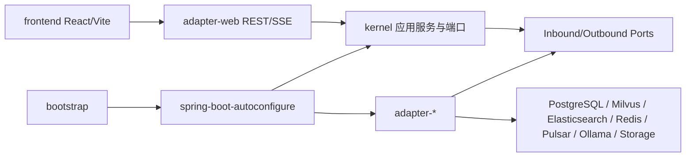
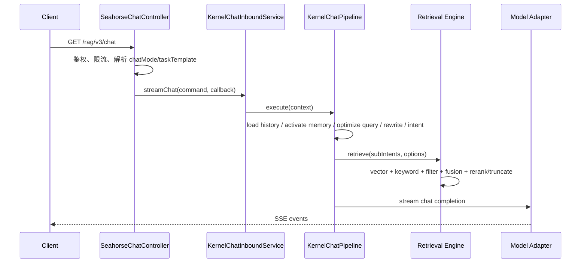
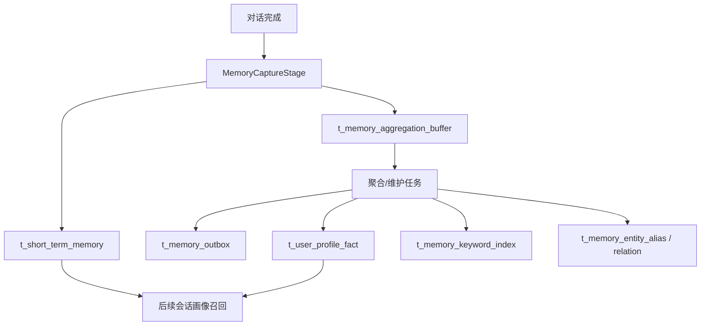

# 当前代码架构基线

日期：2026-06-14

本文把当前仓库代码、Docker 编排和可运行接口作为事实来源，用于校准 `docs/` 中的历史文档。若本文与早期 RepoWiki 文档冲突，以当前代码、`docker-compose.yml`、`docker-compose.full.yml` 和 Controller 注解为准。

## 1. 总体定位

Seahorse Agent 当前是一个基于 Spring Boot 3.5、Java 17、React + Vite 的企业级 RAG 与 Agent 平台。后端采用 Clean Architecture / Ports and Adapters：内核只依赖领域对象和端口，外部模型、向量库、缓存、消息、存储、搜索和观测能力都由 adapter 模块接入。

当前代码已经覆盖四条主闭环：

| 闭环 | 当前实现边界 | 运行证据 |
|---|---|---|
| RAG 闭环 | 知识库入库、分块、向量检索、关键词检索、后处理、Prompt 组装、SSE 回答 | `/admin/traces`、`t_rag_trace_*`、`t_knowledge_chunk` |
| 记忆闭环 | 对话记忆读取、记忆捕获、聚合缓冲、outbox、维护、readiness/health | `/memories/readiness`、`/memories/health`、`t_memory_*` |
| 用户画像闭环 | 从记忆候选派生用户画像事实，并可在后续会话召回 | `/memories/profile-facts`、`t_user_profile_fact` |
| 企业 Agent 闭环 | Agent 定义、运行、审批、工具、Skill、成本、配额、安全治理页面和接口骨架 | `/api/agents`、`/api/agent-runs`、`/api/tools`、`/api/skills` |

## 2. 模块拓扑

根 `pom.xml` 当前聚合以下关键模块：

| 层级 | 模块 | 职责 |
|---|---|---|
| 内核 | `seahorse-agent-kernel` | 领域模型、应用服务、端口接口、检索特性、记忆治理、插件注册 |
| Web 适配 | `seahorse-agent-adapter-web` | REST/SSE Controller、鉴权、Feature Gate、前后端契约 |
| 仓储适配 | `seahorse-agent-adapter-repository-jdbc` | PostgreSQL/JDBC 仓储、schema upgrade、记忆/画像/RAG 表访问 |
| 模型适配 | `seahorse-agent-adapter-ai-openai-compatible` | Chat、Embedding、Rerank、Image/Video 等 OpenAI 兼容模型接入 |
| 检索适配 | `seahorse-agent-adapter-vector-milvus`、`pgvector`、`noop`、`search-elasticsearch`、`search-lucene` | 向量与关键词检索 |
| 基础设施适配 | Redis/local cache、Pulsar/direct MQ、S3/local storage、Micrometer/noop observation | 外部依赖替换边界 |
| 自动配置 | `seahorse-agent-spring-boot-autoconfigure`、`starter-core`、`starter`、`starter-all` | Spring Boot Bean 装配和 starter 坐标 |
| 可执行应用 | `seahorse-agent-bootstrap` | 本仓库服务启动入口 |
| 前端 | `frontend` | React 管理后台、聊天、知识库、记忆、Agent、治理页面 |

架构依赖方向：



## 3. 运行模式与部署基线

后端默认启用内核模式：

```properties
spring.application.name=seahorse-agent-service
seahorse-agent.kernel.enabled=true
seahorse-agent.kernel.migration-mode=kernel
sa-token.token-name=Authorization
sa-token.token-prefix=Bearer
```

本地 Docker 有两个入口：

| 模式 | 编排文件 | 主要用途 | 关键差异 |
|---|---|---|---|
| 轻量部署 | `docker-compose.yml` | 前端、登录和基础 API 冒烟 | PostgreSQL + 后端 + 前端，向量为 `noop`，缓存 local，MQ direct |
| 全量部署 | `docker-compose.full.yml` | 真实 RAG、记忆、画像、企业治理和观测验证 | Milvus、Ollama、Redis、Elasticsearch、Pulsar、MinIO、Prometheus、Grafana |

全量部署当前运行事实：

| 能力 | 当前配置 |
|---|---|
| Chat 模型 | `SEAHORSE_AGENT_ADAPTERS_AI_*` 指向 OpenAI-compatible 服务 |
| Embedding | Ollama `nomic-embed-text` |
| Embedding Base URL | `http://ollama:11434/v1` |
| 向量维度 | 768 |
| 向量库 | Milvus |
| 关键词检索/索引 | Elasticsearch |
| 缓存与登录态 | Redis |
| MQ | Pulsar |
| 观测 | Micrometer + Prometheus + Grafana |
| 存储 | 当前后端默认 local storage；MinIO 已编排供后续 S3 切换 |

## 4. Web 与 API 边界

鉴权基线：

- 登录：`POST /auth/login`
- 刷新：`POST /auth/refresh`
- 退出：`POST /auth/logout`
- 受保护请求必须带 `Authorization: Bearer <token>`
- 前端容器通过 `/api` 反向代理后端；直连 `localhost:9090` 时使用真实后端路径。

关键接口分组：

| 领域 | 代表路径 |
|---|---|
| 聊天/RAG | `GET /rag/v3/chat`、`POST /rag/v3/stop` |
| 会话 | `/conversations` 与 `/api/conversations` 双路径兼容 |
| 知识库 | `/knowledge-base`、`/knowledge-base/{kb-id}/docs/upload`、`/knowledge-base/docs/{doc-id}/chunk` |
| RAG Trace | `/rag/traces/runs`、`/rag/traces/runs/{traceId}/nodes` |
| 记忆治理 | `/memories`、`/memories/readiness`、`/memories/profile-facts`、`/memories/maintenance/run` |
| Agent/Tool/Skill | `/api/agents`、`/api/agent-runs`、`/api/tools`、`/api/skills` |
| 企业治理 | `/api/admin/tenants`、`/api/admin/users`、`/api/quotas/*`、`/api/resource-acl-rules` |

## 5. RAG 主链路

当前 RAG 链路的事实路径：



检索侧已落地的关键能力：

- 向量通道：Milvus / pgvector / noop adapter。
- 关键词通道：Elasticsearch / Lucene adapter。
- 查询优化：规则版术语扩展，LLM QueryOptimizer 默认关闭。
- 多通道融合：RRF 与后处理链。
- Metadata filter compiler/guard。
- Rerank 和最终截断后处理。
- RAG Trace 记录 run、node、retrieval 等证据。

轻量部署使用 `noop` 向量适配器，只能证明 API 可用，不能证明真实 RAG 质量。

## 6. 记忆与用户画像链路

全量部署默认打开：

```env
SEAHORSE_AGENT_MEMORY_AGGREGATION_ENABLED=true
SEAHORSE_AGENT_MEMORY_AGGREGATION_IDLE_FLUSH_MILLIS=30000
SEAHORSE_AGENT_MEMORY_AGGREGATION_MAX_TURNS=5
```

运行链路：



判断闭环是否真的生效，不看“类是否存在”，看运行证据：

| 证据 | 说明 |
|---|---|
| `/memories/readiness` | 写入、召回、上下文注入、review、outbox、maintenance 的 capability 状态 |
| `/memories/profile-facts` | 当前用户/租户 active 画像事实 |
| `/memories/health` | 记忆健康、策略和最近运行状态 |
| `t_memory_trace_event` | 记忆链路 trace |
| `t_memory_outbox` | 派生索引任务和失败重试 |

当前自训练闭环仍是 `MANUAL_EXPORT_ONLY`，不应写成自动 SFT/DPO 已经运行。

## 7. 企业能力与 Feature Gate

企业后台由后端 capability 与前端路由共同控制：

- `SEAHORSE_AGENT_PRODUCT_MODE=enterprise-platform`
- `VITE_SEAHORSE_PRODUCT_MODE=enterprise-platform`
- `VITE_SEAHORSE_ENABLE_ADVANCED_ADMIN=true`
- 后端 `/api/features` 是运行时菜单和路由守卫的事实来源。

当前代码已提供 Agent 管理、Agent 运行、审批、Tool、Skill、Sandbox、Secret、Quota、Resource ACL、Audit、Billing、Cost、Tenant 等接口或页面骨架。判断某个能力是否“完整可生产”，还需要看该能力是否有真实 adapter、持久化、审计、E2E 测试和故障恢复路径。

## 8. 文档维护边界

后续更新文档时按此顺序判定事实：

1. Controller 注解、配置类、端口和 adapter 代码。
2. `docker-compose.yml`、`docker-compose.full.yml`。
3. `.env.example`、`.env.full.example` 中的可覆盖变量。
4. `resources/database/seahorse_init.sql` 与 migrations。
5. `docs/README.md`、本文件、`docs/USER_GUIDE.md`。
6. `docs/zh/content/**` 中的历史 RepoWiki 文档。

常见误读：

- `docker-compose.full.yml` 当前把 Embedding 固定为 Ollama `nomic-embed-text` + 768 维；不要再把 1024 维写成全量默认。
- `docker-compose.yml` 是轻量冒烟，不代表真实 Milvus RAG。
- MinIO 已编排，但当前后端存储默认还是 local。
- 前端页面路径 `/admin/model-config` 对应用户界面，后端模型配置 API 是 `/admin/ai-config`。
- 早期 `resources/docker/` 下按组件拆分的独立 compose 文件已经不是当前部署入口。

## 9. 对齐检查建议

文档修改后至少执行：

```bash
rg -n "file://resources/docker|file://docs/quick-start|qwen-(plus|emb-8b)" docs --glob "*.md" --glob "!docs/architecture/current-code-architecture.md"
git diff --check -- docs
```

涉及 API 文档时，再抽查 Controller：

```bash
rg -n "@(Get|Post|Put|Delete|Patch)Mapping|@RequestMapping" seahorse-agent-adapter-web/src/main/java/com/miracle/ai/seahorse/agent/adapters/web
```
