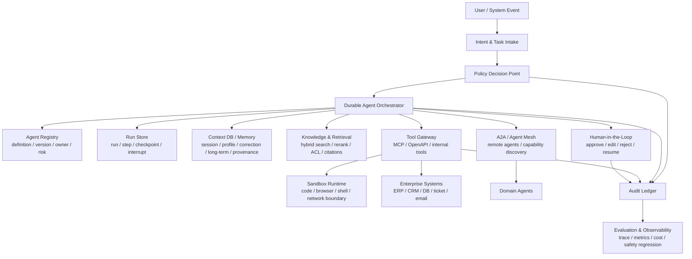

# Seahorse Agent 与企业级 Agent 差距分析

分析日期：2026-05-22
分析对象：`docs/company-agent/` 下两篇企业级 Agent 文章，以及 Seahorse Agent 当前代码库
结论口径：本文把“企业级 Agent”定义为可在企业生产环境中长期运行、可授权行动、可审计、可恢复、可治理、可评估的智能体系统，而不只是能调用工具的对话机器人。

## 1. 摘要结论

Seahorse Agent 目前更接近一个工程化程度较高的企业知识/RAG/记忆平台，而不是完整的企业级自主 Agent Runtime。它已经具备较好的微内核与端口适配架构、RAG 检索链路、混合检索、知识库治理、记忆系统、RAG Trace、MCP 工具发现接入雏形、登录与限流等基础能力；但距离企业级 Agent 还缺少几个核心闭环：持久化任务运行时、通用 Human-in-the-Loop、工具策略网关、Agent 身份与细粒度授权、多 Agent 编排与 A2A 互操作、安全执行沙箱、Agent 行为评估、成本治理、生产级审计与 SRE 控制面。

按成熟度粗略判断：

| 能力域 | 当前成熟度 | 判断 |
| --- | --- | --- |
| 企业 RAG / 知识问答 | L2-L3 | 已有检索、后处理、评测、Trace 与多适配器基础，适合继续产品化 |
| 记忆系统 | L2-L3 | 代码中已出现短期/长期/语义/画像/纠错/融合/重排/审核/GC 等组件，是项目最接近企业级 Agent 基座的部分 |
| 单 Agent 工具调用 | L1-L2 | `KernelAgentLoop` 是默认关闭的 ReAct 循环，有工具 allowlist、超时、步数上限和 Trace，但没有持久执行与审批 |
| MCP 工具生态 | L1-L2 | 能启动发现远程 MCP 工具并按 allowlist 注册，但缺少 MCP OAuth、scope、租户策略、凭据隔离与工具风险分级 |
| 多 Agent / Agent Mesh | L0-L1 | 尚未看到领域 Agent 注册、Agent 间协议、路由、仲裁、冲突解决、跨 Agent 可观测控制面 |
| 企业安全治理 | L1-L2 | 有登录、角色字段、全局登录拦截、限流和部分审核流程，但细粒度 RBAC/ABAC、工具授权和审计闭环不足 |
| 生产运维 / 可靠性 | L1-L2 | Docker、MQ、缓存、观测适配器存在，但 Agent 运行缺少 durable execution、checkpoint/resume、queue worker、SLA 与成本预算 |

最关键的差距不是“有没有 AgentLoop”，而是 Seahorse 还没有把 Agent 从一次聊天请求里的临时推理循环，升级为可被企业授权、暂停、恢复、审计、评估、隔离和治理的长期执行主体。

## 2. 两篇文章的观点校准

### 2.1 可采纳的核心观点

第一篇《Agentic ERP：下一代企业操作系统架构全解析》给出的几个判断是有价值的：

1. 企业级 Agent 不应停留在“AI 助手 + RAG”，核心差异在于自主推理、多步骤行动、工具调用和对企业上下文的利用。
2. 典型架构应包含意图层、编排层、领域 Agent、企业记忆、工具能力层和治理层。
3. 企业记忆是 Agentic ERP 与传统 AI ERP 的关键分水岭。缺少稳定、可检索、可更新、可治理的记忆，Agent 很难长期可靠工作。
4. 权限治理、数据质量、流程复杂性、Human-in-the-Loop 和可靠性，是企业落地的真正硬问题。
5. 从 AI Assistant 到 Workflow AI，再到 Autonomous Agent 和 Multi-Agent ERP，应是分阶段演进，而不是一次性跳到“自主企业”。

第二篇《企业级Agent落地，你绕不开的 4 个工程问题》列出的四个工程问题也切中要害：

1. 执行环境要受约束而不是简单封死。Agent 需要能力，但能力必须有边界。
2. 长期记忆需要外置系统承载，不能依赖模型上下文窗口。
3. Token 与推理成本是生产问题，不是上线后再优化的小问题。
4. 多 Agent 同时运行后，需要类似 Service Mesh 的治理面，即 Agent Mesh。

### 2.2 需要修正的短见或过度表达

文章中有些表述更像行业愿景或 ERP 厂商叙事，不能直接作为工程落地标准。

1. “UI 消失”“Workflow 消失”“模块边界消失”是趋势描述，不是近期工程事实。企业系统仍需要明确的 UI、状态机、审批节点、权限边界、审计记录和可解释工作流。真正的变化是自然语言和 Agent 成为新的入口之一，而不是替代全部显式流程。
2. “Agentic ERP 让企业无需人用”过于绝对。生产环境更合理的表述是：低风险、高频、规则清晰的任务可以逐步自动化；高影响决策必须保留人工监督、审批、撤销和追责路径。
3. “动态生成工作流”不能理解为完全由 LLM 即兴规划。企业级 Agent 应把确定性流程、策略规则、状态机、审批阈值和 LLM 推理组合起来。可预测性比炫技更重要。
4. “多 Agent 协商”不能替代企业级仲裁规则。财务、采购、法务、合规之间的冲突需要清晰的优先级、责任主体、证据链和人工升级机制。
5. “自主企业”是长期方向。对 Seahorse 这样的项目，近期更现实的目标是“可信 RAG + 可控工具 Agent + 可审计流程自动化”，再逐步扩展到多 Agent。

## 3. 2026 年企业级 Agent 的能力基准

结合 OpenAI Agents SDK、Google ADK/A2A、Microsoft Foundry Agent Service、AWS Bedrock AgentCore、MCP 规范、OWASP Agentic 安全资料、NIST AI RMF、EU AI Act 和 LangGraph/Temporal 等工程实践，企业级 Agent 至少需要下面这些能力。

### 3.1 Agent 不是一次模型调用，而是可管理的运行实体

OpenAI Agents SDK 把 Agent 抽象为由模型、指令、工具、handoff、guardrails、session、trace 组合而成的运行单元；Google ADK 也将 Agent、Tool、Session、State、Memory、Workflow Agent 作为一组基础原语。企业级 Agent 需要具备稳定身份、版本、配置、工具权限、运行记录和生命周期，而不只是一个 Java 方法里的循环。

### 3.2 编排要兼顾 LLM 推理和确定性流程

Google ADK 的 `SequentialAgent`、`ParallelAgent`、`LoopAgent` 明确区分“LLM Agent”和“Workflow Agent”：前者负责推理，后者负责确定性流程控制。企业复杂业务不能完全交给 LLM 自由决定下一步，应有任务 DAG、状态机、重试策略、补偿动作、超时和升级路径。

### 3.3 持久化执行是生产门槛

LangGraph 对 durable execution 的定义很直接：每个执行步骤要保存状态，以便进程故障、超时、人工审批、延迟数小时或数天后可以恢复。企业 Agent 运行采购、审批、报表、工单、数据修复等任务时，不能依赖内存里的 for-loop。它需要 run、step、tool-call、checkpoint、interrupt、resume、cancel、compensate 的持久模型。

### 3.4 工具层必须有策略网关

工具调用是 Agent 的行动边界。企业级能力不只是“把工具 schema 暴露给模型”，而是要经过策略判断：哪个 Agent、代表哪个用户、在什么租户、什么风险等级、对哪个资源、以什么 scope、是否需要审批、是否可回滚、是否脱敏、是否写审计日志。AWS AgentCore Gateway、Microsoft Foundry 工具体系和 MCP 授权规范都在向这个方向收敛。

### 3.5 Agent Identity 成为安全控制面

AWS AgentCore Identity 和 Microsoft Foundry Agent Identity 都强调 Agent 需要独立身份，可以代表用户或以自身工作负载身份访问资源，并维持 scoped access、授权委派和审计。企业不会长期接受“所有工具调用都用后端服务账号”的模式。

### 3.6 MCP 不是简单 HTTP JSON-RPC

MCP 2025 规范已经把 HTTP 授权与 OAuth 2.1、Protected Resource Metadata、Bearer token、scope challenge、PKCE、动态客户端注册等机制纳入规范。只做远程工具发现与调用，不能算完整企业级 MCP 接入。对敏感企业工具，MCP 客户端必须处理 token、scope、audience、过期、step-up 授权和凭据存储。

### 3.7 多 Agent 需要协议与治理，而不是多个 prompt

Google A2A 的核心价值是让不同框架、不同语言、不同团队维护的 Agent 通过标准协议发现能力、协作任务、支持长任务和安全通信。企业内多 Agent 一旦跨团队、跨系统，就需要 Agent Card、能力发现、任务协议、认证授权、观测、版本兼容和失败处理。否则只是“多个工具函数”。

### 3.8 记忆系统要可检索、可治理、可遗忘、可评估

企业记忆不只是聊天历史。它至少包括 session state、工作记忆、用户画像、纠错规则、长期事实、业务文档、历史任务轨迹、偏好、失败案例、审批记录、来源与有效期。记忆还必须支持 provenance、confidence、tenant/user 隔离、敏感信息策略、冲突解决、压缩、GC 和人工审核。

### 3.9 安全风险要按 Agentic 威胁建模

OWASP 2025 LLM 风险和 2026 Agentic 应用风险把 prompt injection、excessive agency、tool misuse、identity/privilege abuse、memory poisoning、supply chain 等列为核心问题。企业 Agent 的安全基线应包含输入/输出/工具 guardrails、最小权限、工具结果隔离、间接提示注入防护、敏感信息脱敏、红队评测和运行时熔断。

### 3.10 合规要求推动审计与人工监督内建

NIST AI RMF 强调 Govern、Map、Measure、Manage 的闭环；EU AI Act 对高风险系统提出 logging/record-keeping 和 human oversight 要求。即使 Seahorse 不直接面向欧盟高风险场景，企业客户也会用类似标准采购：能否重建一次 Agent 决策？能否证明谁批准了动作？能否停止或覆盖 Agent？能否解释工具调用依据？

## 4. Seahorse 当前能力画像

### 4.1 架构底座

项目采用 Java 17、Spring Boot 3.5.x、Maven 多模块、微内核 + ports/adapters 架构。模块边界较清晰：

- `seahorse-agent-kernel`：核心领域、应用服务、检索、记忆、AgentLoop、Trace。
- `seahorse-agent-adapter-web`：Web API、认证、SSE、管理接口。
- `seahorse-agent-adapter-ai-openai-compatible`：OpenAI 兼容模型适配。
- `seahorse-agent-adapter-mcp-http`：HTTP MCP 客户端与工具注册。
- `seahorse-agent-adapter-vector-milvus`、`seahorse-agent-adapter-vector-pgvector`、`seahorse-agent-adapter-vector-noop`：向量存储适配。
- `seahorse-agent-adapter-search-elasticsearch`、`seahorse-agent-adapter-search-lucene`：关键词检索适配。
- `seahorse-agent-adapter-repository-jdbc`：JDBC 持久化。
- `seahorse-agent-adapter-cache-redis`、`seahorse-agent-adapter-mq-pulsar`、`seahorse-agent-adapter-storage-s3`、`seahorse-agent-adapter-observation-micrometer`：生产常见基础设施适配。

这个架构对继续演进企业级 Agent 是有利的，因为核心能力已经通过端口隔离，后续可以增加 Agent Runtime、Policy Gateway、Approval、Audit、Agent Registry 等端口而不必推翻项目。

### 4.2 RAG 与检索能力

代码显示 Seahorse 的 RAG 能力并不只是向量检索：

- `KernelMultiChannelRetrievalEngine` 支持多通道检索。
- `KeywordSearchChannelFeature` 引入关键词/BM25 类检索通道。
- `RrfFusionPostProcessorFeature` 支持 RRF 融合。
- `RerankPostProcessorFeature` 支持模型重排。
- `MetadataGuardPostProcessorFeature` 支持元数据过滤/保护。
- `FinalTruncatePostProcessorFeature` 负责最终截断。
- `KernelRetrievalStrategyTemplateService` 内置 `vectorOnly`、`hybridRrf`、`hybridRerank` 模板。
- `KernelRetrievalEvaluationService` 和相关 Web 请求类说明已有检索评测入口。

这说明 Seahorse 在“企业知识问答平台”方向已经有相当基础，强于普通 demo 级 RAG。

### 4.3 记忆系统

当前代码中的记忆系统是 Seahorse 最有企业级潜力的部分。可见组件包括：

- `MemoryCaptureStage`：聊天链路中的记忆捕获阶段。
- `DefaultMemoryEnginePort`：记忆引擎入口。
- `HybridMemoryRecallPipeline`：混合召回，加载纠错、画像、短期、长期、语义和业务文档记忆。
- `RrfMemoryFusion`：记忆召回融合。
- `ModelMemoryRecallReranker`：记忆召回重排。
- `KernelMemoryReviewService` 与 `SeahorseMemoryReviewController`：记忆审核、批准、修改、拒绝、反馈样本导出。
- `KernelMemoryGovernanceService`：记忆治理入口。
- `MemoryOutboxRelayService` 及相关 handler：异步派生索引/事件处理。
- `MemoryGarbageCollectionService`、compaction、quality snapshot、operation log、conflict log 等端口：生命周期治理雏形。

这已经不是普通“把聊天历史塞进 prompt”的记忆，而是在向企业级 context DB 演进。缺口在于：记忆与 Agent Runtime 的运行状态还没有完全打通，tenant/user/resource ACL、provenance、PII/secret 策略、成本预算、合规留存/删除策略仍需系统化。

### 4.4 AgentLoop 与工具调用

`KernelAgentLoop` 是当前 Agent 能力的核心。它具备：

- ReAct 风格循环：模型产出工具调用，执行工具，将 observation 回填给模型。
- `maxSteps`：最大步骤限制。
- `perToolTimeout`：单工具超时。
- `maxParallelTools`：并行工具数限制。
- `allowedToolIds`：请求级工具 allowlist。
- `ToolRegistryPort` 与 `InMemoryToolRegistry`：工具注册与查找。
- `ToolDescriptor`：工具 schema 描述。
- `ContextWeaverPort`：把 memory context 注入 prompt。
- `StreamCancellationHandle`：流式执行取消。
- `KernelRagTraceRecorder`：记录 `AGENT_STEP` 和 `AGENT_TOOL` 节点。
- 工具 observation 最长截断到 8KB，避免无限放大上下文。

这些是必要基础，但还不是企业级 Agent Runtime。主要原因：

1. 运行状态在内存中，没有持久化 run/step/checkpoint。
2. 没有 pause/resume/interrupt，也没有通用人工审批。
3. 工具调用前没有统一 Policy Decision Point。
4. 没有 Agent Identity、用户委托、scope、资源级授权。
5. 没有任务 DAG、确定性工作流、补偿动作。
6. 没有 Agent 定义/版本/发布/回滚模型。
7. 工具失败只是 observation 回填，缺少按错误类型的 retry/backoff/circuit breaker/escalation。

此外，`seahorse-agent.chat.agent-mode-enabled=false` 默认关闭，说明项目也把 Agent 模式放在受控/实验位置，这是正确的保守选择。

### 4.5 Chat 路由

`KernelChatInboundService` 根据 `ChatMode.AGENT` 决定是否走 `KernelAgentLoop`。若没有配置 AgentLoop，会 fallback 到 RAG。它会加载会话历史和记忆上下文，再构造 `AgentLoopRequest`。

值得注意的是，当前 `buildAgentLoopRequest` 中 `allowedToolIds(List.of())` 表示请求没有显式限制时会暴露 registry 中全部工具；虽然 starter 层对 MCP 有 allowlist，内置工具也受配置项控制，但运行时仍缺少“按用户/角色/租户/场景动态收敛工具”的策略。

### 4.6 MCP 接入

`seahorse-agent-adapter-mcp-http` 提供：

- `McpHttpAutoConfiguration`：启动时发现远程 MCP server。
- `StreamableHttpMcpClient`：HTTP JSON-RPC 风格 list/call。
- `NativeMcpToolRegistry`：聚合本地与远程工具。
- `RemoteMcpToolFeature`：远程工具执行封装。
- `McpToolAllowlistRegistrar`：将配置 allowlist 中的 MCP 工具注册为 Agent 工具。

这说明 Seahorse 已有“工具生态接入”的方向。但当前 `McpHttpAdapterProperties.Server` 只有 `name/url/enabled`，未见 OAuth client、token provider、scope、audience、secret storage、per-tool auth、step-up 授权、MCP protected resource metadata 处理等能力。因此它更像 MCP 工具发现/调用雏形，而不是企业安全 MCP Gateway。

### 4.7 权限与治理

`SeahorseSecurityWebMvcConfiguration` 通过 Sa-Token 对除 `/auth/**`、`/error`、OPTIONS 等路径外的请求做 `checkLogin()`。`SeahorseSaTokenStpInterface` 能返回用户角色，但 `getPermissionList` 当前返回空列表。代码检索中没有看到控制器普遍使用 `checkPermission` 或资源级授权。

因此当前安全基线是“登录态 + 粗粒度角色字段 + 部分限流”，还不是企业级 RBAC/ABAC：

- 没有 tool-level permission。
- 没有知识库/文档/chunk 行级 ACL 的统一执行面。
- 没有租户策略贯穿检索、记忆、MCP、工具调用。
- 没有 Agent 代表用户调用外部系统的授权委托模型。
- 没有按风险等级强制审批或二次确认。

### 4.8 观测与评估

Seahorse 已有 `KernelRagTraceRecorder`、`RagTraceRepositoryPort`、`SeahorseRagTraceController` 等 Trace 能力，AgentLoop 也记录 step/tool 节点。检索评测相关服务也存在。

差距在于企业 Agent 需要更完整的运行证据：

- 每次模型调用的 model/version/prompt hash/token/cost/latency。
- 工具调用的输入/输出摘要、资源 ID、授权决策、审批人、策略版本。
- Agent 计划、状态转换、重试、失败分类、补偿动作。
- 安全事件、prompt injection 检测、敏感信息处理、policy deny。
- 行为评测：任务成功率、工具选择正确率、幻觉率、审批命中率、越权拦截率、成本分布。

当前 Trace 更适合调试 RAG/Agent 链路，不足以支撑审计级证据链。

## 5. 差距矩阵

| 能力域 | Seahorse 当前状态 | 企业级要求 | 主要差距 | 优先级 |
| --- | --- | --- | --- | --- |
| Agent 定位 | RAG 平台上附带默认关闭的 AgentLoop | Agent 是可版本化、可授权、可发布、可观测的运行实体 | 没有 Agent Registry、Agent 配置模型、版本、发布生命周期 | P1 |
| 持久化运行 | `KernelAgentLoop` 内存循环 | run/step/tool-call/checkpoint 持久化，可恢复、可暂停、可重放 | 无 durable execution、无 checkpoint/resume、无长期任务 worker | P0 |
| 工作流编排 | LLM-driven ReAct | LLM 推理 + 确定性 DAG/状态机/审批/补偿 | 没有任务 DAG、确定性控制流、补偿动作 | P1 |
| 工具注册 | `InMemoryToolRegistry` + descriptor | 工具目录、版本、owner、risk level、schema、策略、审计 | 注册中心内存化，缺少工具元数据治理与版本管理 | P1 |
| 工具授权 | allowlist + 超时 | PDP/PEP、RBAC/ABAC、scope、资源级授权、审批 | allowlist 粒度粗，未按用户/租户/资源动态授权 | P0 |
| 安全执行环境 | 普通 Java 进程执行工具 | sandbox、网络隔离、文件隔离、凭据隔离、session replay | 无 Code Interpreter/Browser/Shell 等沙箱模型 | P1 |
| Agent Identity | 主要是用户登录态 | Agent workload identity、用户委托、最小权限、审计 | 没有 Agent 独立身份与 delegated authorization | P0 |
| Human-in-the-Loop | 有 memory/metadata review | 任意高风险工具/决策可 interrupt、approve/edit/reject/resume | 缺少通用审批中断模型 | P0 |
| MCP | 远程工具发现/调用 + allowlist | OAuth 2.1、scope、audience、token、step-up、server metadata、网关策略 | MCP 授权与安全模型基本缺失 | P1 |
| A2A / 多 Agent | 未见跨 Agent 协议 | Agent Card、能力发现、任务协议、远程 Agent、长任务协作 | 没有 A2A、handoff、Agent Mesh、冲突仲裁 | P2 |
| 记忆系统 | 短期/长期/语义/画像/纠错/审核/融合较完整 | Context DB、provenance、ACL、PII、遗忘、评估、成本预算 | 基础好，但与 Agent Runtime 和安全策略整合不足 | P1 |
| 知识/数据治理 | 检索、元数据 guard、评测、知识库管理 | 文档级/字段级/行级 ACL，数据血缘，来源可信度 | ACL 与权限没有统一贯穿检索和工具 | P0 |
| Guardrails | 主要依赖 prompt、allowlist、异常回填 | input/output/tool guardrails、prompt injection 防护、敏感信息策略 | 缺少系统化 guardrail pipeline | P1 |
| 审计 | RAG Trace + agent step/tool trace | 可重建决策、授权、审批、模型、工具、数据来源和成本 | Trace 不是审计账本，缺少不可抵赖/不可变设计 | P1 |
| 评估 | 检索评测较明显 | Agent 行为评测、安全评测、回归集、红队 harness | 缺少 Agent trajectory/e2e/security/cost eval | P1 |
| 成本治理 | 未见统一 Agent 成本预算 | token/cost budget、model routing、cache、prompt compaction、KV/prompt cache | 缺少预算、成本指标、策略化模型选择 | P2 |
| 生产运维 | Docker/MQ/cache/observability 适配器 | queue-backed workers、autoscaling、SLA、canary、incident playbook | Agent 执行链路仍偏同步请求模型 | P2 |

## 6. 最值得肯定的部分

Seahorse 的优势不在“现在就是企业级 Agent”，而在它已经有几个适合演进为企业 Agent 平台的支点。

### 6.1 微内核与端口适配架构

ports/adapters 结构让模型、向量库、搜索、存储、缓存、MQ、观测、MCP 都可以替换。这比把所有能力写在一个应用服务里更适合企业部署。

### 6.2 RAG 工程化基础较完整

多通道检索、RRF、rerank、metadata guard、评测、trace 都已经出现。企业 Agent 的很多行动都依赖可信上下文，RAG 基座是必要前提。

### 6.3 记忆系统方向正确

相比很多项目只做 session history，Seahorse 已经在建设画像、纠错、短期/长期/语义记忆、融合、重排、审核和生命周期管理。这个方向与企业级 context DB 的趋势一致。

### 6.4 Agent 模式默认关闭是正确选择

在工具治理、授权、审批、沙箱还没补齐前，默认关闭 Agent 模式比默认开放更符合企业工程责任。

### 6.5 MCP allowlist 是好的第一步

虽然 MCP 安全能力不完整，但按配置 allowlist 注册远程工具，至少避免了“发现什么都直接给模型用”的高风险模式。

## 7. 最大风险点

### 7.1 工具调用越权风险

当前工具执行主要靠 registry 与 allowlist，缺少统一 policy gateway。一旦未来接入写操作工具、数据库工具、工单工具、ERP/CRM 工具，就可能出现 OWASP 所说的 excessive agency：模型因提示注入、幻觉或恶意上下文触发不该执行的动作。

### 7.2 Agent 运行不可恢复

内存循环适合短问答，不适合企业长任务。采购、审批、数据修复、客户工单流转可能跨分钟、小时甚至天。如果服务重启或工具超时，当前设计无法从上一次安全 checkpoint 继续。

### 7.3 审批不是通用能力

记忆审核和元数据审核是局部 HITL，但 Agent 工具调用没有通用 approve/edit/reject 模型。企业真正需要的是“任意高风险动作都能暂停并等待授权”，例如删除文档、改配置、发邮件、下单、付款、更新客户记录。

### 7.4 权限控制停留在登录层

如果所有登录用户都能触发同样的 Agent 工具，或者工具用同一个后端凭据访问外部系统，企业内控会无法接受。权限必须从页面/API 下沉到检索、记忆、工具、MCP、Agent 身份。

### 7.5 多 Agent 现在还不能作为卖点

项目暂未看到领域 Agent 注册、handoff、A2A、Agent Mesh、协同任务模型。短期不应把 Seahorse 包装成 Multi-Agent 企业操作系统，否则会透支架构信用。

## 8. 建议的目标架构

下面是基于 Seahorse 现有 ports/adapters 风格的渐进式目标架构：

关键变化：

1. `KernelAgentLoop` 不再直接等同于 Agent Runtime，而应成为 Orchestrator 的一种执行策略。
2. 工具调用必须经过 Tool Gateway 和 Policy Decision Point。
3. 记忆、检索、运行状态、审批、审计要共享 runId、agentId、tenantId、userId、resourceId。
4. 高风险工具必须支持 interrupt，由 HITL 恢复运行。
5. 多 Agent 先从本地 sub-agent/agent-as-tool 开始，再扩展到 A2A remote agent。

## 9. 分阶段路线图

### P0：先把现有 RAG/Agent 边界守住

目标：让 Seahorse 能安全地以“企业 RAG + 受控工具 Agent”进入试点，而不是开放式自主 Agent。

建议动作：

1. 明确产品定位：生产默认 RAG，Agent mode 仅对受控租户/管理员/实验开关开放。
2. 引入统一 `AgentRunRepositoryPort`，持久化 run、step、tool call、observation、status、error。
3. 引入 `ToolPolicyPort`，在每次工具执行前做 allow/deny/approval_required 决策。
4. 给所有工具补充元数据：risk level、read/write、resource type、owner、tenant scope、requiresApproval。
5. 补齐知识库/文档/记忆的资源级 ACL，并让检索和工具统一调用权限判断。
6. 为高风险工具建立最小 HITL：pending approval、approve、reject、resume。
7. Trace 中增加 model、tool、policy、user、tenant、cost 的关键字段。

### P1：建设企业级 Agent Runtime

目标：让 Agent 从一次请求内循环升级为可恢复、可审批、可审计的运行实体。

建议动作：

1. 新增 `AgentDefinition`：agentId、name、instructions、model policy、tool set、memory policy、risk policy、version。
2. 新增 `DurableAgentOrchestrator`：run state machine、checkpoint、retry、cancel、resume。
3. 把 `KernelAgentLoop` 拆成可插拔执行策略：ReAct strategy、planned workflow strategy、tool-only workflow strategy。
4. 建立通用 interrupt 模型：`TOOL_APPROVAL`、`POLICY_REVIEW`、`HUMAN_INPUT_REQUIRED`、`DATA_CONFLICT`。
5. 对工具输出做结构化 envelope：status、content、resource references、sensitive flags、provenance。
6. 引入 agent trajectory 评测：工具选择、步骤数、失败恢复、是否越权、是否遵守审批。

### P2：完善 MCP、身份、沙箱与安全评测

目标：使外部工具接入达到企业内控要求。

建议动作：

1. MCP HTTP adapter 增加 OAuth 2.1 / Protected Resource Metadata / Bearer token / scope challenge 支持。
2. 增加 `CredentialProviderPort` 和 `SecretStorePort`，避免凭据进入 prompt、trace 或普通日志。
3. 增加 Agent Identity：agent workload identity、on-behalf-of user、tenant binding。
4. 建设 Tool Gateway：MCP/OpenAPI/Internal Tool 统一入口，集中做 auth、rate limit、audit、redaction。
5. 对 code/browser/shell 类能力采用沙箱进程或外部托管运行时，不在主 JVM 直接执行。
6. 建立 Agent 安全红队用例：prompt injection、indirect injection、tool misuse、memory poisoning、privilege escalation。

### P3：多 Agent 与 Agent Mesh

目标：从“单 Agent 调工具”扩展到“多个领域 Agent 可治理协作”。

建议动作：

1. 先做本地 sub-agent：分类/检索/总结/计划/验证等内部 Agent 以 `AgentTool` 形式组合。
2. 再做领域 Agent Registry：Finance、HR、Ops、Knowledge Admin、Compliance 等可配置领域 Agent。
3. 引入 handoff：handoff reason、input filter、上下文裁剪、接收 Agent 权限再校验。
4. 评估 A2A：Agent Card、capability discovery、remote run、streaming、long task、auth。
5. 建立冲突仲裁：多 Agent 结论冲突时按业务规则、优先级和人工升级处理。
6. 建立 Agent Mesh 控制面：流量、版本、策略、熔断、观测、成本、审计。

### P4：向 Agentic ERP / Autonomous Enterprise 靠近

目标：在少数低风险、规则清晰、收益确定的业务域形成闭环自动化。

建议动作：

1. 选择窄场景：知识库治理、重复工单处理、文档元数据修复、低风险运营报表。
2. 为每个场景定义 autonomy level：建议、草稿、需审批执行、自动执行。
3. 定义业务 KPI：人工介入率、处理时长、错误率、回滚率、成本/任务。
4. 逐步接入企业系统写操作，但必须保留审批、回滚、审计和异常升级。
5. 只有在 P0-P3 基础稳定后，再讨论跨部门多 Agent 自主协同。

## 10. 30/60/90 天落地建议

### 30 天：补齐安全边界与运行证据

1. 新增 Agent run 持久化表和端口，至少记录 request、steps、tool calls、status、traceId。
2. 新增 tool metadata 和 policy decision 结果，先做静态策略也可以。
3. 高风险工具默认不自动执行，返回 approval required。
4. 文档明确：Agent mode 是 experimental，不建议直接接入写操作企业系统。
5. 为当前 AgentLoop 增加单元测试：allowlist、tool timeout、tool failure、trace、memory injection、cancel。

### 60 天：形成可审批 Agent Runtime 雏形

1. 实现 interrupt/resume：工具执行前可暂停，审批后继续。
2. 实现 `AgentDefinition` 与工具集绑定。
3. 在 Web/API 中提供运行详情、工具调用详情、审批操作。
4. Agent Trace 增加 token/cost/model/tool/policy 字段。
5. 建立第一批 Agent 行为评测集和安全评测集。

### 90 天：企业试点版

1. 对一个低风险场景做端到端闭环：意图识别、计划、检索、工具调用、审批、执行、审计、评测。
2. MCP 接入增加认证与凭据管理的最小可用版本。
3. 引入资源级 ACL，并在检索、记忆、工具调用中统一执行。
4. 建立成本预算：每 run/token/tool/call 维度统计，并允许按 Agent 配置预算。
5. 输出企业试点部署手册：权限模型、审计字段、审批流程、故障恢复、回滚策略。

## 11. 对 Seahorse 的战略定位建议

短期不要把 Seahorse 包装成“Agentic ERP”或“自主企业操作系统”。更准确、也更有工程说服力的定位是：

> Seahorse Agent 是一个面向企业知识与上下文工程的 Agent 基座，当前重点是可信 RAG、可治理记忆和受控工具调用，后续演进为具备持久运行、工具治理、人工审批和多 Agent 协作能力的企业级 Agent Runtime。

这个定位有三个好处：

1. 避免与文章里的远期愿景混淆，不承诺当前架构还无法稳定交付的自治能力。
2. 突出项目已有优势：RAG、memory、微内核、适配器、Trace。
3. 给路线图留下清晰台阶：先可信上下文，再可控行动，再多 Agent 协同，最后才是部分自治业务流程。

## 12. 参考资料

本地文章：

- `docs/company-agent/Agentic ERP：下一代企业操作系统架构全解析-2026-05-22 23_33_23.md`
- `docs/company-agent/企业级Agent落地，你绕不开的 4 个工程问题-2026-05-22 23_34_00.md`

代码证据：

- `seahorse-agent-kernel/src/main/java/com/miracle/ai/seahorse/agent/kernel/application/agent/KernelAgentLoop.java`
- `seahorse-agent-kernel/src/main/java/com/miracle/ai/seahorse/agent/kernel/application/chat/KernelChatInboundService.java`
- `seahorse-agent-kernel/src/main/java/com/miracle/ai/seahorse/agent/kernel/application/agent/InMemoryToolRegistry.java`
- `seahorse-agent-kernel/src/main/java/com/miracle/ai/seahorse/agent/ports/outbound/agent/ToolRegistryPort.java`
- `seahorse-agent-spring-boot-starter/src/main/java/com/miracle/ai/seahorse/agent/adapters/spring/SeahorseAgentKernelAgentAutoConfiguration.java`
- `seahorse-agent-spring-boot-starter/src/main/resources/application.properties`
- `seahorse-agent-adapter-mcp-http/src/main/java/com/miracle/ai/seahorse/agent/adapters/mcp/http/McpHttpAutoConfiguration.java`
- `seahorse-agent-adapter-mcp-http/src/main/java/com/miracle/ai/seahorse/agent/adapters/mcp/http/StreamableHttpMcpClient.java`
- `seahorse-agent-adapter-mcp-http/src/main/java/com/miracle/ai/seahorse/agent/adapters/mcp/http/McpHttpAdapterProperties.java`
- `seahorse-agent-adapter-web/src/main/java/com/miracle/ai/seahorse/agent/adapters/web/SeahorseSecurityWebMvcConfiguration.java`
- `seahorse-agent-adapter-web/src/main/java/com/miracle/ai/seahorse/agent/adapters/web/SeahorseSaTokenStpInterface.java`
- `seahorse-agent-kernel/src/main/java/com/miracle/ai/seahorse/agent/kernel/application/memory/retrieval/HybridMemoryRecallPipeline.java`
- `seahorse-agent-kernel/src/main/java/com/miracle/ai/seahorse/agent/kernel/application/memory/KernelMemoryReviewService.java`
- `seahorse-agent-kernel/src/main/java/com/miracle/ai/seahorse/agent/kernel/application/retrieval/KernelMultiChannelRetrievalEngine.java`
- `seahorse-agent-kernel/src/main/java/com/miracle/ai/seahorse/agent/kernel/feature/retrieval/RrfFusionPostProcessorFeature.java`
- `seahorse-agent-kernel/src/main/java/com/miracle/ai/seahorse/agent/kernel/feature/retrieval/RerankPostProcessorFeature.java`

外部基准：

- [OpenAI Agents SDK - Agents](https://openai.github.io/openai-agents-python/agents/)
- [OpenAI Agents SDK - Tracing](https://openai.github.io/openai-agents-python/tracing/)
- [OpenAI Agents SDK - Handoffs](https://openai.github.io/openai-agents-python/handoffs/)
- [Google ADK - Technical Overview](https://google.github.io/adk-docs/get-started/about/)
- [Google ADK - Workflow Agents](https://google.github.io/adk-docs/agents/workflow-agents/)
- [Google ADK - Sessions and Memory](https://google.github.io/adk-docs/sessions/)
- [Google ADK - A2A Introduction](https://google.github.io/adk-docs/a2a/intro/)
- [A2A Protocol](https://github.com/google-a2a/A2A)
- [Microsoft Foundry Agent Service Overview](https://learn.microsoft.com/azure/ai-foundry/agents/overview)
- [Microsoft Foundry Agent Tools](https://learn.microsoft.com/en-us/azure/ai-services/agents/how-to/tools/overview)
- [AWS Bedrock AgentCore Overview](https://docs.aws.amazon.com/bedrock-agentcore/latest/devguide/what-is-bedrock-agentcore.html)
- [AWS AgentCore Identity](https://docs.aws.amazon.com/bedrock-agentcore/latest/devguide/identity.html)
- [AWS AgentCore Browser](https://docs.aws.amazon.com/bedrock-agentcore/latest/devguide/browser-tool.html)
- [MCP Authorization Specification](https://modelcontextprotocol.io/specification/2025-11-25/basic/authorization)
- [OWASP LLM06:2025 Excessive Agency](https://genai.owasp.org/llmrisk/llm062025-excessive-agency/)
- [OWASP Agentic AI Threats and Mitigations](https://genai.owasp.org/resource/agentic-ai-threats-and-mitigations/)
- [NIST AI Risk Management Framework](https://www.nist.gov/itl/ai-risk-management-framework)
- [EU AI Act Article 12: Record-keeping](https://ai-act-service-desk.ec.europa.eu/en/ai-act/article-12)
- [EU AI Act Article 14: Human oversight](https://ai-act-service-desk.ec.europa.eu/en/ai-act/article-14)
- [LangGraph Durable Execution](https://docs.langchain.com/oss/python/langgraph/durable-execution)
- [LangGraph Persistence](https://docs.langchain.com/oss/python/langgraph/persistence)
- [LangChain Human-in-the-loop](https://docs.langchain.com/oss/python/langchain/human-in-the-loop)
