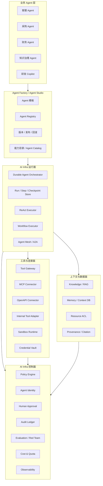
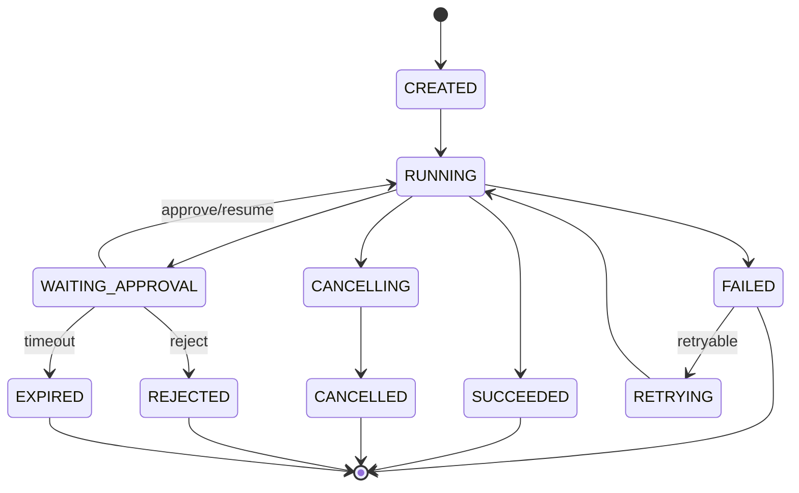

# Seahorse Agent 企业级 AI Infra 分阶段开发规划

创建日期：2026-05-23
适用范围：Seahorse Agent 从企业 RAG/记忆平台演进为企业级 AI 基础设施
前置文档：`docs/company-agent/Seahorse Agent 与企业级 Agent 差距分析.md`

## 1. 目标定位

Seahorse Agent 的最终形态不应只是一个聊天应用、RAG 平台或单体 Agent 框架，而应演进为企业级 AI Infra：为上层业务 Agent 提供统一的模型访问、上下文工程、工具接入、身份权限、运行时编排、审计评估、成本治理和运维控制面。

目标形态可以概括为：

> Seahorse Agent 是企业内部 AI 基础底座。业务团队可以在其上注册、派生、编排和治理不同领域 Agent；这些业务 Agent 可以复用 Seahorse 的上下文、工具、安全、运行时、评估和观测能力，而不需要每个业务团队重复建设一套 Agent 基础设施。

这意味着 Seahorse 的主线不再是“做一个更强的通用 Agent”，而是“做业务 Agent 的基础设施和控制面”。业务 Agent 可以是客服 Agent、采购 Agent、财务 Agent、知识治理 Agent、研发 Copilot、数据分析 Agent、运营工单 Agent，但它们都应复用同一套 infra contract。

## 2. 设计原则

### 2.1 平台能力与业务能力分离

Seahorse 只沉淀跨业务共性的能力：

- Agent 定义、版本、发布、运行、暂停、恢复、审计。
- 模型接入、模型路由、token 成本、prompt/session 管理。
- RAG、记忆、上下文裁剪、引用与来源追踪。
- Tool Gateway、MCP/OpenAPI/Internal Tool 统一接入。
- 身份、权限、策略、审批、沙箱、凭据隔离。
- 评估、红队、Trace、指标、SLA、成本治理。

业务 Agent 只沉淀业务差异：

- 领域 prompt 和角色边界。
- 业务工具组合。
- 业务审批规则。
- 领域知识库、字段、指标。
- 业务任务模板和工作流。

### 2.2 Seahorse 先做控制面，再扩大自治能力

企业级 AI Infra 的核心不是“让模型更自由”，而是“让模型可控地行动”。开发顺序必须先建设可治理的控制面，再增加自主能力：

1. 先记录每次运行。
2. 再控制每次工具调用。
3. 再允许暂停与审批。
4. 再支持长任务恢复。
5. 再接入外部工具和业务系统写操作。
6. 最后才做多 Agent 自主协作。

### 2.3 所有业务 Agent 必须受统一协议约束

不允许业务 Agent 直接绕过 Seahorse 的权限、审计、工具网关和运行状态。无论 Agent 是本地 Java 实现、MCP 远程工具、A2A 远程 Agent、LangGraph 工作流还是第三方服务，都必须通过统一的 run、tool、policy、identity、audit 协议进入 Seahorse。

### 2.4 与现有架构兼容演进

当前项目采用微内核 + ports/adapters 架构，这是继续演进的基础。规划中优先在 `seahorse-agent-kernel` 增加领域模型与端口，在 `seahorse-agent-adapter-repository-jdbc` 增加持久化适配，在 `seahorse-agent-adapter-web` 增加管理 API，在 `seahorse-agent-adapter-mcp-http` 增强 MCP 安全接入。

短期不建议大规模拆新仓库或推翻现有 RAG/Memory 流程。

## 3. 目标架构总览



核心分层说明：

| 层 | 职责 | Seahorse 当前基础 | 主要缺口 |
| --- | --- | --- | --- |
| 业务 Agent 层 | 各领域 Agent 的业务定义和任务模板 | 当前没有系统化业务 Agent 模型 | 需要 Agent Definition、模板、继承/派生 |
| Agent Factory | 创建、版本化、发布、回滚 Agent | 暂无 | 需要注册中心、版本、发布态、能力目录 |
| 控制面 | 策略、身份、审批、审计、评估、成本、观测 | 登录、Trace、限流、局部审核 | 需要统一 Policy/Identity/Audit/Eval/Quota |
| 运行面 | 持久运行、任务状态、checkpoint、执行器 | `KernelAgentLoop` 内存 ReAct 循环 | 需要 Durable Orchestrator 和 Run Store |
| 上下文与数据面 | RAG、记忆、ACL、来源、引用 | RAG/Memory 基础较强 | 需要与 Agent Runtime 和权限打通 |
| 工具与连接面 | MCP/OpenAPI/Internal Tool、沙箱、凭据 | MCP HTTP 雏形、工具 registry | 需要 Tool Gateway、OAuth、凭据、沙箱 |

## 4. 总体阶段划分

| 阶段 | 名称 | 目标 | 建议周期 | 产出类型 |
| --- | --- | --- | --- | --- |
| Phase 0 | 架构基线与边界固化 | 明确 AI Infra 方向，冻结关键契约，避免继续把 Agent 写成聊天分支 | 1-2 周 | 文档、ADR、包边界、测试基线 |
| Phase 1 | Agent Registry 与 Run Store | 让 Agent 变成可注册、可版本化、可运行追踪的实体 | 3-5 周 | 领域模型、JDBC 表、Web API、基础 UI |
| Phase 2 | Tool Gateway 与 Policy Engine | 所有工具调用进入统一策略网关 | 4-6 周 | 工具目录、风险分级、策略决策、审计 |
| Phase 3 | Durable Runtime 与 HITL | Agent run 可暂停、审批、恢复、失败重试 | 6-8 周 | 状态机、checkpoint、approval、worker |
| Phase 4 | Context DB 与数据权限整合 | RAG/Memory/ACL/Provenance 成为 Agent 的标准上下文面 | 5-7 周 | ContextPack、资源 ACL、来源追踪 |
| Phase 5 | MCP/OpenAPI/凭据/沙箱 | 安全接入外部系统和高风险执行环境 | 6-8 周 | MCP OAuth、OpenAPI 工具、Vault、Sandbox |
| Phase 6 | Agent Factory 与业务 Agent 派生 | 支持业务团队低成本创建、派生、发布 Agent | 6-8 周 | 模板、继承、配置 UI、Agent Catalog |
| Phase 7 | Multi-Agent / A2A / Agent Mesh | 支持本地和远程 Agent 编排、路由、治理 | 8-10 周 | handoff、A2A、mesh metrics、冲突仲裁 |
| Phase 8 | 企业生产化硬化 | 达到可试点/可内控/可运维/可评估标准 | 持续 | SLA、评估集、红队、成本、发布流程 |

## 5. Phase 0：架构基线与边界固化

### 5.1 阶段目标

Phase 0 的目标是先把方向写死：Seahorse 是 AI Infra，不是单一业务 Agent，也不是简单聊天应用。这个阶段不急着加大功能，而是修正后续开发的边界，避免所有新能力继续耦合在 `KernelChatInboundService` 或 `KernelAgentLoop` 里。

### 5.2 主要交付

1. 新增架构基线文档：`docs/architecture/ai-infra-baseline.md` 或 `docs/company-agent/Seahorse Agent 企业级 AI Infra 架构基线.md`。
2. 新增 ADR：确定 Agent Runtime、Tool Gateway、Policy Engine、Context DB、Agent Factory 的长期 owner。
3. 在 README 或架构文档中明确当前 Agent mode 是 experimental。
4. 建立测试基线：确认现有 RAG、Memory、AgentLoop 关键测试能独立运行。
5. 统一术语：Agent Definition、Agent Run、Tool Gateway、Policy Decision、Approval、ContextPack、Agent Identity、Audit Event。

### 5.3 建议代码边界

新增包建议：

| 包 | 职责 |
| --- | --- |
| `kernel.domain.agent.definition` | Agent 定义、版本、发布态 |
| `kernel.domain.agent.runtime` | run、step、checkpoint、interrupt |
| `kernel.domain.agent.tool` | tool catalog、tool risk、tool policy |
| `kernel.domain.agent.policy` | policy request/decision/effect |
| `kernel.domain.agent.approval` | approval request/decision |
| `ports.inbound.agent` | Agent 管理与运行入站端口 |
| `ports.outbound.agent` | Agent 存储、运行状态、审计、策略出站端口 |

现有 `ports.outbound.agent.ToolPort` 可以保留，但后续不应直接被 `KernelAgentLoop` 绕过策略调用。

### 5.4 验收标准

1. 文档明确 Seahorse AI Infra 的分层和模块 owner。
2. 新增术语在代码和文档中一致。
3. 后续新增 Agent 能力有明确包路径，不再继续堆到 chat pipeline。
4. 现有测试基线记录在文档中。

### 5.5 风险

Phase 0 如果跳过，后续很容易产生三套重复 owner：一个在 chat、一个在 agent、一个在 MCP。企业级 infra 最怕多源真相。

## 6. Phase 1：Agent Registry 与 Run Store

### 6.1 阶段目标

让 Agent 从“请求里的 chatMode=AGENT”升级为平台一等实体。业务 Agent 必须能被注册、版本化、发布、禁用、运行、查询历史。每一次运行必须有 runId，并且能追踪 step、tool call、模型调用、最终状态。

### 6.2 新增领域模型

#### AgentDefinition

建议字段：

| 字段 | 类型 | 说明 |
| --- | --- | --- |
| `agentId` | String | 稳定 ID |
| `tenantId` | String | 租户 |
| `name` | String | 展示名 |
| `description` | String | 说明 |
| `ownerUserId` | String | 负责人 |
| `ownerTeam` | String | 团队 |
| `agentType` | enum | `ASSISTANT`、`WORKFLOW`、`DOMAIN`、`REMOTE` |
| `baseAgentId` | String | 派生来源，可为空 |
| `status` | enum | `DRAFT`、`PUBLISHED`、`DISABLED`、`ARCHIVED` |
| `riskLevel` | enum | `LOW`、`MEDIUM`、`HIGH`、`CRITICAL` |
| `defaultModelPolicyId` | String | 模型策略 |
| `defaultToolPolicyId` | String | 工具策略 |
| `memoryPolicyId` | String | 记忆策略 |
| `createdAt/updatedAt` | Instant | 时间 |

#### AgentVersion

建议字段：

| 字段 | 类型 | 说明 |
| --- | --- | --- |
| `agentId` | String | Agent ID |
| `versionId` | String | 版本 ID |
| `versionNo` | long | 自增版本号 |
| `instructions` | String | 系统指令 |
| `toolSetJson` | JSON | 工具集合 |
| `modelConfigJson` | JSON | 模型配置 |
| `memoryConfigJson` | JSON | 记忆配置 |
| `guardrailConfigJson` | JSON | guardrail 配置 |
| `publishedBy` | String | 发布人 |
| `publishedAt` | Instant | 发布时间 |
| `changeSummary` | String | 变更说明 |

#### AgentRun

建议字段：

| 字段 | 类型 | 说明 |
| --- | --- | --- |
| `runId` | String | 运行 ID |
| `agentId/versionId` | String | 运行的 Agent 版本 |
| `tenantId/userId/conversationId` | String | 归属 |
| `triggerType` | enum | `CHAT`、`API`、`SCHEDULE`、`EVENT`、`A2A` |
| `inputSummary` | String | 输入摘要，避免直接存大 prompt |
| `status` | enum | `CREATED`、`RUNNING`、`WAITING_APPROVAL`、`SUCCEEDED`、`FAILED`、`CANCELLED`、`EXPIRED` |
| `currentStepNo` | int | 当前 step |
| `traceId` | String | Trace 关联 |
| `costTotal` | decimal | 成本 |
| `tokenInput/tokenOutput` | long | token 统计 |
| `startedAt/finishedAt` | Instant | 时间 |
| `errorCode/errorMessage` | String | 失败信息 |

#### AgentStep

建议字段：

| 字段 | 类型 | 说明 |
| --- | --- | --- |
| `stepId` | String | Step ID |
| `runId` | String | Run ID |
| `stepNo` | int | 序号 |
| `stepType` | enum | `MODEL_TURN`、`TOOL_CALL`、`APPROVAL`、`HANDOFF`、`CHECKPOINT` |
| `status` | enum | `RUNNING`、`SUCCEEDED`、`FAILED`、`SKIPPED` |
| `inputJson/outputJson` | JSON | 输入输出摘要 |
| `startedAt/finishedAt` | Instant | 时间 |
| `error` | String | 错误 |

### 6.3 新增端口

入站端口：

| 端口 | 方法 |
| --- | --- |
| `AgentDefinitionInboundPort` | `create`、`updateDraft`、`publish`、`disable`、`archive`、`page`、`detail` |
| `AgentRunInboundPort` | `startRun`、`streamRun`、`cancelRun`、`getRun`、`pageRuns`、`listSteps` |

出站端口：

| 端口 | 方法 |
| --- | --- |
| `AgentDefinitionRepositoryPort` | 定义和版本持久化 |
| `AgentRunRepositoryPort` | run/step/checkpoint 持久化 |
| `AgentAuditPort` | 写审计事件 |
| `AgentIdGeneratorPort` | 生成 agentId/runId/stepId |

### 6.4 Web API 建议

| API | 方法 | 说明 |
| --- | --- | --- |
| `/api/agents` | `POST` | 创建 draft agent |
| `/api/agents` | `GET` | 分页查询 |
| `/api/agents/{agentId}` | `GET` | 详情 |
| `/api/agents/{agentId}/draft` | `PUT` | 更新 draft |
| `/api/agents/{agentId}/publish` | `POST` | 发布版本 |
| `/api/agents/{agentId}/disable` | `POST` | 禁用 |
| `/api/agents/{agentId}/runs` | `POST` | 启动运行 |
| `/api/agents/{agentId}/runs` | `GET` | 查询运行 |
| `/api/agent-runs/{runId}` | `GET` | 运行详情 |
| `/api/agent-runs/{runId}/steps` | `GET` | Step 列表 |
| `/api/agent-runs/{runId}/cancel` | `POST` | 取消 |

### 6.5 与现有代码的整合

1. `KernelChatInboundService` 中 `ChatMode.AGENT` 不再直接构造裸 `AgentLoopRequest`，而是转发到 `AgentRunInboundPort`。
2. `KernelAgentLoop` 保留为 `ReactAgentExecutor` 的内部实现。
3. Agent run 开始时写 `AgentRun`，每一轮模型调用和工具调用写 `AgentStep`。
4. 现有 `RagTrace` 继续保留，但通过 `traceId` 与 `AgentRun` 关联。

### 6.6 数据库表建议

| 表 | 说明 |
| --- | --- |
| `sa_agent_definition` | Agent 基本信息 |
| `sa_agent_version` | Agent 版本快照 |
| `sa_agent_run` | 运行实例 |
| `sa_agent_step` | 运行步骤 |
| `sa_agent_run_event` | 运行事件流，可用于审计和 UI 时间线 |

### 6.7 测试验收

必须新增测试：

1. 创建 draft agent 后能查询详情。
2. 发布 agent 后生成不可变 version。
3. 运行 agent 时创建 run，并在成功后状态变为 `SUCCEEDED`。
4. 模型返回工具调用时记录 `MODEL_TURN` 和 `TOOL_CALL` step。
5. 取消 run 后状态变为 `CANCELLED`，再次取消幂等。
6. 旧 RAG 模式不受影响。

### 6.8 阶段退出条件

1. 所有 Agent 运行都有 runId。
2. 没有 runId 的工具调用不能进入新 Agent Runtime。
3. Web API 能看到 Agent 定义、版本、运行和 step。
4. `KernelAgentLoop` 不再是对外 API，而是内部 executor。

## 7. Phase 2：Tool Gateway 与 Policy Engine

### 7.1 阶段目标

所有工具调用必须进入 Tool Gateway。业务 Agent 不允许直接拿到 `ToolPort` 并执行。Tool Gateway 在执行前后做策略判断、参数校验、敏感信息处理、审批判断、限流、审计和观测。

### 7.2 新增核心模型

#### ToolCatalogEntry

| 字段 | 类型 | 说明 |
| --- | --- | --- |
| `toolId` | String | 工具 ID |
| `provider` | enum | `BUILTIN`、`MCP`、`OPENAPI`、`INTERNAL`、`REMOTE_AGENT` |
| `name/description` | String | 展示信息 |
| `schemaJson` | JSON | 输入 schema |
| `outputSchemaJson` | JSON | 输出 schema |
| `riskLevel` | enum | `LOW`、`MEDIUM`、`HIGH`、`CRITICAL` |
| `actionType` | enum | `READ`、`WRITE`、`DELETE`、`EXECUTE`、`EXTERNAL_SEND` |
| `resourceType` | String | 资源类型 |
| `owner` | String | owner 团队 |
| `enabled` | boolean | 是否启用 |
| `requiresApproval` | boolean | 默认是否需要审批 |

#### ToolInvocationRequest

| 字段 | 说明 |
| --- | --- |
| `runId/stepId/agentId/versionId` | 运行上下文 |
| `tenantId/userId/agentIdentityId` | 身份上下文 |
| `toolId` | 工具 |
| `arguments` | 参数 |
| `resourceRefs` | 资源引用 |
| `idempotencyKey` | 幂等键 |
| `requestedAt` | 时间 |

#### PolicyDecision

| 字段 | 说明 |
| --- | --- |
| `decision` | `ALLOW`、`DENY`、`APPROVAL_REQUIRED`、`REDACT`、`SANDBOX_REQUIRED` |
| `reasonCode` | 原因码 |
| `policyId/policyVersion` | 命中的策略 |
| `approvalPolicyId` | 需要审批时使用 |
| `redactionRules` | 脱敏规则 |
| `expiresAt` | 决策有效期 |

### 7.3 新增端口

| 端口 | 方法 |
| --- | --- |
| `ToolCatalogRepositoryPort` | 注册、更新、查询工具目录 |
| `ToolGatewayPort` | `invoke(ToolInvocationRequest)` |
| `ToolPolicyPort` | `decide(ToolPolicyRequest)` |
| `ToolAuditPort` | 记录工具调用与策略结果 |
| `SensitiveDataRedactionPort` | 输入输出脱敏 |
| `ToolRateLimiterPort` | 工具级限流 |

### 7.4 策略最小规则集

Phase 2 不需要一开始做复杂策略语言。先实现静态规则表即可：

| 条件 | 决策 |
| --- | --- |
| 工具不存在或 disabled | `DENY` |
| Agent 未绑定工具 | `DENY` |
| 用户无租户权限 | `DENY` |
| 工具 riskLevel 为 `CRITICAL` | `APPROVAL_REQUIRED` |
| 工具 actionType 为 `DELETE` | `APPROVAL_REQUIRED` |
| 工具 actionType 为 `EXTERNAL_SEND` 且包含外部收件人 | `APPROVAL_REQUIRED` |
| 工具超出 rate limit | `DENY` |
| 工具输出包含 secret pattern | `REDACT` |

### 7.5 与现有代码整合

1. `KernelAgentLoop.executeTool` 不再直接 `toolRegistry.find(...).invoke(...)`，而是构造 `ToolInvocationRequest` 交给 `ToolGatewayPort`。
2. `McpToolAllowlistRegistrar` 注册 MCP 工具时，同时写入 `ToolCatalogEntry`。
3. 内置工具如 `SearchKnowledgeBaseToolPortAdapter`、`MemoryReadToolPortAdapter` 等都需要补充 risk/action/resource 元数据。
4. `ToolInvocationResult` 扩展为可携带 `policyDecisionId`、`auditEventId`、`resourceRefs`、`redacted`。

### 7.6 Web API 建议

| API | 方法 | 说明 |
| --- | --- | --- |
| `/api/tools` | `GET` | 工具目录 |
| `/api/tools/{toolId}` | `GET` | 工具详情 |
| `/api/tools/{toolId}/enable` | `POST` | 启用 |
| `/api/tools/{toolId}/disable` | `POST` | 禁用 |
| `/api/tools/{toolId}/policy` | `PUT` | 更新工具策略 |
| `/api/agents/{agentId}/tools` | `PUT` | 绑定工具集 |
| `/api/tool-invocations` | `GET` | 工具调用审计查询 |

### 7.7 数据库表建议

| 表 | 说明 |
| --- | --- |
| `sa_tool_catalog` | 工具目录 |
| `sa_agent_tool_binding` | Agent 与工具绑定 |
| `sa_tool_policy` | 工具策略 |
| `sa_tool_invocation` | 工具调用记录 |
| `sa_policy_decision_log` | 策略决策日志 |

### 7.8 测试验收

1. 未绑定工具时，Agent 调用工具被拒绝。
2. 高风险工具返回 `APPROVAL_REQUIRED`，工具不实际执行。
3. 低风险只读工具允许执行。
4. 工具执行前后都写审计记录。
5. MCP allowlist 之外的工具不能进入 Tool Catalog。
6. 工具输出脱敏规则生效。

### 7.9 阶段退出条件

1. 新 Agent Runtime 中不存在绕过 Tool Gateway 的工具调用。
2. 每次工具调用都有 policy decision。
3. 工具目录能作为业务 Agent 的能力目录使用。

## 8. Phase 3：Durable Runtime 与 Human-in-the-Loop

### 8.1 阶段目标

让 Agent run 可以跨请求、跨进程、跨时间恢复。任何高风险动作可以暂停等待人工审批，审批后继续执行。服务重启后，未完成 run 能从 checkpoint 恢复或进入可诊断失败态。

### 8.2 Runtime 状态机

建议状态：



### 8.3 Checkpoint 模型

#### AgentCheckpoint

| 字段 | 说明 |
| --- | --- |
| `checkpointId` | checkpoint ID |
| `runId` | run |
| `stepId` | step |
| `sequenceNo` | 序号 |
| `stateJson` | 当前执行状态 |
| `messageHistoryJson` | 模型消息历史摘要或引用 |
| `memoryContextRef` | ContextPack 引用 |
| `pendingToolCallJson` | 待执行工具 |
| `createdAt` | 时间 |

保存策略：

1. 每次模型 turn 完成后保存 checkpoint。
2. 每次工具执行前保存 checkpoint。
3. 每次工具执行后保存 checkpoint。
4. 每次进入 `WAITING_APPROVAL` 前保存 checkpoint。
5. worker drain 或服务关闭前保存 checkpoint。

### 8.4 Approval 模型

#### ApprovalRequest

| 字段 | 说明 |
| --- | --- |
| `approvalId` | 审批 ID |
| `runId/stepId/toolInvocationId` | 关联 |
| `tenantId/userId/agentId` | 上下文 |
| `approvalType` | `TOOL_EXECUTION`、`DATA_ACCESS`、`EXTERNAL_SEND`、`POLICY_EXCEPTION` |
| `riskLevel` | 风险 |
| `summary` | 给审批人的自然语言摘要 |
| `argumentsPreviewJson` | 参数预览，敏感字段脱敏 |
| `status` | `PENDING`、`APPROVED`、`REJECTED`、`MODIFIED`、`EXPIRED` |
| `requestedByAgentIdentity` | 发起 Agent |
| `decidedBy` | 审批人 |
| `decisionComment` | 审批意见 |

### 8.5 Worker 模型

新增 `AgentRunWorker`：

1. 从 `sa_agent_run` 拉取 `CREATED`、`RETRYING` 或恢复中的 run。
2. 加分布式锁，避免多实例重复执行。
3. 执行一个 superstep 后保存 checkpoint。
4. 遇到 approval required，创建 approval 并释放 worker。
5. 审批通过后将 run 状态改回 `RUNNING` 或 `RETRYING`，worker 继续。
6. 支持 drain：当前 step 完成后保存 checkpoint 并退出。

### 8.6 与 MQ 的关系

项目已有 direct/pulsar MQ 适配。建议事件：

| 事件 | 用途 |
| --- | --- |
| `agent.run.created` | 新 run 入队 |
| `agent.run.resume_requested` | 审批后恢复 |
| `agent.run.cancel_requested` | 取消 |
| `agent.run.failed` | 失败通知 |
| `agent.approval.created` | 通知审批人 |
| `agent.approval.decided` | 审批结果 |

Phase 3 可以先用数据库轮询 + direct MQ，生产环境再切 Pulsar。

### 8.7 Web API 建议

| API | 方法 | 说明 |
| --- | --- | --- |
| `/api/agent-runs/{runId}/resume` | `POST` | 恢复 |
| `/api/agent-runs/{runId}/retry` | `POST` | 重试 |
| `/api/agent-runs/{runId}/checkpoints` | `GET` | checkpoint 列表 |
| `/api/approvals` | `GET` | 审批列表 |
| `/api/approvals/{approvalId}` | `GET` | 审批详情 |
| `/api/approvals/{approvalId}/approve` | `POST` | 通过 |
| `/api/approvals/{approvalId}/reject` | `POST` | 拒绝 |
| `/api/approvals/{approvalId}/modify` | `POST` | 修改参数后通过 |

### 8.8 测试验收

1. 高风险工具创建 approval 后 run 进入 `WAITING_APPROVAL`。
2. 审批通过后 run 从 checkpoint 恢复并执行工具。
3. 审批拒绝后 run 进入 `REJECTED`，工具不执行。
4. 服务重启模拟后，worker 能恢复未完成 run。
5. 同一个 run 不会被两个 worker 并发执行。
6. 工具执行使用 idempotencyKey，恢复不会重复写外部系统。

### 8.9 阶段退出条件

1. Agent run 支持暂停、审批、恢复。
2. 高风险工具默认走 approval。
3. 服务重启不会丢失 run 状态。
4. 企业试点可以审计一条完整 Agent 运行链路。

## 9. Phase 4：Context DB 与数据权限整合

### 9.1 阶段目标

把 Seahorse 已有 RAG 和 Memory 能力升级为 Agent 标准上下文面。所有业务 Agent 都通过统一的 ContextPack 获取上下文，而不是各自拼 prompt。ContextPack 必须包含来源、权限、置信度、预算、敏感级别和引用。

### 9.2 ContextPack 模型

#### ContextPack

| 字段 | 说明 |
| --- | --- |
| `contextPackId` | 上下文包 ID |
| `runId/agentId/userId/tenantId` | 上下文 |
| `question/taskGoal` | 当前目标 |
| `budget` | token/条目/成本预算 |
| `items` | 上下文项 |
| `createdAt` | 时间 |

#### ContextItem

| 字段 | 说明 |
| --- | --- |
| `itemId` | 项 ID |
| `sourceType` | `RAG_CHUNK`、`MEMORY`、`TOOL_RESULT`、`USER_INPUT`、`SYSTEM_STATE` |
| `sourceId` | 来源 ID |
| `content` | 内容 |
| `summary` | 摘要 |
| `score` | 相关性 |
| `confidence` | 置信度 |
| `sensitivity` | `PUBLIC`、`INTERNAL`、`CONFIDENTIAL`、`SECRET` |
| `aclDecisionId` | 权限决策 |
| `citation` | 引用 |
| `expiresAt` | 有效期 |

### 9.3 数据权限策略

需要统一资源模型：

| 资源类型 | 示例 |
| --- | --- |
| `KNOWLEDGE_BASE` | 知识库 |
| `DOCUMENT` | 文档 |
| `CHUNK` | 文档块 |
| `MEMORY` | 记忆 |
| `TOOL` | 工具 |
| `AGENT` | Agent |
| `RUN` | Agent 运行 |
| `APPROVAL` | 审批 |

新增 `ResourceAccessPolicyPort`：

```text
decide(subject, action, resource, context) -> AccessDecision
```

Subject 可以是用户、Agent Identity 或二者组合。Action 至少包括 `READ`、`WRITE`、`DELETE`、`EXECUTE`、`APPROVE`、`ADMIN`。

### 9.4 与现有 RAG/Memory 整合

1. `KernelMultiChannelRetrievalEngine` 检索前带入 subject 和 tenant。
2. `MetadataGuardPostProcessorFeature` 扩展为 ACL guard，不只做元数据过滤。
3. `HybridMemoryRecallPipeline` 召回记忆时校验 user/tenant/resource ACL。
4. `ContextWeaverPort` 输入从 `MemoryContext` 扩展到 `ContextPack`。
5. `AgentRun` 记录本次使用的 `contextPackId`，方便审计和复现。

### 9.5 记忆治理增强

已有记忆审核很好，应补齐：

| 能力 | 说明 |
| --- | --- |
| provenance | 每条记忆来自哪次会话、哪个工具、哪个文档 |
| retention | 保留多久 |
| erase | 用户或租户级删除 |
| conflict | 冲突检测和处理 |
| poison detection | 记忆投毒检测 |
| evaluation | 记忆召回质量评估 |
| sensitivity | 敏感级别 |

### 9.6 测试验收

1. 无权限用户无法通过 RAG 检索到受限文档。
2. 无权限 Agent 无法读取用户私有记忆。
3. ContextPack 中每个 item 都有 source 和 ACL decision。
4. 同一问题在不同用户下返回不同 ContextPack。
5. ContextPack token budget 生效。
6. 记忆删除后不再被召回。

### 9.7 阶段退出条件

1. 上层业务 Agent 不直接拼接 RAG/Memory 结果。
2. 所有上下文都有来源和权限证据。
3. 审计中可以回答“Agent 为什么看到了这段上下文”。

## 10. Phase 5：MCP/OpenAPI/凭据/沙箱

### 10.1 阶段目标

让 Seahorse 能安全接入企业系统、第三方 SaaS、内部 API、MCP Server，以及需要隔离执行的代码/浏览器/脚本能力。这个阶段之后，Seahorse 才适合接入真实业务写操作。

### 10.2 MCP 安全增强

当前 `McpHttpAdapterProperties.Server` 只有 `name/url/enabled`，需要扩展：

| 字段 | 说明 |
| --- | --- |
| `authType` | `NONE`、`STATIC_BEARER`、`OAUTH2`、`CLIENT_CREDENTIALS`、`USER_DELEGATED` |
| `authorizationServerMetadataUrl` | 授权服务器 metadata |
| `protectedResourceMetadataUrl` | MCP protected resource metadata |
| `clientId` | OAuth client |
| `clientSecretRef` | secret 引用 |
| `scopes` | 默认 scopes |
| `audience/resource` | resource indicator |
| `tokenStrategy` | agent identity 或 user delegated |
| `trustPolicyId` | 信任策略 |

实现能力：

1. 解析 MCP server 的 `WWW-Authenticate` scope challenge。
2. 支持 OAuth 2.1 bearer token。
3. token 不进入 prompt、trace 明文或普通日志。
4. tool call 时按 tenant/user/agent 获取 token。
5. insufficient scope 时创建 step-up approval/auth flow。

### 10.3 OpenAPI Connector

新增 OpenAPI 工具接入：

1. 上传 OpenAPI 3.0 spec。
2. 解析 operationId 为 toolId。
3. 支持 operation 风险分级。
4. 支持 auth scheme：apiKey、bearer、OAuth2。
5. 支持 request/response schema。
6. 支持 dry-run 和 mock 测试。

建议新增表：

| 表 | 说明 |
| --- | --- |
| `sa_connector` | connector 基本信息 |
| `sa_connector_version` | spec 版本 |
| `sa_connector_operation` | operation/tool 映射 |
| `sa_connector_credential_binding` | 凭据绑定 |

### 10.4 Credential Vault

新增端口：

| 端口 | 说明 |
| --- | --- |
| `SecretStorePort` | 存取 secret ref |
| `CredentialProviderPort` | 按 subject/tool/provider 获取凭据 |
| `OAuthTokenPort` | token 获取、刷新、撤销 |
| `CredentialAuditPort` | 凭据使用审计 |

开发顺序：

1. 本地/JDBC 加密存储最小实现。
2. Redis 缓存 token。
3. 预留 Vault/KMS 适配端口。
4. 凭据只能通过 ref 被引用。

### 10.5 Sandbox Runtime

高风险执行环境包括：

- Code Interpreter。
- Browser Automation。
- Shell/Command。
- 文件处理。
- 数据库查询生成。

建议先做接口，不急于自研复杂容器平台：

| 端口 | 方法 |
| --- | --- |
| `SandboxRuntimePort` | `createSession`、`execute`、`snapshot`、`close` |
| `SandboxPolicyPort` | 判断是否允许网络、文件、包安装 |
| `SandboxArtifactPort` | 管理输出文件 |

最小要求：

1. 主 JVM 不直接执行任意代码。
2. 沙箱有 sessionId、runId、agentId。
3. 网络默认 deny，按 allowlist 开放。
4. 文件系统隔离。
5. 输出 artifact 进入对象存储并脱敏扫描。
6. 沙箱操作进入审计。

### 10.6 测试验收

1. MCP server 需要 token 时，Seahorse 能获取并附加 bearer token。
2. token 不出现在日志和 trace 明文。
3. OpenAPI spec 能生成 tool catalog entry。
4. 高风险 OpenAPI operation 默认 approval required。
5. 沙箱执行能记录 session、输入摘要、输出 artifact。
6. 沙箱网络未授权访问被拒绝。

### 10.7 阶段退出条件

1. 外部工具接入不再依赖硬编码凭据。
2. MCP/OpenAPI/Internal Tool 都进入 Tool Gateway。
3. 高风险执行能力不在主服务进程内运行。

## 11. Phase 6：Agent Factory 与业务 Agent 派生

### 11.1 阶段目标

让业务团队可以基于 Seahorse 创建和派生业务 Agent。业务 Agent 不需要理解底层模型、RAG、MCP、安全、审计实现，只需要选择模板、知识源、工具、审批策略和任务模式。

### 11.2 Agent 模板体系

建议内置模板：

| 模板 | 用途 | 默认风险 |
| --- | --- | --- |
| `knowledge-assistant` | 企业知识问答 | LOW |
| `knowledge-curator` | 知识库治理、元数据修复 | MEDIUM |
| `workflow-assistant` | 多步骤流程助手 | MEDIUM |
| `data-analyst` | 数据查询、报表解释 | MEDIUM |
| `tool-operator` | 调用业务工具执行动作 | HIGH |
| `compliance-reviewer` | 合规检查与拦截 | HIGH |
| `remote-agent-wrapper` | 包装 A2A/MCP 远程 Agent | MEDIUM |

### 11.3 派生模型

Agent 派生不是复制所有配置，而是继承 + 覆盖：

| 配置项 | 继承规则 |
| --- | --- |
| instructions | base instructions + domain overlay |
| tools | base allowed set ∩ derived requested set |
| model policy | 可降级，不可越过 base 风险上限 |
| memory policy | 可收窄，不可扩大到未授权用户/租户 |
| approval policy | 可更严格，不可更宽松，除非管理员批准 |
| cost quota | derived quota <= base quota |

### 11.4 Agent Studio / 管理 UI

UI 可以分阶段建设：

1. Agent 列表：状态、版本、owner、风险、运行数。
2. Agent 创建向导：模板、说明、知识源、工具、审批策略。
3. Prompt/Instruction 编辑器：版本 diff、发布说明。
4. 工具选择器：只显示当前用户有权绑定的工具。
5. 测试运行面板：输入、上下文、工具调用、审批模拟、trace。
6. 发布页面：风险检查、评测结果、审批。
7. Agent Catalog：给业务方查找可复用 Agent。

### 11.5 发布门禁

Agent 发布前必须通过：

| 门禁 | 要求 |
| --- | --- |
| 配置完整性 | instructions、model、tool、memory policy 有效 |
| 权限检查 | 绑定工具和知识源都有权限 |
| 风险检查 | 高风险工具配置审批 |
| 评测检查 | 最小 eval set 通过 |
| 成本检查 | 配置 quota |
| owner 检查 | owner 和审批人存在 |

### 11.6 业务 Agent 示例

#### 知识治理 Agent

配置：

- 模板：`knowledge-curator`
- 知识源：指定知识库。
- 工具：搜索知识库、读取 chunk、更新元数据、提交审核。
- 审批：所有批量更新需要 approval。
- 记忆：只使用知识库治理历史，不使用用户私人记忆。

任务：

1. 查找缺失元数据的文档。
2. 生成修复建议。
3. 提交 metadata review。
4. 审批后执行更新。

#### 采购询价 Agent

配置：

- 模板：`workflow-assistant`
- 工具：供应商查询、询价邮件草稿、报价汇总。
- 禁止工具：自动下单、付款。
- 审批：外发邮件需要审批。
- 成本：每 run 最大 token 和工具调用次数。

任务：

1. 根据需求生成供应商候选。
2. 起草询价邮件。
3. 等待人工审批。
4. 发送后跟踪回复。

### 11.7 测试验收

1. 从模板创建 Agent 后生成 draft。
2. 派生 Agent 不能扩大 base Agent 的权限。
3. 绑定高风险工具时发布门禁失败，除非配置审批策略。
4. 发布后 version 不可变。
5. 回滚到旧版本后新 run 使用旧 version。
6. Agent Catalog 只展示用户有权调用的 Agent。

### 11.8 阶段退出条件

1. 业务团队可以不改代码创建低风险 Agent。
2. 所有业务 Agent 都通过同一套 registry/runtime/tool/policy。
3. Agent 发布有版本、门禁和回滚。

## 12. Phase 7：Multi-Agent / A2A / Agent Mesh

### 12.1 阶段目标

支持多个业务 Agent 之间协作，但必须可治理。先支持本地 sub-agent，再支持远程 A2A。多 Agent 编排不是多个 prompt 互相聊天，而是有明确 handoff、上下文裁剪、权限再校验、冲突仲裁和审计。

### 12.2 本地 Multi-Agent

先实现三种模式：

| 模式 | 说明 |
| --- | --- |
| `Agent-as-Tool` | 一个 Agent 作为另一个 Agent 的工具 |
| `Supervisor` | 一个 supervisor Agent 分派任务 |
| `Workflow Team` | 固定 DAG 中多个 Agent 各司其职 |

本地 handoff 请求：

| 字段 | 说明 |
| --- | --- |
| `sourceAgentId` | 发起 Agent |
| `targetAgentId` | 接收 Agent |
| `handoffReason` | 原因 |
| `input` | 裁剪后的输入 |
| `contextPolicy` | 上下文传递策略 |
| `requiredCapabilities` | 需要能力 |
| `parentRunId` | 父 run |

### 12.3 A2A 支持

A2A 适合跨语言、跨团队、跨平台 Agent。Seahorse 应先支持作为 A2A client，再支持暴露 A2A server。

Client 侧能力：

1. 注册远程 Agent Card。
2. 发现远程 Agent capability。
3. 创建 remote task。
4. 接收 streaming/event 更新。
5. 远程结果进入本地 `AgentStep` 和 `AuditLedger`。
6. 远程 Agent 调用前仍经过本地 Policy Engine。

Server 侧能力：

1. Seahorse Agent 发布为远程 Agent。
2. 暴露能力、输入 schema、认证方式、风险等级。
3. 接收外部 task 时创建本地 AgentRun。
4. 外部调用者身份映射到 tenant/resource policy。

### 12.4 Agent Mesh 控制面

Agent Mesh 需要管理：

| 能力 | 说明 |
| --- | --- |
| discovery | Agent 能力发现 |
| routing | 根据能力/成本/健康度路由 |
| policy | 跨 Agent 调用授权 |
| quota | Agent 间调用配额 |
| observability | 跨 Agent trace |
| circuit breaker | 下游 Agent 失败熔断 |
| version | 远程 Agent 版本兼容 |
| conflict | 多 Agent 结论冲突处理 |

### 12.5 冲突仲裁

多 Agent 冲突不能交给 LLM 自行决定。建议规则：

1. 合规 Agent 高于业务执行 Agent。
2. 安全策略高于效率策略。
3. 财务金额阈值高于普通流程建议。
4. 数据来源可信度高的结果优先。
5. 无法自动仲裁时进入 human review。

### 12.6 测试验收

1. Agent A 可以把子任务 handoff 给 Agent B。
2. Handoff 时上下文按策略裁剪，不能泄露未授权记忆。
3. 远程 A2A Agent 失败时，本地 run 记录失败 step。
4. 下游 Agent 熔断后 supervisor 不再继续调用。
5. 多 Agent 冲突触发仲裁或人工审批。
6. 跨 Agent trace 能串起 parentRunId 和 childRunId。

### 12.7 阶段退出条件

1. 本地 Agent-as-Tool 可用于真实业务编排。
2. 远程 A2A 接入有身份、策略、审计。
3. 多 Agent 协作可观测、可限流、可熔断。

## 13. Phase 8：企业生产化硬化

### 13.1 阶段目标

让 Seahorse 从“可开发”进入“可企业试点/可规模化运营”。重点是评估、红队、SRE、成本、发布和合规证据。

### 13.2 Evaluation 平台

评估类型：

| 类型 | 指标 |
| --- | --- |
| RAG eval | recall、precision、citation accuracy、answer faithfulness |
| Agent trajectory eval | 工具选择正确率、步骤数、成功率、无效循环率 |
| Tool eval | 参数正确率、幂等性、失败恢复 |
| Safety eval | prompt injection 拦截率、越权拦截率、敏感信息泄露 |
| HITL eval | 审批命中率、误拦截率、审批耗时 |
| Cost eval | token/run、cost/run、cache hit、模型路由收益 |

新增表：

| 表 | 说明 |
| --- | --- |
| `sa_eval_dataset` | 评估集 |
| `sa_eval_case` | 用例 |
| `sa_eval_run` | 评估运行 |
| `sa_eval_result` | 结果 |
| `sa_redteam_case` | 红队用例 |

### 13.3 Observability 与 Audit

Trace 维度：

1. run trace：从触发到完成。
2. model span：模型、输入输出 token、latency、cost。
3. tool span：toolId、参数摘要、policy、latency、结果。
4. context span：检索、记忆、ContextPack。
5. approval span：创建、通知、决策。
6. remote agent span：A2A/MCP remote 调用。

审计要求：

1. 关键事件 append-only。
2. 敏感字段只存摘要或密文引用。
3. 每个写操作都能追踪到 user、agent、policy、approval。
4. 支持按 runId、agentId、resourceId、userId 查询。

### 13.4 成本与配额

配额维度：

| 维度 | 示例 |
| --- | --- |
| tenant | 每日总 token/cost |
| agent | 每小时 run 数、工具调用数 |
| user | 每日 cost |
| tool | 每分钟调用数 |
| model | token budget |
| run | 最大 steps、最大 cost、最大 duration |

策略：

1. 低风险问答使用便宜模型。
2. 高风险计划/审批说明使用强模型。
3. 长上下文先压缩再进入模型。
4. 工具结果进入缓存，但遵守权限和过期时间。
5. 超预算 run 自动暂停或降级。

### 13.5 SRE 与发布

必须具备：

1. 健康检查：模型、向量库、数据库、MQ、MCP server、Tool Gateway。
2. 限流与熔断：按 tenant/agent/tool/model。
3. 灰度发布：Agent version canary。
4. 回滚：Agent version rollback。
5. 任务恢复：worker restart resume。
6. 运维面板：run backlog、approval backlog、failure rate、cost burn。
7. 事件响应：高风险工具误调用应有停用开关。

### 13.6 企业试点准入标准

一个业务 Agent 进入企业试点前必须满足：

1. 有 owner 和审批人。
2. 有发布版本。
3. 有绑定工具清单和风险等级。
4. 有资源 ACL。
5. 有最小评估集。
6. 高风险动作有 HITL。
7. 有成本配额。
8. 有审计查询。
9. 有回滚和停用方式。

## 14. 模块级开发路线

### 14.1 `seahorse-agent-kernel`

重点新增：

| 包 | 内容 |
| --- | --- |
| `domain.agent.definition` | AgentDefinition、AgentVersion、AgentStatus |
| `domain.agent.runtime` | AgentRun、AgentStep、AgentCheckpoint、AgentRunStatus |
| `domain.agent.policy` | PolicyDecision、PolicyEffect、AccessDecision |
| `domain.agent.approval` | ApprovalRequest、ApprovalDecision |
| `application.agent.runtime` | DurableAgentOrchestrator、AgentRunWorker、ReactAgentExecutor |
| `application.agent.registry` | AgentDefinitionService |
| `application.agent.tool` | ToolGatewayService、ToolCatalogService |
| `application.agent.approval` | ApprovalService |

### 14.2 `seahorse-agent-adapter-repository-jdbc`

重点新增：

| Adapter | 表 |
| --- | --- |
| `JdbcAgentDefinitionRepositoryAdapter` | `sa_agent_definition`、`sa_agent_version` |
| `JdbcAgentRunRepositoryAdapter` | `sa_agent_run`、`sa_agent_step`、`sa_agent_checkpoint` |
| `JdbcToolCatalogRepositoryAdapter` | `sa_tool_catalog`、`sa_agent_tool_binding` |
| `JdbcPolicyDecisionRepositoryAdapter` | `sa_policy_decision_log` |
| `JdbcApprovalRepositoryAdapter` | `sa_approval_request` |
| `JdbcAuditLedgerRepositoryAdapter` | `sa_audit_event` |

### 14.3 `seahorse-agent-adapter-web`

重点新增 controller：

| Controller | 职责 |
| --- | --- |
| `SeahorseAgentDefinitionController` | Agent 创建、发布、版本 |
| `SeahorseAgentRunController` | run 启动、查询、取消、恢复 |
| `SeahorseToolCatalogController` | 工具目录 |
| `SeahorseApprovalController` | 审批 |
| `SeahorseAuditController` | 审计查询 |
| `SeahorseEvalController` | 评估运行 |

### 14.4 `seahorse-agent-adapter-mcp-http`

重点增强：

1. OAuth 配置。
2. token provider。
3. protected resource metadata discovery。
4. scope challenge。
5. tool discovery 写 Tool Catalog。
6. remote tool 调用进入 Tool Gateway。

### 14.5 `frontend`

建议页面：

| 页面 | 功能 |
| --- | --- |
| Agent 列表 | 管理 Agent |
| Agent 编辑 | 模板、prompt、工具、知识源、策略 |
| Agent 版本 | diff、发布、回滚 |
| Run 详情 | timeline、step、tool、trace、cost |
| Approval Inbox | 审批 |
| Tool Catalog | 工具目录、风险、策略 |
| Eval Dashboard | 评测结果 |
| Audit Search | 审计查询 |

## 15. 推荐优先级

如果资源有限，建议按这个顺序做：

1. `AgentRunRepositoryPort` + `AgentRun`/`AgentStep` 持久化。
2. `ToolGatewayPort` + `ToolPolicyPort`。
3. Approval interrupt/resume。
4. AgentDefinition/Version。
5. ContextPack + Resource ACL。
6. MCP OAuth/credential vault。
7. Agent Factory UI。
8. Multi-Agent/A2A。
9. Eval/RedTeam/Cost/SRE 全面硬化。

原因很简单：没有 run store，就没有恢复和审计；没有 tool gateway，就不能安全行动；没有 approval，就不能接写操作；没有 context ACL，就不能给企业数据放权。

## 16. 第一批可执行开发 Epic

### Epic 1：Agent Run 持久化闭环

目标：不改变业务能力，只让当前 AgentLoop 的运行可记录。

交付：

1. `AgentRun`、`AgentStep` 领域模型。
2. `AgentRunRepositoryPort`。
3. JDBC adapter。
4. `KernelAgentLoop` 执行时写 run/step。
5. Web API 查询 run/step。

验收：

1. 运行一次 agent chat 后能查询 run。
2. 每次模型 turn 和工具调用都有 step。
3. 测试覆盖成功、失败、取消。

### Epic 2：Tool Gateway 最小可用版

目标：所有工具调用前都有策略决策。

交付：

1. Tool Catalog。
2. Agent-tool binding。
3. 静态 Tool Policy。
4. ToolGatewayService。
5. 修改 `KernelAgentLoop` 使用 ToolGateway。

验收：

1. 未绑定工具被拒绝。
2. 高风险工具触发 approval required。
3. 工具调用有审计。

### Epic 3：Approval 中断与恢复

目标：高风险工具可以暂停，人工审批后继续。

交付：

1. ApprovalRequest。
2. ApprovalRepository。
3. ApprovalController。
4. Runtime `WAITING_APPROVAL` 状态。
5. resume 接口。

验收：

1. 高风险工具不直接执行。
2. 审批通过后继续。
3. 拒绝后 run 结束。

### Epic 4：Agent Definition 与发布版本

目标：Agent 可配置、可发布、可回滚。

交付：

1. AgentDefinition/AgentVersion。
2. 创建/发布/禁用 API。
3. Agent run 使用指定 version。
4. 版本不可变。

验收：

1. 发布后不能修改 version。
2. 新 run 使用最新 published version。
3. 回滚后使用指定旧 version。

### Epic 5：ContextPack 与资源 ACL

目标：Agent 上下文有来源、有权限、有预算。

交付：

1. ContextPack/ContextItem。
2. ResourceAccessPolicyPort。
3. RAG/Memory 召回写入 ContextPack。
4. ContextWeaver 使用 ContextPack。

验收：

1. 无权限文档不进入上下文。
2. 每个上下文项有 source 和 aclDecisionId。
3. token budget 生效。

## 17. 风险与取舍

### 17.1 不建议一开始引入完整工作流引擎

可以借鉴 LangGraph/Temporal 的 durable execution 思路，但不建议第一阶段直接引入外部工作流引擎。先用 Seahorse 自己的 run/step/checkpoint 模型把状态与审计打牢。等复杂工作流需求明确后，再决定是否接 Temporal 或其他引擎。

### 17.2 不建议先做 Multi-Agent

多 Agent 在没有 Tool Gateway、Identity、HITL、Audit 之前会放大风险。应先做本地 Agent-as-Tool，等单 Agent 可治理后再做 A2A。

### 17.3 不建议让业务 Agent 自带凭据

凭据必须属于 Seahorse 的 Credential Vault 和 Identity 控制面。业务 Agent 只能声明需要什么 scope，不能持有 secret。

### 17.4 不建议直接开放写操作工具

所有写操作工具在 Phase 2/3 前都应保持禁用或 approval required。低风险读工具先跑通，写工具后接。

## 18. 与外部最新平台能力的对齐

| 外部平台/规范 | 值得对齐的能力 | Seahorse 对应规划 |
| --- | --- | --- |
| OpenAI Agents SDK | Agent definitions、runtime state、handoffs、guardrails、human review、sandbox、trace/eval | Phase 1/3/6/7/8 |
| Google ADK | Agent、Session、Memory、Workflow Agents、A2A | Phase 3/4/7 |
| Microsoft Foundry Agent Service | Agent versioning、publishing、enterprise identity、tool catalog、A2A preview、guardrails | Phase 1/2/6/7/8 |
| AWS Bedrock AgentCore | Runtime、Memory、Gateway、Browser、Code Interpreter、Identity、Policy、Observability、Evaluations | Phase 2/3/4/5/8 |
| MCP Authorization | OAuth 2.1、Protected Resource Metadata、scope challenge、resource indicator、token audience | Phase 5 |
| LangGraph | durable execution、checkpoint、interrupt/resume、deterministic replay | Phase 3 |
| OWASP Agentic Security | agentic threat model、red team、tool abuse、权限风险 | Phase 2/5/8 |
| NIST AI RMF | Govern/Map/Measure/Manage 风险治理闭环 | Phase 8 |

## 19. 结论

Seahorse 要成为企业级 AI Infra，最重要的不是马上堆更多业务 Agent，而是把“业务 Agent 运行所依赖的底座契约”先建起来：

1. Agent 是可注册、可版本化、可发布的实体。
2. Run 是可持久化、可恢复、可审计的执行实例。
3. Tool 是可治理、可授权、可审批的能力。
4. Context 是有来源、有权限、有预算的上下文包。
5. Identity 是用户与 Agent 的双主体授权模型。
6. Approval 是高风险动作的通用中断机制。
7. Evaluation 是发布和迭代的门禁。
8. Observability 与 Audit 是生产运行的证据链。

按这个顺序演进，Seahorse 可以从当前较强的 RAG/Memory 工程基础，稳步升级为承载企业业务 Agent 的 AI 基础设施。

## 20. 参考资料

- [OpenAI Agents SDK](https://developers.openai.com/api/docs/guides/agents)
- [OpenAI Agents SDK Guardrails](https://openai.github.io/openai-agents-python/guardrails/)
- [Google ADK Memory](https://adk-labs.github.io/adk-docs/sessions/memory/)
- [Microsoft Foundry Agent Service Overview](https://learn.microsoft.com/en-us/azure/foundry/agents/overview)
- [Microsoft Foundry Agent Tools](https://learn.microsoft.com/en-us/azure/foundry-classic/agents/how-to/tools-classic/overview)
- [AWS Bedrock AgentCore FAQ](https://aws.amazon.com/bedrock/agentcore/faqs/)
- [MCP Authorization Specification](https://modelcontextprotocol.io/specification/2025-11-25/basic/authorization)
- [LangGraph Durable Execution](https://docs.langchain.com/oss/python/langgraph/durable-execution)
- [OWASP Agentic AI Threats and Mitigations](https://genai.owasp.org/resource/agentic-ai-threats-and-mitigations/)
- [NIST AI Risk Management Framework](https://www.nist.gov/itl/ai-risk-management-framework)
