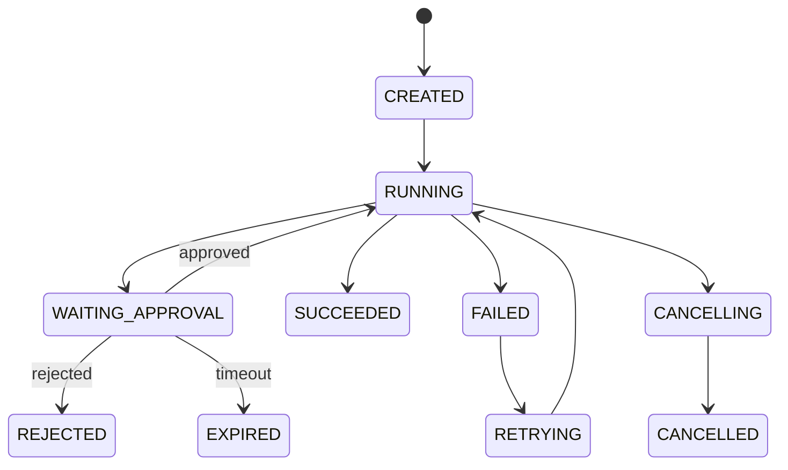

# Phase 3：Durable Runtime 与 Human-in-the-Loop

## 1. 阶段目标

让 Agent run 支持持久执行、checkpoint、暂停、审批、恢复、取消和重试。Phase 3 完成后，Seahorse 才具备接入高风险业务工具的最低运行时能力。

## 2. Runtime 状态机



状态约束：

- `WAITING_APPROVAL` 时 worker 必须释放执行权。
- `APPROVED` 后不能直接执行工具，必须从 checkpoint 恢复。
- `REJECTED` 后工具不能执行。
- `CANCELLED`、`SUCCEEDED`、`REJECTED` 为终态。

## 3. 新增模型

### 3.1 AgentCheckpoint

| 字段 | 说明 |
| --- | --- |
| `checkpointId` | checkpoint ID |
| `runId` | run |
| `stepId` | step |
| `sequenceNo` | run 内递增 |
| `checkpointType` | `MODEL_TURN`、`BEFORE_TOOL`、`AFTER_TOOL`、`WAITING_APPROVAL` |
| `stateJson` | 执行器状态 |
| `messageHistoryJson` | 模型消息历史摘要或对象引用 |
| `contextPackId` | 上下文包 |
| `pendingToolCallJson` | 待执行工具 |
| `createdAt` | 时间 |

### 3.2 ApprovalRequest

| 字段 | 说明 |
| --- | --- |
| `approvalId` | 审批 ID |
| `runId/stepId/toolInvocationId` | 关联 |
| `tenantId/userId/agentId` | 上下文 |
| `approvalType` | `TOOL_EXECUTION`、`DATA_ACCESS`、`EXTERNAL_SEND`、`POLICY_EXCEPTION` |
| `riskLevel` | 风险 |
| `summary` | 审批摘要 |
| `argumentsPreviewJson` | 脱敏参数预览 |
| `status` | `PENDING`、`APPROVED`、`REJECTED`、`MODIFIED`、`EXPIRED` |
| `decidedBy/decidedAt` | 决策人和时间 |

### 3.3 AgentRunLease

用于多实例 worker 互斥：

| 字段 | 说明 |
| --- | --- |
| `runId` | run |
| `workerId` | 当前 worker |
| `leaseUntil` | 租约到期 |
| `heartbeatAt` | 心跳 |

## 4. 数据库表

```sql
CREATE TABLE sa_agent_checkpoint (
  checkpoint_id VARCHAR(64) PRIMARY KEY,
  run_id VARCHAR(64) NOT NULL,
  step_id VARCHAR(64),
  sequence_no BIGINT NOT NULL,
  checkpoint_type VARCHAR(32) NOT NULL,
  state_json TEXT NOT NULL,
  message_history_json TEXT,
  context_pack_id VARCHAR(64),
  pending_tool_call_json TEXT,
  created_at TIMESTAMP NOT NULL,
  UNIQUE(run_id, sequence_no)
);

CREATE TABLE sa_approval_request (
  approval_id VARCHAR(64) PRIMARY KEY,
  run_id VARCHAR(64) NOT NULL,
  step_id VARCHAR(64),
  tool_invocation_id VARCHAR(64),
  tenant_id VARCHAR(64) NOT NULL,
  user_id VARCHAR(64) NOT NULL,
  agent_id VARCHAR(64),
  approval_type VARCHAR(32) NOT NULL,
  risk_level VARCHAR(32) NOT NULL,
  summary VARCHAR(1000) NOT NULL,
  arguments_preview_json TEXT,
  status VARCHAR(32) NOT NULL,
  requested_at TIMESTAMP NOT NULL,
  expires_at TIMESTAMP,
  decided_by VARCHAR(64),
  decided_at TIMESTAMP,
  decision_comment VARCHAR(1000)
);

CREATE TABLE sa_agent_run_lease (
  run_id VARCHAR(64) PRIMARY KEY,
  worker_id VARCHAR(128) NOT NULL,
  lease_until TIMESTAMP NOT NULL,
  heartbeat_at TIMESTAMP NOT NULL
);
```

## 5. Runtime 服务

### 5.1 DurableAgentOrchestrator

职责：

1. 启动 run。
2. 调用 executor 执行一个 step。
3. 保存 checkpoint。
4. 遇到 `APPROVAL_REQUIRED` 创建 approval。
5. 审批后恢复。
6. 终态写审计。

核心方法：

```text
startRun(command) -> AgentRun
resumeRun(runId, resumeReason) -> AgentRun
cancelRun(runId, operator) -> AgentRun
retryRun(runId, operator) -> AgentRun
```

### 5.2 AgentRunWorker

职责：

1. 拉取 `CREATED`、`RETRYING`、`RUNNING` 且无有效 lease 的 run。
2. 获取 lease。
3. 执行一个 bounded step。
4. heartbeat。
5. 保存 checkpoint。
6. 释放 lease。

## 6. API 设计

| Method | Path | 说明 |
| --- | --- | --- |
| `POST` | `/api/agent-runs/{runId}/resume` | 恢复 |
| `POST` | `/api/agent-runs/{runId}/retry` | 重试 |
| `GET` | `/api/agent-runs/{runId}/checkpoints` | checkpoint |
| `GET` | `/api/approvals` | 审批列表 |
| `GET` | `/api/approvals/{approvalId}` | 详情 |
| `POST` | `/api/approvals/{approvalId}/approve` | 通过 |
| `POST` | `/api/approvals/{approvalId}/reject` | 拒绝 |
| `POST` | `/api/approvals/{approvalId}/modify` | 修改参数后通过 |

## 7. 任务切片

### Task 3.1：实现 checkpoint repository

验收：

```powershell
./mvnw -pl seahorse-agent-adapter-repository-jdbc -Dtest=*AgentCheckpoint*Test test
```

### Task 3.2：实现 approval repository/service/controller

验收：

```powershell
./mvnw -pl seahorse-agent-tests -Dtest=*Approval*Tests test
```

### Task 3.3：Tool Gateway 返回 `APPROVAL_REQUIRED`

要求：

- 不执行真实工具。
- 创建 `ApprovalRequest`。
- run 状态变为 `WAITING_APPROVAL`。
- checkpoint 中保存 pending tool call。

### Task 3.4：审批通过后 resume

要求：

- 使用 checkpoint 恢复消息历史。
- 使用原 `idempotencyKey` 执行工具。
- tool result 写回 step。
- run 继续执行后续模型 turn。

### Task 3.5：worker lease

要求：

- 同一 run 同时只能有一个 worker。
- lease 超时后可被其他 worker 接管。
- cancel 时 worker 能在 step 边界退出。

## 8. 测试清单

```powershell
./mvnw -pl seahorse-agent-tests -Dtest=*DurableAgentRuntime*Tests test
./mvnw -pl seahorse-agent-tests -Dtest=*HumanApproval*Tests test
```

必须覆盖：

1. 高风险工具触发 `WAITING_APPROVAL`。
2. approval approve 后工具执行。
3. approval reject 后工具不执行。
4. 服务重启模拟后可从 checkpoint 恢复。
5. lease 防止双 worker 执行。
6. cancel 幂等。

## 9. 退出条件

1. 高风险工具不会直接执行。
2. run 可以暂停和恢复。
3. checkpoint 可复现执行上下文。
4. worker 支持多实例互斥。

## 10. 风险控制

- 所有外部写操作工具必须有 idempotencyKey。
- resume 时不要重复追加已完成 step。
- approval preview 必须脱敏。
- checkpoint 不存明文 secret。
