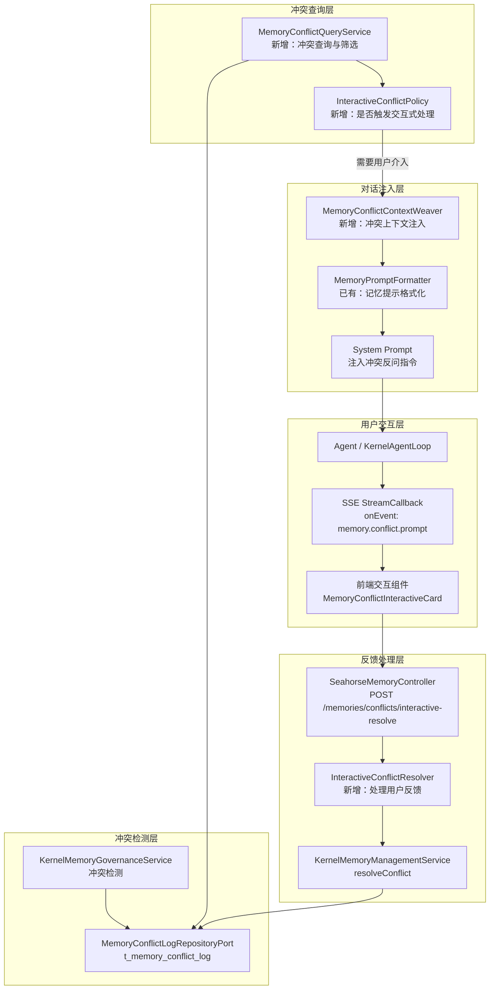
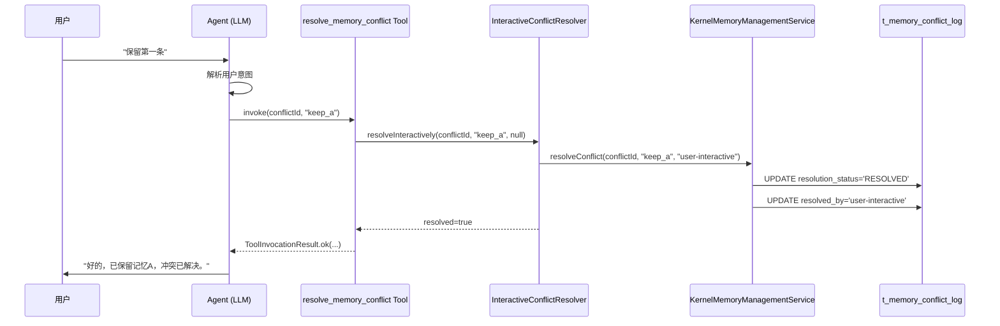

# 交互式记忆冲突处理机制设计方案

## 概述

当前 Seahorse Agent 平台的记忆冲突处理依赖后台管理界面（`MemoryConflictPanel`）由管理员手动解决。本方案新增**交互式记忆冲突处理机制**，让 Agent 在对话过程中主动反问用户，引导用户参与冲突解决，从而提升记忆质量与用户体验。

## 架构总览



## 1. 冲突检测时判断是否需要用户介入

### 1.1 触发时机

交互式冲突检测在以下两个时机执行：

| 时机 | 入口 | 说明 |
|------|------|------|
| **对话开始前** | `KernelChatInboundService.streamChat()` → 记忆上下文组装阶段 | 在 `MemoryPromptFormatter` 组装 `MemoryContext` 时，额外查询该用户的 PENDING 冲突 |
| **治理任务运行后** | `SeahorseMemoryGovernanceJob` → `runGovernance()` 完成后 | 治理发现新冲突时，通过 `MemoryOutboxPort` 入队通知任务，等用户下次对话时消费 |

### 1.2 交互式冲突策略（InteractiveConflictPolicy）

新增 `InteractiveConflictPolicy` 接口，负责判断哪些冲突需要用户介入：

```java
package com.miracle.ai.seahorse.agent.kernel.application.memory;

import com.miracle.ai.seahorse.agent.ports.outbound.memory.MemoryConflictRecord;
import java.util.List;

/**
 * 决定哪些记忆冲突需要用户交互式确认。
 */
public interface InteractiveConflictPolicy {

    /**
     * 从候选冲突中筛选需要用户介入的冲突。
     *
     * @param userId    用户ID
     * @param conflicts 当前 PENDING 状态的冲突列表
     * @return 需要交互式处理的冲突子集（按优先级排序）
     */
    List<InteractiveConflictItem> selectForInteraction(
            String userId, List<MemoryConflictRecord> conflicts);

    /**
     * 默认实现：仅筛选 HIGH/MEDIUM 严重度的冲突，每次最多 3 条。
     */
    static InteractiveConflictPolicy defaults() {
        return new DefaultInteractiveConflictPolicy(3);
    }
}
```

**筛选规则：**

```java
record InteractiveConflictItem(
    String conflictId,
    String memoryId1,
    String memoryId2,
    String content1,       // 从 ShortTermMemoryPort / LongTermMemoryPort 查询
    String content2,
    String conflictType,
    String severity,
    String suggestedQuestion  // 预生成的反问语句
) {}
```

**筛选优先级（从高到低）：**

1. **severity = HIGH**：PROFILE 类型冲突（身份信息冲突直接影响个性化体验）
2. **severity = MEDIUM**：PREFERENCE 类型冲突（偏好信息不一致）
3. **时间新鲜度**：createTime 越近的冲突优先
4. **排除条件**：
   - `conflictType` 为 `DUPLICATE_NEAR`（近似重复，可自动合并）
   - 冲突双方内容相似度 > 0.85（语义几乎相同，无需用户介入）
   - 已尝试过交互但用户未响应的冲突（避免重复骚扰，通过 `interaction_attempt_count` 字段跟踪）

### 1.3 配置项

在 `MemoryPolicyConfig` 中新增配置：

```yaml
seahorse:
  agent:
    memory:
      interactive-conflict:
        enabled: true                    # 是否启用交互式冲突处理
        max-per-session: 3               # 单次对话最多展示的冲突数
        severity-threshold: MEDIUM       # 最低触发严重度（LOW/MEDIUM/HIGH）
        auto-resolve-similarity: 0.85    # 自动合并相似度阈值
        cooldown-minutes: 30             # 同一冲突再次弹出的冷却时间
        max-attempts: 2                  # 同一冲突最大交互尝试次数
```

## 2. 构建反问语句

### 2.1 反问语句生成策略

采用**两级生成策略**：模板化兜底 + LLM 自然语言增强。

#### 2.1.1 模板化生成（兜底）

根据 `conflictType` 和记忆 `type` 选择模板：

```java
public final class ConflictQuestionTemplate {

    /**
     * 根据冲突类型和记忆内容生成反问语句。
     */
    public static String generate(InteractiveConflictItem item) {
        return switch (item.conflictType()) {
            case "SEMANTIC_KEY_CONFLICT" -> generateSemanticKeyConflict(item);
            case "CONTRADICTION" -> generateContradiction(item);
            case "PREFERENCE_POLARITY" -> generatePreferencePolarity(item);
            case "PROFILE_OVERWRITE" -> generateProfileOverwrite(item);
            default -> generateGeneric(item);
        };
    }

    private static String generateSemanticKeyConflict(InteractiveConflictItem item) {
        return String.format(
            "我发现您的记忆中存在两条可能冲突的信息：\n" +
            "- 记忆A：%s\n" +
            "- 记忆B：%s\n\n" +
            "请帮我确认：\n" +
            "1. 保留记忆A\n" +
            "2. 保留记忆B\n" +
            "3. 两条都保留（它们可能并不冲突）\n" +
            "4. 都不保留\n\n" +
            "您可以直接回复数字，或者告诉我正确的信息是什么？",
            item.content1(), item.content2()
        );
    }

    private static String generateContradiction(InteractiveConflictItem item) {
        return String.format(
            "我注意到您的记忆中有一处矛盾：\n" +
            "- 之前记录：「%s」\n" +
            "- 后来又记录：「%s」\n\n" +
            "这两条信息看起来是矛盾的，请问哪个是准确的？\n" +
            "您也可以告诉我最新的情况，我会帮您更新记忆。",
            item.content1(), item.content2()
        );
    }

    private static String generatePreferencePolarity(InteractiveConflictItem item) {
        return String.format(
            "关于您的偏好，我发现了不一致的记录：\n" +
            "- 记录A显示：%s\n" +
            "- 记录B显示：%s\n\n" +
            "请问您目前的真实偏好是什么？",
            item.content1(), item.content2()
        );
    }

    private static String generateProfileOverwrite(InteractiveConflictItem item) {
        return String.format(
            "您的个人档案中有两条不同的信息：\n" +
            "- 旧记录：%s\n" +
            "- 新记录：%s\n\n" +
            "请问哪条是正确的？如果情况已变更，请告诉我最新的信息。",
            item.content1(), item.content2()
        );
    }

    private static String generateGeneric(InteractiveConflictItem item) {
        return String.format(
            "我发现您的记忆中有两条可能不一致的信息：\n" +
            "- 信息A：%s\n" +
            "- 信息B：%s\n\n" +
            "请帮我确认哪条是正确的？",
            item.content1(), item.content2()
        );
    }
}
```

#### 2.1.2 LLM 增强生成（可选）

当 `MemoryPolicyConfig.interactiveConflictLlmEnhance = true` 时，在 `MemoryConflictContextWeaver` 中将冲突信息注入 System Prompt，由 LLM 生成更自然的反问：

```
[SYSTEM PROMPT INJECTION - MEMORY CONFLICT SECTION]
以下是用户记忆中的待确认冲突，请在回复用户原始问题之前，先友好地向用户确认：

冲突 #%d:
- 记忆A (%s): "%s"
- 记忆B (%s): "%s"
- 冲突类型: %s

要求：
1. 用简洁友好的语气向用户描述冲突
2. 提供明确的选项供用户选择
3. 允许用户用自己的话描述正确信息
4. 确认完成后，继续回答用户的原始问题
```

### 2.2 内容安全与长度控制

- 记忆内容截断至 `MAX_CONFLICT_CONTENT_LENGTH = 150` 字符，与 `MemoryPromptFormatter.MAX_MEMORY_ITEM_LENGTH` 保持一致
- 敏感信息（如包含手机号、身份证号的记忆）不参与交互式处理
- 反问语句总长度不超过 500 字符

## 3. 处理用户反馈并更新记忆状态

### 3.1 用户响应解析

用户的反馈通过两种路径收集：

#### 路径A：Agent 自然语言理解（推荐）

用户直接以自然语言回复（如"保留A"、"第二条是对的"、"其实我两个都喜欢"），Agent 解析意图后调用内置 Tool：

```java
/**
 * Agent 工具：解决记忆冲突。
 * 由 LLM 在用户反馈后自动调用。
 */
public final class ResolveMemoryConflictToolPort implements ToolPort {

    public static final String TOOL_ID = "resolve_memory_conflict";

    @Override
    public ToolInvocationResult invoke(String toolCallId, String toolId,
                                        Map<String, Object> arguments) {
        // arguments:
        //   conflictId: String       - 冲突ID
        //   action: String           - keep_a / keep_b / merge / discard / update
        //   mergedContent: String?   - 合并后的内容（action=merge时）
        //   updatedContent: String?  - 用户提供的修正内容（action=update时）
        String conflictId = (String) arguments.get("conflictId");
        String action = (String) arguments.get("action");

        boolean resolved = managementPort.resolveConflict(
                conflictId, action, "user-interactive");

        if (resolved) {
            return ToolInvocationResult.ok(
                "{\"status\":\"resolved\",\"message\":\"冲突已根据您的选择处理\"}");
        }
        return ToolInvocationResult.failed("冲突解决失败，请稍后重试");
    }
}
```

**Tool Schema（注入 LLM 工具列表）：**

```json
{
  "name": "resolve_memory_conflict",
  "description": "解决用户记忆中的冲突信息。当用户确认了哪条记忆是正确的之后调用此工具。",
  "parameters": {
    "type": "object",
    "properties": {
      "conflictId": {
        "type": "string",
        "description": "冲突记录的唯一标识"
      },
      "action": {
        "type": "string",
        "enum": ["keep_a", "keep_b", "merge", "discard", "update"],
        "description": "解决动作：keep_a=保留记忆A, keep_b=保留记忆B, merge=合并, discard=都废弃, update=用新内容替换"
      },
      "mergedContent": {
        "type": "string",
        "description": "合并后的记忆内容（仅 action=merge 时必填）"
      },
      "updatedContent": {
        "type": "string",
        "description": "用户提供的修正记忆内容（仅 action=update 时必填）"
      }
    },
    "required": ["conflictId", "action"]
  }
}
```

#### 路径B：前端结构化交互（辅助）

通过 SSE 自定义事件 `memory.conflict.prompt` 推送冲突卡片到前端，用户点击按钮响应：

```typescript
// 前端接收 SSE 事件
interface MemoryConflictPromptEvent {
  conflictId: string;
  contentA: string;
  contentB: string;
  conflictType: string;
  severity: string;
  question: string;
  options: Array<{
    value: string;    // keep_a / keep_b / merge / discard
    label: string;
  }>;
}

// 用户点击后调用 API
POST /memories/conflicts/interactive-resolve
{
  "conflictId": "mem-conflict-xxx",
  "action": "keep_a",
  "mergedContent": null,
  "updatedContent": null,
  "source": "chat-interactive"  // 标记来源为聊天交互
}
```

### 3.2 反馈处理流程



### 3.3 交互式冲突解析服务（InteractiveConflictResolver）

```java
package com.miracle.ai.seahorse.agent.kernel.application.memory;

/**
 * 处理用户通过聊天交互返回的冲突解决反馈。
 */
public final class InteractiveConflictResolver {

    private final MemoryConflictLogRepositoryPort conflictLog;
    private final ShortTermMemoryPort shortTermMemory;
    private final LongTermMemoryPort longTermMemory;
    private final SemanticMemoryPort semanticMemory;

    /**
     * 处理交互式冲突解决。
     *
     * @param conflictId     冲突ID
     * @param action         用户选择：keep_a / keep_b / merge / discard / update
     * @param mergedContent  合并后内容（action=merge时）
     * @param updatedContent 用户修正内容（action=update时）
     * @param userId         操作用户
     * @return 是否成功解决
     */
    public boolean resolveInteractively(String conflictId, String action,
                                         String mergedContent, String updatedContent,
                                         String userId) {
        // 1. 标记冲突已解决
        boolean resolved = conflictLog.resolve(conflictId, action, "user-interactive:" + userId);

        if (!resolved) {
            return false;
        }

        // 2. 根据 action 执行记忆操作
        switch (action) {
            case "keep_a" -> {
                // 保留 memory_id_1，删除 memory_id_2
                // 具体删除逻辑通过 MemoryManagementInboundPort.deleteMemory() 实现
            }
            case "keep_b" -> {
                // 保留 memory_id_2，删除 memory_id_1
            }
            case "merge" -> {
                // 用 mergedContent 替换两条记忆
                // 更新 memory_id_1 的内容为 mergedContent
                // 软删 memory_id_2
            }
            case "discard" -> {
                // 两条记忆均标记为无效
            }
            case "update" -> {
                // 用 updatedContent 替换 memory_id_1
                // 软删 memory_id_2
            }
        }

        return true;
    }
}
```

### 3.4 记忆状态更新映射表

| 用户选择 | action | memory_id_1 | memory_id_2 | 后续操作 |
|---------|--------|-------------|-------------|---------|
| 保留A | `keep_a` | 保持 ACTIVE | 标记 INACTIVE | 更新 semantic_key 索引 |
| 保留B | `keep_b` | 标记 INACTIVE | 保持 ACTIVE | 更新 semantic_key 索引 |
| 合并 | `merge` | 内容更新为 mergedContent | 标记 INACTIVE | 重新计算 semantic_key |
| 都废弃 | `discard` | 标记 INACTIVE | 标记 INACTIVE | - |
| 用新内容替换 | `update` | 内容更新为 updatedContent | 标记 INACTIVE | 重新计算 semantic_key |

## 4. 与现有系统集成方案

### 4.1 与 MemoryConflictLogRepositoryPort 的集成

**无需修改现有端口接口**，复用现有的三个方法：

| 方法 | 用途 |
|------|------|
| `listByUser(userId, "PENDING", limit)` | 查询待处理的冲突 |
| `save(record)` | 治理服务已使用，无需变更 |
| `resolve(conflictId, action, resolvedBy)` | 标记冲突已解决，`resolvedBy` 设为 `"user-interactive:{userId}"` |

**数据库变更（可选扩展）：**

在 `t_memory_conflict_log` 表中新增列以跟踪交互状态：

```sql
ALTER TABLE t_memory_conflict_log
  ADD COLUMN interaction_attempt_count INTEGER DEFAULT 0,
  ADD COLUMN last_interaction_at TIMESTAMP,
  ADD COLUMN interaction_channel VARCHAR(32);  -- 'chat-agent' / 'chat-ui' / 'admin-ui'
```

### 4.2 与 MemoryPromptFormatter 的集成

在现有 `MemoryPromptFormatter.format()` 输出的末尾，追加冲突提示区块：

```java
// MemoryPromptFormatter 新增方法
public static String appendConflictPrompt(String systemPrompt,
                                           List<InteractiveConflictItem> conflicts) {
    if (conflicts == null || conflicts.isEmpty()) {
        return systemPrompt;
    }
    StringBuilder sb = new StringBuilder();
    sb.append("\n\n[待确认的记忆冲突]\n");
    sb.append("以下是用户记忆中的待确认冲突，请在回答用户问题之前，先友好地确认：\n");
    for (int i = 0; i < conflicts.size(); i++) {
        InteractiveConflictItem item = conflicts.get(i);
        sb.append(String.format(
            "\n冲突 #%d:\n- 记忆A: \"%s\"\n- 记忆B: \"%s\"\n- 冲突ID: %s\n",
            i + 1,
            truncate(item.content1(), MAX_MEMORY_ITEM_LENGTH),
            truncate(item.content2(), MAX_MEMORY_ITEM_LENGTH),
            item.conflictId()
        ));
    }
    sb.append("\n请提供选项让用户选择，确认后再回答原始问题。\n");
    sb.append("确认后，请调用 resolve_memory_conflict 工具完成冲突解决。\n");

    return systemPrompt + sb.toString();
}
```

### 4.3 与 KernelChatInboundService 的集成

在 `streamChat()` 方法的记忆上下文组装阶段注入冲突查询：

```java
// KernelChatInboundService 中修改
private StreamChatContext buildContext(StreamChatCommand command, ...) {
    // ... 现有逻辑 ...

    // 新增：查询交互式冲突
    List<InteractiveConflictItem> pendingConflicts = List.of();
    if (interactiveConflictPolicy != null && conflictLogPort != null) {
        List<MemoryConflictRecord> conflicts = conflictLogPort
            .listByUser(command.userId(), "PENDING", 20);
        pendingConflicts = interactiveConflictPolicy
            .selectForInteraction(command.userId(), conflicts);
    }

    return StreamChatContext.builder()
        // ... 现有字段 ...
        .interactiveConflicts(pendingConflicts)  // 新增字段
        .build();
}
```

### 4.4 与 KernelAgentLoop 的集成

在 Agent 请求构建时注入冲突工具和冲突上下文：

1. **工具注册**：`ResolveMemoryConflictToolPort` 注册到 `ToolRegistryPort`，仅在有 PENDING 冲突时暴露给 LLM
2. **System Prompt 注入**：在 `AgentLoopModelTurns.installRuntimeContext()` 阶段调用 `MemoryPromptFormatter.appendConflictPrompt()`
3. **Agent 自然反问**：LLM 看到 System Prompt 中的冲突信息后，主动向用户提出确认问题

### 4.5 与前端 SSE 事件的集成

通过 `StreamCallback.onEvent()` 发送冲突提示事件：

```java
// 在 KernelChatResponseSupport 中
private void emitConflictPrompt(StreamCallback callback,
                                 List<InteractiveConflictItem> conflicts) {
    for (InteractiveConflictItem conflict : conflicts) {
        callback.onEvent("memory.conflict.prompt", Map.of(
            "conflictId", conflict.conflictId(),
            "contentA", conflict.content1(),
            "contentB", conflict.content2(),
            "conflictType", conflict.conflictType(),
            "severity", conflict.severity(),
            "question", conflict.suggestedQuestion(),
            "options", List.of(
                Map.of("value", "keep_a", "label", "保留记忆A"),
                Map.of("value", "keep_b", "label", "保留记忆B"),
                Map.of("value", "merge", "label", "合并"),
                Map.of("value", "discard", "label", "都不保留")
            )
        ));
    }
}
```

### 4.6 前端交互组件

在聊天界面中渲染冲突确认卡片：

```tsx
// MemoryConflictInteractiveCard.tsx
interface ConflictCardProps {
  conflictId: string;
  contentA: string;
  contentB: string;
  question: string;
  options: Array<{ value: string; label: string }>;
  onResolve: (action: string, mergedContent?: string) => void;
}

export function MemoryConflictInteractiveCard(props: ConflictCardProps) {
  const [selected, setSelected] = useState<string | null>(null);
  const [mergeContent, setMergeContent] = useState("");
  const [resolved, setResolved] = useState(false);

  const handleResolve = async () => {
    if (!selected) return;
    await resolveMemoryConflictInteractive(
      props.conflictId,
      selected,
      selected === "merge" ? mergeContent : undefined
    );
    setResolved(true);
    props.onResolve(selected);
  };

  if (resolved) {
    return (
      <div className="conflict-card resolved">
        <CheckCircle /> 感谢您的确认，冲突已解决。
      </div>
    );
  }

  return (
    <div className="conflict-card interactive">
      <p className="question">{props.question}</p>
      <div className="memory-comparison">
        <div className="memory-a">
          <span className="label">记忆A</span>
          <span className="content">{props.contentA}</span>
        </div>
        <div className="memory-b">
          <span className="label">记忆B</span>
          <span className="content">{props.contentB}</span>
        </div>
      </div>
      <div className="options">
        {props.options.map(opt => (
          <Button
            key={opt.value}
            variant={selected === opt.value ? "default" : "outline"}
            onClick={() => setSelected(opt.value)}
          >
            {opt.label}
          </Button>
        ))}
      </div>
      {selected === "merge" && (
        <Textarea
          placeholder="请输入合并后的正确内容"
          value={mergeContent}
          onChange={(e) => setMergeContent(e.target.value)}
        />
      )}
      <Button onClick={handleResolve} disabled={!selected}>
        确认
      </Button>
    </div>
  );
}
```

## 5. 实现任务清单

### Task 1: 后端核心层（seahorse-agent-kernel）

| 文件 | 说明 |
|------|------|
| `InteractiveConflictPolicy.java` | 新增接口：判断冲突是否需要用户介入 |
| `DefaultInteractiveConflictPolicy.java` | 新增默认实现 |
| `InteractiveConflictItem.java` | 新增 record：交互式冲突项 |
| `ConflictQuestionTemplate.java` | 新增：反问语句模板生成器 |
| `InteractiveConflictResolver.java` | 新增：处理用户反馈的解析服务 |
| `MemoryPromptFormatter.java` | 修改：新增 `appendConflictPrompt()` 方法 |
| `StreamChatContext.java` | 修改：新增 `interactiveConflicts` 字段 |
| `ResolveMemoryConflictToolPort.java` | 新增：Agent 工具端口 |

### Task 2: 端口层（ports）

| 文件 | 说明 |
|------|------|
| `MemoryConflictLogRepositoryPort.java` | 无需修改 |
| `ToolRegistryPort` | 注册 `resolve_memory_conflict` 工具 |
| `StreamCallback` | 无需修改（复用 `onEvent`） |

### Task 3: 适配器层（seahorse-agent-adapter-*）

| 文件 | 说明 |
|------|------|
| `SeahorseMemoryController.java` | 新增 API: `POST /memories/conflicts/interactive-resolve` |
| `MemoryConflictResolveRequest.java` | 扩展：增加 `mergedContent`、`updatedContent`、`source` 字段 |
| `SeahorseAgentKernelMemoryAutoConfiguration.java` | 注册新增的 Bean |

### Task 4: 数据库变更（可选）

| 文件 | 说明 |
|------|------|
| `seahorse_init.sql` | `t_memory_conflict_log` 新增 `interaction_attempt_count`、`last_interaction_at`、`interaction_channel` 列 |

### Task 5: 前端（frontend）

| 文件 | 说明 |
|------|------|
| `MemoryConflictInteractiveCard.tsx` | 新增：聊天内嵌冲突确认卡片 |
| `memoryGovernanceService.ts` | 新增：`resolveMemoryConflictInteractive()` API 调用 |
| `ChatMessageRenderer.tsx` | 修改：识别 `memory.conflict.prompt` SSE 事件并渲染卡片 |

## 6. 关键设计决策

| 决策 | 选择 | 理由 |
|------|------|------|
| Agent 反问方式 | System Prompt 注入 + LLM 自然生成 | 比硬编码模板更自然，且能结合对话上下文 |
| 用户反馈收集 | Agent Tool Call（主）+ 前端卡片（辅） | 兼容纯 API 调用和 UI 增强两种路径 |
| 冲突筛选时机 | 对话前查询，而非对话后 | 避免延迟用户原始请求的响应 |
| 最大冲突数 | 每次对话最多 3 条 | 避免信息过载影响用户体验 |
| resolvedBy 标记 | `"user-interactive:{userId}"` | 与 admin-ui 区分，便于审计追踪 |
| 冷却机制 | 同一冲突最多尝试 2 次 | 避免反复打扰用户 |

## 7. 异常处理与降级

| 场景 | 处理策略 |
|------|---------|
| 用户未响应冲突反问 | Agent 正常回答原始问题，冲突保持 PENDING，下次对话再尝试 |
| 用户回复模糊（如"都可以"） | Agent 追问一次，若仍模糊则跳过，不阻塞正常对话 |
| Tool 调用失败 | 返回友好错误，冲突保持 PENDING，记录日志 |
| 冲突内容涉及敏感信息 | 策略层过滤，不触发交互式处理 |
| 并发冲突（多端同时解决） | `resolve()` 方法基于 `resolution_status = 'PENDING'` 条件更新，幂等安全 |
