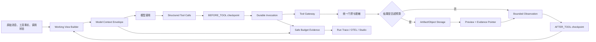

# Seahorse Agent 生产运行时硬化设计：Grill Me 版

> 文档状态：设计基线（Proposed Design）
> 编写日期：2026-07-25
> 适用范围：Seahorse Agent 的上下文、工具结果、恢复、可观测性、能力生命周期与并发治理
> `ArchitectureReviewRequired: yes`
> `ADR Backfill: required`
> 主要验证原则：真实 full-Docker E2E 优先，单元测试只覆盖难以由真实环境稳定表达的纯契约和边界

## 1. 执行摘要

这份设计不是把 VCP 或文章中的实现搬进 Seahorse，而是把两份材料中已经被生产问题反复证明的运行时不变量，映射到 Seahorse 已有的 owner、数据模型和全量 Docker 验证链上。

核心判断如下：

1. 两份材料最值得借鉴的不是某个类名或插件协议，而是 **Additive over Replacement、读写分离、渐进降级、原文可恢复、运行时由框架兜底** 这组原则。
2. Seahorse 已经完成了工具结果 Spill、范围回读、统一 trace 基座以及 OTEL/AgentScope Studio 的真实联调；下一阶段不应重新造一套存储、追踪或插件框架。
3. 当前最危险的缺口是统一的 `Model Context Envelope`。固定的 `maxItems=20` 和 `maxChars=4000` 无法反映 system prompt、tool schema、skill 正文、当前输入和输出预留共同占用的真实模型窗口。
4. VCP 对照材料明确承认其 Spill 仍停留在设计规范和局部原型。这个事实必须写入证据等级，不能把 VCP 的 Spill 描述当作已经生产验证的实现证据。
5. 文章声称其方案经过实际生产验证，这可以作为高价值的外部设计证据；但迁移到 Seahorse 仍需要在现有租户、审批、Artifact、Object Storage、原生 structured tool call 和 Docker 拓扑下重新证明。
6. 原生 structured tool call 让 Seahorse 必须显式处理悬空调用、幂等和重启恢复。不能照搬 VCP 通过文本协议避开该问题的结论。
7. 默认不持久化 raw chain-of-thought。可观测性应记录安全的上下文哈希、预算决策、证据引用、工具状态和结果摘要；调试快照必须受租户策略、脱敏、加密、TTL 和审计约束。

最终推荐的目标状态是：

```text
原始事实 append-only
    -> Working View Builder
    -> Model Context Envelope（真实预算、渐进降级、可解释证据）
    -> Model
    -> Durable Invocation（checkpoint + 幂等 + 恢复）
    -> Tool Gateway（统一门禁、脱敏、Spill、审计）
    -> 有界 observation / evidence pointer
    -> 下一轮 Working View
```

这套设计不承诺外部副作用的数学意义上的 exactly-once；它承诺的是：意图可持久化、状态可重放、未知状态不盲目重调、原始事实不因压缩或重启永久消失、每次降级都有可审计理由。

## 2. 资料范围与证据等级

### 2.1 输入材料

本设计直接参考以下材料：

- [VCP 如何解决 Java-Agent 生产运行时问题-对照分析](../../VCP如何解决Java-Agent生产运行时问题-对照分析.md)
- [AI 专栏：Demo 跑通了，上线就翻车？Java Agent 生产的那些坑，我们帮你填了](../../AI专栏%20_%20Demo%20跑通了，上线就翻车？Java%20Agent%20生产的那些坑，我们帮你填了-2026-07-18%2008_30_21.md)
- [VCP 生产运行时方案在 Seahorse Agent 的落地分析](../analysis/vcp-production-runtime-adoption-analysis.md)
- [Java Agent 生产运行时建议吸收方案](java-agent-production-runtime-adoption-design.md)

两份外部材料中的“生产验证”被视为重要经验输入，但不自动等同于 Seahorse 的验收证据。Seahorse 的完成判定仍以自己的 full-Docker E2E、数据库记录、对象存储对象、OTEL/Studio 观测和故障注入结果为准。

### 2.2 证据等级

| 等级 | 含义 | 本设计中的用法 |
| --- | --- | --- |
| A | Seahorse 当前代码和真实 full-Docker E2E 已证明 | 可以作为当前基线和兼容性约束 |
| B | 外部项目/文章明确声称已在生产反复验证，且设计细节可复核 | 可以借鉴不变量和故障模型，不能跳过 Seahorse E2E |
| C | 源码、设计文档或局部原型可证明存在 | 只能说明方向或局部能力存在 |
| D | roadmap、概念设计、未闭环的接口或实验 | 不得作为上线完成证据 |
| E | 推测、类比或尚未测量的收益 | 只能列为假设，必须标明验证条件 |

### 2.3 关键证据结论

| 主题 | 证据判断 | 结论 |
| --- | --- | --- |
| Seahorse 工具结果 Spill | A：已有真实 full-Docker 13/13 验收与聚焦测试 | 作为现有 owner 增量硬化，不重做基础能力 |
| Seahorse OTEL/Jaeger/Studio | A：已完成生产联调和多端证据核对 | 增量补安全预算元数据，不建立第二套 trace |
| 文章的三层记忆、九段摘要、Spill、热更新、并行 | B：材料明确声明实际生产验证 | 借鉴设计原则和故障场景，重新适配 Java/Seahorse 边界 |
| VCP 的短期记忆与预算 | C：对照文档给出实现细节 | 借鉴“先扣后算”和状态化折叠；不照搬 Node/SQLite/文本协议 |
| VCP Spill | D：对照文档明确写明尚未落地，仅有规范和原型 | **不能写成 VCP 已生产验证的 Spill 证据** |
| VCP 不持久化 reasoning_content | C：实现取舍已明确 | 作为安全方向；与文章提到的 Thinking 观测需求合并审查 |
| 外部工具 exactly-once | E：不能由框架单方面保证 | 只设计 durable intent、查询、补偿和人工介入语义 |

### 2.4 证据使用规则

每个实现切片必须同时写清：

- 借鉴的外部不变量是什么；
- Seahorse 的 canonical owner 是谁；
- 当前代码已覆盖到哪一层；
- 还缺哪一项真实环境证据；
- 失败时是拒绝、降级、重试、人工介入还是继续运行；
- 何时可以退役旧路径或兼容 fallback。

没有上述六项的“已验证”只能写成“设计完成”或“局部验证”，不能写成“生产完成”。

## 3. Grill Me：设计必须经受的质询

“Grill Me”不是在文档末尾列几个反问句，而是每个决策的固定审查格式。每个方案都必须回答：

1. 如果不做，哪个生产不变量会被破坏？
2. 谁是唯一的 canonical owner？是否会产生第二套账本、缓存或 fallback owner？
3. 原始事实是否仍可恢复？恢复需要哪些权限和证据？
4. 失败时系统是 fail closed、渐进降级、重试还是进入人工处置？为什么？
5. 多租户、跨实例、并发、重启、取消、超时后，结论是否仍成立？
6. 模型实际收到的 payload 是否可证明，而不是只记录了中间估算？
7. 是否可能泄露 prompt、secret、用户数据或 raw chain-of-thought？
8. 外部副作用已经发生但本地状态未知时，系统是否会盲目重调？
9. 真实 E2E 如何制造故障并判断证据，而不是只测 happy path？
10. 新路径何时取代旧路径，旧 fallback 何时退役，退役条件是什么？

### 3.1 总体质询与答案

| 质询 | 推荐答案 |
| --- | --- |
| 这是修复生产不变量，还是增加一套框架？ | 修复现有 Kernel、Gateway、Artifact、Checkpoint、OTEL owner 的运行时契约；不引入第二套 Agent 编排或记忆框架 |
| 为什么不直接复制 VCP 的组件？ | VCP 的运行时、存储和协议边界与 Seahorse 不同；复制会制造重复 owner 和不可审计的跨系统状态 |
| 摘要模型挂掉怎么办？ | 原文保留；摘要状态为 `FAILED`；working view 退化到微压缩、pointer 或显式裁剪；不覆盖原文，不无限阻塞用户请求 |
| tokenizer 不可用怎么办？ | 使用明确标记的保守 fallback，并扩大 safety buffer；若实际 payload 仍无法证明在窗口内，则 fail closed，不发送超窗请求 |
| Object Storage 不可用怎么办？ | 对需要 Spill 的结果拒绝把大结果直接送入模型；返回结构化工具失败或受限 observation，保留可重试的 invocation 状态 |
| raw thinking 是否落盘？ | 默认不落盘；只保留安全决策元数据。需要调试时由显式租户策略开启短 TTL、脱敏、加密和审计快照 |
| 能否保证外部副作用 exactly-once？ | 不能由 Agent Runtime 单方面保证；通过幂等键、状态查询、provider 幂等或补偿事务降低风险，并对 `UNKNOWN` 禁止盲目重试 |
| 热更新会不会切断在途调用？ | 新 generation 接新调用，旧 generation drain 在途调用，引用计数归零后关闭，超时才强制关闭并记录证据 |
| 并发是否默认越多越好？ | 不是。按动作语义和 provider 能力分类；不确定的工具默认串行，并受租户、工具和 provider 限流 |

### 3.2 设计工作草案

#### TaskIntentDraft

- 目标：让 Seahorse 在真实生产负载下保持上下文窗口、事实可恢复、工具执行可恢复、证据可解释和资源可清理。
- 成功证据：每个阶段有真实 full-Docker E2E，覆盖数据持久化、模型实际 payload、故障中断、权限边界、OTEL/Studio 和清理结果。
- 停止条件：所有 P0/P1 不变量都有 owner、状态机、回滚策略和 E2E 证据；未验证的扩展能力留在明确的 P2 或 non-goal。
- 非目标：重写 Spring AI、复制 VCP 插件生态、引入第二套会话账本、默认保存 raw chain-of-thought、未经需求证明就实现 JSONPath DSL。

#### BaselineReadSetHint

- 外部经验：VCP 对照分析、生产文章。
- 当前分析：[VCP 生产运行时方案在 Seahorse Agent 的落地分析](../analysis/vcp-production-runtime-adoption-analysis.md)。
- 当前切片设计：[Java Agent 生产运行时建议吸收方案](java-agent-production-runtime-adoption-design.md)。
- 运行时 owner：`AgentLoopModelTurns`、`LocalToolGatewayPort`、`AgentArtifactRepositoryPort`、`ObjectStoragePort`、`ToolResultReadToolPortAdapter`、`AgentCheckpointRepositoryPort`、统一 run/step/model/tool trace。
- 真实证据：工具结果 Spill full-Docker E2E、OTEL/Jaeger/AgentScope Studio 联调证据及对应脚本/日志。

#### ImpactStatementDraft

- 受影响层：Kernel context assembly、conversation persistence、Tool Gateway、Artifact/Object Storage、checkpoint/recovery、provider lifecycle、telemetry。
- 兼容边界：现有原始消息、Artifact 权限、审批语义、工具调用顺序、trace parent-child 关系和 API 对外响应不得被破坏。
- 主要风险：引入第二个 owner、把 working view 当 source of truth、把近似 token 当精确值、把未知副作用当失败重试、把 debug 数据写入 OTEL 标签。
- 需要 ADR 的面：Context Envelope canonical owner、摘要版本模型、durable invocation 状态机、provider generation/drain、证据模型与退役策略。

### 3.3 第一性原理决策复核

- **First Principle**：无论模型、工具、进程和配置如何变化，事实不能永久丢失，模型请求不能越过窗口，外部副作用不能被未知状态驱动盲目重复，且每次降级都能解释。
- **Non-negotiables**：原始事实可恢复；working view 与事实源分离；租户/审批/动作权限不被压缩绕过；structured tool pair 合法；失败状态可重放；敏感数据不进入默认观测链。
- **Assumptions to Drop**：固定最近 N 条等于安全预算；字符数等于 token；日志中出现调用开始就等于外部副作用已知；热更新可以直接关闭旧 client；保存 raw thinking 是唯一排障手段；“有接口”就等于“生产已落地”。
- **Smallest Sufficient Path**：复用现有 `AgentLoopModelTurns`、conversation/message、Gateway、Artifact/Object Storage、Checkpoint、OTEL 和 Catalog owner，只增加统一 Envelope、版本化状态、durable invocation 和必要的 reconciliation；不复制 VCP 运行时。
- **Escalation Signal**：如果实现需要第二套会话账本、旁路 Tool Result 表、不可回溯的摘要覆盖、无 provider 状态查询的副作用重试，或必须把 raw prompt/thinking 写入普通 trace 才能验收，则停止实现并重新做架构审查。

## 4. 当前 Seahorse 基线与差距

### 4.1 已被当前证据证明的能力

| 能力 | 当前事实 | 约束 |
| --- | --- | --- |
| 工具结果 Spill | `LocalToolGatewayPort` 做后置输出处理；Artifact/Object Storage 保存原文；回读 adapter 按 run/tenant/user 约束 | Spill 逻辑继续留在 Gateway 边界，不下沉到每个工具 adapter |
| 完整性 | 已验证 SHA-256、UTF-8 字节数、MIME，full-Docker 13/13 | 新的策略和生命周期不能丢失原有完整性元数据 |
| Trace | 已有统一 `run -> step -> model/tool`，OTEL、Jaeger、AgentScope Studio 已联调 | 新数据作为安全事件/属性补充，不另建 trace 树 |
| Skill / Tool discovery | 已有 runtime block、`load_skill_resource`、`tool_search`、MCP/OpenAPI/A2A 接入 | 继续沿用现有 Catalog/Gateway，不复制 VCP 插件协议 |
| 工具并发 | `AgentLoopToolExecutor` 已有线程池、超时、按原始 toolCall 顺序收集 | 需要增加动作语义资格判定，不能仅按性能开并发 |
| 动作语义 | `ToolActionType` 至少有 READ、WRITE、DELETE、EXTERNAL_SEND | 不确定动作默认保守处理 |
| 审批 checkpoint | 已有 `BEFORE_TOOL`、`AFTER_TOOL`、`WAITING_APPROVAL` 类型 | 主循环主要实际使用 `WAITING_APPROVAL`，需要补通用调用闭环 |
| 幂等键 | executor 已生成稳定 idempotency key | Gateway 尚未形成 durable invocation 去重/状态机闭环 |

### 4.2 当前已确认的主要缺口

| 缺口 | 现状 | 生产后果 | 优先级 |
| --- | --- | --- | --- |
| 动态 context budget | `AgentLoopModelTurns.installRuntimeContext()` 使用固定 `ContextBudget.defaults()`，约为 20 项/4000 字符 | system、skill、tool schema 变大时历史仍可能挤爆窗口 | P0 |
| 实际 payload 证据 | `modelTurnInput()` 目前只记录 message/tool 数量 | 无法解释模型究竟看到了哪些事实和降级结果 | P0 |
| 会话折叠 | 有 `t_conversation_summary`，但尚不能假设支持版本、状态、branch range、摘要 hash | 摘要可能覆盖原文、跨分支污染或无法回放 | P1 |
| 通用工具恢复 | checkpoint 类型已存在，但主循环未完整使用 `BEFORE_TOOL/AFTER_TOOL` | 重启后可能重复执行、悬空或丢失工具调用状态 | P1 |
| thinking 治理 | `KernelAgentLoop.modelTurnOutputJson()` 和审批 checkpoint 仍可能保存 `thinking`/`thinkingContent` | 敏感推理内容进入持久层和观测链 | P1 |
| Spill 生命周期 | 当前有全局 enabled/threshold/preview/maxRead，缺 TTL、retention、per-tool policy、会话清理 | 对象和权限窗口可能无限增长 | P1 |
| 结构化回读 | 当前以字符范围为主，尚无经过需求验证的 JSON path/cursor 契约 | 直接扩展 DSL 会增加权限和兼容复杂度 | P2/条件触发 |
| provider drain | `NativeMcpToolRegistry.replaceAll()` 会关闭旧 feature，缺清晰的 in-flight ref-count/drain | 热更新可能切断在途调用 | P2 |
| 副作用并发资格 | 有并发执行器但未以 READ/WRITE/DELETE/EXTERNAL_SEND 形成统一 scheduler policy | 并发可能造成重复写入、顺序破坏或外部重复发送 | P1/P2 |

## 5. 借鉴、改造与拒绝照搬矩阵

| 外部做法 | 借鉴内容 | Seahorse 改造 | 不照搬的部分 | 验证门槛 |
| --- | --- | --- | --- | --- |
| Additive over Replacement | 在现有底层框架之上补运行时护栏 | 复用 Spring AI、Kernel、Gateway、Artifact、OTEL | 不替换现有编排层 | 架构对齐检查、回归 E2E |
| 原文完整持久化 | working view 与事实源分离 | `t_message`/现有消息 owner append-only | 不把摘要当消息真相 | 重启、折叠失败后恢复原文 |
| 完成轮次微压缩 | 先压缩工具结果事实，再动用 LLM 摘要 | 用 evidence-id/pointer 和现有 Artifact | 不压缩未闭合 tool pair | 原生 FC 协议校验、长会话 E2E |
| 九段式结构化摘要 | 显式锚定目标和当前状态 | 版本化 summary + branch range + source hash | 不直接复制 `<system-reminder>` 注入格式，除非协议评估通过 | 摘要质量门禁、分支隔离 |
| 先扣后算预算 | 固定开销先计入，再分配历史 | `Model Context Envelope` 统一 owner | 不用固定历史比例 | 实际发送 payload/token 证据 |
| Spill 预览+指针+回读 | 单条结果解决宽度问题 | 扩展现有 Gateway/Artifact owner | 不把 VCP 尚未落地的 Spill 当证据 | Object Storage、权限、清理、并发 E2E |
| 按 tool 配置策略 | 不同结果类型不同阈值和预览 | central `ToolResultPolicy` resolver | 不在每个 adapter 复制策略 | 策略覆盖、回滚、租户隔离 |
| Skill 清单+正文延迟 | 减少常驻上下文 | 沿用 `tool_search/load_skill_resource` | 不新建 Skill runtime | schema/skill 变更预算 E2E |
| MCP 差量刷新 | 避免全量重连 | generation + ref-count + drain | 不默认强制关闭旧 client | 在途调用热更新 E2E |
| 虚拟线程/Promise.all | IO 工具可并发 | 保留 Java executor，增加动作资格和限流 | 不让性能目标覆盖副作用语义 | 顺序、span、artifact、取消 E2E |
| 文本协议绕开悬空调用 | 暴露协议差异 | Seahorse 做 durable invocation 和 pair repair | 不改变原生 structured tool call | kill/restart/resume E2E |
| Thinking 可观测 | 需要解释模型行为的信号 | 安全元数据和可选 debug snapshot | 默认不持久化 raw CoT | 脱敏、访问审计、泄露扫描 |

## 6. 目标架构与不变量

### 6.1 目标数据流



### 6.2 不可妥协的不变量

1. 原始用户消息、工具输入、工具输出、调用状态和关键执行事实有持久化事实源。
2. 发给模型的 working view 必须在发送前经过唯一的预算决策层，并对实际 payload 做最终计数或保守证明。
3. Spill 只改变模型看到的 observation，不删除或覆盖原始 Artifact。
4. 摘要只替换 working view 中的历史表示，不覆盖原文；摘要失败不影响原文恢复。
5. 未闭合的 structured tool-call pair 不能被普通历史裁剪、微压缩或摘要切断。
6. 已发出的工具调用在重启后必须能区分未开始、执行中、成功、失败和未知；`UNKNOWN` 不得无条件重调。
7. 并发结果回注顺序与模型原始 tool-call 顺序一致，span parent、artifact 和审计归属彼此隔离。
8. 所有 Artifact、summary、invocation 和 trace metadata 都必须保持 tenant/run/user 边界。
9. raw chain-of-thought 默认不进入持久化、OTEL tag、Studio 展示或 API 响应。
10. 运行结束、取消、超时和失败路径都必须有资源清理和后台兜底回收策略。
11. 每个降级、裁剪、重试、拒绝和恢复动作都必须有机器可读的 reason、版本和关联 id。
12. 每个新增 durable owner 都必须有退役旧路径的条件；不能以兼容名义永久保留重复账本。

### 6.3 Canonical owner 总表

| 责任 | 唯一 owner | 允许复用 | 禁止新增 |
| --- | --- | --- | --- |
| 模型请求上下文装配和预算 | `AgentLoopModelTurns` 侧 Kernel context assembly | `TokenCounterPort`、model metadata、现有 context weaver | 第二个 model prompt builder |
| 原始会话事实 | 现有 conversation/message owner（`t_message` 及其服务） | 现有 branch/tenant 查询 | 第二套 conversation ledger |
| 摘要版本与 working view 引用 | Kernel session context assembly + 现有 summary owner | `t_conversation_summary` 扩展或其现有 repository | 独立 SQLite/内存摘要账本 |
| 工具结果 Spill | `LocalToolGatewayPort` 后置治理 | `AgentArtifactRepositoryPort`、`ObjectStoragePort`、read adapter | 每个工具自行落盘 |
| 工具调用状态与幂等 | Agent Runtime + Tool Gateway 的 durable invocation owner | checkpoint/audit repository | 仅在 executor 内存中去重 |
| trace 与 Studio 证据 | 现有 run/step/model/tool telemetry | OTEL/Jaeger/Studio | 第二套 span 树或旁路回放服务 |
| Skill/tool/provider 生命周期 | 现有 Catalog/registry/provider owner | MCP/OpenAPI/A2A adapter | 复制 VCP 六类插件生态 |

## 7. 设计 A：Model Context Envelope

### 7.1 目标与边界

`Model Context Envelope` 是 P0 的唯一决策中心，负责把一次模型请求所需的全部内容组织成可计量、可降级、可审计的 working view。它不负责：

- 生成长期记忆；
- 决定业务工具是否有权限执行；
- 保存 raw chain-of-thought；
- 替代模型 provider 的最终协议校验；
- 覆盖原始消息或 Artifact。

### 7.2 输入分区

每次发送前必须对实际请求按以下分区计数，不能只按 message 数量：

| 分区 | 例子 | 默认处理 |
| --- | --- | --- |
| `system` | 系统规则、安全政策、运行时协议 | 固定开销，除非 provider 明确支持版本化裁剪 |
| `toolProtocol` | structured tool-call 配对规则、格式约束 | 固定开销，不能静默删除 |
| `runtimeContext` | tenant、user、run、审批和安全上下文 | 仅保留模型必需且已授权字段 |
| `skillBody` | 按需加载的技能正文 | 可延迟加载、按需缩减、版本化 |
| `currentInput` | 当前用户输入和当前轮模型输入 | 最高优先级，不能因历史压缩丢失 |
| `toolSchemas` | 本轮可见工具定义和参数 schema | 先 search 再展开，按实际可调用集合计量 |
| `activePairs` | 未闭合的 assistant/tool 调用对 | 不得切断；必要时停止发送并进入恢复路径 |
| `readySummaries` | 已验证的结构化摘要 | 按 branch range 选择，记录 summary id/hash |
| `historicalMessages` | 已完成的旧消息和工具结果 | 依次微压缩、摘要、显式裁剪 |

### 7.3 预算公式

```text
effectiveWindow = modelContextWindow - outputReserve - safetyBuffer

fixedCost = system
          + toolProtocol
          + runtimeContext
          + skillBody
          + currentInput
          + toolSchemas

historyBudget = max(0, effectiveWindow - fixedCost)
```

其中：

- `modelContextWindow` 必须来自当前实际模型配置和 provider 能力，不允许无来源地使用全局常量；未知时按保守策略拒绝或切换到明确标记的安全 profile。
- `outputReserve` 为模型输出和后续工具调用留出的空间，不能把全部窗口都塞给输入。
- `safetyBuffer` 用来覆盖 tokenizer 差异、协议封装、编码差异和 provider 的隐藏开销；近似计数时必须扩大。
- `fixedCost` 不是固定百分比，而是当前请求真实构成的计数。

### 7.4 选择与降级顺序

Working view builder 按以下顺序处理：

1. 保留不可裁剪的 system、tool protocol、当前输入和必要安全上下文。
2. 保留当前轮和最近一轮的完整消息，确保用户目标和最新状态可读。
3. 保留未闭合的 tool pair；如果其存在使请求无法安全发送，则进入 fail closed / repair，而不是切断配对。
4. 用 Spill pointer 加有界 preview 表示已落盘的大结果。
5. 使用已处于 `READY` 且 branch range 匹配的结构化摘要。
6. 对已完成、可证明无副作用的旧工具结果做 evidence-id 微压缩。
7. 在仍超预算时触发异步摘要的已有 ready 版本；摘要未 ready 不阻塞全部会话。
8. 最后才进行显式硬裁剪，并记录被移除的 message/evidence id 和原因。
9. 对最终准备发送的 payload 再计数；仍超限则拒绝发送并返回可观测的 `CONTEXT_BUDGET_EXCEEDED`，不得依赖 provider 返回错误后再猜测。

### 7.5 目标锚定

文章的九段式摘要中，P0 的 `User Intent` 和 `Current State` 是最值得吸收的部分。Seahorse 应将它们作为结构化字段，而不是依赖摘要文本中偶然出现的句子。

推荐的保留优先级：

| 优先级 | 字段/事实 | 说明 |
| --- | --- | --- |
| P0 | `User Intent` | 用户要解决什么问题、目标对象和成功条件 |
| P0 | `Current State` | 已完成、正在等待、最后可信证据和当前阻塞 |
| P1 | `Decisions`、`Constraints`、`Tool/Action State` | 已作决定、约束、工具状态和审批状态 |
| P1 | `Evidence Refs`、`Open Items` | 可回读证据、未解决问题 |
| P2 | `Risks/Unknowns`、`Next Action` | 风险、未知和下一步 |
| P3 | 低价值叙述、重复背景和冗余工具原文 | 最先被微压缩或裁剪 |

目标锚定必须能追溯到 source message/evidence id，不能由未引用的摘要模型自由补写事实。

### 7.6 Tokenizer 与计数可信度

`TokenCounterPort` 需要分成三个明确状态：

1. `EXACT_PROVIDER`：使用与当前 provider/model 对齐的 tokenizer 或 provider 返回的计量。
2. `CALIBRATED_APPROXIMATION`：经过真实 payload 样本校准的保守近似，带版本和误差上界。
3. `CONSERVATIVE_FALLBACK`：仅用于降级或诊断，扩大 safety buffer，不得冒充精确 token。

每次 envelope 必须输出：

- `modelId` 和 `contextWindowSource`；
- `estimatorMode`、版本和可信度；
- 每个分区 token/字符/字节计数；
- `outputReserve`、`safetyBuffer` 和计算后的余量；
- 最终 payload hash；
- selected、folded、spilled、truncated message/evidence id；
- provider 实际返回的 usage（若有）及估算误差。

字符近似可以作为当前过渡，但不能把 `codePointCount / 4` 直接当作模型预算的事实。连续误差超过阈值时，应自动提高 safety buffer 或关闭该模型的近似路径。

### 7.7 Envelope 输出契约（逻辑形状）

```json
{
  "runId": "...",
  "stepId": "...",
  "modelId": "...",
  "payloadHash": "sha256:...",
  "estimator": {
    "mode": "EXACT_PROVIDER",
    "version": "...",
    "confidence": "HIGH"
  },
  "budget": {
    "contextWindow": 128000,
    "outputReserve": 8192,
    "safetyBuffer": 2048,
    "effectiveWindow": 117760,
    "fixedCost": 18320,
    "historyBudget": 99440,
    "selectedInputTokens": 90211,
    "remainingTokens": 9229
  },
  "partitions": {
    "system": 3100,
    "toolProtocol": 900,
    "runtimeContext": 740,
    "skillBody": 2600,
    "currentInput": 420,
    "toolSchemas": 10560,
    "activePairs": 720,
    "readySummaries": 4800,
    "historicalMessages": 76371
  },
  "decisions": [
    {"kind": "SPILL_POINTER", "evidenceId": "...", "reason": "RESULT_OVER_THRESHOLD"},
    {"kind": "MICRO_COMPACT", "messageId": "...", "reason": "HISTORY_BUDGET"}
  ]
}
```

这是内部 evidence 形状，不代表向用户或模型暴露所有字段。`payloadHash` 可用于关联和复核，但不能由 hash 反推出敏感内容。

### 7.8 失败与降级语义

| 失败 | 处理 | 是否继续请求模型 |
| --- | --- | --- |
| tokenizer provider 暂时不可用 | 切换保守 fallback，放大 buffer并记录 | 只有能保守证明不超限时继续 |
| context window 未知 | 使用显式安全 profile；若无法证明则拒绝 | 否，返回可重试错误 |
| 摘要生成失败 | 保留原文，使用旧 ready 摘要、微压缩或 pointer | 可以继续，除非仍超预算 |
| Spill 读取失败 | 不把大结果重新注入；保留 pointer/error observation | 可以继续询问模型，不能伪造完整结果 |
| active pair 不完整 | 从持久状态 repair 或进入人工/恢复路径 | 不发送非法 FC payload |
| 最终计数超限 | 追加降级一次；仍超限则 fail closed | 否 |

### 7.9 观测与安全边界

OTEL span 只记录上述安全 evidence 元数据，不记录完整 system prompt、完整 tool schema、secret、完整用户输入或 raw thinking。需要完整快照时走专用 debug snapshot policy，详见第 10 节。

## 8. 设计 B：工具结果治理与 Spill 生命周期

### 8.1 Spill 与 compaction 必须分开

两份材料都指出了一个很容易被混淆的边界：

- **Spill / eviction 解决上下文宽度**：单个工具结果太大，原文落盘，模型只看到有界预览和证据指针。
- **Compaction / folding 解决上下文深度**：消息轮次太多，对历史进行微压缩和结构化摘要。

两者的 owner、触发条件、失败语义和回滚方式不同。不得把一个超长工具结果直接交给摘要模型来“顺便解决”，也不得让历史折叠覆盖对象存储中的原文。

### 8.2 继续复用现有 owner

推荐沿用当前链路：

```text
Tool implementation
  -> LocalToolGatewayPort
  -> existing authorization / redaction / audit
  -> ToolResultPolicyResolver
  -> KernelToolResultSpillService
  -> AgentArtifactRepositoryPort + ObjectStoragePort
  -> bounded preview + evidence pointer
  -> AgentLoop observation
```

Spill 必须发生在统一脱敏之后、模型 observation 形成之前。这样对象存储、Artifact、模型上下文、审计和 Studio 不会出现“某条旁路绕过脱敏”的不一致。

不得把 Spill 逻辑复制到 MCP、OpenAPI、A2A、Web 和自定义 Tool adapter 中；这些入口都必须汇聚到 Gateway 的共同后置点。

### 8.3 ToolResultPolicy

当前全局 `ToolResultSpillOptions` 可作为默认策略，但需要增加一个集中解析层，而不是让每个工具自己解释配置。

逻辑策略字段如下：

| 字段 | 说明 | 推荐默认 |
| --- | --- | --- |
| `enabled` | 是否允许该工具结果 Spill | 继承全局开关 |
| `thresholdBytes` | 按 UTF-8 字节触发的硬阈值 | 全局阈值，按工具覆盖 |
| `previewMode` | `PREFIX_TEXT`、`STRUCTURED_HEAD`、`REDACTED_META` 等 | `PREFIX_TEXT` |
| `previewBytes` | 模型 observation 预览上限 | 全局预览上限 |
| `readMode` | `CHAR_RANGE`、未来受控 `JSON_PATH`/`CURSOR` | 当前仅 `CHAR_RANGE` |
| `maxReadBytes` | 单次回读上限 | 全局上限 |
| `microCompactionAllowed` | 结果是否可被历史微压缩 | 只对无副作用、已完成结果开放 |
| `safetyClass` | `PUBLIC`、`TENANT_DATA`、`SENSITIVE`、`SECRET_BLOCKED` | 由工具注册信息声明 |
| `retentionClass` | 生命周期和清理策略 | 按租户/运行 profile 解析 |
| `contentTypeAllowlist` | 可接受的 MIME/编码 | 默认 UTF-8 文本和受控 JSON |

策略解析需要返回 `policyVersion` 和匹配来源，写入安全 evidence。发生配置热更新时，一次已开始的工具调用使用其启动时的策略版本，不能在中途切换阈值造成半截结果前后不一致。

### 8.4 Spill 逻辑状态

Artifact 和对象存储的真实状态至少要能区分以下阶段：

```text
NOT_REQUIRED
  -> WRITING
  -> STORED
  -> PUBLISHED
  -> EXPIRED / DELETED

WRITING -> WRITE_FAILED
PUBLISHED -> DELETE_PENDING -> DELETED
```

说明：

- `STORED` 表示完整原文和完整性元数据已在对象存储中成功落地。
- `PUBLISHED` 表示 Artifact 记录、权限绑定和模型 pointer 可以一致地被发现。
- 只完成对象上传但 Artifact 记录失败时，必须执行尽力删除并把调用标记为可观察的 Spill 失败；不能返回一个模型无法回读的“假 pointer”。
- 只完成 Artifact 记录但对象不存在时，也不能把记录当作可读证据；后台一致性检查应能发现并封闭该状态。
- `EXPIRED`/`DELETED` 后 pointer 仍可作为历史审计引用，但模型回读必须得到明确的过期结果，不能返回空字符串伪装成有效数据。

### 8.5 命名和完整性

artifact identity 至少绑定：

```text
tenantId / runId / stepId / toolCallId / contentHash / policyVersion
```

对象键必须包含不可预测或唯一的调用标识，不能只用 `toolName + timestamp`。并发工具调用不得互相覆盖，即使同一个工具在同一毫秒返回相同长度的内容也必须成立。

保存的完整性元数据继续沿用当前生产验收已证明的字段：

- SHA-256；
- UTF-8 byte length；
- MIME/content type；
- 原始 tool id、tool call id、step id；
- artifact 的 tenant/run/user 权限归属；
- 创建时间、过期时间、policy version。

模型 observation 只需要 pointer、preview、长度、摘要 hash、回读说明和安全的 evidence id，不应暴露内部 `storageRef`。

### 8.6 回读契约

当前已验证的字符范围回读是基线，继续保留：

```json
{
  "artifactId": "...",
  "offset": 8192,
  "limit": 4096
}
```

返回：

```json
{
  "artifactId": "...",
  "offset": 8192,
  "returnedChars": 4096,
  "nextOffset": 12288,
  "hasMore": true,
  "content": "..."
}
```

回读必须：

1. 通过当前 invocation/run context 获得 tenant、run 和 user，而不是信任模型传来的租户参数。
2. 只允许 `provenance.kind=tool_result_spill` 且属于当前 run 的 Artifact。
3. 强制 `maxReadChars`/`maxReadBytes`，防止回读本身再次炸穿上下文。
4. 不返回 `storageRef`、内部 bucket、绝对路径或跨租户错误细节。
5. 回读工具自身不能再次触发 Spill，避免递归链。
6. 对已过期、删除中、校验失败的 Artifact 返回结构化错误和 evidence id。

JSON path 和分页 cursor 只有在真实业务 E2E 证明字符范围造成明显浪费，并且权限、数组边界、schema 版本和结果上限都定义清楚后才增加。不能因为文章提到该能力，就在没有使用场景和安全契约的情况下先做一个通用表达式语言。

### 8.7 生命周期清理

生命周期由 session/run owner 驱动，至少覆盖：

| 触发 | 动作 |
| --- | --- |
| 正常结束 | 标记可清理，按 retention class 删除或转归档 |
| 用户取消 | 取消未完成写入，清理已发布但不再需要的临时 Artifact |
| 超时 | 结束 invocation lease，进入后台清理队列 |
| 进程重启 | 由 durable 状态和 GC 扫描恢复清理，不依赖 JVM 内存 |
| 租户删除/权限撤销 | 立即阻断回读，异步删除对象和 Artifact |
| 删除失败 | 指数退避重试，超过上限告警并保留审计记录 |

清理不是“请求结束就同步删除”这么简单。必须保留足以支持审批、回放和合规审计的 retention window，并明确哪些 Artifact 是临时 working view、哪些是业务生成物、哪些是不可删除的审计证据。不同类别不能共用一个无差别 TTL。

### 8.8 Spill 失败语义

| 场景 | 不允许的行为 | 推荐行为 |
| --- | --- | --- |
| 对象上传失败 | 把原文直接送入模型 | 返回受限 observation/工具失败，保留可重试状态 |
| Artifact 写入失败 | 只返回 pointer | 尽力删除对象，返回明确失败，不发布 pointer |
| 脱敏失败 | 先落盘再继续 | 沿用 Gateway fail-closed 路径 |
| 预览生成失败 | 暴露完整结果 | 只返回安全元数据和回读不可用原因 |
| 回读越权 | 暴露“存在/不存在”的跨租户细节 | 统一拒绝语义并记录审计 |
| TTL 到期 | 返回空内容 | 返回 `ARTIFACT_EXPIRED` 和新的可观察证据 |

### 8.9 Grill Me：Spill

- 如果 Spill 和摘要共用一张表，能否区分“单条结果过宽”和“历史过深”？不能，因此 owner 和状态必须分开。
- 如果 TTL 删除了 pointer 指向的原文，模型会不会把 pointer 当事实？不会；回读返回过期状态，working view 记录 evidence freshness。
- 如果两个并发调用使用同一个 tool name，是否可能覆盖？不应；命名必须绑定 `toolCallId` 和 content hash。
- 如果模型伪造别人的 artifactId，是否能跨租户读？不应；权限由当前 run context 和 provenance 双重约束。
- 如果对象存储成功、数据库失败，是否会留下孤儿？允许短暂孤儿，但必须有一致性扫描、删除重试和告警证据；不能把它当成功完成。

## 9. 设计 C：版本化会话折叠与 Working View

### 9.1 source of truth 与表示层

会话消息采用以下分层：

```text
t_message（append-only 原始事实）
    + tool invocation / artifact evidence
    + versioned summary（按 branch range 绑定）
    -> working view（本次模型请求临时生成）
```

`working view` 不是新的持久化真相；它只是某个 model turn 在特定预算、策略、模型和权限下选择的表示。每次生成都应记录其 `contextHash` 和 summary/evidence 引用，便于回放。

### 9.2 复用并扩展现有 summary owner

当前已有 `t_conversation_summary`，但不能假设它已经具备生产折叠所需的所有字段。推荐先盘点现有 owner，再以兼容迁移扩展，而不是新建第二张“记忆账本”。逻辑字段至少需要：

| 字段 | 作用 |
| --- | --- |
| `summaryId` | 稳定引用 |
| `tenantId`、`conversationId`、`branchId` | 隔离和分支绑定 |
| `sourceStartMessageId`、`sourceEndMessageId` | 精确 source range |
| `sourceRangeHash` | 证明摘要对应的原文版本 |
| `status` | `PENDING`、`READY`、`FAILED`、`SUPERSEDED` |
| `schemaVersion`、`promptVersion`、`modelId` | 可重建和质量追溯 |
| `summaryHash` | 防止未记录的内容替换 |
| `structuredPayload` | 九段式结构化内容或等价 JSON |
| `evidenceRefs` | 工具/Artifact/消息引用 |
| `createdAt`、`readyAt`、`supersededAt` | 生命周期 |
| `failureCode`、`failureReason` | 可观测失败原因，不写敏感原文 |

实际 SQL 字段和索引以现有 schema owner 为准；本表不授权实现者绕过现有 repository 直接写数据库。

### 9.3 摘要状态机

```text
PENDING -> READY
PENDING -> FAILED
READY -> SUPERSEDED
FAILED -> PENDING（仅在新的 source range/version 下重试）
```

规则：

- `READY` 只能被 source range、branch、schema version 和 hash 全部匹配的 working view 采用。
- `FAILED` 不覆盖原文，也不阻塞所有后续请求；请求可以退化到旧 `READY`、微压缩或 pointer。
- 旧 `READY` 被新摘要替代后标记 `SUPERSEDED`，但在 retention window 内仍可回放。
- 摘要生成必须是幂等的：同一个 source range/version 重试不会制造无限重复的有效摘要。

### 9.4 九段式结构化摘要

推荐结构如下，字段顺序固定，优先级显式记录：

1. `User Intent`（P0）：目标、对象、成功条件。
2. `Current State`（P0）：已完成、当前阶段、最后可信状态。
3. `Decisions`（P1）：已作出的决策和依据。
4. `Open Items`（P1）：未解决问题、待确认项。
5. `Constraints`（P1）：权限、时间、业务和安全约束。
6. `Evidence Refs`（P1）：消息、tool call、artifact、外部来源引用。
7. `Tool/Action State`（P1）：工具是否成功、是否有审批、是否可能存在未知副作用。
8. `Risks/Unknowns`（P2）：数据新鲜度、覆盖范围和未证实假设。
9. `Next Action`（P2）：下一轮最小可执行动作。

摘要生成提示词必须要求“没有证据就写 unknown，不得补事实”，并要求每个关键结论引用 source id。摘要质量校验至少包含：

- JSON/schema 校验；
- 长度和预算校验；
- source id 存在性校验；
- branch range 校验；
- 禁止把失败/拒答文本伪装为事实的拒答和污染检查；
- P0 字段非空或显式 `unknown`；
- summary hash 与持久化内容一致。

### 9.5 渐进压缩顺序

1. 保留原始消息和工具事实。
2. 对已完成工具结果生成 evidence-id 微压缩，例如“调用成功、结果摘要、完整结果 artifact id”。
3. 对可合并的已完成轮次生成结构化摘要。
4. 摘要之上再摘要时，保留 source range 和 summary refs，不能只把上一份摘要当无来源文本。
5. 对仍超预算的 working view 做显式裁剪。

微压缩不得处理：

- 未闭合的 assistant/tool pair；
- `UNKNOWN` 的外部副作用；
- 尚未完成的审批；
- 可能决定安全权限的原始约束；
- 没有可回读证据的关键结论。

### 9.6 分支隔离

摘要必须绑定 `branchId` 和 message range。分支合并或回溯时，不能直接复用另一个 branch 的摘要，即使文本看起来相似。可复用的摘要必须经过 source range 映射和 hash 验证，否则标记为不可用并重新生成。

这是 VCP 深度/语义折叠在 Seahorse 中最需要补的约束：语义相似不等于同一事实链，尤其在审批、工具写入和用户纠正发生后。

### 9.7 异步与并发

摘要生成放在模型注入前的可调度任务中，但不能把用户请求无限阻塞在摘要模型上：

- 同一 conversation/branch 的相同 source range 只允许一个 active generation；
- 不同 branch 可以并发；
- 失败采用指数退避和最大重试次数；
- 摘要任务拥有自己的 trace/span 和 source hash；
- 新消息到来后，旧的 pending 摘要可以被标记 superseded，而不是继续覆盖新的 working view；
- 摘要模型不可用时，主请求使用已有 ready view 或无摘要降级。

### 9.8 Grill Me：摘要

- 摘要失败会不会覆盖原文？不会，`t_message` append-only，失败只写状态。
- 错误摘要会不会进入模型？只有通过 schema、source、污染和 P0 校验的 `READY` 才能进入。
- 摘要是否可能跨分支污染？不能，branch/range/hash 是采用条件。
- 摘要未 ready 是否阻塞用户？默认不阻塞；只有在没有任何可安全发送的 working view 时 fail closed。
- 是否先引入 embedding/语义相似折叠？不先引入。先证明结构化摘要和 evidence pointer 仍不足，再以数据驱动决定。

## 10. 设计 D：认知可观测性与 Thinking 治理

### 10.1 已有 trace 的增量方向

Seahorse 已有 run/step/model/tool span、RAG trace、Tool audit、RunContextSnapshot、Jaeger 和 AgentScope Studio。下一步不是重新建立 VCPLog 或另一棵 Span 树，而是让每个 model turn 的“有效上下文决策”可解释。

推荐的 span/event 层级：

```text
agent.run
  -> agent.step
    -> model.call
      -> context.envelope
      -> model.request
      -> model.response
    -> tool.call
      -> tool.policy
      -> tool.artifact
      -> tool.observation
    -> checkpoint
```

### 10.2 默认可记录字段

| 类别 | 字段例子 | 是否允许 raw 内容 |
| --- | --- | --- |
| 关联 | run/step/model/toolCall/invocation/artifact/summary id | 只记录 id |
| 上下文 | payload hash、message count、tool count、branch id | 否 |
| 预算 | 分区 token、window、reserve、buffer、estimator mode | 否 |
| 降级 | spill/fold/truncate decision、reason、source range | 否 |
| 证据 | evidence id、artifact hash、freshness/coverage | 否 |
| 工具 | action type、policy version、approval state、status | 否 |
| 性能 | latency、queue、retry、timeout、bytes | 否 |
| 结果 | provider usage、error code、schema validation result | 否 |
| 安全 | redaction count、policy outcome、access decision | 否 |

### 10.3 Thinking 的边界

文章强调 Thinking Event 对排障有价值，VCP 对照文档则明确选择不持久化 `reasoning_content`。两者不必二选一：

- 默认不持久化 raw chain-of-thought；
- 记录“模型做了哪类决策、用了哪些 evidence、触发了什么工具和降级”的安全元数据；
- 若 provider 返回可展示的 reasoning summary，必须经过数据分类和租户策略，不能因字段名叫 `thinking` 就直接写入数据库；
- 调试快照只在显式开启时捕获，且必须脱敏、加密、短 TTL、访问审计和最小权限；
- OTEL attributes 绝不能放完整 prompt、tool input/output、secret 或 raw reasoning，因为标签会被复制到多套后端并长期保留。

现有 `modelTurnOutputJson()` 和审批 checkpoint 中可能出现的 `thinking`/`thinkingContent`，应作为 P1 数据治理项逐步收敛：默认删除或替换为安全 summary；历史数据按保留策略清理，不通过未经审查的批量脚本直接覆盖审计事实。

### 10.4 最终有效上下文快照

“最终模型看到什么”是文章和 VCP 都强调的可观测重点。Seahorse 推荐保存一个安全的 `ContextDecisionSnapshot`，而不是完整 prompt：

```json
{
  "runId": "...",
  "stepId": "...",
  "modelId": "...",
  "payloadHash": "...",
  "sourceWindow": {
    "branchId": "...",
    "messageStart": "...",
    "messageEnd": "..."
  },
  "summaryRefs": ["..."],
  "evidenceRefs": ["..."],
  "budgetEvidenceRef": "...",
  "decisions": ["MICRO_COMPACT", "SPILL_POINTER"],
  "redaction": {"count": 2, "policyVersion": "..."}
}
```

需要授权的 operator 才能通过内部 replay 服务将这些 id 解析到受控数据；公开 API、普通日志和 Studio 默认只展示安全字段。

### 10.5 Replay 的边界

回放应优先重建：

- 原始消息 range；
- summary source/hash；
- tool invocation 状态；
- Artifact pointer 和 freshness；
- context budget decisions；
- model/tool span 时间线。

回放不应默认重新执行外部副作用工具。需要重演时必须使用只读 sandbox、录制结果或显式审批，避免“排障回放”再次发送邮件、写订单或删除资源。

### 10.6 Grill Me：观测

- 不保存 raw thinking，如何定位模型跳跃？依靠 source/evidence refs、工具输入输出摘要、预算决策、错误现场和可选受控快照；不能把隐私风险当作默认排障方案。
- 如果只存 hash，能否证明模型看到了什么？可以证明 payload identity 和选择集合，但不能替代授权回读；两者分开。
- OTEL 后端泄露怎么办？默认不写高敏内容；敏感 debug 数据走专用存储、加密和审计，不依赖 OTEL 的访问控制。
- evidence 已过期怎么办？snapshot 标记 freshness/expired，回放显示“当时引用了何物、现在是否仍可读”，不能伪装当前仍有效。

## 11. 设计 E：Checkpoint、幂等与重启恢复

### 11.1 原生 structured tool call 的事实

Seahorse 使用原生 structured tool calls，因此每个 assistant tool-call 与对应 tool result 的配对关系是 provider 协议的一部分。文本协议可以把调用编码为字符串，但 Seahorse 不能用这个差异来回避：

- assistant 已声明调用但进程在结果前退出；
- tool 已产生外部副作用但本地写入失败；
- tool result 已写入但模型请求尚未发送；
- checkpoint 与 audit 写入顺序不一致；
- 历史裁剪切掉一半配对。

### 11.2 Durable invocation 状态机

推荐使用以下逻辑状态，实际存储复用现有 invocation/audit/checkpoint owner：

```text
PENDING
  -> RUNNING
  -> SUCCEEDED
  -> FAILED
  -> UNKNOWN

RUNNING -> UNKNOWN（租约丢失、进程崩溃、外部响应不确定）
UNKNOWN -> SUCCEEDED（状态查询确认）
UNKNOWN -> FAILED（状态查询确认未发生）
UNKNOWN -> COMPENSATION_REQUIRED（需补偿/人工）
```

幂等 identity 推荐为：

```text
(tenantId, runId, toolCallId, idempotencyKey)
```

若 provider 只接受业务幂等键，则必须额外保存业务键与 runtime key 的映射，不能只在日志里打印一个 key。

### 11.3 推荐执行顺序

1. 模型返回 tool calls 后，先持久化原始 assistant message 和 `BEFORE_TOOL` checkpoint。
2. 为每个 tool call 创建 durable invocation，状态 `PENDING`，写入 action type、policy、approval requirement 和 idempotency key。
3. 审批通过后转 `RUNNING`，获取 provider/client generation 的引用。
4. 调用 Gateway；Gateway 执行权限、脱敏、Spill、审计和 provider 调用。
5. 工具结果和 Artifact/pointer 落地成功后，写入 observation 与 `AFTER_TOOL` checkpoint。
6. invocation 变为 `SUCCEEDED` 或 `FAILED`；如果外部状态不可确认，变为 `UNKNOWN`，而不是伪造失败。
7. 下一次模型请求只使用已持久化、配对完整的结果；模型请求发送本身也记录 turn identity，避免重启后误判。

### 11.4 重启恢复策略

| invocation 状态 | 恢复动作 |
| --- | --- |
| `SUCCEEDED` | 重放持久化 observation/pointer，不重新调用外部工具 |
| `FAILED` | 根据工具 retry policy 决定重试或结束；重试必须使用同一幂等 identity |
| `PENDING` | 如果未获得执行租约，可安全领取；检查是否已有 provider side record |
| `RUNNING` | 先检查 lease 和 provider 状态，不能直接再调 |
| `UNKNOWN` | 优先查询状态；无法查询时进入补偿或人工处置，不盲目重调 |
| 悬空 assistant tool call | 从 durable invocation/observation 修复 working view；原始事实保留 |
| 缺失 tool result | 生成结构化 `TOOL_RESULT_UNAVAILABLE` observation，不能构造成功结果 |

### 11.5 悬空 pair repair

repair 只作用于发送给模型的 working view，不删除 `t_message`、checkpoint 或审计事实。推荐规则：

- assistant tool call 有 `SUCCEEDED` observation：补齐标准 tool message；
- assistant tool call 有 `FAILED` observation：补齐结构化错误 tool message；
- invocation 为 `UNKNOWN`：补齐“状态未知、禁止重复执行”的安全 observation，并引导模型进入查询/人工路径；
- 没有任何 durable invocation：标记为协议残片，working view 过滤并记录 repair reason；
- tool result 没有对应 assistant call：过滤到模型视图，保留原始事实用于审计；
- repair 后再次执行 provider message schema 校验，仍不合法则 fail closed。

### 11.6 Checkpoint 原子性与租约

checkpoint、invocation 状态和 tool audit 不一定能由一个数据库事务覆盖所有外部系统，但必须定义提交顺序和可恢复中间态：

- 先写意图和 `PENDING`，再获得执行租约；
- lease 有 owner、过期时间和 heartbeat；
- 外部调用后先写不可变结果/Artifact，再转状态；
- 任一阶段失败，都能由后台 reconciler 根据状态和 evidence 继续处理；
- 不以“日志中出现调用开始”作为 durable execution proof。

### 11.7 Grill Me：恢复

- 外部副作用已发生、本地状态未知，怎么办？查询 provider 状态、使用幂等键、尝试补偿或人工介入；禁止因为 HTTP 超时就再次发送。
- 能否承诺 exactly-once？不能。能承诺的是 durable intent、可重复识别和不盲目重试。
- 进程在 `BEFORE_TOOL` 后立即被 kill，下一次会不会重复？恢复先查 invocation 和 provider 状态；无状态确认时进入 `UNKNOWN`。
- 原始 FC pair 修复是否损害审计？不损害；只修 working view，原始消息和 repair event 都保留。

## 12. 设计 F：能力供给与 Provider 生命周期

### 12.1 按需能力供给

文章和 VCP 在 Skill/Tool 供给上的共同经验是：常驻上下文只放清单和轻量描述，正文、详细 schema 和高成本能力按需展开。Seahorse 已有 runtime block、`load_skill_resource` 和 `tool_search`，因此推荐：

- skill catalog 只注入名称、版本、用途、适用条件和加载入口；
- skill body 进入 envelope 后按真实 token 计量；
- tool search 先返回轻量结果，再展开本轮真正需要的 schema；
- 每次展开记录 revision、policy version 和 budget impact；
- skill/tool 版本改变时，working view 关联新的 revision，不覆盖历史 evidence。

不复制 VCP 的六类插件协议；Seahorse 已有更贴近自身权限和工具门禁的 Catalog/Gateway owner。

### 12.2 MCP/Provider generation

当前 `NativeMcpToolRegistry.replaceAll()` 关闭旧 feature 的行为需要演进为 generation 语义：

```text
Generation N: ACTIVE -> DRAINING -> CLOSED
Generation N+1: CANDIDATE -> ACTIVE
```

刷新步骤：

1. 读取新配置并做 schema、权限和连通性校验。
2. 创建新 generation；校验失败时保留旧 generation。
3. 原子切换 registry 对新调用的默认指针。
4. 旧 generation 停止接受新调用，进入 `DRAINING`。
5. 每个 in-flight invocation 持有 ref-count；完成、失败或取消后释放引用。
6. ref-count 归零后关闭 client/connection。
7. drain 超时进入强制关闭，所有剩余 invocation 标记明确错误和 provider generation，不能静默丢失。

### 12.3 差量刷新与失败回滚

配置更新应按 provider/tool identity 做差量：

- 未变化的 provider 不重连；
- 新增 provider 先健康检查再发布；
- 删除 provider 先 drain；
- 配置校验或健康检查失败，旧 generation 继续服务；
- 刷新事件和 generation 变更进入 run/operational trace；
- 全量重连只作为显式运维动作，不作为普通配置刷新副作用。

### 12.4 资源和权限边界

provider 引用计数只保证生命周期，不授予调用权限。每次调用仍需经过现有 tenant、tool policy、审批和动作语义门禁。关闭 provider 时，未完成的外部副作用仍按 invocation recovery 处理，不能用 client close 把状态伪装成 `FAILED`。

### 12.5 Grill Me：Provider

- 新配置坏了怎么办？不切换，旧 generation 继续；失败证据可见。
- 旧连接何时真正关闭？in-flight ref-count 归零或 drain 超时；两者都记录。
- 强制关闭会不会制造 UNKNOWN？会，相关 invocation 必须显式进入 `UNKNOWN` 或 provider-specific unavailable 状态，不得静默丢调用。
- 为什么不直接 `replaceAll`？因为它没有表达“停止接新调用但等待在途调用”的生命周期，无法证明安全下线。

## 13. 设计 G：副作用感知并发

### 13.1 并发资格矩阵

并发资格由 scheduler 统一决定，不能只由模型请求中的“多个 tool call”决定：

| 动作 | 默认策略 | 必要条件 |
| --- | --- | --- |
| READ | 可并发 | provider/工具声明线程安全、无隐含写入、限流可用 |
| READ + cache mutation | 默认串行或按 provider 声明 | 缓存一致性和幂等明确 |
| WRITE | 串行 | 有业务幂等键和顺序语义；除非工具声明可安全并行 |
| DELETE | 串行 | 目标顺序、重试和补偿明确 |
| EXTERNAL_SEND | 串行 | provider 幂等、审批和状态查询明确 |
| UNKNOWN | 串行 | 先补齐 action metadata |

动作分类错误的代价高于少一些并发，因此未知默认保守串行。

### 13.2 顺序与结果收集

允许同一批中的合格 READ 工具并发执行，但：

- 结果回注顺序必须与模型原始 tool-call 列表一致；
- 每个 Future 绑定自己的 `toolCallId`、span、invocation、policy version 和 artifact namespace；
- 一个工具失败不应覆盖其他工具的结果；批次是否继续由 scheduler policy 决定；
- 超时和取消要分别记录，不能把“未等待到结果”写成“工具返回失败”；
- 下一轮模型请求只能读取已经持久化的 observation。

### 13.3 资源限制

并发上限至少按以下维度生效：

- tenant；
- agent/run profile；
- tool identity；
- provider connection/generation；
- 全局线程、连接、Artifact 写入和对象存储吞吐。

Java 虚拟线程可以减少 IO 等待的线程成本，但不解除数据库连接、第三方 QPS、外部 API 配额和副作用顺序约束。

### 13.4 取消与部分成功

批次取消时：

- 尚未开始的 invocation 标记 `CANCELLED_BEFORE_START`；
- 已开始但未确认结果的 invocation 进入 `UNKNOWN`，而不是自动重试；
- 已成功的 invocation 结果照常持久化；
- 下一轮 working view 能表达“部分成功”和“未知项”；
- trace 记录 cancellation source 和传播延迟。

### 13.5 Grill Me：并发

- Future 返回顺序和完成顺序不同怎么办？按原始索引收集，不按完成顺序拼接。
- 多个工具同时 Spill 会不会串 artifact？每个调用独立 namespace 和唯一 key。
- 一个 READ 实际上触发写缓存怎么办？工具注册元数据必须声明真实动作；未知/不确定默认为串行，并在观测中标记分类来源。
- provider 限流时是否无限排队？否，队列有上限、超时和结构化拒绝，避免内存和租户资源被拖垮。

## 14. 跨切面安全、租户与数据治理

### 14.1 数据分类

建议至少把运行时数据分为：

| 类别 | 例子 | 默认存储/展示 |
| --- | --- | --- |
| `PUBLIC_RUNTIME_META` | id、状态、耗时、计数 | 可进入普通 trace |
| `TENANT_EVIDENCE` | 工具结果、Artifact、摘要引用 | 租户隔离存储，按权限回读 |
| `SENSITIVE_INPUT` | 用户输入、业务字段、tool payload | 脱敏/加密，最小权限 |
| `SECRET` | token、credential、密钥 | 禁止进入模型观测和普通日志 |
| `RAW_REASONING` | provider reasoning content | 默认不持久化，显式策略才可进入受控 debug store |

### 14.2 多租户不变量

所有 Artifact、summary、invocation、checkpoint、debug snapshot 和回读请求必须至少验证：

```text
tenantId + runId/conversationId + user/actor policy + provenance
```

模型传入的 `tenantId`、`userId`、绝对路径、bucket 名称、内部 URI 都不能作为授权依据。跨租户和越权错误应使用一致的外部错误语义，同时保留内部审计 reason。

### 14.3 审批与安全动作

context compaction 不能删除影响安全判断的审批状态、策略版本、拒绝原因和动作约束。Spill 回读和 debug snapshot 也不能绕过审批。任何 `WRITE`、`DELETE`、`EXTERNAL_SEND` 的恢复重试，都必须重新检查当前策略是否仍允许，不能只复用历史批准。

### 14.4 删除与合规

设计必须区分：

- 业务事实的法定保留；
- 调试快照短 TTL；
- 临时 Spill 的 retention；
- OTEL/Studio 的索引和展示保留；
- 用户请求删除后的级联删除和不可变审计例外。

不能把“会话结束清理”理解为无条件删除所有证据，也不能因为“需要回放”无限保留敏感数据。每一类数据都要有 owner、retention class、删除事件和失败告警。

## 15. 推荐实施路线图

实施顺序按“先保证模型请求不越界，再保证事实可恢复，再补长期治理”的依赖关系排列。每个切片完成后单独提交，提交前执行真实 Docker E2E 和 `git diff --check`；不以一组巨型提交跨越多个 owner。

### 15.1 Slice 0：契约盘点与证据基线

**目的**：把现有 schema、repository、checkpoint、trace 和配置的真实 owner 固定下来，避免实现阶段新增重复 owner。

**产出**：

- Context Envelope 的逻辑契约和 reason code 清单；
- summary/invocation/artifact 的字段盘点和缺口；
- provider generation/drain 的状态和指标定义；
- full-Docker E2E 环境、数据集和故障注入入口清单；
- ADR signal：owner、artifact shape、source of truth、fallback、retirement。

**验证**：只读代码核对、数据库 schema 核对、现有 E2E 基线重跑，不修改生产行为。

### 15.2 P0-A：工具结果 Spill 基础（已完成，进入治理扩展）

当前状态：`implemented and production-accepted`。

已证明内容包括：

- Gateway 后置处理；
- Artifact/Object Storage 完整原文；
- SHA-256、UTF-8 字节数、MIME；
- pointer/preview 与范围回读；
- run/tenant/user/provenance 越权拒绝；
- full-Docker 真实数据 13/13；
- 失败清理、审计和不泄露 `storageRef`。

后续不重复建设基础 Spill，只增加 retention、policy、session cleanup、orphan reconciliation，并以同一 E2E 契约回归。

### 15.3 P0-B：唯一 Model Context Envelope

**实现边界**：

- `AgentLoopModelTurns` 调用模型前的 Kernel 决策层；
- 分区计数、output reserve、safety buffer 和最终 payload hash；
- 统一 selection/degradation reason；
- provider/model-aware context window；
- 近似 tokenizer 的模式和可信度标记；
- 不改变工具权限和模型路由 owner。

**必须先有的 E2E**：

1. system prompt、skill body、tool schema 和当前输入同时变大时，历史预算随固定开销收缩。
2. 真模型请求不会超过配置窗口；请求证据能在 trace/数据库中与 payload hash 对上。
3. 近似 tokenizer 偏差被检测并触发保守 buffer。
4. 超预算最终进入结构化 fail-closed，而不是 provider 端随机报错。
5. Spill pointer、未闭合 pair 和最新目标的优先级符合设计。

**退役条件**：Envelope 在所有模型调用路径稳定启用并通过长上下文 E2E 后，退役 `AgentLoopModelTurns` 内的固定 20 项/4000 字符主决策路径；固定值只能保留为显式安全 profile 或 legacy diagnostic，不再作为默认事实。

### 15.4 P1-A：版本化结构化会话折叠

**实现边界**：

- 复用现有 `t_message` 和 `t_conversation_summary` owner；
- 摘要状态、source range/hash、branchId、schema/prompt/model version；
- 微压缩、异步摘要、九段式 payload、质量门禁；
- working view 只采用 `READY` 且 branch/range/hash 匹配的摘要。

**必须先有的 E2E**：

1. 多轮真实会话超过当前历史上限后，模型仍能回答 User Intent 和 Current State。
2. 摘要模型故障或超时，原文可恢复，主请求按降级路径继续或安全拒绝。
3. 错误/拒答摘要不会进入 `READY`。
4. 分支回溯后不会注入另一分支的 summary。
5. 摘要引用的 Artifact 和 message id 可在真实数据库中回溯。

**退役条件**：结构化摘要覆盖率、质量门禁通过且生产回放稳定后，才减少旧的“固定最近 N 条”路径；旧路径在过渡期保留为显式 fallback，并记录触发率。

### 15.5 P1-B：Durable invocation 与恢复

**实现边界**：

- 模型返回 tool calls 后的 `BEFORE_TOOL`；
- 执行后的 `AFTER_TOOL`；
- Gateway 侧幂等去重和 invocation 状态机；
- lease、reconciler、悬空 pair repair；
- 审批和副作用 action policy 联动。

**必须先有的 E2E**：

1. 在 `BEFORE_TOOL`、provider 调用中、Artifact 写入后、`AFTER_TOOL` 前分别 kill/restart。
2. 已成功的调用重启后不重复执行，模型直接拿到原 observation。
3. `UNKNOWN` 调用不会盲目重调，可通过状态查询或人工路径收敛。
4. structured tool pair 修复后 provider 请求合法，原始事实和 repair event 都存在。
5. 同一 idempotency key 的重复请求由 Gateway 明确去重。

**退役条件**：所有生产工具路径都经过 durable invocation 后，退役 executor 内仅依靠内存/日志的去重语义；保留 compatibility reader 直到历史运行完成迁移。

### 15.6 P1-C：认知 trace 元数据与 Thinking 收敛

**实现边界**：

- model turn 的 ContextDecisionSnapshot；
- evidence、budget、fold/spill、freshness/coverage 元数据；
- `thinking`/`thinkingContent` 的默认持久化收敛；
- debug snapshot 的策略、加密、TTL、审计。

**必须先有的 E2E**：

1. Studio/Jaeger 可从 run/step/model/tool 追到 context hash、预算和 evidence id。
2. 普通日志、OTEL attributes、API response 和 Studio 默认视图不出现 secret、完整 prompt 或 raw reasoning。
3. 显式 debug policy 开启时，快照有脱敏、访问审计、过期和删除证据。
4. Artifact 过期后 replay 正确显示 freshness，而不是空结果。

**退役条件**：安全字段覆盖所有排障需求后，退役直接持久化 raw `thinking` 的默认路径；历史敏感数据按合规 retention 清理，不以“调试方便”为理由永久保留。

### 15.7 P2：Provider 生命周期与副作用感知并发

**实现边界**：

- generation/ref-count/drain；
- 差量刷新和失败回滚；
- READ/WRITE/DELETE/EXTERNAL_SEND scheduler policy；
- tenant/tool/provider 限流；
- 并发 span、结果顺序和 Artifact 隔离。

**必须先有的 E2E**：

1. 配置热更新时新调用走新 generation，旧调用完成后才关闭旧 client。
2. drain 超时会生成可追踪的 UNKNOWN，不会静默丢调用。
3. 多个真实 READ 工具并发，返回顺序、span parent、artifact 和审计分别正确。
4. WRITE/DELETE/EXTERNAL_SEND 默认串行，取消和部分成功状态可恢复。
5. 租户和 provider 限流能阻止无限排队。

## 16. 真实 full-Docker E2E 验收设计

### 16.1 验收原则

用户已经明确要求用真实数据和真实 E2E。该要求在本项目中解释为：

- 启动完整 Docker 拓扑，包括应用、PostgreSQL、Object Storage、OTEL/Jaeger、AgentScope Studio 及真实接入的 provider/sandbox；
- 通过真实 HTTP/API/消息入口触发 Agent，而不是直接 new service 或 mock port；
- 使用可追溯的真实业务形状数据，至少包含真实长度、嵌套结构、错误、权限和并发情况；
- 数据可以是专用测试租户和可清理的 sandbox 数据，但不能用 Mockito/in-memory fake 替代关键链路；
- 每个场景同时核对 API 结果、数据库事实、对象存储对象、tool audit、OTEL/Jaeger 和 Studio 证据；
- 故障注入必须发生在真实容器/网络/进程边界，例如 kill/restart、连接阻断、对象存储拒绝、provider 延迟和配置刷新，而不是只抛一个 Java 异常。

### 16.2 当前基线回归

已有 Spill 基线入口：

```powershell
./scripts/e2e-tool-result-spill-smoke.ps1
```

在后续切片中，该脚本继续作为回归入口；新增场景应在独立脚本或同一脚本的清晰场景块中实现，输出 scenario id、run id、tenant id、artifact id、trace id 和最终断言。

### 16.3 E2E 场景矩阵

| 编号 | 场景 | 真实动作 | 必须断言 |
| --- | --- | --- | --- |
| E01 | 基线小结果 | 真实 READ tool 返回低于阈值的 UTF-8 数据 | 不产生 Spill，模型收到原样结果，audit/trace 完整 |
| E02 | 大结果 Spill | 真实工具返回超过阈值的长文本/JSON | Object Storage 原文、Artifact 元数据、preview/pointer、hash/byte count 一致 |
| E03 | 范围回读 | 模型通过真实 `read_tool_result` 读取中后段 | 返回正确 marker/offset，受 maxRead 限制，不泄露 storageRef |
| E04 | 越权回读 | 不同 user、tenant、run 读取同一 artifact | 全部拒绝，外部错误不暴露跨边界存在性，audit 有 reason |
| E05 | Spill 失败 | 阻断对象存储或数据库写入 | 不把完整大结果送模型，不发布假 pointer，失败状态和清理证据存在 |
| E06 | 长上下文预算 | 增大 system、skill、schema、当前输入并运行多轮真实会话 | history budget 动态收缩，最终 payload 不越窗，budget snapshot 可回放 |
| E07 | 摘要成功 | 真实会话进入结构化折叠阈值 | summary READY，P0 字段和 evidence refs 正确，模型目标不漂移 |
| E08 | 摘要失败 | 让摘要 provider 超时/返回非法结构 | 原文不变，summary FAILED，working view 走旧 ready/微压缩/安全拒绝 |
| E09 | 分支隔离 | 同一会话创建两个 branch 并产生相反事实 | branch A/B summary 不交叉，source range/hash 校验有效 |
| E10 | BEFORE_TOOL 崩溃 | 模型返回 tool call 后 kill worker/container | 重启后 invocation 可恢复，FC pair 合法，不盲目重复副作用 |
| E11 | 外部状态 UNKNOWN | provider 已接收请求但网络断开 | invocation 为 UNKNOWN，优先查询/人工，不自动重复发送 |
| E12 | AFTER_TOOL 崩溃 | 工具成功和 Artifact 落地后、checkpoint 前 kill | 重启重放成功 observation，不重复执行，audit 链闭合 |
| E13 | 并发 READ | 同一轮真实请求多个独立 READ 工具 | 执行并发但回注顺序稳定，span/artifact 不串味 |
| E14 | 副作用串行 | 同一轮 WRITE/DELETE/EXTERNAL_SEND | 默认串行、审批和幂等键正确，结果顺序符合 action policy |
| E15 | provider 热更新 | 真实刷新 MCP/OpenAPI 配置并保持一个慢调用在途 | 新调用走新 generation，旧调用 drain，关闭时机和超时证据正确 |
| E16 | 取消和清理 | 正常结束、取消、超时三类 run | 临时资源按 retention 清理，成功业务 Artifact 不误删，GC 兜底有效 |
| E17 | 观测泄露扫描 | 对 API、日志、OTEL、Studio、数据库做敏感字段扫描 | 无 secret、完整 prompt、raw reasoning 泄露；debug policy 行为符合预期 |
| E18 | 多实例一致性 | 至少两个应用实例交替处理同一 run | checkpoint、Artifact、summary、invocation 不依赖本地内存，恢复可跨实例 |

### 16.4 每个 E2E 的证据包

每个场景必须输出一份可审计的 evidence card：

```text
Scenario:
Run / Tenant / User:
Container topology:
Input fixture and source:
Expected invariant:
Commands:
Exit status:
API evidence:
Database evidence:
Object storage evidence:
Audit / checkpoint evidence:
OTEL / Jaeger / Studio evidence:
Fault injected:
Cleanup result:
Not covered:
Residual risk:
```

只有 API 返回 200 不算通过。至少一个持久化事实源、一个运行时观测源和一个资源/权限断言必须同时成立。

### 16.5 验收判定

| 判定 | 条件 |
| --- | --- |
| 通过 | 所有 P0 场景通过，关键 P1 场景通过，失败路径有可解释状态，清理和敏感扫描无阻断问题 |
| 有条件通过 | 功能路径通过，但未覆盖非关键 provider 或明确列出的 P2；不得宣称全量生产完成 |
| 不通过 | 有超窗请求、原文不可恢复、悬空 FC、重复副作用、越权回读、trace 串味或敏感泄露 |

## 17. 发布、迁移与回滚

### 17.1 Feature flag 边界

建议按能力而不是按类名设置开关：

| 开关 | 作用 | 回滚方式 |
| --- | --- | --- |
| `context-envelope.observe` | 只计算并记录预算，不改变 payload | 关闭观测 |
| `context-envelope.enforce` | 启用最终预算和降级 | 退回 legacy view，但保留证据 |
| `summary-folding.observe` | 旁路生成并评估摘要，不注入模型 | 停止任务 |
| `summary-folding.inject` | 允许 READY 摘要进入 working view | 关闭注入，原文仍在 |
| `durable-invocation.observe` | 旁路核对 idempotency/status | 停止旁路 |
| `durable-invocation.enforce` | 以状态机为执行门禁 | 回到受控 legacy 仅限明确兼容窗口 |
| `tool-result-policy.enabled` | 启用按工具策略 | 回退全局默认策略 |
| `provider-drain.enabled` | 启用 generation/drain | 保留旧 generation，但不得强制关闭在途调用 |
| `debug-snapshot.enabled` | 允许显式租户调试快照 | 立即禁止新快照，按 TTL 清理既有快照 |

observe 模式只能做对比，不能把旁路计算结果误当作已经改变生产行为。enforce 前必须有与真实 payload 对齐的 E2E 证据。

### 17.2 数据迁移

- 原始 `t_message` 不做 destructive rewrite；
- summary 表先增加可空版本/状态/hash/range 字段，再回填可验证的历史记录；
- 无法证明 source range 的旧摘要标记为 legacy，不自动注入；
- invocation 状态从旧 audit 推断时只能产生 `RECONCILIATION_REQUIRED`，不能把日志推断写成成功；
- 旧 `thinking` 数据按合规策略分批处理，先停止新增，再评估删除/加密/访问限制；
- Artifact retention 增强必须先盘点业务生成物和临时 Spill，避免误删长期业务文件。

### 17.3 回滚原则

回滚只关闭新行为，不删除已经写入的事实源：

- 关闭 Context Envelope enforce 后，保留 budget evidence 以便诊断；
- 关闭 summary inject 后，READY summary 仍可用于回放；
- 关闭 durable invocation enforce 后，未完成 invocation 仍由 reconciler 管理，不强行重置为成功/失败；
- provider generation 回滚到旧版本前，先确认新 generation 的在途调用处理状态；
- 禁止用 `git reset --hard` 或数据库 destructive rollback 清除用户/其他协作者的工作和事实记录。

## 18. 指标、告警与运营信号

### 18.1 必要指标

| 指标 | 维度 | 运营用途 |
| --- | --- | --- |
| `agent_context_budget_remaining` | model/profile/tenant | 发现窗口逼近 |
| `agent_context_degradation_total` | reason/kind | 识别 spill、fold、truncate 的比例 |
| `agent_context_overflow_total` | model/profile | P0 告警，任何未预期 provider 超窗都要调查 |
| `agent_context_estimation_error` | model/estimator version | 校准近似 tokenizer |
| `agent_summary_ready_latency` | model/branch | 观察异步折叠是否拖慢请求 |
| `agent_summary_failed_total` | failure code | 发现摘要 provider/校验问题 |
| `agent_spill_write_failed_total` | tool/policy/storage | 发现对象存储或数据库故障 |
| `agent_spill_orphan_total` | bucket/reconciler | 发现 Artifact/对象不一致 |
| `agent_artifact_cleanup_lag` | retention class | 发现资源泄漏和合规风险 |
| `agent_invocation_unknown_total` | tool/action/provider | 发现未知副作用积压 |
| `agent_invocation_duplicate_suppressed_total` | tool | 证明幂等门禁生效 |
| `agent_checkpoint_repair_total` | repair reason | 发现悬空调用和重启问题 |
| `agent_provider_drain_active` | generation/provider | 监控热更新资源 |
| `agent_tool_parallelism_rejected_total` | action/reason | 发现动作分类或限流问题 |
| `agent_sensitive_observation_blocked_total` | policy | 监控数据治理阻断 |

### 18.2 初始告警方向

初始阈值应从 full-Docker 基线和灰度数据测得，不把以下数字当作已验证 SLO；它们是告警设计起点：

- 任意 `CONTEXT_BUDGET_EXCEEDED` 出现即告警；
- Spill write failure、Artifact orphan、UNKNOWN invocation 持续增长即告警；
- cleanup lag 超过 retention class 的一个清理周期即告警；
- provider drain 超时或强制关闭出现即告警；
- 敏感字段扫描出现命中即阻断发布并告警；
- summary failure 超过基线并持续两个观测窗口即告警。

### 18.3 数据质量信号

仅有成功率不够，还要观察：

- 摘要 P0 字段非空率；
- evidence ref 可解析率；
- payload hash 与实际 provider request 的关联率；
- tool result coverage/freshness 被模型引用时的正确率；
- repair 后 FC schema 合法率；
- 并发结果顺序错位率（目标为零）；
- 跨租户拒绝和正常回读的误拒率。

## 19. 非目标与明确退役路径

### 19.1 非目标

本设计明确不包含：

1. 重写 Spring AI、模型路由或 Agent 编排层。
2. 把 VCP 的 Node.js 插件协议、SQLite 账本或文本工具协议迁移进 Seahorse。
3. 新建第二套 conversation ledger、Tool Result 表或独立 trace 后台。
4. 在没有真实业务需求和权限契约前实现通用 JSONPath/cursor 查询语言。
5. 把 embedding、语义相似度、spreading activation 作为第一阶段必选依赖。
6. 承诺外部副作用 exactly-once。
7. 默认保存 raw chain-of-thought 或把完整 prompt 写入 OTEL。
8. 用 TDD 取代真实 full-Docker E2E；纯函数边界可以有少量聚焦测试，但主验收以真实链路为准。
9. 把文章中的“端到端实战叙述”直接当作 Seahorse 已完成证据。

### 19.2 退役清单

| 旧路径/风险 | 过渡期保留原因 | 退役触发 |
| --- | --- | --- |
| 固定最近 20 条/4000 字符主预算 | 兼容 legacy profile | Envelope enforce 覆盖所有模型路径且 E2E 稳定 |
| 直接把大工具结果截断 | 旧客户端兼容和回滚 | Spill pointer/read contract 覆盖率达成，且无旧消费者 |
| 只在 executor 生成幂等 key | 兼容历史 audit | Gateway durable invocation 全路径生效 |
| `replaceAll` 立即关闭旧 provider | 防止发布期间行为突变 | generation/drain E2E 通过并完成客户端迁移 |
| 默认持久化 `thinking` 字段 | 历史数据和旧 replay 兼容 | 安全 snapshot 元数据足以排障，停止新增后按策略清理 |
| 无状态摘要文本 | 旧 summary 数据可读 | version/range/hash 校验覆盖，旧摘要不再注入 |

退役不是“代码看起来不用了就删”。每一项都要有消费方盘点、观测触发率、迁移/回滚窗口和单独提交。

## 20. 风险登记与反证条件

| 风险 | 影响 | 缓解 | 何时判定方案需要调整 |
| --- | --- | --- | --- |
| provider tokenizer 与本地计数持续偏差 | 超窗或浪费窗口 | provider-aware tokenizer、校准、保守 buffer | 误差无法稳定界定，改为强制 provider usage/更小 profile |
| 摘要模型生成错误事实 | 目标漂移和错误行动 | source refs、schema、污染检测、原文回退 | 真实评估中关键事实错误率超过可接受阈值，暂停注入并只保留 pointer |
| Spill 对象成本和清理复杂度上升 | 存储、合规风险 | per-tool retention、GC、orphan scan、配额 | cleanup lag 或成本超预算，收紧策略或只对高价值工具开启 |
| UNKNOWN 副作用积压 | 业务状态不确定 | provider status query、补偿、人工队列 | provider 无法查询且补偿不可行，相关工具必须 fail closed/禁用自动重试 |
| provider drain 超时 | 资源泄漏或调用中断 | lease、ref-count、超时证据 | 某 provider 长期无法 drain，采用隔离池和显式人工切换 |
| trace 元数据仍含敏感内容 | 合规/安全事件 | schema allowlist、扫描、脱敏、加密 | 扫描无法可靠证明安全，禁止该字段进入普通 telemetry |
| branch summary 污染 | 错误上下文 | branch/range/hash 强校验 | 无法可靠映射 source range，关闭跨 branch summary 复用 |
| 并发动作分类不准确 | 重复写入/顺序破坏 | UNKNOWN 串行、注册校验、限流 | provider 无法声明语义，默认关闭并发 |

## 21. Grill Me 最终 Go/No-Go 清单

### 21.1 P0 绝对问题

- 发送模型前，是否知道真实 context window、output reserve 和 safety buffer 的来源？
- 最终 payload 是否被计数/保守证明，并有 hash 和分区 evidence？
- 大结果是否在统一脱敏后落盘，模型是否只得到有界 pointer/preview？
- 原文、Artifact、对象和消息是否可以在重启后恢复？
- 任何失败是否都不会把超长原文直接送模型？
- 是否存在一个路径绕过 Envelope 或 Gateway？若存在，不能宣称全量覆盖。

### 21.2 P1 绝对问题

- 摘要是否版本化、可验证、按 branch 隔离，且失败不覆盖原文？
- tool call 是否在 durable `BEFORE_TOOL` 后才执行？
- `UNKNOWN` 是否绝对禁止无条件重试？
- FC pair repair 是否只修改 working view，且 provider schema 校验通过？
- raw thinking 是否默认不进入持久化和普通 telemetry？
- 取消、超时、重启和多实例是否有真实 E2E 证据？

### 21.3 发布门槛

只有同时满足以下条件才可以把一个切片标为“生产完成”：

1. 代码 owner 和数据 owner 已在架构文档/ADR 中明确。
2. 正常、失败、重启、权限和清理场景均有真实 full-Docker evidence card。
3. 没有超窗、原文永久丢失、悬空 FC、重复副作用、越权回读、span 串味和敏感泄露。
4. rollback flag 和事实保留策略经过演练。
5. 旧路径的 retirement trigger 已记录，或明确说明为什么继续保留。
6. `git diff --check`、目标 E2E、相关回归和工作区状态核对均有输出。

## 22. 架构对齐与 ADR 回填

### 22.1 Architecture Alignment

- 触发：是。
- 范围：Context Envelope、conversation summary、Artifact/Spill、durable invocation、trace evidence、provider lifecycle、并发 scheduler。
- 当前基线：`docs/analysis/vcp-production-runtime-adoption-analysis.md`、现有 `docs/design/` 生产运行时设计、当前 Kernel/Gateway/Artifact/Checkpoint/OTEL owner。
- 目标结果：与现有 owner 增量对齐；不引入第二套 conversation、tool result、trace 或 plugin owner。
- 当前判断：设计层面 aligned with explicit gaps；实现完成前不能视为运行时已对齐。
- 残余架构风险：`t_conversation_summary` 的实际 schema 能否承载版本/branch/range/hash、durable invocation 的现有 owner 归属、provider client 的跨实例 drain 机制仍需在实现前逐项核对。

### 22.2 ADR Backfill

- 触发：是。
- 建议动作：为 Context Envelope canonical owner、版本化摘要、durable invocation/UNKNOWN 语义和 provider generation/drain 创建或补充 ADR。
- 证据来源：本设计、VCP 对照分析、生产文章、Seahorse 落地分析、已通过的 Spill/OTEL full-Docker 证据。
- Baseline sync：需要；实现每个 durable contract 后应同步 owner map、contract inventory 和 retirement 状态。
- 边界：ADR 是架构记忆和审查信号，不是运行时验收，也不能替代 E2E 证据。

## 23. 实施交接摘要

后续实现者可以按以下顺序开工：

1. 先在 `AgentLoopModelTurns` 周边建立 envelope observe 模式，记录真实分区和 provider usage，不立即删 legacy 路径。
2. 以现有 Spill E2E 为基线，增加 policy version、retention 和 cleanup/reconciler，不改已验证的权限和完整性契约。
3. 盘点 `t_conversation_summary` 与 message owner，先落版本/状态/range/hash，再做异步结构化摘要和 working view 注入。
4. 在模型 tool-call 返回点接入 durable `BEFORE_TOOL`，再将 Gateway 幂等和 `AFTER_TOOL` 串起来；先覆盖 READ，再覆盖副作用工具。
5. 收敛 thinking 持久化和 telemetry allowlist，加入敏感扫描后再开放 debug snapshot。
6. 最后实现 provider generation/drain 和副作用感知并发，避免在预算和恢复契约未稳定前扩大并发复杂度。

每一步都优先真实 Docker E2E；只有纯状态转换、schema 校验、预算公式等无法稳定由外部环境孤立表达的部分，才补少量聚焦测试。测试数量不是完成标准，生产不变量的证据链才是。

## 24. 术语表

| 术语 | 定义 |
| --- | --- |
| 原始事实 | append-only message、tool input/output、checkpoint、audit 和 Artifact 等可恢复数据 |
| Working View | 针对一次模型请求按预算、权限和策略选出的消息表示，不是事实源 |
| Context Envelope | 统一装配、预算、降级和 evidence 的模型请求外壳 |
| Spill | 单条结果过宽时，原文落盘并在上下文中使用 pointer/preview |
| Compaction/Folding | 历史过深时，对已完成消息做微压缩或结构化摘要 |
| Evidence Pointer | 指向受权限保护的 Artifact 的稳定引用，不等于内部存储地址 |
| Durable Invocation | 可跨重启恢复、带幂等 identity 和状态机的工具调用记录 |
| UNKNOWN | 外部副作用是否发生无法确定的状态；禁止无条件重调 |
| Summary READY | 通过 source、schema、质量和 hash 校验、允许进入 working view 的摘要 |
| Generation/Drain | provider 热更新时新旧 client 的接管和在途调用排空过程 |
| Safe Budget Evidence | 不包含敏感原文、但能解释上下文选择和预算决策的元数据 |

## 25. 结论

两份材料最可借鉴的地方，是它们都把 Agent 生产问题还原为运行时基础设施问题：模型会变、工具会慢、结果会大、进程会死、配置会热更新、历史会变长，但事实、权限、调用状态和清理必须仍然可解释、可恢复、可审计。

Seahorse 的最佳路径是沿着已经验证的 Gateway、Artifact/Object Storage、Checkpoint、OTEL/Studio 和 Tool Catalog 继续收敛，而不是引入一个平行框架。第一优先级是把实际模型请求纳入唯一的动态 Context Envelope；第二优先级是让原生 structured tool call 具备 durable invocation 和 UNKNOWN 语义；第三优先级是用版本化结构化摘要和安全 evidence 把长会话、观测和恢复连接起来。

尤其要保留一个清醒的证据边界：文章中的方案可以作为经过生产磨炼的设计经验，VCP 对照文档中的某些机制可以作为实现启发，但 VCP Spill 在材料中明确仍未落地。最终是否“生产完成”，只能由 Seahorse 自己的真实 full-Docker E2E、故障注入、数据核对、权限核对、观测核对和清理证据回答。
