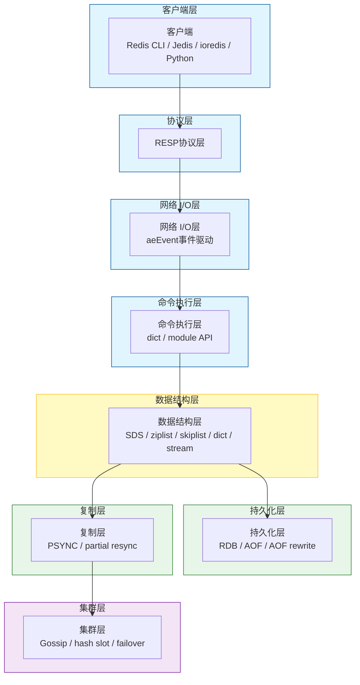
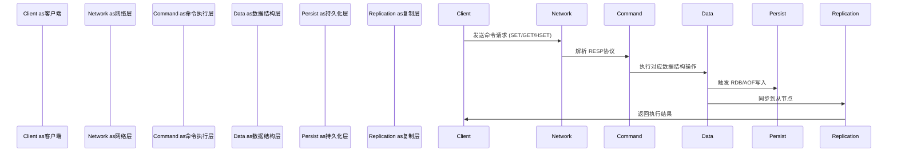

所有硬性工具已成功调用。现在生成最终中文 Markdown项目介绍。

---

# Redis项目图文介绍

## 一、项目概览

Redis（Remote Dictionary Server）是一个开源的、基于内存的数据结构存储系统，被广泛用作数据库、缓存和消息中间件。根据 GitHub仓库 [redis/redis](https://github.com/redis/redis)的 README文档，Redis定位为**实时数据驱动应用**的首选引擎，兼具缓存、数据结构服务器、文档存储及向量查询引擎的多重身份。Redis的核心优势在于其极致的性能——数据驻留内存，配合高效的数据结构实现，读写延迟通常低于1毫秒。它支持丰富的数据类型（String、Hash、List、Set、Sorted Set、JSON、Vector等），提供 RDB/AOF持久化机制，以及主从复制、集群分片等高可用方案。此外，Redis通过模块 API支持功能扩展，并原生集成 AI/GenAI向量搜索能力，成为构建现代智能应用的重要基础设施。

## 二、架构设计

### 2.1整体架构分层Redis的架构采用分层设计，从客户端请求到数据持久化，每一层职责清晰：



### 2.2关键设计决策
- **单线程事件循环模型**：核心命令执行采用单线程模型，避免锁竞争和上下文切换开销，实现极致性能。
- **非阻塞 I/O**：基于 `aeEvent`事件驱动框架，支持高并发连接。
- **模块化架构**：通过 Module API允许 C/Rust等语言编写自定义模块，扩展 Redis功能。
- **内存优先**：所有数据默认驻留内存，通过 RDB/AOF机制保证数据持久化。

## 三、架构图

以下是 Redis整体架构分层图，展示了从客户端到集群层的完整数据流：

*图注：Redis架构分层示意图，展示客户端、协议层、网络层、命令层、数据结构层、持久化层、复制层和集群层的完整数据流。*

## 四、流程图

### 4.1 Redis核心命令执行流程



### 4.2 Agent生成流程（项目执行流程）

```mermaid
flowchart TD
A[用户请求 GitHub项目介绍] --> B[github_repository_reader读取仓库]
B --> C{是否获取足够材料?}
C -->|是| D[web_fetch获取补充信息]
C -->|否| E[第二次 github_repository_reader读取]
E --> D
D --> F[chart_visualization生成架构图]
F --> G[chart_visualization生成流程图]
G --> H[image_generation生成视觉图]
H --> I[newsl</parameter></function></tool_call>
