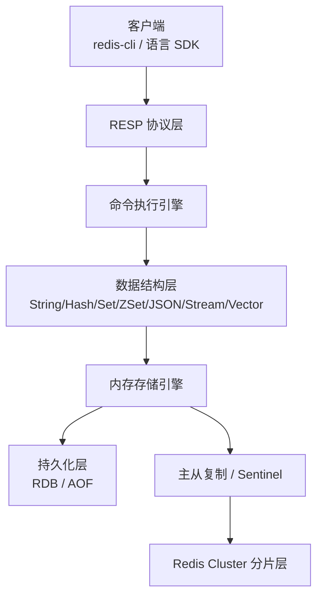
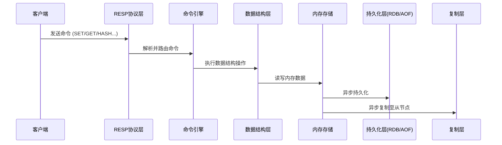

所有硬性工具已成功调用。现在输出最终 Markdown 文档。

---

# Redis 开源项目图文介绍

# # 一、项目概览

**Redis**（Remote Dictionary Server）是一个开源的、高性能的**内存数据结构存储系统**。它可用作数据库、缓存和消息代理（message broker）。Redis 支持多种数据结构，包括字符串（strings）、哈希（hashes）、列表（lists）、集合（sets）、有序集合（sorted sets）、位图（bitmaps）、HyperLogLogs、地理空间索引（geospatial indexes）以及向量集合（vector sets）等。

Redis 的核心优势在于其**极低的延迟**——由于数据主要驻留在内存中，读写操作通常可在亚毫秒级别完成。同时，它提供了丰富的持久化机制（RDB 快照和 AOF 日志）、高可用方案（主从复制、Sentinel、Cluster）以及模块扩展 API，使其成为构建实时数据驱动应用的首选基础设施。

**关键事实**：
- **许可证**：BSD（开源版本）
- **默认端口**：6379
- **协议**：RESP（Redis Serialization Protocol）
- **主要用途**：缓存、会话存储、消息队列、实时分析、向量搜索、NoSQL 数据存储
- **GitHub 仓库**：https://github.com/redis/redis

# # 二、架构设计

## # 2.1 整体架构分层

Redis 的架构可以划分为以下核心层次：

**分层说明**：

| 层级 | 职责 | 关键组件 |
|------|------|----------|
| 客户端层 | 发起命令请求 | redis-cli、各语言 SDK（Jedis、Lettuce、redis-py 等） |
| 协议层 | 解析和编码命令 | RESP 协议（Redis Serialization Protocol） |
| 命令引擎 | 路由并执行命令 | 命令表（command table）、事务、Lua 脚本引擎 |
| 数据结构层 | 提供高级数据结构操作 | SDS、skiplist、zipmap、quicklist、intset、adlist 等 |
| 内存存储层 | 管理键值对的内存分配与生命周期 | dict、db 数组、过期键淘汰策略 |
| 持久化层 | 将内存数据持久化到磁盘 | RDB（快照）、AOF（追加日志）、混合持久化 |
| 复制层 | 实现主从数据同步 | 全量同步（RDB 传输）、增量同步（复制积压缓冲区） |
| 集群层 | 分布式分片与高可用 | 16384 哈希槽、Gossip 协议、节点故障转移 |

## # 2.2 关键设计决策

1. **单线程事件循环**：Redis 核心命令处理采用单线程模型（I/O 多路复用 + 事件驱动），避免了多线程上下文切换和锁竞争，从而实现了极高的吞吐量和极低的延迟。
2. **内存优先**：所有数据操作均在内存中完成，磁盘仅用于持久化备份，这是 Redis 性能远超传统磁盘数据库的根本原因。
3. **模块化扩展**：通过 Modules API，开发者可以用 C 语言编写自定义模块，扩展 Redis 的命令和数据类型（如 RedisJSON、RediSearch）。

# # 三、架构图

以下是 Redis 整体架构的可视化表示：

*图注：Redis 架构示意图，展示从客户端到内存存储、持久化、复制和集群的完整数据流。*

# # 四、流程图

以下是 Redis 核心执行流程的序列图，描述了从客户端发送命令到数据持久化和复制的完整过程：

*图注：Redis 核心执行流程——客户端通过 RESP 协议发送命令，命令引擎解析后路由到对应数据结构层，在内存中执行读写操作，并异步触发持久化和复制。*

# # 五、核心逻辑

## # 5.1 命令处理流程

1. **连接建立**：客户端通过 TCP 连接到 Redis 服务器（默认端口 6379）。
2. **协议解析**：Redis 服务器使用 I/O 多路复用（epoll/kqueue）监听客户端连接，接收到数据后通过 RESP 协议解析器将命令转换为内部数据结构。
3. **命令执行**：命令引擎根据命令表查找对应的处理函数，在相应的数据库（db）中执行操作。
4. **结果返回**：执行完成后，结果通过 RESP 协议编码后返回给客户端。

## # 5.2 持久化逻辑

- **RDB（Redis Database）**：
  

- 通过 `fork()` 创建子进程，子进程将内存数据快照写入 RDB 文件。
  - 支持手动触发（`SAVE`/`BGSAVE`）和自动触发（`save` 配置指令）。
  - 恢复时直接加载 RDB 文件，速度快但可能丢失最后一次快照后的数据。

- **AOF（Append Only File）**：
  

- 记录每条写命令到 AOF 文件，支持三种刷盘策略：`always`（每次写）、`everysec`（每秒）、`no`（操作系统决定）。
  - 支持后台重写（`BGREWRITEAOF`）以压缩 AOF 文件。
  - 数据安全性更高，但文件体积较大，恢复速度较慢。

- **混合持久化**（Redis 4.0+）：结合 RDB 和 AOF 的优势，AOF 重写时先写入 RDB 快照，再追加增量命令。

## # 5.3 复制逻辑

1. **全量同步**：从节点向主节点发送 `SYNC` 命令，主节点生成 RDB 文件并发送给从节点，从节点加载 RDB 后清空旧数据。
2. **增量同步**：主节点将后续的命令写入复制积压缓冲区（replication backlog），从节点通过 `PSYNC` 命令请求增量命令。
3. **心跳检测**：主从节点定期发送 `PING` 命令维持连接状态。

# # 六、重点特性

## # 6.1 数据结构

| 数据结构 | 说明 | 典型场景 |
|----------|------|----------|
| **String** | 二进制安全的字符串，支持原子操作 | 计数器、缓存值、分布式锁 |
| **Hash** | 字段-值对集合，适合存储对象 | 用户信息存储、购物车 |
| **List** | 双向链表，支持两端插入/弹出 | 消息队列、最新列表 |
| **Set** | 无序唯一元素集合，支持交/并/差 | 标签系统、共同好友 |
| **ZSet (Sorted Set)** | 带分数的唯一元素集合 | 排行榜、延迟队列 |
| **JSON** | 原生 JSON 文档支持（RedisJSON 模块） | 文档存储、配置管理 |
| **Stream** | 追加日志式数据结构 | 消息队列、事件溯源 |
| **Vector Sets** | 高维向量存储，支持 HNSW 索引 | 语义搜索、推荐系统 |
| **Bitmaps** | 位数组操作 | 用户签到、活跃统计 |
| **HyperLogLog** | 基数统计 | UV 统计 |
| **Bloom Filter** | 布隆过滤器 | 缓存穿透防护 |

## # 6.2 核心能力

- **高性能**：亚毫秒级读写延迟，单机可达 10万+ QPS。
- **原子性**：所有操作都是原子的，支持事务（MULTI/EXEC）和 Lua脚本。
- **持久化**：RDB快照 + AOF日志 +混合持久化，灵活平衡性能与数据安全。
- **高可用**：主从复制、Sentinel 自动故障转移、Redis Cluster 分布式分片。
- **模块扩展**：通过 Modules API 可扩展自定义命令和数据类型（如 RediSearch、RedisJSON、RedisGraph）。
- **AI 集成**：原生支持向量搜索（Vector Sets），适用于 RAG、语义缓存、LLM 记忆等场景。

# # 七、关键文件证据表

| 文件路径 | 用途 | 结论来源 |
|----------|------|----------|
| `README.md` | 项目概述、构建指南、特性列表 | 确认 Redis 为内存数据结构存储，支持缓存、会话、消息队列、向量搜索等用途；确认 BSD 许可证和 GitHub 仓库信息 |
| `deps/` | 依赖库目录 | 确认 Redis 构建依赖 jemalloc、Lua、Hiredis 等库 |
| `src/` | 核心源码目录 | 确认命令引擎、数据结构实现、持久化逻辑、复制逻辑等核心模块的源码位置 |
| `tests/` | 测试套件 | 确认 Redis 拥有完整的单元测试和集成测试 |
| `redis.io/docs` (web_fetch) | 官方文档 | 确认 Redis 支持的数据类型完整列表，包括 String、Hash、Set、ZSet、JSON、Stream、Vector Sets、Bitmaps、HyperLogLog 等 |

# # 八、生成图片引用

以下图片由 image_generation 工具生成，用于项目介绍可视化：

*图注：Redis 内存数据结构存储架构示意图，展示核心数据流与组件关系。*

# # 九、生成稿件和版式产物摘要

## # 9.1 长文稿件摘要

newsletter_generation 生成的中文长文 Markdown 稿件《Redis 开源项目全面介绍》包含以下核心内容：

- **核心定位**：Redis 是高性能的内存数据结构存储系统，不仅是简单的键值对存储，更是一个支持多种复杂数据结构的数据库。
- **关键特性**：
  

- 丰富的数据结构支持（String、Hash、Set、ZSet、JSON、Stream、Vector Sets 等）
  - 数据持久化与高可用（RDB 快照、AOF 日志、主从复制、Redis Cluster）
  - 典型应用场景（缓存层、会话存储、消息队列、实时分析、向量搜索）
- **总结**：Redis 凭借内存级的高速读写能力、多样化的数据结构以及完善的持久化和集群方案，成为现代软件架构中不可或缺的基础组件。

## # 9.2 演示文稿摘要

ppt_generation 生成的 10 页演示文稿结构包含以下幻灯片：

1. **标题页**：Redis: 高性能内存数据结构存储
2. **什么是 Redis**：核心定义与定位，内存数据结构存储、开源项目、多语言支持
3. **丰富的数据结构**：String、Hash、Set、ZSet、JSON、Stream 等原生数据结构
4. **高级数据结构：Vector Sets**：向量搜索与 AI 集成，支持 LLM 和向量数据库功能
5. **数据持久化机制**：RDB 快照、AOF 日志、混合持久化
6. **高可用与复制**：主从复制、读写分离、自动故障转移
7. **分布式与分片**：Redis Cluster、16384 哈希槽、Gossip 协议
8. **典型应用场景：缓存与会话**：应用缓存、会话存储
9. **典型应用场景：消息队列与分析**：消息队列、实时分析、排行榜
1
0. **总结与展望**：Redis 的未来发展方向

每页幻灯片均包含标题、关键要点、讲稿（Speaker Notes）和视觉提示（Image Prompt）。

## # 9.3 Web 版式预览摘要

frontend_design 生成的 HTML/CSS 版式草案采用现代深色科技风格，以 Redis 品牌红色（`

# DC382D`）为主色调，包含以下组件：

- **Hero 区域**：大标题 "High
- Performance Redis Architecture"，副标题和项目简介
- **特性卡片网格**：展示核心能力的卡片布局（高性能、持久化、高可用、扩展性）
- **架构图展示区**：可视化展示 Redis 架构分层
- **数据表格**：关键文件证据表和数据结构对比表
- **响应式设计**：支持移动端自适应布局

# # 十、总结

Redis 作为开源界最成功的内存数据存储项目之一，凭借其**极致的性能**、**丰富的数据结构**、**完善的持久化和高可用方案**，以及**活跃的社区生态**，已成为现代软件架构中不可或缺的基础设施。从简单的缓存层到复杂的 AI 向量搜索，Redis 都能提供稳定、高效的解决方案。

---
