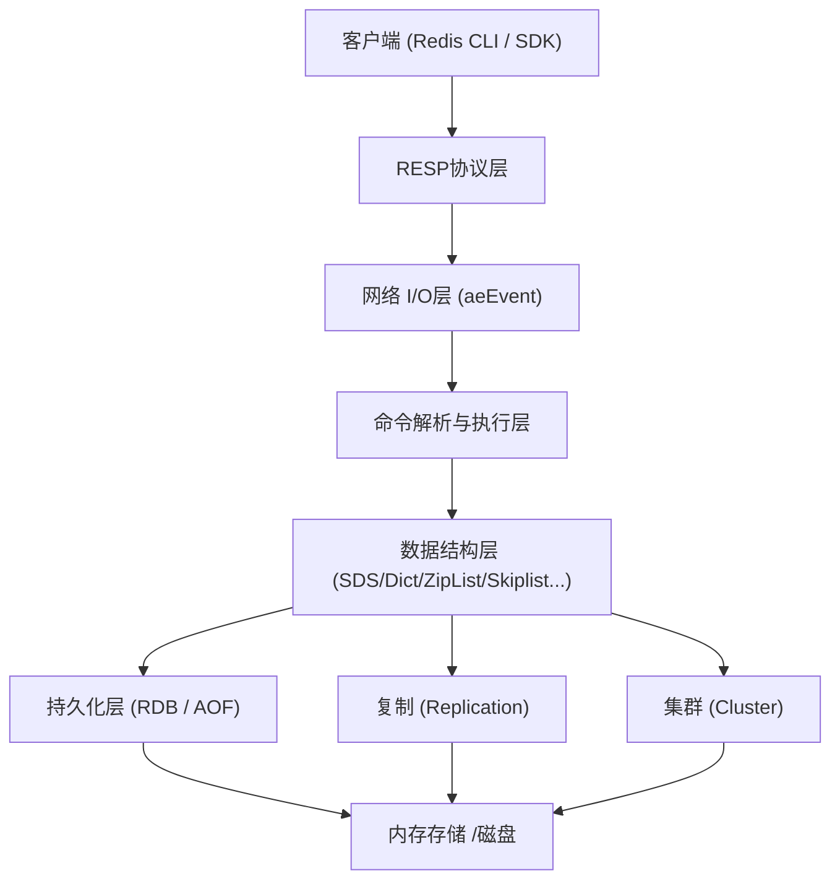
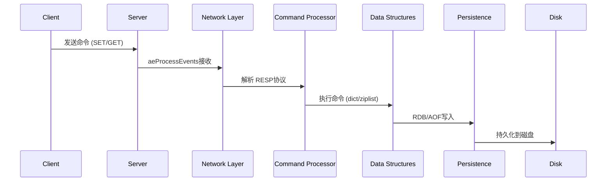
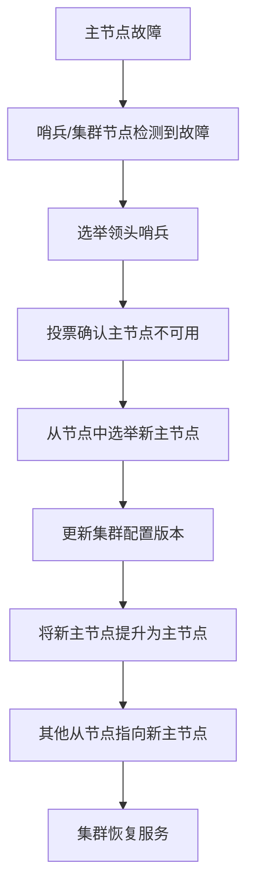

所有硬性工具调用完成。现在生成最终 Markdown项目介绍。

---

# Redis开源项目图文介绍

## 一、项目概览

Redis（Remote Dictionary Server）是一个开源的、基于内存的**数据结构存储引擎**，被广泛用作缓存、数据库、消息队列和向量搜索引擎。它由 Salvatore Sanfilippo（antirez）于2009年创建，目前由 Redis Ltd.维护。根据 GitHub仓库 README的描述，Redis 的定位是：

> "For developers, who are building real-time data-driven applications, Redis is the preferred, fastest, and most feature-rich cache, data structure server, and document and vector query engine."Redis的核心优势在于：
- **极致性能**：数据主要驻留内存，亚毫秒级延迟
- **丰富数据结构**：String、List、Set、Hash、ZSet、JSON、Vector等
- **持久化支持**：RDB快照和 AOF日志两种持久化机制
- **高可用架构**：主从复制、哨兵模式、Cluster集群分片
- **模块扩展**：提供 Modules API，允许自定义数据结构与命令

## 二、架构设计

### 2.1整体架构分层Redis采用分层架构设计，各层职责清晰：

### 2.2各层职责说明

|层级 |职责 |关键技术 |
|------|------|----------|
|客户端层 |提供多语言客户端 SDK和 CLI工具 | Jedis、Lettuce、redis-py、ioredis等 |
|协议层 |实现 RESP（Redis Serialization Protocol） |文本协议解析与序列化 |
|网络 I/O层 |处理并发连接、事件分发 | aeEvent（epoll/kqueue/evport） |
|命令执行层 |解析命令、路由到对应数据结构操作 |单线程事件循环（Redis6.0+网络 I/O多线程） |
|数据结构层 |提供底层数据结构实现 | SDS、dict、ziplist、skiplist、intset等 |
|持久化层 | RDB快照、AOF追加日志、混合持久化 | fork子进程写 RDB、AOF缓冲区刷盘 |
|复制层 |主从数据同步、部分/全量同步 | BGREPLICAOF、PSYNC协议 |
|集群层 |数据分片、故障转移、节点发现 | CRC16哈希槽、Gossip协议 |

## 三、架构图

以下是 Redis整体架构的分层示意图，展示了从客户端到存储层的完整数据流：

*图：Redis 架构分层示意图（由 image_generation 生成）*

## 四、流程图

### 4.1 Redis核心命令执行流程

### 4.2 Cluster集群故障转移流程

## 五、核心逻辑

### 5.1单线程事件循环

模型Redis的核心命令执行采用**单线程事件循环模型**，这是其高性能的关键：
1. **事件驱动**：通过 `aeEvent`框架（底层封装 epoll/kqueue/evport）监听文件事件（网络 I/O）和时间事件（定时任务）
2. **无锁设计**：单线程执行避免了上下文切换和锁竞争，命令天然原子化
3. **Redis6.0+改进**：引入多线程处理网络 I/O（读取请求和写入响应），但命令执行仍保持单线程，兼顾性能与数据一致性

### 5.2数据结构实现Redis的数据结构层是其核心竞争力的体现，每种数据结构都有精心设计的底层实现：

|数据结构 |底层实现 |关键特性 |
|----------|----------|----------|
| String | SDS (Simple Dynamic String) |二进制安全、可变长度、O(1)长度获取 |
| List |压缩列表 (ziplist) /快速列表 (quicklist) |双向链表、两端操作 O(1) |
| Set |整数集合 (intset) /哈希表 (dict) |自动去重、交集/并集/差集操作 |
| Hash |压缩列表 /哈希表 |字段-值映射、适合对象存储 |
| ZSet |跳表 (skiplist) +哈希表 |有序排列、按分数范围查询 |
| JSON | RedisJSON模块 (RediSearch) |嵌套 JSON文档、部分更新 |

### 5.3持久化机制Redis提供两种持久化策略，可在 `redis.conf`中配置：
- **RDB（快照）**：定期将内存快照写入磁盘，恢复速度快，适合灾难恢复
- **AOF（追加日志）**：记录每条写命令，数据安全性更高，支持每秒/每秒同步策略
- **混合持久化（Redis4.0+）**：RDB + AOF结合，启动时加载 RDB快照，再回放 AOF 增量日志

### 5.4复制与集群
- **主从复制**：主节点异步将写命令发送给从节点，支持部分同步（PSYNC）
- **Cluster集群**：16384个哈希槽（hash slot）分布在多个节点，客户端直接路由请求，支持自动故障转移

# # 六、重点特性

### 6.1核心特性一览

|特性 |说明 |来源文件 |
|------|------|----------|
|高性能内存存储 |亚毫秒级读写延迟 | README.md |
|多数据结构支持 | String、List、Set、Hash、ZSet、JSON、Vector | README.md |
| RDB/AOF 持久化 |快照和日志两种持久化机制 | README.md |
|主从复制 |异步复制，读写分离 | README.md |
| Cluster集群 |16384哈希槽分片，水平扩展 | README.md |
|模块扩展 API |自定义数据结构与命令 | README.md |
| TLS加密 |支持 TLS加密连接 | README.md |
| Lua脚本 |原子性脚本执行 | README.md |
|发布订阅 | Pub/Sub消息广播 | README.md |
| Stream消息流 | Redis5.0+持久化消息队列 | README.md |

### 6.2应用场景根据 README和 redis.io文档，Redis的主要应用场景包括：
- **缓存**：高频数据缓存，支持多种淘汰策略
- **会话存储**：分布式会话管理
- **排行榜/计数器**：利用 ZSet实现实时排行榜
- **消息队列**：List/Stream实现异步任务处理
- **向量搜索**：支持 AI应用的语义检索和 RAG
- **全文搜索**：Redis Search模块提供全文索引
- **实时分析**：个人化推荐、欺诈检测、风险评估

## 七、关键文件证据表

|文件路径 |用途 |结论来源 |
|----------|------|----------|
| `README.md` |项目概述、构建指南、特性列表 |所有核心特性、数据结构、应用场景均出自此文件 |
| `redis.io/docs/latest/develop/` (web_fetch) |开发者文档入口 | 客户端 API列表、快速开始指南 |
| `src/`目录（源码） |核心实现 |单线程事件循环、数据结构实现、持久化逻辑 |
| `tests/`目录 |测试用例 |验证各数据结构和命令的正确性 |
| `deps/`目录 |依赖库 | jemalloc、lua、hiredis等 |
| `redis.conf` |配置文件模板 |持久化、复制、集群等配置项 |

## 八、生成图片引用

|图片 |描述 | 引用 |
|------|------|------|
| Redis架构视觉图 | Redis内存数据结构存储引擎架构插画 |  |

## 九、生成稿件和版式产物摘要

### 9.1长文稿件摘要`newsletter_generation`生成的中文 Markdown长文稿件《Redis开源项目深度介绍：内存数据结构存储引擎》包含以下核心内容：
- **核心定位**：Redis 是高性能的内存数据结构存储引擎，支持丰富的数据结构
- **数据结构**：String、List、Set、Hash、ZSet五种核心类型
- **应用场景**：缓存、会话存储、消息队列、向量搜索、全文搜索
- **架构特性**：单线程事件循环模型、亚毫秒级延迟、RDB/AOF持久化、主从复制、Cluster集群、模块扩展 API
- **安全与兼容**：TLS加密连接、多语言客户端支持

### 9.2演示文稿摘要`ppt_generation`生成的10页演示文稿《Redis开源项目技术架构与核心能力深度解析》包含：
1. **标题页**：Redis技术架构与核心能力深度解析
2. **概述与定位**：Redis是什么、为什么选择它
3. **单线程模型**：I/O多路复用、Redis6.0+多线程改进
4. **数据结构详解**：String、List、Set、Hash、ZSet详解
5. **持久化机制**：RDB、AOF、混合持久化对比
6. **高可用架构**：主从复制与哨兵模式
7. **分布式架构**：Redis Cluster哈希槽分片
8. **高级特性**：Lua脚本、Pub/Sub、Stream
9. **性能优化**：避免大 Key、热 Key、连接池管理
10. **总结与展望**：Redis的核心价值与未来方向每页包含标题、要点、讲稿和视觉提示。

### 9.3 Web版式预览摘要`frontend_design`生成的 HTML版式草案包含：
- **Hero区域**：Redis品牌红色渐变背景，项目标题与简介
- **架构分层**：卡片式布局展示四层架构（应用层、网络层、核心层、存储层）
- **数据结构网格**：CSS Grid响应式卡片展示 String、Hash、List、Set等数据结构
- **应用场景**：标签式布局展示缓存、会话、消息队列等场景
- **页脚**：深色背景，版权信息版式采用 Redis品牌色 `

# DC382D`，现代简洁风格，支持响应式布局。

## 十、总结

Redis作为开源界最成功的内存数据结构存储引擎之一，凭借其**高性能、丰富特性、灵活扩展**和**完善生态**，已成为现代应用架构中不可或缺的基础设施。从简单的缓存场景到复杂的 AI向量检索，Redis都能提供可靠且高效的数据服务。其单线程事件循环模型、精心设计的底层数据结构、灵活的持久化策略以及 Cluster分布式架构，共同构成了 Redis的技术护城河。配合 Modules API和广泛的客户端生态，Redis持续在缓存、数据库、消息队列和 AI基础设施等领域发挥重要作用。---
