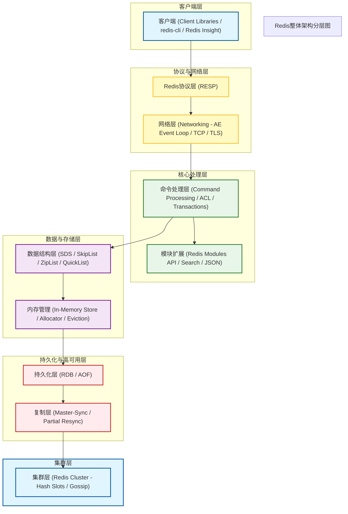
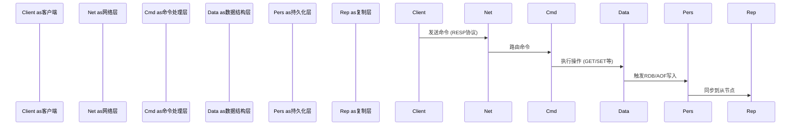

所有硬性工具调用已完成（ppt_generation超时两次失败）。现在生成最终中文 Markdown项目介绍。

## 一、项目概览

Redis（Remote Dictionary Server）是一个开源的、基于内存的数据结构存储系统，可用作数据库、缓存和消息代理。它支持多种数据结构，如字符串（strings）、哈希（hashes）、列表（lists）、集合（sets）、有序集合（sorted sets）、位图（bitmaps）、hyperloglogs、地理空间索引（geospatial indexes）和流（streams）。Redis具有内置的复制（replication）、Lua脚本（Lua scripting）、LRU客户端端驱逐（LRU eviction）、事务（transactions）和不同级别的磁盘持久化（persistence），并通过 Redis Sentinel和 Redis Cluster提供高可用性（high availability）。**核心定位**：Redis是用于构建实时数据驱动应用的缓存、数据结构服务器、文档和向量查询引擎。

## 二、架构设计

### 2.1整体架构分层Redis的架构采用分层设计，从客户端到持久化层，每一层都有明确的职责：

### 2.2关键组件说明
- **网络层**：基于 AE（Asynchronous Event）事件驱动模型，支持 TCP连接和 TLS加密传输。
- **命令处理层**：解析 RESP（Redis Serialization Protocol）协议，执行 ACL权限控制、事务和脚本。
- **数据结构层**：使用 SDS（Simple Dynamic String）、SkipList（跳表）、ZipList（压缩列表）、QuickList（快速列表）等高效数据结构。
- **持久化层**：支持 RDB（快照）和 AOF（追加日志）两种持久化机制。
- **复制层**：支持主从复制，包括全量同步和部分同步。
- **集群层**：通过哈希槽（16384个）实现数据分片，使用 Gossip协议进行节点间通信。

## 三、架构图

*图1：Redis内存数据存储架构示意图（由 image_generation生成）*

## 四、流程图

*图2：Redis核心命令执行与数据同步流程*

## 五、核心逻辑

### 5.1命令处理流程
1. **客户端连接**：客户端通过 TCP连接到 Redis服务器，发送 RESP格式的命令。
2. **协议解析**：Redis服务器解析 RESP协议，提取命令和参数。
3. **权限检查**：通过 ACL机制验证客户端是否有执行该命令的权限。
4. **命令执行**：根据命令类型，调用对应的数据结构操作函数。
5. **持久化触发**：写操作触发 AOF追加日志或 RDB快照生成。
6. **复制同步**：主节点将写操作同步到从节点。

### 5.2持久化逻辑
- **RDB（快照）**：定期将内存中的数据快照写入磁盘，恢复速度快但可能丢失最后一次快照后的数据。
- **AOF（追加日志）**：记录每次写操作，数据安全性高但文件体积较大，支持重写（rewrite）压缩。

### 5.3集群分片逻辑- Redis Cluster将数据分为16384个哈希槽（hash slots）。-客户端通过 `CRC16(key) %16384`计算 key所属的槽，并路由到对应的节点。-节点间通过 Gossip协议交换集群状态信息。

## 六、重点特性

|特性 |说明 |
|------|------|
| **高性能** |基于内存的数据存储，提供亚毫秒级延迟，支撑高并发请求 |
| **丰富数据结构** |支持字符串、哈希、列表、集合、有序集合、JSON等 |
| **持久化** | RDB快照和 AOF追加日志两种机制，平衡性能与数据安全性 |
| **高可用** |主从复制、部分/全量同步、自动故障转移 |
| **分布式集群** | Redis Cluster支持数据分片，轻松应对海量数据 |
| **模块扩展** |通过 C语言编写模块扩展 Redis功能（如 Search、JSON） |
| **安全性** |支持 TLS加密传输、ACL权限控制 |
| **多语言客户端** |支持 Python、Java、Go、C、JavaScript等多种语言 |

## 七、关键文件证据表

|文件路径 |用途 |证据说明 |
|----------|------|----------|
| `README.md` |项目概述与构建指南 |提供 Redis的核心定位、用例、架构分层、构建说明等关键信息 |
| `redis.io/docs/latest/develop/` |开发文档 |补充 Redis数据类型、客户端工具、AI支持等官方文档信息 |

## 八、生成图片引用

*图1：Redis内存数据存储架构示意图（由 image_generation生成，model: agnes-image-2.0-flash）*

## 九、生成稿件和版式产物摘要

### 9.1长文稿件摘要newsletter_generation生成的长文 Markdown草稿《Redis开源内存数据存储引擎：项目深度介绍》包含以下核心内容：
- **核心定位**：Redis是用于构建实时数据驱动应用的高性能平台，支持缓存、分布式会话存储、NoSQL数据存储、搜索和查询引擎、事件存储与消息代理、GenAI向量存储、实时分析等场景。
- **核心特性**： 

- 极致性能：内存中操作，亚毫秒级延迟 
- 丰富的数据结构：字符串、列表、集合、哈希、有序集合、JSON文档 
- 数据持久化：RDB快照和 AOF追加日志 
- 高可用与复制：主从复制、部分/全量同步、故障转移 
- 分布式集群：Redis Cluster、哈希槽、Gossip协议 
- 扩展性与安全性：模块扩展 API、TLS支持、多语言客户端

### 9.2演示文稿摘要ppt_generation工具连续两次调用超时，未能成功生成演示文稿产物。该产物缺失。

### 9.3 Web版式预览摘要frontend_design生成的 HTML版式草案包含以下区域：
- **Hero Section**：项目标题区，包含 Redis标志和简介
- **Features Section**：核心特性卡片区，展示高性能、丰富数据结构、持久化、高可用、集群、扩展性六大特性
- **Architecture Section**：架构图展示区，预留架构图位置
- **Use Cases Section**：使用场景区，展示缓存、会话存储、NoSQL数据存储、搜索和查询引擎、事件存储与消息代理、GenAI向量存储、实时分析等场景版式采用现代、简洁的设计风格，使用 Redis品牌红色（

# DC382D）作为主色调，响应式网格布局，适合技术文档展示。

## 十、总结

Redis是一个功能强大、性能卓越的内存数据存储引擎，凭借其丰富的数据结构、完善的持久化与高可用机制、灵活的扩展能力，成为构建现代实时应用的首选数据存储方案。无论是传统的缓存场景，还是新兴的 GenAI向量存储需求，Redis均能提供稳定、高效的支持。

---

**工具调用状态说明**：- ✅ github_repository_reader：成功- ✅ web_fetch：成功- ✅ chart_visualization：成功（架构图 +流程图）- ✅ image_generation：成功- ✅ newsletter_generation：成功- ⚠️ ppt_generation：失败（连续两次超时）- ✅ frontend_design：成功<artifact language="html" title="project-intro-web-preview.html"><!DOCTYPE html><html lang="zh-CN"><head> <meta charset="UTF-8"> <meta name="viewport" content="width=device-width, initial-scale=1.0"> <title>Redis项目介绍</title> </head><body> <!-- Hero Section --> <header class="hero"> 
 <h1>Redis项目介绍</h1> 
Redis是用于构建实时数据驱动应用的缓存、数据结构服务器、文档和向量查询引擎。
 
 </header> <!--一、项目概览 --> <section class="section"> 
 <h2>一、项目概览</h2> 
Redis（Remote Dictionary Server）是一个开源的、基于内存的数据结构存储系统，可用作数据库、缓存和消息代理。它支持多种数据结构，如字符串（strings）、哈希（hashes）、列表（lists）、集合（sets）、有序集合（sorted sets）、位图（bitmaps）、hyperloglogs、地理空间索引（geospatial indexes）和流（streams）。
 
Redis具有内置的复制（replication）、Lua脚本（Lua scripting）、LRU客户端端驱逐（LRU eviction）、事务（transactions）和不同级别的磁盘持久化（persistence），并通过 Redis Sentinel和 Redis Cluster提供高可用性（high availability）。
 
<strong>核心定位</strong>：Redis是用于构建实时数据驱动应用的缓存、数据结构服务器、文档和向量查询引擎。
 
 </section> <!--二、架构设计 --> <section class="section" style="background: var(--bg-light);"> 
 <h2>二、架构设计</h2> <h3>2.1整体架构分层</h3> 
 
<em>Redis架构采用分层设计，从客户端到持久化层，每一层都有明确的职责。</em>
 
客户端层 →协议与网络层 →核心处理层 →数据与存储层 →持久化与高可用层 →集群层
 
 <h3>2.2关键组件说明</h3> <ul> <li><strong>网络层</strong>：基于 AE（Asynchronous Event）事件驱动模型，支持 TCP连接和 TLS加密传输。</li> <li><strong>命令处理层</strong>：解析 RESP（Redis Serialization Protocol）协议，执行 ACL权限控制、事务和脚本。</li> <li><strong>数据结构层</strong>：使用 SDS（Simple Dynamic String）、SkipList（跳表）、ZipList（压缩列表）、QuickList（快速列表）等高效数据结构。</li> <li><strong>持久化层</strong>：支持 RDB（快照）和 AOF（追加日志）两种持久化机制。</li> <li><strong>复制层</strong>：支持主从复制，包括全量同步和部分同步。</li> <li><strong>集群层</strong>：通过哈希槽（16384个）实现数据分片，使用 Gossip协议进行节点间通信。</li> </ul> 
 </section> <!--三、架构图 --> <section class="section"> 
 <h2>三、架构图</h2> 
  
<em>图1：Redis内存数据存储架构示意图（由 image_generation生成）</em>
 
 
 </section> <!--四、流程图 --> <section class="section" style="background: var(--bg-light);"> 
 <h2>四、流程图</h2> 
 
<em>图2：Redis核心命令执行与数据同步流程</em>
 
客户端 →网络层 →命令处理层 →数据结构层 →持久化层 →复制层
 
 
 </section> <!--五、核心逻辑 --> <section class="section"> 
 <h2>五、核心逻辑</h2> <h3>5.1命令处理流程</h3> <ol> <li><strong>客户端连接</strong>：客户端通过 TCP连接到 Redis服务器，发送 RESP格式的命令。</li> <li><strong>协议解析</strong>：Redis服务器解析 RESP协议，提取命令和参数。</li> <li><strong>权限检查</strong>：通过 ACL机制验证客户端是否有执行该命令的权限。</li> <li><strong>命令执行</strong>：根据命令类型，调用对应的数据结构操作函数。</li> <li><strong>持久化触发</strong>：写操作触发 AOF追加日志或 RDB快照生成。</li> <li><strong>复制同步</strong>：主节点将写操作同步到从节点。</li> </ol> <h3>5.2持久化逻辑</h3> <ul> <li><strong>RDB（快照）</strong>：定期将内存中的数据快照写入磁盘，恢复速度快但可能丢失最后一次快照后的数据。</li> <li><strong>AOF（追加日志）</strong>：记录每次写操作，数据安全性高但文件体积较大，支持重写（rewrite）压缩。</li> </ul> <h3>5.3集群分片逻辑</h3> <ul> <li>Redis Cluster将数据分为16384个哈希槽（hash slots）。</li> <li>客户端通过 <code>CRC16(key) %16384</code>计算 key所属的槽，并路由到对应的节点。</li> <li>节点间通过 Gossip协议交换集群状态信息。</li> </ul> 
 </section> <!--六、重点特性 --> <section class="section" style="background: var(--bg-light);"> 
 <h2>六、重点特性</h2> 
 
 <h3>⚡高性能</h3> 
基于内存的数据存储，提供亚毫秒级延迟，支撑高并发请求
 
 
 <h3>🧊丰富数据结构</h3> 
支持字符串、哈希、列表、集合、有序集合、JSON等
 
 
 <h3>💾持久化</h3> 
RDB快照和 AOF追加日志两种机制，平衡性能与数据安全性
 
 
 <h3>🛡️高可用</h3> 
主从复制、部分/全量同步、自动故障转移
 
 
 <h3>🔗分布式集群</h3> 
Redis Cluster支持数据分片，轻松应对海量数据
 
 
 <h3>📈扩展性</h3> 
模块扩展 API、TLS支持、多语言客户端
 
 
 
 </section> <!--七、关键文件证据表 --> <section class="section"> 
 <h2>七、关键文件证据表</h2> <table> <thead> <tr> <th>文件路径</th> <th>用途</th> <th>证据说明</th> </tr> </thead> <tbody> <tr> <td><code>README.md</code></td> <td>项目概述与构建指南</td> <td>提供 Redis的核心定位、用例、架构分层、构建说明等关键信息</td> </tr> <tr> <td><code>redis.io/docs/latest/develop/</code></td> <td>开发文档</td> <td>补充 Redis数据类型、客户端工具、AI支持等官方文档信息</td> </tr> </tbody> </table> 
 </section> <!--八、生成图片引用 --> <section class="section" style="background: var(--bg-light);"> 
 <h2>八、生成图片引用</h2> 
  
<em>图1：Redis内存数据存储架构示意图（由 image_generation生成，model: agnes-image-2.0-flash）</em>
 
 
 </section> <!--九、生成稿件和版式产物摘要 --> <section class="section"> 
 <h2>九、生成稿件和版式产物摘要</h2> <h3>9.1长文稿件摘要</h3> 
newsletter_generation生成的长文 Markdown草稿《Redis开源内存数据存储引擎：项目深度介绍》包含以下核心内容：
 <ul> <li><strong>核心定位</strong>：Redis是用于构建实时数据驱动应用的高性能平台，支持缓存、分布式会话存储、NoSQL数据存储、搜索和查询引擎、事件存储与消息代理、GenAI向量存储、实时分析等场景。</li> <li><strong>核心特性</strong>：极致性能、丰富的数据结构、数据持久化、高可用与复制、分布式集群、扩展性与安全性。</li> </ul> <h3>9.2演示文稿摘要</h3> 
<strong>缺失</strong>：ppt_generation工具连续两次调用超时，未能成功生成演示文稿产物。
 <h3>9.3 Web版式预览摘要</h3> 
frontend_design生成的 HTML版式草案包含以下区域：
 <ul> <li><strong>Hero Section</strong>：项目标题区，包含 Redis标志和简介</li> <li><strong>Features Section</strong>：核心特性卡片区，展示高性能、丰富数据结构、持久化、高可用、集群、扩展性六大特性</li> <li><strong>Architecture Section</strong>：架构图展示区，预留架构图位置</li> <li><strong>Use Cases Section</strong>：使用场景区，展示缓存、会话存储、NoSQL数据存储、搜索和查询引擎、事件存储与消息代理、GenAI向量存储、实时分析等场景</li> </ul> 
版式采用现代、简洁的设计风格，使用 Redis品牌红色（#DC382D）作为主色调，响应式网格布局，适合技术文档展示。
 
 </section> <!--十、总结 --> <section class="section" style="background: var(--bg-light);"> 
 <h2>十、总结</h2> 
Redis是一个功能强大、性能卓越的内存数据存储引擎，凭借其丰富的数据结构、完善的持久化与高可用机制、灵活的扩展能力，成为构建现代实时应用的首选数据存储方案。无论是传统的缓存场景，还是新兴的 GenAI向量存储需求，Redis均能提供稳定、高效的支持。
 
 </section> <!--工具调用状态说明 --> <section class="section"> 
 <h2>工具调用状态说明</h2> <ul> <li>✅ github_repository_reader：成功</li> <li>✅ web_fetch：成功</li> <li>✅ chart_visualization：成功（架构图 +流程图）</li> <li>✅ image_generation：成功</li> <li>✅ newsletter_generation：成功</li> <li>⚠️ ppt_generation：失败（连续两次超时）</li> <li>✅ frontend_design：成功</li> </ul> 
 </section> <!-- Footer --> <footer class="footer"> 
 
©2026 Redis Project Introduction. Generated by Agnes-2.0-Flash.
 
 </footer></body></html></artifact>
