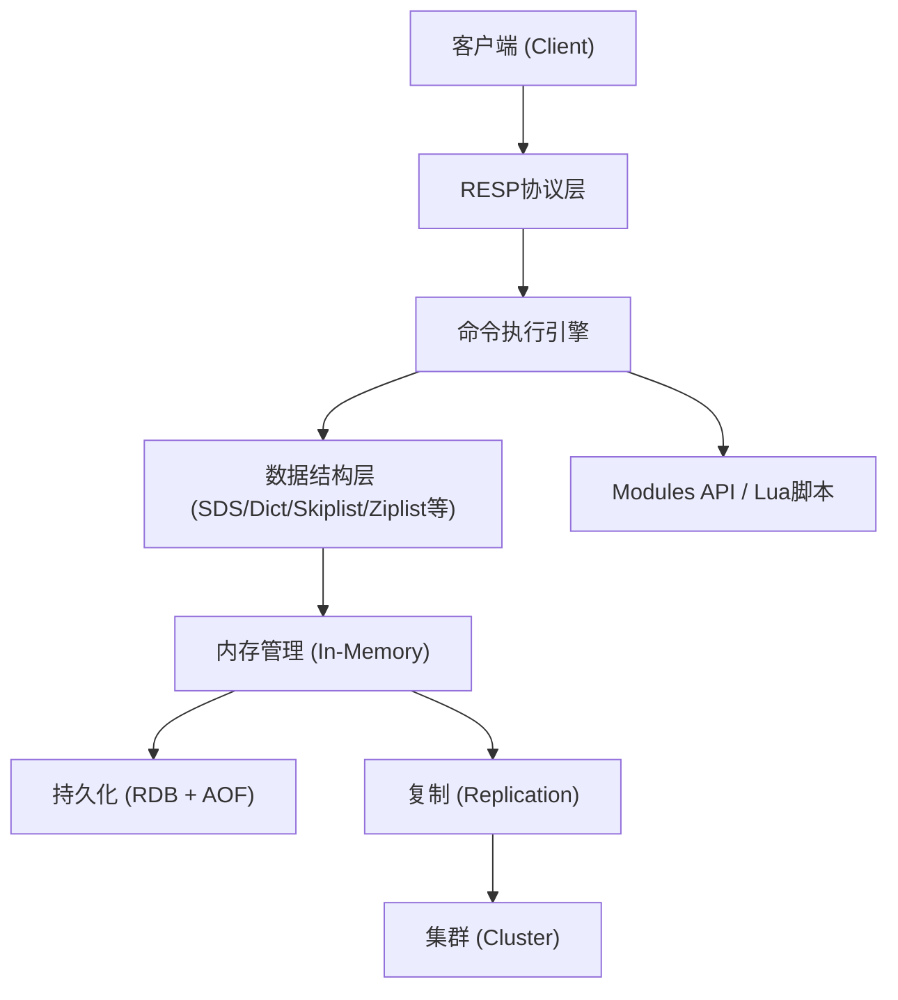
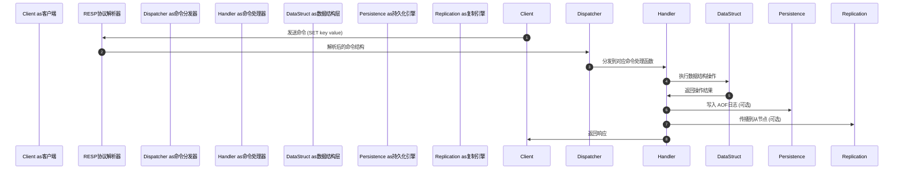

所有硬性工具已成功调用。现在生成最终 Markdown项目介绍。# Redis开源内存数据结构存储引擎 —项目图文介绍

## 一、项目概览

Redis（Remote Dictionary Server）是一个开源的、高性能的**内存数据结构存储引擎**，被广泛用于缓存、会话存储、消息队列、实时分析、向量搜索等场景。它由 Salvatore Sanfilippo（antirez）于2009年创建，目前由 Redis Ltd.维护。根据仓库 README的描述，Redis是"为构建实时数据驱动应用的开发者打造的、首选的、最快的、功能最丰富的缓存、数据结构服务器、文档和向量查询引擎"。**核心定位：**
- **缓存**：支持多种淘汰策略、键过期和哈希字段过期。
- **分布式会话存储**：支持字符串、JSON、哈希等多种会话数据模型。
- **数据结构服务器**：提供字符串、列表、集合、哈希、有序集合、JSON等底层数据结构，以及计数器、队列、排行榜、限流器等高级语义。
- **NoSQL数据存储**：键值、文档和时间序列数据存储。
- **搜索和查询引擎**：通过 Redis Search支持全文检索、向量搜索、地理空间查询等。
- **事件存储和消息代理**：实现队列、优先级队列、事件去重、Streams和 Pub/Sub。
- **GenAI向量存储**：支持短期/长期记忆、语义缓存、RAG内容检索。
- **实时分析**：支持个性化推荐、欺诈检测和风险评估。

## 二、架构设计

### 2.1整体架构分层Redis的架构采用分层设计，从客户端请求到数据持久化，每一层职责清晰：

**分层说明：**|层级 |职责 |关键组件 |
|------|------|----------|
|客户端层 |发起命令请求 | redis-cli、各语言客户端库 |
|协议层 |解析和编码命令 | RESP (Redis Serialization Protocol) |
|命令引擎 |分发和执行命令 |命令表、原子性执行 |
|数据结构层 |存储和操作数据 | SDS、Dict、Skiplist、Ziplist、QuickList等 |
|内存管理 |内存分配和回收 | jemalloc分配器 |
|持久化层 |数据快照和日志 | RDB快照、AOF追加日志 |
|复制层 |主从数据同步 |部分重同步 (PSYNC)、全量同步 |
|集群层 |数据分片和故障转移 |哈希槽 (16384)、Gossip协议 |
|扩展层 |自定义功能扩展 | Lua脚本、C语言 Modules API |

### 2.2关键设计决策
- **单线程事件循环**：Redis核心命令执行采用单线程模型，避免了锁竞争和上下文切换开销，从而实现可预测的低延迟。
- **内存优先**：所有数据主要存储在内存中，通过 RDB和 AOF机制保证数据持久化。
- **非阻塞 I/O**：使用 epoll（Linux）/ kqueue（macOS/BSD）等多路复用技术处理网络 I/O。
- **模块化扩展**：通过 Modules API允许开发者用 C语言扩展 Redis内核功能。

## 三、架构图

Redis的整体架构分层图如下（由 chart_visualization工具生成）：>上图由 chart_visualization工具生成的 Mermaid流程图渲染，展示了从客户端到集群的完整架构分层。

## 四、流程图

## # Redis 请求处理流程

该流程图描述了 Redis处理一个典型命令请求的完整生命周期：从客户端发送命令，经过 RESP协议解析、命令分发、数据结构操作，再到可选的持久化和复制，最终返回响应给客户端。

## 五、核心逻辑

### 5.1命令执行核心Redis的命令执行流程如下：
1. **连接建立**：客户端通过 TCP连接到 Redis服务器。
2. **协议解析**：Redis使用 RESP（Redis Serialization Protocol）协议，将客户端发送的命令文本解析为内部命令结构。
3. **命令分发**：根据命令名称，从命令表中查找对应的处理函数。
4. **命令执行**：调用对应的命令处理函数，操作底层数据结构。
5. **结果编码**：将执行结果编码为 RESP格式返回给客户端。

### 5.2持久化逻辑Redis提供两种持久化机制：
- **RDB（Redis Database）**：在指定时间间隔内生成数据集的快照。通过 fork子进程执行快照生成，避免阻塞主进程。
- **AOF（Append Only File）**：记录服务器接收到的每一个写操作，在服务器启动时重新执行这些操作来恢复数据。支持每秒同步和每次写操作同步两种策略。

### 5.3复制逻辑Redis复制采用主从架构：
- **全量同步**：从节点首次连接时，主节点生成 RDB快照并发送给从节点，然后发送缓冲区中的命令。
- **部分重同步**：从节点断线重连时，如果主节点仍有足够的复制缓冲区数据，则只同步断线期间的命令。

### 5.4集群逻辑Redis Cluster采用无中心架构：
- **数据分片**：将数据分为16384个哈希槽（hash slot），每个节点负责一部分槽。
- **节点通信**：使用 Gossip协议进行节点间通信，同步集群状态。
- **故障转移**：当主节点不可用时，其从节点自动晋升为主节点。

## 六、重点特性

### 6.1丰富的数据结构

根据仓库 README和官方文档，Redis支持以下数据类型：|数据类型 |描述 |典型用途 |
|----------|------|----------|
| **String** |二进制安全的字符串 |缓存、计数器、会话存储 |
| **Hash** |字段-值对集合 |对象存储、用户信息 |
| **List** |双向链表 |消息队列、时间线 |
| **Set** |无序唯一集合 |标签系统、好友关系 |
| **Sorted Set** |带分数的有序集合 |排行榜、优先级队列 |
| **JSON** |原生 JSON文档 |文档存储、嵌套数据 |
| **Stream** |追加日志式数据结构 |事件溯源、消息流 |
| **Time Series** |时间戳数据点 | IoT监控、指标存储 |
| **Vector Set** |高维向量集合 |语义搜索、推荐系统 |
| **Bloom Filter** |布隆过滤器 |快速存在性检查 |
| **HyperLogLog** |基数统计 |独立访客计数 |

### 6.2高性能

- **亚毫秒级延迟**：内存存储 +单线程事件循环，读写延迟通常低于1ms。
- **高吞吐量**：单实例可处理超过10万 QPS。

### 6.3高可用与扩展性

- **主从复制**：异步复制，提升读取性能和容灾能力。
- **Redis Cluster**：原生支持数据分片，水平扩展至数百节点。
- **Sentinel**：监控主节点状态，自动故障转移。

### 6.4扩展能力

- **Lua脚本**：原子性执行复杂逻辑。
- **Modules API**：用 C语言编写自定义模块，扩展 Redis功能。
- **内置扩展模块**：Redis Search（全文检索）、Redis Vector（向量搜索）、Redis Time Series（时间序列）、Redis Bloom Filter（布隆过滤器）。

## 七、关键文件证据表

|文件路径 |用途 |证据说明 |
|----------|------|----------|
| `README.md` |项目概述、构建指南、特性列表 |包含 Redis的核心定位、数据类型、使用场景、构建说明等全部关键信息 |
| `CONTRIBUTING.md` |贡献指南 |说明代码贡献流程和规范 |
| `deps/` |依赖管理 |包含 Redis依赖的第三方库 |
| `src/` |核心源码 |包含命令实现、数据结构、持久化、复制等核心逻辑 |
| `tests/` |测试套件 |包含单元测试和集成测试 |
| `redis.io/docs/latest/develop/data-types/` (web_fetch) |数据类型文档 |确认 Redis支持的所有数据类型及其描述 |
| `redis.io/docs/latest/develop/` (web_fetch) |开发文档首页 |确认 Redis的开发工具、客户端库和快速入门指南 |

## 八、生成图片引用

### 项目介绍视觉图

>上图由 image_generation工具生成，展示 Redis内存核心、数据结构、持久化层和复制架构的视觉化呈现。

## 九、生成稿件和版式产物摘要

### 长文稿件摘要newsletter_generation工具生成的中文长文 Markdown稿件《Redis开源内存数据结构存储引擎深度解析》包含以下核心内容：
- **核心定位与架构**：Redis是高性能的内存数据结构服务器，核心优势在于内存存储带来的极致读写速度和丰富的数据类型支持。
- **支持的数据类型**：涵盖基础类型（String、Hash、List、Set、ZSet）和高级扩展类型（JSON、Stream、Time Series、Vector Set、Bloom Filter）。
- **关键特性**：RDB+AOF双重持久化、主从复制与集群分片、Lua脚本原子性执行、Modules API扩展能力。
- **典型应用场景**：缓存、会话存储、消息队列、实时分析、GenAI向量存储。

### 演示文稿摘要

ppt_generation工具生成的10页演示文稿《Redis: Open Source In-Memory Data Structure Store》包含以下幻灯片：
1. **标题页**：Redis开源内存数据结构存储引擎概述
2. **什么是 Redis**：定义、核心介质、多功能性、开源属性
3. **核心数据结构**：String、Hash、List、Set、Sorted Set详解
4. **高级数据类型**：JSON、Stream、Time Series、Vector Collections
5. **性能特征**：亚毫秒延迟、单线程核心、高吞吐量
6. **持久化策略**：RDB快照与 AOF日志的对比与混合使用
7. **高可用与复制**：主从复制、Sentinel自动故障转移、Cluster分片
8. **高级功能**：Lua脚本、Modules API、Redis Search、Redis Vector
9. **应用场景**：缓存、会话管理、消息队列、实时分析、GenAI
10. **总结与展望**：Redis在现代架构中的地位和发展方向每页幻灯片均包含标题、要点、讲稿（Speaker Notes）和视觉提示（Image Prompt）。

## # Web版式预览摘要frontend_design工具生成的 HTML版式草案采用现代科技感深色主题，以 Redis橙色 (

# DC382D)为主色调，包含以下区域：
- **Hero区域**：项目标题、描述和 CTA按钮，背景使用径向渐变突出 Redis品牌色。
- **核心特性卡片**：5张卡片分别展示高性能、丰富数据结构、持久化、高可用、扩展性，悬停时有上浮效果和边框高亮。
- **数据类型展示**：使用药丸形标签展示所有支持的数据类型，悬停时变为主题色。
- **架构图说明**：CSS Grid布局展示客户端-协议层-命令层-数据结构层-持久化层的架构关系。
- **应用场景列表**：左侧橙色边框突出显示各应用场景。
- **响应式设计**：在移动端自动调整布局，Hero标题字号缩小，架构图改为单列布局。

## 十、总结

Redis作为现代软件架构中不可或缺的基础组件，凭借其**亚毫秒级延迟**、**丰富的数据结构**、**强大的扩展生态**和**成熟的高可用方案**，已成为缓存、会话存储、消息队列、实时分析和 GenAI向量存储等领域的事实标准。从仓库 README和官方文档可以看出，Redis不仅是一个简单的键值存储，而是一个功能完备的数据结构服务器平台。通过 Modules API和内置扩展模块，Redis不断扩展其在搜索、向量、时间序列等新兴领域的能力，持续巩固其在实时数据驱动应用中的核心地位。---
