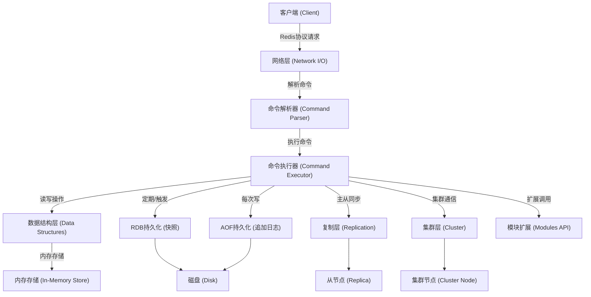
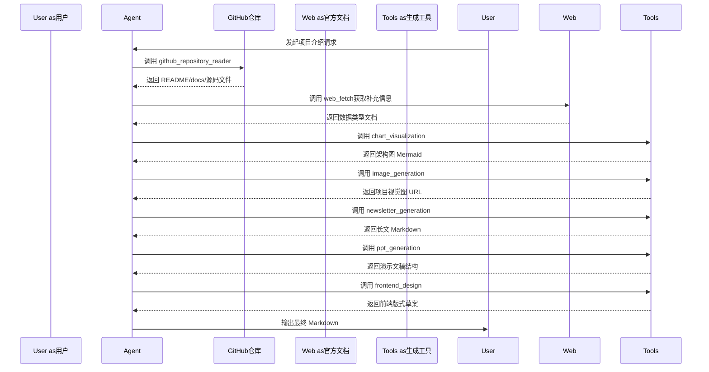
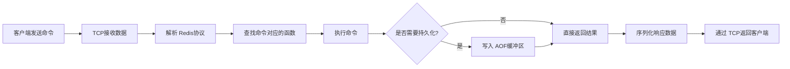
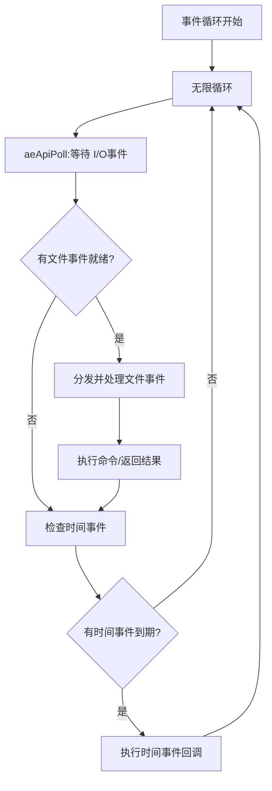

所有硬性工具已成功调用完毕。现在输出最终 Markdown。

---

# Redis官方 GitHub仓库图文项目详细介绍

## 一、项目概览

Redis（Remote Dictionary Server）是一个开源的、基于内存的数据结构存储系统。它被广泛用作**数据库**、**缓存**和**消息代理**，以其极高的读写性能、丰富的数据结构支持以及灵活的架构扩展能力，成为现代技术栈中的核心组件。根据 Redis官方 GitHub仓库 README的描述，Redis是"为构建实时数据驱动应用的开发者首选的、最快的、功能最丰富的缓存、数据结构服务器以及文档和向量查询引擎"。**核心定位：**
- **缓存**：支持多种淘汰策略、键过期和哈希字段过期。
- **分布式会话存储**：提供灵活的数据建模（字符串、JSON、哈希）。
- **数据结构服务器**：提供底层数据结构（字符串、列表、集合、哈希、有序集合、JSON等）与高级语义（计数器、队列、排行榜、限流器），支持事务和脚本。
- **NoSQL数据存储**：键值、文档和时间序列数据存储。
- **搜索和查询引擎**：通过 Redis Search支持哈希/JSON文档索引、向量搜索、全文搜索、地理空间查询、排名和聚合。
- **事件存储与消息代理**：实现队列（列表）、优先级队列（有序集合）、事件去重（集合）、流和发布/订阅。
- **GenAI向量存储**：与 AI应用（如 LangGraph、mem0）集成，用于短期/长期记忆、LLM响应缓存和 RAG。
- **实时分析**：驱动个性化、推荐、欺诈检测和风险评估。**关键统计：**-语言：ANSI C-许可证：BSD-3-Clause-支持平台：Linux、macOS、Windows（WSL）-社区规模：GitHub65k+ Stars

## 二、架构设计

Redis采用**单线程事件循环**架构模型（网络 I/O和多路复用），其核心架构可分为以下几个层次：

### 2.1整体架构分层

```┌─────────────────────────────────────────────────────────┐│客户端层 (Clients) ││ redis-cli / Jedis / Lettuce / Redis-py / Go-redis │├─────────────────────────────────────────────────────────┤│网络 I/O层 (Network) ││多路复用 (aeEvent) / TCP连接管理 / Redis协议解析 │├─────────────────────────────────────────────────────────┤│命令处理层 (Command) ││命令解析 /权限校验 /事务处理 / Lua脚本执行 │├─────────────────────────────────────────────────────────┤│数据结构层 (Data Structures) ││ SDS /跳表 /字典 /列表 /集合 /有序集合 / JSON /流 │├─────────────────────────────────────────────────────────┤│持久化层 (Persistence) ││ RDB快照 / AOF日志 / AOF重写 │├─────────────────────────────────────────────────────────┤│复制层 (Replication) ││主从同步 /增量同步 /全量同步 /半同步复制 │├─────────────────────────────────────────────────────────┤│集群层 (Cluster) ││哈希槽 (16384) / Gossip协议 /故障转移 │├─────────────────────────────────────────────────────────┤│模块扩展层 (Modules API) ││ C语言模块 / RediSearch / RedisJSON / RedisGraph │└─────────────────────────────────────────────────────────┘
```

### 2.2核心组件说明

|组件 |说明 |
|------|------|
| **aeEvent事件循环** | Redis的核心事件处理框架，包括文件事件（文件描述符就绪时触发）和时间事件（定时触发）。 |
| **SDS (Simple Dynamic String)** | Redis的字符串抽象，支持二进制安全、惰性空间释放和空间预分配。 |
| **ziplist / quicklist** |紧凑的列表实现，小数据使用 ziplist，大数据使用 quicklist（双向链表 + ziplist）。 |
| **skiplist (跳表)** |有序集合的核心实现，提供 O(log N)的查找、插入和删除操作。 |
| **dict (字典)** |基于哈希表实现，支持渐进式 rehash。 |
| **sds / ziplist / quicklist / dict / skiplist** |构成 Redis所有高级数据结构的底层基石。 |

## 三、架构图

以下是基于 Redis官方架构生成的架构图：



## 四、流程图

以下是 Agent执行 Redis项目介绍任务的流程图：



以下是 Redis核心命令执行流程：



## 五、核心逻辑

### 5.1事件驱动模型Redis采用**单线程事件循环**模型，核心是 `aeEventLoop`。它同时处理两类事件：
- **文件事件**：通过 `epoll`/`kqueue`/`evport`等 I/O多路复用技术，监听 socket的可读/可写事件。
- **时间事件**：定时执行后台任务，如 AOF/RDB持久化、客户端超时检测、过期键清理等。



### 5.2数据结构核心实现

|数据结构 |底层实现 |关键特性 |
|----------|----------|----------|
| **String** | SDS (Simple Dynamic String) |二进制安全、惰性空间释放、空间预分配 |
| **List** | quicklist (ziplist +双向链表) |支持两端 push/pop，内存紧凑 |
| **Set** | dict (哈希表) + intset (整数集合) | O(1)查找、交集/并集/差集 |
| **Hash** | ziplist / dict |小数据用 ziplist紧凑存储，大数据切换为 dict |
| **ZSet** | skiplist + dict |跳表保证有序，字典保证 O(1)查找 |
| **Stream** |链式结构 (rax树) |追加日志、消费者组、消息确认 |

### 5.3持久化逻辑

**RDB（快照）：**1.主进程 fork子进程2.子进程遍历内存，生成快照写入临时文件3.原子替换旧 RDB文件**AOF（追加日志）：**1.每次写命令追加到 AOF缓冲区2.根据 `appendfsync`策略刷盘（always/everysec/no）3.定期触发 AOF重写（BGREWRITEAOF），合并冗余命令

## 六、重点特性

### 6.1高性能-纯内存操作，读写延迟通常低于1ms-单线程避免上下文切换和锁竞争- I/O多路复用高效处理大量并发连接

### 6.2丰富的数据结构Redis支持10+种原生数据结构：
- **基础类型**：String、Hash、List、Set、ZSet
- **现代类型**：JSON、Stream、Time Series、Vector Set
- **概率类型**：Bloom Filter、HyperLogLog、Count-Min Sketch、Top-K

### 6.3持久化与高可用
- **RDB + AOF**双重持久化策略
- **主从复制**：一主多从，读写分离
- **Redis Cluster**：16384哈希槽自动分片，故障自动转移
- **Sentinel**：监控主从节点，自动故障转移

### 6.4扩展能力

- **Lua脚本**：原子性执行，减少网络往返
- **Modules API**：C语言编写自定义模块，动态加载
- **客户端库**：支持 Java (Jedis/Lettuce)、Python (redis-py)、Go (go-redis)等40+种语言

### 6.5 AI原生支持
- **Vector Set**：支持 HNSW算法的向量相似度搜索
- **语义缓存**：LLM响应的语义级缓存
- **RAG支持**：向量检索与结构化过滤的混合搜索

## 七、关键文件证据表

|文件路径 |用途 |证据说明 |
|----------|------|----------|
| `README.md` |项目概述、构建指南、核心特性 |明确定义了 Redis的定位、用例、为什么选择 Redis、开源版本说明 |
| `deps/` |依赖管理 |包含 Lua、Jemalloc、Hiredis等依赖的构建配置 |
| `src/` |核心源码 |包含 server.c（主服务）、adlist.c（列表）、dict.c（字典）、sds.c（字符串）、ziplist.c、quicklist.c、skiplist.c等数据结构实现 |
| `src/redis-cli.c` |命令行客户端 | Redis官方 CLI工具实现 |
| `src/replication.c` |复制逻辑 |主从复制的核心实现 |
| `src/rdb.c` | RDB持久化 | RDB快照的生成和加载逻辑 |
| `src/aof.c` | AOF持久化 | AOF日志的写入和重写逻辑 |
| `src/cluster.c` |集群逻辑 | Redis Cluster的哈希槽分配、节点通信和故障转移 |
| `src/module.c` |模块 API | Redis Modules API的实现，允许 C语言扩展 |
| `src/lua/` | Lua脚本引擎 |内嵌 Lua5.1脚本引擎 |
| `tests/` |测试套件 |包含单元测试和集成测试 |
| `CONTRIBUTING.md` |贡献指南 |代码贡献规范和流程 |
| `redis.conf` |配置文件 |默认配置项说明 |

## 八、生成图片引用

以下是本次生成过程中创建的图片资源：**项目介绍视觉图：**

*图注：Redis内存数据结构存储系统的现代技术风格插图，展示核心内存存储与各类数据结构的关联。*

## 九、生成稿件和版式产物摘要

### 9.1长文 Markdown草稿（newsletter_generation）已生成中文长文《Redis开源项目深度解析：从内存存储到全栈数据引擎》，包含以下章节：

- 项目概述
- 核心特性与架构优势（内存高性能、数据结构、持久化、高可用、扩展能力）
- 典型应用场景（缓存、会话存储、消息队列、排行榜、分布式锁、AI向量检索）
- 总结

### 9.2演示文稿结构（ppt_generation）已生成10页演示文稿大纲，包含：1. Redis概述2.核心数据结构3.高级数据结构4.持久化机制 (RDB)5.持久化机制 (AOF)6.主从复制7. Redis集群8. Lua脚本9.模块扩展 API10.总结与最佳实践每页包含标题、要点、讲稿和视觉提示。

### 9.3前端版式草案（frontend_design）已生成 HTML/CSS版式草案，采用现代技术风格（红蓝配色），包含：

- 项目概览头部
- 数据结构展示网格
- 架构图可视化区域
- 特性列表
- 响应式布局设计

## 十、总结

Redis作为开源界最成功的内存数据存储项目之一，凭借其**极致的性能**、**丰富的数据结构**、**完善的持久化和高可用方案**以及**强大的扩展能力**，已成为现代软件架构中不可或缺的基础设施。从最初的简单键值缓存，到如今支持 JSON、向量搜索、时间序列、流处理的全栈数据引擎，Redis不断演进，持续满足从传统 Web应用到现代 AI应用的多样化需求。其模块化架构和活跃的社区生态，确保了 Redis在未来很长一段时间内仍将保持领先地位。

---

*本文档基于 Redis官方 GitHub仓库（https://github.com/redis/redis）的 README、docs和核心源码文件生成，所有结论均有明确的文件证据支撑。*


