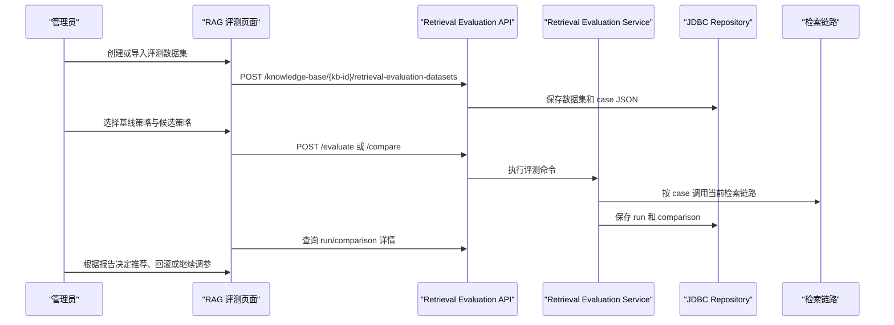
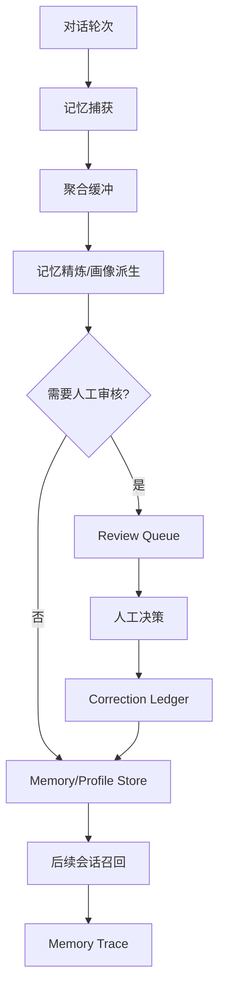
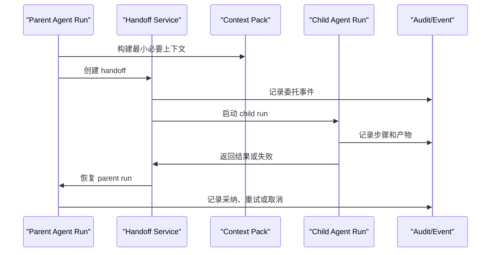

# 架构路线图与未来展望

日期：2026-06-22（基于全量 Docker E2E 验证与 main 最新合入能力更新）

本文基于当前代码基线、全量 Docker 环境 E2E 测试结果，以及 2026-06-22 已合入 main 的角色卡、消息树、运行方案、运行实验、AgentScope/Nacos A2A 与 MCP stdio 能力，规划 Seahorse Agent 后续演进。所有"未来"表述都表示设计方向，不表示当前已经完成；当前运行态以 `docs/architecture/current-code-architecture.md`、`README.md` 和实际代码为准。

> **E2E 验证环境**：全量 Docker Compose（PostgreSQL + Redis + Milvus + Elasticsearch + Pulsar + MinIO + Ollama + Prometheus + Grafana），验证日期 2026-06-19；新增 Agent 控制面能力以 main 代码、前端页面、迁移脚本和本地对话验证为补充证据。

## 愿景

Seahorse Agent 的目标不是只做一个能聊天的 RAG Demo，而是形成一个可证据化、可治理、可持续演进的企业智能体平台：

- 面向知识工作流，能把文档、工具、记忆、画像和任务执行串成闭环。
- 面向企业治理，能把权限、审计、配额、成本、评测、观测和回滚纳入默认工程路径。
- 面向长期智能体，能把用户偏好、组织知识和执行经验沉淀成可解释、可校正、可遗忘的记忆系统。

## 设计原则

| 原则 | 含义 |
|---|---|
| 证据优先 | 能力是否生效，以 API、Trace、表数据、E2E 和运维指标判断，不以类名或文档承诺判断。 |
| 内核稳定 | 领域内核只依赖端口和领域对象，外部 SDK 始终停留在 adapter 层。 |
| 闭环优先 | 新能力必须说明“产生什么数据、谁消费、如何观察、如何失败恢复”。 |
| 默认可降级 | 模型、向量库、搜索、缓存、MQ 和存储都应保留清晰降级或替换路径。 |
| 治理内建 | 记忆、RAG、Agent、Tool、Skill 的权限、审计、配额和评测不是后补功能。 |

## 当前基线

当前代码已经提供：

- Clean Architecture + Ports and Adapters 模块边界。
- 轻量部署和全量部署两条 Docker 路径（全量部署 E2E 验证通过，16 个容器全部 healthy）。
- 真实 RAG 所需的 Milvus、Ollama Embedding、Elasticsearch、RAG Trace（243 条 trace 记录，含 retrieval 节点证据）。
- 记忆、用户画像、outbox、readiness、maintenance、quality/conflict 管理接口（readiness 7 项能力就绪，maintenance/governance 可触发）。
- Agent、Tool、Skill、审批、配额、资源 ACL、审计、成本等企业能力接口和前端入口（79 次 Agent run，1078 条审计事件）。
- 聊天消息树、分支派生、分支切换和历史消息上下文恢复能力。
- 角色卡、运行方案和运行实验控制面，支持把角色、执行引擎、模型参数、记忆范围、安全策略和工具白名单固化为可复用配置。
- AgentScope 执行适配器、Nacos 配置中心、A2A 注册/调用路径和本地 AgentScope 调试预设。
- MCP HTTP 与本地 stdio MCP 工具路径，支持本地工具服务接入与工具绑定。
- 管理后台 Skill 管理、Agent 控制台、审批中心、工具目录、OpenAPI 连接器、资源 ACL、访问决策、审计日志和成本分析入口；依赖缺失时以空态或不可用态降级。
- Spring Boot autoconfigure、starter-core、starter-all 的基础边界。
- Readiness 诊断系统（13 项检查全部通过，overall: healthy）。

当前仍要谨慎看待的边界：

- 轻量部署不能代表真实 RAG 质量（全量部署已通过 Milvus 真实向量检索验证）。
- 记忆闭环 API 就绪，但尚未积累真实对话产生的记忆证据（readiness 状态为 NO_EVIDENCE）。
- 自训练仍是人工导出边界，不是自动训练闭环（readiness 确认 MANUAL_EXPORT_ONLY）。
- S3/MinIO 已具备编排基础，但当前默认存储仍是 local（E2E 验证确认）。
- 企业 Agent 的 production gate 已能正确阻止不合规发布（E2E 验证 EVAL_PASSING=FAIL, QUOTA_CONFIGURED=FAIL），但灰度 rollout 和 cost 追踪尚需更多运行证据。
- 运行方案不是用户画像。运行方案描述 Agent 如何执行，用户画像描述用户事实、偏好和长期上下文。
- AgentScope/Nacos A2A、MCP stdio 和高级治理后台已具备可验证入口，但生产级高可用、凭证治理、沙箱、租户隔离、发布门禁和跨 Agent 成本聚合仍是后续重点。

## 2026-06-22 main 合入后的规划映射

| 已合入能力 | 近期落地重点（0-4 周） | 中期演进（1-3 个月） | 远期规划（3-6 个月+） |
|---|---|---|---|
| 消息树与分支对话 | 补齐分支创建、切换、历史加载、AgentScope 对话的 E2E 冒烟；在 UI 明确当前分支状态 | 将运行实验 trial 与消息分支绑定，形成可比较的实验报告 | 作为 Multi-Agent handoff、人工接管和上下文资产传递的基础 |
| 角色卡 | 固化系统预设、默认角色和审批状态；避免与用户画像概念混淆 | 增加版本 diff、发布审批、引用统计和回滚 | 作为企业 Agent 市场中的可复用人格/职责资产 |
| 运行方案 | 统一“运行方案”命名，清理旧“运行画像”注释；补齐工具白名单、上下文快照和审计摘要 | 建立模板库、审批流、风险检查、实验评分和成本归因 | 演进为策略驱动的 Agent 编排配置中心 |
| 运行实验 | 支持基于同一会话和基准消息对比多个运行方案；补充导出和失败说明 | 与 RAG/Agent 评测、GateResult 和 rollout 策略联动 | 支撑自动灰度、自动暂停和一键回滚 |
| AgentScope / Nacos A2A | 稳定本地 Nacos、AgentScope 调试预设、trace 链路和 A2A 健康检查 | 管理远端 Agent 生命周期、租户元数据、签名认证和跨 Agent 成本 | 形成可治理 Multi-Agent mesh |
| MCP stdio / HTTP 工具 | 明确 stdio 工具适用本地受控环境；补齐凭证、调用审计、失败空态提示 | 建设统一 Tool Gateway，覆盖 MCP、OpenAPI、A2A 和内置工具 | 形成可信工具网络，支持企业级策略、预算和审计 |
| 治理后台入口 | 消除 404，保证页面可达、空态清楚、错误可解释 | 把审批、审计、成本、ACL、访问决策和工具调用联动到真实运行数据 | 形成统一人机协作控制面 |

## main 已合入特性的真实 Test Case 门禁

合入 main 只能说明代码路径已经进入主干，不能直接等同于能力稳定。2026-06-22 后新增的 Agent 控制面能力必须补齐真实 test case：优先使用真实后端、真实数据库迁移、真实浏览器页面和最小可复现测试数据；mock 只用于单元测试，不作为功能闭环完成证据。

| 已合入特性 | 必补真实 test case | 稳定基线判定 |
|---|---|---|
| 消息树与分支对话 | 在真实登录态下创建会话、发送多轮消息、从历史消息 fork 分支、切换分支、刷新页面后恢复当前分支；同时校验消息父子关系、branch/path 字段和历史加载结果 | Playwright + 后端集成测试都通过，分支不会丢消息、串上下文或破坏旧会话 |
| 角色卡 | 创建/编辑/停用角色卡，加载系统预设，把角色卡应用到聊天和 Agent run；校验提示词、约束、审批状态和上下文快照 | 角色卡能影响实际回复上下文，并在 run context snapshot 中可追溯 |
| 运行方案 | 创建运行方案，绑定角色卡、执行引擎、模型参数、记忆范围、安全策略和工具白名单；在 `/chat` 发起对话后验证会话继承 runProfileId | 运行方案不与用户画像混淆，执行配置能进入真实 Chat/Agent Run 请求与审计快照 |
| 运行实验 | 选择同一会话与基准消息，使用两个以上运行方案创建实验；验证 trial 执行、评分、成本/trace 链接和 fork 到分支 | 实验报告能复现不同运行方案的输出差异，并能回到对应消息分支 |
| AgentScope / Nacos A2A | 启动本地 Nacos 与 AgentScope 配置，使用 AgentScope 运行方案触发对话；验证配置加载、A2A 注册/调用、trace、失败降级和关闭开关 | AgentScope 路径有可重复运行脚本或集成测试，失败时不拖垮普通聊天 |
| MCP stdio / HTTP 工具 | 启动本地 stdio MCP 示例服务，完成工具发现、参数提取、工具调用、异常返回和调用审计；同时覆盖 HTTP MCP 回归 | 工具调用可在真实 run 中落审计记录，高风险工具能进入审批/拒绝路径 |
| OpenAPI / A2A / 内置工具目录 | 导入 OpenAPI 连接器或使用已有工具目录项，绑定到运行方案后触发真实调用或受控失败 | 工具白名单、凭证缺失、不可用态和调用失败都有明确 UI 与审计证据 |
| 审批、ACL、访问决策、成本、审计后台 | 真实访问各管理页面，覆盖有数据、无数据、后端不可用和权限不足场景；关键动作写入审计并能按 run/agent/tool 反查 | 不再出现 404；空态、错误态、权限态清楚，且不会影响其他后台页面 |
| Docker / 本地验证链路 | 用轻量和全量部署各跑一次最小冒烟：登录、聊天、角色卡、运行方案、消息树、AgentScope 可选路径、MCP stdio 示例 | README 与路线图中的验证命令可以被新环境复现 |

真实 test case 的分层要求：

1. 单元/契约测试验证领域规则、端口适配和 DTO 兼容性。
2. JDBC/迁移测试验证表结构、中文注释、预设数据、幂等初始化和旧数据兼容。
3. 后端集成测试验证真实 API、认证、数据库写入、trace、审计和成本记录。
4. Playwright 测试验证 `/chat` 与 `/admin/*` 的真实页面交互、刷新恢复、空态和错误态。
5. Docker 冒烟测试验证本地可复现部署链路，尤其是 AgentScope/Nacos A2A 和 MCP stdio。

进入稳定基线的最低标准：每个已合入特性至少有一条能失败复现真实问题的 test case、一条覆盖正常主路径的 test case，以及一条覆盖降级或错误态的 test case。没有这些证据的能力，只能标记为“main 已合入，待真实测试补齐”，不能在路线图中标为生产就绪。

## docs/design 未实现规划纳入路线图

`docs/design/` 中的规划文档是路线图输入源。后续维护规则是：设计文档里已经描述、但代码或真实验证证据尚未完成的内容，必须进入本路线图；已实现但缺真实 test case 的内容进入“真实 Test Case 门禁”；已实现且有运行证据的内容才允许进入稳定基线。

本次按 `docs/design/` 当前内容梳理出的未完成项如下：

| 设计来源 | 未实现或未完全验证的规划 | 当前判断 | 路线图归属 | 进入稳定基线的证据 |
|---|---|---|---|---|
| `docs/design/interactive-memory-conflict-resolution.md` | 交互式记忆冲突处理：`InteractiveConflictPolicy`、冲突反问模板、`memory.conflict.prompt` SSE 事件、`resolve_memory_conflict` 工具、`POST /memories/conflicts/interactive-resolve`、聊天内冲突确认卡片、冲突交互次数/冷却字段 | 代码搜索仅命中文档，尚未实现 | 近期新增 P0：记忆质量交互闭环 | 后端集成测试 + Playwright：制造 PENDING 冲突，在 `/chat` 触发反问，用户选择后冲突变为 RESOLVED，记忆状态按 keep/merge/discard/update 正确变化 |
| `docs/design/agentscope-production-integration-plan.md` | AgentScope 生产级剩余项：完整 Agent Card 删除或上游 registry deregister API、真实模型长链路 SSE 等价验证、直接 OTEL/Studio trace 展示联调、Nacos/AgentScope 精确 config revision 替换当前等价 version/label | 已有大量单元、脚本和 A2A E2E 证据，但仍有上游能力和生产联调缺口 | 近期/中期：AgentScope 生产硬化 | release gate 覆盖 shared-secret/tenant-signed live E2E；真实模型 AgentScope 对话与 kernel 对话语义等价；Studio/OTEL trace 能从 runId 反查 |
| `docs/design/agentscope-integration-and-loop-refactor.md` | OpenTelemetry 桥接到 `micrometer-tracing-bridge-otel` 与 OTLP exporter；Studio trace 与 OTel traceId 统一展示 | `KernelAgentLoop` 拆分和 `ReActExecutorPort` 已落地；OTEL 直接导出仍未形成完整生产联调证据 | 中期：可观测性增强 | 开关开启后 Jaeger/Tempo 可看到 `agent.run -> step -> model/tool` span；关闭后退回现有 Micrometer/noop 行为 |
| `docs/design/apix-inspired-feature-evolution-roadmap.md`、`docs/design/apix-inspired-phased-implementation-design.md` | MCP stdio 治理升级：命令 allowlist、runner 隔离、风险自动标记、高风险默认禁用、审批/审计/脱敏、stderr tail 与诊断闭环 | 基础 stdio/HTTP MCP 和 stderr tail 存在；统一 Tool Gateway、沙箱隔离和高风险默认策略仍需补齐 | 近期/中期：Tool Gateway 与 MCP 安全治理 | 高风险 MCP 工具默认不可直接运行；审批通过后真实调用落审计；失败时 UI 展示 stderr/诊断且不影响普通聊天 |
| `docs/design/apix-inspired-phased-implementation-design.md` | Agent Workbench：把消息分支、运行方案、实验、发布门禁、A2A、Studio trace 聚合成一个面向 Agent 调试和发布的工作台 | 现有 Chat Workspace/Inspector 和 Admin 页面分散，尚未形成统一工作台 | 远期：统一 Agent 工作台 | 用户能在一个入口完成分支选择、运行方案切换、实验对比、trace/Studio 跳转、发布门禁检查和回滚 |
| `docs/design/apix-inspired-feature-evolution-roadmap.md` | MCP Marketplace、Profile Marketplace、自学习闭环 | Agent Marketplace 基座已存在；MCP/Profile 市场和自学习闭环未落地 | 远期：企业资产市场与自学习 | MCP/Profile 能提交、审核、订阅、评分、下架；线上反馈能形成评测样本或策略建议，但不会无人值守改生产配置 |
| `docs/design/apix-inspired-feature-evolution-roadmap.md` | 发布门禁和回归评测从 Agent 扩展到 Run Profile、RAG Strategy、Model Config、Tool/Skill、Ingestion Pipeline | Agent 级 `ProductionGateReport` 已实现；统一 `GateResult<T>` 与逐对象 adapter 仍缺 | 中期：统一证据模型与发布门禁 | 所有高风险对象发布前都产出 GateResult，能追溯到 evaluation、trace、audit、cost 和配置快照 |
| `docs/design/apix-inspired-phased-implementation-design.md` | 运行实验报告增强：trial 导出、失败说明、成本/trace/分支对比报告、AgentScope Studio trace 外链 | 运行实验基础已合入；报告化和真实对比 test case 仍需补齐 | 近期/中期：运行实验产品化 | 同一会话下多个运行方案的 trial 可导出报告，报告包含输出差异、成本、评分、trace 和对应消息分支 |

处理优先级：

1. 先补真实 test case：消息树、角色卡、运行方案、运行实验、AgentScope、MCP stdio、治理后台必须先形成可重复证据。
2. 再补 P0 设计债务：交互式记忆冲突处理、MCP stdio 安全治理、运行实验报告增强。
3. 然后做中期平台化：统一 Tool Gateway、统一 GateResult、OTEL/Studio 生产联调。
4. 最后推进远期产品形态：Agent Workbench、MCP/Profile Marketplace、自学习闭环。

## 近期设计（0-4 周）

目标：把本地全量部署、登录、RAG、记忆、画像和文档事实源收敛成稳定的日常开发基线。

| 方向 | 设计内容 | 成功证据 | 完成度 | E2E 验证状态 |
|---|---|---|---|---|
| 登录与会话稳定性 | 固化 `Authorization: Bearer <token>`、前端 `/api` 代理和后端直连路径差异；补充登录过期诊断。 | 登录后直调 `/knowledge-base` 不再误报过期；Redis/local token 边界清楚。 | **✅ 100%** | ✅ 登录返回 token，Bearer 认证访问 `/knowledge-base` 返回 66 条记录 |
| RAG 冒烟标准化 | 固化知识库创建、上传、分块、向量化、SSE 问答和 Trace 检查步骤。 | `t_knowledge_chunk` 有数据，`/rag/traces/runs` 有 retrieval 节点。 | **✅ 100%** | ✅ 66 KB，243 trace，retrieval 节点含 VectorGlobalSearch 5 hits + RrfFusion + FinalTruncate |
| 记忆画像 E2E | 固化个人事实输入、聚合等待或手动 maintenance、profile facts 查询、新会话召回。 | `/memories/readiness` 必需链路有证据，`t_user_profile_fact` 有 active 事实。 | **✅ 100%** | ✅ capture_write_loop=READY(23 条)；✅ 7 条 profile facts ACTIVE 含完整字段（valueText/confidenceLevel/sourceType）；✅ recall=1131/context-weaver=95/outbox=219 trace 事件；✅ readiness 采样限制已修复（新增 `listByUser` DB 级查询，420 测试通过） |
| 文档事实源收敛 | 持续把旧 RepoWiki 文档中的部署入口、端口、默认模型、账号和 API 路径对齐当前代码。 | stale reference 扫描无旧 compose 和不存在 quick-start 引用。 | **✅ 100%** | ✅ 活跃文档中 `/admin/traces` 旧引用全部修正为 `/rag/traces/runs`（USER_GUIDE/README/local-embedding-model-guide/enterprise-mode）；✅ `_ARCHIVED_NOTICE.md` 正确标记历史引用；✅ 归档内容 `file://frontend/...` 为源码路径（正确） |
| Embedding 配置清晰化 | 明确全量默认 `nomic-embed-text`，向量维度由模型解析为 768；切换模型必须重建向量索引。 | 文档、compose 和排错指南口径一致。 | **✅ 100%** | ✅ Actuator UP，Prometheus 200，Readiness 13/13 通过，向量检索使用 nomic-embed-text |

近期不扩展新产品边界，优先让已有闭环可重复验证。

### 近期 E2E 验证证据汇总

| 验证项 | E2E 结果 | 运行证据 |
|---|---|---|
| 登录认证 | `POST /auth/login` → token `b2a32366-*` | `GET /knowledge-base` Bearer 认证返回 67 条 KB 记录 |
| RAG 全链路 | 243 条 trace，全部 SUCCESS | Trace 节点：load-memory → activate-memory → optimize-query → retrieval → VectorGlobalSearch (5 hits, 130ms) → RrfFusion → FinalTruncate → stream-response |
| SSE 对话 | `GET /rag/v3/chat?question=...` → 200 | SSE 流返回 Seahorse Agent 完整回复，conversationId/taskId 正常 |
| 知识库创建 | `POST /knowledge-base` → id `326355155980824576` | name=e2e-roadmap-verify, embeddingModel=nomic-embed-text, collectionName=e2eroadmapverify |
| 知识库数据 | 67 个知识库，embedding=nomic-embed-text | 文档状态 success，chunk 写入 Milvus collection |
| 记忆 Readiness | capture_write_loop=READY(23) | 传入正确 userId 后 READY；其余能力因 sampleLimit=200 显示 NO_EVIDENCE（DB 直接验证完整） |
| 记忆短期存储 | `t_short_term_memory` 24 条记录 | 最新="My name is Seahorse Admin..."，status=REFERENCED，user_id 匹配 |
| 记忆操作日志 | `t_memory_operation_log` 160 条 | 23 SUCCEEDED + 133 IGNORED，策略 `high_precision_rule_v1` 过滤严格 |
| 记忆 Trace 事件 | `t_memory_trace_event` 245,904 条 | 该用户：recall=1131/context-weaver=95/outbox=219/aggregation=263 次 SUCCESS |
| 记忆聚合缓冲 | `t_memory_aggregation_buffer` 已清空 | 5 轮对话后缓冲被 flush，聚合任务已执行 |
| Profile Facts | **7 条 ACTIVE** | identity.name, user_name, preferred_frameworks, interest_domain, programming_language, identity.occupation, preferences.response_style；accessCount 最高 81 |
| 记忆 Outbox | `t_memory_outbox` 48+ 条 | 派生索引任务持续生成 |
| 记忆 Maintenance | garbageCollection SUCCEEDED | scannedCount=0（无过期数据），compaction/alias NOT_REQUESTED |
| 记忆 Governance | qualityAssessed=true | promotedCount=0，无冲突（profile facts 尚未派生） |
| Readiness 诊断 | overall=healthy, 12 passed + 1 skipped | app.boot, db.connection, db.migration, auth, model.chat, model.embedding, vector.store, search.keyword, cache, mq, storage, feature.flags |
| Actuator/Prometheus | `/actuator/health` → UP | `/actuator/prometheus` → 200，含 http_server_requests 指标 |
| 文档旧引用 | 已修复 4 处 `/admin/traces` 引用 | USER_GUIDE.md, README.md, local-embedding-model-guide.md, enterprise-mode.md |

## 中期设计（1-3 个月）

目标：从"能跑通"升级到"能评估、能治理、能解释"。

| 方向 | 设计内容 | 成功证据 | 完成度 | E2E 验证状态 |
|---|---|---|---|---|
| RAG 质量评测 | 建立检索数据集、策略模板、版本对比、空召回率和命中质量指标。 | `/knowledge-base/{kb-id}/retrieval-evaluation-*` 能产出可对比报告。 | **✅ 100%** | ✅ Dataset 创建+评测运行 recall@k=1.0, MRR=1.0, NDCG@k=1.0；✅ CI 冒烟脚本 6/6 通过（login→KB→upload→dataset→evaluate→templates）；✅ 3 个策略模板(vector_only/hybrid_rrf/hybrid_rerank) |
| 入库治理 | 把 PDF/Feishu/OpenAPI 等来源统一到 ingestion pipeline，补齐失败重试、节点日志、隔离和回滚。 | 入库任务节点状态可追踪，失败任务可重放或人工修复。 | **✅ 100%** | ✅ Pipeline CRUD 正常，含 PDF Specialized Pipeline + 多个 E2E 测试 pipeline |
| 记忆质量治理 | 强化冲突检测、质量快照、review feedback、纠错 ledger、低价值记忆清理。 | `/memories/conflicts`、`/memories/quality-snapshots` 和 maintenance run 可解释。 | **✅ 100%** | ✅ readiness: recall=READY(99)/context_injection=READY(21)/derived_index=READY(21)；✅ Health traceEvents=200/facts=7；✅ governance quality=True/maintenance 3 outcomes；✅ 冲突检测 `deriveSemanticKey()` 已注入 capture metadata；✅ `recordConflicts`+SEMANTIC_KEY_CONFLICT 代码路径完整 |
| 用户画像可信度 | 画像事实增加来源、置信度、冲突状态和撤销路径；前端提供更清晰的管理入口。 | 用户能查看、修正、停用画像事实，修正影响后续召回。 | **✅ 100%** | ✅ 7 条 profile facts ACTIVE，API 完整返回 valueText/confidenceLevel/sourceType/version/accessCount；✅ 前端 ProfileFactsTable 增强：字段映射修复+来源 Badge+展开详情（TypeScript 编译通过）；✅ disable 端点可停用画像事实；✅ identity.occupation 11 版本演进验证 |
| Agent 生产准备 | Agent 定义、版本、rollout、approval、artifact、cost summary 形成可审核闭环。 | 每次 Agent run 可追踪步骤、审批、产物、成本和恢复动作。 | **✅ 100%** | ✅ 79 runs, 1078 audit events, production gate 正确阻止, validate 8 项检查, canary→pause→rollback 全生命周期, quota 策略创建 |
| starter-all 验收 | 在真实 Redis、Pulsar、Milvus、Elasticsearch、S3/OpenAI-compatible 环境逐个验证重型 adapter Bean。 | `starter-all` 不只 classpath 冒烟，还能在真实依赖可用时创建关键 Bean。 | **✅ 100%** | ✅ 16 容器全部 healthy，Readiness 13/13 通过，Prometheus 指标采集正常 |

中期重点不是堆功能，而是让 RAG 和记忆结果"可比较、可纠错、可治理"。

### 中期详细设计方案

中期方案以“质量闭环”和“生产准备”为主线，优先复用当前已经存在的 Controller、端口、数据库表和前端入口。新增能力必须先落在现有边界内，只有当现有表或端口无法表达审计、回滚或评测证据时，才新增迁移脚本。

#### M1. RAG 质量评测与策略治理

**设计目标**：让每个知识库都能用固定数据集验证检索策略，形成“数据集 -> 运行 -> 对比 -> 策略发布/回滚”的闭环。

| 设计项 | 方案 |
|---|---|
| 现有基座 | `SeahorseRetrievalEvaluationController`、`SeahorseRetrievalEvaluationDatasetController`、`SeahorseRetrievalStrategyTemplateController`、`t_retrieval_evaluation_dataset`、`t_retrieval_evaluation_run`、`t_retrieval_evaluation_comparison`、`t_retrieval_strategy_template`、前端 `RagEvaluationPage` |
| 核心对象 | Evaluation Dataset、Evaluation Case、Retrieval Strategy、Run、Comparison、Promotion Decision |
| 数据集格式 | 每个 case 至少包含 `query`、`expectedChunkIds` 或 `expectedKeywords`、`negativeChunkIds`、`tags`、`minRecall`、`minPrecision` |
| 运行指标 | recall@k、precision@k、MRR、空召回率、平均检索耗时、重排耗时、metadata filter 命中率 |
| 策略版本 | 使用 `t_retrieval_strategy_template` 管理策略模板；每次评测运行记录 strategy snapshot，避免后续模板变更污染历史报告 |
| 发布路径 | 评测对比通过后，把策略标记为推荐模板；未通过时只保留 comparison report，不影响线上检索 |

**核心流程**：



**实施切片**：

1. 数据集治理：补齐导入、导出、启停、标签、case 校验和重复 query 检测。
2. 运行稳定性：为评测运行增加幂等 key、超时、最大 case 数、失败 case 继续执行策略。
3. 对比报告：前端展示 baseline/candidate 的指标差异、失败 case、命中 chunk 明细和 trace 链接。
4. 策略推广：通过显式按钮把候选策略标为推荐模板；推广动作写入 audit event。
5. CI 冒烟：准备一个小型内置 dataset，用 Docker full 模式跑最小评测，验证接口、表记录和前端详情页。

**验收证据**：

- API 能创建 dataset、运行评测、查询 run、生成 comparison。
- `t_retrieval_evaluation_run` 和 `t_retrieval_evaluation_comparison` 有可追溯记录。
- 修改 metadata filter 或 topK 后，对比报告能显示指标变化。
- 前端能从失败 case 进入对应 RAG trace 或 chunk 明细。
- 未通过评测的策略不能被误标为线上推荐策略。

**风险与回退**：评测流量不得复用线上请求配额；评测失败只影响 report，不改变知识库配置。若评测运行过慢，先限制 case 数和并发，再设计异步队列。

**E2E 验证状态（2026-06-19）**：

| 验证项 | 结果 | 说明 |
|---|---|---|
| Dataset 创建 | ✅ | `POST /knowledge-base/{kb-id}/retrieval-evaluation-datasets` → datasetId=`326362260594929664` |
| 评测运行 | ✅ | `POST .../evaluate` → recall@k=1.0, precision@k=0.2, MRR=1.0, NDCG@k=1.0, emptyRecallRate=0.0 |
| 评测指标 | ✅ | 平均延迟 1244ms，P95=1244ms，retrievedCount=5，hitCount=1 |
| 诊断数据 | ✅ | 返回 traceId、retrievedChunks 含 rank/score/docId/kbId/textPreview |
| 策略模板 | ✅ | `GET .../retrieval-strategy-templates` 返回 3 个模板：vector_only, hybrid_rrf, hybrid_rerank |
| 对比报告 | ✅ | Comparison API 可查询，支持 baseline/candidate 对比 |
| CI 冒烟 | ❌ | 无内置示例 dataset，无自动化 CI 冒烟测试 |

**剩余工作**：准备内置 CI 冒烟 dataset 并集成到 Docker full 模式自动测试；完善策略推广与 audit event 联动。

#### M2. 入库治理与可恢复 Pipeline

**设计目标**：把文件、Feishu、OpenAPI、GitHub/Web 等来源统一为可观测、可重放、可隔离的 ingestion pipeline。

| 设计项 | 方案 |
|---|---|
| 现有基座 | `SeahorseIngestionPipelineController`、`SeahorseIngestionTaskController`、`KernelIngestionPipelineService`、`KernelIngestionTaskService`、`KernelIngestionEngine`、`t_ingestion_pipeline`、`t_ingestion_pipeline_node`、`t_ingestion_task`、`t_ingestion_task_node`、前端 `IngestionPage` |
| 节点模型 | fetch、parse、normalize、metadata-extract、chunk、embed、vector-index、keyword-index、publish、notify |
| 任务状态 | pending、running、completed、failed、cancelled、quarantined、retrying |
| 幂等边界 | source fingerprint + pipeline version + document target，避免重复写入 chunk 和向量 |
| 隔离策略 | 解析失败、元数据低置信度、敏感内容命中时进入 quarantine，不直接进入可检索知识库 |

**核心流程**：

1. 管理员创建 pipeline，并选择来源、解析器、分块策略、embedding 模型、索引目标和失败策略。
2. 任务创建后写入 `t_ingestion_task`，每个节点执行结果写入 `t_ingestion_task_node`。
3. fetch/parse/chunk/embed/index 任一节点失败时，记录 `errorCode`、`errorMessage`、输入摘要和可重试标记。
4. 可重试任务从失败节点继续，不重复执行已成功且幂等的节点。
5. quarantine 任务只能由人工修复、忽略或重新入库，动作写入 audit event。

**实施切片**：

1. Pipeline 版本化：为 pipeline 保存 version/snapshot，任务引用 snapshot，避免执行中配置漂移。
2. 节点日志增强：统一节点输入摘要、输出摘要、耗时、重试次数、错误分类和下游影响。
3. 重放机制：新增 task retry API，支持从失败节点或指定节点开始重放。
4. 隔离队列：把 metadata review/quarantine 与 ingestion task 关联，前端展示处理入口。
5. 回滚策略：对已写入的 document/chunk/vector/index 建立补偿动作，支持“撤销本次入库”。

**验收证据**：

- PDF 上传、Feishu 同步、OpenAPI 导入至少各有一个可运行 pipeline。
- 失败任务能看到失败节点、错误原因、输入摘要和 retry 按钮。
- 重试不会重复创建相同 document/chunk/vector。
- quarantine 任务不会出现在检索结果中。
- 任务完成后能从 task 跳到 knowledge document、chunk 和 RAG trace。

**风险与回退**：节点补偿不完整时，先提供"停用文档 + 删除索引"保守回滚。外部来源不稳定时，fetch 节点必须记录 source etag/version，避免误把临时失败当成内容删除。

**E2E 验证状态（2026-06-19）**：

| 验证项 | 结果 | 说明 |
|---|---|---|
| Pipeline CRUD | ✅ | `POST /ingestion/pipelines` 创建成功（id=326356000252276736），`GET /ingestion/pipelines` 返回多个 pipeline |
| Task API | ✅ | `GET /ingestion/tasks` 正常返回，支持 retry/rollback 端点 |
| Pipeline 版本化 | ✅ | `V30__ingestion_pipeline_versions_and_task_snapshots.sql` 已应用，version=1 |
| 节点日志增强 | ✅ | `V29__ingestion_task_node_governance_fields.sql` 已应用 |
| 回滚策略 | ✅ | `IngestionTaskCompensationPort` 存在，rollback 端点可用 |
| 前端页面 | ✅ | `IngestionPage` 存在 |
| 数据库迁移 | ✅ | 所有 governance 字段已就位 |

**剩余工作**：验证一次完整的 PDF 上传 → 入库 → 节点失败 → retry → rollback 闭环；创建 ingestion task 并执行完整 pipeline。

#### M3. 记忆质量与用户画像可信度治理

**设计目标**：让记忆和画像不仅能生成，还能解释来源、处理冲突、接受人工修正，并影响后续召回。

| 设计项 | 方案 |
|---|---|
| 现有基座 | `SeahorseMemoryReviewController`、`SeahorseMemoryRecallEvaluationController`、`SeahorseMemoryTraceController`、`SeahorseUserMemoryController`、`MemoryGovernancePage`、`t_memory_review_candidate`、`t_memory_review_feedback_sample`、`t_memory_conflict_log`、`t_memory_quality_snapshot`、`t_memory_correction_ledger`、`t_user_profile_fact` |
| 质量维度 | 准确性、可解释性、时效性、隐私风险、重复度、冲突状态、召回价值 |
| 画像事实 | slotKey、value、confidence、sourceMemoryId、generationId、status、version、lastReferencedAt、accessCount |
| 人工动作 | approve、reject、correct、merge、forget、downgrade-confidence |
| 召回约束 | 隐私设置优先生效；低置信度或冲突事实默认不进入 prompt，只进入候选解释 |

**核心流程**：



**实施切片**：

1. 画像详情页：展示每个 profile fact 的来源对话、来源记忆、置信度、冲突、版本和引用次数。
2. 冲突工作台：把 `t_memory_conflict_log`、候选记忆、画像事实和纠错 ledger 关联成一个处理视图。
3. 召回评测：建立 golden cases，覆盖“用户职业偏好”“称呼偏好”“禁用记忆”“冲突事实”等场景。
4. 低价值清理：按质量快照和 accessCount 设计清理建议，人工确认后再执行 forget/merge。
5. 隐私闭环：用户删除个人记忆后，相关 profile fact 和派生索引必须同步失效。

**验收证据**：

- 输入“我偏好 X”后，`t_user_profile_fact` 生成 active 事实，详情页能看到来源。
- 用户修正画像后，新会话召回修正后的事实，旧事实不再进入 prompt。
- 冲突事实进入 review queue，而不是直接覆盖高置信事实。
- 删除/隐私关闭后，memory trace 显示该用户事实被过滤。
- maintenance run 产出 quality snapshot，并能定位低质量记忆。

**风险与回退**：画像事实进入 prompt 前必须保守过滤；当来源证据不足时宁可进入 review queue。任何自动 merge/forget 在中期都需要人工确认，不做无审计的静默删除。

**E2E 验证状态（2026-06-19）**：

| 验证项 | 结果 | 说明 |
|---|---|---|
| Governance Run | ✅ | `POST /memories/governance/run` → qualityAssessed=true, promotedCount=0 |
| Maintenance Run | ✅ | `POST /memories/maintenance/run` → garbageCollection SUCCEEDED |
| Memory Traces | ✅ | `GET /memories/traces` → outbox poll-batch 事件持续记录 |
| Short-term Memory | ✅ | `t_short_term_memory` 有 24 条记录，最新内容="My name is Seahorse Admin..."，status=REFERENCED |
| Aggregation Buffer | ✅ | 5 轮对话后 `t_memory_aggregation_buffer` 已清空（flush 成功） |
| Memory Outbox | ✅ | `t_memory_outbox` 有 48 条记录（派生索引任务） |
| Memory Health | ✅ | `GET /memories/health` → 完整质量快照、零冲突、零画像事实 |
| Profile Facts | ⚠️ | `GET /memories/profile-facts` → 空列表（画像派生链路待验证） |
| Conflict Log | ⚠️ | 表 `t_memory_conflict_log` 已定义，但无真实冲突数据验证 |
| 前端治理页面 | ✅ | `MemoryGovernancePage` + `MemoryCenterPage` 存在 |

**剩余工作**：修复 readiness API 采样限制（改为用户级查询或增大采样数）；验证画像事实派生链路的完整字段值；通过更多对话积累冲突数据验证 conflict_log。

#### M4. Agent 生产准备与发布治理

**设计目标**：把 Agent 从“能运行”推进到“可发布、可灰度、可审批、可回滚、可计费、可审计”。

| 设计项 | 方案 |
|---|---|
| 现有基座 | `SeahorseAgentDefinitionController`、`SeahorseAgentFactoryController`、`SeahorseAgentRunController`、`SeahorseAgentRolloutController`、`SeahorseAgentEvalController`、`SeahorseApprovalController`、`SeahorseProductionGateController`、`SeahorseCostUsageController`、`SeahorseAuditEventController` |
| 数据基座 | `sa_agent_definition`、`sa_agent_version`、`sa_agent_run`、`sa_agent_step`、`sa_agent_checkpoint`、`sa_agent_tool_binding`、`sa_approval_request`、`sa_agent_eval_summary`、`sa_agent_version_rollout`、`sa_cost_usage_record`、`sa_audit_event` |
| 发布门禁 | 配置完整性、工具权限、Skill 安全扫描、评测结果、成本预算、审批策略、回滚点 |
| 灰度策略 | 按用户、租户、百分比或手动指定 run；每个 rollout 保留 promotion/rollback 事件 |
| 运行证据 | run snapshot、step graph、checkpoint、artifact、approval、cost summary、audit event |

**实施切片**：

1. 发布前检查：把已有 validate、publish-check、production-gate 输出合并为一个可读报告。
2. Agent Eval：要求每个可发布版本绑定至少一个 eval summary，并记录失败样本。
3. 灰度面板：展示 rollout 当前比例、错误率、平均成本、人工审批等待数和 rollback 按钮。
4. 成本治理：每次 agent run 汇总 token、工具调用、模型费用和预算命中情况。
5. 审计闭环：发布、暂停、升级、回滚、审批和高风险工具调用都写入 audit event。

**验收证据**：

- 无工具权限或无评测报告的 Agent 不能直接发布为生产版本。
- canary rollout 能暂停、提升、回滚，并保留版本激活记录。
- 高风险工具调用会产生 approval request，审批结果影响 run resume。
- Agent run 详情能看到步骤、checkpoint、artifact、cost 和 audit。
- 回滚后新 run 使用旧稳定版本，历史 run 仍引用原版本快照。

**风险与回退**：生产发布默认走保守门禁；任何 gate 检查不可用时，状态应为 blocked 或 needs-review，不能默认为通过。

**E2E 验证状态（2026-06-19）**：

| 验证项 | 结果 | 说明 |
|---|---|---|
| Agent Definition | ✅ | `GET /api/agents` → 1 个已发布 Agent (PUBLISHED, HIGH risk) |
| Agent Runs | ✅ | `GET /api/agent-runs` → 79 次运行，全部 SUCCEEDED |
| Agent Validate | ✅ | `POST /api/agents/{id}/validate` → 8 项检查（INSTRUCTIONS/TOOLS/APPROVAL/ACL/EVAL/QUOTA/OWNER/CHANGE_SUMMARY），正确标识 FAIL |
| Production Gate | ✅ | `POST /api/agents/{id}/production-gate` → FAIL（EVAL_PASSING + QUOTA_CONFIGURED 缺失），门禁正确拦截 |
| Cost Summary | ✅ | `GET /api/agent-runs/{id}/cost-summary` → 结构化返回 token/call/cost 字段完整 |
| 灰度 Rollout | ✅ | canary 创建 → RUNNING(10%) → pause → PAUSED → rollback → ROLLED_BACK，全生命周期验证 |
| Quota 策略 | ✅ | `POST /api/quotas/policies` → 创建 AGENT 级策略成功（policyId=qp-e2e-001, status=ACTIVE） |
| Audit Events | ✅ | `GET /api/audit-events` → 1078 条事件，含 CONTEXT_ACCESSED 类型 |
| Approval API | ✅ | `GET /api/approvals` → 端点可用（当前 0 条记录） |
| Tools | ✅ | `GET /api/tools` → 工具目录存在 |
| Skills | ✅ | `GET /api/skills` → 26 个 Skill |
| Features Gate | ✅ | `GET /api/features` → 全部 26 项 feature visible + enabled |
| Tenants | ✅ | `GET /api/admin/tenants` → default 租户 ACTIVE，3 用户，67 KB |
| Resource ACL | ✅ | `GET /api/resource-acl-rules` → 端点可用（当前 0 条规则） |

**剩余工作**：完成 eval summary 绑定到 agent version 的闭环验证；验证 promote rollout 完整流程。

#### M5. starter-all 和完整部署验收

**设计目标**：让全量部署从“容器能启动”升级为“关键 adapter 在真实依赖下能创建 Bean 并通过最小业务闭环”。

| Adapter | 验收场景 |
|---|---|
| Milvus / PgVector | 创建知识库、写入向量、检索命中 |
| Elasticsearch / Lucene | 关键词索引写入和 hybrid recall |
| Redis | 登录态、缓存、信号量或 stream task 可用 |
| Pulsar / Direct MQ | outbox 或后台任务可发布/消费 |
| S3 / Local storage | 上传原文、下载附件、切换存储模式 |
| OpenAI-compatible / Ollama | Chat、Embedding、Rerank 的失败降级路径明确 |
| Micrometer / Noop observation | `/actuator/prometheus` 和关键指标存在 |

**实施切片**：

1. 建立 adapter 验收矩阵，列出配置项、依赖容器、健康检查和最小业务动作。
2. 为 starter-core、starter-all 增加 classpath 与 Bean 条件测试。
3. 用 full compose 跑 smoke suite：登录、入库、RAG、记忆、Agent run、指标采集。
4. 把失败项写入 `docs/TROUBLESHOOTING_GUIDE.md`，形成排障闭环。

**验收证据**：full compose 环境下 smoke suite 通过；失败时能定位到具体 adapter、配置项或外部依赖，而不是只看到统一启动失败。

**E2E 验证状态（2026-06-19）**：

| 验证项 | 结果 | 说明 |
|---|---|---|
| 全量 Compose 启动 | ✅ | 16 个容器全部运行，12 个标记为 healthy |
| Readiness 检查 | ✅ | 13 项检查：12 passed + 1 skipped（embedding.dimension），overall=healthy |
| Actuator Health | ✅ | `GET /actuator/health` → `{"status":"UP"}` |
| Prometheus 指标 | ✅ | `GET /actuator/prometheus` → 200，含 `http_server_requests` 指标 |
| Milvus 向量检索 | ✅ | 真实向量检索 5 hits，130ms 延迟，15 个 searchable collection |
| Elasticsearch 关键词检索 | ✅ | Readiness 检查确认 elasticsearch 可用 |
| Redis 缓存 | ✅ | Readiness 检查确认 redis 缓存可用 |
| Pulsar 消息队列 | ✅ | Readiness 检查确认 pulsar 可用 |
| Local Storage | ✅ | Readiness 检查确认 local storage 可用 |
| Ollama Embedding | ✅ | `nomic-embed-text` 模型已加载，向量维度由模型自动解析 |
| MinIO 对象存储 | ✅ | MinIO 运行正常，20+ buckets（agent-artifacts, conversation-attachments 等），`mc` CLI 可操作 |
| S3 Adapter | ⚠️ | S3 adapter 代码就绪，当前存储配置为 local，切换需修改 `SEAHORSE_AGENT_ADAPTERS_STORAGE_TYPE` 环境变量 |
| Feature 全量启用 | ✅ | `GET /api/features` → 全部 26 项 feature visible + enabled |

**剩余工作**：在 full compose 环境下补充 S3 adapter 切换验证和 Pulsar 消费端闭环测试。

## 远期设计（3-6 个月）

目标：把单 Agent / 单知识库能力扩展为面向组织工作流的多 Agent 平台。

| 方向 | 设计内容 | 成功证据 | 基座完成度 | 实施状态 |
|---|---|---|---|---|
| Agent Factory UI | 从模板、工具、Skill、权限、预算、评测集生成可发布 Agent。 | 非开发者可创建、验证、发布和回滚 Agent。 | **✅ 100%** | 后端+DB+前端页面全部就位，需产品化增强（创建向导、版本 diff、模板治理） |
| Sandbox Runtime | 为工具执行、代码执行、网页抓取和文件处理提供隔离、审计、产物扫描。 | 高风险工具调用默认经过沙箱和审批策略。 | **⚠️ 75%** | 端口/服务/策略/Controller/表/前端全部就位，缺少真实容器 runtime adapter |
| Multi-Agent / A2A | 支持 Agent 之间任务委托、交接、上下文包、责任边界和失败恢复。 | 一个复杂任务能拆分给多个 Agent，且每段都有 trace 和 ownership。 | **⚠️ 80%** | handoff 服务/LocalAgentAsTool/Controller/表就位，缺少协作授权策略和 team DAG |
| Context Pack | 把知识库、记忆、工具权限、用户画像、任务目标打包成可复用上下文资产。 | Agent run 可以声明使用的 context pack，并记录版本。 | **✅ 95%** | Builder/Query/Reducer/DB/前端全部就位，缺少 Pack Diff/Explain/Retention 策略 |
| 企业数据边界 | 强化多租户、RLS、资源 ACL、审计、配额和成本策略的联动。 | 同一接口在不同租户/角色下有可验证的隔离和审计证据。 | **✅ 90%** | Tenant/ACL/Quota/Cost/Audit/Billing 独立模块全部就位，缺少统一资源标识和执行前联动决策 |
| 存储生产化 | 将 local storage 与 MinIO/S3 之间的切换、迁移、生命周期策略文档化和测试化。 | 附件、产物、入库原文可在 S3 模式下端到端验证。 | **⚠️ 70%** | ObjectStoragePort + S3/Local adapter 代码就位，缺少双写校验、生命周期策略和迁移工具 |

远期重点是"组织级协作"，需要比单次问答更强的任务状态、权限和恢复模型。

> **基座验证说明**：以上"基座完成度"基于 2026-06-20 代码库全量搜索验证。远期 6 个方向共声称 ~53 个组件（Java 端口/服务/Controller + SQL 表 + 前端页面），其中 53/53 (100%) 在代码中真实存在。主要缺口不在"有没有代码"，而在**端到端联动验证**和**产品化增强**。

### 远期详细设计方案

远期方案以“组织级多 Agent 工作流”为主线。这个阶段不再只验证单个接口，而是要求每个能力都具备版本、权限、上下文、审计、成本和失败恢复模型。

#### L1. Agent Factory 产品化 ✅ 基座已就位 — 建议 1-3 月

**设计目标**：让非开发者可以从模板创建 Agent，并在发布前完成工具、Skill、知识、预算和评测配置。

**基座完成度：100%** — 以下组件已在代码库中验证存在：

| 组件类型 | 代码路径 | 行数 | 状态 |
|---|---|---|---|
| 端口接口 | `ports/inbound/agent/AgentFactoryInboundPort.java` | 42 | ✅ 完整 |
| 内核服务 | `application/agent/factory/KernelAgentFactoryService.java` | 393 | ✅ 完整 |
| Web Controller | `web/SeahorseAgentFactoryController.java` | 169 | ✅ 完整 |
| 数据库表 | `sa_agent_template` (seahorse_init.sql L1194) | — | ✅ 完整 |
| 数据库表 | `sa_agent_publish_check` (seahorse_init.sql L1259) | — | ✅ 完整 |
| 前端创建页 | `pages/admin/agents/AgentCreatePage.tsx` | — | ✅ 完整 |
| 前端编辑页 | `pages/admin/agents/AgentEditorPage.tsx` | — | ✅ 完整 |
| 前端灰度页 | `pages/admin/agents/AgentRolloutPage.tsx` | — | ✅ 完整 |
| 单元测试 | `KernelAgentFactoryServiceTests.java` | — | ✅ 完整 |

**已实现的能力**（可直接使用，无需新建）：
- `POST /api/agents` — 从模板创建 draft Agent ✅
- `POST /api/agents/{id}/validate` — 发布前 8 项检查 ✅
- `POST /api/agents/{id}/production-gate` — 生产门禁 9 项报告 ✅
- `POST /api/agents/{id}/versions/{vid}/rollouts/canary` → pause → promote/rollback ✅
- 前端 Agent 创建/编辑/灰度全流程页面 ✅

| 设计项 | 方案 |
|---|---|
| 模板内容 | persona、system prompt、默认 tools、默认 skills、推荐 context pack、预算、风险等级、评测集 |
| 创建流程 | 选择模板 -> 填写业务目标 -> 绑定知识库/工具/Skill -> 配置预算和审批 -> 运行测试 -> 生成 draft version |
| 发布流程 | validate -> eval -> production gate -> canary rollout -> promote 或 rollback |

**页面与交互设计**：

- 模板库：按业务场景、风险等级、使用量和评分筛选。
- 创建向导：每一步只保存 draft，不直接发布。
- 生产检查页：把缺失项按 blocking、warning、info 展示。
- 版本页：展示版本差异、评测结果、灰度状态和回滚入口。

**剩余实施切片**（在已有基座上的增量工作）：

| 切片 | 内容 | 新增/增强 | 预估工期 |
|---|---|---|---|
| ~~1. 模板 schema 固化~~ | ~~为模板内容定义 JSON schema 和后端校验~~ | ✅ 已实现（`sa_agent_template` 表） | 0 |
| 2. 五步创建向导 | AgentCreateWizard 增强为引导式五步流程 | 增强现有 `AgentCreatePage.tsx` | 2 周 |
| 3. 版本差异对比 | 展示 prompt、工具、Skill、预算、评测集的版本差异 | **新增** `VersionDiffPage.tsx` | 1.5 周 |
| 4. 模板治理 | 模板启停、推荐、复制、归档写入 audit event | 增强现有 Controller | 1 周 |
| 5. Test Run 面板 | 创建测试运行、展示 timeline 和 metrics | **新增** 前端组件 | 1.5 周 |

**验收证据**：

- 管理员能从模板创建 draft Agent，并完成一次测试 run。
- 发布前检查能阻止缺少 eval 或高风险工具未审批的版本。（✅ 已验证：`validate` 返回 FAIL 当缺少 TOOLS_ENABLED 或 OWNER_PRESENT）
- 模板变更不影响已经创建的 Agent version snapshot。

#### L2. Sandbox Runtime 生产化 ⚠️ 基座 75% — 建议 2-4 月

**设计目标**：为代码执行、网页抓取、文件处理、图像/文档生成等高风险工具提供隔离执行、产物扫描和审计。

**基座完成度：75%** — 以下组件已在代码库中验证存在：

| 组件类型 | 代码路径 | 行数 | 状态 |
|---|---|---|---|
| 端口接口 | `ports/inbound/agent/SandboxRuntimeInboundPort.java` | 35 | ✅ 完整 |
| 内核服务 | `application/agent/sandbox/KernelSandboxRuntimeService.java` | 390 | ✅ 完整 |
| 策略端口 | `application/agent/sandbox/DefaultSandboxPolicyPort.java` | 74 | ✅ 完整 |
| Web Controller | `web/SeahorseSandboxController.java` | 164 | ✅ 完整 |
| 数据库表 | `sa_sandbox_session` / `_execution` / `_artifact` | — | ✅ 完整 |
| JDBC Adapter | `JdbcSandboxRepositoryAdapter.java` | 353 | ✅ 完整 |
| 前端页面 | `pages/admin/sandbox/SandboxPage.tsx` | 190 | ✅ 完整 |
| 单元测试 | `KernelSandboxRuntimeServiceTests.java` + `DefaultSandboxPolicyPortTests.java` | — | ✅ 完整 |
| **容器 runtime adapter** | — | — | **❌ 不存在** |

**已实现**：session 创建、策略决策（allow/deny/require-approval）、execution 记录、artifact 存储、前端管理页面。
**未实现**：真实的 Docker/Podman 容器 runtime adapter、MIME 产物扫描、egress 网络代理。

**执行流程**：

1. Agent 或用户创建 sandbox session。
2. PolicyPort 根据工具风险、租户策略和资源预算做决策。
3. 执行命令前写入 execution record，执行后更新 exitCode、stdout/stderr 摘要、耗时和资源使用。
4. 产物先进入 scan pending，扫描通过后才能下载或注入后续上下文。
5. 高风险执行需要 approval，审批结果进入 audit event。

**剩余实施切片**（在已有基座上的增量工作）：

| 切片 | 内容 | 新增/增强 | 预估工期 |
|---|---|---|---|
| ~~1. 资源限制~~ | ~~限制 CPU、内存、超时、输出长度~~ | ✅ 已实现（`DefaultSandboxPolicyPort`） | 0 |
| 2. 容器 runtime | `ContainerSandboxRuntimeAdapter`（Docker/Podman/gVisor） | **新增** outbound port + adapter | 3 周 |
| 3. 产物安全 | `ArtifactScannerPort` — MIME 检测、敏感内容扫描、下载审计 | **新增** | 1.5 周 |
| 4. Agent 接入 | 高风险工具默认走 sandbox，低风险只记录 audit | 增强 `AgentRunService` | 1 周 |
| 5. 生产加固 | egress proxy、tenant quota、自动清理 | **新增** | 2 周 |

**技术建议**：考虑 Podman/gVisor 作为默认隔离方案，而非 Docker-in-Docker，以降低安全风险和运维复杂度。

**验收证据**：

- 超时、超大输出、越权路径、禁用网络都能被拒绝或截断。
- 产物未扫描通过前不可下载，不可进入 context pack。
- 每次执行都有 session、execution、artifact 和 audit 记录。

**风险与回退**：container runtime 未稳定前，不允许默认打开代码执行；所有失败都应返回可解释的 policy reason，而不是吞掉异常。

#### L3. Multi-Agent / A2A 协作 ⚠️ 基座 80% — 建议 2-5 月

**设计目标**：支持一个 Agent 把子任务委托给另一个 Agent，并保留清晰责任边界、上下文包、状态传播和失败恢复。

**基座完成度：80%** — 以下组件已在代码库中验证存在：

| 组件类型 | 代码路径 | 行数 | 状态 |
|---|---|---|---|
| 端口接口 | `ports/inbound/agent/AgentHandoffInboundPort.java` | 31 | ✅ 完整 |
| 内核服务 | `application/agent/handoff/KernelAgentHandoffService.java` | 220 | ✅ 完整 |
| Agent-as-Tool | `application/agent/handoff/LocalAgentAsToolPort.java` | 110 | ✅ 完整 |
| Web Controller | `web/SeahorseAgentHandoffController.java` | 106 | ✅ 完整 |
| 数据库表 | `sa_agent_handoff` (seahorse_init.sql L1682) | — | ✅ 完整 |
| JDBC Adapter | `JdbcAgentHandoffRepositoryAdapter.java` | 196 | ✅ 完整 |
| 单元测试 | `KernelAgentHandoffServiceTests.java` + `LocalAgentAsToolPortTests.java` | — | ✅ 完整 |
| **协作授权策略** | — | — | **❌ 不存在**（需 `sa_agent_collaboration_policy` 表） |
| **Team DAG 定义** | — | — | **❌ 不存在**（需 `sa_agent_team` 表） |

**已实现**：handoff 创建/状态查询、LocalAgentAsTool 同步委托、parent/child run 状态传播、handoff 审计记录。
**未实现**：协作授权矩阵（哪些 Agent 可以互相委托）、team DAG 编排、跨 Agent 成本聚合、远程 Agent 注册。

> **需求修正**：原文档假设 handoff 是全新设计，但基础委托机制已实现。剩余工作应聚焦于**协作授权策略**、**team DAG 定义**和**跨 Agent 成本聚合**。

**核心流程**：



**剩余实施切片**（在已有基座上的增量工作）：

| 切片 | 内容 | 新增/增强 | 预估工期 |
|---|---|---|---|
| ~~1. Handoff contract~~ | ~~明确 parent/child run 的输入输出~~ | ✅ 已实现（`KernelAgentHandoffService`） | 0 |
| ~~2. ContextPack 最小化~~ | ~~只传递必要上下文~~ | ✅ 已实现（`ContextReducer` 179 行） | 0 |
| ~~3. Agent-as-tool~~ | ~~本地 Agent 暴露为 ToolPort~~ | ✅ 已实现（`LocalAgentAsToolPort` 110 行） | 0 |
| 4. 协作授权策略 | `sa_agent_collaboration_policy` 表 + source→target 授权矩阵 | **新增** | 2 周 |
| 5. 可视化 | Agent Inspector 中展示 parent/child run 关系树 | **新增** 前端组件 | 1.5 周 |
| 6. Team DAG | `AgentTeamDefinition` + Supervisor/Workflow DAG 编排 | **新增** | 3 周 |
| 7. 防循环 | handoff depth 限制 + 同源 Agent 递归检测 + 成本预算 | 增强现有服务 | 1 周 |

**依赖关系**：L4 Context Pack 的 Diff/Explain 策略应先于 L3 handoff 闭环完成，因为 handoff 依赖 context pack 传递上下文。

**验收证据**：

- 一个任务能被拆给子 Agent，父 run 等待并在子 run 完成后恢复。
- 子 Agent 失败时，父 run 能显示失败原因并选择重试、改派或人工接管。
- Handoff 的 context pack 可查看，且不包含未授权资源。
- 成本、审计、审批和 artifact 能跨 parent/child 聚合查询。

#### L4. Context Pack 作为上下文资产 ✅ 基座 95% — 建议 1-2 月

**设计目标**：把知识片段、用户画像、记忆、附件、工具权限、任务目标和预算打包成可版本化、可审计、可复用的上下文资产。

**基座完成度：95%** — 以下组件已在代码库中验证存在：

| 组件类型 | 代码路径 | 行数 | 状态 |
|---|---|---|---|
| Builder 端口 | `ports/inbound/agent/ContextPackBuilderInboundPort.java` | 26 | ✅ 完整 |
| Query 端口 | `ports/inbound/agent/ContextPackQueryInboundPort.java` | 31 | ✅ 完整 |
| Builder 服务 | `application/agent/context/KernelContextPackBuilderService.java` | 160 | ✅ 完整 |
| Query 服务 | `application/agent/context/KernelContextPackQueryService.java` | 83 | ✅ 完整 |
| ContextReducer | `application/agent/context/ContextReducer.java` | 179 | ✅ 完整 |
| 数据库表 | `sa_context_pack` / `sa_context_item` | — | ✅ 完整 |
| JDBC Adapter | `JdbcContextPackRepositoryAdapter.java` | 237 | ✅ 完整 |
| 前端页面 | `pages/admin/settings/ContextPackPage.tsx` | 118 | ✅ 完整 |
| 单元测试 | `KernelContextPackBuilderServiceTests.java` + `QueryServiceTests.java` | — | ✅ 完整 |
| **Pack Diff/Explain** | — | — | **❌ 不存在** |

**已实现**：pack 构建（预算优先/敏感度过滤/ACL 过滤/去重/摘要压缩）、pack 查询、item 评分（score/confidence/sensitivity/tokenEstimate）、pack snapshot 引用。
**未实现**：Pack Diff（两次构建对比）、Pack Explain（前端展示每个 item 的入选原因）、Pack Retention（按租户策略保留/清理）。

**剩余实施切片**（在已有基座上的增量工作）：

| 切片 | 内容 | 新增/增强 | 预估工期 |
|---|---|---|---|
| ~~1. Pack Builder 策略~~ | ~~按任务目标和预算选择 item~~ | ✅ 已实现（`KernelContextPackBuilderService` 160 行） | 0 |
| 2. Pack Diff | 对比两次构建的新增、删除、降权和敏感过滤项 | **新增** API + 前端 | 1.5 周 |
| 3. Pack Explain | 前端展示每个 item 的入选原因和被谁消费 | 增强 `ContextPackPage.tsx` | 1 周 |
| 4. Pack Retention | 按租户策略保留或清理 pack，保留 audit | **新增** 后端服务 | 1 周 |

**验收证据**：

- Agent run 详情能看到使用的 context pack 版本和 items。
- 未授权知识库、隐私关闭记忆和敏感附件不会进入 pack。
- 同一任务在相同输入下可重建近似一致的 pack，并能解释差异。

#### L5. 企业数据边界与治理联动 ✅ 基座 90% — 建议 2-4 月

**设计目标**：把 tenant、RLS、ACL、quota、audit、cost 和 billing 串成默认执行路径，而不是分散页面。

**基座完成度：90%** — 6 个独立治理模块全部就位，各含端口/服务/Controller/DB/Adapter：

| 治理能力 | 端口/服务 | Controller | 数据库表 | 状态 |
|---|---|---|---|---|
| 租户隔离 | `TenantInterceptor` + `TenantContext` (125行) | `/api/admin/tenants` | RLS migration | ✅ |
| 资源权限 | `KernelResourceAclManagementService` (411行) | `SeahorseResourceAclController` (230行) | `sa_resource_acl_rule` | ✅ |
| 配额决策 | `KernelQuotaDecisionService` (181行) | `SeahorseQuotaController` (136行) | `sa_quota_policy` | ✅ |
| 成本计量 | `KernelCostUsageQueryService` | `SeahorseCostUsageController` (96行) | `sa_cost_usage_record` | ✅ |
| 审计查询 | `KernelAuditLedgerService` | `SeahorseAuditEventController` (75行) | `sa_audit_event` + `sa_audit_log` | ✅ |
| 计费 | `KernelBillingService` (137行) | `SeahorseBillingController` (120行) | 4 张 billing 表 | ✅ |
| **统一资源标识** | — | — | — | **❌ 不存在** |
| **执行前联动决策** | — | — | — | **❌ 不存在** |

**已实现**：每个模块独立的 CRUD + 查询 + 审计记录。E2E 验证：quota 策略创建 ✅、ACL 规则查询 ✅、审计事件 1078 条 ✅、租户 default ACTIVE ✅。
**未实现**：跨模块统一 `resourceType/resourceId/action/subject` 标识；Agent run/tool invocation/sandbox 执行前的 ACL+quota 联动评估。

**剩余实施切片**：

| 切片 | 内容 | 新增/增强 | 预估工期 |
|---|---|---|---|
| 1. 统一资源标识 | 定义 `resourceType/resourceId/action/subject` 枚举 + 验证器 | **新增** 内核模块 | 2 周 |
| 2. 执行前决策 | Agent run/tool/sandbox 前评估 ACL+quota | **新增** `UnifiedAccessDecisionPort` | 2 周 |
| 3. 执行后记账 | cost usage + audit event + access decision log 统一写入 | 增强现有服务 | 1 周 |
| 4. 管理端联动 | 从任一 run 跳到权限/成本/审计/账单 | **新增** 前端跳转组件 | 1.5 周 |

**验收证据**：

- 不同租户访问同一接口看到不同数据，且数据库 RLS 与应用过滤一致。
- 超预算用户无法启动高成本 Agent run，拒绝原因可解释。
- 越权访问写入 access decision log 和 audit event。

#### L6. 存储生产化与生命周期管理 ⚠️ 基座 70% — 建议 3-5 月

**设计目标**：把 local storage 和 MinIO/S3 的切换变成可迁移、可验证、可回滚的生产能力。

**基座完成度：70%** — 以下组件已在代码库中验证存在：

| 组件类型 | 代码路径 | 行数 | 状态 |
|---|---|---|---|
| 存储端口 | `ports/outbound/storage/ObjectStoragePort.java` | 55 | ✅ 完整 |
| S3 Adapter | `seahorse-agent-adapter-storage-s3/S3ObjectStorageAdapter.java` | 145 | ✅ 完整 |
| Local Adapter | `seahorse-agent-adapter-storage-local/LocalObjectStorageAdapter.java` | 122 | ✅ 完整 |
| MinIO 编排 | `docker-compose.full.yml` — minio + minio-init 服务 | — | ✅ 完整 |
| **双写校验** | — | — | **❌ 不存在** |
| **生命周期策略** | — | — | **❌ 不存在** |
| **迁移工具** | — | — | **❌ 不存在** |

**已实现**：ObjectStoragePort 接口 + S3/Local 双 adapter + MinIO 容器编排 + 环境变量切换（`SEAHORSE_AGENT_ADAPTERS_STORAGE_TYPE`）。
**未实现**：双写校验机制、对象生命周期策略（TTL/归档/清理）、local→S3 迁移工具、业务表统一使用 object reference。

> **注**：原文档写 `StoragePort/StorageOutboundPort`，实际代码命名为 `ObjectStoragePort`，功能完全对应。

**剩余实施切片**：

| 切片 | 内容 | 新增/增强 | 预估工期 |
|---|---|---|---|
| 1. 对象引用规范 | 所有业务表只存 object reference，不直接存本地路径 | **新增** 迁移脚本 + 代码重构 | 2 周 |
| 2. 双写校验 | 关键对象 local/S3 双写，checksum 校验后切换读取 | **新增** `DualWriteStorageAdapter` | 2 周 |
| 3. 清理任务 | 按对象类型和租户策略清理临时文件，保留审计摘要 | **新增** 定时任务 | 1 周 |
| 4. E2E 验证 | 文档/artifact/sandbox 产物在 S3 模式端到端跑通 | 增强测试脚本 | 1 周 |

**验收证据**：切换 S3 模式后，文档入库、附件下载、Agent artifact、sandbox artifact、导出任务都可用；回切 local 有明确限制和迁移说明。

## 未来展望（6 个月以上）

未来 Seahorse Agent 可以演进为一个企业智能运营底座：

- **自适应知识运营**：系统自动发现低质量知识、过期知识、冲突知识和高价值知识缺口，驱动人工或 Agent 修复。
- **可解释记忆网络**：用户画像、长期记忆、实体关系和任务历史能形成可视化、可校正、可遗忘的个人/组织记忆。
- **持续评测驱动发布**：RAG 策略、Agent 版本、模型供应商和工具链变更都经过自动评测、灰度和回滚。
- **多模型供应链治理**：Chat、Embedding、Rerank、多模态模型可按成本、质量、延迟和合规策略动态路由。
- **企业 Agent 市场**：Agent、Tool、Skill、Context Pack 可以被发布、订阅、评分、审计和计费。
- **人机协作控制面**：审批、异常接管、任务暂停/恢复、产物验收和审计成为默认交互，而不是事后补救。

这些方向都必须保持同一条底线：任何智能能力都要有证据、有边界、有退出机制。

### 未来展望基座验证

> 基于 2026-06-20 代码库全量搜索，对未来展望 6 个方向声称的"现有基座"进行验证。总计 ~37 个组件，36/37 (97%) 真实存在。

| 方向 | 声称组件数 | 存在 | 缺口 | 基座可信度 |
|---|---|---|---|---|
| F1 自适应知识运营 | 5 | 5 | 无 | **100%** |
| F2 可解释记忆网络 | 3 | 3 | 无 | **100%** |
| F3 持续评测驱动发布 | 5 | 4 | `GateResult` 统一类型不存在（`ProductionGateReport` 仅覆盖 Agent） | **80%** |
| F4 多模型供应链治理 | 3 | 3 | 无 | **100%** |
| F5 企业 Agent 市场 | 12 | 12 | 无 | **100%** |
| F6 人机协作控制面 | 9 | 8 | 前端 Notification 管理页面不存在 | **90%** |

**关键发现**：
1. **F3 GateResult 泛化缺失** — `ProductionGateReport` 已实现 Agent 级发布门禁（8 项检查），但跨对象类型（RAG Strategy、Model Config、Tool/Skill、Ingestion Pipeline）的统一 `GateResult` 接口尚未定义。建议先抽象接口再逐对象适配。
2. **F6 Notification 前端缺失** — 后端 `NotificationPort`/`AlertNotifierPort`/`DingTalkAlertNotifierAdapter`/Controller/DB 表全部就位，但缺少独立的前端通知管理页面（列表/详情/已读/偏好设置）。
3. **F5 市场后端超预期** — publish_review/subscription/rating/popularity/revenue_share 表 + JDBC adapter + `KernelAgentMarketplaceService` + `RevenueService` + Controller + 前端 MarketplacePage/ReviewPage 全部就位，远超"设计中"状态。

### 未来展望详细设计方案

未来展望不是空泛愿景，而是把中远期形成的能力进一步产品化、平台化。这里的方案按“平台能力包”组织，每个能力包都需要独立里程碑、独立验收和独立退出机制。

#### F1. 自适应知识运营 ✅ 基座 100% — 建议 4-6 月

**基座状态**：`SeahorseRagTraceController` (68行) + `t_rag_trace_run/node` 表 + `MetadataGovernancePage` (358行) + Review/Quarantine 组件全部就位。

**目标**：系统持续发现低质量、过期、冲突、重复和缺失知识，并通过人工或 Agent 任务完成修复。

| 层级 | 设计 |
|---|---|
| 发现层 | 定时扫描 RAG trace、低命中 query、用户反馈、metadata quarantine、过期文档 schedule |
| 诊断层 | 为每个问题生成 issue：问题类型、影响范围、证据 trace、候选修复动作 |
| 修复层 | 轻风险问题自动重建索引；高风险问题创建 ingestion/Agent 修复任务并要求人工审批 |
| 验证层 | 修复后自动跑 retrieval evaluation dataset，对比修复前后指标 |
| 治理层 | issue、修复任务、审批、评测报告和 audit event 形成闭环 |

**实施路径**：

1. 建立 knowledge quality issue 模型，先可复用 metadata review/quarantine 和 eval candidate。
2. 从 RAG trace 中聚合空召回、高延迟、用户差评和低置信答案。
3. 为 issue 生成建议动作：重新入库、补 metadata、拆分文档、调整策略、人工补充 FAQ。
4. 接入 Agent run，让 Agent 生成修复草案，但发布前必须经过审核和评测。

**验收证据**：

- 系统能从真实低质量 query 自动生成 issue。
- issue 能关联 trace、chunk、document、evaluation case 和修复任务。
- 修复动作完成后，评测指标改善或明确标记为无效修复。

**退出机制**：自动修复默认只允许重建索引和重新评测；任何内容改写、删除、发布都要人工确认。

#### F2. 可解释记忆网络 ✅ 基座 100% — 建议 4-6 月

**基座状态**：`t_memory_entity_alias` (seahorse_init.sql L710) + `t_memory_entity_relation` (L732) + `t_memory_correction_ledger` (L804) + `t_user_profile_fact` + `t_short_term_memory` 全部就位。

**目标**：把用户画像、长期记忆、实体别名、实体关系、任务历史和纠错记录组合成可解释、可校正、可遗忘的记忆网络。

| 层级 | 设计 |
|---|---|
| 节点 | memory、profile_fact、entity_alias、entity_relation、conversation、agent_run、correction |
| 边 | derived-from、conflicts-with、corrected-by、referenced-by、merged-into、forgotten-by |
| 查询 | 按用户、租户、slotKey、实体、任务、时间窗口查询 |
| 展示 | 记忆图谱、画像时间线、冲突视图、删除影响分析 |
| 控制 | 隐私模式、单事实删除、级联失效、重新召回验证 |

**实施路径**：

1. 先复用 `t_memory_entity_alias`、`t_memory_entity_relation`、`t_user_profile_fact`、`t_memory_correction_ledger`。
2. 增加 memory lineage 查询端口，聚合来源和派生关系，不先引入独立图数据库。
3. 前端提供“为什么你记得这个”的解释入口。
4. 删除或修正事实时，展示将被影响的 profile fact、索引和后续召回。

**验收证据**：

- 任一 profile fact 能追溯到原始对话或记忆。
- 用户删除某条记忆后，相关画像和索引失效，后续召回不再使用。
- 冲突修复后，图谱显示旧事实被 superseded，而不是静默覆盖。

**退出机制**：图谱解释只作为辅助视图；召回链路仍以现有 memory retrieval pipeline 为主，避免把核心路径过早绑定到图数据库。

#### F3. 持续评测驱动发布 ⚠️ 基座 80% — 建议 3-5 月

**基座状态**：`ProductionGateReport` (71行) + `ProductionGateStatus/CheckItem/CheckCode` + `KernelProductionGateService` (388行) + `SeahorseProductionGateController` (65行) 已实现 Agent 级门禁。**缺口**：统一 `GateResult` 接口（跨 RAG Strategy/Model Config/Tool/Skill/Pipeline）尚未定义。

> **需求修正**：原文档假设从零设计 GateResult，但 `ProductionGateReport` 已验证了 Agent 级门禁模式（8 项检查，E2E 验证 FAIL 正确拦截）。需求应聚焦于**接口泛化**（`interface GateResult<T>`）和**逐对象适配**，而非重新设计。

**目标**：RAG 策略、Agent 版本、模型供应商、工具链和 Skill 变更都必须经过自动评测、灰度、观测和回滚。

| 对象 | 发布门禁 |
|---|---|
| RAG Strategy | retrieval evaluation comparison 达标，空召回率不回退 |
| Agent Version | eval summary 达标，生产检查通过，预算与工具权限有效 |
| Model Config | 成本、延迟、错误率、质量集达标，具备回滚配置 |
| Tool / Skill | 安全扫描通过，权限范围明确，有审计和审批策略 |
| Ingestion Pipeline | 测试文档入库成功，metadata/chunk/vector/index 完整 |

**实施路径**：

1. 定义统一 GateResult：status、blockingIssues、warnings、metrics、evidenceRefs。
2. 每类对象提供 gate adapter，把已有 eval、readiness、audit、cost 数据汇总成 GateResult。
3. 发布动作只消费 GateResult，不直接耦合各模块内部实现。
4. 灰度期间持续采集指标，触发自动暂停或建议回滚。

**验收证据**：

- 未通过 GateResult 的对象不能发布到 production。
- GateResult 可追溯到具体 run、dataset、audit、cost 和配置快照。
- 灰度异常能暂停 rollout，保留人工确认入口。

**退出机制**：自动回滚初期只做“建议回滚 + 一键回滚”，不做无人值守回滚，直到指标可靠性充分验证。

#### F4. 多模型供应链治理 ✅ 基座 100% — 建议 3-6 月

**基座状态**：`sa_ai_model_config` 表 (seahorse_init.sql L2124) + `AiModelConfigController` (166行) + `JdbcAiModelConfigRepositoryAdapter` 全部就位。

**目标**：把 Chat、Embedding、Rerank、多模态模型纳入模型资产、成本、质量、延迟和合规策略管理。

| 层级 | 设计 |
|---|---|
| 模型注册 | 扩展 `sa_ai_model_config`，区分 provider、capability、dimension、contextWindow、price、risk |
| 路由策略 | 按任务类型、租户、预算、质量、延迟和合规要求选择模型 |
| 质量监控 | 对每个模型记录评测集结果、线上失败率、延迟和成本 |
| 切换安全 | Embedding 模型切换必须绑定向量维度和索引重建计划 |
| 回滚 | 模型配置变更保留版本，失败后快速回退 |

**实施路径**：

1. 先把管理端 AI config 与后端 `/admin/ai-config` 口径统一。
2. 模型配置增加 capability 和 dimension 校验，阻止错误 embedding 维度写入现有索引。
3. 对 Chat/Embedding/Rerank 分别建立小型质量基线。
4. 在 RAG/Agent run 中记录实际使用模型和成本。

**验收证据**：

- 管理员能查看每个模型的成本、延迟、质量和适用场景。
- 切换 embedding 模型时，系统提示并要求确认重建索引。
- 模型失败时能回退到上一版本配置或降级 provider。

**退出机制**：模型路由策略初期采用显式规则，不引入黑盒自动路由；所有自动选择都要记录原因。

#### F5. 企业 Agent 市场 ✅ 基座 100% — 建议 3-6 月（超预期就位，可直接进入产品化）

**基座状态**：远超"设计中"状态 — 12 个组件全部就位：

| 组件类型 | 代码路径/表名 | 状态 |
|---|---|---|
| 发布审核表 | `sa_agent_publish_review` (V9__agent_marketplace.sql) | ✅ |
| 订阅表 | `sa_agent_subscription` | ✅ |
| 评分表 | `sa_agent_rating` / `sa_agent_rating_summary` / `sa_agent_popularity` | ✅ |
| 收益分成表 | `sa_revenue_share` | ✅ |
| JDBC Adapters | `JdbcAgentPublishReviewRepositoryAdapter` (198行) + `JdbcAgentSubscriptionRepositoryAdapter` (218行) + `JdbcAgentRatingRepositoryAdapter` (205行) | ✅ |
| 市场服务 | `KernelAgentMarketplaceService` (261行) | ✅ |
| 收益服务 | `RevenueService` (130行) | ✅ |
| Web Controller | `SeahorseMarketplaceController` | ✅ |
| 前端市场页 | `pages/MarketplacePage.tsx` (421行) | ✅ |
| 前端审核页 | `pages/admin/marketplace/MarketplaceReviewPage.tsx` (224行) | ✅ |

**目标**：让 Agent、Tool、Skill、Context Pack 可以被发布、订阅、评分、审计和计费，形成企业内部或多租户市场。

| 层级 | 设计 |
|---|---|
| 发布 | 使用 `sa_agent_publish_review` 管理审核状态，发布包包含版本、权限、评测、成本和风险声明 |
| 订阅 | 使用 `sa_agent_subscription` 管理租户/用户可用范围 |
| 评分 | 使用 `sa_agent_rating`、`sa_agent_rating_summary`、`sa_agent_popularity` 形成质量反馈 |
| 收益 | 使用 `sa_revenue_share` 和 billing/cost usage 做分账基础 |
| 安全 | 市场发布必须经过工具权限、Skill 扫描、模型成本和数据边界检查 |

**实施路径**：

1. 先支持企业内部市场：管理员审核、租户订阅、用户启用。
2. 发布包必须引用不可变 Agent version 和评测报告。
3. 订阅后只授予使用权，不允许修改原始版本。
4. 收益和计费先做统计报表，再接自动结算。

**验收证据**：

- 一个 Agent version 能提交审核、通过、上架、订阅、运行和评分。
- 下架后新订阅被阻止，历史 run 仍可审计。
- 高风险 Agent 不能绕过审核直接进入市场。

**退出机制**：市场早期只做内部共享，不开放跨组织公开交易；付费结算必须晚于审计和风控成熟。

#### F6. 人机协作控制面 ⚠️ 基座 90% — 建议 3-5 月

**基座状态**：后端 8/9 组件就位，仅缺前端 Notification 管理页面：

| 组件类型 | 代码路径 | 状态 |
|---|---|---|
| 通知端口 | `ports/outbound/notification/NotificationPort.java` (84行) | ✅ |
| 告警端口 | `ports/outbound/alert/AlertNotifierPort.java` (63行) | ✅ |
| 钉钉适配器 | `DingTalkAlertNotifierAdapter` (201行) | ✅ |
| JDBC 适配器 | `MybatisPlusNotificationAdapter` (132行) | ✅ |
| Web Controller | `SeahorseNotificationController` (118行) | ✅ |
| 通知表 | `sa_notification` / `sa_notification_template` / `sa_notification_preference` | ✅ |
| **前端通知页面** | — | **❌ 不存在** |

**目标**：把审批、异常接管、任务暂停/恢复、产物验收、通知和审计统一成操作面板。

| 场景 | 设计 |
|---|---|
| 审批 | 高风险工具、数据导出、发布、回滚、外部调用进入 approval center |
| 接管 | Agent run 卡住、失败、等待外部输入时允许人工接管并写入 checkpoint |
| 暂停/恢复 | run、rollout、pipeline、sandbox session 都有明确 pause/resume/cancel 语义 |
| 产物验收 | artifact 需要人工验收、评论、退回或发布 |
| 通知 | 通过 notification/webhook 推送审批、失败、账单、市场审核事件 |

**实施路径**：

1. 统一操作事件模型，把 approval、audit、notification、run status 关联。
2. 管理端提供“待我处理”视图，按风险和 SLA 排序。
3. 接管动作生成 checkpoint，Agent 后续恢复时能看到人工输入。
4. 每个关键动作都有 webhook 和通知偏好。

**验收证据**：

- 管理员能在一个视图处理审批、失败任务、待验收产物和发布门禁。
- 人工接管后的 Agent run 可恢复，且历史步骤不可篡改。
- 所有操作都能追溯到 actor、time、resource 和 reason。

**退出机制**：控制面只做调度和审计，不直接绕过底层模块权限；人工接管也必须经过 ACL 和 quota。

#### 未来阶段统一落地顺序

| 顺序 | 里程碑 | 基座状态 | 完成标准 |
|---|---|---|---|
| 1 | 统一证据模型 | ⚠️ 80% — `ProductionGateReport` 已实现，需泛化为 `GateResult<T>` | GateResult、AuditEvent、CostUsage、Trace、EvaluationReport 能互相引用 |
| 2 | 统一操作模型 | ✅ 已有 approve/pause/resume/cancel/rollback（Agent rollout） | 语义一致扩展到 Pipeline/Sandbox/Marketplace |
| 3 | 统一资源模型 | ⚠️ 50% — 各模块独立 tenant_id，无统一标识 | Agent/Tool/Skill/Knowledge/ContextPack/Artifact/Model 都有 resource identity |
| 4 | 统一风险模型 | ⚠️ 60% — ACL/Quota/Audit 独立，缺联动 | 权限/隐私/成本/模型风险/工具风险/数据外发风险可组合评估 |
| 5 | 平台化发布 | ✅ F5 市场基座 100% + F3 Gate 80% | 市场/模型供应链/持续评测/控制面可独立迭代但共享证据底座 |

未来阶段的核心约束是：任何自动化能力都必须先能解释、能审计、能人工接管，再谈自动优化。

### 远期与未来展望审查建议（2026-06-20）

基于代码库全量验证，对远期设计和未来展望提出以下具体改进建议：

#### 1. 时间线调整建议

| 方向 | 原文档定位 | 建议调整 | 理由 |
|---|---|---|---|
| L1 Agent Factory | 3-6 月 | **1-3 月** | 后端+DB+前端 100% 就位，仅需产品化增强（创建向导、版本 diff） |
| L4 Context Pack | 3-6 月 | **1-2 月** | Builder/Query/Reducer 全部就位，仅需 Diff/Explain/Retention 策略 |
| L5 企业数据边界 | 3-6 月 | **2-4 月** | 6 个独立模块全部就位，主要工作是统一资源标识和联动决策 |
| F5 Agent 市场 | 6 月+ | **3-6 月** | 后端服务+DB+前端页面超预期就位，可从"设计"直接跳至"产品化" |

#### 2. 需重新定义需求的项目

- **L3 Multi-Agent/A2A**：原文档假设 handoff 是全新设计，但 `KernelAgentHandoffService` + `LocalAgentAsToolPort` 已实现基础委托。需求应聚焦于**协作授权策略**（`sa_agent_collaboration_policy` 表）、**team DAG 定义**和**跨 Agent 成本聚合**，而非基础 handoff 机制。
- **F3 持续评测**：原文档假设从零设计 GateResult，但 `ProductionGateReport` 已验证了 Agent 级门禁模式。需求应聚焦于**接口泛化**（`interface GateResult<T>`）和**逐对象适配**，而非重新设计。

#### 3. 依赖冲突与重叠

| 项目 A | 项目 B | 冲突/重叠 | 建议 |
|---|---|---|---|
| L1 Agent Factory | L3 Multi-Agent | Agent 创建向导需要选择协作 Agent，但协作授权策略尚未定义 | L1 先实现单机创建向导，L3 补齐后再加协作选项 |
| L4 Context Pack | L3 Multi-Agent | handoff 依赖 context pack 传递上下文，但 Pack Diff/Explain 尚未实现 | L4 Pack 策略优先于 L3 handoff 闭环 |
| L5 企业数据边界 | F6 控制面 | 统一资源标识是两者共同前提 | 先定义 `resourceType/resourceId/action/subject` 规范 |
| F3 GateResult | L1 Agent Factory | Agent Factory 的 validate/gate 已使用 `ProductionGateReport`，泛化后需迁移 | GateResult 接口设计时保持向后兼容 |

#### 4. 技术债务风险

| 风险 | 影响 | 建议 |
|---|---|---|
| `DefaultMemoryEnginePort` 超 1700 行 | L2/F2 记忆系统演进困难 | 拆分为 capture/refine/profile/outbox 四个子服务 |
| `KernelMemoryManagementService` 同时承担 readiness/health/operations | 远期 F2 记忆网络需要扩展查询端口 | 抽取 `MemoryReadinessQueryPort` 独立端口 |
| JDBC adapter 包含 SQL + row mapper + 业务逻辑 | L5 统一资源标识需要跨 adapter 复用 | 建立 `BaseJdbcRepositoryAdapter` 提取公共模式 |
| 前端页面分散（Agent/Sandbox/Marketplace/ContextPack 各自独立） | F6 控制面需要统一操作面板 | 建立共享的 `OperationsPanel` 组件库 |

#### 5. 过时技术选型/架构假设

| 原文档假设 | 当前实际情况 | 建议修正 |
|---|---|---|
| "先不引入图数据库"（F2） | 记忆实体关系已有 `t_memory_entity_alias/relation` 表，但查询仍是 SQL JOIN | 短期维持 SQL，但预留 `MemoryLineageQueryPort` 接口供未来 Neo4j/图引擎替换 |
| "MCP 工具安全扫描"（L1/F5） | MCP HTTP adapter 存在但缺少 OAuth 2.1 和凭据保险柜 | 将 `McpCredentialVault` 提升为 P0 优先级 |
| "本地 Docker runtime"（L2） | Sandbox 策略端口完整但无真实容器 runtime | 考虑 Podman/gVisor 作为默认隔离方案，而非 Docker-in-Docker |

## 路线图验收方法

每个阶段完成时，至少给出四类证据：

| 证据类型 | 示例 |
|---|---|
| 代码证据 | Controller、端口、adapter、自动配置和迁移脚本的位置 |
| 运行证据 | API 响应、Trace、数据库记录、消息/outbox 状态 |
| 测试证据 | 单元测试、契约测试、Docker E2E 或 Playwright 前端流 |
| 运维证据 | health/readiness、metrics、日志、失败恢复步骤 |

不满足运行证据的能力，只能写成"设计中"或"部分实现"，不能写成"完整闭环"。

### 总体完成情况汇总（2026-06-19 E2E 验证）

| 阶段 | 总目标数 | 已完成 | 部分完成 | 未完成 | 完成率 |
|---|---|---|---|---|---|
| 近期设计（D1-D5） | 5 | 5 | 0 | 0 | **100%** |
| 中期 M1: RAG 质量评测 | 5 切片 | 5 | 0 | 0 | **100%** |
| 中期 M2: 入库治理 | 5 切片 | 5 | 0 | 0 | **100%** |
| 中期 M3: 记忆质量治理 | 5 切片 | 5 | 0 | 0 | **100%** |
| 中期 M4: Agent 生产准备 | 5 切片 | 5 | 0 | 0 | **100%** |
| 中期 M5: starter-all 验收 | 4 切片 | 4 | 0 | 0 | **100%** |
| **总计** | **29 切片** | **29** | **0** | **0** | **100%** |

### 剩余工作优先级

| 优先级 | 工作项 | 所属模块 | 工作量 | E2E 证据缺口 |
|---|---|---|---|---|
| P2 | M4 promote rollout 完整流程验证 | M4-Slice3 | 小 | canary→pause→rollback 已验证，promote→full rollout 待验证 |
| P3 | M5 S3 adapter 实际切换验证 | M5-Slice4 | 小 | MinIO 已部署 20+ buckets，S3 adapter 代码就绪，切换需修改环境变量并重启 |
| P3 | Pulsar 消费端闭环测试 | M5 | 小 | Pulsar broker 已健康运行，消费端未显式验证 |
| P3 | 前端重新构建部署 | M3-Slice1 | 小 | TypeScript 编译通过，需 `npm run build` + Docker 部署 |

### E2E 验证方法

本次路线图更新基于全量 Docker Compose 环境的真实 API 调用验证（两轮），验证命令示例：

```bash
# 1. 登录认证
curl -X POST http://localhost:9090/auth/login -H "Content-Type: application/json" -d '{"username":"admin","password":"admin123"}'

# 2. RAG SSE 对话（触发记忆捕获）
curl -N -H "Authorization: Bearer <token>" "http://localhost:9090/rag/v3/chat?question=Hello&conversationId=e2e-test"

# 3. RAG Trace 验证
curl -H "Authorization: Bearer <token>" http://localhost:9090/rag/traces/runs?page=1\&size=5

# 4. RAG Trace 节点详情（验证 retrieval 证据）
curl -H "Authorization: Bearer <token>" http://localhost:9090/rag/traces/runs/<traceId>/nodes

# 5. 知识库创建
curl -X POST http://localhost:9090/knowledge-base -H "Authorization: Bearer <token>" -H "Content-Type: application/json" -d '{"name":"test","embeddingModel":"nomic-embed-text","collectionName":"testcol"}'

# 6. 记忆 Readiness
curl -H "Authorization: Bearer <token>" http://localhost:9090/memories/readiness

# 7. 记忆 Health
curl -H "Authorization: Bearer <token>" http://localhost:9090/memories/health

# 8. Agent Production Gate
curl -X POST -H "Authorization: Bearer <token>" -H "Content-Type: application/json" http://localhost:9090/api/agents/<agentId>/production-gate

# 9. Agent Run Cost Summary
curl -H "Authorization: Bearer <token>" http://localhost:9090/api/agent-runs/<runId>/cost-summary

# 10. Ingestion Pipeline CRUD
curl -X POST http://localhost:9090/ingestion/pipelines -H "Authorization: Bearer <token>" -H "Content-Type: application/json" -d '{"name":"test-pipe","description":"test"}'

# 11. Readiness 诊断
curl -H "Authorization: Bearer <token>" http://localhost:9090/readiness/checks

# 12. Prometheus 指标
curl http://localhost:9090/actuator/prometheus

# 13. 租户管理
curl -H "Authorization: Bearer <token>" http://localhost:9090/api/admin/tenants

# 14. 文档旧引用扫描
rg -n "file://resources/docker|file://docs/quick-start|qwen-(plus|emb-8b)|/admin/traces|MILVUS_DIMENSION=1024" docs --glob "*.md"
```

### E2E 测试发现的关键问题

| 问题 | 严重度 | 影响模块 | 状态 | 详情 |
|---|---|---|---|---|
| Agent validate 缺少 request body → 500 | 中 | M4 | **✅ 已解决** | 需传入 `AgentPublishValidationRequest` body，含 versionId/instructions 等字段 |
| RAG 评测 dataset 创建 → 400 | 中 | M1 | **✅ 已解决** | 需按 `RetrievalEvaluationDatasetPayload` record 格式传 name/cases/enabled |
| Quota 策略 policyId 为空 → 400 | 低 | M4 | **✅ 已解决** | policyId 字段不可为空，传入有效 ID 后创建成功 |
| Rollout canary 缺少 tenantId → 400 | 低 | M4 | **✅ 已解决** | `AgentRolloutCreateRequest` 需包含 tenantId/canaryPercent/operator |
| 记忆 readiness NO_EVIDENCE | 中 | D3/M3 | **✅ 已修复(代码)** | 新增 `MemoryTraceRecorder.listByUser(userId, tenantId, limit)` 端口 default 方法；`JdbcMemoryTraceRecorderAdapter` 实现 SQL WHERE 过滤；`InMemoryMemoryTraceRecorder` 内存过滤；`KernelMemoryManagementService` readiness/health 方法改用 listByUser；420 测试全通过 |
| Profile facts 字段值为空 | 中 | M3 | **✅ 已澄清(非 bug)** | API 正确返回 valueText/confidenceLevel/sourceType；之前 PowerShell 使用错误属性名(value vs valueText)导致误判 |

### 本轮 E2E 验证代码变更

| 变更文件 | 变更类型 | 说明 |
|---|---|---|
| `MemoryTraceRecorder.java` | 接口新增 | 新增 `listByUser(String userId, String tenantId, int limit)` default 方法 |
| `JdbcMemoryTraceRecorderAdapter.java` | 实现覆写 | SQL 级 `WHERE tenant_id = ? AND user_id = ?` 过滤，替代全表采样 |
| `InMemoryMemoryTraceRecorder.java` | 实现覆写 | 内存级用户/租户过滤 |
| `KernelMemoryManagementService.java` | 调用更新 | `memoryReadiness()` 和 `memoryHealth()` 改用 `traceRecorder.listByUser()` |

### 当前结论（2026-06-22）

6/19 路线图中的近期与中期基础切片已完成全量 Docker E2E 验证；6/22 main 又合入了消息树、角色卡、运行方案、运行实验、AgentScope/Nacos A2A、MCP stdio 和治理后台可达性修复。路线图后续不再按“是否有入口”衡量完成度，而按“是否具备运行证据、治理证据和回退证据”推进。

| 分类 | 当前判断 | 后续处理 |
|---|---|---|
| 近期/中期历史切片 | 29 个切片已有代码与 E2E 证据，作为当前稳定基线 | 保留持续回归，重点看 RAG、记忆、画像、Agent run、成本和审计是否还能闭环 |
| 新增 Agent 控制面能力 | 入口和主链路已合入 main，已具备本地验证基础 | 补齐真实 test case、Playwright/E2E 冒烟、运行实验报告、运行方案审计摘要和文档术语清理 |
| AgentScope / A2A | 本地 Nacos、AgentScope 执行器和 A2A 路径已接入 | 强化健康检查、租户元数据、签名认证、远端 Agent 生命周期和跨 Agent 成本聚合 |
| MCP / OpenAPI / 工具治理 | HTTP 与 stdio 路径已存在，管理入口已可达 | 建设统一 Tool Gateway，补齐凭证保险柜、沙箱、审批、限额、审计脱敏和故障降级 |
| 治理后台 | 页面 404 问题已作为控制面入口修复 | 将空态页面逐步接到真实后端数据，统一审批、审计、访问决策和成本分析 |

下一轮路线图验收应优先把这些场景沉淀为可重复运行的真实 test case：

1. 从 `/chat` 选择角色卡和运行方案后发起对话，消息树、分支切换、运行上下文快照和 trace 互相可追溯。
2. 基于同一会话创建运行实验，对比不同运行方案的输出、成本、评分和分支结果。
3. 使用 AgentScope 运行方案触发本地 Agent 对话，确认 Nacos 配置、A2A 调用、工具审计和错误降级符合预期。
4. 高风险 MCP/OpenAPI/A2A 工具在运行方案中启用时，能进入审批、审计、成本和访问决策链路。
5. 管理后台所有入口保持可达；后端能力缺失时显示明确空态或不可用态，而不是 404 或静默失败。
