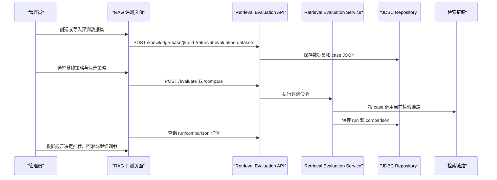
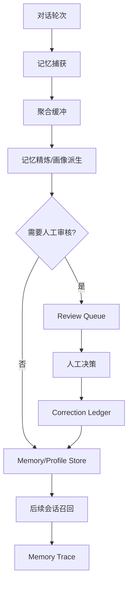
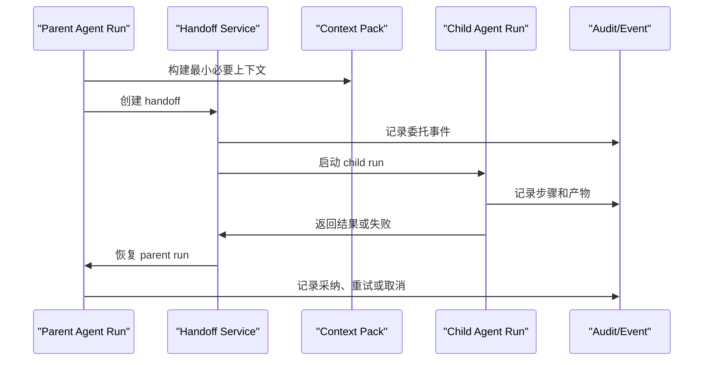

# 架构路线图与未来展望

日期：2026-06-14

本文基于当前代码基线规划 Seahorse Agent 后续演进。所有“未来”表述都表示设计方向，不表示当前已经完成；当前运行态以 `docs/architecture/current-code-architecture.md` 为准。

## 愿景

Seahorse Agent 的目标不是只做一个能聊天的 RAG Demo，而是形成一个可证据化、可治理、可持续演进的企业智能体平台：

- 面向知识工作流，能把文档、工具、记忆、画像和任务执行串成闭环。
- 面向企业治理，能把权限、审计、配额、成本、评测、观测和回滚纳入默认工程路径。
- 面向长期智能体，能把用户偏好、组织知识和执行经验沉淀成可解释、可校正、可遗忘的记忆系统。

## 设计原则

| 原则 | 含义 |
|---|---|
| 证据优先 | 能力是否生效，以 API、Trace、表数据、E2E 和运维指标判断，不以类名或文档承诺判断。 |
| 内核稳定 | 领域内核只依赖端口和领域对象，外部 SDK 始终停留在 adapter 层。 |
| 闭环优先 | 新能力必须说明“产生什么数据、谁消费、如何观察、如何失败恢复”。 |
| 默认可降级 | 模型、向量库、搜索、缓存、MQ 和存储都应保留清晰降级或替换路径。 |
| 治理内建 | 记忆、RAG、Agent、Tool、Skill 的权限、审计、配额和评测不是后补功能。 |

## 当前基线

当前代码已经提供：

- Clean Architecture + Ports and Adapters 模块边界。
- 轻量部署和全量部署两条 Docker 路径。
- 真实 RAG 所需的 Milvus、Ollama Embedding、Elasticsearch、RAG Trace。
- 记忆、用户画像、outbox、readiness、maintenance、quality/conflict 管理接口。
- Agent、Tool、Skill、审批、配额、资源 ACL、审计、成本等企业能力接口和前端入口。
- Spring Boot autoconfigure、starter-core、starter-all 的基础边界。

当前仍要谨慎看待的边界：

- 轻量部署不能代表真实 RAG 质量。
- 记忆闭环是否生效必须看运行证据，不能只看默认开关。
- 自训练仍是人工导出边界，不是自动训练闭环。
- S3/MinIO 已具备编排基础，但当前默认存储仍是 local。
- 企业 Agent 的部分页面和接口已有骨架，生产级能力还需要更多 E2E、审计和回滚证据。

## 近期设计（0-4 周）

目标：把本地全量部署、登录、RAG、记忆、画像和文档事实源收敛成稳定的日常开发基线。

| 方向 | 设计内容 | 成功证据 |
|---|---|---|
| 登录与会话稳定性 | 固化 `Authorization: Bearer <token>`、前端 `/api` 代理和后端直连路径差异；补充登录过期诊断。 | 登录后直调 `/knowledge-base` 不再误报过期；Redis/local token 边界清楚。 |
| RAG 冒烟标准化 | 固化知识库创建、上传、分块、向量化、SSE 问答和 Trace 检查步骤。 | `t_knowledge_chunk` 有数据，`/admin/traces` 有 retrieval 节点。 |
| 记忆画像 E2E | 固化个人事实输入、聚合等待或手动 maintenance、profile facts 查询、新会话召回。 | `/memories/readiness` 必需链路有证据，`t_user_profile_fact` 有 active 事实。 |
| 文档事实源收敛 | 持续把旧 RepoWiki 文档中的部署入口、端口、默认模型、账号和 API 路径对齐当前代码。 | stale reference 扫描无旧 compose 和不存在 quick-start 引用。 |
| Embedding 配置清晰化 | 明确全量默认 `nomic-embed-text` + 768；切换模型必须重建向量索引。 | 文档、compose 和排错指南口径一致。 |

近期不扩展新产品边界，优先让已有闭环可重复验证。

## 中期设计（1-3 个月）

目标：从“能跑通”升级到“能评估、能治理、能解释”。

| 方向 | 设计内容 | 成功证据 |
|---|---|---|
| RAG 质量评测 | 建立检索数据集、策略模板、版本对比、空召回率和命中质量指标。 | `/knowledge-base/{kb-id}/retrieval-evaluation-*` 能产出可对比报告。 |
| 入库治理 | 把 PDF/Feishu/OpenAPI 等来源统一到 ingestion pipeline，补齐失败重试、节点日志、隔离和回滚。 | 入库任务节点状态可追踪，失败任务可重放或人工修复。 |
| 记忆质量治理 | 强化冲突检测、质量快照、review feedback、纠错 ledger、低价值记忆清理。 | `/memories/conflicts`、`/memories/quality-snapshots` 和 maintenance run 可解释。 |
| 用户画像可信度 | 画像事实增加来源、置信度、冲突状态和撤销路径；前端提供更清晰的管理入口。 | 用户能查看、修正、停用画像事实，修正影响后续召回。 |
| Agent 生产准备 | Agent 定义、版本、rollout、approval、artifact、cost summary 形成可审核闭环。 | 每次 Agent run 可追踪步骤、审批、产物、成本和恢复动作。 |
| starter-all 验收 | 在真实 Redis、Pulsar、Milvus、Elasticsearch、S3/OpenAI-compatible 环境逐个验证重型 adapter Bean。 | `starter-all` 不只 classpath 冒烟，还能在真实依赖可用时创建关键 Bean。 |

中期重点不是堆功能，而是让 RAG 和记忆结果“可比较、可纠错、可治理”。

### 中期详细设计方案

中期方案以“质量闭环”和“生产准备”为主线，优先复用当前已经存在的 Controller、端口、数据库表和前端入口。新增能力必须先落在现有边界内，只有当现有表或端口无法表达审计、回滚或评测证据时，才新增迁移脚本。

#### M1. RAG 质量评测与策略治理

**设计目标**：让每个知识库都能用固定数据集验证检索策略，形成“数据集 -> 运行 -> 对比 -> 策略发布/回滚”的闭环。

| 设计项 | 方案 |
|---|---|
| 现有基座 | `SeahorseRetrievalEvaluationController`、`SeahorseRetrievalEvaluationDatasetController`、`SeahorseRetrievalStrategyTemplateController`、`t_retrieval_evaluation_dataset`、`t_retrieval_evaluation_run`、`t_retrieval_evaluation_comparison`、`t_retrieval_strategy_template`、前端 `RagEvaluationPage` |
| 核心对象 | Evaluation Dataset、Evaluation Case、Retrieval Strategy、Run、Comparison、Promotion Decision |
| 数据集格式 | 每个 case 至少包含 `query`、`expectedChunkIds` 或 `expectedKeywords`、`negativeChunkIds`、`tags`、`minRecall`、`minPrecision` |
| 运行指标 | recall@k、precision@k、MRR、空召回率、平均检索耗时、重排耗时、metadata filter 命中率 |
| 策略版本 | 使用 `t_retrieval_strategy_template` 管理策略模板；每次评测运行记录 strategy snapshot，避免后续模板变更污染历史报告 |
| 发布路径 | 评测对比通过后，把策略标记为推荐模板；未通过时只保留 comparison report，不影响线上检索 |

**核心流程**：

**实施切片**：

1. 数据集治理：补齐导入、导出、启停、标签、case 校验和重复 query 检测。
2. 运行稳定性：为评测运行增加幂等 key、超时、最大 case 数、失败 case 继续执行策略。
3. 对比报告：前端展示 baseline/candidate 的指标差异、失败 case、命中 chunk 明细和 trace 链接。
4. 策略推广：通过显式按钮把候选策略标为推荐模板；推广动作写入 audit event。
5. CI 冒烟：准备一个小型内置 dataset，用 Docker full 模式跑最小评测，验证接口、表记录和前端详情页。

**验收证据**：

- API 能创建 dataset、运行评测、查询 run、生成 comparison。
- `t_retrieval_evaluation_run` 和 `t_retrieval_evaluation_comparison` 有可追溯记录。
- 修改 metadata filter 或 topK 后，对比报告能显示指标变化。
- 前端能从失败 case 进入对应 RAG trace 或 chunk 明细。
- 未通过评测的策略不能被误标为线上推荐策略。

**风险与回退**：评测流量不得复用线上请求配额；评测失败只影响 report，不改变知识库配置。若评测运行过慢，先限制 case 数和并发，再设计异步队列。

#### M2. 入库治理与可恢复 Pipeline

**设计目标**：把文件、Feishu、OpenAPI、GitHub/Web 等来源统一为可观测、可重放、可隔离的 ingestion pipeline。

| 设计项 | 方案 |
|---|---|
| 现有基座 | `SeahorseIngestionPipelineController`、`SeahorseIngestionTaskController`、`KernelIngestionPipelineService`、`KernelIngestionTaskService`、`KernelIngestionEngine`、`t_ingestion_pipeline`、`t_ingestion_pipeline_node`、`t_ingestion_task`、`t_ingestion_task_node`、前端 `IngestionPage` |
| 节点模型 | fetch、parse、normalize、metadata-extract、chunk、embed、vector-index、keyword-index、publish、notify |
| 任务状态 | pending、running、completed、failed、cancelled、quarantined、retrying |
| 幂等边界 | source fingerprint + pipeline version + document target，避免重复写入 chunk 和向量 |
| 隔离策略 | 解析失败、元数据低置信度、敏感内容命中时进入 quarantine，不直接进入可检索知识库 |

**核心流程**：

1. 管理员创建 pipeline，并选择来源、解析器、分块策略、embedding 模型、索引目标和失败策略。
2. 任务创建后写入 `t_ingestion_task`，每个节点执行结果写入 `t_ingestion_task_node`。
3. fetch/parse/chunk/embed/index 任一节点失败时，记录 `errorCode`、`errorMessage`、输入摘要和可重试标记。
4. 可重试任务从失败节点继续，不重复执行已成功且幂等的节点。
5. quarantine 任务只能由人工修复、忽略或重新入库，动作写入 audit event。

**实施切片**：

1. Pipeline 版本化：为 pipeline 保存 version/snapshot，任务引用 snapshot，避免执行中配置漂移。
2. 节点日志增强：统一节点输入摘要、输出摘要、耗时、重试次数、错误分类和下游影响。
3. 重放机制：新增 task retry API，支持从失败节点或指定节点开始重放。
4. 隔离队列：把 metadata review/quarantine 与 ingestion task 关联，前端展示处理入口。
5. 回滚策略：对已写入的 document/chunk/vector/index 建立补偿动作，支持“撤销本次入库”。

**验收证据**：

- PDF 上传、Feishu 同步、OpenAPI 导入至少各有一个可运行 pipeline。
- 失败任务能看到失败节点、错误原因、输入摘要和 retry 按钮。
- 重试不会重复创建相同 document/chunk/vector。
- quarantine 任务不会出现在检索结果中。
- 任务完成后能从 task 跳到 knowledge document、chunk 和 RAG trace。

**风险与回退**：节点补偿不完整时，先提供“停用文档 + 删除索引”保守回滚。外部来源不稳定时，fetch 节点必须记录 source etag/version，避免误把临时失败当成内容删除。

#### M3. 记忆质量与用户画像可信度治理

**设计目标**：让记忆和画像不仅能生成，还能解释来源、处理冲突、接受人工修正，并影响后续召回。

| 设计项 | 方案 |
|---|---|
| 现有基座 | `SeahorseMemoryReviewController`、`SeahorseMemoryRecallEvaluationController`、`SeahorseMemoryTraceController`、`SeahorseUserMemoryController`、`MemoryGovernancePage`、`t_memory_review_candidate`、`t_memory_review_feedback_sample`、`t_memory_conflict_log`、`t_memory_quality_snapshot`、`t_memory_correction_ledger`、`t_user_profile_fact` |
| 质量维度 | 准确性、可解释性、时效性、隐私风险、重复度、冲突状态、召回价值 |
| 画像事实 | slotKey、value、confidence、sourceMemoryId、generationId、status、version、lastReferencedAt、accessCount |
| 人工动作 | approve、reject、correct、merge、forget、downgrade-confidence |
| 召回约束 | 隐私设置优先生效；低置信度或冲突事实默认不进入 prompt，只进入候选解释 |

**核心流程**：

**实施切片**：

1. 画像详情页：展示每个 profile fact 的来源对话、来源记忆、置信度、冲突、版本和引用次数。
2. 冲突工作台：把 `t_memory_conflict_log`、候选记忆、画像事实和纠错 ledger 关联成一个处理视图。
3. 召回评测：建立 golden cases，覆盖“用户职业偏好”“称呼偏好”“禁用记忆”“冲突事实”等场景。
4. 低价值清理：按质量快照和 accessCount 设计清理建议，人工确认后再执行 forget/merge。
5. 隐私闭环：用户删除个人记忆后，相关 profile fact 和派生索引必须同步失效。

**验收证据**：

- 输入“我偏好 X”后，`t_user_profile_fact` 生成 active 事实，详情页能看到来源。
- 用户修正画像后，新会话召回修正后的事实，旧事实不再进入 prompt。
- 冲突事实进入 review queue，而不是直接覆盖高置信事实。
- 删除/隐私关闭后，memory trace 显示该用户事实被过滤。
- maintenance run 产出 quality snapshot，并能定位低质量记忆。

**风险与回退**：画像事实进入 prompt 前必须保守过滤；当来源证据不足时宁可进入 review queue。任何自动 merge/forget 在中期都需要人工确认，不做无审计的静默删除。

#### M4. Agent 生产准备与发布治理

**设计目标**：把 Agent 从“能运行”推进到“可发布、可灰度、可审批、可回滚、可计费、可审计”。

| 设计项 | 方案 |
|---|---|
| 现有基座 | `SeahorseAgentDefinitionController`、`SeahorseAgentFactoryController`、`SeahorseAgentRunController`、`SeahorseAgentRolloutController`、`SeahorseAgentEvalController`、`SeahorseApprovalController`、`SeahorseProductionGateController`、`SeahorseCostUsageController`、`SeahorseAuditEventController` |
| 数据基座 | `sa_agent_definition`、`sa_agent_version`、`sa_agent_run`、`sa_agent_step`、`sa_agent_checkpoint`、`sa_agent_tool_binding`、`sa_approval_request`、`sa_agent_eval_summary`、`sa_agent_version_rollout`、`sa_cost_usage_record`、`sa_audit_event` |
| 发布门禁 | 配置完整性、工具权限、Skill 安全扫描、评测结果、成本预算、审批策略、回滚点 |
| 灰度策略 | 按用户、租户、百分比或手动指定 run；每个 rollout 保留 promotion/rollback 事件 |
| 运行证据 | run snapshot、step graph、checkpoint、artifact、approval、cost summary、audit event |

**实施切片**：

1. 发布前检查：把已有 validate、publish-check、production-gate 输出合并为一个可读报告。
2. Agent Eval：要求每个可发布版本绑定至少一个 eval summary，并记录失败样本。
3. 灰度面板：展示 rollout 当前比例、错误率、平均成本、人工审批等待数和 rollback 按钮。
4. 成本治理：每次 agent run 汇总 token、工具调用、模型费用和预算命中情况。
5. 审计闭环：发布、暂停、升级、回滚、审批和高风险工具调用都写入 audit event。

**验收证据**：

- 无工具权限或无评测报告的 Agent 不能直接发布为生产版本。
- canary rollout 能暂停、提升、回滚，并保留版本激活记录。
- 高风险工具调用会产生 approval request，审批结果影响 run resume。
- Agent run 详情能看到步骤、checkpoint、artifact、cost 和 audit。
- 回滚后新 run 使用旧稳定版本，历史 run 仍引用原版本快照。

**风险与回退**：生产发布默认走保守门禁；任何 gate 检查不可用时，状态应为 blocked 或 needs-review，不能默认为通过。

#### M5. starter-all 和完整部署验收

**设计目标**：让全量部署从“容器能启动”升级为“关键 adapter 在真实依赖下能创建 Bean 并通过最小业务闭环”。

| Adapter | 验收场景 |
|---|---|
| Milvus / PgVector | 创建知识库、写入向量、检索命中 |
| Elasticsearch / Lucene | 关键词索引写入和 hybrid recall |
| Redis | 登录态、缓存、信号量或 stream task 可用 |
| Pulsar / Direct MQ | outbox 或后台任务可发布/消费 |
| S3 / Local storage | 上传原文、下载附件、切换存储模式 |
| OpenAI-compatible / Ollama | Chat、Embedding、Rerank 的失败降级路径明确 |
| Micrometer / Noop observation | `/actuator/prometheus` 和关键指标存在 |

**实施切片**：

1. 建立 adapter 验收矩阵，列出配置项、依赖容器、健康检查和最小业务动作。
2. 为 starter-core、starter-all 增加 classpath 与 Bean 条件测试。
3. 用 full compose 跑 smoke suite：登录、入库、RAG、记忆、Agent run、指标采集。
4. 把失败项写入 `docs/TROUBLESHOOTING_GUIDE.md`，形成排障闭环。

**验收证据**：full compose 环境下 smoke suite 通过；失败时能定位到具体 adapter、配置项或外部依赖，而不是只看到统一启动失败。

## 远期设计（3-6 个月）

目标：把单 Agent / 单知识库能力扩展为面向组织工作流的多 Agent 平台。

| 方向 | 设计内容 | 成功证据 |
|---|---|---|
| Agent Factory UI | 从模板、工具、Skill、权限、预算、评测集生成可发布 Agent。 | 非开发者可创建、验证、发布和回滚 Agent。 |
| Sandbox Runtime | 为工具执行、代码执行、网页抓取和文件处理提供隔离、审计、产物扫描。 | 高风险工具调用默认经过沙箱和审批策略。 |
| Multi-Agent / A2A | 支持 Agent 之间任务委托、交接、上下文包、责任边界和失败恢复。 | 一个复杂任务能拆分给多个 Agent，且每段都有 trace 和 ownership。 |
| Context Pack | 把知识库、记忆、工具权限、用户画像、任务目标打包成可复用上下文资产。 | Agent run 可以声明使用的 context pack，并记录版本。 |
| 企业数据边界 | 强化多租户、RLS、资源 ACL、审计、配额和成本策略的联动。 | 同一接口在不同租户/角色下有可验证的隔离和审计证据。 |
| 存储生产化 | 将 local storage 与 MinIO/S3 之间的切换、迁移、生命周期策略文档化和测试化。 | 附件、产物、入库原文可在 S3 模式下端到端验证。 |

远期重点是“组织级协作”，需要比单次问答更强的任务状态、权限和恢复模型。

### 远期详细设计方案

远期方案以“组织级多 Agent 工作流”为主线。这个阶段不再只验证单个接口，而是要求每个能力都具备版本、权限、上下文、审计、成本和失败恢复模型。

#### L1. Agent Factory 产品化

**设计目标**：让非开发者可以从模板创建 Agent，并在发布前完成工具、Skill、知识、预算和评测配置。

| 设计项 | 方案 |
|---|---|
| 现有基座 | `AgentFactoryInboundPort`、`KernelAgentFactoryService`、`SeahorseAgentFactoryController`、`sa_agent_template`、`sa_agent_publish_check`、前端 Agent create/editor/rollout 页面 |
| 模板内容 | persona、system prompt、默认 tools、默认 skills、推荐 context pack、预算、风险等级、评测集 |
| 创建流程 | 选择模板 -> 填写业务目标 -> 绑定知识库/工具/Skill -> 配置预算和审批 -> 运行测试 -> 生成 draft version |
| 发布流程 | validate -> eval -> production gate -> canary rollout -> promote 或 rollback |

**页面与交互设计**：

- 模板库：按业务场景、风险等级、使用量和评分筛选。
- 创建向导：每一步只保存 draft，不直接发布。
- 生产检查页：把缺失项按 blocking、warning、info 展示。
- 版本页：展示版本差异、评测结果、灰度状态和回滚入口。

**实施切片**：

1. 模板 schema 固化：为模板内容定义 JSON schema 和后端校验。
2. 向导保存：所有步骤落到 draft agent/version，支持离开后恢复。
3. 差异对比：展示 prompt、工具、Skill、预算、评测集的版本差异。
4. 模板治理：模板启停、推荐、复制、归档写入 audit event。

**验收证据**：

- 管理员能从模板创建 draft Agent，并完成一次测试 run。
- 发布前检查能阻止缺少 eval 或高风险工具未审批的版本。
- 模板变更不影响已经创建的 Agent version snapshot。

#### L2. Sandbox Runtime 生产化

**设计目标**：为代码执行、网页抓取、文件处理、图像/文档生成等高风险工具提供隔离执行、产物扫描和审计。

| 设计项 | 方案 |
|---|---|
| 现有基座 | `SandboxRuntimeInboundPort`、`KernelSandboxRuntimeService`、`DefaultSandboxPolicyPort`、`SeahorseSandboxController`、`sa_sandbox_session`、`sa_sandbox_execution`、`sa_sandbox_artifact`、前端 `SandboxPage` |
| Runtime 类型 | local-safe、container、remote-worker；默认只启用 local-safe 或显式配置的 container |
| 策略输入 | tenant、user、agent、tool、runtimeType、networkPolicy、resourceLimits、requestedArtifacts |
| 策略输出 | allow、deny、require-approval、resource-limited、network-blocked |
| 产物处理 | 存储对象、MIME 检测、大小限制、敏感内容扫描、下载审计 |

**执行流程**：

1. Agent 或用户创建 sandbox session。
2. PolicyPort 根据工具风险、租户策略和资源预算做决策。
3. 执行命令前写入 execution record，执行后更新 exitCode、stdout/stderr 摘要、耗时和资源使用。
4. 产物先进入 scan pending，扫描通过后才能下载或注入后续上下文。
5. 高风险执行需要 approval，审批结果进入 audit event。

**实施切片**：

1. 资源限制：限制 CPU、内存、超时、输出长度、文件大小和网络访问。
2. 产物安全：实现 MIME/扩展名校验、敏感内容标记、下载审计。
3. Worker 隔离：将 container runtime 抽象成 outbound port，先支持本地 Docker，后续支持远端 worker。
4. Agent 接入：高风险工具默认走 sandbox，低风险只记录 audit。

**验收证据**：

- 超时、超大输出、越权路径、禁用网络都能被拒绝或截断。
- 产物未扫描通过前不可下载，不可进入 context pack。
- 每次执行都有 session、execution、artifact 和 audit 记录。

**风险与回退**：container runtime 未稳定前，不允许默认打开代码执行；所有失败都应返回可解释的 policy reason，而不是吞掉异常。

#### L3. Multi-Agent / A2A 协作

**设计目标**：支持一个 Agent 把子任务委托给另一个 Agent，并保留清晰责任边界、上下文包、状态传播和失败恢复。

| 设计项 | 方案 |
|---|---|
| 现有基座 | `AgentHandoffInboundPort`、`KernelAgentHandoffService`、`LocalAgentAsToolPort`、`SeahorseAgentHandoffController`、`sa_agent_handoff`、`sa_agent_run`、`sa_agent_step`、`sa_agent_checkpoint` |
| 协作对象 | parent run、child run、handoff、context pack、handoff result、ownership |
| 委托模式 | agent-as-tool 同步调用、异步 handoff、人工审批后 handoff |
| 状态传播 | parent waiting -> child running -> child completed/failed/cancelled -> parent resume |
| 失败恢复 | child retry、fallback agent、人工接管、取消 handoff、parent rollback checkpoint |

**核心流程**：

**实施切片**：

1. Handoff contract：明确 parent/child run 的输入输出、取消、重试和超时字段。
2. ContextPack 最小化：只传递任务目标、必要记忆、知识片段、工具权限和敏感度标签。
3. Agent-as-tool：把本地 Agent 暴露为 ToolPort，但强制通过权限、预算和循环深度限制。
4. 可视化：在 run workflow 中展示 parent/child 节点和 handoff 状态。
5. 防循环：限制 handoff depth、同源 Agent 递归和总成本预算。

**验收证据**：

- 一个任务能被拆给子 Agent，父 run 等待并在子 run 完成后恢复。
- 子 Agent 失败时，父 run 能显示失败原因并选择重试、改派或人工接管。
- Handoff 的 context pack 可查看，且不包含未授权资源。
- 成本、审计、审批和 artifact 能跨 parent/child 聚合查询。

#### L4. Context Pack 作为上下文资产

**设计目标**：把知识片段、用户画像、记忆、附件、工具权限、任务目标和预算打包成可版本化、可审计、可复用的上下文资产。

| 设计项 | 方案 |
|---|---|
| 现有基座 | `ContextPackBuilderInboundPort`、`ContextPackQueryInboundPort`、`KernelContextPackBuilderService`、`KernelContextPackQueryService`、`ContextReducer`、`sa_context_pack`、`sa_context_item`、前端 `ContextPackPage` |
| item 类型 | knowledge_chunk、memory、profile_fact、attachment、tool_permission、task_goal、system_policy、handoff_result |
| 评分字段 | score、confidence、sensitivity、tokenEstimate、sourceType、sourceId |
| 构建策略 | 预算优先、敏感度过滤、ACL 过滤、去重、摘要压缩、保留来源引用 |
| 使用边界 | Agent run、handoff、sandbox execution、RAG prompt 都只引用 pack snapshot，不读动态可变上下文 |

**实施切片**：

1. Pack Builder 策略：实现按任务目标和预算选择 item 的规则，并记录被过滤原因。
2. Pack Diff：对比两次构建的新增、删除、降权和敏感过滤项。
3. Pack Explain：前端展示每个 item 为什么进入 pack，以及被谁消费。
4. Pack Retention：按租户策略保留或清理 pack，保留 audit 和最小摘要。

**验收证据**：

- Agent run 详情能看到使用的 context pack 版本和 items。
- 未授权知识库、隐私关闭记忆和敏感附件不会进入 pack。
- 同一任务在相同输入下可重建近似一致的 pack，并能解释差异。

#### L5. 企业数据边界与治理联动

**设计目标**：把 tenant、RLS、ACL、quota、audit、cost 和 billing 串成默认执行路径，而不是分散页面。

| 能力 | 现有基座 | 远期设计 |
|---|---|---|
| 租户隔离 | `TenantInterceptor`、`TenantContext`、RLS migration、`/api/admin/tenants` | 所有资源表补齐 tenant_id、查询默认带 tenant，上下文包和 Agent run 不跨租户 |
| 资源权限 | `ResourceAclManagementInboundPort`、`sa_resource_acl_rule`、`/api/resource-acl-rules` | Agent、Tool、Knowledge、Context item 都通过统一 ResourceAccessPolicy 决策 |
| 配额成本 | `QuotaManagementInboundPort`、`CostUsageInboundPort`、`sa_quota_policy`、`sa_cost_usage_record` | 每次模型调用、工具调用、sandbox 执行、agent run 统一计量并影响 quota decision |
| 审计 | `AuditQueryInboundPort`、`sa_audit_event`、`sa_audit_log` | 所有发布、审批、越权拒绝、数据导出和高风险执行都进入统一审计查询 |
| 计费 | `BillingInboundPort`、billing tables | 把成本 rollup、订阅、账单和 marketplace revenue 串起来 |

**实施切片**：

1. 统一资源标识：定义 `resourceType/resourceId/action/subject`，所有 ACL、audit、quota 复用。
2. 执行前决策：Agent run、tool invocation、context pack build、sandbox execution 前先评估 ACL 和 quota。
3. 执行后记账：记录 cost usage、audit event、access decision log。
4. 管理端联动：从任一 run 能跳到权限决策、成本明细、审计事件和账单归属。

**验收证据**：

- 不同租户访问同一接口看到不同数据，且数据库 RLS 与应用过滤一致。
- 超预算用户无法启动高成本 Agent run，拒绝原因可解释。
- 越权访问写入 access decision log 和 audit event。

#### L6. 存储生产化与生命周期管理

**设计目标**：把 local storage 和 MinIO/S3 的切换变成可迁移、可验证、可回滚的生产能力。

| 设计项 | 方案 |
|---|---|
| 存储对象 | 原始文档、对话附件、Agent artifact、sandbox artifact、导出包、账单附件 |
| 元数据 | storageMode、bucket、objectKey、checksum、contentType、size、retentionPolicy、scanStatus |
| 迁移路径 | local -> S3 双写校验 -> 读切换 -> local 冷备清理 |
| 生命周期 | 临时产物 TTL、审计保留、用户删除、租户归档、合规导出 |

**实施切片**：

1. 对象引用规范：所有业务表只存 object reference，不直接存本地路径。
2. 双写校验：关键对象支持 local/S3 双写，校验 checksum 后切换读取。
3. 清理任务：按对象类型和租户策略清理临时文件，保留审计摘要。
4. E2E：上传文档、生成 artifact、sandbox 产物、导出任务都在 S3 模式下跑通。

**验收证据**：切换 S3 模式后，文档入库、附件下载、Agent artifact、sandbox artifact、导出任务都可用；回切 local 有明确限制和迁移说明。

## 未来展望（6 个月以上）

未来 Seahorse Agent 可以演进为一个企业智能运营底座：

- **自适应知识运营**：系统自动发现低质量知识、过期知识、冲突知识和高价值知识缺口，驱动人工或 Agent 修复。
- **可解释记忆网络**：用户画像、长期记忆、实体关系和任务历史能形成可视化、可校正、可遗忘的个人/组织记忆。
- **持续评测驱动发布**：RAG 策略、Agent 版本、模型供应商和工具链变更都经过自动评测、灰度和回滚。
- **多模型供应链治理**：Chat、Embedding、Rerank、多模态模型可按成本、质量、延迟和合规策略动态路由。
- **企业 Agent 市场**：Agent、Tool、Skill、Context Pack 可以被发布、订阅、评分、审计和计费。
- **人机协作控制面**：审批、异常接管、任务暂停/恢复、产物验收和审计成为默认交互，而不是事后补救。

这些方向都必须保持同一条底线：任何智能能力都要有证据、有边界、有退出机制。

### 未来展望详细设计方案

未来展望不是空泛愿景，而是把中远期形成的能力进一步产品化、平台化。这里的方案按“平台能力包”组织，每个能力包都需要独立里程碑、独立验收和独立退出机制。

#### F1. 自适应知识运营

**目标**：系统持续发现低质量、过期、冲突、重复和缺失知识，并通过人工或 Agent 任务完成修复。

| 层级 | 设计 |
|---|---|
| 发现层 | 定时扫描 RAG trace、低命中 query、用户反馈、metadata quarantine、过期文档 schedule |
| 诊断层 | 为每个问题生成 issue：问题类型、影响范围、证据 trace、候选修复动作 |
| 修复层 | 轻风险问题自动重建索引；高风险问题创建 ingestion/Agent 修复任务并要求人工审批 |
| 验证层 | 修复后自动跑 retrieval evaluation dataset，对比修复前后指标 |
| 治理层 | issue、修复任务、审批、评测报告和 audit event 形成闭环 |

**实施路径**：

1. 建立 knowledge quality issue 模型，先可复用 metadata review/quarantine 和 eval candidate。
2. 从 RAG trace 中聚合空召回、高延迟、用户差评和低置信答案。
3. 为 issue 生成建议动作：重新入库、补 metadata、拆分文档、调整策略、人工补充 FAQ。
4. 接入 Agent run，让 Agent 生成修复草案，但发布前必须经过审核和评测。

**验收证据**：

- 系统能从真实低质量 query 自动生成 issue。
- issue 能关联 trace、chunk、document、evaluation case 和修复任务。
- 修复动作完成后，评测指标改善或明确标记为无效修复。

**退出机制**：自动修复默认只允许重建索引和重新评测；任何内容改写、删除、发布都要人工确认。

#### F2. 可解释记忆网络

**目标**：把用户画像、长期记忆、实体别名、实体关系、任务历史和纠错记录组合成可解释、可校正、可遗忘的记忆网络。

| 层级 | 设计 |
|---|---|
| 节点 | memory、profile_fact、entity_alias、entity_relation、conversation、agent_run、correction |
| 边 | derived-from、conflicts-with、corrected-by、referenced-by、merged-into、forgotten-by |
| 查询 | 按用户、租户、slotKey、实体、任务、时间窗口查询 |
| 展示 | 记忆图谱、画像时间线、冲突视图、删除影响分析 |
| 控制 | 隐私模式、单事实删除、级联失效、重新召回验证 |

**实施路径**：

1. 先复用 `t_memory_entity_alias`、`t_memory_entity_relation`、`t_user_profile_fact`、`t_memory_correction_ledger`。
2. 增加 memory lineage 查询端口，聚合来源和派生关系，不先引入独立图数据库。
3. 前端提供“为什么你记得这个”的解释入口。
4. 删除或修正事实时，展示将被影响的 profile fact、索引和后续召回。

**验收证据**：

- 任一 profile fact 能追溯到原始对话或记忆。
- 用户删除某条记忆后，相关画像和索引失效，后续召回不再使用。
- 冲突修复后，图谱显示旧事实被 superseded，而不是静默覆盖。

**退出机制**：图谱解释只作为辅助视图；召回链路仍以现有 memory retrieval pipeline 为主，避免把核心路径过早绑定到图数据库。

#### F3. 持续评测驱动发布

**目标**：RAG 策略、Agent 版本、模型供应商、工具链和 Skill 变更都必须经过自动评测、灰度、观测和回滚。

| 对象 | 发布门禁 |
|---|---|
| RAG Strategy | retrieval evaluation comparison 达标，空召回率不回退 |
| Agent Version | eval summary 达标，生产检查通过，预算与工具权限有效 |
| Model Config | 成本、延迟、错误率、质量集达标，具备回滚配置 |
| Tool / Skill | 安全扫描通过，权限范围明确，有审计和审批策略 |
| Ingestion Pipeline | 测试文档入库成功，metadata/chunk/vector/index 完整 |

**实施路径**：

1. 定义统一 GateResult：status、blockingIssues、warnings、metrics、evidenceRefs。
2. 每类对象提供 gate adapter，把已有 eval、readiness、audit、cost 数据汇总成 GateResult。
3. 发布动作只消费 GateResult，不直接耦合各模块内部实现。
4. 灰度期间持续采集指标，触发自动暂停或建议回滚。

**验收证据**：

- 未通过 GateResult 的对象不能发布到 production。
- GateResult 可追溯到具体 run、dataset、audit、cost 和配置快照。
- 灰度异常能暂停 rollout，保留人工确认入口。

**退出机制**：自动回滚初期只做“建议回滚 + 一键回滚”，不做无人值守回滚，直到指标可靠性充分验证。

#### F4. 多模型供应链治理

**目标**：把 Chat、Embedding、Rerank、多模态模型纳入模型资产、成本、质量、延迟和合规策略管理。

| 层级 | 设计 |
|---|---|
| 模型注册 | 扩展 `sa_ai_model_config`，区分 provider、capability、dimension、contextWindow、price、risk |
| 路由策略 | 按任务类型、租户、预算、质量、延迟和合规要求选择模型 |
| 质量监控 | 对每个模型记录评测集结果、线上失败率、延迟和成本 |
| 切换安全 | Embedding 模型切换必须绑定向量维度和索引重建计划 |
| 回滚 | 模型配置变更保留版本，失败后快速回退 |

**实施路径**：

1. 先把管理端 AI config 与后端 `/admin/ai-config` 口径统一。
2. 模型配置增加 capability 和 dimension 校验，阻止错误 embedding 维度写入现有索引。
3. 对 Chat/Embedding/Rerank 分别建立小型质量基线。
4. 在 RAG/Agent run 中记录实际使用模型和成本。

**验收证据**：

- 管理员能查看每个模型的成本、延迟、质量和适用场景。
- 切换 embedding 模型时，系统提示并要求确认重建索引。
- 模型失败时能回退到上一版本配置或降级 provider。

**退出机制**：模型路由策略初期采用显式规则，不引入黑盒自动路由；所有自动选择都要记录原因。

#### F5. 企业 Agent 市场

**目标**：让 Agent、Tool、Skill、Context Pack 可以被发布、订阅、评分、审计和计费，形成企业内部或多租户市场。

| 层级 | 设计 |
|---|---|
| 发布 | 使用 `sa_agent_publish_review` 管理审核状态，发布包包含版本、权限、评测、成本和风险声明 |
| 订阅 | 使用 `sa_agent_subscription` 管理租户/用户可用范围 |
| 评分 | 使用 `sa_agent_rating`、`sa_agent_rating_summary`、`sa_agent_popularity` 形成质量反馈 |
| 收益 | 使用 `sa_revenue_share` 和 billing/cost usage 做分账基础 |
| 安全 | 市场发布必须经过工具权限、Skill 扫描、模型成本和数据边界检查 |

**实施路径**：

1. 先支持企业内部市场：管理员审核、租户订阅、用户启用。
2. 发布包必须引用不可变 Agent version 和评测报告。
3. 订阅后只授予使用权，不允许修改原始版本。
4. 收益和计费先做统计报表，再接自动结算。

**验收证据**：

- 一个 Agent version 能提交审核、通过、上架、订阅、运行和评分。
- 下架后新订阅被阻止，历史 run 仍可审计。
- 高风险 Agent 不能绕过审核直接进入市场。

**退出机制**：市场早期只做内部共享，不开放跨组织公开交易；付费结算必须晚于审计和风控成熟。

#### F6. 人机协作控制面

**目标**：把审批、异常接管、任务暂停/恢复、产物验收、通知和审计统一成操作面板。

| 场景 | 设计 |
|---|---|
| 审批 | 高风险工具、数据导出、发布、回滚、外部调用进入 approval center |
| 接管 | Agent run 卡住、失败、等待外部输入时允许人工接管并写入 checkpoint |
| 暂停/恢复 | run、rollout、pipeline、sandbox session 都有明确 pause/resume/cancel 语义 |
| 产物验收 | artifact 需要人工验收、评论、退回或发布 |
| 通知 | 通过 notification/webhook 推送审批、失败、账单、市场审核事件 |

**实施路径**：

1. 统一操作事件模型，把 approval、audit、notification、run status 关联。
2. 管理端提供“待我处理”视图，按风险和 SLA 排序。
3. 接管动作生成 checkpoint，Agent 后续恢复时能看到人工输入。
4. 每个关键动作都有 webhook 和通知偏好。

**验收证据**：

- 管理员能在一个视图处理审批、失败任务、待验收产物和发布门禁。
- 人工接管后的 Agent run 可恢复，且历史步骤不可篡改。
- 所有操作都能追溯到 actor、time、resource 和 reason。

**退出机制**：控制面只做调度和审计，不直接绕过底层模块权限；人工接管也必须经过 ACL 和 quota。

#### 未来阶段统一落地顺序

| 顺序 | 里程碑 | 完成标准 |
|---|---|---|
| 1 | 统一证据模型 | GateResult、AuditEvent、CostUsage、Trace、EvaluationReport 能互相引用 |
| 2 | 统一操作模型 | approve、pause、resume、cancel、rollback、publish、archive 语义一致 |
| 3 | 统一资源模型 | Agent、Tool、Skill、Knowledge、ContextPack、Artifact、Model 都有 resource identity |
| 4 | 统一风险模型 | 权限、隐私、成本、模型风险、工具风险和数据外发风险可组合评估 |
| 5 | 平台化发布 | 市场、模型供应链、持续评测和控制面可独立迭代但共享证据底座 |

未来阶段的核心约束是：任何自动化能力都必须先能解释、能审计、能人工接管，再谈自动优化。

## 路线图验收方法

每个阶段完成时，至少给出四类证据：

| 证据类型 | 示例 |
|---|---|
| 代码证据 | Controller、端口、adapter、自动配置和迁移脚本的位置 |
| 运行证据 | API 响应、Trace、数据库记录、消息/outbox 状态 |
| 测试证据 | 单元测试、契约测试、Docker E2E 或 Playwright 前端流 |
| 运维证据 | health/readiness、metrics、日志、失败恢复步骤 |

不满足运行证据的能力，只能写成“设计中”或“部分实现”，不能写成“完整闭环”。
