# Seahorse Agent：从零构建企业级 RAG 智能体平台的 12 个技术切面

> **导读**｜本文基于 Seahorse Agent 开源项目实际代码与设计文档，从架构设计、RAG 链路、记忆系统到多智能体编排，逐层拆解一个生产级 AI Agent 平台的工程实现。无论你是 AI 应用开发者、架构师还是技术管理者，都能从中获得"如何把 RAG + Agent 做到生产级"的实操参考。

---

## 📌 一、基本介绍

**Seahorse Agent** 是面向企业知识问答与智能体应用的 Agent 工程平台，首发核心能力是 **RAG 闭环**。

在大模型落地企业的过程中，团队普遍面临三个痛点：知识问答不准、智能体难维护、外部依赖绑架。Seahorse Agent 正是为解决这些问题而生。

**技术栈一览**

| 层级 | 技术选型 |
|------|---------|
| 后端 | Java 21 + Spring Boot 3.5.7 |
| 前端 | React 18 + TypeScript 5.5 + Vite 5.4 + TailwindCSS |
| 数据库 | PostgreSQL + MyBatis Plus 3.5.14 |
| 向量库 | Milvus 2.6.6 (HNSW) / pgvector / noop |
| 关键词 | Elasticsearch / Lucene |
| 缓存 | Redis (Redisson) / 本地缓存 |
| 消息队列 | Apache Pulsar 3.1.3 / Direct MQ |
| AI 模型 | OpenAI Compatible HTTP (OkHttp) |
| 文档解析 | Apache Tika 3.2.3 |
| 认证 | Sa-Token 1.43.0 |
| 可观测 | Micrometer + Prometheus + Grafana |

**四大已落地闭环**

| 闭环 | 实现边界 |
|------|---------|
| **RAG 闭环** | 知识库入库→分块→向量检索→关键词检索→后处理→Prompt 组装→SSE 回答 |
| **记忆闭环** | 对话记忆读取→捕获→聚合缓冲→outbox→维护→health |
| **画像闭环** | 从记忆候选派生用户画像事实，跨会话召回 |
| **Agent 闭环** | Agent 定义→运行→审批→工具→Skill→成本→配额→安全治理 |

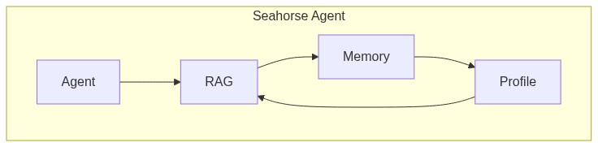

> **💡 设计哲学**
>
> Seahorse Agent 的项目定位不是"又一个 RAG Demo"，而是**面向生产环境的 Agent 工程平台**。这意味着：第一，它必须支持多种外部依赖的可插拔替换（企业不会容忍被单一向量库绑定）；第二，它需要具备企业级治理能力（多租户、配额、审计、安全）；第三，它需要在 RAG 准确率、系统稳定性和可维护性之间取得平衡。
>
> 这种定位决定了整个项目的架构基调——**"内核稳定，外围可换；链路可控，降级兜底"**。

---

## 📌 二、架构设计：Clean Architecture 的工程化实践

Seahorse Agent 的架构核心思想只有一句话——**"内核不依赖任何外部实现"**。

整个系统分为三层：微内核收敛领域逻辑，入站适配器转换协议，出站适配器对接基础设施。内核中定义了 **749 个端口接口**，所有外部依赖（AI 模型、向量库、缓存、消息队列等）都被隔离到独立适配器模块。

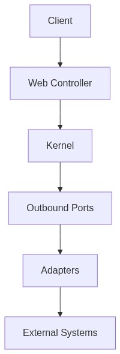

**端口-适配器模式伪代码**

```java
// 出站端口：向量检索契约
interface VectorSearchPort {
    List<RetrievedChunk> search(String collection, float[] vector, int topK);
}

// 适配器 A：Milvus 实现
class MilvusVectorAdapter implements VectorSearchPort { /* HNSW 检索 */ }

// 适配器 B：pgvector 实现  
class PgVectorAdapter implements VectorSearchPort { /* SQL 近邻检索 */ }

// 适配器 C：Noop（开发测试用）
class NoopVectorStoreAdapter implements VectorSearchPort { /* 返回空列表 */ }
```

内核模块 `seahorse-agent-kernel` 内部分层清晰：

| 包 | 职责 |
|---|------|
| `config` | 运行时模式（KernelRuntimeMode） |
| `application` | 应用服务（Chat / Knowledge / Memory / Ingestion / Intent / Retrieval） |
| `domain` | 领域模型与值对象 |
| `feature` | 可插拔特性接口（检索通道、入库节点、MCP 工具） |
| `plugin` | 插件化基础设施（ExtensionRegistry、AgentFeature） |
| `ports` | 端口接口（inbound / outbound） |

这种设计带来三个核心收益：**易于测试**（内存适配器替代真实系统）、**易于扩展**（新增适配器不改内核）、**易于运维**（配置切换适配器）。

> **💡 设计哲学**
>
> **依赖倒置是手段，业务稳定才是目的。** 端口接口的设计遵循"先定义契约，再实现适配器"的原则。以向量检索为例，内核先定义 `VectorSearchPort` 的行为契约，再由 Milvus、pgvector 等适配器分别实现。这意味着切换向量库时，内核代码**一行不改**。
>
> 架构上的另一个关键决策是**微内核而非微服务**。2378 个 Java 文件组织在一个仓库中，通过模块化实现关注点分离，避免了微服务带来的分布式复杂性。自动装配层（`seahorse-agent-spring-boot-autoconfigure`）负责在启动期根据配置文件组装 Bean，实现了"一个 JAR 包，多种部署形态"。
>
> **与其他模块的协作**：内核通过入站端口承接 Web 层请求，通过出站端口驱动适配器层，是整个系统的"中枢神经"。

---

## 📌 三、RAG 系统设计：从文档入库到流式回答

RAG 是 Seahorse Agent 的第一能力。完整链路经历 **8 个严格有序的阶段**。

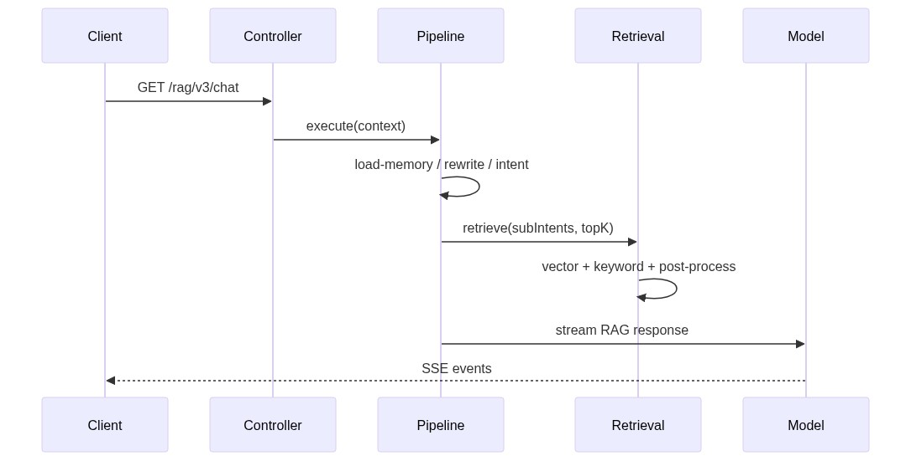

### 3.1 文档入库 Pipeline

入库引擎 `KernelIngestionEngine` 采用**可配置流水线**设计，每个节点是一个 `IngestionNodeFeature` 插件：


```java
// 伪代码：入库引擎编排
class KernelIngestionEngine {
    void execute(PipelineConfig config) {
        Map<String, NodeConfig> nodeMap = buildAndValidate(config);
        String current = findStartNode(nodeMap);
        while (current != null) {
            IngestionNodeFeature feature = registry.getFeature(current);
            NodeResult result = feature.execute(context, nodeMap.get(current));
            if (result.shouldStop()) { markFailed(); return; }
            current = nodeMap.get(current).getNextNodeId();
        }
        markCompleted();
    }
}
```

### 3.2 多通道检索引擎

检索质量决定 RAG 质量。`KernelMultiChannelRetrievalEngine` 支持四种通道**并行执行**：

| 通道 | 策略 |
|------|------|
| `VECTOR_GLOBAL` | 全局向量相似度 TopK |
| `INTENT_DIRECTED` | 按意图定向特定知识库 |
| `KEYWORD_ES` | Elasticsearch 倒排索引 |
| `HYBRID` | 向量 + 关键词 RRF 融合 |

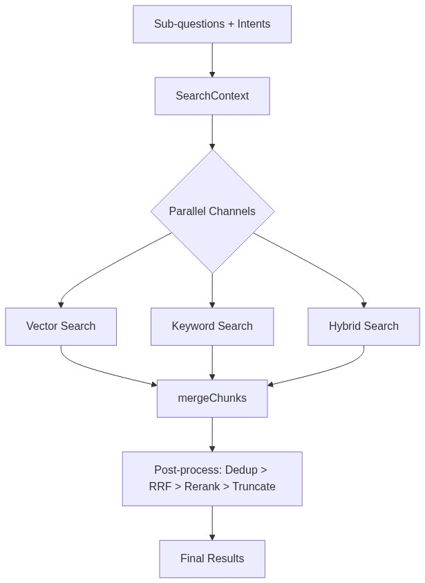

```java
// 伪代码：多通道检索
List<RetrievedChunk> retrieve(SearchContext ctx) {
    List<SearchChannelFeature> channels = registry.getActivated(ctx);
    // 并行执行各通道
    List<List<RetrievedChunk>> results = channels.parallelStream()
        .map(ch -> ch.search(ctx)).collect(toList());
    // 合并 + 后处理链
    List<RetrievedChunk> merged = mergeChunks(results);
    for (var pp : postProcessors) merged = pp.process(merged, ctx);
    return merged;
}
```

单通道异常只记录日志并返回空结果，**不影响其他通道**——这是生产级容错设计。

> **💡 设计哲学**
>
> RAG 链路的设计遵循三个原则：
>
> **① 阶段有序，短路优先。** Pipeline 的 8 个阶段严格按顺序执行，但在引导提示、系统仅回答、空检索三个节点设置了**短路出口**，避免无效计算。一个"你好"不应该触发向量检索。
>
> **② 多路召回，后处理兜底。** 单通道检索的召回率天然有限，多通道并行执行 + RRF 融合 + Rerank 后处理链，是工业界验证过的最佳实践。Seahorse 将此模式内化为 `SearchChannelFeature` + `SearchResultPostProcessorFeature` 的 SPI 设计，新通道和新后处理器可零侵入接入。
>
> **③ 容错不传播。** 单通道异常只记录日志并返回空结果，后处理异常只跳过该处理器。这确保了**任何一个环节的局部失败不会导致整条链路崩溃**。
>
> **与其他模块的协作**：RAG Pipeline 消费记忆系统提供的上下文，消费意图树提供的意图分类结果，并将检索结果交给模型适配器生成最终响应。RAG Trace 则将每个阶段的耗时和证据写入数据库，供可观测性模块消费。

---

## 📌 四、上下文管理与压缩

多轮对话最大的挑战是：**记得住，但不爆掉**。

### 4.1 四层记忆限量读取

在 `KernelChatPipeline` 的第一阶段，系统通过 `DefaultMemoryEnginePort` 编排四层记忆读取，并有严格的数量限制：

| 记忆层 | 限量 | 用途 |
|--------|------|------|
| 工作记忆 (Working) | 当前会话上下文 | 即时对话 |
| 短期记忆 (Short-term) | 最多 5 条 | 近期对话摘要 |
| 长期记忆 (Long-term) | 最多 3 条 | 重要事实 |
| 语义记忆 (Semantic) | 最多 10 条 | 结构化用户偏好 |

### 4.2 查询重写与压缩

`QueryRewritePort` 对原始问题和历史进行**重写与拆分**，将模糊的多轮追问转化为精确的子问题：

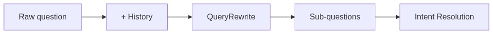

### 4.3 查询优化

`QueryOptimizerPort` 在重写前执行**专有名词保护和术语映射**（规则版实现 `RuleBasedQueryOptimizerPort`），避免领域术语被改写为通用表述。LLM 版 QueryOptimizer 默认关闭，可按需启用。

```java
// 伪代码：上下文构建
class KernelChatPipeline {
    void execute(StreamChatContext ctx) {
        // 1. 加载历史 + 激活四层记忆
        List<ChatMessage> history = memoryPort.loadAndAppend(ctx);
        MemoryContext memory = memoryEngine.loadMemory(request);
        
        // 2. 查询优化（术语保护）+ 重写
        String optimized = queryOptimizer.optimize(ctx.question());
        RewriteResult rewritten = queryRewrite.rewrite(optimized, history);
        
        // 3. 意图解析
        List<IntentScore> intents = intentResolver.resolve(rewritten);
        
        // ...后续阶段
    }
}
```

失败时降级为空记忆上下文——**记忆加载失败不应阻断问答主链路**。

> **💡 设计哲学**
>
> 上下文管理的核心矛盾是：**信息量与窗口容量的对抗**。加太多信息会超出模型上下文窗口导致截断，加太少则丢失对话连贯性。Seahorse 的解法是**分层限量 + 按需压缩**：
>
> **① 分层限量是基线。** 短期5条、长期3条、语义10条——这些数字不是随便定的，而是基于"典型对话窗口 + 模型上下文长度"的工程经验值。每一层都有明确的"信息优先级"：工作记忆 > 短期 > 长期 > 语义。
>
> **② 查询重写是质量保障。** 多轮对话中的"它怎么用？"如果没有上下文就无法理解。`QueryRewritePort` 将模糊追问解析为完整的子问题，`QueryOptimizerPort` 则保护领域术语不被改写。
>
> **③ 降级而非崩溃。** 记忆加载失败时降级为空上下文，这个设计看似简单，却体现了生产系统的核心理念：**主链路永远不能被辅助功能拖垂**。
>
> **与其他模块的协作**：上下文管理消费记忆系统的四层数据，为意图解析提供重写后的子问题，并为 RAG Prompt 组装提供结构化上下文。

---

## 📌 五、行为塑造：让 Agent "懂规矩"

### 5.1 意图解析与意图树

`KernelIntentTreeService` 管理一棵**多层意图树**，每个 `IntentNode` 包含名称、描述、示例、知识库绑定、MCP 工具 ID 等信息。意图节点分为三种类型：

| 类型 | 说明 |
|------|------|
| `KB` | 绑定知识库，触发 RAG 检索 |
| `MCP` | 绑定 MCP 工具，触发工具调用 |
| `SYSTEM` | 系统级回答（如问候、闲聊） |

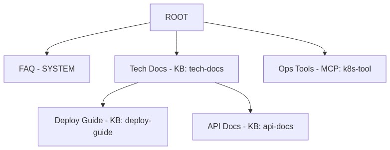

### 5.2 引导提示

当 `IntentGuidancePort` 检测到歧义（用户问题无法唯一匹配意图），系统**不猜测**，而是输出引导提示让用户澄清：

```java
// 伪代码：引导提示
if (guidancePort.needsGuidance(intents)) {
    String hint = guidancePort.generateGuidance(intents);
    responsePorts.streamOutput(hint); // 直接流式输出引导
    return; // 短路，不进入检索
}
```

### 5.3 系统仅回答短路

当所有子意图均为 `SYSTEM` 类型时，Pipeline 直接走系统提示模板流式输出，**绕过检索**，减少不必要的延迟和资源消耗。

### 5.4 空检索兜底

检索结果为空时，系统返回预置提示而非无意义输出——这是用户体验的细节考量。

> **💡 设计哲学**
>
> 行为塑造的核心思想是：**Agent 应该“懂规矩”，而不是“什么都尝试”**。
>
> **① 意图树是行为导航图。** 每个意图节点绑定具体的知识库或 MCP 工具，系统不会盲目检索所有知识库，而是根据意图分类定向检索。这不仅提高准确率，还降低了延迟。
>
> **② 不猜测，反问人。** 当意图解析不确定时，系统选择输出引导提示而非猜测回答。这个设计体现了“宁可多问一句，不要答非所问”的产品理念。
>
> **③ 短路即优化。** 系统仅回答（SYSTEM意图）绕过检索、空检索提前返回，这些短路机制不仅是性能优化，更是行为边界的明确定义——Agent 知道什么该做、什么不该做。
>
> **与其他模块的协作**：意图树服务与知识库管理服务协作（每个 KB 意图节点绑定具体知识库），与 MCP 工具服务协作（每个 MCP 意图节点绑定具体工具），并将意图分类结果传递给检索引擎决定检索策略。

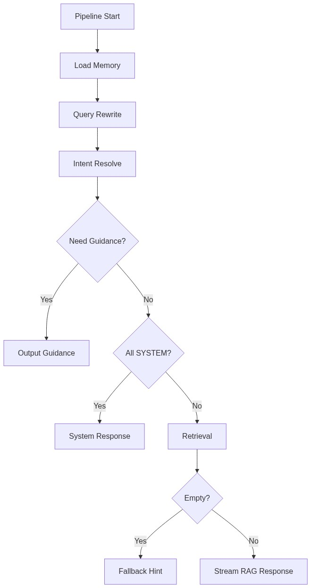

---

## 📌 六、会话持久化

### 6.1 数据模型

会话持久化采用 PostgreSQL 存储，核心表结构：

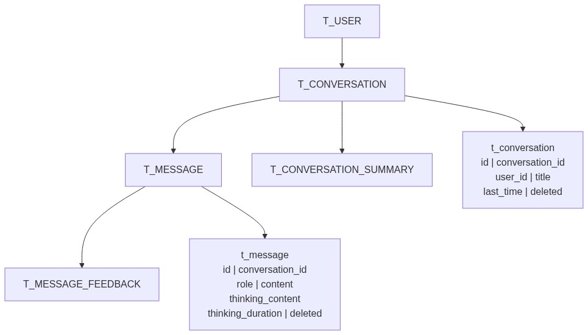

### 6.2 软删除与索引设计

所有表采用 `deleted` 字段实现**软删除**，避免物理删除带来的审计问题。关键索引：

- **会话表**：`(user_id, last_time)` —— 按用户快速排序最近会话
- **消息表**：`(conversation_id, user_id, create_time)` —— 按时间顺序读取

### 6.3 消息追加与记忆持久化

对话完成后，回调工厂将助手回复与思考内容追加到 `ConversationMemoryPort`：

```java
// 伪代码：会话管理
class KernelConversationManagementService {
    void rename(String convId, String userId, String title) {
        validate(title); // 长度限制 + 空白校验
        boolean ok = repositoryPort.rename(convId, userId, title.trim());
        if (!ok) throw new IllegalArgumentException("会话不存在");
    }
    
    void delete(String convId, String userId) {
        // 同步软删除会话、消息、摘要
        repositoryPort.delete(convId, userId);
    }
}
```

> **💡 设计哲学**
>
> 会话持久化的设计考虑了三个关键因素：
>
> **① 软删除是底线。** 在企业场景下，物理删除意味着审计断链。所有表均采用 `deleted` 字段实现软删除，删除会话时同步清理消息与摘要，减少碎片。
>
> **② 索引即性能。** 会话表按 `(user_id, last_time)` 索引支持快速排序；消息表按 `(conversation_id, user_id, create_time)` 索引支持时序读取。这些索引设计直接决定了多轮对话场景的响应速度。
>
> **③ 端口解耦存储。** `ConversationRepositoryPort` 抽象了存储能力，当前由 JDBC 适配器实现。这意味着未来可以无缝切换到其他存储后端（如 MongoDB、Cassandra）而不影响内核。
>
> **与其他模块的协作**：会话持久化为记忆系统提供工作记忆数据，为 RAG Trace 提供会话维度关联，为前端会话列表提供数据支撑。

---

## 📌 七、记忆系统：四层记忆 + 治理闭环

这是 Seahorse Agent 最有特色的设计之一。

### 7.1 四层记忆架构

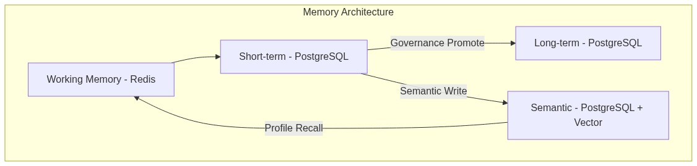

每条记忆 `MemoryItem` 携带丰富的评分维度：

```java
class MemoryItem {
    String id, userId, conversationId;
    MemoryLayer layer;    // WORKING / SHORT_TERM / LONG_TERM / SEMANTIC
    String type;          // PROFILE / PREFERENCE / SUMMARY / FACT / TODO
    String content;
    Double importanceScore;  // 重要性
    Double confidenceLevel;  // 置信度
    Double relevanceScore;   // 相关性
}
```

### 7.2 记忆治理引擎

`KernelMemoryGovernanceService` 负责**自动化记忆治理**：

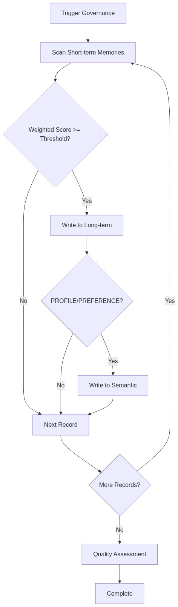

评分规则考虑：元数据重要性分数、置信度、类型权重（PROFILE > FACT > TODO），加权后与可配置阈值比较。

### 7.3 记忆冲突检测

当系统发现用户偏好矛盾（如"喜欢暗色主题"与"喜欢亮色主题"并存），`MemoryQualityReport` 会统计冲突类型：

| 冲突类型 | 说明 |
|---------|------|
| 矛盾冲突 | 同一事实相反描述 |
| 偏好极性冲突 | 偏好正负矛盾 |
| 单一画像冲突 | 同一属性多值 |
| 多值画像过载 | 画像值过多 |

系统还支持**交互式冲突处理**——在对话中主动反问用户，引导用户参与冲突解决。

> **💡 设计哲学**
>
> 记忆系统是 Seahorse Agent 最具创新性的设计，它的设计哲学可以用三句话概括：
>
> **① 记忆不是日志，是有评分的资产。** 每条记忆携带重要性、置信度、相关性三个评分维度。这让记忆不再是简单的“存取”，而是可以被治理、被优化、被淘汰的“认知资产”。
>
> **② 治理自动化，质量可观测。** `KernelMemoryGovernanceService` 通过可配置的评分阈值自动将短期记忆提升至长期/语义层，定时任务 `SeahorseMemoryGovernanceJob` 周期触发。`MemoryQualityReport` 则提供冲突统计和健康快照，让记忆质量可观测、可度量、可优化。
>
> **③ 冲突不掩盖，交互式解决。** 传统系统发现偏好矛盾时会静默覆盖或忽略。Seahorse 设计了交互式冲突处理机制，在对话中主动反问用户（“你之前说喜欢暗色主题，现在切换到亮色，确认吗？”），让用户参与记忆修正。
>
> **与其他模块的协作**：记忆系统在对话开始前为 Pipeline 提供多层上下文；对话完成后通过 `MemoryCaptureStage` 捕获新记忆；治理服务与聚合缓冲、用户画像派生形成闭环。

---

## 📌 八、多智能体编排

### 8.1 Agent Loop 与 ReAct 模式

Seahorse Agent 的 Agent 推理由 `KernelAgentLoop` 承担，采用 ReAct（Reasoning + Acting）模式。当前已规划解耦为三个协作者：

| 协作者 | 职责 |
|--------|------|
| `MarkdownNormalizer` | 输出层：规范化 Markdown/Mermaid |
| `AgentStreamEmitter` | 传输层：SSE 事件发射 |
| `ToolCallParser` | 模型兼容层：解析 text-encoded tool call |

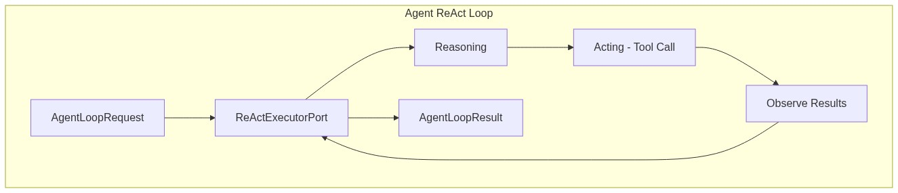

### 8.2 A2A 协议与 AgentScope 接入

项目已设计 AgentScope 局部接入方案，通过 `@ConditionalOnProperty` 实现灰度切换：


- **默认**使用自研 `KernelAgentLoop`（已瘦身）
- **可选**切换到 AgentScope 后端，获取 A2A 服务发现与 Studio 可视化调试
- 对前端**零感知**，不改 `AgentLoopRequest/Result` 和 SSE 协议

### 8.3 MCP 工具调用

MCP（Model Context Protocol）通过 `McpToolFeature` SPI 实现，支持本地 STDIO 和远程 HTTP 两种模式：

```java
// 伪代码：MCP 工具调用
class McpToolFeature implements AgentFeature {
    String name() { return "mcp-tool"; }
    ToolResult execute(ToolContext ctx) {
        // 1. 解析工具调用参数
        // 2. 通过 MCP 协议调用外部工具
        // 3. 返回结构化结果
    }
}
```

> **💡 设计哲学**
>
> 多智能体编排的设计体现了“渐进式演进”的工程智慧：
>
> **① 自研优先，外部可选。** 默认使用自研 `KernelAgentLoop`（2102行代码，已经过职责拆分瘦身），而非直接依赖 AgentScope。这样既保留了对核心推理循环的完全控制，又为未来接入外部能力留了接口。
>
> **② 解耦是前提，接入是选项。** `ReActExecutorPort` 抽象了推理循环的契约，自研和 AgentScope 是其两个实现。通过 `@ConditionalOnProperty` 灰度切换，对前端零感知。这是典型的“端口先行，实现可换”架构原则在多智能体场景的应用。
>
> **③ Agent-as-Tool。** 通过 MCP 协议，外部工具可以被 Agent 动态调用，而无需在内核中硬编码每个工具的逻辑。这实现了“Agent 编排能力”和“工具实现能力”的解耦。
>
> **与其他模块的协作**：Agent Loop 消费 RAG Pipeline 的检索结果作为知识输入，通过 MCP 工具与外部系统交互，并将运行数据写入可观测性模块。Agent 版本管理与 Skill 系统协作，控制每次运行可用的工具和提示模板。

---

## 📌 九、中断恢复与检查点

### 9.1 任务取消机制

`KernelChatInboundService` 通过 `StreamTaskPort` 实现**任务级取消**：

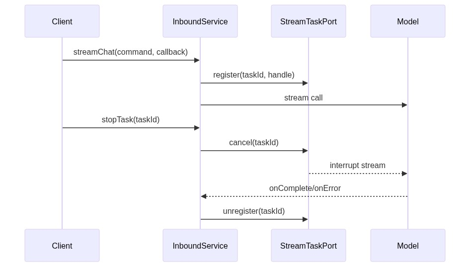

```java
// 伪代码：任务生命周期
class KernelChatInboundService {
    void streamChat(StreamChatCommand cmd, StreamCallback callback) {
        var trace = traceRecorder.start("chat");
        var context = buildContext(cmd, callback);
        try {
            chatPipeline.execute(context);
        } catch (Exception e) {
            callback.onError(e);
        } finally {
            trace.end();
        }
    }
    
    void stopTask(String taskId) {
        streamTaskPort.cancel(taskId); // 委托给任务端口
    }
}
```

### 9.2 SSE 连接管理

`SpringSseEventSender` 封装 `SseEmitter`，处理完成、超时、错误与**幂等关闭**：

| 事件类型 | 说明 |
|---------|------|
| `META` | 会话与任务元信息 |
| `MESSAGE` | 分片内容（区分 think / response） |
| `FINISH` | 完成标记 |
| `DONE` | 结束标记 |

### 9.3 Agent 运行状态

Agent 运行结果 `AgentLoopResult` 包含退出原因枚举：

| 退出原因 | 含义 |
|---------|------|
| `FINAL_ANSWER` | 正常完成，产出最终答案 |
| `TRUNCATED` | 达到步数上限被截断 |
| `WAITING_APPROVAL` | 等待人工审批（企业治理） |

> **💡 设计哲学**
>
> 中断与恢复的设计围绕**“可控性”**展开：
>
> **① 任务级取消是用户权利。** 用户点击“停止”时，系统必须在毫秒级响应。`StreamTaskPort` 注册每个流式任务的句柄，支持按 taskId 精确取消，不会误伤其他并发任务。
>
> **② SSE 幂等关闭是工程细节。** `SpringSseEventSender` 处理了完成、超时、错误三种关闭场景，并确保幂等性——多次关闭不会抛异常。这是生产系统必须具备的健壮性。
>
> **③ 退出原因是状态契约。** `AgentLoopExitReason` 枚举（FINAL_ANSWER / TRUNCATED / WAITING_APPROVAL）明确定义了 Agent 可能的终止状态，让前端和运维都能准确理解运行结果。
>
> **与其他模块的协作**：中断恢复与 Web 层 SSE 连接管理协作，与 Agent Loop 的步数限制和审批流程协作，并将任务状态事件写入可观测性模块。

---

## 📌 十、插件与 Skill 系统

### 10.1 Feature 插件体系

Seahorse Agent 的扩展能力通过 `AgentFeature` 接口统一治理：

```java
// 核心接口
interface AgentFeature {
    String name();                    // 唯一标识
    FeatureType type();               // 类型分类
    boolean enabled(ActivationContext ctx); // 启用条件
    int order();                      // 排序
    FeatureHealth health();           // 健康状态
}
```

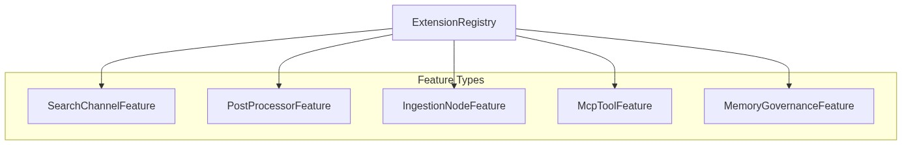

`ExtensionLoader` 在启动期扫描 `META-INF/seahorse-agent` 资源文件，构建运行时索引，**运行期零反射**。

### 10.2 Skill 定义与执行

Skill 是面向用户的预置能力包，包含提示模板、工具绑定和触发条件。

### 10.3 Skill 智能匹配

当用户未显式选择 Skill 时，系统支持**自动推荐**：

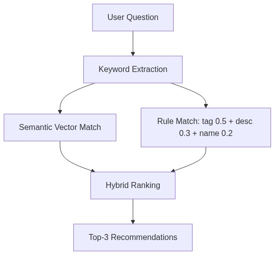

匹配策略**语义优先、规则兜底**：当向量库不可用时自动降级到规则匹配。

> **💡 设计哲学**
>
> 插件与 Skill 系统的设计体现了“内核稳定、扩展无限”的理念：
>
> **① 插件是内核的“生长点”。** `AgentFeature` 接口统一了所有扩展类型的治理契约——名称、类型、启用条件、排序、健康状态。这意味着无论是检索通道、入库节点还是 MCP 工具，都受同一套治理体系管控，不会出现“失控扩展”。
>
> **② 运行期零反射是性能红线。** `ExtensionLoader` 在启动期扫描 `META-INF/seahorse-agent` 资源文件，构建索引后就不再使用反射。这是生产系统对性能的基本要求——扩展发现的成本必须前置到启动期。
>
> **③ Skill 智能匹配是用户友好的体现。** 语义向量匹配 + 规则多维评分（标签 0.5 + 描述 0.3 + 名称 0.2）的混合策略，确保在向量库可用时获得语义精准的推荐，在向量库不可用时自动降级到规则匹配。
>
> **与其他模块的协作**：插件体系与 RAG 检索引擎协作（检索通道插件）、与入库引擎协作（入库节点插件）、与 Agent Loop 协作（MCP 工具插件）。Skill 系统与 Agent 版本管理协作，每个 Agent Version 可绑定不同的 Skill 集合。

---

## 📌 十一、调试与可观测性

### 11.1 RAG Trace 追踪

每次问答都会通过 `KernelRagTraceRecorder` 记录完整的**节点级追踪**：

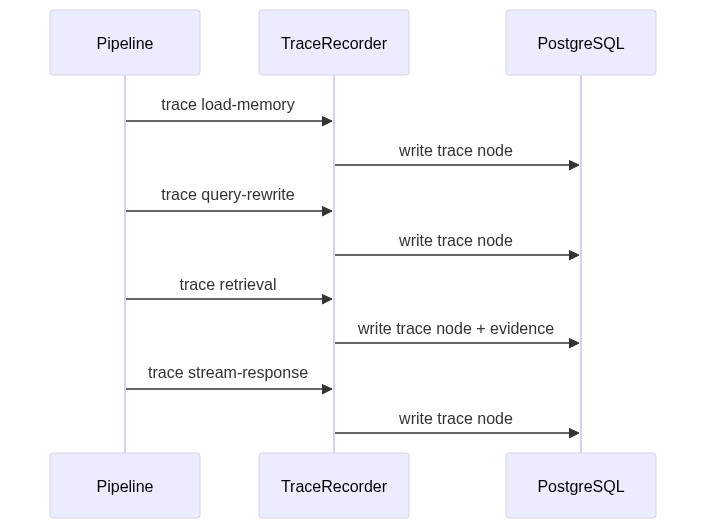

可通过 API `/rag/traces/runs` 查询运行记录，`/rag/traces/runs/{traceId}/nodes` 查看节点详情。

### 11.2 观测端口

`ObservationPort` 是内核的统一观测抽象：

```java
// 伪代码：观测端口
interface ObservationPort {
    ObservationScope start(ObservationCommand cmd);
}

// Micrometer 适配器
class MicrometerObservationAdapter implements ObservationPort {
    ObservationScope start(ObservationCommand cmd) {
        Timer.Sample sample = Timer.start();
        return () -> sample.stop(timer); // AutoCloseable
    }
}

// Noop 适配器（轻量部署）
class NoopObservationAdapter implements ObservationPort {
    ObservationScope start(ObservationCommand cmd) { return () -> {}; }
}
```

### 11.3 OpenTelemetry 演进

项目已设计 OTel 集成方案：在 Micrometer 之上桥接 OTel，现有埋点**自动产出 span**，无需改业务代码：

```
agent.run → step.N → tool_call.X / model.turn
```

### 11.4 记忆健康与就绪检查

| 端点 | 用途 |
|------|------|
| `/memories/readiness` | 写入/召回/注入/review/outbox/maintenance 能力状态 |
| `/memories/health` | 记忆健康、策略和最近运行状态 |
| `/memories/profile-facts` | 当前用户 active 画像事实 |

> **💡 设计哲学**
>
> 可观测性的设计原则是**“每个环节都有证据，每个证据都可迫溯”**：
>
> **① RAG Trace 是问答主链路的“黑匣子”。** 每次问答都会通过 `KernelRagTraceRecorder` 记录每个阶段的开始时间、耗时、输入输出、检索证据。当用户反馈“回答不准”时，运维可以通过 `/rag/traces/runs/{traceId}/nodes` 精确定位问题环节。
>
> **② 观测端口是抽象，适配器是实现。** `ObservationPort` 作为内核的统一观测抽象，当前由 Micrometer 适配器实现指标采集，未来可桥接 OpenTelemetry 产出分布式追踪 span，且现有埋点代码**无需任何修改**。
>
> **③ 记忆健康是运维的“仪表盘”。** `/memories/readiness`、`/memories/health`、`/memories/profile-facts` 三个端点提供了记忆系统的全景视图，让运维团队能够实时了解记忆写入、召回、治理的运行状态。
>
> **与其他模块的协作**：可观测性模块被所有其他模块消费——RAG Pipeline 写入 Trace，Agent Loop 写入运行 span，记忆系统写入健康快照。它是整个平台的“监控中枢”。

---

## 📌 十二、其他项目亮点

### 12.1 消息树与消息反馈

消息表支持反馈（投票、原因、评论），为 RLHF 数据闭环提供基础：

```sql
-- 消息反馈表
CREATE TABLE t_message_feedback (
    id          VARCHAR PRIMARY KEY,
    message_id  VARCHAR,
    conversation_id VARCHAR,
    user_id     VARCHAR,
    vote        SMALLINT,   -- 1 = 赞, -1 = 踩
    reason      VARCHAR,
    comment     VARCHAR
);
```

### 12.2 角色卡与 Agent 版本管理

Agent 定义支持版本化管理，每个 Agent Version 可绑定不同的 Skill 集合、工具集和提示模板。

### 12.3 企业级治理

| 能力 | 实现 |
|------|------|
| 多租户 | `tenant_id` 行级隔离 |
| 认证 | Sa-Token + Bearer Token |
| 配额管理 | `/api/quotas/*` |
| 资源 ACL | `/api/resource-acl-rules` |
| Feature Gate | `/api/features` 运行时菜单 |
| 灰度发布 | Agent Rollout + Canary |

### 12.4 双模式部署

| 模式 | 编排文件 | 适用场景 |
|------|---------|---------|
| **轻量部署** | `docker-compose.yml` | 前端 + 登录 + 基础 API 冒烟 |
| **全量部署** | `docker-compose.full.yml` | Milvus + Ollama + Redis + ES + Pulsar + MinIO + Prometheus + Grafana |

### 12.5 双路径兼容

所有 Controller 同时注册 `/path` 和 `/api/path` 两条路径，兼容 Nginx 反向代理和直连两种部署方式。

> **💡 设计哲学**
>
> 企业级特性的设计体现了“平台化思维”：
>
> **① 消息反馈是 RLHF 的数据基础。** `t_message_feedback` 表支持用户对每条回答的投票、原因和评论，这些数据可以用于后续的模型微调和 RAG 策略优化。
>
> **② 企业治理是生产必备。** 多租户行级隔离、Sa-Token 认证、配额管理、资源 ACL、Feature Gate、灰度发布——这些不是“加分项”，而是企业级平台的“及格线”。
>
> **③ 双模式部署是工程灵活性。** 轻量部署用于快速冒烟验证，全量部署用于真实 RAG 质量验证。同一个代码库、同一套配置体系，只需切换 `docker-compose` 文件即可适配不同场景。
>
> **④ 双路径兼容是部署包容性。** 所有 Controller 同时注册 `/path` 和 `/api/path`，兼容 Nginx 反向代理（`/api` 前缀）和直连后端（无前缀）两种部署方式。
>
> **与其他模块的协作**：企业治理与认证系统协作（Sa-Token）、与 Agent 管理协作（配额和审批）、与记忆系统协作（多租户隔离）、与可观测性协作（审计日志）。

---

## 🎯 总结

Seahorse Agent 作为一个企业级 RAG 智能体平台，在架构设计上展现了几个核心设计哲学：

> **1. 端口驱动，适配器可换** —— 749 个端口接口让外部依赖成为可插拔组件

> **2. 流水线编排，阶段可观测** —— RAG 8 阶段、入库 N 节点，每步可追踪

> **3. 记忆分层，治理自动化** —— 四层记忆 + 评分提升 + 冲突检测，让 Agent 越用越懂用户

> **4. 插件化扩展，运行期零反射** —— Feature + ExtensionRegistry，新能力即插即用

> **5. 生产级容错，降级不中断** —— 通道异常返回空、记忆失败降级空上下文、后处理异常跳过

> **6. 行为有边界，不猜测反问人** —— 意图引导、系统仅回答、空检索兜底，Agent 知道什么不该做

> **7. 可控性优先，状态可追溯** —— 任务级取消、SSE 幂等关闭、退出原因枚举、Trace 全链路记录

从技术架构层面看，Seahorse Agent 回答了一个核心工程命题：**如何把 AI Agent 从 Demo 做到生产级**。答案不是更好的模型，而是更好的工程——更清晰的分层、更稳定的契约、更优雅的降级、更可观测的链路。

这套设计不仅解决了“RAG 准不准”的问题，更构建了一个可以持续演进的平台基座。无论是接入新的向量库、增加新的检索通道、还是扩展到多智能体编排，都可以在不破坏现有契约的前提下完成。

这，就是企业级 AI Agent 平台应有的样子。

---

*本文所有架构图和代码均基于 Seahorse Agent 项目实际代码与设计文档。*
