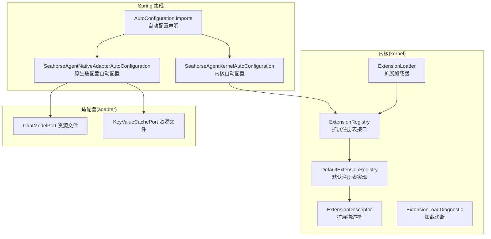
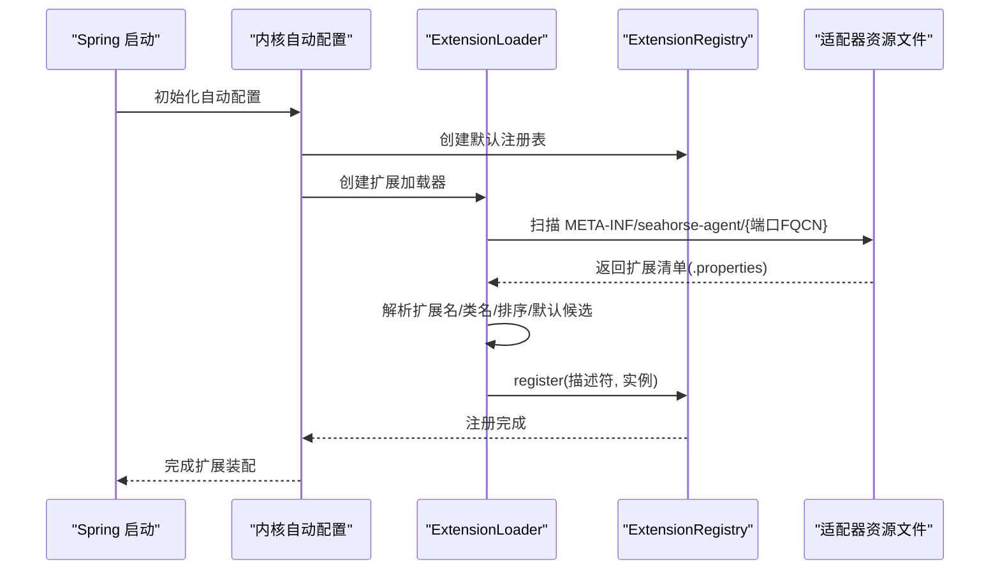
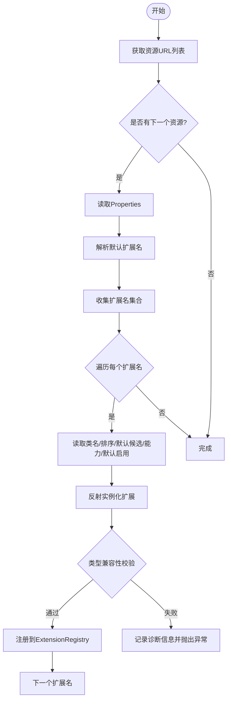
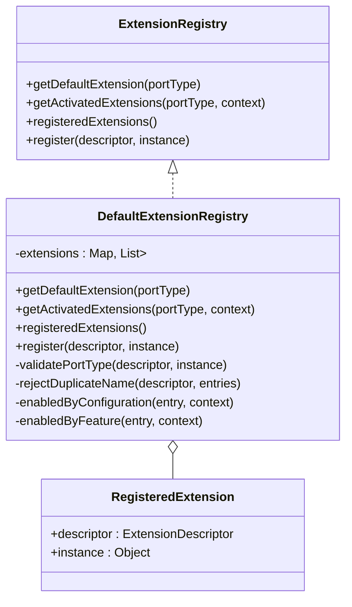
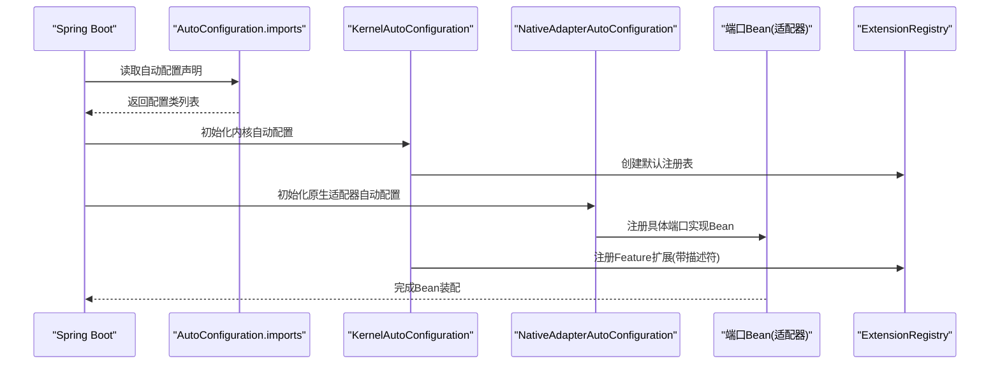
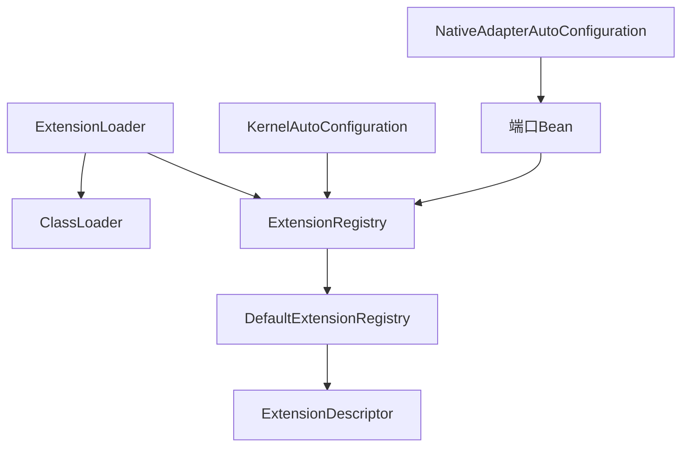

# 扩展加载机制

<cite>
**本文档引用的文件**
- [ExtensionLoader.java](file://seahorse-agent-kernel/src/main/java/com/miracle/ai/seahorse/agent/kernel/plugin/ExtensionLoader.java)
- [ExtensionRegistry.java](file://seahorse-agent-kernel/src/main/java/com/miracle/ai/seahorse/agent/kernel/plugin/ExtensionRegistry.java)
- [DefaultExtensionRegistry.java](file://seahorse-agent-kernel/src/main/java/com/miracle/ai/seahorse/agent/kernel/plugin/DefaultExtensionRegistry.java)
- [ExtensionDescriptor.java](file://seahorse-agent-kernel/src/main/java/com/miracle/ai/seahorse/agent/kernel/plugin/ExtensionDescriptor.java)
- [AgentSPI.java](file://seahorse-agent-kernel/src/main/java/com/miracle/ai/seahorse/agent/kernel/plugin/AgentSPI.java)
- [ExtensionRegistration.java](file://seahorse-agent-kernel/src/main/java/com/miracle/ai/seahorse/agent/kernel/plugin/ExtensionRegistration.java)
- [FeatureActivationContext.java](file://seahorse-agent-kernel/src/main/java/com/miracle/ai/seahorse/agent/kernel/plugin/FeatureActivationContext.java)
- [FeatureType.java](file://seahorse-agent-kernel/src/main/java/com/miracle/ai/seahorse/agent/kernel/plugin/FeatureType.java)
- [AgentFeature.java](file://seahorse-agent-kernel/src/main/java/com/miracle/ai/seahorse/agent/kernel/plugin/AgentFeature.java)
- [ExtensionLoadDiagnostic.java](file://seahorse-agent-kernel/src/main/java/com/miracle/ai/seahorse/agent/kernel/plugin/ExtensionLoadDiagnostic.java)
- [SeahorseAgentKernelAutoConfiguration.java](file://seahorse-agent-spring-boot-autoconfigure/src/main/java/com/miracle/ai/seahorse/agent/adapters/spring/SeahorseAgentKernelAutoConfiguration.java)
- [SeahorseAgentNativeAdapterAutoConfiguration.java](file://seahorse-agent-spring-boot-autoconfigure/src/main/java/com/miracle/ai/seahorse/agent/adapters/spring/SeahorseAgentNativeAdapterAutoConfiguration.java)
- [KernelChatPipeline.java](file://seahorse-agent-kernel/src/main/java/com/miracle/ai/seahorse/agent/kernel/application/chat/KernelChatPipeline.java)
- [ChatModelPort](file://seahorse-agent-adapter-ai-openai-compatible/src/main/resources/META-INF/seahorse-agent/com.miracle.ai.seahorse.agent.ports.outbound.model.ChatModelPort)
- [KeyValueCachePort](file://seahorse-agent-adapter-cache-local/src/main/resources/META-INF/seahorse-agent/com.miracle.ai.seahorse.agent.ports.outbound.cache.KeyValueCachePort)
- [AutoConfiguration.imports](file://seahorse-agent-spring-boot-autoconfigure/src/main/resources/META-INF/spring/org.springframework.boot.autoconfigure.AutoConfiguration.imports)
</cite>

## 目录
1. [简介](#简介)
2. [项目结构](#项目结构)
3. [核心组件](#核心组件)
4. [架构总览](#架构总览)
5. [详细组件分析](#详细组件分析)
6. [依赖关系分析](#依赖关系分析)
7. [性能考虑](#性能考虑)
8. [故障排除指南](#故障排除指南)
9. [结论](#结论)

## 简介
本文件系统性阐述 Seahorse Agent 微内核的扩展加载机制，重点覆盖以下方面：
- ExtensionLoader 的类加载策略与 SPI 资源发现机制
- ExtensionRegistry 的注册与管理、生命周期与状态跟踪
- ExtensionDescriptor 的描述符模型与元数据定义
- 扩展加载的完整流程（发现、验证、实例化、初始化）
- 异常处理与错误恢复策略
- 与 Spring Boot 自动配置的集成方式

该机制通过启动期扫描 classpath 下的 META-INF/seahorse-agent 资源文件，读取扩展清单并完成实例化与注册，运行期仅进行只读查询，避免反射扫描对 RAG 性能的影响。

## 项目结构
扩展加载机制涉及的核心模块与文件如下：
- kernel/plugin：扩展加载与注册的核心实现
- spring-boot-starter：与 Spring Boot 自动配置集成
- 各适配器模块：提供具体的扩展实现并通过资源文件声明

**图表来源**
- [ExtensionLoader.java:39-262](file://seahorse-agent-kernel/src/main/java/com/miracle/ai/seahorse/agent/kernel/plugin/ExtensionLoader.java#L39-L262)
- [ExtensionRegistry.java:28-84](file://seahorse-agent-kernel/src/main/java/com/miracle/ai/seahorse/agent/kernel/plugin/ExtensionRegistry.java#L28-L84)
- [DefaultExtensionRegistry.java:34-124](file://seahorse-agent-kernel/src/main/java/com/miracle/ai/seahorse/agent/kernel/plugin/DefaultExtensionRegistry.java#L34-L124)
- [ExtensionDescriptor.java:37-66](file://seahorse-agent-kernel/src/main/java/com/miracle/ai/seahorse/agent/kernel/plugin/ExtensionDescriptor.java#L37-L66)
- [ExtensionLoadDiagnostic.java:30-45](file://seahorse-agent-kernel/src/main/java/com/miracle/ai/seahorse/agent/kernel/plugin/ExtensionLoadDiagnostic.java#L30-L45)
- [SeahorseAgentKernelAutoConfiguration.java:188-210](file://seahorse-agent-spring-boot-autoconfigure/src/main/java/com/miracle/ai/seahorse/agent/adapters/spring/SeahorseAgentKernelAutoConfiguration.java#L188-L210)
- [SeahorseAgentNativeAdapterAutoConfiguration.java:160-162](file://seahorse-agent-spring-boot-autoconfigure/src/main/java/com/miracle/ai/seahorse/agent/adapters/spring/SeahorseAgentNativeAdapterAutoConfiguration.java#L160-L162)
- [AutoConfiguration.imports:1-3](file://seahorse-agent-spring-boot-autoconfigure/src/main/resources/META-INF/spring/org.springframework.boot.autoconfigure.AutoConfiguration.imports#L1-L3)
- [ChatModelPort:1-5](file://seahorse-agent-adapter-ai-openai-compatible/src/main/resources/META-INF/seahorse-agent/com.miracle.ai.seahorse.agent.ports.outbound.model.ChatModelPort#L1-L5)
- [KeyValueCachePort:1-4](file://seahorse-agent-adapter-cache-local/src/main/resources/META-INF/seahorse-agent/com.miracle.ai.seahorse.agent.ports.outbound.cache.KeyValueCachePort#L1-L4)

**章节来源**
- [ExtensionLoader.java:39-262](file://seahorse-agent-kernel/src/main/java/com/miracle/ai/seahorse/agent/kernel/plugin/ExtensionLoader.java#L39-L262)
- [ExtensionRegistry.java:28-84](file://seahorse-agent-kernel/src/main/java/com/miracle/ai/seahorse/agent/kernel/plugin/ExtensionRegistry.java#L28-L84)
- [DefaultExtensionRegistry.java:34-124](file://seahorse-agent-kernel/src/main/java/com/miracle/ai/seahorse/agent/kernel/plugin/DefaultExtensionRegistry.java#L34-L124)
- [ExtensionDescriptor.java:37-66](file://seahorse-agent-kernel/src/main/java/com/miracle/ai/seahorse/agent/kernel/plugin/ExtensionDescriptor.java#L37-L66)
- [ExtensionLoadDiagnostic.java:30-45](file://seahorse-agent-kernel/src/main/java/com/miracle/ai/seahorse/agent/kernel/plugin/ExtensionLoadDiagnostic.java#L30-L45)
- [SeahorseAgentKernelAutoConfiguration.java:188-210](file://seahorse-agent-spring-boot-autoconfigure/src/main/java/com/miracle/ai/seahorse/agent/adapters/spring/SeahorseAgentKernelAutoConfiguration.java#L188-L210)
- [SeahorseAgentNativeAdapterAutoConfiguration.java:160-162](file://seahorse-agent-spring-boot-autoconfigure/src/main/java/com/miracle/ai/seahorse/agent/adapters/spring/SeahorseAgentNativeAdapterAutoConfiguration.java#L160-L162)
- [AutoConfiguration.imports:1-3](file://seahorse-agent-spring-boot-autoconfigure/src/main/resources/META-INF/spring/org.springframework.boot.autoconfigure.AutoConfiguration.imports#L1-L3)
- [ChatModelPort:1-5](file://seahorse-agent-adapter-ai-openai-compatible/src/main/resources/META-INF/seahorse-agent/com.miracle.ai.seahorse.agent.ports.outbound.model.ChatModelPort#L1-L5)
- [KeyValueCachePort:1-4](file://seahorse-agent-adapter-cache-local/src/main/resources/META-INF/seahorse-agent/com.miracle.ai.seahorse.agent.ports.outbound.cache.KeyValueCachePort#L1-L4)

## 核心组件
- ExtensionLoader：基于 classpath 的微内核扩展加载器，负责发现、读取、解析并注册扩展
- ExtensionRegistry：扩展注册表接口，提供默认扩展获取、激活扩展链获取、注册表快照查询等能力
- DefaultExtensionRegistry：默认注册表实现，维护端口类型到扩展列表的映射，支持排序、去重、启用控制
- ExtensionDescriptor：扩展描述符，承载扩展名称、端口类型、Feature 类型、排序、默认候选、能力标签、默认启用等元数据
- ExtensionLoadDiagnostic：扩展加载诊断信息，记录资源名、扩展名、实现类名与诊断消息
- AgentSPI：扩展点标记注解，声明端口是否参与扩展加载
- FeatureActivationContext：Feature 激活上下文，包含租户、用户、属性与配置快照
- FeatureType：Feature 类型枚举，定义稳定的扩展点分类
- AgentFeature：Feature 基础接口，提供名称、类型、启用判断、排序与健康状态
- ExtensionRegistration：启动期注册快照，记录描述符与实现类名

**章节来源**
- [ExtensionLoader.java:39-262](file://seahorse-agent-kernel/src/main/java/com/miracle/ai/seahorse/agent/kernel/plugin/ExtensionLoader.java#L39-L262)
- [ExtensionRegistry.java:28-84](file://seahorse-agent-kernel/src/main/java/com/miracle/ai/seahorse/agent/kernel/plugin/ExtensionRegistry.java#L28-L84)
- [DefaultExtensionRegistry.java:34-124](file://seahorse-agent-kernel/src/main/java/com/miracle/ai/seahorse/agent/kernel/plugin/DefaultExtensionRegistry.java#L34-L124)
- [ExtensionDescriptor.java:37-66](file://seahorse-agent-kernel/src/main/java/com/miracle/ai/seahorse/agent/kernel/plugin/ExtensionDescriptor.java#L37-L66)
- [ExtensionLoadDiagnostic.java:30-45](file://seahorse-agent-kernel/src/main/java/com/miracle/ai/seahorse/agent/kernel/plugin/ExtensionLoadDiagnostic.java#L30-L45)
- [AgentSPI.java:32-51](file://seahorse-agent-kernel/src/main/java/com/miracle/ai/seahorse/agent/kernel/plugin/AgentSPI.java#L32-L51)
- [FeatureActivationContext.java:33-61](file://seahorse-agent-kernel/src/main/java/com/miracle/ai/seahorse/agent/kernel/plugin/FeatureActivationContext.java#L33-L61)
- [FeatureType.java:26-63](file://seahorse-agent-kernel/src/main/java/com/miracle/ai/seahorse/agent/kernel/plugin/FeatureType.java#L26-L63)
- [AgentFeature.java:26-80](file://seahorse-agent-kernel/src/main/java/com/miracle/ai/seahorse/agent/kernel/plugin/AgentFeature.java#L26-L80)
- [ExtensionRegistration.java:28-36](file://seahorse-agent-kernel/src/main/java/com/miracle/ai/seahorse/agent/kernel/plugin/ExtensionRegistration.java#L28-L36)

## 架构总览
扩展加载机制采用“启动期装配 + 运行期只读”的设计：
- 启动期：ExtensionLoader 扫描 classpath 下的 META-INF/seahorse-agent/{端口全限定名} 资源文件，解析扩展清单，实例化扩展并注册到 DefaultExtensionRegistry
- 运行期：内核通过 ExtensionRegistry 获取默认扩展或按 FeatureActivationContext 过滤后的扩展链，避免动态扫描带来的性能抖动

**图表来源**
- [SeahorseAgentKernelAutoConfiguration.java:196-200](file://seahorse-agent-spring-boot-autoconfigure/src/main/java/com/miracle/ai/seahorse/agent/adapters/spring/SeahorseAgentKernelAutoConfiguration.java#L196-L200)
- [ExtensionLoader.java:95-114](file://seahorse-agent-kernel/src/main/java/com/miracle/ai/seahorse/agent/kernel/plugin/ExtensionLoader.java#L95-L114)
- [ExtensionRegistry.java:64-84](file://seahorse-agent-kernel/src/main/java/com/miracle/ai/seahorse/agent/kernel/plugin/ExtensionRegistry.java#L64-L84)
- [ChatModelPort:1-5](file://seahorse-agent-adapter-ai-openai-compatible/src/main/resources/META-INF/seahorse-agent/com.miracle.ai.seahorse.agent.ports.outbound.model.ChatModelPort#L1-L5)
- [KeyValueCachePort:1-4](file://seahorse-agent-adapter-cache-local/src/main/resources/META-INF/seahorse-agent/com.miracle.ai.seahorse.agent.ports.outbound.cache.KeyValueCachePort#L1-L4)

## 详细组件分析

### ExtensionLoader：类加载策略与 SPI 机制
- 资源根路径：META-INF/seahorse-agent/
- 资源命名：{端口全限定名}.properties
- 关键特性：
  - 使用当前线程上下文 ClassLoader 或加载器创建加载器实例
  - 通过 ClassLoader.getResources 批量发现资源
  - 读取 Properties，解析默认扩展名、扩展名集合、类名、排序、默认候选、能力标签、默认启用等元数据
  - 通过反射实例化扩展对象并校验其实现类型兼容性
  - 将扩展注册到 ExtensionRegistry，并记录加载诊断信息

**图表来源**
- [ExtensionLoader.java:95-171](file://seahorse-agent-kernel/src/main/java/com/miracle/ai/seahorse/agent/kernel/plugin/ExtensionLoader.java#L95-L171)
- [ExtensionLoader.java:173-238](file://seahorse-agent-kernel/src/main/java/com/miracle/ai/seahorse/agent/kernel/plugin/ExtensionLoader.java#L173-L238)

**章节来源**
- [ExtensionLoader.java:39-262](file://seahorse-agent-kernel/src/main/java/com/miracle/ai/seahorse/agent/kernel/plugin/ExtensionLoader.java#L39-L262)

### ExtensionRegistry 与 DefaultExtensionRegistry：注册与管理
- 接口职责：
  - getDefaultExtension：获取默认扩展
  - getActivatedExtensions：根据 FeatureActivationContext 过滤并返回启用的扩展链
  - registeredExtensions：查询启动期注册快照
  - register：注册扩展描述符与实例
- 默认实现要点：
  - 使用 LinkedHashMap 保持注册顺序
  - 按端口类型分组存储扩展条目
  - 注册时拒绝同端口下重复名称
  - 按 ExtensionDescriptor.order 排序
  - 启用控制：优先使用描述符 enabledByDefault，其次由 FeatureActivationContext 的 AgentFeatureProperties 决定

**图表来源**
- [ExtensionRegistry.java:28-84](file://seahorse-agent-kernel/src/main/java/com/miracle/ai/seahorse/agent/kernel/plugin/ExtensionRegistry.java#L28-L84)
- [DefaultExtensionRegistry.java:34-124](file://seahorse-agent-kernel/src/main/java/com/miracle/ai/seahorse/agent/kernel/plugin/DefaultExtensionRegistry.java#L34-L124)

**章节来源**
- [ExtensionRegistry.java:28-84](file://seahorse-agent-kernel/src/main/java/com/miracle/ai/seahorse/agent/kernel/plugin/ExtensionRegistry.java#L28-L84)
- [DefaultExtensionRegistry.java:34-124](file://seahorse-agent-kernel/src/main/java/com/miracle/ai/seahorse/agent/kernel/plugin/DefaultExtensionRegistry.java#L34-L124)

### ExtensionDescriptor：描述符机制
- 字段含义：
  - name：扩展名称（同一端口下唯一）
  - portType：扩展端口类型
  - featureType：Feature 类型
  - order：排序值（数值越小优先级越高）
  - defaultCandidate：是否为默认实现候选
  - capabilities：扩展能力标签集合
  - enabledByDefault：未显式配置时是否默认启用
- 校验规则：
  - name 与 portType 必填，缺失时快速失败
  - capabilities 为空时使用不可变空集

**章节来源**
- [ExtensionDescriptor.java:37-66](file://seahorse-agent-kernel/src/main/java/com/miracle/ai/seahorse/agent/kernel/plugin/ExtensionDescriptor.java#L37-L66)

### AgentSPI、AgentFeature、FeatureType、FeatureActivationContext：元数据与生命周期
- AgentSPI：标记端口是否参与扩展加载，声明默认扩展名与是否为启动必需端口
- AgentFeature：Feature 基础接口，提供 name、type、enabled、order、health 等能力
- FeatureType：稳定的扩展点分类枚举，涵盖检索通道、后处理、入库节点、MCP 工具、记忆治理、模型路由、观测包装等
- FeatureActivationContext：激活上下文，包含租户、用户、属性与配置快照，用于 Feature 启用判断

**章节来源**
- [AgentSPI.java:32-51](file://seahorse-agent-kernel/src/main/java/com/miracle/ai/seahorse/agent/kernel/plugin/AgentSPI.java#L32-L51)
- [AgentFeature.java:26-80](file://seahorse-agent-kernel/src/main/java/com/miracle/ai/seahorse/agent/kernel/plugin/AgentFeature.java#L26-L80)
- [FeatureType.java:26-63](file://seahorse-agent-kernel/src/main/java/com/miracle/ai/seahorse/agent/kernel/plugin/FeatureType.java#L26-L63)
- [FeatureActivationContext.java:33-61](file://seahorse-agent-kernel/src/main/java/com/miracle/ai/seahorse/agent/kernel/plugin/FeatureActivationContext.java#L33-L61)

### ExtensionLoadDiagnostic：异常处理与诊断
- 记录资源名、扩展名、实现类名与诊断消息
- 在实例化或类型校验失败时添加诊断信息并抛出异常，便于定位问题

**章节来源**
- [ExtensionLoadDiagnostic.java:30-45](file://seahorse-agent-kernel/src/main/java/com/miracle/ai/seahorse/agent/kernel/plugin/ExtensionLoadDiagnostic.java#L30-L45)

### Spring Boot 集成：自动配置与扩展装配
- 自动配置声明：通过 org.springframework.boot.autoconfigure.AutoConfiguration.imports 声明内核与原生适配器自动配置类
- 内核自动配置：
  - 创建 ExtensionRegistry（默认 DefaultExtensionRegistry）
  - 通过 Bean 方法注册 Feature 与扩展，调用 registry.register 完成装配
- 原生适配器自动配置：
  - 提供具体扩展实现 Bean（如 ChatModelPort、KeyValueCachePort 等）
  - 适配器模块通过 META-INF/seahorse-agent/{端口FQCN} 资源文件声明扩展清单

**图表来源**
- [AutoConfiguration.imports:1-3](file://seahorse-agent-spring-boot-autoconfigure/src/main/resources/META-INF/spring/org.springframework.boot.autoconfigure.AutoConfiguration.imports#L1-L3)
- [SeahorseAgentKernelAutoConfiguration.java:188-210](file://seahorse-agent-spring-boot-autoconfigure/src/main/java/com/miracle/ai/seahorse/agent/adapters/spring/SeahorseAgentKernelAutoConfiguration.java#L188-L210)
- [SeahorseAgentNativeAdapterAutoConfiguration.java:160-162](file://seahorse-agent-spring-boot-autoconfigure/src/main/java/com/miracle/ai/seahorse/agent/adapters/spring/SeahorseAgentNativeAdapterAutoConfiguration.java#L160-L162)

**章节来源**
- [AutoConfiguration.imports:1-3](file://seahorse-agent-spring-boot-autoconfigure/src/main/resources/META-INF/spring/org.springframework.boot.autoconfigure.AutoConfiguration.imports#L1-L3)
- [SeahorseAgentKernelAutoConfiguration.java:188-210](file://seahorse-agent-spring-boot-autoconfigure/src/main/java/com/miracle/ai/seahorse/agent/adapters/spring/SeahorseAgentKernelAutoConfiguration.java#L188-L210)
- [SeahorseAgentNativeAdapterAutoConfiguration.java:160-162](file://seahorse-agent-spring-boot-autoconfigure/src/main/java/com/miracle/ai/seahorse/agent/adapters/spring/SeahorseAgentNativeAdapterAutoConfiguration.java#L160-L162)

## 依赖关系分析
- ExtensionLoader 依赖 ClassLoader 进行资源发现与类实例化
- DefaultExtensionRegistry 依赖 ExtensionDescriptor 进行排序与启用判断
- Spring 自动配置通过 Bean 方法将扩展注册到 ExtensionRegistry
- 适配器模块通过资源文件声明扩展清单，与 ExtensionLoader 的 SPI 机制对接

**图表来源**
- [ExtensionLoader.java:50-55](file://seahorse-agent-kernel/src/main/java/com/miracle/ai/seahorse/agent/kernel/plugin/ExtensionLoader.java#L50-L55)
- [DefaultExtensionRegistry.java:69-78](file://seahorse-agent-kernel/src/main/java/com/miracle/ai/seahorse/agent/kernel/plugin/DefaultExtensionRegistry.java#L69-L78)
- [SeahorseAgentKernelAutoConfiguration.java:196-200](file://seahorse-agent-spring-boot-autoconfigure/src/main/java/com/miracle/ai/seahorse/agent/adapters/spring/SeahorseAgentKernelAutoConfiguration.java#L196-L200)
- [SeahorseAgentNativeAdapterAutoConfiguration.java:160-162](file://seahorse-agent-spring-boot-autoconfigure/src/main/java/com/miracle/ai/seahorse/agent/adapters/spring/SeahorseAgentNativeAdapterAutoConfiguration.java#L160-L162)

**章节来源**
- [ExtensionLoader.java:50-55](file://seahorse-agent-kernel/src/main/java/com/miracle/ai/seahorse/agent/kernel/plugin/ExtensionLoader.java#L50-L55)
- [DefaultExtensionRegistry.java:69-78](file://seahorse-agent-kernel/src/main/java/com/miracle/ai/seahorse/agent/kernel/plugin/DefaultExtensionRegistry.java#L69-L78)
- [SeahorseAgentKernelAutoConfiguration.java:196-200](file://seahorse-agent-spring-boot-autoconfigure/src/main/java/com/miracle/ai/seahorse/agent/adapters/spring/SeahorseAgentKernelAutoConfiguration.java#L196-L200)
- [SeahorseAgentNativeAdapterAutoConfiguration.java:160-162](file://seahorse-agent-spring-boot-autoconfigure/src/main/java/com/miracle/ai/seahorse/agent/adapters/spring/SeahorseAgentNativeAdapterAutoConfiguration.java#L160-L162)

## 性能考虑
- 启动期一次性扫描与实例化：避免运行期反射扫描带来的性能抖动
- 注册表只读查询：运行期通过 ExtensionRegistry 获取扩展链，无需再次解析资源
- 排序与启用控制：在注册阶段完成，减少运行期计算开销
- 诊断与异常：通过 ExtensionLoadDiagnostic 快速定位问题，避免运行期反复尝试

[本节为通用指导，无需列出具体文件来源]

## 故障排除指南
常见问题与处理建议：
- 未找到默认扩展：检查对应端口的 ExtensionDescriptor.defaultCandidate 或资源文件 default 设置
- 扩展名称重复：同一端口下扩展名称必须唯一，注册时会拒绝重复名称
- 类型不兼容：扩展实现类必须实现对应的端口类型，否则会在实例化阶段抛出异常
- 资源读取失败：确认资源文件位于 META-INF/seahorse-agent/{端口全限定名}，且文件编码正确
- 启用状态异常：检查 FeatureActivationContext 与 AgentFeatureProperties 的配置开关

**章节来源**
- [DefaultExtensionRegistry.java:42-47](file://seahorse-agent-kernel/src/main/java/com/miracle/ai/seahorse/agent/kernel/plugin/DefaultExtensionRegistry.java#L42-L47)
- [DefaultExtensionRegistry.java:94-101](file://seahorse-agent-kernel/src/main/java/com/miracle/ai/seahorse/agent/kernel/plugin/DefaultExtensionRegistry.java#L94-L101)
- [ExtensionLoadDiagnostic.java:30-45](file://seahorse-agent-kernel/src/main/java/com/miracle/ai/seahorse/agent/kernel/plugin/ExtensionLoadDiagnostic.java#L30-L45)

## 结论
Seahorse Agent 的扩展加载机制通过“启动期装配 + 运行期只读”的设计，在保证灵活性的同时兼顾性能与稳定性。ExtensionLoader 以 SPI 方式发现并注册扩展，ExtensionRegistry 提供统一的查询与管理接口，配合 Spring Boot 自动配置实现无缝集成。通过 ExtensionDescriptor 的元数据模型与 FeatureActivationContext 的启用控制，系统实现了对扩展生命周期的精细化管理与可观测性。