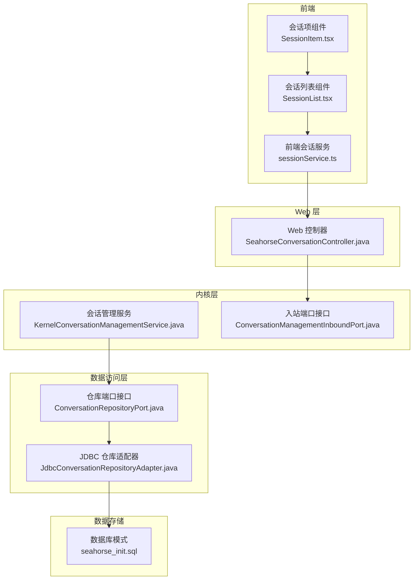
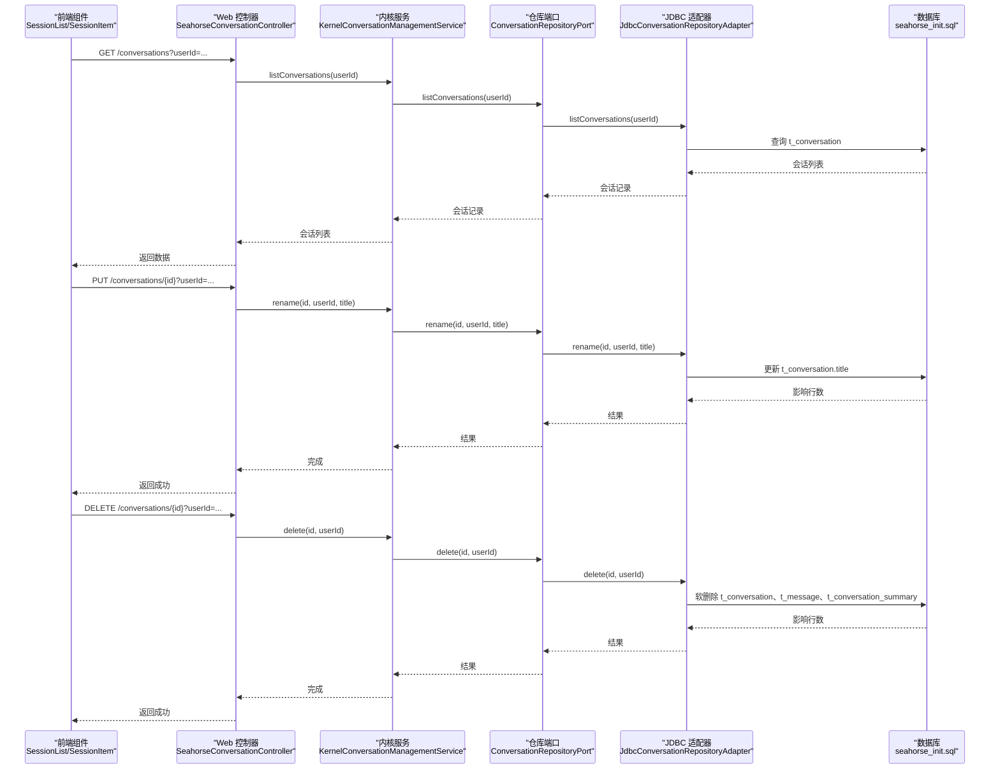
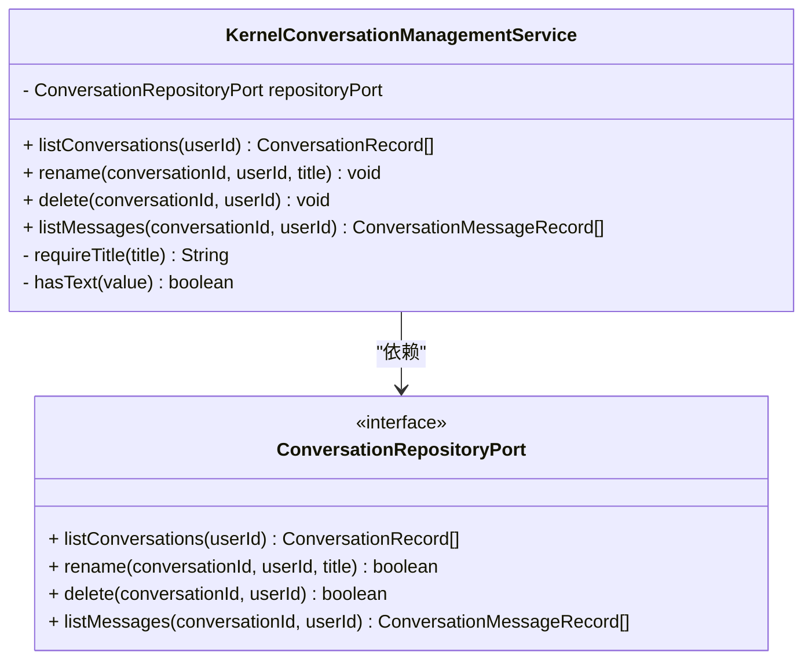
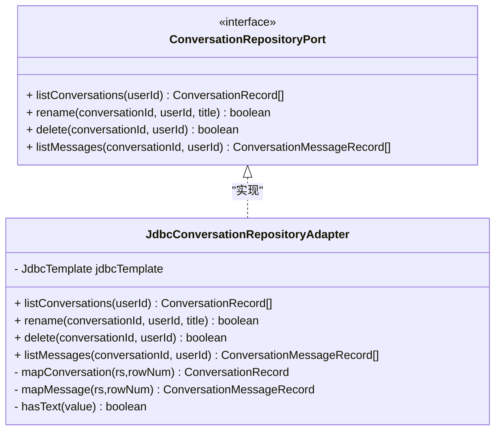
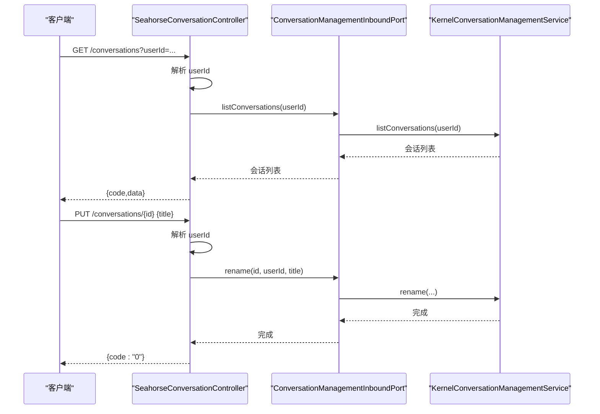
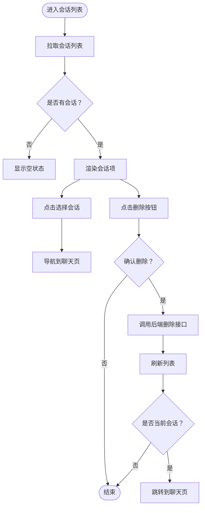
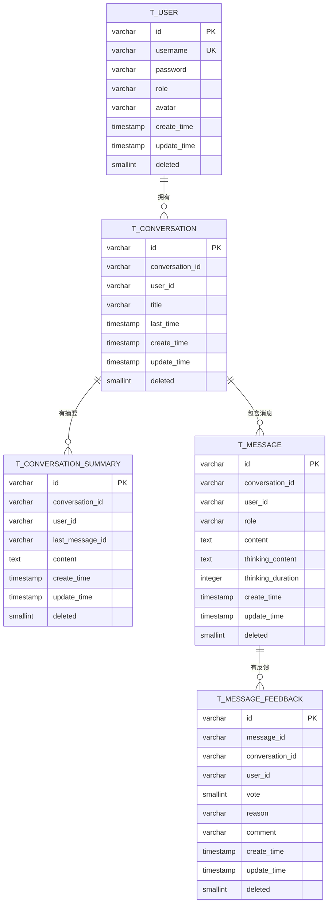
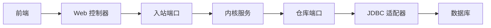

# 会话管理应用服务

<cite>
**本文档引用的文件**
- [KernelConversationManagementService.java](file://seahorse-agent-kernel/src/main/java/com/miracle/ai/seahorse/agent/kernel/application/conversation/KernelConversationManagementService.java)
- [ConversationRepositoryPort.java](file://seahorse-agent-kernel/src/main/java/com/miracle/ai/seahorse/agent/ports/outbound/conversation/ConversationRepositoryPort.java)
- [JdbcConversationRepositoryAdapter.java](file://seahorse-agent-adapter-repository-jdbc/src/main/java/com/miracle/ai/seahorse/agent/adapters/repository/jdbc/JdbcConversationRepositoryAdapter.java)
- [ConversationManagementInboundPort.java](file://seahorse-agent-kernel/src/main/java/com/miracle/ai/seahorse/agent/ports/inbound/conversation/ConversationManagementInboundPort.java)
- [SeahorseConversationController.java](file://seahorse-agent-adapter-web/src/main/java/com/miracle/ai/seahorse/agent/adapters/web/SeahorseConversationController.java)
- [seahorse_init.sql](file://resources/database/seahorse_init.sql)
- [ConversationRecord.java](file://seahorse-agent-kernel/src/main/java/com/miracle/ai/seahorse/agent/ports/outbound/conversation/ConversationRecord.java)
- [ConversationMessageRecord.java](file://seahorse-agent-kernel/src/main/java/com/miracle/ai/seahorse/agent/ports/outbound/conversation/ConversationMessageRecord.java)
- [sessionService.ts](file://frontend/src/services/sessionService.ts)
- [SessionList.tsx](file://frontend/src/components/session/SessionList.tsx)
- [SessionItem.tsx](file://frontend/src/components/session/SessionItem.tsx)
- [SeahorseAgentKernelAutoConfiguration.java](file://seahorse-agent-spring-boot-starter/src/main/java/com/miracle/ai/seahorse/agent/adapters/spring/SeahorseAgentKernelAutoConfiguration.java)
</cite>

## 目录
1. [简介](#简介)
2. [项目结构](#项目结构)
3. [核心组件](#核心组件)
4. [架构概览](#架构概览)
5. [详细组件分析](#详细组件分析)
6. [依赖分析](#依赖分析)
7. [性能考虑](#性能考虑)
8. [故障排查指南](#故障排查指南)
9. [结论](#结论)
10. [附录](#附录)

## 简介
本文件面向“会话管理应用服务”的技术实现，围绕 KernelConversationManagementService 的核心职责展开，系统性阐述会话的创建、维护、查询与删除流程；详解会话状态管理、多轮对话上下文保持、消息历史存储与会话元数据管理；明确会话与用户的关联关系、权限控制与访问管理；给出消息持久化、会话清理策略与性能优化建议；并提供可扩展的实现细节与业务场景示例。

## 项目结构
会话管理能力由“内核层应用服务 + 适配器端口 + 数据访问适配器 + Web 控制器 + 前端服务”协同实现，采用分层与端口适配器模式，确保内核逻辑与外部依赖解耦。

图表来源
- [SeahorseConversationController.java:1-105](file://seahorse-agent-adapter-web/src/main/java/com/miracle/ai/seahorse/agent/adapters/web/SeahorseConversationController.java#L1-L105)
- [KernelConversationManagementService.java:1-87](file://seahorse-agent-kernel/src/main/java/com/miracle/ai/seahorse/agent/kernel/application/conversation/KernelConversationManagementService.java#L1-L87)
- [ConversationManagementInboundPort.java:1-37](file://seahorse-agent-kernel/src/main/java/com/miracle/ai/seahorse/agent/ports/inbound/conversation/ConversationManagementInboundPort.java#L1-L37)
- [ConversationRepositoryPort.java:1-34](file://seahorse-agent-kernel/src/main/java/com/miracle/ai/seahorse/agent/ports/outbound/conversation/ConversationRepositoryPort.java#L1-L34)
- [JdbcConversationRepositoryAdapter.java:1-142](file://seahorse-agent-adapter-repository-jdbc/src/main/java/com/miracle/ai/seahorse/agent/adapters/repository/jdbc/JdbcConversationRepositoryAdapter.java#L1-L142)
- [seahorse_init.sql:1-850](file://resources/database/seahorse_init.sql#L1-L850)

章节来源
- [SeahorseConversationController.java:1-105](file://seahorse-agent-adapter-web/src/main/java/com/miracle/ai/seahorse/agent/adapters/web/SeahorseConversationController.java#L1-L105)
- [KernelConversationManagementService.java:1-87](file://seahorse-agent-kernel/src/main/java/com/miracle/ai/seahorse/agent/kernel/application/conversation/KernelConversationManagementService.java#L1-L87)
- [ConversationManagementInboundPort.java:1-37](file://seahorse-agent-kernel/src/main/java/com/miracle/ai/seahorse/agent/ports/inbound/conversation/ConversationManagementInboundPort.java#L1-L37)
- [ConversationRepositoryPort.java:1-34](file://seahorse-agent-kernel/src/main/java/com/miracle/ai/seahorse/agent/ports/outbound/conversation/ConversationRepositoryPort.java#L1-L34)
- [JdbcConversationRepositoryAdapter.java:1-142](file://seahorse-agent-adapter-repository-jdbc/src/main/java/com/miracle/ai/seahorse/agent/adapters/repository/jdbc/JdbcConversationRepositoryAdapter.java#L1-L142)
- [seahorse_init.sql:1-850](file://resources/database/seahorse_init.sql#L1-L850)

## 核心组件
- 内核应用服务：负责会话生命周期管理（查询、重命名、删除、消息列表），并对输入进行校验与安全裁剪。
- 入站端口接口：定义对外暴露的会话管理能力契约，屏蔽具体实现。
- 仓库端口接口：抽象会话与消息的数据访问能力，便于替换存储后端。
- JDBC 仓库适配器：基于 PostgreSQL 的具体实现，提供会话与消息的 CRUD 与查询。
- Web 控制器：提供 REST API，解析用户标识，调用内核服务。
- 前端服务与组件：封装会话列表、消息列表、删除与重命名操作。

章节来源
- [KernelConversationManagementService.java:31-86](file://seahorse-agent-kernel/src/main/java/com/miracle/ai/seahorse/agent/kernel/application/conversation/KernelConversationManagementService.java#L31-L86)
- [ConversationManagementInboundPort.java:28-37](file://seahorse-agent-kernel/src/main/java/com/miracle/ai/seahorse/agent/ports/inbound/conversation/ConversationManagementInboundPort.java#L28-L37)
- [ConversationRepositoryPort.java:25-34](file://seahorse-agent-kernel/src/main/java/com/miracle/ai/seahorse/agent/ports/outbound/conversation/ConversationRepositoryPort.java#L25-L34)
- [JdbcConversationRepositoryAdapter.java:36-142](file://seahorse-agent-adapter-repository-jdbc/src/main/java/com/miracle/ai/seahorse/agent/adapters/repository/jdbc/JdbcConversationRepositoryAdapter.java#L36-L142)
- [SeahorseConversationController.java:34-105](file://seahorse-agent-adapter-web/src/main/java/com/miracle/ai/seahorse/agent/adapters/web/SeahorseConversationController.java#L34-L105)
- [sessionService.ts:1-35](file://frontend/src/services/sessionService.ts#L1-L35)
- [SessionList.tsx:1-58](file://frontend/src/components/session/SessionList.tsx#L1-L58)
- [SessionItem.tsx:1-69](file://frontend/src/components/session/SessionItem.tsx#L1-L69)

## 架构概览
下图展示了从 Web 控制器到内核服务再到数据访问层的调用链路，以及与数据库表结构的对应关系。

图表来源
- [SeahorseConversationController.java:54-89](file://seahorse-agent-adapter-web/src/main/java/com/miracle/ai/seahorse/agent/adapters/web/SeahorseConversationController.java#L54-L89)
- [KernelConversationManagementService.java:41-70](file://seahorse-agent-kernel/src/main/java/com/miracle/ai/seahorse/agent/kernel/application/conversation/KernelConversationManagementService.java#L41-L70)
- [JdbcConversationRepositoryAdapter.java:80-115](file://seahorse-agent-adapter-repository-jdbc/src/main/java/com/miracle/ai/seahorse/agent/adapters/repository/jdbc/JdbcConversationRepositoryAdapter.java#L80-L115)
- [seahorse_init.sql:32-98](file://resources/database/seahorse_init.sql#L32-L98)

## 详细组件分析

### 会话管理服务（KernelConversationManagementService）
- 职责边界
  - 列出指定用户的会话列表
  - 重命名会话（带长度与空白校验）
  - 删除会话（软删除，同时清理消息与摘要）
  - 查询会话的消息列表
- 输入校验
  - 用户标识与会话标识非空校验
  - 标题长度限制与空白裁剪
- 错误处理
  - 未找到会话时抛出非法参数异常
- 与仓库端口协作
  - 将业务调用委托给 ConversationRepositoryPort 实现

图表来源
- [KernelConversationManagementService.java:31-86](file://seahorse-agent-kernel/src/main/java/com/miracle/ai/seahorse/agent/kernel/application/conversation/KernelConversationManagementService.java#L31-L86)
- [ConversationRepositoryPort.java:25-34](file://seahorse-agent-kernel/src/main/java/com/miracle/ai/seahorse/agent/ports/outbound/conversation/ConversationRepositoryPort.java#L25-L34)

章节来源
- [KernelConversationManagementService.java:31-86](file://seahorse-agent-kernel/src/main/java/com/miracle/ai/seahorse/agent/kernel/application/conversation/KernelConversationManagementService.java#L31-L86)

### 仓库端口与 JDBC 适配器
- 仓库端口接口
  - 定义会话与消息的查询与变更契约
- JDBC 适配器实现
  - 提供 SQL 查询与更新，支持软删除
  - 维护会话与消息的索引与约束
  - 映射数据库列到领域对象

图表来源
- [ConversationRepositoryPort.java:25-34](file://seahorse-agent-kernel/src/main/java/com/miracle/ai/seahorse/agent/ports/outbound/conversation/ConversationRepositoryPort.java#L25-L34)
- [JdbcConversationRepositoryAdapter.java:36-142](file://seahorse-agent-adapter-repository-jdbc/src/main/java/com/miracle/ai/seahorse/agent/adapters/repository/jdbc/JdbcConversationRepositoryAdapter.java#L36-L142)

章节来源
- [ConversationRepositoryPort.java:25-34](file://seahorse-agent-kernel/src/main/java/com/miracle/ai/seahorse/agent/ports/outbound/conversation/ConversationRepositoryPort.java#L25-L34)
- [JdbcConversationRepositoryAdapter.java:36-142](file://seahorse-agent-adapter-repository-jdbc/src/main/java/com/miracle/ai/seahorse/agent/adapters/repository/jdbc/JdbcConversationRepositoryAdapter.java#L36-L142)

### Web 控制器与用户标识解析
- 提供 REST 接口
  - GET /conversations
  - PUT /conversations/{conversationId}
  - DELETE /conversations/{conversationId}
  - GET /conversations/{conversationId}/messages
- 用户标识解析策略
  - 优先从请求参数 userId 获取
  - 其次从请求头 X-User-Id 获取
  - 若均为空则使用默认用户标识
- 统一响应格式
  - 返回包含 code 与 data 的结构化结果

图表来源
- [SeahorseConversationController.java:54-89](file://seahorse-agent-adapter-web/src/main/java/com/miracle/ai/seahorse/agent/adapters/web/SeahorseConversationController.java#L54-L89)
- [KernelConversationManagementService.java:41-70](file://seahorse-agent-kernel/src/main/java/com/miracle/ai/seahorse/agent/kernel/application/conversation/KernelConversationManagementService.java#L41-L70)

章节来源
- [SeahorseConversationController.java:34-105](file://seahorse-agent-adapter-web/src/main/java/com/miracle/ai/seahorse/agent/adapters/web/SeahorseConversationController.java#L34-L105)

### 前端集成与用户交互
- 会话服务
  - listSessions、renameSession、deleteSession、listMessages
- 会话列表组件
  - 自动拉取会话列表，支持选择与删除
- 会话项组件
  - 支持删除确认弹窗，删除后若为当前会话则跳转至聊天页

图表来源
- [sessionService.ts:20-35](file://frontend/src/services/sessionService.ts#L20-L35)
- [SessionList.tsx:12-57](file://frontend/src/components/session/SessionList.tsx#L12-L57)
- [SessionItem.tsx:16-69](file://frontend/src/components/session/SessionItem.tsx#L16-L69)

章节来源
- [sessionService.ts:1-35](file://frontend/src/services/sessionService.ts#L1-L35)
- [SessionList.tsx:1-58](file://frontend/src/components/session/SessionList.tsx#L1-L58)
- [SessionItem.tsx:1-69](file://frontend/src/components/session/SessionItem.tsx#L1-L69)

### 数据模型与表结构
- 会话表（t_conversation）
  - 主键、会话ID、用户ID、标题、最近消息时间、软删除标记
  - 索引：用户+时间
- 会话摘要表（t_conversation_summary）
  - 存放摘要内容与最后消息ID，支持软删除
- 消息表（t_message）
  - 角色、内容、思考内容、思考耗时、软删除标记
  - 索引：会话+用户+时间
- 消息反馈表（t_message_feedback）
  - 投票、原因、评论，按会话与用户建立索引

图表来源
- [seahorse_init.sql:11-98](file://resources/database/seahorse_init.sql#L11-L98)

章节来源
- [seahorse_init.sql:11-98](file://resources/database/seahorse_init.sql#L11-L98)

## 依赖分析
- 内核服务依赖仓库端口，避免直接依赖具体存储实现
- Web 控制器依赖入站端口，通过自动装配注入内核服务实例
- JDBC 适配器实现仓库端口，连接数据库执行 SQL
- 前端通过统一的服务接口与控制器交互

图表来源
- [SeahorseAgentKernelAutoConfiguration.java:459-465](file://seahorse-agent-spring-boot-starter/src/main/java/com/miracle/ai/seahorse/agent/adapters/spring/SeahorseAgentKernelAutoConfiguration.java#L459-L465)
- [SeahorseConversationController.java:40-52](file://seahorse-agent-adapter-web/src/main/java/com/miracle/ai/seahorse/agent/adapters/web/SeahorseConversationController.java#L40-L52)
- [KernelConversationManagementService.java:35-39](file://seahorse-agent-kernel/src/main/java/com/miracle/ai/seahorse/agent/kernel/application/conversation/KernelConversationManagementService.java#L35-L39)

章节来源
- [SeahorseAgentKernelAutoConfiguration.java:459-465](file://seahorse-agent-spring-boot-starter/src/main/java/com/miracle/ai/seahorse/agent/adapters/spring/SeahorseAgentKernelAutoConfiguration.java#L459-L465)
- [SeahorseConversationController.java:40-52](file://seahorse-agent-adapter-web/src/main/java/com/miracle/ai/seahorse/agent/adapters/web/SeahorseConversationController.java#L40-L52)
- [KernelConversationManagementService.java:35-39](file://seahorse-agent-kernel/src/main/java/com/miracle/ai/seahorse/agent/kernel/application/conversation/KernelConversationManagementService.java#L35-L39)

## 性能考虑
- 索引设计
  - 会话表：用户+时间索引，支持按用户快速排序最近会话
  - 消息表：会话+用户+时间索引，支持按时间顺序读取消息
- 软删除策略
  - 通过 deleted 字段实现软删除，避免物理删除带来的统计与审计问题
- 批量清理
  - 删除会话时同步清理消息与摘要，减少碎片与冗余
- 前端缓存与懒加载
  - 列表组件在空状态时仅渲染加载指示，避免不必要的渲染
- SQL 优化
  - 使用 LIMIT/ORDER BY 精准查询，避免全表扫描

[本节为通用性能建议，不直接分析具体文件]

## 故障排查指南
- 常见错误与定位
  - 会话不存在：重命名/删除返回失败时抛出非法参数异常
  - 用户标识缺失：控制器解析 userId 失败时使用默认值，需检查前端请求头或参数
  - 数据库约束冲突：会话ID+用户ID唯一约束，重复创建需检查业务幂等
- 日志与可观测性
  - 建议在 Web 控制器与内核服务增加请求级日志，记录 userId、conversationId、操作类型与耗时
- 数据一致性
  - 删除操作为软删除，需定期巡检 deleted 标记并清理历史数据

章节来源
- [KernelConversationManagementService.java:50-62](file://seahorse-agent-kernel/src/main/java/com/miracle/ai/seahorse/agent/kernel/application/conversation/KernelConversationManagementService.java#L50-L62)
- [SeahorseConversationController.java:91-103](file://seahorse-agent-adapter-web/src/main/java/com/miracle/ai/seahorse/agent/adapters/web/SeahorseConversationController.java#L91-L103)
- [JdbcConversationRepositoryAdapter.java:98-107](file://seahorse-agent-adapter-repository-jdbc/src/main/java/com/miracle/ai/seahorse/agent/adapters/repository/jdbc/JdbcConversationRepositoryAdapter.java#L98-L107)

## 结论
本会话管理应用服务通过清晰的分层与端口适配器模式，实现了会话的创建、维护、查询与删除，具备良好的扩展性与可维护性。结合数据库层面的软删除与索引设计，能够支撑多轮对话的上下文保持与消息历史管理。前端组件与 Web 控制器形成闭环，为用户提供直观的会话管理体验。

[本节为总结性内容，不直接分析具体文件]

## 附录

### API 定义与使用示例
- 列出会话
  - 方法：GET
  - 路径：/conversations
  - 参数：userId 或请求头 X-User-Id
  - 返回：包含 code 与 data 的结构化结果
- 重命名会话
  - 方法：PUT
  - 路径：/conversations/{conversationId}
  - 请求体：{ title }
  - 返回：{ code: "0" }
- 删除会话
  - 方法：DELETE
  - 路径：/conversations/{conversationId}
  - 返回：{ code: "0" }
- 查询消息列表
  - 方法：GET
  - 路径：/conversations/{conversationId}/messages
  - 参数：userId 或请求头 X-User-Id
  - 返回：{ code, data: messages }

章节来源
- [SeahorseConversationController.java:54-89](file://seahorse-agent-adapter-web/src/main/java/com/miracle/ai/seahorse/agent/adapters/web/SeahorseConversationController.java#L54-L89)

### 数据模型字段说明
- 会话表（t_conversation）
  - conversation_id：业务侧会话标识
  - user_id：归属用户
  - title：会话标题
  - last_time：最近消息时间
  - deleted：软删除标记
- 消息表（t_message）
  - role：消息角色（如 user/assistant）
  - content/thinking_content：消息内容与思考内容
  - thinking_duration：思考耗时（秒）
  - deleted：软删除标记
- 反馈表（t_message_feedback）
  - vote：投票（1/-1）
  - reason/comment：反馈原因与评论

章节来源
- [seahorse_init.sql:32-98](file://resources/database/seahorse_init.sql#L32-L98)

### 扩展建议
- 多租户隔离
  - 在用户标识基础上增加租户维度，确保会话与消息跨租户隔离
- 会话标签与分类
  - 引入会话标签字段，支持按标签筛选与统计
- 消息去重与幂等
  - 在消息写入前加入幂等键，避免重复提交导致的历史重复
- 清理策略
  - 配置定期任务清理超过阈值未活跃的会话与其消息，释放存储空间
- 权限控制
  - 在 Web 控制器与内核服务中增加鉴权与授权检查，确保用户只能访问自身会话

[本节为扩展性建议，不直接分析具体文件]