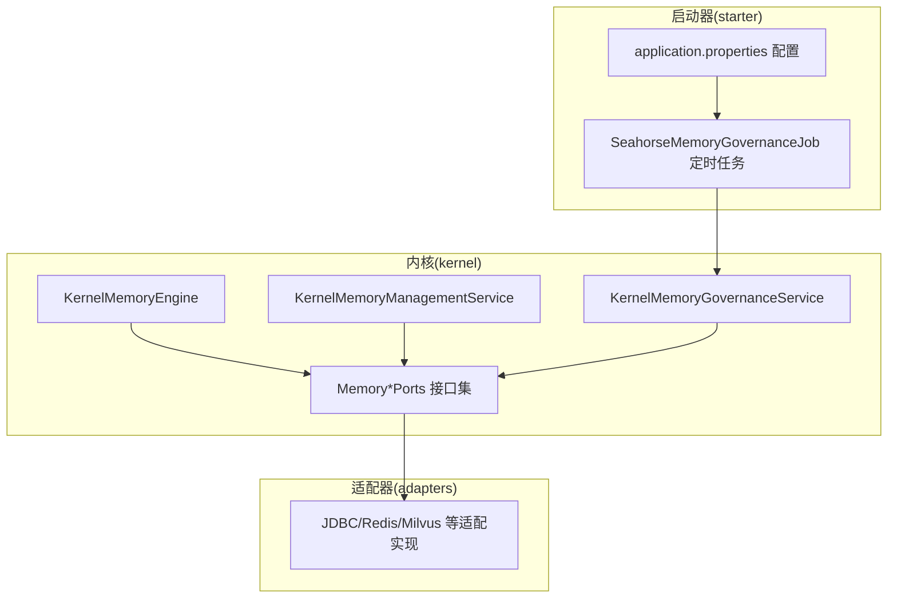
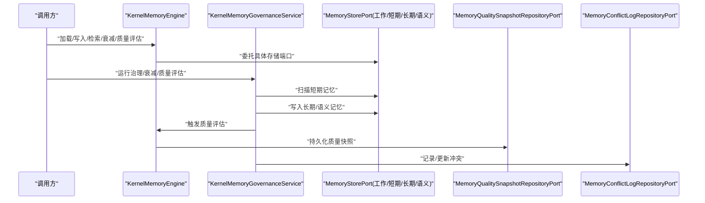
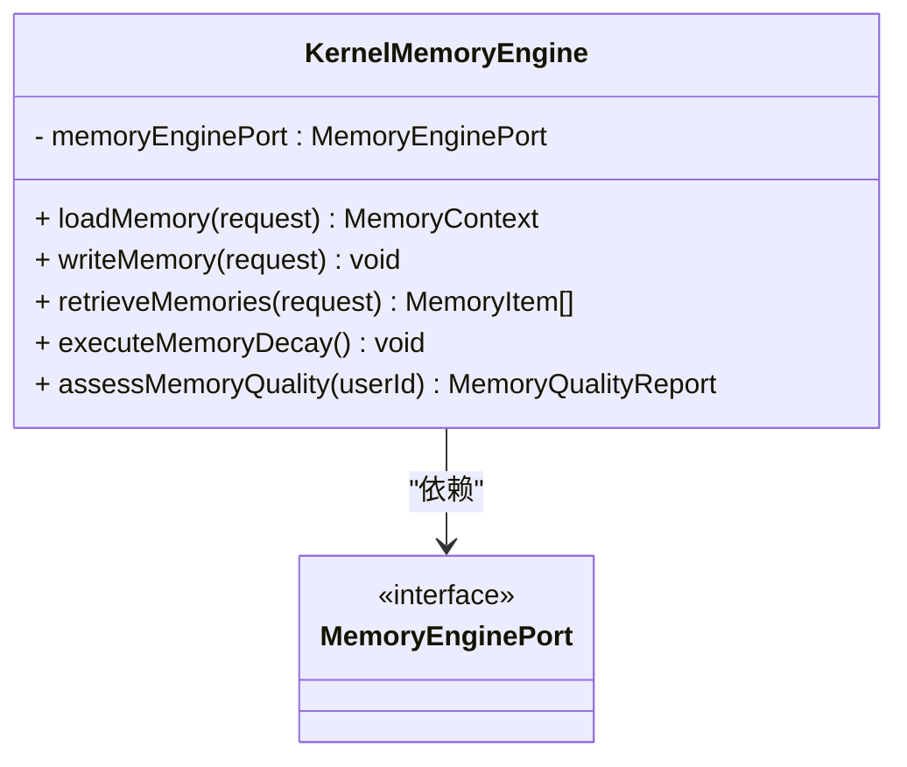
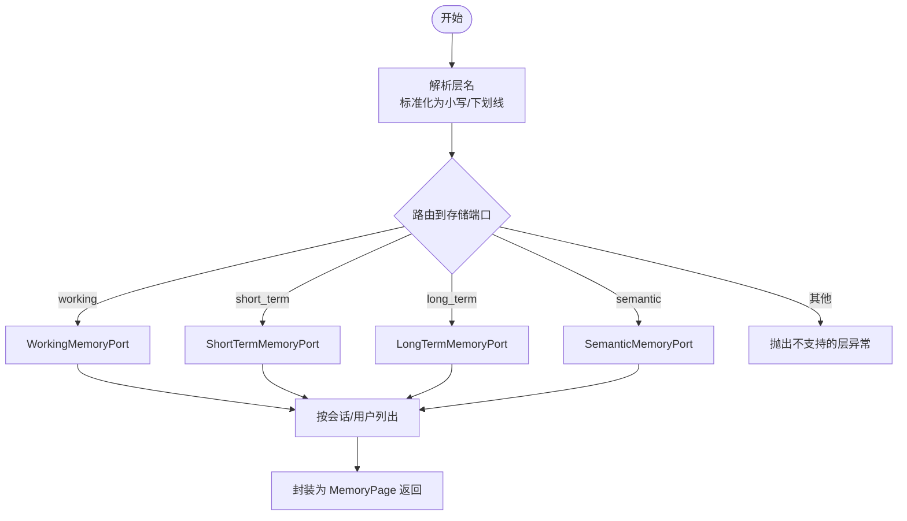
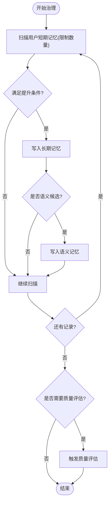
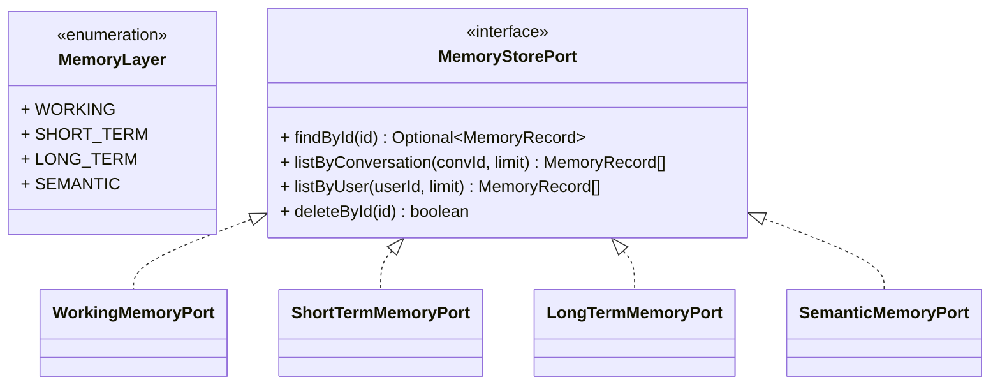
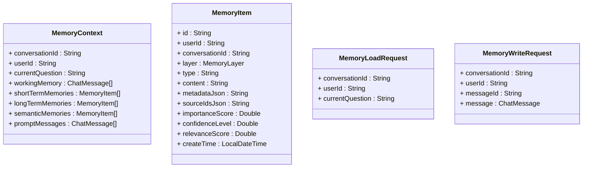
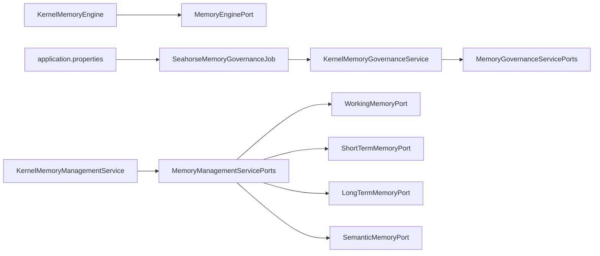

# 内存管理应用服务

<cite>
**本文引用的文件**
- [KernelMemoryEngine.java](file://seahorse-agent-kernel/src/main/java/com/miracle/ai/seahorse/agent/kernel/application/memory/KernelMemoryEngine.java)
- [KernelMemoryManagementService.java](file://seahorse-agent-kernel/src/main/java/com/miracle/ai/seahorse/agent/kernel/application/memory/KernelMemoryManagementService.java)
- [KernelMemoryGovernanceService.java](file://seahorse-agent-kernel/src/main/java/com/miracle/ai/seahorse/agent/kernel/application/memory/KernelMemoryGovernanceService.java)
- [MemoryManagementServicePorts.java](file://seahorse-agent-kernel/src/main/java/com/miracle/ai/seahorse/agent/kernel/application/memory/MemoryManagementServicePorts.java)
- [MemoryGovernanceServicePorts.java](file://seahorse-agent-kernel/src/main/java/com/miracle/ai/seahorse/agent/kernel/application/memory/MemoryGovernanceServicePorts.java)
- [MemoryEnginePort.java](file://seahorse-agent-kernel/src/main/java/com/miracle/ai/seahorse/agent/ports/outbound/memory/MemoryEnginePort.java)
- [MemoryStorePort.java](file://seahorse-agent-kernel/src/main/java/com/miracle/ai/seahorse/agent/ports/outbound/memory/MemoryStorePort.java)
- [WorkingMemoryPort.java](file://seahorse-agent-kernel/src/main/java/com/miracle/ai/seahorse/agent/ports/outbound/memory/WorkingMemoryPort.java)
- [ShortTermMemoryPort.java](file://seahorse-agent-kernel/src/main/java/com/miracle/ai/seahorse/agent/ports/outbound/memory/ShortTermMemoryPort.java)
- [LongTermMemoryPort.java](file://seahorse-agent-kernel/src/main/java/com/miracle/ai/seahorse/agent/ports/outbound/memory/LongTermMemoryPort.java)
- [SemanticMemoryPort.java](file://seahorse-agent-kernel/src/main/java/com/miracle/ai/seahorse/agent/ports/outbound/memory/SemanticMemoryPort.java)
- [MemoryRecord.java](file://seahorse-agent-kernel/src/main/java/com/miracle/ai/seahorse/agent/ports/outbound/memory/MemoryRecord.java)
- [MemoryQualitySnapshot.java](file://seahorse-agent-kernel/src/main/java/com/miracle/ai/seahorse/agent/ports/outbound/memory/MemoryQualitySnapshot.java)
- [MemoryConflictRecord.java](file://seahorse-agent-kernel/src/main/java/com/miracle/ai/seahorse/agent/ports/outbound/memory/MemoryConflictRecord.java)
- [MemoryPage.java](file://seahorse-agent-kernel/src/main/java/com/miracle/ai/seahorse/agent/ports/inbound/memory/MemoryPage.java)
- [MemoryManagementInboundPort.java](file://seahorse-agent-kernel/src/main/java/com/miracle/ai/seahorse/agent/ports/inbound/memory/MemoryManagementInboundPort.java)
- [MemoryContext.java](file://seahorse-agent-kernel/src/main/java/com/miracle/ai/seahorse/agent/kernel/domain/memory/MemoryContext.java)
- [MemoryItem.java](file://seahorse-agent-kernel/src/main/java/com/miracle/ai/seahorse/agent/kernel/domain/memory/MemoryItem.java)
- [MemoryLoadRequest.java](file/.../kernel/domain/memory/MemoryLoadRequest.java)
- [MemoryWriteRequest.java](file://seahorse-agent-kernel/src/main/java/com/miracle/ai/seahorse/agent/kernel/domain/memory/MemoryWriteRequest.java)
- [MemoryLayer.java](file://seahorse-agent-kernel/src/main/java/com/miracle/ai/seahorse/agent/kernel/domain/memory/MemoryLayer.java)
- [MemoryQualityReport.java](file://seahorse-agent-kernel/src/main/java/com/miracle/ai/seahorse/agent/kernel/domain/memory/MemoryQualityReport.java)
- [SeahorseMemoryGovernanceJob.java](file://seahorse-agent-spring-boot-autoconfigure/src/main/java/com/miracle/ai/seahorse/agent/adapters/spring/SeahorseMemoryGovernanceJob.java)
- [application.properties](file://seahorse-agent-spring-boot-autoconfigure/src/main/resources/application.properties)
</cite>

## 目录
1. [引言](#引言)
2. [项目结构](#项目结构)
3. [核心组件](#核心组件)
4. [架构总览](#架构总览)
5. [详细组件分析](#详细组件分析)
6. [依赖关系分析](#依赖关系分析)
7. [性能考量](#性能考量)
8. [故障排查指南](#故障排查指南)
9. [结论](#结论)
10. [附录](#附录)

## 引言
本文件面向“内存管理应用服务”的技术实现，围绕三层核心服务展开：内存引擎（KernelMemoryEngine）、内存管理服务（KernelMemoryManagementService）与内存治理服务（KernelMemoryGovernanceService）。文档重点阐述短期记忆、长期记忆、工作记忆与语义记忆的分层管理机制，以及基于权重评分的治理策略、质量评估、冲突检测与容量控制方法。同时提供优化建议、配置要点与调试技巧，帮助读者在实际部署中获得稳定、高效且可维护的记忆系统。

## 项目结构
本项目采用“内核+适配器+启动器”的分层组织方式：
- kernel 层：定义领域模型、应用服务与端口契约，不直接绑定具体实现；
- adapter 层：提供不同存储与外部系统的适配实现（如 JDBC、Redis、向量库等）；
- starter 层：提供自动装配、定时任务与运行时配置入口。

图表来源
- [KernelMemoryEngine.java:35-62](file://seahorse-agent-kernel/src/main/java/com/miracle/ai/seahorse/agent/kernel/application/memory/KernelMemoryEngine.java#L35-L62)
- [KernelMemoryManagementService.java:32-107](file://seahorse-agent-kernel/src/main/java/com/miracle/ai/seahorse/agent/kernel/application/memory/KernelMemoryManagementService.java#L32-L107)
- [KernelMemoryGovernanceService.java:31-174](file://seahorse-agent-kernel/src/main/java/com/miracle/ai/seahorse/agent/kernel/application/memory/KernelMemoryGovernanceService.java#L31-L174)
- [MemoryManagementServicePorts.java:29-46](file://seahorse-agent-kernel/src/main/java/com/miracle/ai/seahorse/agent/kernel/application/memory/MemoryManagementServicePorts.java#L29-L46)
- [SeahorseMemoryGovernanceJob.java](file://seahorse-agent-spring-boot-autoconfigure/src/main/java/com/miracle/ai/seahorse/agent/adapters/spring/SeahorseMemoryGovernanceJob.java)
- [application.properties](file://seahorse-agent-spring-boot-autoconfigure/src/main/resources/application.properties)

章节来源
- [KernelMemoryEngine.java:35-62](file://seahorse-agent-kernel/src/main/java/com/miracle/ai/seahorse/agent/kernel/application/memory/KernelMemoryEngine.java#L35-L62)
- [KernelMemoryManagementService.java:32-107](file://seahorse-agent-kernel/src/main/java/com/miracle/ai/seahorse/agent/kernel/application/memory/KernelMemoryManagementService.java#L32-L107)
- [KernelMemoryGovernanceService.java:31-174](file://seahorse-agent-kernel/src/main/java/com/miracle/ai/seahorse/agent/kernel/application/memory/KernelMemoryGovernanceService.java#L31-L174)

## 核心组件
- KernelMemoryEngine：作为 L1 记忆内核门面，封装加载、写入、检索、衰减与质量评估等操作，统一对外暴露。
- KernelMemoryManagementService：面向管理与运维的门面，提供按用户/会话列出记忆、查询、删除、质量快照与冲突列表、解决冲突等能力。
- KernelMemoryGovernanceService：负责记忆治理策略执行，包括短期记忆到长期/语义记忆的提升、质量评估触发与衰减执行。

章节来源
- [KernelMemoryEngine.java:35-62](file://seahorse-agent-kernel/src/main/java/com/miracle/ai/seahorse/agent/kernel/application/memory/KernelMemoryEngine.java#L35-L62)
- [KernelMemoryManagementService.java:32-107](file://seahorse-agent-kernel/src/main/java/com/miracle/ai/seahorse/agent/kernel/application/memory/KernelMemoryManagementService.java#L32-L107)
- [KernelMemoryGovernanceService.java:31-174](file://seahorse-agent-kernel/src/main/java/com/miracle/ai/seahorse/agent/kernel/application/memory/KernelMemoryGovernanceService.java#L31-L174)

## 架构总览
下图展示三层服务与端口之间的交互关系，以及治理策略的执行路径。

图表来源
- [KernelMemoryEngine.java:43-61](file://seahorse-agent-kernel/src/main/java/com/miracle/ai/seahorse/agent/kernel/application/memory/KernelMemoryEngine.java#L43-L61)
- [KernelMemoryGovernanceService.java:44-91](file://seahorse-agent-kernel/src/main/java/com/miracle/ai/seahorse/agent/kernel/application/memory/KernelMemoryGovernanceService.java#L44-L91)
- [MemoryManagementServicePorts.java:29-46](file://seahorse-agent-kernel/src/main/java/com/miracle/ai/seahorse/agent/kernel/application/memory/MemoryManagementServicePorts.java#L29-L46)

## 详细组件分析

### KernelMemoryEngine（记忆内核门面）
- 职责：对上提供统一的记忆操作入口，对下通过 MemoryEnginePort 委派到具体实现。
- 关键方法：
  - 加载：根据会话/用户/问题加载多层记忆上下文。
  - 写入：将消息写入工作记忆或短期记忆。
  - 检索：按请求检索短期/长期/语义记忆。
  - 衰减：执行全局记忆衰减。
  - 质量评估：对指定用户的记忆质量进行评估并生成报告。

图表来源
- [KernelMemoryEngine.java:35-62](file://seahorse-agent-kernel/src/main/java/com/miracle/ai/seahorse/agent/kernel/application/memory/KernelMemoryEngine.java#L35-L62)
- [MemoryEnginePort.java](file://seahorse-agent-kernel/src/main/java/com/miracle/ai/seahorse/agent/ports/outbound/memory/MemoryEnginePort.java)

章节来源
- [KernelMemoryEngine.java:35-62](file://seahorse-agent-kernel/src/main/java/com/miracle/ai/seahorse/agent/kernel/application/memory/KernelMemoryEngine.java#L35-L62)

### DefaultMemoryEnginePort（默认记忆引擎实现）
- 职责：编排 ShortTermMemoryPort、LongTermMemoryPort、SemanticMemoryPort 三层记忆的读取和转换。
- 位置：`kernel/application/memory/DefaultMemoryEnginePort.java`（内核侧策略实现，非 JDBC 细节）。
- `loadMemory()`：多层读取、限量（短期 5/长期 3/语义 10）、Jackson 序列化 metadata、去重。
- `writeMemory()`：当前阶段保持 no-op。
- `executeMemoryDecay()`：不实现全量扫描，委托给 KernelMemoryGovernanceService。
- `assessMemoryQuality()`：返回基础计数，不声称具备冲突检测能力。
- 主链路集成：通过 `KernelChatPipeline.activateMemory()` 阶段调用，失败时降级为空记忆上下文。
- 自动配置：`@ConditionalOnBean({ShortTermMemoryPort, LongTermMemoryPort, SemanticMemoryPort})`，ObjectMapper 使用 `ObjectProvider` + fallback。

### KernelMemoryManagementService（内存管理服务）
- 职责：面向管理与运维的入口，支持按用户/会话列出记忆、查询/删除单条记忆、查看质量快照与冲突日志、解决冲突。
- 分层路由：根据传入的层名（working/short_term/long_term/semantic）路由到对应存储端口。
- 参数校验：对空值进行严格校验，保证健壮性。
- 默认限制：列表默认返回条数受控，防止过大负载。

图表来源
- [KernelMemoryManagementService.java:81-95](file://seahorse-agent-kernel/src/main/java/com/miracle/ai/seahorse/agent/kernel/application/memory/KernelMemoryManagementService.java#L81-L95)
- [MemoryPage.java:25-31](file://seahorse-agent-kernel/src/main/java/com/miracle/ai/seahorse/agent/ports/inbound/memory/MemoryPage.java#L25-L31)

章节来源
- [KernelMemoryManagementService.java:32-107](file://seahorse-agent-kernel/src/main/java/com/miracle/ai/seahorse/agent/kernel/application/memory/KernelMemoryManagementService.java#L32-L107)
- [MemoryManagementInboundPort.java:27-40](file://seahorse-agent-kernel/src/main/java/com/miracle/ai/seahorse/agent/ports/inbound/memory/MemoryManagementInboundPort.java#L27-L40)

### KernelMemoryGovernanceService（内存治理服务）
- 职责：执行记忆治理策略，包括短期记忆提升、语义记忆写入、质量评估与衰减执行。
- 提升阈值：可配置的加权评分阈值，决定是否从短期记忆提升至长期/语义记忆。
- 评分规则：
  - 来自元数据的重要性分数与置信度；
  - 类型权重（如 PROFILE、PREFERENCE、SUMMARY、FACT、TODO 等）；
  - 加权后与阈值比较决定是否提升。
- 语义候选：仅对 PROFILE/PREFERENCE 类型进行语义写入。
- 输出：治理运行结果包含提升数量、语义写入数量、错误集合与时间戳；质量评估结果包含各类冲突统计。

图表来源
- [KernelMemoryGovernanceService.java:44-91](file://seahorse-agent-kernel/src/main/java/com/miracle/ai/seahorse/agent/kernel/application/memory/KernelMemoryGovernanceService.java#L44-L91)
- [KernelMemoryGovernanceService.java:109-140](file://seahorse-agent-kernel/src/main/java/com/miracle/ai/seahorse/agent/kernel/application/memory/KernelMemoryGovernanceService.java#L109-L140)

章节来源
- [KernelMemoryGovernanceService.java:31-174](file://seahorse-agent-kernel/src/main/java/com/miracle/ai/seahorse/agent/kernel/application/memory/KernelMemoryGovernanceService.java#L31-L174)
- [MemoryQualityReport.java:26-41](file://seahorse-agent-kernel/src/main/java/com/miracle/ai/seahorse/agent/kernel/domain/memory/MemoryQualityReport.java#L26-L41)

### 记忆分层与存储端口
- 分层定义：工作记忆（WORKING）、短期记忆（SHORT_TERM）、长期记忆（LONG_TERM）、语义记忆（SEMANTIC）。
- 存储端口：
  - MemoryStorePort：统一的存储端口基线，提供按 ID 查找、按会话/用户列表、删除等通用能力。
  - WorkingMemoryPort/ShortTermMemoryPort/LongTermMemoryPort/SemanticMemoryPort：分别对应四层存储，语义记忆强调结构化 upsert 语义。
- 记忆记录：MemoryRecord 统一承载层级、类型、内容与元数据，避免退化为简单 KV。

图表来源
- [MemoryLayer.java:23-28](file://seahorse-agent-kernel/src/main/java/com/miracle/ai/seahorse/agent/kernel/domain/memory/MemoryLayer.java#L23-L28)
- [MemoryStorePort.java:29-41](file://seahorse-agent-kernel/src/main/java/com/miracle/ai/seahorse/agent/ports/outbound/memory/MemoryStorePort.java#L29-L41)
- [WorkingMemoryPort.java](file://seahorse-agent-kernel/src/main/java/com/miracle/ai/seahorse/agent/ports/outbound/memory/WorkingMemoryPort.java#L25)
- [ShortTermMemoryPort.java](file://seahorse-agent-kernel/src/main/java/com/miracle/ai/seahorse/agent/ports/outbound/memory/ShortTermMemoryPort.java#L25)
- [LongTermMemoryPort.java](file://seahorse-agent-kernel/src/main/java/com/miracle/ai/seahorse/agent/ports/outbound/memory/LongTermMemoryPort.java#L25)
- [SemanticMemoryPort.java](file://seahorse-agent-kernel/src/main/java/com/miracle/ai/seahorse/agent/ports/outbound/memory/SemanticMemoryPort.java#L25)

章节来源
- [MemoryLayer.java:23-28](file://seahorse-agent-kernel/src/main/java/com/miracle/ai/seahorse/agent/kernel/domain/memory/MemoryLayer.java#L23-L28)
- [MemoryStorePort.java:29-41](file://seahorse-agent-kernel/src/main/java/com/miracle/ai/seahorse/agent/ports/outbound/memory/MemoryStorePort.java#L29-L41)
- [MemoryRecord.java:36-56](file://seahorse-agent-kernel/src/main/java/com/miracle/ai/seahorse/agent/ports/outbound/memory/MemoryRecord.java#L36-L56)

### 记忆领域模型
- MemoryContext：加载后的多层记忆上下文，包含会话、用户、当前问题、工作记忆、短期/长期/语义记忆与提示消息。
- MemoryItem：记忆条目的领域模型，包含层级、类型、内容、元数据、重要性/置信度/相关性评分及创建时间。
- MemoryLoadRequest/MemoryWriteRequest：加载与写入请求的轻量载体。

图表来源
- [MemoryContext.java:31-41](file://seahorse-agent-kernel/src/main/java/com/miracle/ai/seahorse/agent/kernel/domain/memory/MemoryContext.java#L31-L41)
- [MemoryItem.java:30-44](file://seahorse-agent-kernel/src/main/java/com/miracle/ai/seahorse/agent/kernel/domain/memory/MemoryItem.java#L30-L44)
- [MemoryLoadRequest.java:25-27](file://seahorse-agent-kernel/src/main/java/com/miracle/ai/seahorse/agent/kernel/domain/memory/MemoryLoadRequest.java#L25-L27)
- [MemoryWriteRequest.java:26-28](file://seahorse-agent-kernel/src/main/java/com/miracle/ai/seahorse/agent/kernel/domain/memory/MemoryWriteRequest.java#L26-L28)

章节来源
- [MemoryContext.java:31-41](file://seahorse-agent-kernel/src/main/java/com/miracle/ai/seahorse/agent/kernel/domain/memory/MemoryContext.java#L31-L41)
- [MemoryItem.java:30-44](file://seahorse-agent-kernel/src/main/java/com/miracle/ai/seahorse/agent/kernel/domain/memory/MemoryItem.java#L30-L44)
- [MemoryLoadRequest.java:25-27](file://seahorse-agent-kernel/src/main/java/com/miracle/ai/seahorse/agent/kernel/domain/memory/MemoryLoadRequest.java#L25-L27)
- [MemoryWriteRequest.java:26-28](file://seahorse-agent-kernel/src/main/java/com/miracle/ai/seahorse/agent/kernel/domain/memory/MemoryWriteRequest.java#L26-L28)

### 端口契约与服务组合
- MemoryManagementServicePorts：聚合工作/短期/长期/语义记忆端口与质量快照、冲突日志仓库端口。
- MemoryGovernanceServicePorts：治理服务所需的端口集合（含引擎端口）。

章节来源
- [MemoryManagementServicePorts.java:29-46](file://seahorse-agent-kernel/src/main/java/com/miracle/ai/seahorse/agent/kernel/application/memory/MemoryManagementServicePorts.java#L29-L46)

## 依赖关系分析
- KernelMemoryEngine 依赖 MemoryEnginePort，实现对底层引擎的解耦。
- KernelMemoryManagementService 依赖 MemoryManagementServicePorts，按层路由到具体存储端口。
- KernelMemoryGovernanceService 依赖 MemoryGovernanceServicePorts，执行治理策略并回写长期/语义记忆。
- 启动器中的定时任务（SeahorseMemoryGovernanceJob）周期性触发治理流程，application.properties 提供治理阈值与开关配置。

图表来源
- [KernelMemoryEngine.java:37-41](file://seahorse-agent-kernel/src/main/java/com/miracle/ai/seahorse/agent/kernel/application/memory/KernelMemoryEngine.java#L37-L41)
- [KernelMemoryManagementService.java:36-40](file://seahorse-agent-kernel/src/main/java/com/miracle/ai/seahorse/agent/kernel/application/memory/KernelMemoryManagementService.java#L36-L40)
- [KernelMemoryGovernanceService.java:36-42](file://seahorse-agent-kernel/src/main/java/com/miracle/ai/seahorse/agent/kernel/application/memory/KernelMemoryGovernanceService.java#L36-L42)
- [MemoryManagementServicePorts.java:29-46](file://seahorse-agent-kernel/src/main/java/com/miracle/ai/seahorse/agent/kernel/application/memory/MemoryManagementServicePorts.java#L29-L46)
- [SeahorseMemoryGovernanceJob.java](file://seahorse-agent-spring-boot-autoconfigure/src/main/java/com/miracle/ai/seahorse/agent/adapters/spring/SeahorseMemoryGovernanceJob.java)
- [application.properties](file://seahorse-agent-spring-boot-autoconfigure/src/main/resources/application.properties)

章节来源
- [KernelMemoryEngine.java:37-41](file://seahorse-agent-kernel/src/main/java/com/miracle/ai/seahorse/agent/kernel/application/memory/KernelMemoryEngine.java#L37-L41)
- [KernelMemoryManagementService.java:36-40](file://seahorse-agent-kernel/src/main/java/com/miracle/ai/seahorse/agent/kernel/application/memory/KernelMemoryManagementService.java#L36-L40)
- [KernelMemoryGovernanceService.java:36-42](file://seahorse-agent-kernel/src/main/java/com/miracle/ai/seahorse/agent/kernel/application/memory/KernelMemoryGovernanceService.java#L36-L42)

## 性能考量
- 扫描限制：治理扫描短期记忆时使用固定上限，避免一次性处理过多记录导致阻塞。
- 条件过滤：先做内容/类型/元数据完整性检查，再计算加权评分，减少无效写入。
- 写入批量化：将提升与语义写入合并为原子操作，降低存储端往返次数。
- 缓存与索引：工作记忆与短期记忆建议使用低延迟存储（如 Redis），语义与长期记忆使用向量/关系数据库以支持检索与去重。
- 质量评估：按需触发，避免频繁全量评估造成抖动。

## 故障排查指南
- 常见错误类型
  - 不支持的层名：当传入层名为未知字符串时抛出非法参数异常。
  - 空参数：userId、memoryId 等关键字段为空时抛出非法参数异常。
  - 运行时异常：治理过程中的写入失败会被收集为错误列表，便于定位具体记录。
- 冲突与质量
  - 使用管理服务列出冲突记录与质量快照，结合治理结果定位问题根因。
  - 对冲突进行标记与归档，确保可追溯与可恢复。
- 调试建议
  - 在开发环境开启更细粒度的日志，观察治理阈值与评分变化。
  - 使用 MemoryPage 与 MemoryRecord 的元数据字段辅助定位问题记忆项。
  - 结合 MemoryQualityReport 中的冲突分类统计，识别偏好极性、档案冲突等问题模式。

章节来源
- [KernelMemoryManagementService.java:97-106](file://seahorse-agent-kernel/src/main/java/com/miracle/ai/seahorse/agent/kernel/application/memory/KernelMemoryManagementService.java#L97-L106)
- [KernelMemoryGovernanceService.java:61-73](file://seahorse-agent-kernel/src/main/java/com/miracle/ai/seahorse/agent/kernel/application/memory/KernelMemoryGovernanceService.java#L61-L73)
- [MemoryConflictRecord.java:23-50](file://seahorse-agent-kernel/src/main/java/com/miracle/ai/seahorse/agent/ports/outbound/memory/MemoryConflictRecord.java#L23-L50)
- [MemoryQualitySnapshot.java:24-37](file://seahorse-agent-kernel/src/main/java/com/miracle/ai/seahorse/agent/ports/outbound/memory/MemoryQualitySnapshot.java#L24-L37)

## 结论
本内存管理应用服务通过清晰的三层架构与端口契约，实现了对工作记忆、短期记忆、长期记忆与语义记忆的统一管理。治理服务以可配置的评分阈值为核心，结合质量评估与冲突检测，形成闭环的内存治理机制。配合启动器的定时任务与配置文件，可在生产环境中实现自动化、可观测与可扩展的记忆管理。

## 附录

### 配置选项与调试技巧
- 治理阈值：通过启动器配置文件设置记忆提升阈值，影响短期记忆到长期/语义记忆的提升概率。
- 定时任务：启用治理作业，按计划周期运行治理流程，避免手工干预带来的延迟。
- 日志与观测：在开发与预生产环境增加内存治理与质量评估的日志级别，便于问题定位。
- 数据一致性：确保语义记忆的 upsert 语义与长期记忆的去重策略一致，避免重复与冲突。

章节来源
- [application.properties](file://seahorse-agent-spring-boot-autoconfigure/src/main/resources/application.properties)
- [SeahorseMemoryGovernanceJob.java](file://seahorse-agent-spring-boot-autoconfigure/src/main/java/com/miracle/ai/seahorse/agent/adapters/spring/SeahorseMemoryGovernanceJob.java)