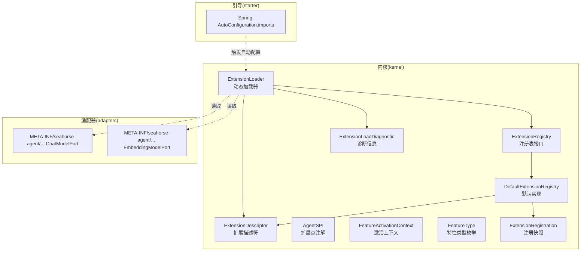
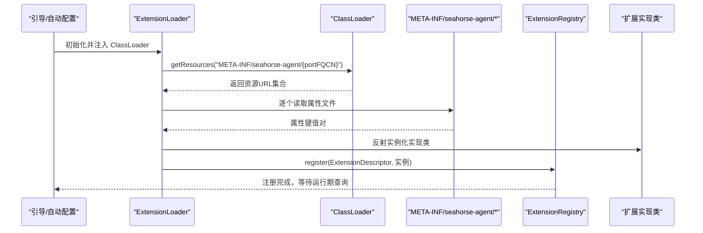
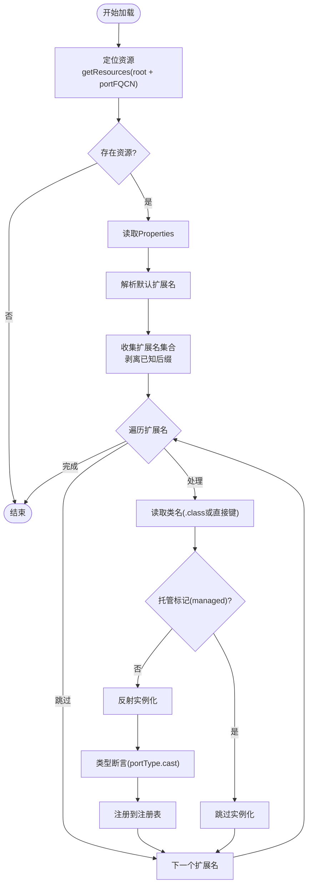
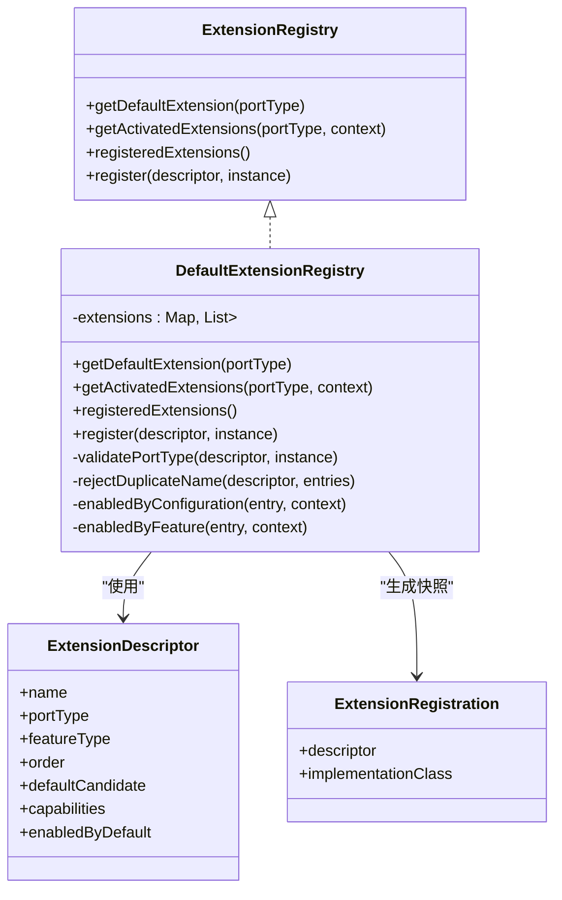
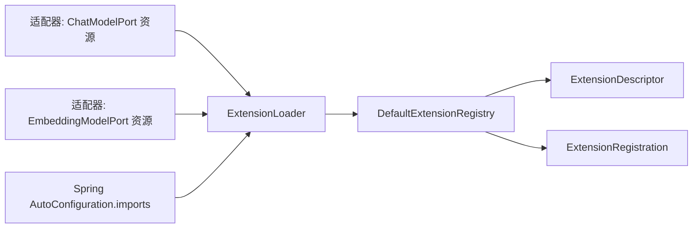

# 加载机制

<cite>
**本文引用的文件**
- [ExtensionLoader.java](file://seahorse-agent-kernel/src/main/java/com/miracle/ai/seahorse/agent/kernel/plugin/ExtensionLoader.java)
- [ExtensionRegistry.java](file://seahorse-agent-kernel/src/main/java/com/miracle/ai/seahorse/agent/kernel/plugin/ExtensionRegistry.java)
- [DefaultExtensionRegistry.java](file://seahorse-agent-kernel/src/main/java/com/miracle/ai/seahorse/agent/kernel/plugin/DefaultExtensionRegistry.java)
- [ExtensionLoadDiagnostic.java](file://seahorse-agent-kernel/src/main/java/com/miracle/ai/seahorse/agent/kernel/plugin/ExtensionLoadDiagnostic.java)
- [ExtensionDescriptor.java](file://seahorse-agent-kernel/src/main/java/com/miracle/ai/seahorse/agent/kernel/plugin/ExtensionDescriptor.java)
- [AgentSPI.java](file://seahorse-agent-kernel/src/main/java/com/miracle/ai/seahorse/agent/kernel/plugin/AgentSPI.java)
- [FeatureActivationContext.java](file://seahorse-agent-kernel/src/main/java/com/miracle/ai/seahorse/agent/kernel/plugin/FeatureActivationContext.java)
- [FeatureType.java](file://seahorse-agent-kernel/src/main/java/com/miracle/ai/seahorse/agent/kernel/plugin/FeatureType.java)
- [ExtensionRegistration.java](file://seahorse-agent-kernel/src/main/java/com/miracle/ai/seahorse/agent/kernel/plugin/ExtensionRegistration.java)
- [OpenAiCompatible ChatModelPort 资源](file://seahorse-agent-adapter-ai-openai-compatible/src/main/resources/META-INF/seahorse-agent/com.miracle.ai.seahorse.agent.ports.outbound.model.ChatModelPort)
- [OpenAiCompatible EmbeddingModelPort 资源](file://seahorse-agent-adapter-ai-openai-compatible/src/main/resources/META-INF/seahorse-agent/com.miracle.ai.seahorse.agent.ports.outbound.model.EmbeddingModelPort)
- [ExtensionLoaderTests$SamplePort 资源](file://seahorse-agent-tests/src/test/resources/META-INF/seahorse-agent/com.miracle.ai.seahorse.agent.kernel.plugin.ExtensionLoaderTests$SamplePort)
- [Spring AutoConfiguration.imports](file://seahorse-agent-spring-boot-autoconfigure/src/main/resources/META-INF/spring/org.springframework.boot.autoconfigure.AutoConfiguration.imports)
</cite>

## 目录
1. [简介](#简介)
2. [项目结构](#项目结构)
3. [核心组件](#核心组件)
4. [架构总览](#架构总览)
5. [详细组件分析](#详细组件分析)
6. [依赖分析](#依赖分析)
7. [性能考虑](#性能考虑)
8. [故障排查指南](#故障排查指南)
9. [结论](#结论)
10. [附录](#附录)

## 简介
本文件系统性阐述 Seahorse Agent 微内核的插件加载机制，重点覆盖以下内容：
- ExtensionLoader 的动态加载算法：基于 classpath 的 SPI 资源发现、类加载器配置、插件发现与实例化流程。
- ExtensionRegistry 与 DefaultExtensionRegistry 的注册表实现：注册、查找、排序与依赖（特性开关）解析机制。
- ExtensionLoadDiagnostic 的诊断功能：如何捕获与报告加载阶段的异常。
- 最佳实践：性能优化、内存管理与故障排查。
- 示例路径：展示插件注册与加载的关键资源与调用流程。

## 项目结构
插件加载机制位于 kernel 模块的 plugin 包中，配合各适配器模块在 META-INF/seahorse-agent 下提供 SPI 资源文件，启动期由加载器读取并注册到注册表，运行期通过注册表进行扩展选择与排序。

**图表来源**
- [ExtensionLoader.java:33-38](file://seahorse-agent-kernel/src/main/java/com/miracle/ai/seahorse/agent/kernel/plugin/ExtensionLoader.java#L33-L38)
- [ExtensionRegistry.java:22-27](file://seahorse-agent-kernel/src/main/java/com/miracle/ai/seahorse/agent/kernel/plugin/ExtensionRegistry.java#L22-L27)
- [DefaultExtensionRegistry.java:27-33](file://seahorse-agent-kernel/src/main/java/com/miracle/ai/seahorse/agent/kernel/plugin/DefaultExtensionRegistry.java#L27-L33)
- [ExtensionLoadDiagnostic.java:22-25](file://seahorse-agent-kernel/src/main/java/com/miracle/ai/seahorse/agent/kernel/plugin/ExtensionLoadDiagnostic.java#L22-L25)
- [ExtensionDescriptor.java:23-28](file://seahorse-agent-kernel/src/main/java/com/miracle/ai/seahorse/agent/kernel/plugin/ExtensionDescriptor.java#L23-L28)
- [AgentSPI.java:26-31](file://seahorse-agent-kernel/src/main/java/com/miracle/ai/seahorse/agent/kernel/plugin/AgentSPI.java#L26-L31)
- [FeatureActivationContext.java:23-27](file://seahorse-agent-kernel/src/main/java/com/miracle/ai/seahorse/agent/kernel/plugin/FeatureActivationContext.java#L23-L27)
- [FeatureType.java:20-25](file://seahorse-agent-kernel/src/main/java/com/miracle/ai/seahorse/agent/kernel/plugin/FeatureType.java#L20-L25)
- [ExtensionRegistration.java:22-25](file://seahorse-agent-kernel/src/main/java/com/miracle/ai/seahorse/agent/kernel/plugin/ExtensionRegistration.java#L22-L25)

**章节来源**
- [ExtensionLoader.java:33-38](file://seahorse-agent-kernel/src/main/java/com/miracle/ai/seahorse/agent/kernel/plugin/ExtensionLoader.java#L33-L38)
- [DefaultExtensionRegistry.java:27-33](file://seahorse-agent-kernel/src/main/java/com/miracle/ai/seahorse/agent/kernel/plugin/DefaultExtensionRegistry.java#L27-L33)

## 核心组件
- ExtensionLoader：负责从 classpath 的 SPI 资源目录读取扩展定义，解析属性键值，实例化扩展并注册到注册表；同时收集加载诊断信息。
- ExtensionRegistry/DefaultExtensionRegistry：注册表接口与默认实现，提供默认扩展获取、按上下文筛选扩展链、注册快照查询以及按 order 排序。
- ExtensionDescriptor：扩展元数据载体，包含名称、端口类型、特性类型、排序、默认候选、能力标签与默认启用标志。
- ExtensionLoadDiagnostic：加载诊断记录，包含资源名、扩展名、实现类名与错误消息。
- AgentSPI：扩展点注解，声明端口是否参与扩展加载及默认扩展名与是否必需。
- FeatureActivationContext/FeatureType：扩展激活上下文与特性类型，用于运行期根据配置与特性逻辑筛选启用的扩展。
- ExtensionRegistration：启动期注册快照，便于可观测与调试。

**章节来源**
- [ExtensionLoader.java:33-38](file://seahorse-agent-kernel/src/main/java/com/miracle/ai/seahorse/agent/kernel/plugin/ExtensionLoader.java#L33-L38)
- [ExtensionRegistry.java:22-27](file://seahorse-agent-kernel/src/main/java/com/miracle/ai/seahorse/agent/kernel/plugin/ExtensionRegistry.java#L22-L27)
- [DefaultExtensionRegistry.java:27-33](file://seahorse-agent-kernel/src/main/java/com/miracle/ai/seahorse/agent/kernel/plugin/DefaultExtensionRegistry.java#L27-L33)
- [ExtensionDescriptor.java:23-28](file://seahorse-agent-kernel/src/main/java/com/miracle/ai/seahorse/agent/kernel/plugin/ExtensionDescriptor.java#L23-L28)
- [ExtensionLoadDiagnostic.java:22-25](file://seahorse-agent-kernel/src/main/java/com/miracle/ai/seahorse/agent/kernel/plugin/ExtensionLoadDiagnostic.java#L22-L25)
- [AgentSPI.java:26-31](file://seahorse-agent-kernel/src/main/java/com/miracle/ai/seahorse/agent/kernel/plugin/AgentSPI.java#L26-L31)
- [FeatureActivationContext.java:23-27](file://seahorse-agent-kernel/src/main/java/com/miracle/ai/seahorse/agent/kernel/plugin/FeatureActivationContext.java#L23-L27)
- [FeatureType.java:20-25](file://seahorse-agent-kernel/src/main/java/com/miracle/ai/seahorse/agent/kernel/plugin/FeatureType.java#L20-L25)
- [ExtensionRegistration.java:22-25](file://seahorse-agent-kernel/src/main/java/com/miracle/ai/seahorse/agent/kernel/plugin/ExtensionRegistration.java#L22-L25)

## 架构总览
插件加载采用“启动期扫描 + 运行期查询”的设计，避免请求链路频繁反射扫描带来的性能抖动。加载器通过指定 ClassLoader 读取 classpath 下的 SPI 资源，解析扩展属性，实例化实现类并写入注册表；注册表在运行期仅执行轻量过滤与排序。

**图表来源**
- [ExtensionLoader.java:95-114](file://seahorse-agent-kernel/src/main/java/com/miracle/ai/seahorse/agent/kernel/plugin/ExtensionLoader.java#L95-L114)
- [ExtensionLoader.java:156-171](file://seahorse-agent-kernel/src/main/java/com/miracle/ai/seahorse/agent/kernel/plugin/ExtensionLoader.java#L156-L171)
- [DefaultExtensionRegistry.java:68-78](file://seahorse-agent-kernel/src/main/java/com/miracle/ai/seahorse/agent/kernel/plugin/DefaultExtensionRegistry.java#L68-L78)

## 详细组件分析

### ExtensionLoader 动态加载算法
- 资源定位与读取
  - 使用固定根路径与端口全限定名拼接资源名，通过 ClassLoader.getResources 定位所有匹配资源。
  - 逐个资源读取为 Properties，提取默认扩展名与扩展名集合。
- 扩展名解析与去重
  - 识别已知后缀（类名、顺序、默认、托管、能力、默认启用），剥离后缀得到扩展名集合，保持插入顺序。
- 实例化与注册
  - 读取扩展类名（支持直接键或 .class 键），校验托管标记（managed=true 时不实例化）。
  - 通过 Class.forName + 反射构造函数实例化，强转为目标端口类型并注册到注册表。
  - 若实例化或类型转换失败，记录诊断信息并抛出异常。
- 诊断与异常
  - 任何注册失败都会生成 ExtensionLoadDiagnostic 并加入内部列表，便于后续聚合与上报。

**图表来源**
- [ExtensionLoader.java:95-114](file://seahorse-agent-kernel/src/main/java/com/miracle/ai/seahorse/agent/kernel/plugin/ExtensionLoader.java#L95-L114)
- [ExtensionLoader.java:156-171](file://seahorse-agent-kernel/src/main/java/com/miracle/ai/seahorse/agent/kernel/plugin/ExtensionLoader.java#L156-L171)
- [ExtensionLoader.java:227-238](file://seahorse-agent-kernel/src/main/java/com/miracle/ai/seahorse/agent/kernel/plugin/ExtensionLoader.java#L227-L238)

**章节来源**
- [ExtensionLoader.java:79-84](file://seahorse-agent-kernel/src/main/java/com/miracle/ai/seahorse/agent/kernel/plugin/ExtensionLoader.java#L79-L84)
- [ExtensionLoader.java:95-114](file://seahorse-agent-kernel/src/main/java/com/miracle/ai/seahorse/agent/kernel/plugin/ExtensionLoader.java#L95-L114)
- [ExtensionLoader.java:156-171](file://seahorse-agent-kernel/src/main/java/com/miracle/ai/seahorse/agent/kernel/plugin/ExtensionLoader.java#L156-L171)
- [ExtensionLoader.java:227-238](file://seahorse-agent-kernel/src/main/java/com/miracle/ai/seahorse/agent/kernel/plugin/ExtensionLoader.java#L227-L238)

### ExtensionRegistry 与 DefaultExtensionRegistry
- 注册表职责
  - 提供默认扩展获取、按 FeatureActivationContext 过滤的扩展链获取、注册快照查询与注册入口。
- 默认实现行为
  - 使用 LinkedHashMap 保存端口到扩展条目的映射，注册时拒绝同端口下重复名称。
  - 注册后按 ExtensionDescriptor.order 升序排序，确保运行期稳定顺序。
  - 获取默认扩展时，筛选 defaultCandidate 为 true 的条目；若不存在则抛出异常。
  - 获取扩展链时，先按配置开关（AgentFeatureProperties.enabled）过滤，再按实现是否为 AgentFeature 且 enabled(context) 判断。
- 注册快照
  - registeredExtensions() 将注册表内容扁平化为 ExtensionRegistration 列表，便于观测与调试。

**图表来源**
- [ExtensionRegistry.java:22-27](file://seahorse-agent-kernel/src/main/java/com/miracle/ai/seahorse/agent/kernel/plugin/ExtensionRegistry.java#L22-L27)
- [DefaultExtensionRegistry.java:27-33](file://seahorse-agent-kernel/src/main/java/com/miracle/ai/seahorse/agent/kernel/plugin/DefaultExtensionRegistry.java#L27-L33)
- [ExtensionDescriptor.java:23-28](file://seahorse-agent-kernel/src/main/java/com/miracle/ai/seahorse/agent/kernel/plugin/ExtensionDescriptor.java#L23-L28)
- [ExtensionRegistration.java:22-25](file://seahorse-agent-kernel/src/main/java/com/miracle/ai/seahorse/agent/kernel/plugin/ExtensionRegistration.java#L22-L25)

**章节来源**
- [ExtensionRegistry.java:28-64](file://seahorse-agent-kernel/src/main/java/com/miracle/ai/seahorse/agent/kernel/plugin/ExtensionRegistry.java#L28-L64)
- [DefaultExtensionRegistry.java:34-124](file://seahorse-agent-kernel/src/main/java/com/miracle/ai/seahorse/agent/kernel/plugin/DefaultExtensionRegistry.java#L34-L124)
- [ExtensionRegistration.java:22-34](file://seahorse-agent-kernel/src/main/java/com/miracle/ai/seahorse/agent/kernel/plugin/ExtensionRegistration.java#L22-L34)

### ExtensionLoadDiagnostic 诊断功能
- 结构
  - 记录资源名、扩展名、实现类名与诊断消息，构造时对空值进行兜底。
- 用途
  - 在 ExtensionLoader 注册失败时生成诊断对象并加入内部列表，便于上层聚合与日志输出。
- 建议
  - 在启动阶段定期检查 diagnostics() 输出，结合资源文件与实现类定位问题。

**章节来源**
- [ExtensionLoadDiagnostic.java:22-45](file://seahorse-agent-kernel/src/main/java/com/miracle/ai/seahorse/agent/kernel/plugin/ExtensionLoadDiagnostic.java#L22-L45)
- [ExtensionLoader.java:166-170](file://seahorse-agent-kernel/src/main/java/com/miracle/ai/seahorse/agent/kernel/plugin/ExtensionLoader.java#L166-L170)

### AgentSPI、FeatureActivationContext 与 FeatureType
- AgentSPI
  - 标记端口是否参与扩展加载，声明默认扩展名与是否为启动必需端口。
- FeatureActivationContext
  - 提供租户、用户、属性与配置快照，作为运行期扩展筛选依据。
- FeatureType
  - 定义受内核认可的稳定扩展点类型，约束插件化边界，避免核心能力空心化。

**章节来源**
- [AgentSPI.java:26-50](file://seahorse-agent-kernel/src/main/java/com/miracle/ai/seahorse/agent/kernel/plugin/AgentSPI.java#L26-L50)
- [FeatureActivationContext.java:23-60](file://seahorse-agent-kernel/src/main/java/com/miracle/ai/seahorse/agent/kernel/plugin/FeatureActivationContext.java#L23-L60)
- [FeatureType.java:20-62](file://seahorse-agent-kernel/src/main/java/com/miracle/ai/seahorse/agent/kernel/plugin/FeatureType.java#L20-L62)

## 依赖分析
- 组件耦合
  - ExtensionLoader 依赖 ClassLoader 与注册表接口；通过资源文件与反射实例化扩展实现与端口的解耦。
  - DefaultExtensionRegistry 依赖 ExtensionDescriptor 与 ExtensionRegistration，内部维护稳定顺序与去重约束。
- 外部集成
  - 各适配器模块在 META-INF/seahorse-agent 下提供端口对应的资源文件，定义扩展名、类名、顺序、默认候选、托管与能力等元信息。
  - Spring 自动配置通过 AutoConfiguration.imports 触发内核与原生适配器的初始化，间接驱动加载器工作。

**图表来源**
- [OpenAiCompatible ChatModelPort 资源:1-5](file://seahorse-agent-adapter-ai-openai-compatible/src/main/resources/META-INF/seahorse-agent/com.miracle.ai.seahorse.agent.ports.outbound.model.ChatModelPort#L1-L5)
- [OpenAiCompatible EmbeddingModelPort 资源:1-5](file://seahorse-agent-adapter-ai-openai-compatible/src/main/resources/META-INF/seahorse-agent/com.miracle.ai.seahorse.agent.ports.outbound.model.EmbeddingModelPort#L1-L5)
- [Spring AutoConfiguration.imports:1-3](file://seahorse-agent-spring-boot-autoconfigure/src/main/resources/META-INF/spring/org.springframework.boot.autoconfigure.AutoConfiguration.imports#L1-L3)
- [ExtensionLoader.java:250-252](file://seahorse-agent-kernel/src/main/java/com/miracle/ai/seahorse/agent/kernel/plugin/ExtensionLoader.java#L250-L252)
- [DefaultExtensionRegistry.java:68-78](file://seahorse-agent-kernel/src/main/java/com/miracle/ai/seahorse/agent/kernel/plugin/DefaultExtensionRegistry.java#L68-L78)

**章节来源**
- [OpenAiCompatible ChatModelPort 资源:1-5](file://seahorse-agent-adapter-ai-openai-compatible/src/main/resources/META-INF/seahorse-agent/com.miracle.ai.seahorse.agent.ports.outbound.model.ChatModelPort#L1-L5)
- [OpenAiCompatible EmbeddingModelPort 资源:1-5](file://seahorse-agent-adapter-ai-openai-compatible/src/main/resources/META-INF/seahorse-agent/com.miracle.ai.seahorse.agent.ports.outbound.model.EmbeddingModelPort#L1-L5)
- [Spring AutoConfiguration.imports:1-3](file://seahorse-agent-spring-boot-autoconfigure/src/main/resources/META-INF/spring/org.springframework.boot.autoconfigure.AutoConfiguration.imports#L1-L3)

## 性能考虑
- 启动期扫描，运行期查询
  - 加载器仅在启动期执行 classpath 资源扫描与反射实例化，运行期通过注册表直接获取扩展链，避免请求链路的反射开销。
- 顺序与去重
  - 注册后按 order 排序，减少运行期排序成本；注册时去重避免冗余条目。
- 能力与托管
  - 通过 capabilities 与 managed 标记在加载期剔除不必要实现，降低运行期分支判断。
- 类加载器选择
  - 支持使用上下文 ClassLoader 或显式注入，确保在不同容器环境下正确解析类路径。

[本节为通用指导，无需特定文件引用]

## 故障排查指南
- 常见问题与定位
  - 实例化失败：检查实现类是否存在、构造函数可见性与签名、与端口类型的兼容性。
  - 类型不匹配：确认实现类确实实现了目标端口类型。
  - 资源读取失败：确认资源文件存在于 classpath 且命名符合约定。
  - 重复扩展名：同一端口下扩展名需唯一，否则注册阶段会抛出异常。
  - 未找到默认扩展：当 defaultCandidate 为 true 的条目缺失时，获取默认扩展会抛出异常。
- 诊断与日志
  - 使用 diagnostics() 获取最近一次加载过程中的诊断信息，结合资源名与扩展名定位具体实现类与错误原因。
- 快速验证
  - 参考测试资源文件与适配器资源文件，对照键名与值格式，确保 .order、.default、.managed、.capabilities、.enabled-by-default 等键正确书写。

**章节来源**
- [ExtensionLoader.java:166-170](file://seahorse-agent-kernel/src/main/java/com/miracle/ai/seahorse/agent/kernel/plugin/ExtensionLoader.java#L166-L170)
- [DefaultExtensionRegistry.java:94-101](file://seahorse-agent-kernel/src/main/java/com/miracle/ai/seahorse/agent/kernel/plugin/DefaultExtensionRegistry.java#L94-L101)
- [ExtensionLoadDiagnostic.java:22-45](file://seahorse-agent-kernel/src/main/java/com/miracle/ai/seahorse/agent/kernel/plugin/ExtensionLoadDiagnostic.java#L22-L45)

## 结论
该插件加载机制通过“启动期扫描 + 运行期查询”的模式，在保证扩展灵活性的同时兼顾性能与稳定性。ExtensionLoader 以 SPI 资源为入口，结合 ExtensionDescriptor 的元信息完成实例化与注册；DefaultExtensionRegistry 提供稳定的排序与筛选能力；ExtensionLoadDiagnostic 为问题定位提供可靠支撑。遵循最佳实践与规范的资源文件编写，可显著提升系统的可维护性与可观测性。

[本节为总结性内容，无需特定文件引用]

## 附录

### 示例：插件注册与加载的关键资源
- 测试资源示例
  - [ExtensionLoaderTests$SamplePort 资源:1-11](file://seahorse-agent-tests/src/test/resources/META-INF/seahorse-agent/com.miracle.ai.seahorse.agent.kernel.plugin.ExtensionLoaderTests$SamplePort#L1-L11)
- 适配器资源示例
  - [OpenAiCompatible ChatModelPort 资源:1-5](file://seahorse-agent-adapter-ai-openai-compatible/src/main/resources/META-INF/seahorse-agent/com.miracle.ai.seahorse.agent.ports.outbound.model.ChatModelPort#L1-L5)
  - [OpenAiCompatible EmbeddingModelPort 资源:1-5](file://seahorse-agent-adapter-ai-openai-compatible/src/main/resources/META-INF/seahorse-agent/com.miracle.ai.seahorse.agent.ports.outbound.model.EmbeddingModelPort#L1-L5)

### 示例：加载流程调用路径
- ExtensionLoader.load(...)
  - [ExtensionLoader.java:79-84](file://seahorse-agent-kernel/src/main/java/com/miracle/ai/seahorse/agent/kernel/plugin/ExtensionLoader.java#L79-L84)
- DefaultExtensionRegistry.register(...)
  - [DefaultExtensionRegistry.java:68-78](file://seahorse-agent-kernel/src/main/java/com/miracle/ai/seahorse/agent/kernel/plugin/DefaultExtensionRegistry.java#L68-L78)
- Spring 自动配置触发
  - [Spring AutoConfiguration.imports:1-3](file://seahorse-agent-spring-boot-autoconfigure/src/main/resources/META-INF/spring/org.springframework.boot.autoconfigure.AutoConfiguration.imports#L1-L3)