# 其他出站端口

<cite>
**本文引用的文件**
- [DashboardRepositoryPort.java](file://seahorse-agent-kernel/src/main/java/com/miracle/ai/seahorse/agent/ports/outbound/dashboard/DashboardRepositoryPort.java)
- [JdbcDashboardRepositoryAdapter.java](file://seahorse-agent-adapter-repository-jdbc/src/main/java/com/miracle/ai/seahorse/agent/adapters/repository/jdbc/JdbcDashboardRepositoryAdapter.java)
- [com.miracle.ai.seahorse.agent.ports.outbound.dashboard.DashboardRepositoryPort](file://seahorse-agent-adapter-repository-jdbc/src/main/resources/META-INF/seahorse-agent/com.miracle.ai.seahorse.agent.ports.outbound.dashboard.DashboardRepositoryPort)
- [SeahorseAgentNativeAdapterAutoConfiguration.java](file://seahorse-agent-spring-boot-autoconfigure/src/main/java/com/miracle/ai/seahorse/agent/adapters/spring/SeahorseAgentNativeAdapterAutoConfiguration.java)
- [MessageFeedbackRepositoryPort.java](file://seahorse-agent-kernel/src/main/java/com/miracle/ai/seahorse/agent/ports/outbound/feedback/MessageFeedbackRepositoryPort.java)
- [JdbcMessageFeedbackRepositoryAdapter.java](file://seahorse-agent-adapter-repository-jdbc/src/main/java/com/miracle/ai/seahorse/agent/adapters/repository/jdbc/JdbcMessageFeedbackRepositoryAdapter.java)
- [com.miracle.ai.seahorse.agent.ports.outbound.feedback.MessageFeedbackRepositoryPort](file://seahorse-agent-adapter-repository-jdbc/src/main/resources/META-INF/seahorse-agent/com.miracle.ai.seahorse.agent.ports.outbound.feedback.MessageFeedbackRepositoryPort)
- [KernelMessageFeedbackService.java](file://seahorse-agent-kernel/src/main/java/com/miracle/ai/seahorse/agent/kernel/application/feedback/KernelMessageFeedbackService.java)
- [SeahorseMessageFeedbackController.java](file://seahorse-agent-adapter-web/src/main/java/com/miracle/ai/seahorse/agent/adapters/web/SeahorseMessageFeedbackController.java)
- [QueryTermMappingRepositoryPort.java](file://seahorse-agent-kernel/src/main/java/com/miracle/ai/seahorse/agent/ports/outbound/mapping/QueryTermMappingRepositoryPort.java)
- [JdbcQueryTermMappingRepositoryAdapter.java](file://seahorse-agent-adapter-repository-jdbc/src/main/java/com/miracle/ai/seahorse/agent/adapters/repository/jdbc/JdbcQueryTermMappingRepositoryAdapter.java)
- [KernelQueryTermMappingService.java](file://seahorse-agent-kernel/src/main/java/com/miracle/ai/seahorse/agent/kernel/application/mapping/KernelQueryTermMappingService.java)
- [SampleQuestionRepositoryPort.java](file://seahorse-agent-kernel/src/main/java/com/miracle/ai/seahorse/agent/ports/outbound/sample/SampleQuestionRepositoryPort.java)
- [JdbcSampleQuestionRepositoryAdapter.java](file://seahorse-agent-adapter-repository-jdbc/src/main/java/com/miracle/ai/seahorse/agent/adapters/repository/jdbc/JdbcSampleQuestionRepositoryAdapter.java)
- [KernelSampleQuestionService.java](file://seahorse-agent-kernel/src/main/java/com/miracle/ai/seahorse/agent/kernel/application/sample/KernelSampleQuestionService.java)
- [SeahorseSampleQuestionController.java](file://seahorse-agent-adapter-web/src/main/java/com/miracle/ai/seahorse/agent/adapters/web/SeahorseSampleQuestionController.java)
- [RagTraceRepositoryPort.java](file://seahorse-agent-kernel/src/main/java/com/miracle/ai/seahorse/agent/ports/outbound/trace/RagTraceRepositoryPort.java)
- [KernelRagTraceService.java](file://seahorse-agent-kernel/src/main/java/com/miracle/ai/seahorse/agent/kernel/application/trace/KernelRagTraceService.java)
- [SeahorseRagTraceController.java](file://seahorse-agent-adapter-web/src/main/java/com/miracle/ai/seahorse/agent/adapters/web/SeahorseRagTraceController.java)
- [SchedulerPort.java](file://seahorse-agent-kernel/src/main/java/com/miracle/ai/seahorse/agent/ports/outbound/schedule/SchedulerPort.java)
- [SpringCronSchedulerPort.java](file://seahorse-agent-spring-boot-autoconfigure/src/main/java/com/miracle/ai/seahorse/agent/adapters/spring/SpringCronSchedulerPort.java)
- [StreamTaskPort.java](file://seahorse-agent-kernel/src/main/java/com/miracle/ai/seahorse/agent/ports/outbound/stream/StreamTaskPort.java)
- [LocalStreamTaskPort.java](file://seahorse-agent-adapter-web/src/main/java/com/miracle/ai/seahorse/agent/adapters/local/LocalStreamTaskPort.java)
- [AgentExtensionStatusPort.java](file://seahorse-agent-kernel/src/main/java/com/miracle/ai/seahorse/agent/ports/outbound/plugin/AgentExtensionStatusPort.java)
- [JdbcAgentExtensionStatusAdapter.java](file://seahorse-agent-adapter-repository-jdbc/src/main/java/com/miracle/ai/seahorse/agent/adapters/repository/jdbc/JdbcAgentExtensionStatusAdapter.java)
- [SeahorsePluginController.java](file://seahorse-agent-adapter-web/src/main/java/com/miracle/ai/seahorse/agent/adapters/web/SeahorsePluginController.java)
</cite>

## 目录
1. [引言](#引言)
2. [项目结构](#项目结构)
3. [核心组件](#核心组件)
4. [架构总览](#架构总览)
5. [详细组件分析](#详细组件分析)
6. [依赖分析](#依赖分析)
7. [性能考虑](#性能考虑)
8. [故障排查指南](#故障排查指南)
9. [结论](#结论)
10. [附录](#附录)

## 引言
本文件聚焦“其他出站端口”，系统性梳理并解释以下辅助功能相关的出站端口设计与实现：仪表盘仓库端口（DashboardRepositoryPort）、消息反馈仓库端口（MessageFeedbackRepositoryPort）、查询词映射仓库端口（QueryTermMappingRepositoryPort）、示例问题仓库端口（SampleQuestionRepositoryPort）、RAG 追踪仓库端口（RagTraceRepositoryPort）、调度器端口（SchedulerPort）、流任务端口（StreamTaskPort）、代理扩展状态端口（AgentExtensionStatusPort）。内容涵盖端口接口定义、数据统计分析、用户行为追踪、任务执行监控、插件管理等关键技术，并通过序列图与类图展示调用链路与数据流，帮助读者快速理解并落地实现。

## 项目结构
这些端口分布在内核模块（ports/outbound）与适配器模块（adapters/*）中，遵循整洁架构的“内核不变、外层可替换”原则：
- 内核定义端口接口与应用服务，负责业务编排与领域逻辑；
- 适配器实现具体端口，对接数据库、消息队列、缓存、外部服务等基础设施；
- Spring 启动器在运行时装配合适的适配器实现。

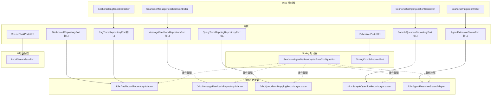

图表来源
- [DashboardRepositoryPort.java:23-30](file://seahorse-agent-kernel/src/main/java/com/miracle/ai/seahorse/agent/ports/outbound/dashboard/DashboardRepositoryPort.java#L23-L30)
- [MessageFeedbackRepositoryPort.java:26-43](file://seahorse-agent-kernel/src/main/java/com/miracle/ai/seahorse/agent/ports/outbound/feedback/MessageFeedbackRepositoryPort.java#L26-L43)
- [QueryTermMappingRepositoryPort.java:25-36](file://seahorse-agent-kernel/src/main/java/com/miracle/ai/seahorse/agent/ports/outbound/mapping/QueryTermMappingRepositoryPort.java#L25-L36)
- [SampleQuestionRepositoryPort.java:26-39](file://seahorse-agent-kernel/src/main/java/com/miracle/ai/seahorse/agent/ports/outbound/sample/SampleQuestionRepositoryPort.java#L26-L39)
- [RagTraceRepositoryPort.java:28-43](file://seahorse-agent-kernel/src/main/java/com/miracle/ai/seahorse/agent/ports/outbound/trace/RagTraceRepositoryPort.java#L28-L43)
- [SchedulerPort.java:25-32](file://seahorse-agent-kernel/src/main/java/com/miracle/ai/seahorse/agent/ports/outbound/schedule/SchedulerPort.java#L25-L32)
- [StreamTaskPort.java:31-98](file://seahorse-agent-kernel/src/main/java/com/miracle/ai/seahorse/agent/ports/outbound/stream/StreamTaskPort.java#L31-L98)
- [AgentExtensionStatusPort.java:27-45](file://seahorse-agent-kernel/src/main/java/com/miracle/ai/seahorse/agent/ports/outbound/plugin/AgentExtensionStatusPort.java#L27-L45)

章节来源
- [DashboardRepositoryPort.java:23-30](file://seahorse-agent-kernel/src/main/java/com/miracle/ai/seahorse/agent/ports/outbound/dashboard/DashboardRepositoryPort.java#L23-L30)
- [MessageFeedbackRepositoryPort.java:26-43](file://seahorse-agent-kernel/src/main/java/com/miracle/ai/seahorse/agent/ports/outbound/feedback/MessageFeedbackRepositoryPort.java#L26-L43)
- [QueryTermMappingRepositoryPort.java:25-36](file://seahorse-agent-kernel/src/main/java/com/miracle/ai/seahorse/agent/ports/outbound/mapping/QueryTermMappingRepositoryPort.java#L25-L36)
- [SampleQuestionRepositoryPort.java:26-39](file://seahorse-agent-kernel/src/main/java/com/miracle/ai/seahorse/agent/ports/outbound/sample/SampleQuestionRepositoryPort.java#L26-L39)
- [RagTraceRepositoryPort.java:28-43](file://seahorse-agent-kernel/src/main/java/com/miracle/ai/seahorse/agent/ports/outbound/trace/RagTraceRepositoryPort.java#L28-L43)
- [SchedulerPort.java:25-32](file://seahorse-agent-kernel/src/main/java/com/miracle/ai/seahorse/agent/ports/outbound/schedule/SchedulerPort.java#L25-L32)
- [StreamTaskPort.java:31-98](file://seahorse-agent-kernel/src/main/java/com/miracle/ai/seahorse/agent/ports/outbound/stream/StreamTaskPort.java#L31-L98)
- [AgentExtensionStatusPort.java:27-45](file://seahorse-agent-kernel/src/main/java/com/miracle/ai/seahorse/agent/ports/outbound/plugin/AgentExtensionStatusPort.java#L27-L45)

## 核心组件
本节概述各端口职责与典型应用场景：
- DashboardRepositoryPort：提供仪表盘概览、性能指标与趋势数据，支撑系统监控与运营看板。
- MessageFeedbackRepositoryPort：支持用户对助手消息的点赞/点踩、评论等反馈，用于质量评估与模型优化。
- QueryTermMappingRepositoryPort：维护查询术语映射规则，提升检索召回与语义一致性。
- SampleQuestionRepositoryPort：管理示例问题，为前端引导与意图识别提供素材。
- RagTraceRepositoryPort：持久化 RAG 执行轨迹，便于问题复现与性能分析。
- SchedulerPort：提供基于 Cron 的下次执行时间计算，支撑定时任务与刷新策略。
- StreamTaskPort：统一流式任务生命周期管理（注册、取消、绑定、注销），保障 SSE/流式输出可控。
- AgentExtensionStatusPort：记录与查询插件/扩展的启用状态、健康度与能力清单，支撑插件治理。

章节来源
- [DashboardRepositoryPort.java:23-30](file://seahorse-agent-kernel/src/main/java/com/miracle/ai/seahorse/agent/ports/outbound/dashboard/DashboardRepositoryPort.java#L23-L30)
- [MessageFeedbackRepositoryPort.java:26-43](file://seahorse-agent-kernel/src/main/java/com/miracle/ai/seahorse/agent/ports/outbound/feedback/MessageFeedbackRepositoryPort.java#L26-L43)
- [QueryTermMappingRepositoryPort.java:25-36](file://seahorse-agent-kernel/src/main/java/com/miracle/ai/seahorse/agent/ports/outbound/mapping/QueryTermMappingRepositoryPort.java#L25-L36)
- [SampleQuestionRepositoryPort.java:26-39](file://seahorse-agent-kernel/src/main/java/com/miracle/ai/seahorse/agent/ports/outbound/sample/SampleQuestionRepositoryPort.java#L26-L39)
- [RagTraceRepositoryPort.java:28-43](file://seahorse-agent-kernel/src/main/java/com/miracle/ai/seahorse/agent/ports/outbound/trace/RagTraceRepositoryPort.java#L28-L43)
- [SchedulerPort.java:25-32](file://seahorse-agent-kernel/src/main/java/com/miracle/ai/seahorse/agent/ports/outbound/schedule/SchedulerPort.java#L25-L32)
- [StreamTaskPort.java:31-98](file://seahorse-agent-kernel/src/main/java/com/miracle/ai/seahorse/agent/ports/outbound/stream/StreamTaskPort.java#L31-L98)
- [AgentExtensionStatusPort.java:27-45](file://seahorse-agent-kernel/src/main/java/com/miracle/ai/seahorse/agent/ports/outbound/plugin/AgentExtensionStatusPort.java#L27-L45)

## 架构总览
下图展示从 Web 控制器到内核应用服务再到 JDBC 适配器的数据通路，以及 Spring 自动装配如何选择合适实现。

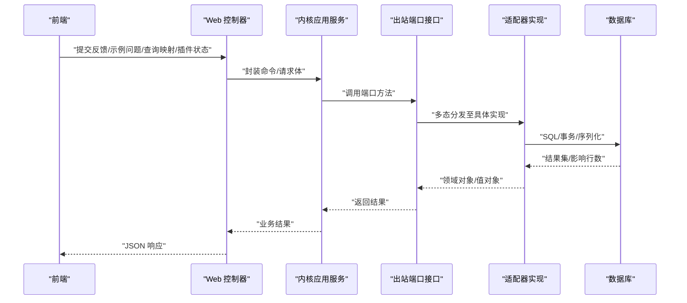

图表来源
- [SeahorseMessageFeedbackController.java:55-86](file://seahorse-agent-adapter-web/src/main/java/com/miracle/ai/seahorse/agent/adapters/web/SeahorseMessageFeedbackController.java#L55-L86)
- [KernelMessageFeedbackService.java:33-52](file://seahorse-agent-kernel/src/main/java/com/miracle/ai/seahorse/agent/kernel/application/feedback/KernelMessageFeedbackService.java#L33-L52)
- [MessageFeedbackRepositoryPort.java:26-43](file://seahorse-agent-kernel/src/main/java/com/miracle/ai/seahorse/agent/ports/outbound/feedback/MessageFeedbackRepositoryPort.java#L26-L43)
- [JdbcMessageFeedbackRepositoryAdapter.java:70-94](file://seahorse-agent-adapter-repository-jdbc/src/main/java/com/miracle/ai/seahorse/agent/adapters/repository/jdbc/JdbcMessageFeedbackRepositoryAdapter.java#L70-L94)
- [SeahorseAgentNativeAdapterAutoConfiguration.java:551-554](file://seahorse-agent-spring-boot-autoconfigure/src/main/java/com/miracle/ai/seahorse/agent/adapters/spring/SeahorseAgentNativeAdapterAutoConfiguration.java#L551-L554)

## 详细组件分析

### 仪表盘仓库端口（DashboardRepositoryPort）
- 职责：提供概览、性能与趋势数据，支撑运营看板与监控面板。
- 关键方法：
  - overview(window): 返回窗口期概览指标
  - performance(window): 返回性能指标
  - trends(metric, window, granularity): 返回指定指标的趋势点
- 实现与装配：
  - JDBC 实现负责 SQL 查询与聚合统计
  - Spring 自动装配在存在 DataSource 时注入 JdbcDashboardRepositoryAdapter
- 数据模型与复杂度：
  - 趋势查询通常涉及时间窗口聚合，复杂度与窗口大小线性相关
  - 建议按粒度与指标建立索引以优化查询

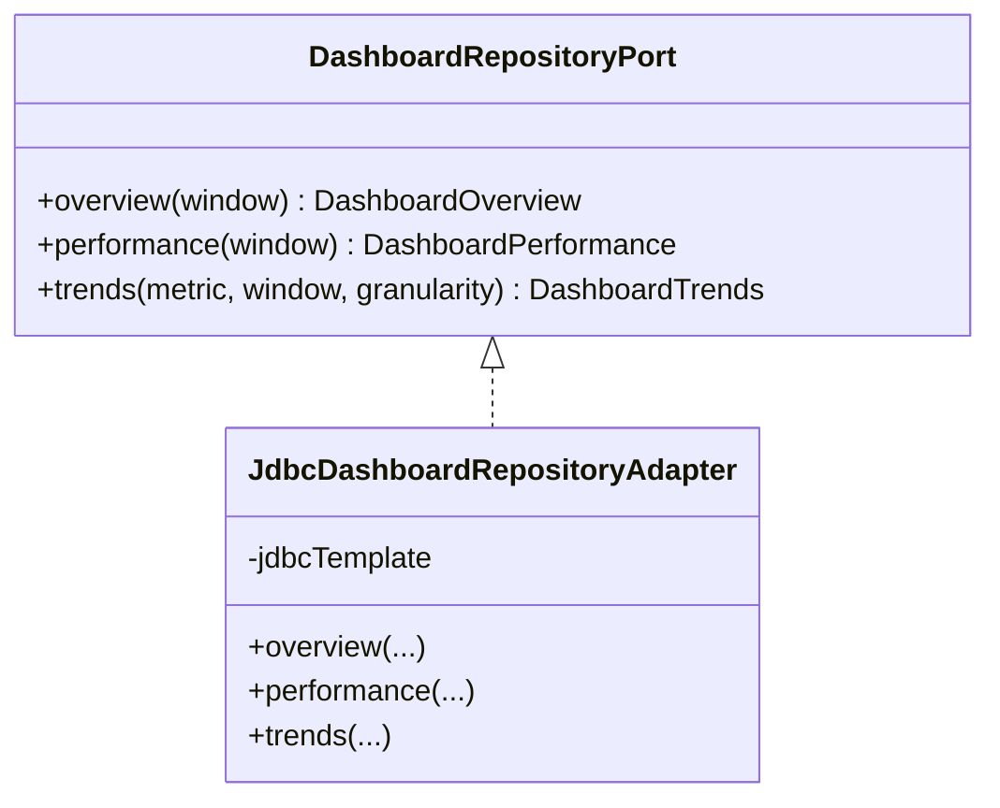

图表来源
- [DashboardRepositoryPort.java:23-30](file://seahorse-agent-kernel/src/main/java/com/miracle/ai/seahorse/agent/ports/outbound/dashboard/DashboardRepositoryPort.java#L23-L30)
- [JdbcDashboardRepositoryAdapter.java:1-25](file://seahorse-agent-adapter-repository-jdbc/src/main/java/com/miracle/ai/seahorse/agent/adapters/repository/jdbc/JdbcDashboardRepositoryAdapter.java#L1-L25)

章节来源
- [DashboardRepositoryPort.java:23-30](file://seahorse-agent-kernel/src/main/java/com/miracle/ai/seahorse/agent/ports/outbound/dashboard/DashboardRepositoryPort.java#L23-L30)
- [JdbcDashboardRepositoryAdapter.java:1-25](file://seahorse-agent-adapter-repository-jdbc/src/main/java/com/miracle/ai/seahorse/agent/adapters/repository/jdbc/JdbcDashboardRepositoryAdapter.java#L1-L25)
- [com.miracle.ai.seahorse.agent.ports.outbound.dashboard.DashboardRepositoryPort:1-1](file://seahorse-agent-adapter-repository-jdbc/src/main/resources/META-INF/seahorse-agent/com.miracle.ai.seahorse.agent.ports.outbound.dashboard.DashboardRepositoryPort#L1-L1)
- [SeahorseAgentNativeAdapterAutoConfiguration.java:551-554](file://seahorse-agent-spring-boot-autoconfigure/src/main/java/com/miracle/ai/seahorse/agent/adapters/spring/SeahorseAgentNativeAdapterAutoConfiguration.java#L551-L554)

### 消息反馈仓库端口（MessageFeedbackRepositoryPort）
- 职责：支持用户对助手消息的反馈（点赞/点踩、原因、评论），用于质量评估与模型优化。
- 关键方法：
  - upsert(feedback): 新增或更新反馈
  - findUserVotes(userId, messageIds): 查询用户对消息集合的投票
- 应用服务与控制器：
  - KernelMessageFeedbackService 将命令转换为提交参数并调用端口
  - Web 控制器接收请求体并转发给应用服务
- 错误处理与约束：
  - 不允许对用户消息进行反馈（仅限助手消息）
  - 空值校验与非法参数抛出异常

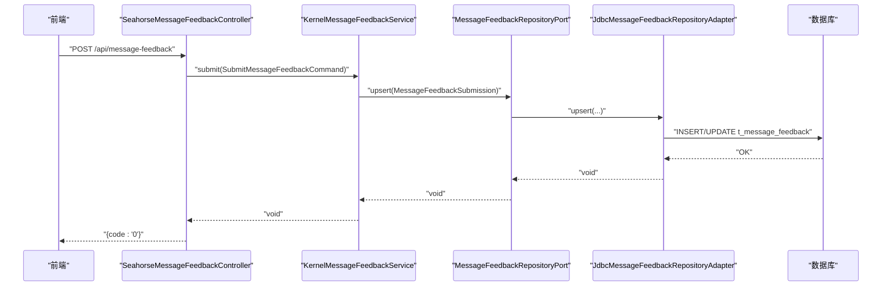

图表来源
- [SeahorseMessageFeedbackController.java:55-86](file://seahorse-agent-adapter-web/src/main/java/com/miracle/ai/seahorse/agent/adapters/web/SeahorseMessageFeedbackController.java#L55-L86)
- [KernelMessageFeedbackService.java:33-52](file://seahorse-agent-kernel/src/main/java/com/miracle/ai/seahorse/agent/kernel/application/feedback/KernelMessageFeedbackService.java#L33-L52)
- [MessageFeedbackRepositoryPort.java:26-43](file://seahorse-agent-kernel/src/main/java/com/miracle/ai/seahorse/agent/ports/outbound/feedback/MessageFeedbackRepositoryPort.java#L26-L43)
- [JdbcMessageFeedbackRepositoryAdapter.java:70-94](file://seahorse-agent-adapter-repository-jdbc/src/main/java/com/miracle/ai/seahorse/agent/adapters/repository/jdbc/JdbcMessageFeedbackRepositoryAdapter.java#L70-L94)

章节来源
- [MessageFeedbackRepositoryPort.java:26-43](file://seahorse-agent-kernel/src/main/java/com/miracle/ai/seahorse/agent/ports/outbound/feedback/MessageFeedbackRepositoryPort.java#L26-L43)
- [KernelMessageFeedbackService.java:33-52](file://seahorse-agent-kernel/src/main/java/com/miracle/ai/seahorse/agent/kernel/application/feedback/KernelMessageFeedbackService.java#L33-L52)
- [SeahorseMessageFeedbackController.java:55-86](file://seahorse-agent-adapter-web/src/main/java/com/miracle/ai/seahorse/agent/adapters/web/SeahorseMessageFeedbackController.java#L55-L86)
- [JdbcMessageFeedbackRepositoryAdapter.java:70-94](file://seahorse-agent-adapter-repository-jdbc/src/main/java/com/miracle/ai/seahorse/agent/adapters/repository/jdbc/JdbcMessageFeedbackRepositoryAdapter.java#L70-L94)
- [com.miracle.ai.seahorse.agent.ports.outbound.feedback.MessageFeedbackRepositoryPort:1-1](file://seahorse-agent-adapter-repository-jdbc/src/main/resources/META-INF/seahorse-agent/com.miracle.ai.seahorse.agent.ports.outbound.feedback.MessageFeedbackRepositoryPort#L1-L1)

### 查询词映射仓库端口（QueryTermMappingRepositoryPort）
- 职责：维护查询术语映射规则（源词、目标词、匹配类型、启用状态、备注），用于检索增强与语义对齐。
- 关键方法：
  - page(current, size, keyword): 分页查询
  - findById(id): 按 ID 查询
  - create(payload)/update(id, payload)/delete(id): CRUD
- 应用服务与控制器：
  - KernelQueryTermMappingService 负责参数校验与缓存清理
  - Web 控制器提供 REST API

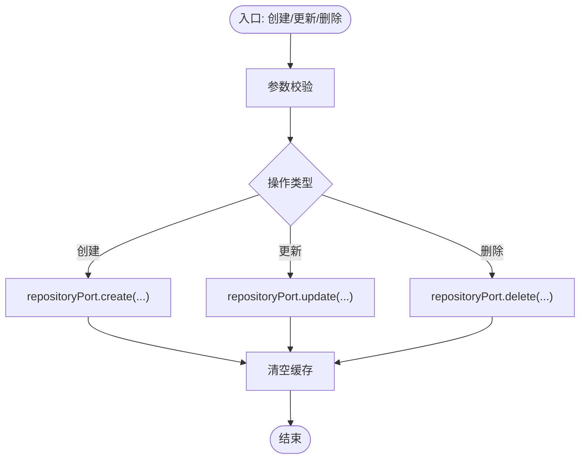

图表来源
- [KernelQueryTermMappingService.java:58-81](file://seahorse-agent-kernel/src/main/java/com/miracle/ai/seahorse/agent/kernel/application/mapping/KernelQueryTermMappingService.java#L58-L81)
- [QueryTermMappingRepositoryPort.java:25-36](file://seahorse-agent-kernel/src/main/java/com/miracle/ai/seahorse/agent/ports/outbound/mapping/QueryTermMappingRepositoryPort.java#L25-L36)

章节来源
- [QueryTermMappingRepositoryPort.java:25-36](file://seahorse-agent-kernel/src/main/java/com/miracle/ai/seahorse/agent/ports/outbound/mapping/QueryTermMappingRepositoryPort.java#L25-L36)
- [JdbcQueryTermMappingRepositoryAdapter.java:1-30](file://seahorse-agent-adapter-repository-jdbc/src/main/java/com/miracle/ai/seahorse/agent/adapters/repository/jdbc/JdbcQueryTermMappingRepositoryAdapter.java#L1-L30)
- [KernelQueryTermMappingService.java:58-81](file://seahorse-agent-kernel/src/main/java/com/miracle/ai/seahorse/agent/kernel/application/mapping/KernelQueryTermMappingService.java#L58-L81)

### 示例问题仓库端口（SampleQuestionRepositoryPort）
- 职责：管理示例问题，支持随机推荐与分页列表。
- 关键方法：
  - listRandomQuestions(limit)
  - page(current, size, keyword)
  - findById(id)/create/update/delete
- 应用服务与控制器：
  - KernelSampleQuestionService 提供分页、查询、CRUD 与参数规范化
  - Web 控制器提供 REST API

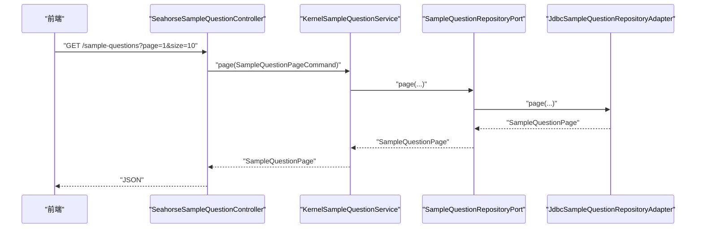

图表来源
- [SeahorseSampleQuestionController.java:61-67](file://seahorse-agent-adapter-web/src/main/java/com/miracle/ai/seahorse/agent/adapters/web/SeahorseSampleQuestionController.java#L61-L67)
- [KernelSampleQuestionService.java:56-60](file://seahorse-agent-kernel/src/main/java/com/miracle/ai/seahorse/agent/kernel/application/sample/KernelSampleQuestionService.java#L56-L60)
- [SampleQuestionRepositoryPort.java:26-39](file://seahorse-agent-kernel/src/main/java/com/miracle/ai/seahorse/agent/ports/outbound/sample/SampleQuestionRepositoryPort.java#L26-L39)
- [JdbcSampleQuestionRepositoryAdapter.java:1-30](file://seahorse-agent-adapter-repository-jdbc/src/main/java/com/miracle/ai/seahorse/agent/adapters/repository/jdbc/JdbcSampleQuestionRepositoryAdapter.java#L1-L30)

章节来源
- [SampleQuestionRepositoryPort.java:26-39](file://seahorse-agent-kernel/src/main/java/com/miracle/ai/seahorse/agent/ports/outbound/sample/SampleQuestionRepositoryPort.java#L26-L39)
- [KernelSampleQuestionService.java:56-127](file://seahorse-agent-kernel/src/main/java/com/miracle/ai/seahorse/agent/kernel/application/sample/KernelSampleQuestionService.java#L56-L127)
- [SeahorseSampleQuestionController.java:56-100](file://seahorse-agent-adapter-web/src/main/java/com/miracle/ai/seahorse/agent/adapters/web/SeahorseSampleQuestionController.java#L56-L100)
- [JdbcSampleQuestionRepositoryAdapter.java:1-30](file://seahorse-agent-adapter-repository-jdbc/src/main/java/com/miracle/ai/seahorse/agent/adapters/repository/jdbc/JdbcSampleQuestionRepositoryAdapter.java#L1-L30)

### RAG 追踪仓库端口（RagTraceRepositoryPort）
- 职责：持久化 RAG 执行轨迹（运行、节点的开始/结束），支持后台管理与问题复盘。
- 关键方法：
  - pageRuns(request)/findRun(traceId)/listNodes(traceId)
  - startRun/finishRun/startNode/finishNode
- 应用服务与控制器：
  - KernelRagTraceService 编排轨迹记录
  - Web 控制器提供分页与详情 API

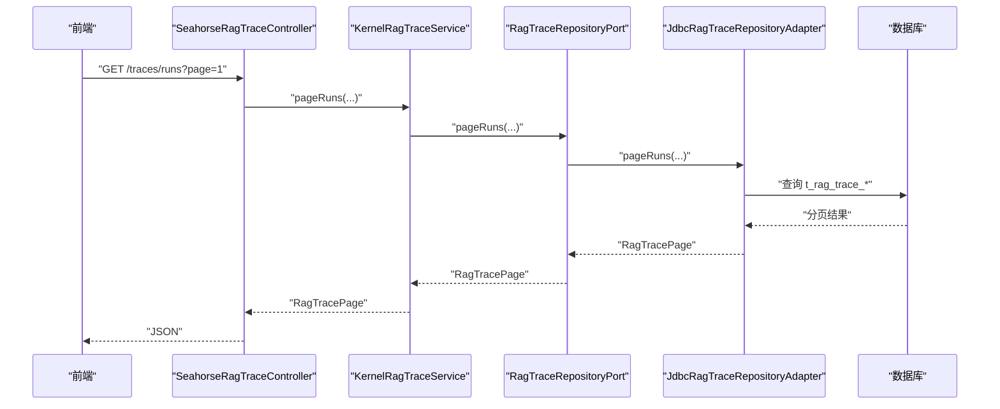

图表来源
- [SeahorseRagTraceController.java:1-200](file://seahorse-agent-adapter-web/src/main/java/com/miracle/ai/seahorse/agent/adapters/web/SeahorseRagTraceController.java#L1-L200)
- [RagTraceRepositoryPort.java:28-43](file://seahorse-agent-kernel/src/main/java/com/miracle/ai/seahorse/agent/ports/outbound/trace/RagTraceRepositoryPort.java#L28-L43)

章节来源
- [RagTraceRepositoryPort.java:28-43](file://seahorse-agent-kernel/src/main/java/com/miracle/ai/seahorse/agent/ports/outbound/trace/RagTraceRepositoryPort.java#L28-L43)
- [KernelRagTraceService.java:1-200](file://seahorse-agent-kernel/src/main/java/com/miracle/ai/seahorse/agent/kernel/application/trace/KernelRagTraceService.java#L1-L200)
- [SeahorseRagTraceController.java:1-200](file://seahorse-agent-adapter-web/src/main/java/com/miracle/ai/seahorse/agent/adapters/web/SeahorseRagTraceController.java#L1-L200)

### 调度器端口（SchedulerPort）
- 职责：根据 Cron 表达式与起始时间计算下次执行时间，用于定时任务与刷新策略。
- 关键方法：
  - nextRun(cron, from): 计算下次执行时间
  - none(): 返回空实现（禁用调度）

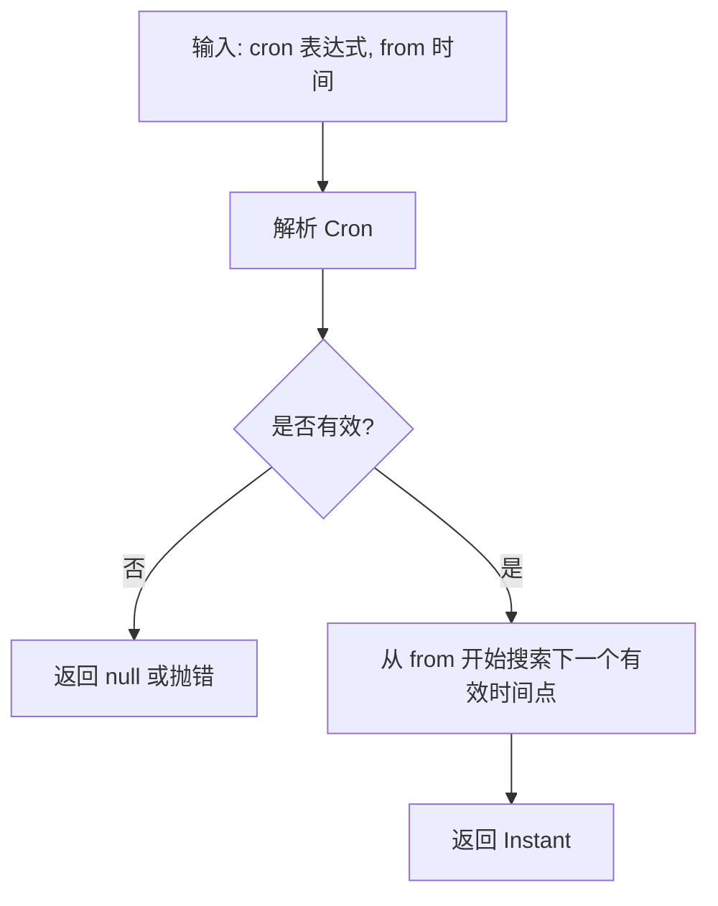

图表来源
- [SchedulerPort.java:25-32](file://seahorse-agent-kernel/src/main/java/com/miracle/ai/seahorse/agent/ports/outbound/schedule/SchedulerPort.java#L25-L32)
- [SpringCronSchedulerPort.java:1-200](file://seahorse-agent-spring-boot-autoconfigure/src/main/java/com/miracle/ai/seahorse/agent/adapters/spring/SpringCronSchedulerPort.java#L1-L200)

章节来源
- [SchedulerPort.java:25-32](file://seahorse-agent-kernel/src/main/java/com/miracle/ai/seahorse/agent/ports/outbound/schedule/SchedulerPort.java#L25-L32)
- [SpringCronSchedulerPort.java:1-200](file://seahorse-agent-spring-boot-autoconfigure/src/main/java/com/miracle/ai/seahorse/agent/adapters/spring/SpringCronSchedulerPort.java#L1-L200)

### 流任务端口（StreamTaskPort）
- 职责：统一管理流式任务生命周期（注册、取消、绑定句柄、注销），确保 SSE/流式输出可控。
- 关键方法：
  - register/bindHandle/isCancelled/cancel/unregister
  - noop(): 空实现（无副作用）
- 本地实现：
  - LocalStreamTaskPort 在单节点内存中维护任务状态，支持立即取消与事件发送

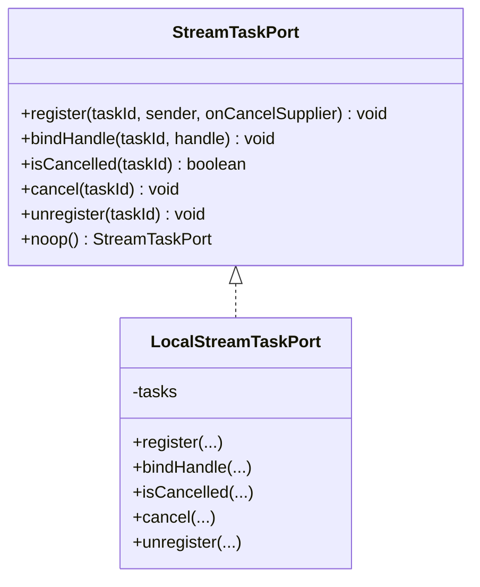

图表来源
- [StreamTaskPort.java:31-98](file://seahorse-agent-kernel/src/main/java/com/miracle/ai/seahorse/agent/ports/outbound/stream/StreamTaskPort.java#L31-L98)
- [LocalStreamTaskPort.java:35-110](file://seahorse-agent-adapter-web/src/main/java/com/miracle/ai/seahorse/agent/adapters/local/LocalStreamTaskPort.java#L35-L110)

章节来源
- [StreamTaskPort.java:31-98](file://seahorse-agent-kernel/src/main/java/com/miracle/ai/seahorse/agent/ports/outbound/stream/StreamTaskPort.java#L31-L98)
- [LocalStreamTaskPort.java:35-110](file://seahorse-agent-adapter-web/src/main/java/com/miracle/ai/seahorse/agent/adapters/local/LocalStreamTaskPort.java#L35-L110)

### 代理扩展状态端口（AgentExtensionStatusPort）
- 职责：记录与查询插件/扩展的启用状态、健康度、能力清单与诊断详情，支撑插件治理。
- 关键方法：
  - listStatuses(): 列出所有扩展状态
  - saveStatus(status): 保存状态（含 JSON 字段序列化）
  - empty(): 空实现（用于兜底）
- JDBC 实现：
  - 使用 JSON 字段存储 capabilities 与 details，自动序列化/反序列化

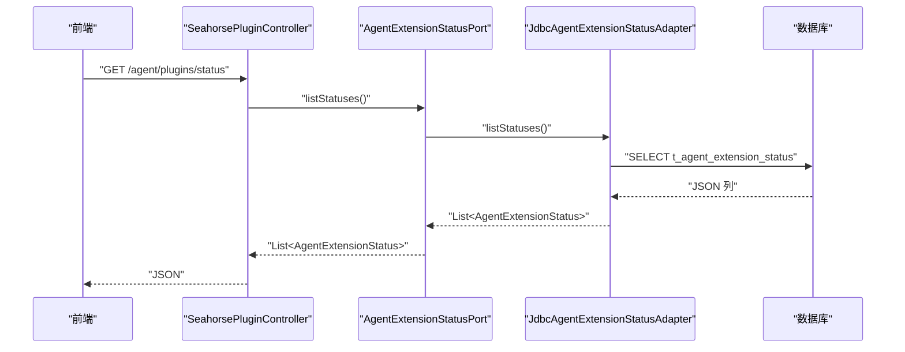

图表来源
- [SeahorsePluginController.java:64-68](file://seahorse-agent-adapter-web/src/main/java/com/miracle/ai/seahorse/agent/adapters/web/SeahorsePluginController.java#L64-L68)
- [AgentExtensionStatusPort.java:27-45](file://seahorse-agent-kernel/src/main/java/com/miracle/ai/seahorse/agent/ports/outbound/plugin/AgentExtensionStatusPort.java#L27-L45)
- [JdbcAgentExtensionStatusAdapter.java:40-150](file://seahorse-agent-adapter-repository-jdbc/src/main/java/com/miracle/ai/seahorse/agent/adapters/repository/jdbc/JdbcAgentExtensionStatusAdapter.java#L40-L150)

章节来源
- [AgentExtensionStatusPort.java:27-45](file://seahorse-agent-kernel/src/main/java/com/miracle/ai/seahorse/agent/ports/outbound/plugin/AgentExtensionStatusPort.java#L27-L45)
- [JdbcAgentExtensionStatusAdapter.java:40-150](file://seahorse-agent-adapter-repository-jdbc/src/main/java/com/miracle/ai/seahorse/agent/adapters/repository/jdbc/JdbcAgentExtensionStatusAdapter.java#L40-L150)
- [SeahorsePluginController.java:58-113](file://seahorse-agent-adapter-web/src/main/java/com/miracle/ai/seahorse/agent/adapters/web/SeahorsePluginController.java#L58-L113)

## 依赖分析
- 端口与实现解耦：内核仅依赖接口，适配器实现可替换，便于测试与扩展。
- Spring 条件装配：当满足 DataSource、ObjectMapper 等条件时，自动注入 JDBC 适配器。
- 外部依赖：JDBC 适配器依赖 Spring JDBC Template 与 JSON 序列化库；流任务端口可结合 Redis/分布式锁实现跨节点协调（由上层适配器承担）。

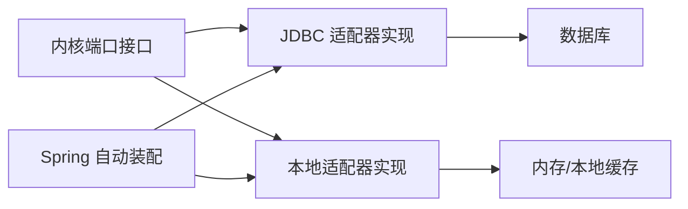

图表来源
- [SeahorseAgentNativeAdapterAutoConfiguration.java:551-554](file://seahorse-agent-spring-boot-autoconfigure/src/main/java/com/miracle/ai/seahorse/agent/adapters/spring/SeahorseAgentNativeAdapterAutoConfiguration.java#L551-L554)
- [LocalStreamTaskPort.java:35-110](file://seahorse-agent-adapter-web/src/main/java/com/miracle/ai/seahorse/agent/adapters/local/LocalStreamTaskPort.java#L35-L110)

章节来源
- [SeahorseAgentNativeAdapterAutoConfiguration.java:551-554](file://seahorse-agent-spring-boot-autoconfigure/src/main/java/com/miracle/ai/seahorse/agent/adapters/spring/SeahorseAgentNativeAdapterAutoConfiguration.java#L551-L554)

## 性能考虑
- 查询优化
  - 仪表盘趋势与分页查询建议建立时间索引与复合索引，避免全表扫描
  - 反馈与映射查询使用 IN 子句时注意参数数量上限，必要时拆分批次
- 序列化成本
  - 扩展状态的 JSON 字段读写需控制字段大小，避免超长 JSON 影响 IO
- 并发与一致性
  - 流任务取消采用 CAS 标志位，避免重复取消与竞态
- 缓存策略
  - 查询映射与示例问题可引入本地缓存，配合应用服务的缓存失效机制

## 故障排查指南
- 反馈提交失败
  - 现象：对用户消息提交反馈报错
  - 原因：仅允许对助手消息反馈
  - 处理：检查消息角色与关联关系
- 分页与参数
  - 现象：分页结果异常或参数无效
  - 原因：current/size 规范化逻辑与关键字过滤
  - 处理：确认分页参数范围与关键字非空处理
- 插件状态为空
  - 现象：插件状态列表为空
  - 原因：未装配 AgentExtensionStatusPort 或数据库无记录
  - 处理：确认自动装配条件与初始化数据

章节来源
- [JdbcMessageFeedbackRepositoryAdapter.java:74-94](file://seahorse-agent-adapter-repository-jdbc/src/main/java/com/miracle/ai/seahorse/agent/adapters/repository/jdbc/JdbcMessageFeedbackRepositoryAdapter.java#L74-L94)
- [KernelSampleQuestionService.java:101-127](file://seahorse-agent-kernel/src/main/java/com/miracle/ai/seahorse/agent/kernel/application/sample/KernelSampleQuestionService.java#L101-L127)
- [JdbcAgentExtensionStatusAdapter.java:79-92](file://seahorse-agent-adapter-repository-jdbc/src/main/java/com/miracle/ai/seahorse/agent/adapters/repository/jdbc/JdbcAgentExtensionStatusAdapter.java#L79-L92)

## 结论
本文系统梳理了“其他出站端口”的接口定义、实现方式与集成路径，覆盖监控、用户反馈、查询优化、任务调度、流式处理与插件管理等关键辅助功能。通过清晰的端口-适配器分离与 Spring 条件装配，系统实现了高内聚、低耦合与强扩展性。建议在生产环境中结合索引优化、缓存策略与可观测性埋点，持续提升稳定性与性能。

## 附录
- 代码示例路径（不展示具体代码内容）
  - 反馈提交流程：[SeahorseMessageFeedbackController.java:55-86](file://seahorse-agent-adapter-web/src/main/java/com/miracle/ai/seahorse/agent/adapters/web/SeahorseMessageFeedbackController.java#L55-L86) → [KernelMessageFeedbackService.java:33-52](file://seahorse-agent-kernel/src/main/java/com/miracle/ai/seahorse/agent/kernel/application/feedback/KernelMessageFeedbackService.java#L33-L52) → [MessageFeedbackRepositoryPort.java:26-43](file://seahorse-agent-kernel/src/main/java/com/miracle/ai/seahorse/agent/ports/outbound/feedback/MessageFeedbackRepositoryPort.java#L26-L43) → [JdbcMessageFeedbackRepositoryAdapter.java:70-94](file://seahorse-agent-adapter-repository-jdbc/src/main/java/com/miracle/ai/seahorse/agent/adapters/repository/jdbc/JdbcMessageFeedbackRepositoryAdapter.java#L70-L94)
  - 示例问题管理：[SeahorseSampleQuestionController.java:61-92](file://seahorse-agent-adapter-web/src/main/java/com/miracle/ai/seahorse/agent/adapters/web/SeahorseSampleQuestionController.java#L61-L92) → [KernelSampleQuestionService.java:56-99](file://seahorse-agent-kernel/src/main/java/com/miracle/ai/seahorse/agent/kernel/application/sample/KernelSampleQuestionService.java#L56-L99) → [SampleQuestionRepositoryPort.java:26-39](file://seahorse-agent-kernel/src/main/java/com/miracle/ai/seahorse/agent/ports/outbound/sample/SampleQuestionRepositoryPort.java#L26-L39) → [JdbcSampleQuestionRepositoryAdapter.java:1-30](file://seahorse-agent-adapter-repository-jdbc/src/main/java/com/miracle/ai/seahorse/agent/adapters/repository/jdbc/JdbcSampleQuestionRepositoryAdapter.java#L1-L30)
  - 插件状态管理：[SeahorsePluginController.java:64-81](file://seahorse-agent-adapter-web/src/main/java/com/miracle/ai/seahorse/agent/adapters/web/SeahorsePluginController.java#L64-L81) → [AgentExtensionStatusPort.java:27-45](file://seahorse-agent-kernel/src/main/java/com/miracle/ai/seahorse/agent/ports/outbound/plugin/AgentExtensionStatusPort.java#L27-L45) → [JdbcAgentExtensionStatusAdapter.java:79-129](file://seahorse-agent-adapter-repository-jdbc/src/main/java/com/miracle/ai/seahorse/agent/adapters/repository/jdbc/JdbcAgentExtensionStatusAdapter.java#L79-L129)