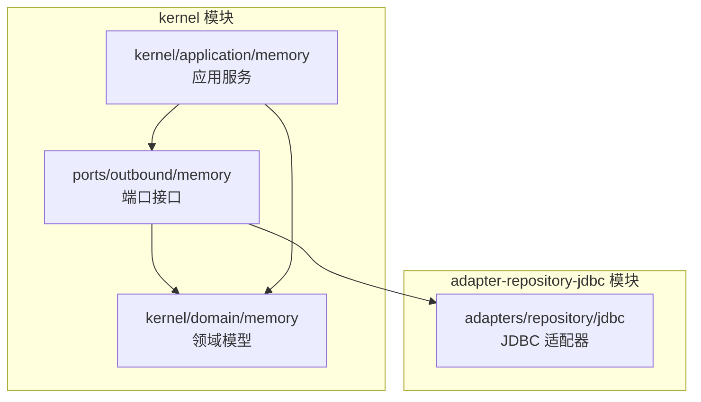
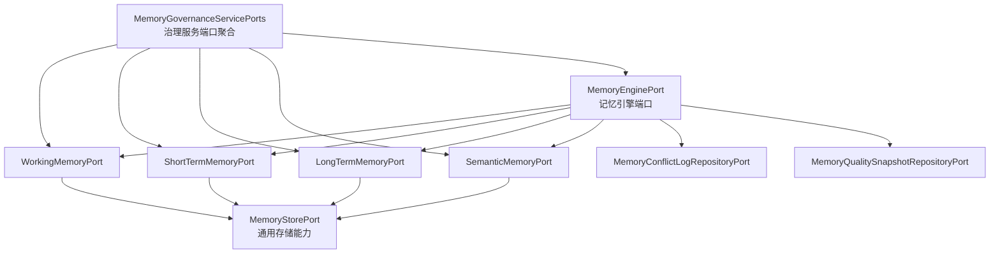
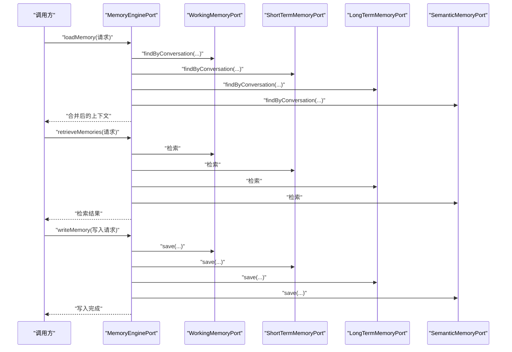
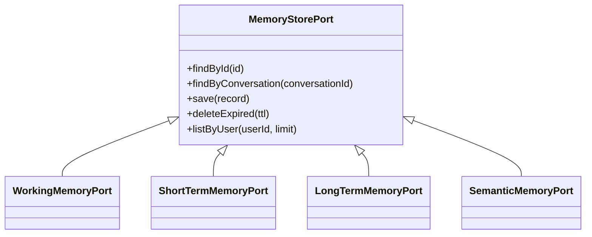
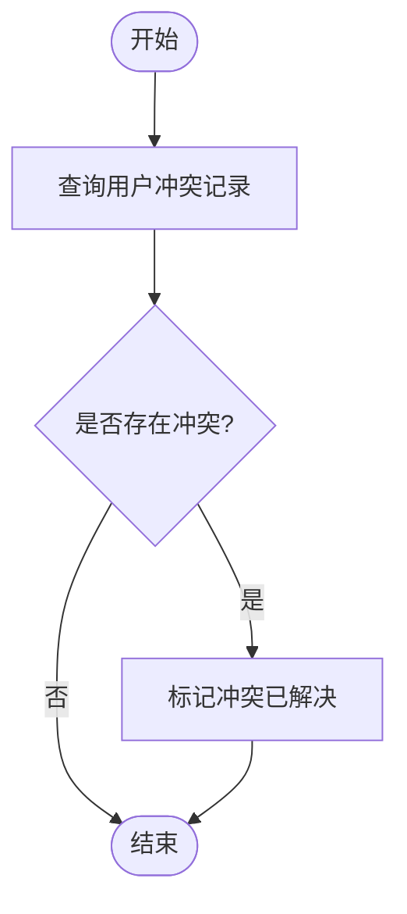
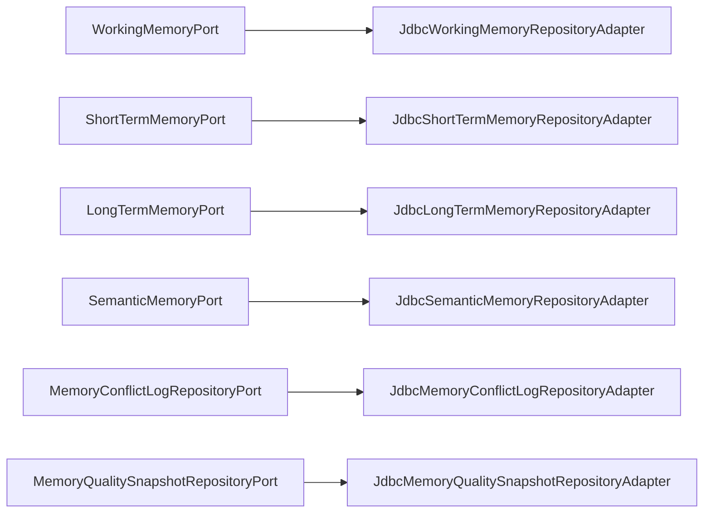

# 内存出站端口

<cite>
**本文引用的文件**
- [LongTermMemoryPort.java](file://seahorse-agent-kernel/src/main/java/com/miracle/ai/seahorse/agent/ports/outbound/memory/LongTermMemoryPort.java)
- [ShortTermMemoryPort.java](file://seahorse-agent-kernel/src/main/java/com/miracle/ai/seahorse/agent/ports/outbound/memory/ShortTermMemoryPort.java)
- [WorkingMemoryPort.java](file://seahorse-agent-kernel/src/main/java/com/miracle/ai/seahorse/agent/ports/outbound/memory/WorkingMemoryPort.java)
- [SemanticMemoryPort.java](file://seahorse-agent-kernel/src/main/java/com/miracle/ai/seahorse/agent/ports/outbound/memory/SemanticMemoryPort.java)
- [MemoryStorePort.java](file://seahorse-agent-kernel/src/main/java/com/miracle/ai/seahorse/agent/ports/outbound/memory/MemoryStorePort.java)
- [MemoryEnginePort.java](file://seahorse-agent-kernel/src/main/java/com/miracle/ai/seahorse/agent/ports/outbound/memory/MemoryEnginePort.java)
- [MemoryInferencePort.java](file://seahorse-agent-kernel/src/main/java/com/miracle/ai/seahorse/agent/ports/outbound/memory/MemoryInferencePort.java)
- [MemoryConflictLogRepositoryPort.java](file://seahorse-agent-kernel/src/main/java/com/miracle/ai/seahorse/agent/ports/outbound/memory/MemoryConflictLogRepositoryPort.java)
- [MemoryQualitySnapshotRepositoryPort.java](file://seahorse-agent-kernel/src/main/java/com/miracle/ai/seahorse/agent/ports/outbound/memory/MemoryQualitySnapshotRepositoryPort.java)
- [MemoryConflictRecord.java](file://seahorse-agent-kernel/src/main/java/com/miracle/ai/seahorse/agent/ports/outbound/memory/MemoryConflictRecord.java)
- [MemoryQualitySnapshot.java](file://seahorse-agent-kernel/src/main/java/com/miracle/ai/seahorse/agent/ports/outbound/memory/MemoryQualitySnapshot.java)
- [MemoryLoadRequest.java](file://seahorse-agent-kernel/src/main/java/com/miracle/ai/seahorse/agent/kernel/domain/memory/MemoryLoadRequest.java)
- [MemoryWriteRequest.java](file://seahorse-agent-kernel/src/main/java/com/miracle/ai/seahorse/agent/kernel/domain/memory/MemoryWriteRequest.java)
- [MemoryContext.java](file://seahorse-agent-kernel/src/main/java/com/miracle/ai/seahorse/agent/kernel/domain/memory/MemoryContext.java)
- [MemoryItem.java](file://seahorse-agent-kernel/src/main/java/com/miracle/ai/seahorse/agent/kernel/domain/memory/MemoryItem.java)
- [MemoryRecord.java](file://seahorse-agent-kernel/src/main/java/com/miracle/ai/seahorse/agent/ports/outbound/memory/MemoryRecord.java)
- [InferredMemory.java](file://seahorse-agent-kernel/src/main/java/com/miracle/ai/seahorse/agent/kernel/domain/memory/InferredMemory.java)
- [KernelMemoryEngine.java](file://seahorse-agent-kernel/src/main/java/com/miracle/ai/seahorse/agent/kernel/application/memory/KernelMemoryEngine.java)
- [DefaultMemoryEnginePort.java](file://seahorse-agent-kernel/src/main/java/com/miracle/ai/seahorse/agent/kernel/application/memory/DefaultMemoryEnginePort.java)
- [RuleBasedMemoryCandidateExtractor.java](file://seahorse-agent-kernel/src/main/java/com/miracle/ai/seahorse/agent/kernel/application/memory/RuleBasedMemoryCandidateExtractor.java)
- [MemoryGovernanceServicePorts.java](file://seahorse-agent-kernel/src/main/java/com/miracle/ai/seahorse/agent/kernel/application/memory/MemoryGovernanceServicePorts.java)
- [JdbcLongTermMemoryRepositoryAdapter.java](file://seahorse-agent-adapter-repository-jdbc/src/main/java/com/miracle/ai/seahorse/agent/adapters/repository/jdbc/JdbcLongTermMemoryRepositoryAdapter.java)
- [JdbcShortTermMemoryRepositoryAdapter.java](file://seahorse-agent-adapter-repository-jdbc/src/main/java/com/miracle/ai/seahorse/agent/adapters/repository/jdbc/JdbcShortTermMemoryRepositoryAdapter.java)
- [JdbcSemanticMemoryRepositoryAdapter.java](file://seahorse-agent-adapter-repository-jdbc/src/main/java/com/miracle/ai/seahorse/agent/adapters/repository/jdbc/JdbcSemanticMemoryRepositoryAdapter.java)
- [JdbcWorkingMemoryRepositoryAdapter.java](file://seahorse-agent-adapter-repository-jdbc/src/main/java/com/miracle/ai/seahorse/agent/adapters/repository/jdbc/JdbcWorkingMemoryRepositoryAdapter.java)
- [JdbcMemoryConflictLogRepositoryAdapter.java](file://seahorse-agent-adapter-repository-jdbc/src/main/java/com/miracle/ai/seahorse/agent/adapters/repository/jdbc/JdbcMemoryConflictLogRepositoryAdapter.java)
- [JdbcMemoryQualitySnapshotRepositoryAdapter.java](file://seahorse-agent-adapter-repository-jdbc/src/main/java/com/miracle/ai/seahorse/agent/adapters/repository/jdbc/JdbcMemoryQualitySnapshotRepositoryAdapter.java)
</cite>

## 目录
1. [简介](#简介)
2. [项目结构](#项目结构)
3. [核心组件](#核心组件)
4. [架构总览](#架构总览)
5. [详细组件分析](#详细组件分析)
6. [依赖关系分析](#依赖关系分析)
7. [性能考虑](#性能考虑)
8. [故障排查指南](#故障排查指南)
9. [结论](#结论)
10. [附录](#附录)

## 简介
本文件聚焦于“内存出站端口”的设计与实现，系统性阐述多层记忆体系（短期记忆、长期记忆、工作记忆、语义记忆）的职责划分与交互机制，并详细解析以下关键端口：LongTermMemoryPort、ShortTermMemoryPort、WorkingMemoryPort、SemanticMemoryPort、MemoryStorePort、MemoryEnginePort、MemoryConflictLogRepositoryPort、MemoryQualitySnapshotRepositoryPort。文档同时覆盖记忆加载与保存、冲突检测与解决、记忆质量评估等核心技术点，并通过图示与路径指引帮助读者快速定位实现位置。

## 项目结构
围绕“内存出站端口”，代码主要分布在两个模块：
- kernel 模块：定义端口接口与领域模型，位于 seahorse-agent-kernel/src/main/java/com/miracle/ai/seahorse/agent/ports/outbound/memory 与 kernel/domain/memory。
- adapter-repository-jdbc 模块：提供基于 JDBC 的具体实现，位于 seahorse-agent-adapter-repository-jdbc/src/main/java/com/miracle/ai/seahorse/agent/adapters/repository/jdbc。

下图给出与“内存出站端口”相关的项目结构概览：

**图表来源**
- [MemoryStorePort.java:29-41](file://seahorse-agent-kernel/src/main/java/com/miracle/ai/seahorse/agent/ports/outbound/memory/MemoryStorePort.java#L29-L41)
- [KernelMemoryEngine.java](file://seahorse-agent-kernel/src/main/java/com/miracle/ai/seahorse/agent/kernel/application/memory/KernelMemoryEngine.java)
- [JdbcLongTermMemoryRepositoryAdapter.java](file://seahorse-agent-adapter-repository-jdbc/src/main/java/com/miracle/ai/seahorse/agent/adapters/repository/jdbc/JdbcLongTermMemoryRepositoryAdapter.java)

**章节来源**
- [MemoryStorePort.java:23-41](file://seahorse-agent-kernel/src/main/java/com/miracle/ai/seahorse/agent/ports/outbound/memory/MemoryStorePort.java#L23-L41)
- [KernelMemoryEngine.java](file://seahorse-agent-kernel/src/main/java/com/miracle/ai/seahorse/agent/kernel/application/memory/KernelMemoryEngine.java)

## 核心组件
本节对各“内存出站端口”进行逐项解析，明确其职责、输入输出与典型实现方式。

- MemoryStorePort（记忆存储端口）
  - 定义了按 ID 查找记忆、查询会话相关记忆、批量写入、清理过期记忆等通用能力，是工作记忆、短期记忆、长期记忆、语义记忆的共同基线。
  - 关键方法：findById、findByConversation、save、deleteExpired、listByUser。
  - 参考路径：[MemoryStorePort.java:29-41](file://seahorse-agent-kernel/src/main/java/com/miracle/ai/seahorse/agent/ports/outbound/memory/MemoryStorePort.java#L29-L41)

- WorkingMemoryPort（工作记忆端口）
  - 工作记忆通常由低延迟存储（如 Redis）承载，强调高吞吐与低延迟。
  - 继承自 MemoryStorePort，适用于当前对话上下文的记忆读写。
  - 参考路径：[WorkingMemoryPort.java](file://seahorse-agent-kernel/src/main/java/com/miracle/ai/seahorse/agent/ports/outbound/memory/WorkingMemoryPort.java#L25)

- ShortTermMemoryPort（短期记忆端口）
  - 保留最近会话片段与摘要，不建议用简单键值存储替代。
  - 继承自 MemoryStorePort，适合会话级的短期记忆管理。
  - 参考路径：[ShortTermMemoryPort.java](file://seahorse-agent-kernel/src/main/java/com/miracle/ai/seahorse/agent/ports/outbound/memory/ShortTermMemoryPort.java#L25)

- LongTermMemoryPort（长期记忆端口）
  - 承载跨会话沉淀的内容，可由 JDBC、pgvector 或 Milvus 等实现。
  - 继承自 MemoryStorePort，适合持久化、检索增强的长期知识管理。
  - 参考路径：[LongTermMemoryPort.java](file://seahorse-agent-kernel/src/main/java/com/miracle/ai/seahorse/agent/ports/outbound/memory/LongTermMemoryPort.java#L25)

- SemanticMemoryPort（语义记忆端口）
  - 保留结构化语义（如 PROFILE、PREFERENCE），需保持 upsert 语义。
  - 继承自 MemoryStorePort，适合结构化配置与偏好建模。
  - 参考路径：[SemanticMemoryPort.java](file://seahorse-agent-kernel/src/main/java/com/miracle/ai/seahorse/agent/ports/outbound/memory/SemanticMemoryPort.java#L25)

- MemoryEnginePort（记忆引擎端口）
  - 提供统一的记忆操作门面：加载记忆、检索记忆、写入记忆、执行记忆衰减、评估记忆质量。
  - 输入输出：接收 MemoryLoadRequest/MemoryWriteRequest/MemoryContext，返回 List<MemoryItem> 或 MemoryQualityReport。
  - 参考路径：[MemoryEnginePort.java:29-31](file://seahorse-agent-kernel/src/main/java/com/miracle/ai/seahorse/agent/ports/outbound/memory/MemoryEnginePort.java#L29-L31)

- MemoryConflictLogRepositoryPort（记忆冲突日志仓库端口）
  - 提供按用户过滤的冲突记录列表查询与冲突解决标记能力。
  - 参考路径：[MemoryConflictLogRepositoryPort.java:22-41](file://seahorse-agent-kernel/src/main/java/com/miracle/ai/seahorse/agent/ports/outbound/memory/MemoryConflictLogRepositoryPort.java#L22-L41)

- MemoryQualitySnapshotRepositoryPort（记忆质量快照仓库端口）
  - 提供按用户与时间维度的记忆质量快照列表查询能力。
  - 参考路径：[MemoryQualitySnapshotRepositoryPort.java:22-29](file://seahorse-agent-kernel/src/main/java/com/miracle/ai/seahorse/agent/ports/outbound/memory/MemoryQualitySnapshotRepositoryPort.java#L22-L29)

**章节来源**
- [MemoryStorePort.java:29-41](file://seahorse-agent-kernel/src/main/java/com/miracle/ai/seahorse/agent/ports/outbound/memory/MemoryStorePort.java#L29-L41)
- [WorkingMemoryPort.java](file://seahorse-agent-kernel/src/main/java/com/miracle/ai/seahorse/agent/ports/outbound/memory/WorkingMemoryPort.java#L25)
- [ShortTermMemoryPort.java](file://seahorse-agent-kernel/src/main/java/com/miracle/ai/seahorse/agent/ports/outbound/memory/ShortTermMemoryPort.java#L25)
- [LongTermMemoryPort.java](file://seahorse-agent-kernel/src/main/java/com/miracle/ai/seahorse/agent/ports/outbound/memory/LongTermMemoryPort.java#L25)
- [SemanticMemoryPort.java](file://seahorse-agent-kernel/src/main/java/com/miracle/ai/seahorse/agent/ports/outbound/memory/SemanticMemoryPort.java#L25)
- [MemoryEnginePort.java:29-31](file://seahorse-agent-kernel/src/main/java/com/miracle/ai/seahorse/agent/ports/outbound/memory/MemoryEnginePort.java#L29-L31)
- [MemoryConflictLogRepositoryPort.java:22-41](file://seahorse-agent-kernel/src/main/java/com/miracle/ai/seahorse/agent/ports/outbound/memory/MemoryConflictLogRepositoryPort.java#L22-L41)
- [MemoryQualitySnapshotRepositoryPort.java:22-29](file://seahorse-agent-kernel/src/main/java/com/miracle/ai/seahorse/agent/ports/outbound/memory/MemoryQualitySnapshotRepositoryPort.java#L22-L29)

## 架构总览
下图展示了“记忆引擎”与“多层记忆端口”的交互关系，以及与 JDBC 适配器的对接：

**图表来源**
- [MemoryEnginePort.java:29-31](file://seahorse-agent-kernel/src/main/java/com/miracle/ai/seahorse/agent/ports/outbound/memory/MemoryEnginePort.java#L29-L31)
- [MemoryGovernanceServicePorts.java:28-40](file://seahorse-agent-kernel/src/main/java/com/miracle/ai/seahorse/agent/kernel/application/memory/MemoryGovernanceServicePorts.java#L28-L40)
- [MemoryStorePort.java:29-41](file://seahorse-agent-kernel/src/main/java/com/miracle/ai/seahorse/agent/ports/outbound/memory/MemoryStorePort.java#L29-L41)
- [MemoryConflictLogRepositoryPort.java:22-41](file://seahorse-agent-kernel/src/main/java/com/miracle/ai/seahorse/agent/ports/outbound/memory/MemoryConflictLogRepositoryPort.java#L22-L41)
- [MemoryQualitySnapshotRepositoryPort.java:22-29](file://seahorse-agent-kernel/src/main/java/com/miracle/ai/seahorse/agent/ports/outbound/memory/MemoryQualitySnapshotRepositoryPort.java#L22-L29)

## 详细组件分析

### 记忆引擎端口（MemoryEnginePort）
- 职责
  - 统一编排记忆生命周期：加载、检索、写入、衰减、质量评估。
  - 对外暴露简洁的门面接口，屏蔽底层存储细节。
- 关键流程
  - 加载记忆：根据 MemoryLoadRequest 从各层记忆端口拉取上下文。
  - 检索记忆：结合 MemoryContext 进行检索增强。
  - 写入记忆：根据 MemoryWriteRequest 将新记忆写入相应层级。
  - 衰减与评估：定期执行记忆衰减与质量评估，维护记忆健康度。
- 参考路径
  - [MemoryEnginePort.java:29-31](file://seahorse-agent-kernel/src/main/java/com/miracle/ai/seahorse/agent/ports/outbound/memory/MemoryEnginePort.java#L29-L31)
  - [KernelMemoryEngine.java](file://seahorse-agent-kernel/src/main/java/com/miracle/ai/seahorse/agent/kernel/application/memory/KernelMemoryEngine.java)

**图表来源**
- [MemoryEnginePort.java:29-31](file://seahorse-agent-kernel/src/main/java/com/miracle/ai/seahorse/agent/ports/outbound/memory/MemoryEnginePort.java#L29-L31)
- [WorkingMemoryPort.java](file://seahorse-agent-kernel/src/main/java/com/miracle/ai/seahorse/agent/ports/outbound/memory/WorkingMemoryPort.java#L25)
- [ShortTermMemoryPort.java](file://seahorse-agent-kernel/src/main/java/com/miracle/ai/seahorse/agent/ports/outbound/memory/ShortTermMemoryPort.java#L25)
- [LongTermMemoryPort.java](file://seahorse-agent-kernel/src/main/java/com/miracle/ai/seahorse/agent/ports/outbound/memory/LongTermMemoryPort.java#L25)
- [SemanticMemoryPort.java](file://seahorse-agent-kernel/src/main/java/com/miracle/ai/seahorse/agent/ports/outbound/memory/SemanticMemoryPort.java#L25)

**章节来源**
- [MemoryEnginePort.java:29-31](file://seahorse-agent-kernel/src/main/java/com/miracle/ai/seahorse/agent/ports/outbound/memory/MemoryEnginePort.java#L29-L31)
- [KernelMemoryEngine.java](file://seahorse-agent-kernel/src/main/java/com/miracle/ai/seahorse/agent/kernel/application/memory/KernelMemoryEngine.java)

### 多层记忆端口（Working/Short/Long/Semantic）
- 设计原则
  - 各层端口均继承 MemoryStorePort，复用通用能力。
  - 层次差异体现在存储介质、容量策略与访问模式：
    - 工作记忆：低延迟、易失性，适合当前会话。
    - 短期记忆：会话片段与摘要，容量有限。
    - 长期记忆：持久化、可检索，支持跨会话。
    - 语义记忆：结构化数据，强调 upsert 语义。
- 实现建议
  - 工作记忆：优先使用高性能缓存（如 Redis）。
  - 短期记忆：结合会话窗口与摘要策略。
  - 长期记忆：结合向量检索与关系数据库。
  - 语义记忆：采用 upsert 语义与结构化 schema。
- 参考路径
  - [WorkingMemoryPort.java](file://seahorse-agent-kernel/src/main/java/com/miracle/ai/seahorse/agent/ports/outbound/memory/WorkingMemoryPort.java#L25)
  - [ShortTermMemoryPort.java](file://seahorse-agent-kernel/src/main/java/com/miracle/ai/seahorse/agent/ports/outbound/memory/ShortTermMemoryPort.java#L25)
  - [LongTermMemoryPort.java](file://seahorse-agent-kernel/src/main/java/com/miracle/ai/seahorse/agent/ports/outbound/memory/LongTermMemoryPort.java#L25)
  - [SemanticMemoryPort.java](file://seahorse-agent-kernel/src/main/java/com/miracle/ai/seahorse/agent/ports/outbound/memory/SemanticMemoryPort.java#L25)

**图表来源**
- [MemoryStorePort.java:29-41](file://seahorse-agent-kernel/src/main/java/com/miracle/ai/seahorse/agent/ports/outbound/memory/MemoryStorePort.java#L29-L41)
- [WorkingMemoryPort.java](file://seahorse-agent-kernel/src/main/java/com/miracle/ai/seahorse/agent/ports/outbound/memory/WorkingMemoryPort.java#L25)
- [ShortTermMemoryPort.java](file://seahorse-agent-kernel/src/main/java/com/miracle/ai/seahorse/agent/ports/outbound/memory/ShortTermMemoryPort.java#L25)
- [LongTermMemoryPort.java](file://seahorse-agent-kernel/src/main/java/com/miracle/ai/seahorse/agent/ports/outbound/memory/LongTermMemoryPort.java#L25)
- [SemanticMemoryPort.java](file://seahorse-agent-kernel/src/main/java/com/miracle/ai/seahorse/agent/ports/outbound/memory/SemanticMemoryPort.java#L25)

**章节来源**
- [MemoryStorePort.java:29-41](file://seahorse-agent-kernel/src/main/java/com/miracle/ai/seahorse/agent/ports/outbound/memory/MemoryStorePort.java#L29-L41)
- [WorkingMemoryPort.java](file://seahorse-agent-kernel/src/main/java/com/miracle/ai/seahorse/agent/ports/outbound/memory/WorkingMemoryPort.java#L25)
- [ShortTermMemoryPort.java](file://seahorse-agent-kernel/src/main/java/com/miracle/ai/seahorse/agent/ports/outbound/memory/ShortTermMemoryPort.java#L25)
- [LongTermMemoryPort.java](file://seahorse-agent-kernel/src/main/java/com/miracle/ai/seahorse/agent/ports/outbound/memory/LongTermMemoryPort.java#L25)
- [SemanticMemoryPort.java](file://seahorse-agent-kernel/src/main/java/com/miracle/ai/seahorse/agent/ports/outbound/memory/SemanticMemoryPort.java#L25)

### 记忆冲突与质量（仓库端口）
- MemoryConflictLogRepositoryPort
  - 功能：按用户与状态查询冲突记录；标记冲突已解决。
  - 典型用途：在记忆更新时检测冲突，提供人工/自动解决入口。
  - 参考路径：[MemoryConflictLogRepositoryPort.java:22-41](file://seahorse-agent-kernel/src/main/java/com/miracle/ai/seahorse/agent/ports/outbound/memory/MemoryConflictLogRepositoryPort.java#L22-L41)
- MemoryQualitySnapshotRepositoryPort
  - 功能：按用户查询记忆质量快照列表，用于趋势分析与优化。
  - 参考路径：[MemoryQualitySnapshotRepositoryPort.java:22-29](file://seahorse-agent-kernel/src/main/java/com/miracle/ai/seahorse/agent/ports/outbound/memory/MemoryQualitySnapshotRepositoryPort.java#L22-L29)

**图表来源**
- [MemoryConflictLogRepositoryPort.java:22-41](file://seahorse-agent-kernel/src/main/java/com/miracle/ai/seahorse/agent/ports/outbound/memory/MemoryConflictLogRepositoryPort.java#L22-L41)

**章节来源**
- [MemoryConflictLogRepositoryPort.java:22-41](file://seahorse-agent-kernel/src/main/java/com/miracle/ai/seahorse/agent/ports/outbound/memory/MemoryConflictLogRepositoryPort.java#L22-L41)
- [MemoryQualitySnapshotRepositoryPort.java:22-29](file://seahorse-agent-kernel/src/main/java/com/miracle/ai/seahorse/agent/ports/outbound/memory/MemoryQualitySnapshotRepositoryPort.java#L22-L29)

### 领域模型与治理
- 领域模型
  - MemoryLoadRequest/MemoryWriteRequest：封装记忆加载与写入的请求参数。
  - MemoryContext/MemoryItem/MemoryRecord：描述记忆的上下文、条目与底层记录。
  - MemoryConflictRecord/MemoryQualitySnapshot：冲突记录与质量快照的数据载体。
  - 参考路径：
    - [MemoryLoadRequest.java](file://seahorse-agent-kernel/src/main/java/com/miracle/ai/seahorse/agent/kernel/domain/memory/MemoryLoadRequest.java)
    - [MemoryWriteRequest.java](file://seahorse-agent-kernel/src/main/java/com/miracle/ai/seahorse/agent/kernel/domain/memory/MemoryWriteRequest.java)
    - [MemoryContext.java](file://seahorse-agent-kernel/src/main/java/com/miracle/ai/seahorse/agent/kernel/domain/memory/MemoryContext.java)
    - [MemoryItem.java](file://seahorse-agent-kernel/src/main/java/com/miracle/ai/seahorse/agent/kernel/domain/memory/MemoryItem.java)
    - [MemoryRecord.java](file://seahorse-agent-kernel/src/main/java/com/miracle/ai/seahorse/agent/ports/outbound/memory/MemoryRecord.java)
    - [MemoryConflictRecord.java](file://seahorse-agent-kernel/src/main/java/com/miracle/ai/seahorse/agent/ports/outbound/memory/MemoryConflictRecord.java)
    - [MemoryQualitySnapshot.java](file://seahorse-agent-kernel/src/main/java/com/miracle/ai/seahorse/agent/ports/outbound/memory/MemoryQualitySnapshot.java)
- 治理端口聚合
  - MemoryGovernanceServicePorts 将工作记忆、短期记忆、长期记忆、语义记忆与记忆引擎端口聚合，确保空值校验与依赖注入。
  - 参考路径：[MemoryGovernanceServicePorts.java:28-40](file://seahorse-agent-kernel/src/main/java/com/miracle/ai/seahorse/agent/kernel/application/memory/MemoryGovernanceServicePorts.java#L28-L40)

**章节来源**
- [MemoryLoadRequest.java](file://seahorse-agent-kernel/src/main/java/com/miracle/ai/seahorse/agent/kernel/domain/memory/MemoryLoadRequest.java)
- [MemoryWriteRequest.java](file://seahorse-agent-kernel/src/main/java/com/miracle/ai/seahorse/agent/kernel/domain/memory/MemoryWriteRequest.java)
- [MemoryContext.java](file://seahorse-agent-kernel/src/main/java/com/miracle/ai/seahorse/agent/kernel/domain/memory/MemoryContext.java)
- [MemoryItem.java](file://seahorse-agent-kernel/src/main/java/com/miracle/ai/seahorse/agent/kernel/domain/memory/MemoryItem.java)
- [MemoryRecord.java](file://seahorse-agent-kernel/src/main/java/com/miracle/ai/seahorse/agent/ports/outbound/memory/MemoryRecord.java)
- [MemoryConflictRecord.java](file://seahorse-agent-kernel/src/main/java/com/miracle/ai/seahorse/agent/ports/outbound/memory/MemoryConflictRecord.java)
- [MemoryQualitySnapshot.java](file://seahorse-agent-kernel/src/main/java/com/miracle/ai/seahorse/agent/ports/outbound/memory/MemoryQualitySnapshot.java)
- [MemoryGovernanceServicePorts.java:28-40](file://seahorse-agent-kernel/src/main/java/com/miracle/ai/seahorse/agent/kernel/application/memory/MemoryGovernanceServicePorts.java#L28-L40)

## 依赖关系分析
- 端口到实现的映射
  - WorkingMemoryPort → JdbcWorkingMemoryRepositoryAdapter
  - ShortTermMemoryPort → JdbcShortTermMemoryRepositoryAdapter
  - LongTermMemoryPort → JdbcLongTermMemoryRepositoryAdapter
  - SemanticMemoryPort → JdbcSemanticMemoryRepositoryAdapter
  - MemoryConflictLogRepositoryPort → JdbcMemoryConflictLogRepositoryAdapter
  - MemoryQualitySnapshotRepositoryPort → JdbcMemoryQualitySnapshotRepositoryAdapter
- 依赖图

**图表来源**
- [WorkingMemoryPort.java](file://seahorse-agent-kernel/src/main/java/com/miracle/ai/seahorse/agent/ports/outbound/memory/WorkingMemoryPort.java#L25)
- [ShortTermMemoryPort.java](file://seahorse-agent-kernel/src/main/java/com/miracle/ai/seahorse/agent/ports/outbound/memory/ShortTermMemoryPort.java#L25)
- [LongTermMemoryPort.java](file://seahorse-agent-kernel/src/main/java/com/miracle/ai/seahorse/agent/ports/outbound/memory/LongTermMemoryPort.java#L25)
- [SemanticMemoryPort.java](file://seahorse-agent-kernel/src/main/java/com/miracle/ai/seahorse/agent/ports/outbound/memory/SemanticMemoryPort.java#L25)
- [MemoryConflictLogRepositoryPort.java:22-41](file://seahorse-agent-kernel/src/main/java/com/miracle/ai/seahorse/agent/ports/outbound/memory/MemoryConflictLogRepositoryPort.java#L22-L41)
- [MemoryQualitySnapshotRepositoryPort.java:22-29](file://seahorse-agent-kernel/src/main/java/com/miracle/ai/seahorse/agent/ports/outbound/memory/MemoryQualitySnapshotRepositoryPort.java#L22-L29)
- [JdbcWorkingMemoryRepositoryAdapter.java](file://seahorse-agent-adapter-repository-jdbc/src/main/java/com/miracle/ai/seahorse/agent/adapters/repository/jdbc/JdbcWorkingMemoryRepositoryAdapter.java)
- [JdbcShortTermMemoryRepositoryAdapter.java](file://seahorse-agent-adapter-repository-jdbc/src/main/java/com/miracle/ai/seahorse/agent/adapters/repository/jdbc/JdbcShortTermMemoryRepositoryAdapter.java)
- [JdbcLongTermMemoryRepositoryAdapter.java](file://seahorse-agent-adapter-repository-jdbc/src/main/java/com/miracle/ai/seahorse/agent/adapters/repository/jdbc/JdbcLongTermMemoryRepositoryAdapter.java)
- [JdbcSemanticMemoryRepositoryAdapter.java](file://seahorse-agent-adapter-repository-jdbc/src/main/java/com/miracle/ai/seahorse/agent/adapters/repository/jdbc/JdbcSemanticMemoryRepositoryAdapter.java)
- [JdbcMemoryConflictLogRepositoryAdapter.java](file://seahorse-agent-adapter-repository-jdbc/src/main/java/com/miracle/ai/seahorse/agent/adapters/repository/jdbc/JdbcMemoryConflictLogRepositoryAdapter.java)
- [JdbcMemoryQualitySnapshotRepositoryAdapter.java](file://seahorse-agent-adapter-repository-jdbc/src/main/java/com/miracle/ai/seahorse/agent/adapters/repository/jdbc/JdbcMemoryQualitySnapshotRepositoryAdapter.java)

**章节来源**
- [JdbcWorkingMemoryRepositoryAdapter.java](file://seahorse-agent-adapter-repository-jdbc/src/main/java/com/miracle/ai/seahorse/agent/adapters/repository/jdbc/JdbcWorkingMemoryRepositoryAdapter.java)
- [JdbcShortTermMemoryRepositoryAdapter.java](file://seahorse-agent-adapter-repository-jdbc/src/main/java/com/miracle/ai/seahorse/agent/adapters/repository/jdbc/JdbcShortTermMemoryRepositoryAdapter.java)
- [JdbcLongTermMemoryRepositoryAdapter.java](file://seahorse-agent-adapter-repository-jdbc/src/main/java/com/miracle/ai/seahorse/agent/adapters/repository/jdbc/JdbcLongTermMemoryRepositoryAdapter.java)
- [JdbcSemanticMemoryRepositoryAdapter.java](file://seahorse-agent-adapter-repository-jdbc/src/main/java/com/miracle/ai/seahorse/agent/adapters/repository/jdbc/JdbcSemanticMemoryRepositoryAdapter.java)
- [JdbcMemoryConflictLogRepositoryAdapter.java](file://seahorse-agent-adapter-repository-jdbc/src/main/java/com/miracle/ai/seahorse/agent/adapters/repository/jdbc/JdbcMemoryConflictLogRepositoryAdapter.java)
- [JdbcMemoryQualitySnapshotRepositoryAdapter.java](file://seahorse-agent-adapter-repository-jdbc/src/main/java/com/miracle/ai/seahorse/agent/adapters/repository/jdbc/JdbcMemoryQualitySnapshotRepositoryAdapter.java)

## 性能考虑
- 存储分层与容量控制
  - 工作记忆：低延迟、小容量，适合高频读写。
  - 短期记忆：窗口化与摘要策略，避免无限增长。
  - 长期记忆：结合向量检索与分页策略，降低单次查询负载。
  - 语义记忆：upsert 语义下的幂等写入，减少重复写入开销。
- 记忆衰减与质量评估
  - 定期执行记忆衰减，剔除低价值条目。
  - 通过质量快照监控记忆健康度，指导优化策略。
- 并发与一致性
  - 使用分布式锁或版本号控制冲突更新。
  - 在写入前进行冲突检测，必要时阻塞或回滚。

## 故障排查指南
- 冲突处理
  - 使用 MemoryConflictLogRepositoryPort 列表查询冲突记录，确认冲突类型与影响范围。
  - 通过 resolve 标记已解决，记录处理动作与责任人。
  - 参考路径：[MemoryConflictLogRepositoryPort.java:22-41](file://seahorse-agent-kernel/src/main/java/com/miracle/ai/seahorse/agent/ports/outbound/memory/MemoryConflictLogRepositoryPort.java#L22-L41)
- 质量监控
  - 使用 MemoryQualitySnapshotRepositoryPort 查询质量快照，识别异常波动。
  - 结合领域指标（召回率、相关性、时效性）评估记忆效果。
  - 参考路径：[MemoryQualitySnapshotRepositoryPort.java:22-29](file://seahorse-agent-kernel/src/main/java/com/miracle/ai/seahorse/agent/ports/outbound/memory/MemoryQualitySnapshotRepositoryPort.java#L22-L29)
- 端口空值与依赖注入
  - 确保 MemoryGovernanceServicePorts 聚合的所有端口非空，避免运行时 NullPointerException。
  - 参考路径：[MemoryGovernanceServicePorts.java:28-40](file://seahorse-agent-kernel/src/main/java/com/miracle/ai/seahorse/agent/kernel/application/memory/MemoryGovernanceServicePorts.java#L28-L40)

**章节来源**
- [MemoryConflictLogRepositoryPort.java:22-41](file://seahorse-agent-kernel/src/main/java/com/miracle/ai/seahorse/agent/ports/outbound/memory/MemoryConflictLogRepositoryPort.java#L22-L41)
- [MemoryQualitySnapshotRepositoryPort.java:22-29](file://seahorse-agent-kernel/src/main/java/com/miracle/ai/seahorse/agent/ports/outbound/memory/MemoryQualitySnapshotRepositoryPort.java#L22-L29)
- [MemoryGovernanceServicePorts.java:28-40](file://seahorse-agent-kernel/src/main/java/com/miracle/ai/seahorse/agent/kernel/application/memory/MemoryGovernanceServicePorts.java#L28-L40)

## 结论
本文系统梳理了“内存出站端口”的设计与实现，明确了多层记忆体系的职责边界与交互机制，并给出了与 JDBC 适配器的对接关系。通过统一的记忆引擎门面与仓库端口，系统实现了记忆加载、保存、冲突检测与质量评估的关键能力。建议在实际部署中结合业务场景选择合适的存储介质与容量策略，并建立完善的冲突处理与质量监控机制。

## 附录
- 快速定位实现
  - 记忆引擎：[KernelMemoryEngine.java](file://seahorse-agent-kernel/src/main/java/com/miracle/ai/seahorse/agent/kernel/application/memory/KernelMemoryEngine.java)
  - 端口接口：[MemoryEnginePort.java:29-31](file://seahorse-agent-kernel/src/main/java/com/miracle/ai/seahorse/agent/ports/outbound/memory/MemoryEnginePort.java#L29-L31)
  - 通用存储：[MemoryStorePort.java:29-41](file://seahorse-agent-kernel/src/main/java/com/miracle/ai/seahorse/agent/ports/outbound/memory/MemoryStorePort.java#L29-L41)
  - JDBC 适配器（工作记忆）：[JdbcWorkingMemoryRepositoryAdapter.java](file://seahorse-agent-adapter-repository-jdbc/src/main/java/com/miracle/ai/seahorse/agent/adapters/repository/jdbc/JdbcWorkingMemoryRepositoryAdapter.java)
  - JDBC 适配器（短期记忆）：[JdbcShortTermMemoryRepositoryAdapter.java](file://seahorse-agent-adapter-repository-jdbc/src/main/java/com/miracle/ai/seahorse/agent/adapters/repository/jdbc/JdbcShortTermMemoryRepositoryAdapter.java)
  - JDBC 适配器（长期记忆）：[JdbcLongTermMemoryRepositoryAdapter.java](file://seahorse-agent-adapter-repository-jdbc/src/main/java/com/miracle/ai/seahorse/agent/adapters/repository/jdbc/JdbcLongTermMemoryRepositoryAdapter.java)
  - JDBC 适配器（语义记忆）：[JdbcSemanticMemoryRepositoryAdapter.java](file://seahorse-agent-adapter-repository-jdbc/src/main/java/com/miracle/ai/seahorse/agent/adapters/repository/jdbc/JdbcSemanticMemoryRepositoryAdapter.java)
  - 冲突日志仓库：[JdbcMemoryConflictLogRepositoryAdapter.java](file://seahorse-agent-adapter-repository-jdbc/src/main/java/com/miracle/ai/seahorse/agent/adapters/repository/jdbc/JdbcMemoryConflictLogRepositoryAdapter.java)
  - 质量快照仓库：[JdbcMemoryQualitySnapshotRepositoryAdapter.java](file://seahorse-agent-adapter-repository-jdbc/src/main/java/com/miracle/ai/seahorse/agent/adapters/repository/jdbc/JdbcMemoryQualitySnapshotRepositoryAdapter.java)