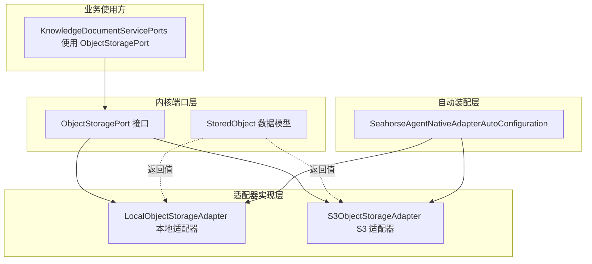
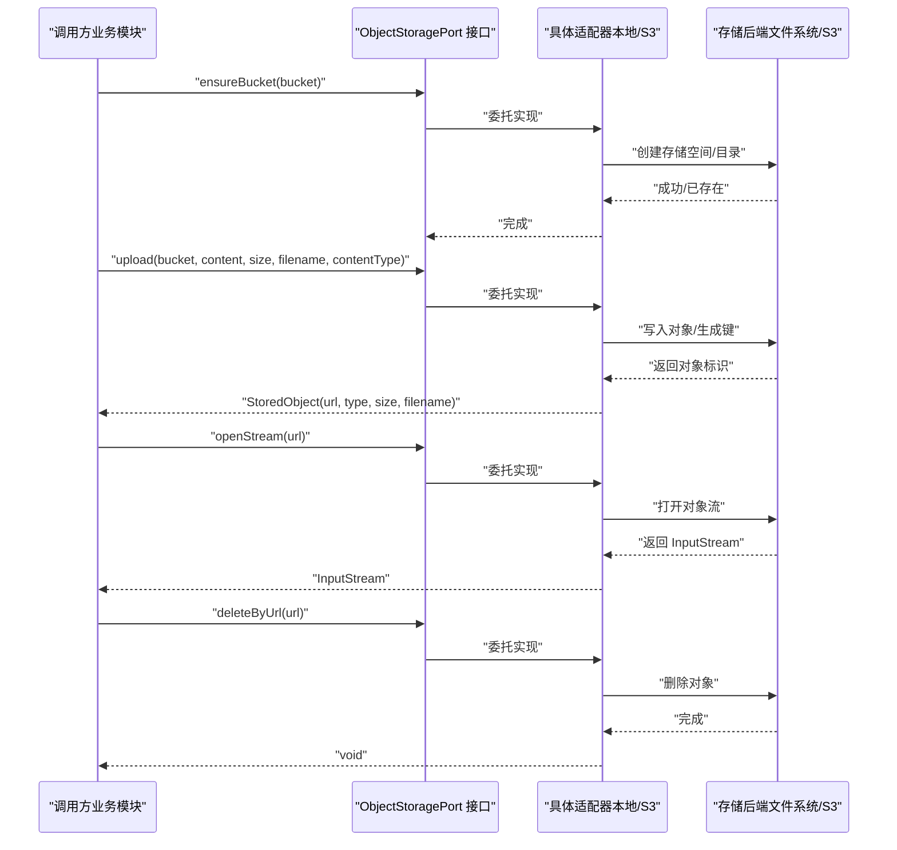
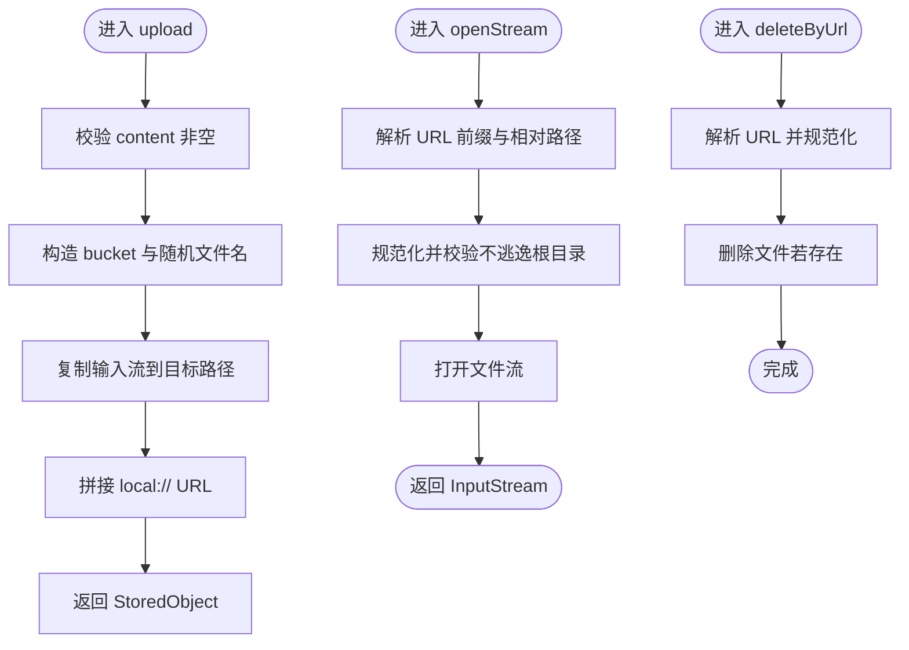
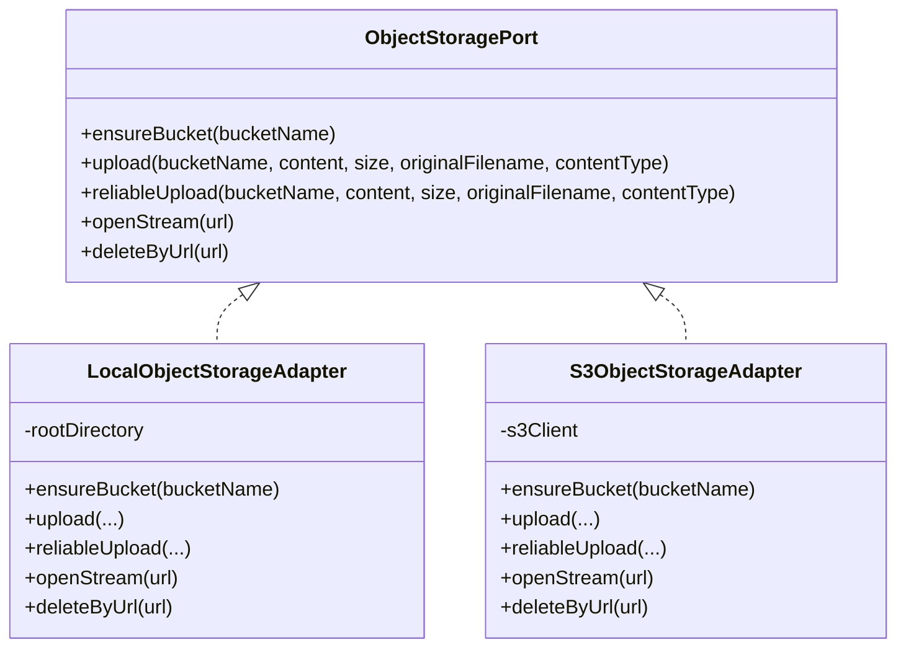
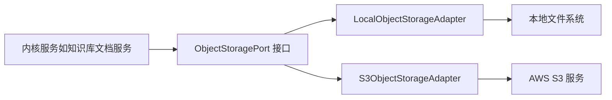

# 存储出站端口

<cite>
**本文引用的文件**
- [ObjectStoragePort.java](file://seahorse-agent-kernel/src/main/java/com/miracle/ai/seahorse/agent/ports/outbound/storage/ObjectStoragePort.java)
- [StoredObject.java](file://seahorse-agent-kernel/src/main/java/com/miracle/ai/seahorse/agent/ports/outbound/storage/StoredObject.java)
- [LocalObjectStorageAdapter.java](file://seahorse-agent-adapter-storage-local/src/main/java/com/miracle/ai/seahorse/agent/adapters/storage/local/LocalObjectStorageAdapter.java)
- [S3ObjectStorageAdapter.java](file://seahorse-agent-adapter-storage-s3/src/main/java/com/miracle/ai/seahorse/agent/adapters/storage/s3/S3ObjectStorageAdapter.java)
- [SeahorseAgentNativeAdapterAutoConfiguration.java](file://seahorse-agent-spring-boot-starter/src/main/java/com/miracle/ai/seahorse/agent/adapters/spring/SeahorseAgentNativeAdapterAutoConfiguration.java)
- [KnowledgeDocumentServicePorts.java](file://seahorse-agent-kernel/src/main/java/com/miracle/ai/seahorse/agent/kernel/application/knowledge/KnowledgeDocumentServicePorts.java)
- [application.properties（bootstrap）](file://seahorse-agent-bootstrap/src/main/resources/application.properties)
- [application.properties（starter）](file://seahorse-agent-spring-boot-starter/src/main/resources/application.properties)
</cite>

## 目录
1. [简介](#简介)
2. [项目结构](#项目结构)
3. [核心组件](#核心组件)
4. [架构总览](#架构总览)
5. [详细组件分析](#详细组件分析)
6. [依赖分析](#依赖分析)
7. [性能考虑](#性能考虑)
8. [故障排查指南](#故障排查指南)
9. [结论](#结论)
10. [附录：实现示例路径](#附录实现示例路径)

## 简介
本技术文档聚焦于“存储出站端口”在对象存储领域的设计与实现，围绕以下关键点展开：
- 对象存储端口接口定义：ObjectStoragePort
- 存储对象模型：StoredObject
- 两种适配器实现：本地文件系统与 S3
- 文件存储、对象管理、存储访问的核心流程
- 端口接口设计、存储策略、访问控制与性能优化要点
- 提供可直接参考的代码示例路径，帮助快速构建可靠的文件存储系统（上传、下载、删除、元数据管理）

## 项目结构
对象存储相关能力分布于内核端口定义与适配器实现两部分：
- 内核端口层：定义统一的出站端口与数据模型
- 适配器层：提供具体实现（本地文件系统、S3）
- 自动装配层：根据配置选择合适的适配器并注入到内核服务

图表来源
- [ObjectStoragePort.java:25-47](file://seahorse-agent-kernel/src/main/java/com/miracle/ai/seahorse/agent/ports/outbound/storage/ObjectStoragePort.java#L25-L47)
- [StoredObject.java:28-29](file://seahorse-agent-kernel/src/main/java/com/miracle/ai/seahorse/agent/ports/outbound/storage/StoredObject.java#L28-L29)
- [LocalObjectStorageAdapter.java:34-128](file://seahorse-agent-adapter-storage-local/src/main/java/com/miracle/ai/seahorse/agent/adapters/storage/local/LocalObjectStorageAdapter.java#L34-L128)
- [S3ObjectStorageAdapter.java:37-151](file://seahorse-agent-adapter-storage-s3/src/main/java/com/miracle/ai/seahorse/agent/adapters/storage/s3/S3ObjectStorageAdapter.java#L37-L151)
- [SeahorseAgentNativeAdapterAutoConfiguration.java:226-239](file://seahorse-agent-spring-boot-starter/src/main/java/com/miracle/ai/seahorse/agent/adapters/spring/SeahorseAgentNativeAdapterAutoConfiguration.java#L226-L239)
- [KnowledgeDocumentServicePorts.java:31-48](file://seahorse-agent-kernel/src/main/java/com/miracle/ai/seahorse/agent/kernel/application/knowledge/KnowledgeDocumentServicePorts.java#L31-L48)

章节来源
- [ObjectStoragePort.java:25-47](file://seahorse-agent-kernel/src/main/java/com/miracle/ai/seahorse/agent/ports/outbound/storage/ObjectStoragePort.java#L25-L47)
- [StoredObject.java:28-29](file://seahorse-agent-kernel/src/main/java/com/miracle/ai/seahorse/agent/ports/outbound/storage/StoredObject.java#L28-L29)
- [LocalObjectStorageAdapter.java:34-128](file://seahorse-agent-adapter-storage-local/src/main/java/com/miracle/ai/seahorse/agent/adapters/storage/local/LocalObjectStorageAdapter.java#L34-L128)
- [S3ObjectStorageAdapter.java:37-151](file://seahorse-agent-adapter-storage-s3/src/main/java/com/miracle/ai/seahorse/agent/adapters/storage/s3/S3ObjectStorageAdapter.java#L37-L151)
- [SeahorseAgentNativeAdapterAutoConfiguration.java:226-239](file://seahorse-agent-spring-boot-starter/src/main/java/com/miracle/ai/seahorse/agent/adapters/spring/SeahorseAgentNativeAdapterAutoConfiguration.java#L226-L239)
- [KnowledgeDocumentServicePorts.java:31-48](file://seahorse-agent-kernel/src/main/java/com/miracle/ai/seahorse/agent/kernel/application/knowledge/KnowledgeDocumentServicePorts.java#L31-L48)

## 核心组件
- ObjectStoragePort：定义对象存储的统一出站端口，包含确保存储空间存在、上传、可靠上传、打开流、按 URL 删除等操作。
- StoredObject：封装对象存储返回的结果，包含访问 URL、检测到的类型、大小与原始文件名。
- LocalObjectStorageAdapter：基于本地文件系统的实现，提供 ensureBucket、upload、openStream、deleteByUrl 的具体逻辑；reliableUpload 复用端口默认委托语义。
- S3ObjectStorageAdapter：基于 AWS SDK 的 S3 实现，提供相同接口的云端对象存储能力。

章节来源
- [ObjectStoragePort.java:25-47](file://seahorse-agent-kernel/src/main/java/com/miracle/ai/seahorse/agent/ports/outbound/storage/ObjectStoragePort.java#L25-L47)
- [StoredObject.java:28-29](file://seahorse-agent-kernel/src/main/java/com/miracle/ai/seahorse/agent/ports/outbound/storage/StoredObject.java#L28-L29)
- [LocalObjectStorageAdapter.java:34-128](file://seahorse-agent-adapter-storage-local/src/main/java/com/miracle/ai/seahorse/agent/adapters/storage/local/LocalObjectStorageAdapter.java#L34-L128)
- [S3ObjectStorageAdapter.java:37-151](file://seahorse-agent-adapter-storage-s3/src/main/java/com/miracle/ai/seahorse/agent/adapters/storage/s3/S3ObjectStorageAdapter.java#L37-L151)

## 架构总览
对象存储在系统中的角色是“出站端口”，被知识库文档处理等业务模块依赖。自动装配根据配置选择本地或 S3 适配器注入，业务模块通过统一接口完成文件的上传、读取与删除。

图表来源
- [ObjectStoragePort.java:25-47](file://seahorse-agent-kernel/src/main/java/com/miracle/ai/seahorse/agent/ports/outbound/storage/ObjectStoragePort.java#L25-L47)
- [LocalObjectStorageAdapter.java:49-86](file://seahorse-agent-adapter-storage-local/src/main/java/com/miracle/ai/seahorse/agent/adapters/storage/local/LocalObjectStorageAdapter.java#L49-L86)
- [S3ObjectStorageAdapter.java:47-85](file://seahorse-agent-adapter-storage-s3/src/main/java/com/miracle/ai/seahorse/agent/adapters/storage/s3/S3ObjectStorageAdapter.java#L47-L85)

## 详细组件分析

### 组件一：ObjectStoragePort 接口
- 设计要点
  - ensureBucket：确保存储空间存在，默认空实现，允许适配器覆盖以兼容旧有“创建知识库即创建存储空间”的行为。
  - upload/reliableUpload：上传接口；reliableUpload 默认委托 upload，只有具体适配器提供真实可靠上传能力时才覆盖。
  - openStream：按 URL 打开对象流，用于后续读取。
  - deleteByUrl：按 URL 删除对象。
- 适用场景
  - 知识库文档入库：先确保存储空间存在，再上传文档对象，最后记录对象元数据。
  - 文档检索前的预处理：通过 openStream 获取对象流进行解析与向量化。
  - 清理与回收：通过 deleteByUrl 删除不再需要的对象。

章节来源
- [ObjectStoragePort.java:25-47](file://seahorse-agent-kernel/src/main/java/com/miracle/ai/seahorse/agent/ports/outbound/storage/ObjectStoragePort.java#L25-L47)

### 组件二：StoredObject 数据模型
- 字段含义
  - url：对象访问地址或内部存储 URL。
  - detectedType：存储侧识别出的文件类型。
  - size：对象字节数。
  - originalFilename：原始文件名。
- 作用
  - 作为上传结果的标准化输出，便于上层模块统一处理对象元数据。

章节来源
- [StoredObject.java:28-29](file://seahorse-agent-kernel/src/main/java/com/miracle/ai/seahorse/agent/ports/outbound/storage/StoredObject.java#L28-L29)

### 组件三：LocalObjectStorageAdapter 本地适配器
- 关键实现
  - ensureBucket：在根目录下创建以存储桶命名的子目录。
  - upload：生成唯一文件名（UUID 前缀 + 原始文件名），写入目标路径，返回 StoredObject；reliableUpload 使用端口默认委托。
  - openStream：校验 URL 前缀与路径逃逸风险，解析相对路径并打开文件流。
  - deleteByUrl：同 openStream 的路径解析与删除。
  - 安全性：对路径中的分隔符进行替换与规范化，防止目录穿越；URL 必须以 local:// 开头。
- 性能与可靠性
  - 采用 REPLACE_EXISTING 复制策略，避免并发写冲突导致失败。
  - 通过 UUID 避免同名冲突，保证对象唯一性。

图表来源
- [LocalObjectStorageAdapter.java:88-127](file://seahorse-agent-adapter-storage-local/src/main/java/com/miracle/ai/seahorse/agent/adapters/storage/local/LocalObjectStorageAdapter.java#L88-L127)

章节来源
- [LocalObjectStorageAdapter.java:34-128](file://seahorse-agent-adapter-storage-local/src/main/java/com/miracle/ai/seahorse/agent/adapters/storage/local/LocalObjectStorageAdapter.java#L34-L128)

### 组件四：S3ObjectStorageAdapter S3 适配器
- 关键实现
  - ensureBucket：通过 AWS SDK 创建存储桶，处理“已由当前账户持有”的幂等情况。
  - upload：生成唯一键（UUID + 后缀），设置内容类型，调用 SDK 写入对象，返回 StoredObject；reliableUpload 使用端口默认委托。
  - openStream：解析 s3:// URL，构造 GetObjectRequest，返回对象流。
  - deleteByUrl：解析 s3:// URL，调用 SDK 删除对象。
  - 类型与键生成：当未提供内容类型时使用默认类型；从原始文件名提取后缀以增强可读性。
- 安全与健壮性
  - 对 URL 进行严格校验，scheme 必须为 s3。
  - 对空参数进行前置校验，避免无效请求。

图表来源
- [ObjectStoragePort.java:25-47](file://seahorse-agent-kernel/src/main/java/com/miracle/ai/seahorse/agent/ports/outbound/storage/ObjectStoragePort.java#L25-L47)
- [LocalObjectStorageAdapter.java:34-128](file://seahorse-agent-adapter-storage-local/src/main/java/com/miracle/ai/seahorse/agent/adapters/storage/local/LocalObjectStorageAdapter.java#L34-L128)
- [S3ObjectStorageAdapter.java:37-151](file://seahorse-agent-adapter-storage-s3/src/main/java/com/miracle/ai/seahorse/agent/adapters/storage/s3/S3ObjectStorageAdapter.java#L37-L151)

章节来源
- [S3ObjectStorageAdapter.java:37-151](file://seahorse-agent-adapter-storage-s3/src/main/java/com/miracle/ai/seahorse/agent/adapters/storage/s3/S3ObjectStorageAdapter.java#L37-L151)

### 组件五：自动装配与配置
- 自动装配规则
  - 当存在 S3Client Bean 且存储适配器类型为 s3 或未指定时，注册 S3ObjectStorageAdapter。
  - 当存储适配器类型为 local 时，注册 LocalObjectStorageAdapter，并支持自定义根目录。
- 配置文件
  - bootstrap：启用内核模式与迁移模式。
  - starter：设置内核运行模式。

章节来源
- [SeahorseAgentNativeAdapterAutoConfiguration.java:226-239](file://seahorse-agent-spring-boot-starter/src/main/java/com/miracle/ai/seahorse/agent/adapters/spring/SeahorseAgentNativeAdapterAutoConfiguration.java#L226-L239)
- [application.properties（bootstrap）:1-4](file://seahorse-agent-bootstrap/src/main/resources/application.properties#L1-L4)
- [application.properties（starter）:1-2](file://seahorse-agent-spring-boot-starter/src/main/resources/application.properties#L1-L2)

### 组件六：业务集成点
- KnowledgeDocumentServicePorts：在知识库文档服务中组合 ObjectStoragePort，用于文档入库流程中的对象存储环节。

章节来源
- [KnowledgeDocumentServicePorts.java:31-48](file://seahorse-agent-kernel/src/main/java/com/miracle/ai/seahorse/agent/kernel/application/knowledge/KnowledgeDocumentServicePorts.java#L31-L48)

## 依赖分析
- 内聚与耦合
  - ObjectStoragePort 作为稳定接口，向上游屏蔽存储实现差异，降低耦合。
  - 适配器仅依赖接口与必要的外部 SDK/文件系统 API，职责单一。
- 外部依赖
  - S3 适配器依赖 AWS SDK；本地适配器依赖 Java NIO。
- 循环依赖
  - 未发现循环依赖迹象，接口与实现分离清晰。

图表来源
- [ObjectStoragePort.java:25-47](file://seahorse-agent-kernel/src/main/java/com/miracle/ai/seahorse/agent/ports/outbound/storage/ObjectStoragePort.java#L25-L47)
- [LocalObjectStorageAdapter.java:34-128](file://seahorse-agent-adapter-storage-local/src/main/java/com/miracle/ai/seahorse/agent/adapters/storage/local/LocalObjectStorageAdapter.java#L34-L128)
- [S3ObjectStorageAdapter.java:37-151](file://seahorse-agent-adapter-storage-s3/src/main/java/com/miracle/ai/seahorse/agent/adapters/storage/s3/S3ObjectStorageAdapter.java#L37-L151)

## 性能考虑
- 上传策略
  - 本地：使用一次性复制写入，避免小块多次 IO；建议在上层控制并发与缓冲区大小。
  - S3：SDK 默认分块策略，建议根据网络与对象大小调整传输参数（如分块大小、并发数）。
- 流式读取
  - openStream 返回 InputStream，适合边读边处理，减少内存峰值。
- 可靠性
  - 可靠上传接口预留扩展空间；当前与普通上传一致，建议在适配器层增加断点续传或校验机制。
- 缓存与索引
  - 建议结合对象 URL 与元数据建立轻量缓存，减少重复解析与查询。

## 故障排查指南
- 本地适配器常见问题
  - URL 不以 local:// 开头：抛出非法参数异常，检查 URL 构造是否正确。
  - 路径逃逸：URL 解析时会校验是否逃逸根目录，避免目录穿越，检查 URL 是否包含父级路径。
  - 创建目录失败：ensureBucket 抛出非法状态异常，检查权限与磁盘空间。
- S3 适配器常见问题
  - 存储桶已存在但非当前账户持有：抛出非法状态异常，检查账户与区域配置。
  - URL scheme 非 s3：抛出非法参数异常，确认 URL 格式。
  - 上传内容类型为空：使用默认类型，建议上层明确设置。
- 通用排查
  - 确认自动装配是否按预期选择了本地或 S3 适配器。
  - 检查配置项是否正确（如本地根目录路径、S3 凭证与区域）。

章节来源
- [LocalObjectStorageAdapter.java:108-118](file://seahorse-agent-adapter-storage-local/src/main/java/com/miracle/ai/seahorse/agent/adapters/storage/local/LocalObjectStorageAdapter.java#L108-L118)
- [S3ObjectStorageAdapter.java:104-113](file://seahorse-agent-adapter-storage-s3/src/main/java/com/miracle/ai/seahorse/agent/adapters/storage/s3/S3ObjectStorageAdapter.java#L104-L113)

## 结论
对象存储出站端口通过统一接口屏蔽了本地与云端存储的差异，配合本地与 S3 适配器实现了灵活的文件存储方案。其设计强调安全性（路径规范化与 URL 校验）、可扩展性（默认空实现与可靠上传预留）与易用性（标准化返回模型）。结合自动装配与配置，可在不同环境中无缝切换存储后端，支撑知识库文档等核心业务的稳定运行。

## 附录：实现示例路径
以下为可直接参考的代码示例路径，展示如何实现可靠的文件存储系统的关键步骤：

- 上传文件（本地适配器）
  - [LocalObjectStorageAdapter.upload(...):58-68](file://seahorse-agent-adapter-storage-local/src/main/java/com/miracle/ai/seahorse/agent/adapters/storage/local/LocalObjectStorageAdapter.java#L58-L68)
  - [LocalObjectStorageAdapter.writeObject(...):88-97](file://seahorse-agent-adapter-storage-local/src/main/java/com/miracle/ai/seahorse/agent/adapters/storage/local/LocalObjectStorageAdapter.java#L88-L97)
- 上传文件（S3 适配器）
  - [S3ObjectStorageAdapter.upload(...):59-63](file://seahorse-agent-adapter-storage-s3/src/main/java/com/miracle/ai/seahorse/agent/adapters/storage/s3/S3ObjectStorageAdapter.java#L59-L63)
  - [S3ObjectStorageAdapter.putObject(...):87-102](file://seahorse-agent-adapter-storage-s3/src/main/java/com/miracle/ai/seahorse/agent/adapters/storage/s3/S3ObjectStorageAdapter.java#L87-L102)
- 打开对象流（本地）
  - [LocalObjectStorageAdapter.openStream(...):70-77](file://seahorse-agent-adapter-storage-local/src/main/java/com/miracle/ai/seahorse/agent/adapters/storage/local/LocalObjectStorageAdapter.java#L70-L77)
- 打开对象流（S3）
  - [S3ObjectStorageAdapter.openStream(...):71-79](file://seahorse-agent-adapter-storage-s3/src/main/java/com/miracle/ai/seahorse/agent/adapters/storage/s3/S3ObjectStorageAdapter.java#L71-L79)
- 删除对象（本地）
  - [LocalObjectStorageAdapter.deleteByUrl(...):79-86](file://seahorse-agent-adapter-storage-local/src/main/java/com/miracle/ai/seahorse/agent/adapters/storage/local/LocalObjectStorageAdapter.java#L79-L86)
- 删除对象（S3）
  - [S3ObjectStorageAdapter.deleteByUrl(...):81-85](file://seahorse-agent-adapter-storage-s3/src/main/java/com/miracle/ai/seahorse/agent/adapters/storage/s3/S3ObjectStorageAdapter.java#L81-L85)
- 确保存储空间存在（本地）
  - [LocalObjectStorageAdapter.ensureBucket(...):49-56](file://seahorse-agent-adapter-storage-local/src/main/java/com/miracle/ai/seahorse/agent/adapters/storage/local/LocalObjectStorageAdapter.java#L49-L56)
- 确保存储空间存在（S3）
  - [S3ObjectStorageAdapter.ensureBucket(...):47-57](file://seahorse-agent-adapter-storage-s3/src/main/java/com/miracle/ai/seahorse/agent/adapters/storage/s3/S3ObjectStorageAdapter.java#L47-L57)
- 自动装配（本地/ S3）
  - [SeahorseAgentNativeAdapterAutoConfiguration（S3）:226-232](file://seahorse-agent-spring-boot-starter/src/main/java/com/miracle/ai/seahorse/agent/adapters/spring/SeahorseAgentNativeAdapterAutoConfiguration.java#L226-L232)
  - [SeahorseAgentNativeAdapterAutoConfiguration（本地）:234-239](file://seahorse-agent-spring-boot-starter/src/main/java/com/miracle/ai/seahorse/agent/adapters/spring/SeahorseAgentNativeAdapterAutoConfiguration.java#L234-L239)
- 业务集成（知识库文档服务）
  - [KnowledgeDocumentServicePorts（组合 ObjectStoragePort）:31-48](file://seahorse-agent-kernel/src/main/java/com/miracle/ai/seahorse/agent/kernel/application/knowledge/KnowledgeDocumentServicePorts.java#L31-L48)
