# 模型出站端口

<cite>
**本文引用的文件**
- [ChatModelPort.java](file://seahorse-agent-kernel/src/main/java/com/miracle/ai/seahorse/agent/ports/outbound/model/ChatModelPort.java)
- [EmbeddingModelPort.java](file://seahorse-agent-kernel/src/main/java/com/miracle/ai/seahorse/agent/ports/outbound/model/EmbeddingModelPort.java)
- [ModelHealthPort.java](file://seahorse-agent-kernel/src/main/java/com/miracle/ai/seahorse/agent/ports/outbound/model/ModelHealthPort.java)
- [ModelProviderPort.java](file://seahorse-agent-kernel/src/main/java/com/miracle/ai/seahorse/agent/ports/outbound/model/ModelProviderPort.java)
- [RerankModelPort.java](file://seahorse-agent-kernel/src/main/java/com/miracle/ai/seahorse/agent/ports/outbound/model/RerankModelPort.java)
- [StreamingChatModelPort.java](file://seahorse-agent-kernel/src/main/java/com/miracle/ai/seahorse/agent/ports/outbound/model/StreamingChatModelPort.java)
- [TokenCounterPort.java](file://seahorse-agent-kernel/src/main/java/com/miracle/ai/seahorse/agent/ports/outbound/model/TokenCounterPort.java)
- [ModelRoutingStatePort.java](file://seahorse-agent-kernel/src/main/java/com/miracle/ai/seahorse/agent/ports/outbound/model/ModelRoutingStatePort.java)
- [OpenAiCompatibleModelAdapter.java](file://seahorse-agent-adapter-ai-openai-compatible/src/main/java/com/miracle/ai/seahorse/agent/adapters/ai/openai/OpenAiCompatibleModelAdapter.java)
- [OpenAiCompatibleModelProperties.java](file://seahorse-agent-adapter-ai-openai-compatible/src/main/java/com/miracle/ai/seahorse/agent/adapters/ai/openai/OpenAiCompatibleModelProperties.java)
- [KernelModelRoutingService.java](file://seahorse-agent-kernel/src/main/java/com/miracle/ai/seahorse/agent/kernel/application/model/KernelModelRoutingService.java)
- [ChatRequest.java](file://seahorse-agent-kernel/src/main/java/com/miracle/ai/seahorse/agent/kernel/domain/chat/ChatRequest.java)
- [ChatMessage.java](file://seahorse-agent-kernel/src/main/java/com/miracle/ai/seahorse/agent/kernel/domain/chat/ChatMessage.java)
- [RetrievedChunk.java](file://seahorse-agent-kernel/src/main/java/com/miracle/ai/seahorse/agent/kernel/domain/retrieval/RetrievedChunk.java)
- [StreamCallback.java](file://seahorse-agent-kernel/src/main/java/com/miracle/ai/seahorse/agent/kernel/domain/chat/StreamCallback.java)
- [StreamCancellationHandle.java](file://seahorse-agent-kernel/src/main/java/com/miracle/ai/seahorse/agent/kernel/domain/chat/StreamCancellationHandle.java)
- [SeahorseChatController.java](file://seahorse-agent-adapter-web/src/main/java/com/miracle/ai/seahorse/agent/adapters/web/SeahorseChatController.java)
- [SpringSseEventSender.java](file://seahorse-agent-adapter-web/src/main/java/com/miracle/ai/seahorse/agent/adapters/local/SpringSseEventSender.java)
- [LocalChatStreamCallbackFactory.java](file://seahorse-agent-adapter-web/src/main/java/com/miracle/ai/seahorse/agent/adapters/local/LocalChatStreamCallbackFactory.java)
- [application.properties](file://seahorse-agent-bootstrap/src/main/resources/application.properties)
</cite>

## 目录
1. [引言](#引言)
2. [项目结构](#项目结构)
3. [核心组件](#核心组件)
4. [架构总览](#架构总览)
5. [详细组件分析](#详细组件分析)
6. [依赖关系分析](#依赖关系分析)
7. [性能考虑](#性能考虑)
8. [故障排查指南](#故障排查指南)
9. [结论](#结论)
10. [附录](#附录)

## 引言
本文件系统性梳理“模型出站端口”在本项目中的设计与实现，覆盖大语言模型（LLM）与嵌入模型（Embedding）相关的出站端口：ChatModelPort、EmbeddingModelPort、ModelHealthPort、ModelProviderPort、RerankModelPort、StreamingChatModelPort、TokenCounterPort、ModelRoutingStatePort。文档重点阐述以下方面：
- 端口接口定义与职责边界
- 模型调用、嵌入生成、模型路由、流式响应、令牌计数等核心功能的实现方式
- 模型配置管理、负载均衡、性能监控等关键技术
- 具体代码示例路径，展示如何实现智能模型调用系统，包括多模型管理、动态路由、流式输出等功能

## 项目结构
模型出站端口位于 kernel 模块的 outbounds 层，采用“端口-适配器”架构，将上层业务与底层模型提供方解耦。适配器模块以 OpenAI 兼容适配器为代表，负责对接具体 Provider。

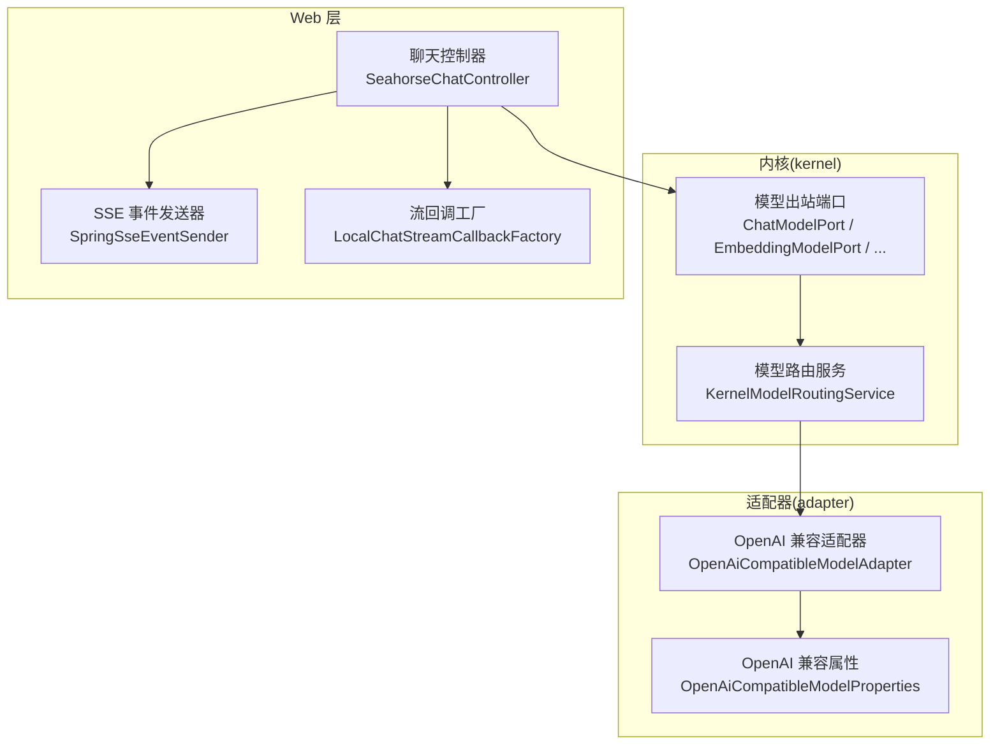

图示来源
- [KernelModelRoutingService.java](file://seahorse-agent-kernel/src/main/java/com/miracle/ai/seahorse/agent/kernel/application/model/KernelModelRoutingService.java)
- [OpenAiCompatibleModelAdapter.java](file://seahorse-agent-adapter-ai-openai-compatible/src/main/java/com/miracle/ai/seahorse/agent/adapters/ai/openai/OpenAiCompatibleModelAdapter.java)
- [OpenAiCompatibleModelProperties.java](file://seahorse-agent-adapter-ai-openai-compatible/src/main/java/com/miracle/ai/seahorse/agent/adapters/ai/openai/OpenAiCompatibleModelProperties.java)
- [SeahorseChatController.java](file://seahorse-agent-adapter-web/src/main/java/com/miracle/ai/seahorse/agent/adapters/web/SeahorseChatController.java)
- [SpringSseEventSender.java](file://seahorse-agent-adapter-web/src/main/java/com/miracle/ai/seahorse/agent/adapters/local/SpringSseEventSender.java)
- [LocalChatStreamCallbackFactory.java](file://seahorse-agent-adapter-web/src/main/java/com/miracle/ai/seahorse/agent/adapters/local/LocalChatStreamCallbackFactory.java)

章节来源
- [ChatModelPort.java:1-59](file://seahorse-agent-kernel/src/main/java/com/miracle/ai/seahorse/agent/ports/outbound/model/ChatModelPort.java#L1-L59)
- [EmbeddingModelPort.java:1-47](file://seahorse-agent-kernel/src/main/java/com/miracle/ai/seahorse/agent/ports/outbound/model/EmbeddingModelPort.java#L1-L47)
- [ModelHealthPort.java:1-48](file://seahorse-agent-kernel/src/main/java/com/miracle/ai/seahorse/agent/ports/outbound/model/ModelHealthPort.java#L1-L48)
- [ModelProviderPort.java:1-64](file://seahorse-agent-kernel/src/main/java/com/miracle/ai/seahorse/agent/ports/outbound/model/ModelProviderPort.java#L1-L64)
- [RerankModelPort.java:1-50](file://seahorse-agent-kernel/src/main/java/com/miracle/ai/seahorse/agent/ports/outbound/model/RerankModelPort.java#L1-L50)
- [StreamingChatModelPort.java:1-50](file://seahorse-agent-kernel/src/main/java/com/miracle/ai/seahorse/agent/ports/outbound/model/StreamingChatModelPort.java#L1-L50)
- [TokenCounterPort.java:1-52](file://seahorse-agent-kernel/src/main/java/com/miracle/ai/seahorse/agent/ports/outbound/model/TokenCounterPort.java#L1-L52)
- [ModelRoutingStatePort.java:1-45](file://seahorse-agent-kernel/src/main/java/com/miracle/ai/seahorse/agent/ports/outbound/model/ModelRoutingStatePort.java#L1-L45)

## 核心组件
本节对各模型出站端口进行逐项解析，明确其职责、输入输出与默认实现策略。

- ChatModelPort：非流式对话调用端口，屏蔽不同 Provider 的 SDK 差异，支持基于 ChatRequest 或消息列表的调用。
- EmbeddingModelPort：嵌入向量生成端口，面向检索与记忆的向量化需求，不绑定具体 Provider。
- ModelHealthPort：模型健康状态记录与查询端口，用于路由决策与熔断。
- ModelProviderPort：Provider 能力查询端口，提供模型可用性判断与候选模型列表。
- RerankModelPort：重排端口，对检索候选进行重排序，避免直接依赖具体 Rerank Provider。
- StreamingChatModelPort：流式对话端口，通过 SSE 回调增量生成，避免内核直接依赖具体 Provider SDK。
- TokenCounterPort：令牌估算端口，提供文本与消息级的近似令牌计数。
- ModelRoutingStatePort：模型路由状态端口，封装候选模型选择、启停与冷却状态迁移逻辑。

章节来源
- [ChatModelPort.java:25-58](file://seahorse-agent-kernel/src/main/java/com/miracle/ai/seahorse/agent/ports/outbound/model/ChatModelPort.java#L25-L58)
- [EmbeddingModelPort.java:22-46](file://seahorse-agent-kernel/src/main/java/com/miracle/ai/seahorse/agent/ports/outbound/model/EmbeddingModelPort.java#L22-L46)
- [ModelHealthPort.java:20-47](file://seahorse-agent-kernel/src/main/java/com/miracle/ai/seahorse/agent/ports/outbound/model/ModelHealthPort.java#L20-L47)
- [ModelProviderPort.java:22-63](file://seahorse-agent-kernel/src/main/java/com/miracle/ai/seahorse/agent/ports/outbound/model/ModelProviderPort.java#L22-L63)
- [RerankModelPort.java:24-49](file://seahorse-agent-kernel/src/main/java/com/miracle/ai/seahorse/agent/ports/outbound/model/RerankModelPort.java#L24-L49)
- [StreamingChatModelPort.java:24-49](file://seahorse-agent-kernel/src/main/java/com/miracle/ai/seahorse/agent/ports/outbound/model/StreamingChatModelPort.java#L24-L49)
- [TokenCounterPort.java:25-51](file://seahorse-agent-kernel/src/main/java/com/miracle/ai/seahorse/agent/ports/outbound/model/TokenCounterPort.java#L25-L51)
- [ModelRoutingStatePort.java:23-44](file://seahorse-agent-kernel/src/main/java/com/miracle/ai/seahorse/agent/ports/outbound/model/ModelRoutingStatePort.java#L23-L44)

## 架构总览
下图展示了从 Web 控制器到模型端口、再到适配器与 Provider 的调用链路，以及流式响应的 SSE 分发机制。

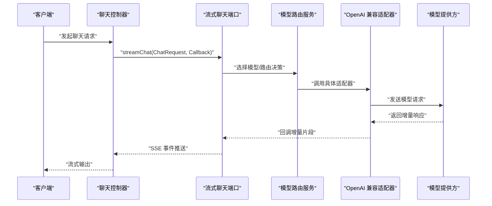

图示来源
- [SeahorseChatController.java](file://seahorse-agent-adapter-web/src/main/java/com/miracle/ai/seahorse/agent/adapters/web/SeahorseChatController.java)
- [StreamingChatModelPort.java:29-38](file://seahorse-agent-kernel/src/main/java/com/miracle/ai/seahorse/agent/ports/outbound/model/StreamingChatModelPort.java#L29-L38)
- [KernelModelRoutingService.java](file://seahorse-agent-kernel/src/main/java/com/miracle/ai/seahorse/agent/kernel/application/model/KernelModelRoutingService.java)
- [OpenAiCompatibleModelAdapter.java](file://seahorse-agent-adapter-ai-openai-compatible/src/main/java/com/miracle/ai/seahorse/agent/adapters/ai/openai/OpenAiCompatibleModelAdapter.java)

## 详细组件分析

### ChatModelPort（非流式聊天）
- 职责：提供统一的非流式对话调用接口，屏蔽 Provider SDK 差异。
- 关键方法：
  - chat(ChatRequest, String modelId)：执行一次完整对话，返回最终文本。
  - chat(String modelId, List<ChatMessage>)：便捷重载，内部构建 ChatRequest 后委托至上述方法。
- 默认实现：noop() 返回空字符串，便于测试或占位。

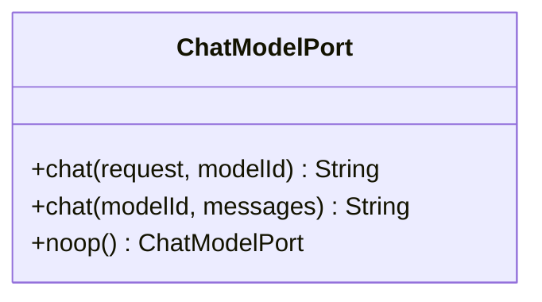

图示来源
- [ChatModelPort.java:30-57](file://seahorse-agent-kernel/src/main/java/com/miracle/ai/seahorse/agent/ports/outbound/model/ChatModelPort.java#L30-L57)

章节来源
- [ChatModelPort.java:25-58](file://seahorse-agent-kernel/src/main/java/com/miracle/ai/seahorse/agent/ports/outbound/model/ChatModelPort.java#L25-L58)

### EmbeddingModelPort（嵌入向量）
- 职责：为检索与记忆生成文本向量，不绑定具体 Provider。
- 关键方法：
  - embed(String modelId, String text)：返回向量列表。
  - noop()：返回空列表，适合无向量化需求或降级场景。
- 使用场景：向量库入库、相似度检索、语义缓存等。

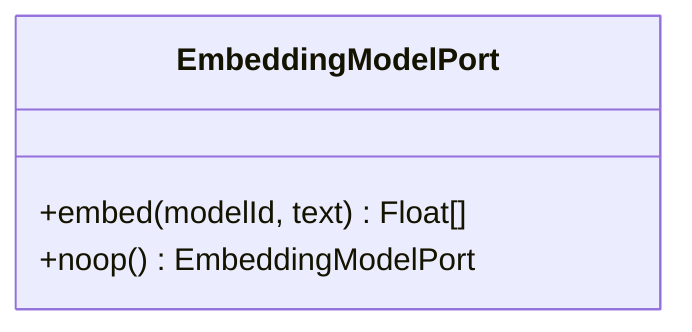

图示来源
- [EmbeddingModelPort.java:27-45](file://seahorse-agent-kernel/src/main/java/com/miracle/ai/seahorse/agent/ports/outbound/model/EmbeddingModelPort.java#L27-L45)

章节来源
- [EmbeddingModelPort.java:22-46](file://seahorse-agent-kernel/src/main/java/com/miracle/ai/seahorse/agent/ports/outbound/model/EmbeddingModelPort.java#L22-L46)

### ModelHealthPort（模型健康）
- 职责：记录与查询模型健康状态，支撑熔断与降级。
- 关键方法：
  - isHealthy(String modelId)：判断模型是否健康。
  - recordSuccess(String modelId) / recordFailure(String modelId, Throwable error)：记录成功/失败事件。
- 默认实现：noop() 返回恒定健康状态且不产生副作用。

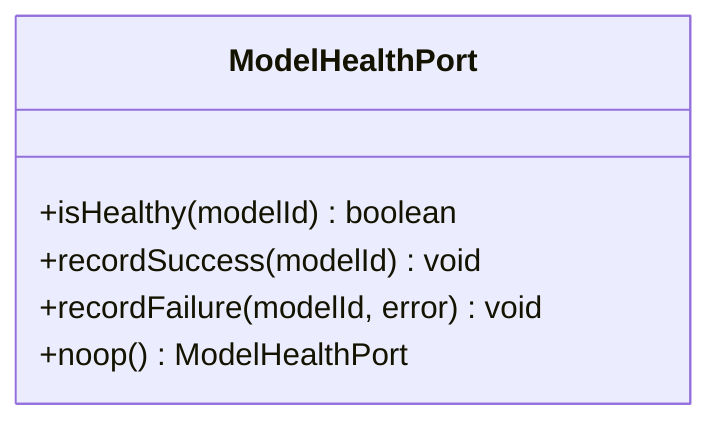

图示来源
- [ModelHealthPort.java:23-46](file://seahorse-agent-kernel/src/main/java/com/miracle/ai/seahorse/agent/ports/outbound/model/ModelHealthPort.java#L23-L46)

章节来源
- [ModelHealthPort.java:20-47](file://seahorse-agent-kernel/src/main/java/com/miracle/ai/seahorse/agent/ports/outbound/model/ModelHealthPort.java#L20-L47)

### ModelProviderPort（模型提供方能力）
- 职责：查询 Provider 支持的模型与能力，为路由生成候选集。
- 关键方法：
  - available(String modelId)：判断模型是否可用。
  - listModels(String capability)：按能力列出候选模型 ID。
- 默认实现：noop() 返回不可用与空列表，确保安全降级。

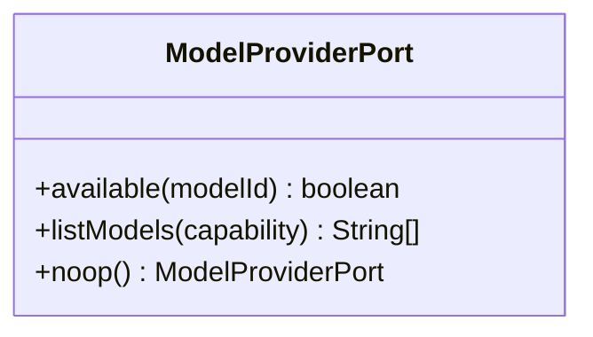

图示来源
- [ModelProviderPort.java:27-62](file://seahorse-agent-kernel/src/main/java/com/miracle/ai/seahorse/agent/ports/outbound/model/ModelProviderPort.java#L27-L62)

章节来源
- [ModelProviderPort.java:22-63](file://seahorse-agent-kernel/src/main/java/com/miracle/ai/seahorse/agent/ports/outbound/model/ModelProviderPort.java#L22-L63)

### RerankModelPort（重排序）
- 职责：对检索候选进行重排序，避免直接依赖具体 Rerank Provider。
- 关键方法：
  - rerank(String modelId, String query, List<RetrievedChunk> chunks)：返回重排后的候选列表。
- 默认实现：noop() 原样返回输入候选，保持兼容性。

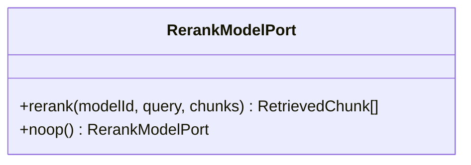

图示来源
- [RerankModelPort.java:29-48](file://seahorse-agent-kernel/src/main/java/com/miracle/ai/seahorse/agent/ports/outbound/model/RerankModelPort.java#L29-L48)

章节来源
- [RerankModelPort.java:24-49](file://seahorse-agent-kernel/src/main/java/com/miracle/ai/seahorse/agent/ports/outbound/model/RerankModelPort.java#L24-L49)

### StreamingChatModelPort（流式聊天）
- 职责：发起 SSE 增量生成，避免内核直接依赖具体 Provider SDK。
- 关键方法：
  - streamChat(ChatRequest, StreamCallback)：返回可取消句柄，回调增量片段。
- 默认实现：noop() 直接触发完成回调并返回空取消句柄。

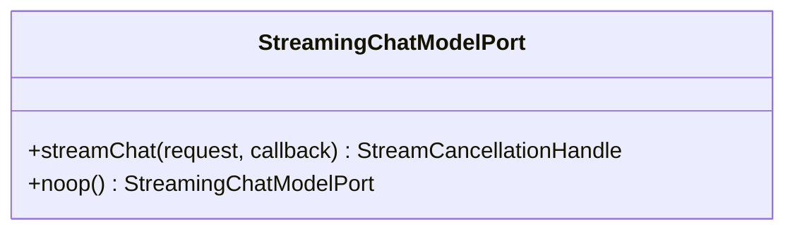

图示来源
- [StreamingChatModelPort.java:29-48](file://seahorse-agent-kernel/src/main/java/com/miracle/ai/seahorse/agent/ports/outbound/model/StreamingChatModelPort.java#L29-L48)

章节来源
- [StreamingChatModelPort.java:24-49](file://seahorse-agent-kernel/src/main/java/com/miracle/ai/seahorse/agent/ports/outbound/model/StreamingChatModelPort.java#L24-L49)

### TokenCounterPort（令牌计数）
- 职责：估算文本与消息的令牌数量，用于成本控制与上下文长度管理。
- 关键方法：
  - countTextTokens(String modelId, String text)：估算文本令牌数。
  - countMessages(String modelId, List<ChatMessage> messages)：累加消息令牌数。
  - approximate()：近似估算器，基于字符点数经验公式。
- 默认实现：approximate() 提供跨模型的通用估算策略。

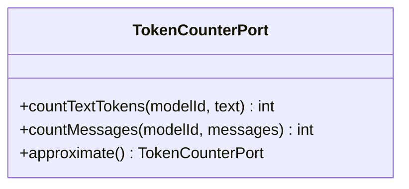

图示来源
- [TokenCounterPort.java:28-50](file://seahorse-agent-kernel/src/main/java/com/miracle/ai/seahorse/agent/ports/outbound/model/TokenCounterPort.java#L28-L50)

章节来源
- [TokenCounterPort.java:25-51](file://seahorse-agent-kernel/src/main/java/com/miracle/ai/seahorse/agent/ports/outbound/model/TokenCounterPort.java#L25-L51)

### ModelRoutingStatePort（模型路由状态）
- 职责：封装候选模型选择、启停与冷却状态迁移逻辑，承接历史路由状态。
- 关键方法：
  - selectModel(String requestedModelId, String capability, List<String> candidates)：从候选中选择目标模型。
  - firstAvailable()：优先使用请求模型，否则返回第一个可用候选。
- 默认实现：firstAvailable() 提供简单而稳健的回退策略。

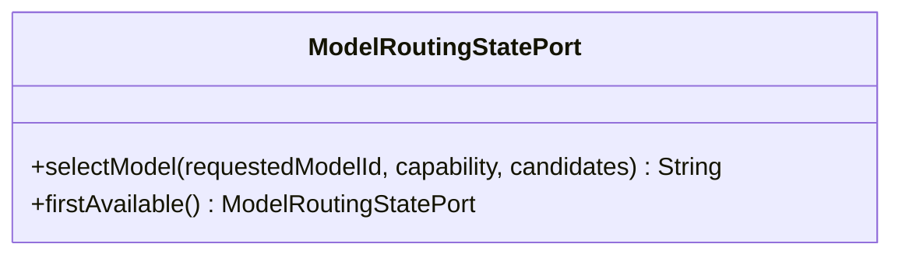

图示来源
- [ModelRoutingStatePort.java:28-43](file://seahorse-agent-kernel/src/main/java/com/miracle/ai/seahorse/agent/ports/outbound/model/ModelRoutingStatePort.java#L28-L43)

章节来源
- [ModelRoutingStatePort.java:23-44](file://seahorse-agent-kernel/src/main/java/com/miracle/ai/seahorse/agent/ports/outbound/model/ModelRoutingStatePort.java#L23-L44)

### 端口与适配器集成流程
- 路由与调用：KernelModelRoutingService 结合 ModelProviderPort 与 ModelRoutingStatePort 生成候选链，再委派到具体适配器。
- 适配器实现：OpenAiCompatibleModelAdapter 将 ChatModelPort/StreamingChatModelPort 等端口映射到 OpenAI 兼容 API；OpenAiCompatibleModelProperties 提供配置参数。
- 流式输出：StreamingChatModelPort 通过回调将增量响应推送到 Web 层，由 SpringSseEventSender 与 LocalChatStreamCallbackFactory 组合完成 SSE 推送。

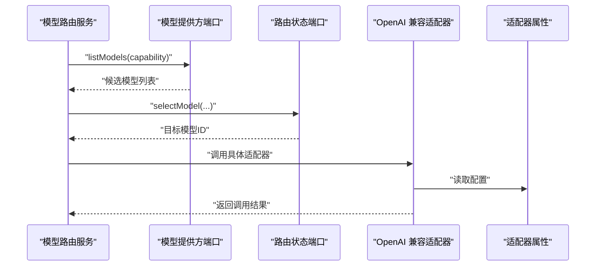

图示来源
- [KernelModelRoutingService.java](file://seahorse-agent-kernel/src/main/java/com/miracle/ai/seahorse/agent/kernel/application/model/KernelModelRoutingService.java)
- [ModelProviderPort.java:27-43](file://seahorse-agent-kernel/src/main/java/com/miracle/ai/seahorse/agent/ports/outbound/model/ModelProviderPort.java#L27-L43)
- [ModelRoutingStatePort.java:30-42](file://seahorse-agent-kernel/src/main/java/com/miracle/ai/seahorse/agent/ports/outbound/model/ModelRoutingStatePort.java#L30-L42)
- [OpenAiCompatibleModelAdapter.java](file://seahorse-agent-adapter-ai-openai-compatible/src/main/java/com/miracle/ai/seahorse/agent/adapters/ai/openai/OpenAiCompatibleModelAdapter.java)
- [OpenAiCompatibleModelProperties.java](file://seahorse-agent-adapter-ai-openai-compatible/src/main/java/com/miracle/ai/seahorse/agent/adapters/ai/openai/OpenAiCompatibleModelProperties.java)

## 依赖关系分析
- 端口间耦合：各端口职责单一，通过 KernelModelRoutingService 协同工作，降低直接耦合。
- 外部依赖：适配器模块依赖具体 Provider 的 SDK/HTTP 客户端；Web 层依赖 Spring MVC/SSE。
- 配置依赖：OpenAiCompatibleModelProperties 作为外部配置源，影响适配器行为。

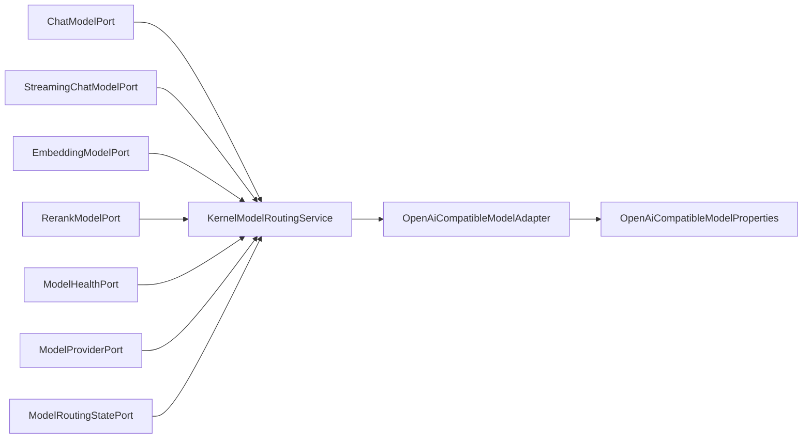

图示来源
- [KernelModelRoutingService.java](file://seahorse-agent-kernel/src/main/java/com/miracle/ai/seahorse/agent/kernel/application/model/KernelModelRoutingService.java)
- [OpenAiCompatibleModelAdapter.java](file://seahorse-agent-adapter-ai-openai-compatible/src/main/java/com/miracle/ai/seahorse/agent/adapters/ai/openai/OpenAiCompatibleModelAdapter.java)
- [OpenAiCompatibleModelProperties.java](file://seahorse-agent-adapter-ai-openai-compatible/src/main/java/com/miracle/ai/seahorse/agent/adapters/ai/openai/OpenAiCompatibleModelProperties.java)

章节来源
- [KernelModelRoutingService.java](file://seahorse-agent-kernel/src/main/java/com/miracle/ai/seahorse/agent/kernel/application/model/KernelModelRoutingService.java)
- [OpenAiCompatibleModelAdapter.java](file://seahorse-agent-adapter-ai-openai-compatible/src/main/java/com/miracle/ai/seahorse/agent/adapters/ai/openai/OpenAiCompatibleModelAdapter.java)
- [OpenAiCompatibleModelProperties.java](file://seahorse-agent-adapter-ai-openai-compatible/src/main/java/com/miracle/ai/seahorse/agent/adapters/ai/openai/OpenAiCompatibleModelProperties.java)

## 性能考虑
- 令牌计数：使用 TokenCounterPort.approximate() 进行快速估算，减少昂贵的分词器调用；在需要高精度时可替换为具体 Provider 的计数器。
- 健康监控：ModelHealthPort 记录成功率与失败原因，结合熔断策略避免对异常 Provider 的持续调用。
- 路由策略：ModelRoutingStatePort.firstAvailable() 提供简单回退；复杂场景可扩展为基于延迟、错误率、负载的权重选择。
- 流式输出：StreamingChatModelPort 通过回调增量推送，降低首字节延迟；Web 层需保证 SSE 连接稳定与背压处理。
- 嵌入生成：EmbeddingModelPort 不绑定 Provider，可在适配器层引入批处理与缓存以提升吞吐。

## 故障排查指南
- 无响应或超时
  - 检查 ModelHealthPort 是否记录失败并触发熔断。
  - 核对 ModelProviderPort.listModels(capability) 是否返回有效候选。
  - 确认 OpenAiCompatibleModelProperties 中的连接参数与鉴权配置正确。
- 流式输出中断
  - 检查 StreamingChatModelPort 的回调是否被提前关闭。
  - 确认 Web 层的 SpringSseEventSender 与 LocalChatStreamCallbackFactory 正常工作。
- 令牌计数异常
  - 若 approximate() 估算过低/过高，考虑切换到更精确的计数器实现。
  - 核对 TokenCounterPort.countMessages() 对空消息的处理逻辑。
- 嵌入向量为空
  - 确认 EmbeddingModelPort.noop() 仅用于降级场景，生产环境应使用适配器实现。

章节来源
- [ModelHealthPort.java:23-46](file://seahorse-agent-kernel/src/main/java/com/miracle/ai/seahorse/agent/ports/outbound/model/ModelHealthPort.java#L23-L46)
- [ModelProviderPort.java:27-62](file://seahorse-agent-kernel/src/main/java/com/miracle/ai/seahorse/agent/ports/outbound/model/ModelProviderPort.java#L27-L62)
- [StreamingChatModelPort.java:29-48](file://seahorse-agent-kernel/src/main/java/com/miracle/ai/seahorse/agent/ports/outbound/model/StreamingChatModelPort.java#L29-L48)
- [TokenCounterPort.java:28-50](file://seahorse-agent-kernel/src/main/java/com/miracle/ai/seahorse/agent/ports/outbound/model/TokenCounterPort.java#L28-L50)
- [OpenAiCompatibleModelProperties.java](file://seahorse-agent-adapter-ai-openai-compatible/src/main/java/com/miracle/ai/seahorse/agent/adapters/ai/openai/OpenAiCompatibleModelProperties.java)

## 结论
本项目的模型出站端口通过清晰的职责划分与“端口-适配器”架构，实现了对多 Provider 的统一抽象与灵活替换。结合路由、健康监控、令牌计数与流式输出等能力，可构建具备高可用、可观测与高性能的智能模型调用系统。建议在生产环境中：
- 明确各端口的默认实现策略与降级路径
- 配置合理的健康监控与熔断阈值
- 优化路由策略与流式推送链路
- 引入批处理与缓存以提升嵌入与推理效率

## 附录
- 示例：如何实现一个最小可用的 OpenAI 兼容聊天流式调用
  - 在 Web 层调用 ChatModelPort 或 StreamingChatModelPort
  - 通过 KernelModelRoutingService 选择模型
  - 适配器读取 OpenAiCompatibleModelProperties 完成实际调用
  - 使用 SpringSseEventSender 与 LocalChatStreamCallbackFactory 推送 SSE

章节来源
- [SeahorseChatController.java](file://seahorse-agent-adapter-web/src/main/java/com/miracle/ai/seahorse/agent/adapters/web/SeahorseChatController.java)
- [StreamingChatModelPort.java:29-38](file://seahorse-agent-kernel/src/main/java/com/miracle/ai/seahorse/agent/ports/outbound/model/StreamingChatModelPort.java#L29-L38)
- [KernelModelRoutingService.java](file://seahorse-agent-kernel/src/main/java/com/miracle/ai/seahorse/agent/kernel/application/model/KernelModelRoutingService.java)
- [OpenAiCompatibleModelAdapter.java](file://seahorse-agent-adapter-ai-openai-compatible/src/main/java/com/miracle/ai/seahorse/agent/adapters/ai/openai/OpenAiCompatibleModelAdapter.java)
- [OpenAiCompatibleModelProperties.java](file://seahorse-agent-adapter-ai-openai-compatible/src/main/java/com/miracle/ai/seahorse/agent/adapters/ai/openai/OpenAiCompatibleModelProperties.java)