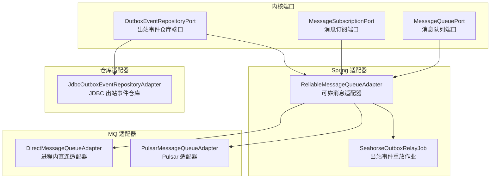
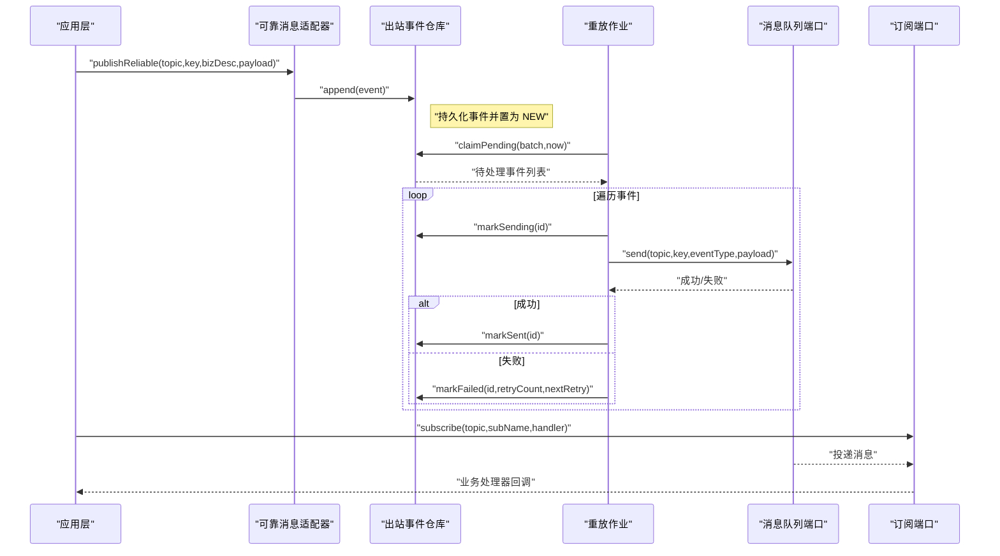
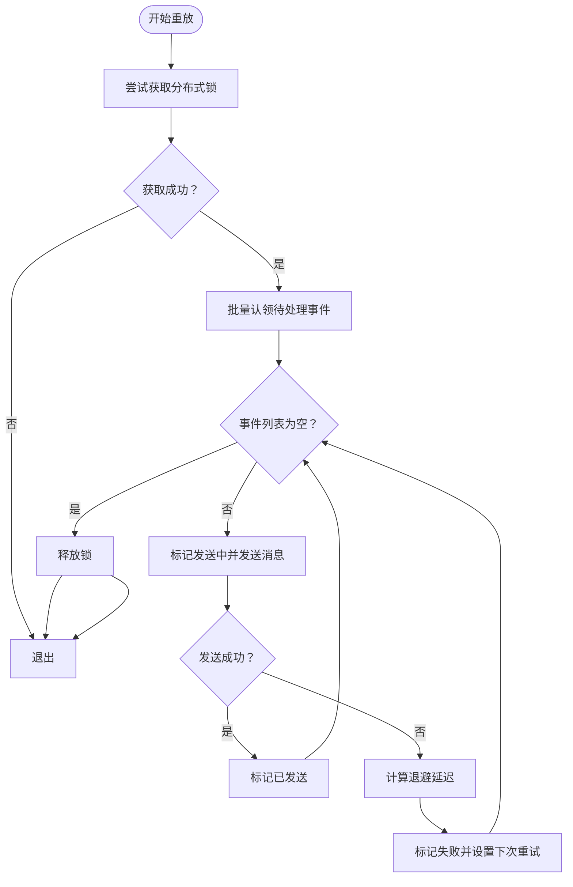
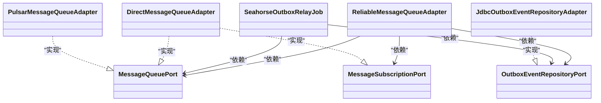

# 消息队列出站端口

<cite>
**本文档引用的文件**
- [MessageQueuePort.java](file://seahorse-agent-kernel/src/main/java/com/miracle/ai/seahorse/agent/ports/outbound/mq/MessageQueuePort.java)
- [MessageSubscriptionPort.java](file://seahorse-agent-kernel/src/main/java/com/miracle/ai/seahorse/agent/ports/outbound/mq/MessageSubscriptionPort.java)
- [OutboxEventRepositoryPort.java](file://seahorse-agent-kernel/src/main/java/com/miracle/ai/seahorse/agent/ports/outbound/mq/OutboxEventRepositoryPort.java)
- [OutboxEvent.java](file://seahorse-agent-kernel/src/main/java/com/miracle/ai/seahorse/agent/ports/outbound/mq/OutboxEvent.java)
- [OutboxEventStatus.java](file://seahorse-agent-kernel/src/main/java/com/miracle/ai/seahorse/agent/ports/outbound/mq/OutboxEventStatus.java)
- [ReliableMessageQueueAdapter.java](file://seahorse-agent-spring-boot-autoconfigure/src/main/java/com/miracle/ai/seahorse/agent/adapters/spring/mq/ReliableMessageQueueAdapter.java)
- [SeahorseOutboxRelayJob.java](file://seahorse-agent-spring-boot-autoconfigure/src/main/java/com/miracle/ai/seahorse/agent/adapters/spring/mq/SeahorseOutboxRelayJob.java)
- [DirectMessageQueueAdapter.java](file://seahorse-agent-adapter-mq-direct/src/main/java/com/miracle/ai/seahorse/agent/adapters/mq/direct/DirectMessageQueueAdapter.java)
- [PulsarMessageQueueAdapter.java](file://seahorse-agent-adapter-mq-pulsar/src/main/java/com/miracle/ai/seahorse/agent/adapters/mq/pulsar/PulsarMessageQueueAdapter.java)
- [JdbcOutboxEventRepositoryAdapter.java](file://seahorse-agent-adapter-repository-jdbc/src/main/java/com/miracle/ai/seahorse/agent/adapters/repository/jdbc/JdbcOutboxEventRepositoryAdapter.java)
</cite>

## 目录
1. [简介](#简介)
2. [项目结构](#项目结构)
3. [核心组件](#核心组件)
4. [架构总览](#架构总览)
5. [详细组件分析](#详细组件分析)
6. [依赖关系分析](#依赖关系分析)
7. [性能考虑](#性能考虑)
8. [故障排查指南](#故障排查指南)
9. [结论](#结论)
10. [附录](#附录)

## 简介
本文件聚焦于消息队列与事件驱动相关的出站端口设计，系统性阐述以下关键能力：
- 可靠消息发布：通过出站事件仓库（Outbox）+ 重放作业（Relay Job）实现消息的最终一致性与可靠性保障
- 异步事件处理：基于消息订阅端口的事件分发与处理
- 多适配器支持：进程内直连适配器与生产级 Pulsar 适配器
- 事件溯源与重试：事件状态机、指数退避重试与失败处理

目标是帮助读者理解如何在不侵入业务逻辑的前提下，构建高可靠、可扩展的消息通信系统。

## 项目结构
消息队列出站端口相关代码分布在内核端口定义、Spring 启动适配器、MQ 适配器与 JDBC 仓库适配器中：
- 内核端口：定义消息发送、订阅与出站事件仓库的标准接口
- Spring 适配器：提供可靠消息发布门面与出站事件重放作业
- MQ 适配器：实现具体消息中间件（如 Pulsar）与进程内直连适配器
- JDBC 仓库适配器：实现 Outbox 事件的持久化与状态管理

**图表来源**
- [MessageQueuePort.java:1-200](file://seahorse-agent-kernel/src/main/java/com/miracle/ai/seahorse/agent/ports/outbound/mq/MessageQueuePort.java#L1-L200)
- [MessageSubscriptionPort.java:1-28](file://seahorse-agent-kernel/src/main/java/com/miracle/ai/seahorse/agent/ports/outbound/mq/MessageSubscriptionPort.java#L1-L28)
- [OutboxEventRepositoryPort.java:1-39](file://seahorse-agent-kernel/src/main/java/com/miracle/ai/seahorse/agent/ports/outbound/mq/OutboxEventRepositoryPort.java#L1-L39)
- [ReliableMessageQueueAdapter.java:1-200](file://seahorse-agent-spring-boot-autoconfigure/src/main/java/com/miracle/ai/seahorse/agent/adapters/spring/mq/ReliableMessageQueueAdapter.java#L1-L200)
- [SeahorseOutboxRelayJob.java:1-150](file://seahorse-agent-spring-boot-autoconfigure/src/main/java/com/miracle/ai/seahorse/agent/adapters/spring/mq/SeahorseOutboxRelayJob.java#L1-L150)
- [DirectMessageQueueAdapter.java:1-200](file://seahorse-agent-adapter-mq-direct/src/main/java/com/miracle/ai/seahorse/agent/adapters/mq/direct/DirectMessageQueueAdapter.java#L1-L200)
- [PulsarMessageQueueAdapter.java:1-200](file://seahorse-agent-adapter-mq-pulsar/src/main/java/com/miracle/ai/seahorse/agent/adapters/mq/pulsar/PulsarMessageQueueAdapter.java#L1-L200)
- [JdbcOutboxEventRepositoryAdapter.java:1-300](file://seahorse-agent-adapter-repository-jdbc/src/main/java/com/miracle/ai/seahorse/agent/adapters/repository/jdbc/JdbcOutboxEventRepositoryAdapter.java#L1-L300)

**章节来源**
- [MessageQueuePort.java:1-200](file://seahorse-agent-kernel/src/main/java/com/miracle/ai/seahorse/agent/ports/outbound/mq/MessageQueuePort.java#L1-L200)
- [MessageSubscriptionPort.java:1-28](file://seahorse-agent-kernel/src/main/java/com/miracle/ai/seahorse/agent/ports/outbound/mq/MessageSubscriptionPort.java#L1-L28)
- [OutboxEventRepositoryPort.java:1-39](file://seahorse-agent-kernel/src/main/java/com/miracle/ai/seahorse/agent/ports/outbound/mq/OutboxEventRepositoryPort.java#L1-L39)
- [ReliableMessageQueueAdapter.java:1-200](file://seahorse-agent-spring-boot-autoconfigure/src/main/java/com/miracle/ai/seahorse/agent/adapters/spring/mq/ReliableMessageQueueAdapter.java#L1-L200)
- [SeahorseOutboxRelayJob.java:1-150](file://seahorse-agent-spring-boot-autoconfigure/src/main/java/com/miracle/ai/seahorse/agent/adapters/spring/mq/SeahorseOutboxRelayJob.java#L1-L150)
- [DirectMessageQueueAdapter.java:1-200](file://seahorse-agent-adapter-mq-direct/src/main/java/com/miracle/ai/seahorse/agent/adapters/mq/direct/DirectMessageQueueAdapter.java#L1-L200)
- [PulsarMessageQueueAdapter.java:1-200](file://seahorse-agent-adapter-mq-pulsar/src/main/java/com/miracle/ai/seahorse/agent/adapters/mq/pulsar/PulsarMessageQueueAdapter.java#L1-L200)
- [JdbcOutboxEventRepositoryAdapter.java:1-300](file://seahorse-agent-adapter-repository-jdbc/src/main/java/com/miracle/ai/seahorse/agent/adapters/repository/jdbc/JdbcOutboxEventRepositoryAdapter.java#L1-L300)

## 核心组件
- 消息队列端口（MessageQueuePort）
  - 定义统一的消息发送接口，支持主题、键、业务描述与消息体
  - 为可靠发布与直接发送提供抽象
- 消息订阅端口（MessageSubscriptionPort）
  - 提供订阅接口，应用层仅需关注业务处理器
  - 具体的订阅生命周期、ACK、重试与反序列化由底层适配器负责
- 出站事件仓库端口（OutboxEventRepositoryPort）
  - 统一的事件持久化与状态推进接口
  - 支持追加事件、批量认领待处理事件、标记发送中/已发送/失败
- 出站事件模型（OutboxEvent）
  - 包含事件标识、主题、消息键、事件类型、负载 JSON 与投递状态
  - 提供 Builder 构造器以避免过长构造函数
- 可靠消息适配器（ReliableMessageQueueAdapter）
  - 在不可用时回退到直接发送
  - 将可靠发布委托给 Outbox 与消息队列端口
- 出站事件重放作业（SeahorseOutboxRelayJob）
  - 分布式锁保护下的批量重放
  - 解析可靠消息封装体，发送至消息队列并推进状态
  - 失败时进行指数退避重试与错误记录

**章节来源**
- [MessageQueuePort.java:1-200](file://seahorse-agent-kernel/src/main/java/com/miracle/ai/seahorse/agent/ports/outbound/mq/MessageQueuePort.java#L1-L200)
- [MessageSubscriptionPort.java:1-28](file://seahorse-agent-kernel/src/main/java/com/miracle/ai/seahorse/agent/ports/outbound/mq/MessageSubscriptionPort.java#L1-L28)
- [OutboxEventRepositoryPort.java:1-39](file://seahorse-agent-kernel/src/main/java/com/miracle/ai/seahorse/agent/ports/outbound/mq/OutboxEventRepositoryPort.java#L1-L39)
- [OutboxEvent.java:1-150](file://seahorse-agent-kernel/src/main/java/com/miracle/ai/seahorse/agent/ports/outbound/mq/OutboxEvent.java#L1-L150)
- [ReliableMessageQueueAdapter.java:1-200](file://seahorse-agent-spring-boot-autoconfigure/src/main/java/com/miracle/ai/seahorse/agent/adapters/spring/mq/ReliableMessageQueueAdapter.java#L1-L200)
- [SeahorseOutboxRelayJob.java:1-150](file://seahorse-agent-spring-boot-autoconfigure/src/main/java/com/miracle/ai/seahorse/agent/adapters/spring/mq/SeahorseOutboxRelayJob.java#L1-L150)

## 架构总览
下图展示了从应用层到消息中间件的完整链路，以及 Outbox 的可靠发布与重放机制：

**图表来源**
- [ReliableMessageQueueAdapter.java:60-120](file://seahorse-agent-spring-boot-autoconfigure/src/main/java/com/miracle/ai/seahorse/agent/adapters/spring/mq/ReliableMessageQueueAdapter.java#L60-L120)
- [SeahorseOutboxRelayJob.java:78-112](file://seahorse-agent-spring-boot-autoconfigure/src/main/java/com/miracle/ai/seahorse/agent/adapters/spring/mq/SeahorseOutboxRelayJob.java#L78-L112)
- [OutboxEventRepositoryPort.java:28-39](file://seahorse-agent-kernel/src/main/java/com/miracle/ai/seahorse/agent/ports/outbound/mq/OutboxEventRepositoryPort.java#L28-L39)
- [MessageQueuePort.java:1-200](file://seahorse-agent-kernel/src/main/java/com/miracle/ai/seahorse/agent/ports/outbound/mq/MessageQueuePort.java#L1-L200)
- [MessageSubscriptionPort.java:1-28](file://seahorse-agent-kernel/src/main/java/com/miracle/ai/seahorse/agent/ports/outbound/mq/MessageSubscriptionPort.java#L1-L28)

## 详细组件分析

### 消息队列端口（MessageQueuePort）
- 角色定位：统一的消息发送抽象，屏蔽不同消息中间件差异
- 关键职责：
  - 发送消息到指定主题，携带键与业务描述
  - 返回发送收据或结果
- 设计要点：
  - 与可靠消息适配器配合，支持直接发送与可靠发送两种模式
  - 与订阅端口共同构成事件驱动闭环

**章节来源**
- [MessageQueuePort.java:1-200](file://seahorse-agent-kernel/src/main/java/com/miracle/ai/seahorse/agent/ports/outbound/mq/MessageQueuePort.java#L1-L200)

### 消息订阅端口（MessageSubscriptionPort）
- 角色定位：事件消费入口，应用层仅需注册业务处理器
- 关键职责：
  - 订阅指定主题与订阅名
  - 按类型反序列化并回调业务处理器
  - 返回可关闭句柄用于取消订阅
- 设计要点：
  - 底层适配器负责 ACK、重试与反序列化细节
  - 与消息队列端口形成“发布-订阅”闭环

**章节来源**
- [MessageSubscriptionPort.java:1-28](file://seahorse-agent-kernel/src/main/java/com/miracle/ai/seahorse/agent/ports/outbound/mq/MessageSubscriptionPort.java#L1-L28)

### 出站事件仓库端口（OutboxEventRepositoryPort）
- 角色定位：可靠发布的核心存储抽象
- 关键职责：
  - 追加事件：将待发送事件持久化
  - 批量认领：按批次获取待处理事件
  - 状态推进：标记发送中、已发送、失败（含重试次数与下次重试时间）
- 设计要点：
  - 与分布式锁配合，确保重放作业的幂等与一致性
  - 与重放作业协同完成最终一致性

**章节来源**
- [OutboxEventRepositoryPort.java:1-39](file://seahorse-agent-kernel/src/main/java/com/miracle/ai/seahorse/agent/ports/outbound/mq/OutboxEventRepositoryPort.java#L1-L39)

### 出站事件模型（OutboxEvent）
- 结构组成：
  - 事件标识、主题、消息键、事件类型、负载 JSON
  - 投递状态（包含状态、重试次数、下次重试时间等）
- 设计要点：
  - Builder 模式避免过长构造函数
  - 对空值进行严格校验，提升健壮性

**章节来源**
- [OutboxEvent.java:1-150](file://seahorse-agent-kernel/src/main/java/com/miracle/ai/seahorse/agent/ports/outbound/mq/OutboxEvent.java#L1-L150)
- [OutboxEventStatus.java:1-120](file://seahorse-agent-kernel/src/main/java/com/miracle/ai/seahorse/agent/ports/outbound/mq/OutboxEventStatus.java#L1-L120)

### 可靠消息适配器（ReliableMessageQueueAdapter）
- 角色定位：可靠发布门面，封装 Outbox 与消息队列端口
- 关键流程：
  - 当 Outbox 可用时：先写入 Outbox，再由重放作业发送
  - 当 Outbox 不可用时：直接发送（降级）
- 设计要点：
  - 通过依赖注入获取 Outbox 仓库与消息队列端口
  - 使用对象映射器处理可靠消息封装体

**章节来源**
- [ReliableMessageQueueAdapter.java:1-200](file://seahorse-agent-spring-boot-autoconfigure/src/main/java/com/miracle/ai/seahorse/agent/adapters/spring/mq/ReliableMessageQueueAdapter.java#L1-L200)

### 出站事件重放作业（SeahorseOutboxRelayJob）
- 角色定位：后台任务，负责将 Outbox 中的事件批量发送到消息队列
- 关键流程：
  - 获取分布式锁，防止并发重放
  - 认领待处理事件，逐条发送
  - 成功则标记已发送；失败则计算下次重试时间并更新状态
- 设计要点：
  - 指数退避重试，上限保护
  - 错误日志记录，便于排障

**图表来源**
- [SeahorseOutboxRelayJob.java:78-112](file://seahorse-agent-spring-boot-autoconfigure/src/main/java/com/miracle/ai/seahorse/agent/adapters/spring/mq/SeahorseOutboxRelayJob.java#L78-L112)

**章节来源**
- [SeahorseOutboxRelayJob.java:1-150](file://seahorse-agent-spring-boot-autoconfigure/src/main/java/com/miracle/ai/seahorse/agent/adapters/spring/mq/SeahorseOutboxRelayJob.java#L1-L150)

### 进程内直连适配器（DirectMessageQueueAdapter）
- 角色定位：本地测试与开发环境的轻量实现
- 关键特性：
  - 订阅即刻分发，无网络开销
  - 支持类型转换与处理器回调
  - 提供消息快照以便断言与调试
- 设计要点：
  - 适合单元测试与集成测试场景
  - 与可靠发布解耦，可直接使用

**章节来源**
- [DirectMessageQueueAdapter.java:1-200](file://seahorse-agent-adapter-mq-direct/src/main/java/com/miracle/ai/seahorse/agent/adapters/mq/direct/DirectMessageQueueAdapter.java#L1-L200)

### Pulsar 适配器（PulsarMessageQueueAdapter）
- 角色定位：生产级消息中间件适配
- 关键特性：
  - 基于 Pulsar 的主题发布与订阅
  - 支持可靠消息封装体解析与发送
- 设计要点：
  - 与可靠发布机制无缝衔接
  - 通过属性配置实现灵活部署

**章节来源**
- [PulsarMessageQueueAdapter.java:1-200](file://seahorse-agent-adapter-mq-pulsar/src/main/java/com/miracle/ai/seahorse/agent/adapters/mq/pulsar/PulsarMessageQueueAdapter.java#L1-L200)

### JDBC 出站事件仓库适配器（JdbcOutboxEventRepositoryAdapter）
- 角色定位：持久化 Outbox 事件的数据库实现
- 关键职责：
  - 实现事件追加、批量认领、状态推进
  - 与数据库事务与锁机制协作
- 设计要点：
  - 与重放作业配合，保证最终一致性
  - 支持状态枚举与重试策略

**章节来源**
- [JdbcOutboxEventRepositoryAdapter.java:1-300](file://seahorse-agent-adapter-repository-jdbc/src/main/java/com/miracle/ai/seahorse/agent/adapters/repository/jdbc/JdbcOutboxEventRepositoryAdapter.java#L1-L300)

## 依赖关系分析
- 松耦合设计：
  - 应用层仅依赖内核端口，不感知具体 MQ 实现
  - 可靠发布通过适配器与仓库端口解耦
- 依赖方向：
  - 可靠消息适配器依赖消息队列端口、订阅端口与出站事件仓库端口
  - 重放作业依赖出站事件仓库端口与消息队列端口
  - MQ 适配器实现消息队列端口与订阅端口
  - JDBC 适配器实现出站事件仓库端口

**图表来源**
- [MessageQueuePort.java:1-200](file://seahorse-agent-kernel/src/main/java/com/miracle/ai/seahorse/agent/ports/outbound/mq/MessageQueuePort.java#L1-L200)
- [MessageSubscriptionPort.java:1-28](file://seahorse-agent-kernel/src/main/java/com/miracle/ai/seahorse/agent/ports/outbound/mq/MessageSubscriptionPort.java#L1-L28)
- [OutboxEventRepositoryPort.java:1-39](file://seahorse-agent-kernel/src/main/java/com/miracle/ai/seahorse/agent/ports/outbound/mq/OutboxEventRepositoryPort.java#L1-L39)
- [ReliableMessageQueueAdapter.java:1-200](file://seahorse-agent-spring-boot-autoconfigure/src/main/java/com/miracle/ai/seahorse/agent/adapters/spring/mq/ReliableMessageQueueAdapter.java#L1-L200)
- [SeahorseOutboxRelayJob.java:1-150](file://seahorse-agent-spring-boot-autoconfigure/src/main/java/com/miracle/ai/seahorse/agent/adapters/spring/mq/SeahorseOutboxRelayJob.java#L1-L150)
- [DirectMessageQueueAdapter.java:1-200](file://seahorse-agent-adapter-mq-direct/src/main/java/com/miracle/ai/seahorse/agent/adapters/mq/direct/DirectMessageQueueAdapter.java#L1-L200)
- [PulsarMessageQueueAdapter.java:1-200](file://seahorse-agent-adapter-mq-pulsar/src/main/java/com/miracle/ai/seahorse/agent/adapters/mq/pulsar/PulsarMessageQueueAdapter.java#L1-L200)
- [JdbcOutboxEventRepositoryAdapter.java:1-300](file://seahorse-agent-adapter-repository-jdbc/src/main/java/com/miracle/ai/seahorse/agent/adapters/repository/jdbc/JdbcOutboxEventRepositoryAdapter.java#L1-L300)

**章节来源**
- [ReliableMessageQueueAdapter.java:1-200](file://seahorse-agent-spring-boot-autoconfigure/src/main/java/com/miracle/ai/seahorse/agent/adapters/spring/mq/ReliableMessageQueueAdapter.java#L1-L200)
- [SeahorseOutboxRelayJob.java:1-150](file://seahorse-agent-spring-boot-autoconfigure/src/main/java/com/miracle/ai/seahorse/agent/adapters/spring/mq/SeahorseOutboxRelayJob.java#L1-L150)
- [DirectMessageQueueAdapter.java:1-200](file://seahorse-agent-adapter-mq-direct/src/main/java/com/miracle/ai/seahorse/agent/adapters/mq/direct/DirectMessageQueueAdapter.java#L1-L200)
- [PulsarMessageQueueAdapter.java:1-200](file://seahorse-agent-adapter-mq-pulsar/src/main/java/com/miracle/ai/seahorse/agent/adapters/mq/pulsar/PulsarMessageQueueAdapter.java#L1-L200)
- [JdbcOutboxEventRepositoryAdapter.java:1-300](file://seahorse-agent-adapter-repository-jdbc/src/main/java/com/miracle/ai/seahorse/agent/adapters/repository/jdbc/JdbcOutboxEventRepositoryAdapter.java#L1-L300)

## 性能考虑
- 批量处理：重放作业采用批处理认领与发送，降低数据库与 MQ 的调用频次
- 指数退避：失败重试采用指数退避并设置上限，避免风暴效应
- 分布式锁：防止多个实例并发执行重放，保证幂等性
- 本地直连适配器：在测试环境中减少网络开销，提高吞吐
- 数据库索引与状态字段：建议在 Outbox 表上建立必要的索引以优化认领与状态查询

## 故障排查指南
- 可靠发布未生效
  - 检查 Outbox 是否可用与初始化是否正确
  - 确认重放作业是否运行且获取到分布式锁
  - 查看 Outbox 事件状态是否停留在“NEW”或“SENDING”
- 消息未被消费
  - 确认订阅端口已正确注册处理器
  - 检查消息类型与反序列化是否匹配
  - 核对主题与订阅名是否一致
- 重放作业失败
  - 查看错误日志中的异常堆栈
  - 检查 MQ 连接参数与权限
  - 确认事件负载 JSON 是否符合预期
- 死信处理
  - 建议在 Outbox 仓库中增加最大重试次数阈值
  - 将超过阈值的事件迁移到死信表或外部死信队列

**章节来源**
- [SeahorseOutboxRelayJob.java:106-112](file://seahorse-agent-spring-boot-autoconfigure/src/main/java/com/miracle/ai/seahorse/agent/adapters/spring/mq/SeahorseOutboxRelayJob.java#L106-L112)
- [ReliableMessageQueueAdapter.java:70-75](file://seahorse-agent-spring-boot-autoconfigure/src/main/java/com/miracle/ai/seahorse/agent/adapters/spring/mq/ReliableMessageQueueAdapter.java#L70-L75)

## 结论
通过内核端口抽象、可靠消息适配器与 Outbox 重放机制，系统实现了：
- 无侵入的事件驱动与异步处理
- 最终一致性的可靠发布
- 易于替换的 MQ 适配器与持久化实现
- 可观测、可扩展的消息通信基础设施

## 附录
- 快速实现步骤（概要）
  - 在应用层使用可靠消息适配器发布事件
  - 启动重放作业并配置分布式锁
  - 注册订阅处理器处理业务事件
  - 在测试环境使用进程内直连适配器验证流程
  - 生产环境接入 Pulsar 并实现 JDBC 出站事件仓库