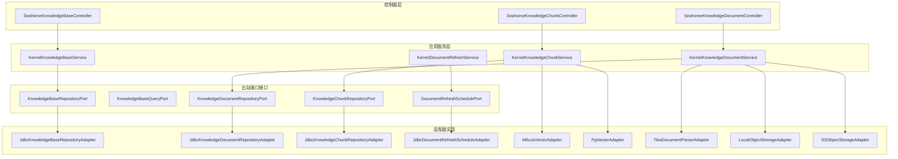
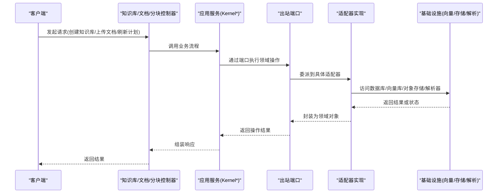
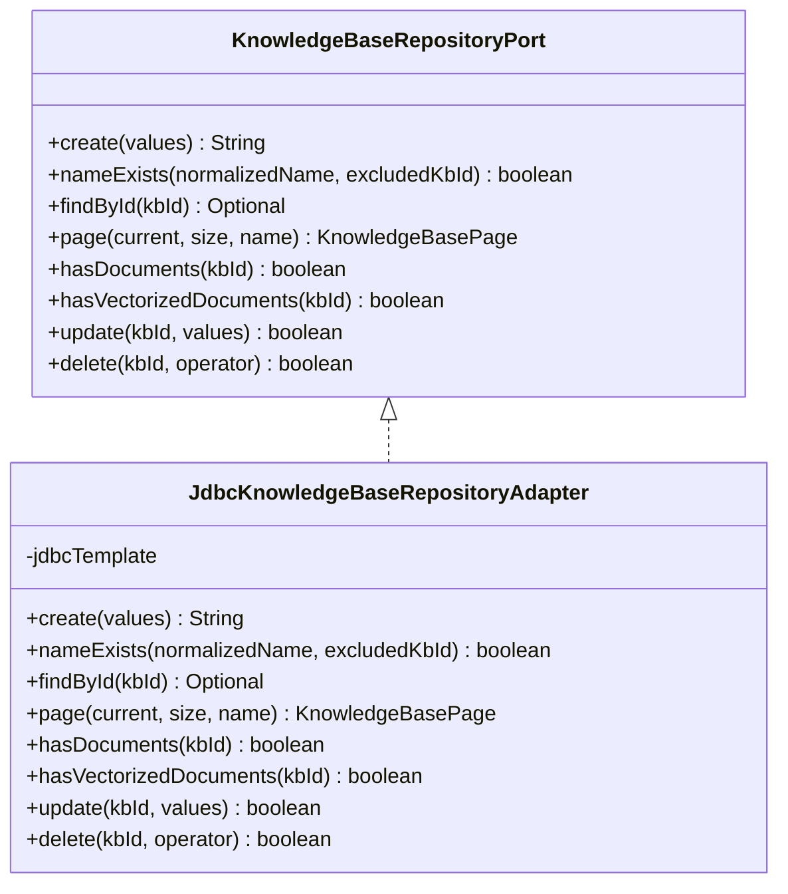
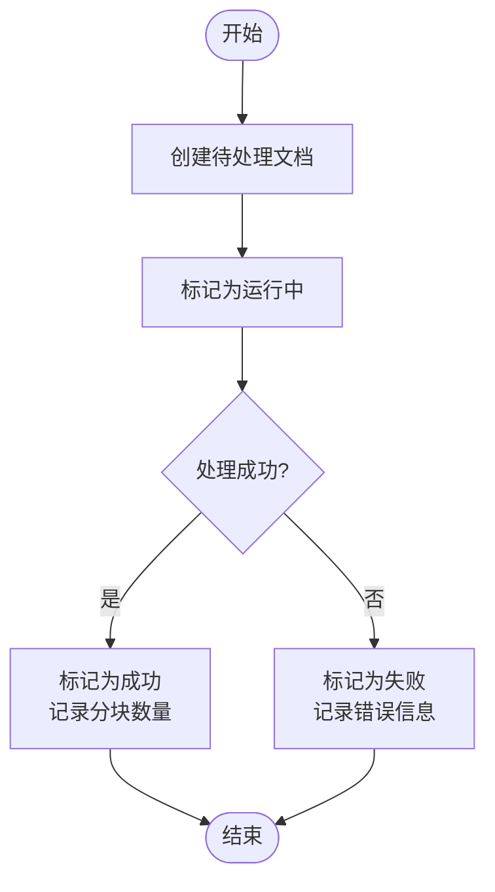
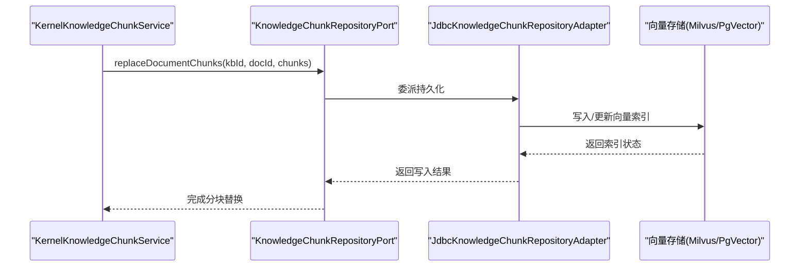
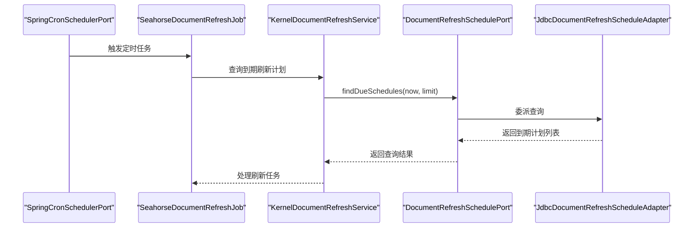
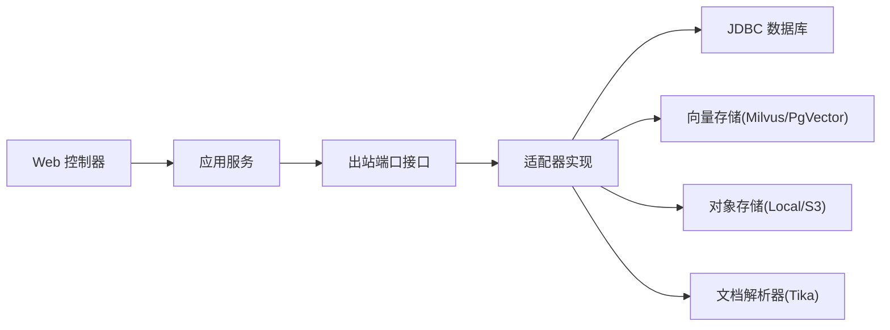

# 知识库出站端口

<cite>
**本文引用的文件**
- [KnowledgeBaseRepositoryPort.java](file://seahorse-agent-kernel/src/main/java/com/miracle/ai/seahorse/agent/ports/outbound/knowledge/KnowledgeBaseRepositoryPort.java)
- [KnowledgeBaseQueryPort.java](file://seahorse-agent-kernel/src/main/java/com/miracle/ai/seahorse/agent/ports/outbound/knowledge/KnowledgeBaseQueryPort.java)
- [KnowledgeDocumentRepositoryPort.java](file://seahorse-agent-kernel/src/main/java/com/miracle/ai/seahorse/agent/ports/outbound/knowledge/KnowledgeDocumentRepositoryPort.java)
- [KnowledgeChunkRepositoryPort.java](file://seahorse-agent-kernel/src/main/java/com/miracle/ai/seahorse/agent/ports/outbound/knowledge/KnowledgeChunkRepositoryPort.java)
- [DocumentRefreshSchedulePort.java](file://seahorse-agent-kernel/src/main/java/com/miracle/ai/seahorse/agent/ports/outbound/knowledge/DocumentRefreshSchedulePort.java)
- [JdbcKnowledgeBaseRepositoryAdapter.java](file://seahorse-agent-adapter-repository-jdbc/src/main/java/com/miracle/ai/seahorse/agent/adapters/repository/jdbc/JdbcKnowledgeBaseRepositoryAdapter.java)
- [JdbcKnowledgeDocumentRepositoryAdapter.java](file://seahorse-agent-adapter-repository-jdbc/src/main/java/com/miracle/ai/seahorse/agent/adapters/repository/jdbc/JdbcKnowledgeDocumentRepositoryAdapter.java)
- [JdbcKnowledgeChunkRepositoryAdapter.java](file://seahorse-agent-adapter-repository-jdbc/src/main/java/com/miracle/ai/seahorse/agent/adapters/repository/jdbc/JdbcKnowledgeChunkRepositoryAdapter.java)
- [JdbcDocumentRefreshScheduleAdapter.java](file://seahorse-agent-adapter-repository-jdbc/src/main/java/com/miracle/ai/seahorse/agent/adapters/repository/jdbc/JdbcDocumentRefreshScheduleAdapter.java)
- [SeahorseKnowledgeBaseController.java](file://seahorse-agent-adapter-web/src/main/java/com/miracle/ai/seahorse/agent/adapters/web/SeahorseKnowledgeBaseController.java)
- [SeahorseKnowledgeDocumentController.java](file://seahorse-agent-adapter-web/src/main/java/com/miracle/ai/seahorse/agent/adapters/web/SeahorseKnowledgeDocumentController.java)
- [SeahorseKnowledgeChunkController.java](file://seahorse-agent-adapter-web/src/main/java/com/miracle/ai/seahorse/agent/adapters/web/SeahorseKnowledgeChunkController.java)
- [KernelKnowledgeBaseService.java](file://seahorse-agent-kernel/src/main/java/com/miracle/ai/seahorse/agent/kernel/application/knowledge/KernelKnowledgeBaseService.java)
- [KernelKnowledgeDocumentService.java](file://seahorse-agent-kernel/src/main/java/com/miracle/ai/seahorse/agent/kernel/application/knowledge/KernelKnowledgeDocumentService.java)
- [KernelKnowledgeChunkService.java](file://seahorse-agent-kernel/src/main/java/com/miracle/ai/seahorse/agent/kernel/application/knowledge/KernelKnowledgeChunkService.java)
- [KernelDocumentRefreshService.java](file://seahorse-agent-kernel/src/main/java/com/miracle/ai/seahorse/agent/kernel/application/knowledge/KernelDocumentRefreshService.java)
- [KernelKnowledgeDocumentChunkHandler.java](file://seahorse-agent-kernel/src/main/java/com/miracle/ai/seahorse/agent/kernel/application/knowledge/KernelKnowledgeDocumentChunkHandler.java)
- [SpringCronSchedulerPort.java](file://seahorse-agent-spring-boot-autoconfigure/src/main/java/com/miracle/ai/seahorse/agent/adapters/spring/SpringCronSchedulerPort.java)
- [SeahorseDocumentRefreshJob.java](file://seahorse-agent-spring-boot-autoconfigure/src/main/java/com/miracle/ai/seahorse/agent/adapters/spring/SeahorseDocumentRefreshJob.java)
- [MilvusVectorAdapter.java](file://seahorse-agent-adapter-vector-milvus/src/main/java/com/miracle/ai/seahorse/agent/adapters/vector/milvus/MilvusVectorAdapter.java)
- [PgVectorAdapter.java](file://seahorse-agent-adapter-vector-pgvector/src/main/java/com/miracle/ai/seahorse/agent/adapters/vector/pgvector/PgVectorAdapter.java)
- [TikaDocumentParserAdapter.java](file://seahorse-agent-adapter-parser-tika/src/main/java/com/miracle/ai/seahorse/agent/adapters/parser/tika/TikaDocumentParserAdapter.java)
- [LocalObjectStorageAdapter.java](file://seahorse-agent-adapter-storage-local/src/main/java/com/miracle/ai/seahorse/agent/adapters/storage/local/LocalObjectStorageAdapter.java)
- [S3ObjectStorageAdapter.java](file://seahorse-agent-adapter-storage-s3/src/main/java/com/miracle/ai/seahorse/agent/adapters/storage/s3/S3ObjectStorageAdapter.java)
</cite>

## 目录
1. [简介](#简介)
2. [项目结构](#项目结构)
3. [核心组件](#核心组件)
4. [架构总览](#架构总览)
5. [详细组件分析](#详细组件分析)
6. [依赖分析](#依赖分析)
7. [性能考虑](#性能考虑)
8. [故障排查指南](#故障排查指南)
9. [结论](#结论)
10. [附录](#附录)

## 简介
本技术文档聚焦于知识库出站端口的设计与实现，覆盖知识库管理、文档处理、文本分块、向量化存储以及文档自动刷新等核心能力。通过对出站端口接口的职责划分、适配器实现、应用服务编排以及基础设施集成的系统性梳理，帮助读者快速理解并扩展知识管理系统。

## 项目结构
知识库相关能力由“内核端口接口 + 适配器实现 + 应用服务 + 控制器”四层构成：
- 内核端口接口：定义知识库、文档、分块、刷新计划等出站端口契约
- 适配器实现：基于 JDBC、向量数据库、对象存储、解析器等外部系统实现端口
- 应用服务：封装业务流程（如知识库 CRUD、文档导入、分块与向量索引、刷新调度）
- 控制器：对外暴露 REST 接口，调用应用服务完成用户操作

图表来源
- [SeahorseKnowledgeBaseController.java](file://seahorse-agent-adapter-web/src/main/java/com/miracle/ai/seahorse/agent/adapters/web/SeahorseKnowledgeBaseController.java)
- [KernelKnowledgeBaseService.java](file://seahorse-agent-kernel/src/main/java/com/miracle/ai/seahorse/agent/kernel/application/knowledge/KernelKnowledgeBaseService.java)
- [JdbcKnowledgeBaseRepositoryAdapter.java](file://seahorse-agent-adapter-repository-jdbc/src/main/java/com/miracle/ai/seahorse/agent/adapters/repository/jdbc/JdbcKnowledgeBaseRepositoryAdapter.java)
- [MilvusVectorAdapter.java](file://seahorse-agent-adapter-vector-milvus/src/main/java/com/miracle/ai/seahorse/agent/adapters/vector/milvus/MilvusVectorAdapter.java)

章节来源
- [SeahorseKnowledgeBaseController.java](file://seahorse-agent-adapter-web/src/main/java/com/miracle/ai/seahorse/agent/adapters/web/SeahorseKnowledgeBaseController.java)
- [KernelKnowledgeBaseService.java](file://seahorse-agent-kernel/src/main/java/com/miracle/ai/seahorse/agent/kernel/application/knowledge/KernelKnowledgeBaseService.java)
- [JdbcKnowledgeBaseRepositoryAdapter.java](file://seahorse-agent-adapter-repository-jdbc/src/main/java/com/miracle/ai/seahorse/agent/adapters/repository/jdbc/JdbcKnowledgeBaseRepositoryAdapter.java)

## 核心组件
本节对知识库出站端口进行逐项解析，明确接口职责、典型实现与使用场景。

- 知识库仓库端口（KnowledgeBaseRepositoryPort）
  - 职责：提供知识库的创建、名称唯一性校验、按条件分页查询、存在性检查、更新与删除等 CRUD 能力
  - 关键方法：create、nameExists、findById、page、hasDocuments、hasVectorizedDocuments、update、delete
  - 实现参考：JDBC 适配器通过 SQL 完成持久化，包含分页、计数、软删除等逻辑

- 知识库查询端口（KnowledgeBaseQueryPort）
  - 职责：提供只读查询能力，屏蔽具体分页对象与 Mapper 细节，供检索与入库治理使用
  - 关键方法：listSearchableKnowledgeBases、searchDocuments、listChunksByDocId
  - 默认实现：提供空集合回退，便于在无实现时保证系统可用

- 知识文档仓库端口（KnowledgeDocumentRepositoryPort）
  - 职责：文档生命周期管理（创建待处理、运行中、成功、失败）、状态查询与分页、启用/禁用、文件替换、删除
  - 关键方法：createPendingDocument、findById、findDetailById、page、chunkLogs、markRunning、markSuccess、markFailed、update、updateEnabled、replaceFileForRefresh、delete、listEnabledChunks
  - 扩展点：默认方法用于兼容未来新增能力，避免破坏现有实现

- 知识分块仓库端口（KnowledgeChunkRepositoryPort）
  - 职责：以文档为单位的分块元数据写入与管理，支持替换整批分块、分页查询、启用/禁用、批量查找
  - 关键方法：replaceDocumentChunks、findDocumentContext、page、create、findChunk、update、delete、findChunksByIds、updateEnabled
  - 设计要点：避免直接依赖上层服务或 ORM，统一通过端口注入

- 文档刷新计划端口（DocumentRefreshSchedulePort）
  - 职责：文档自动刷新的调度配置管理，支持按文档查询、到期任务查询、插入/更新状态、按文档禁用
  - 关键方法：findByDocumentId、findDueSchedules、upsert、updateState、disableByDocumentId、noop
  - 工具方法：提供空实现以便在测试或禁用场景使用

章节来源
- [KnowledgeBaseRepositoryPort.java](file://seahorse-agent-kernel/src/main/java/com/miracle/ai/seahorse/agent/ports/outbound/knowledge/KnowledgeBaseRepositoryPort.java)
- [KnowledgeBaseQueryPort.java](file://seahorse-agent-kernel/src/main/java/com/miracle/ai/seahorse/agent/ports/outbound/knowledge/KnowledgeBaseQueryPort.java)
- [KnowledgeDocumentRepositoryPort.java](file://seahorse-agent-kernel/src/main/java/com/miracle/ai/seahorse/agent/ports/outbound/knowledge/KnowledgeDocumentRepositoryPort.java)
- [KnowledgeChunkRepositoryPort.java](file://seahorse-agent-kernel/src/main/java/com/miracle/ai/seahorse/agent/ports/outbound/knowledge/KnowledgeChunkRepositoryPort.java)
- [DocumentRefreshSchedulePort.java](file://seahorse-agent-kernel/src/main/java/com/miracle/ai/seahorse/agent/ports/outbound/knowledge/DocumentRefreshSchedulePort.java)

## 架构总览
下图展示了从 Web 控制器到应用服务，再到出站端口与适配器的整体调用链路，以及与向量存储、对象存储、解析器等基础设施的协作关系。

图表来源
- [SeahorseKnowledgeBaseController.java](file://seahorse-agent-adapter-web/src/main/java/com/miracle/ai/seahorse/agent/adapters/web/SeahorseKnowledgeBaseController.java)
- [KernelKnowledgeBaseService.java](file://seahorse-agent-kernel/src/main/java/com/miracle/ai/seahorse/agent/kernel/application/knowledge/KernelKnowledgeBaseService.java)
- [JdbcKnowledgeBaseRepositoryAdapter.java](file://seahorse-agent-adapter-repository-jdbc/src/main/java/com/miracle/ai/seahorse/agent/adapters/repository/jdbc/JdbcKnowledgeBaseRepositoryAdapter.java)

## 详细组件分析

### 知识库仓库端口（KnowledgeBaseRepositoryPort）
- 设计模式：面向接口编程，隔离领域逻辑与持久化细节
- 数据结构：通过 Record/Values 对象承载输入输出，保持端口契约清晰
- 复杂度分析：分页查询为 O(n) 遍历，计数查询为 O(1)；名称唯一性校验为 O(1) 索引扫描
- 优化建议：确保分页大小限制、索引覆盖、SQL 参数化

图表来源
- [KnowledgeBaseRepositoryPort.java](file://seahorse-agent-kernel/src/main/java/com/miracle/ai/seahorse/agent/ports/outbound/knowledge/KnowledgeBaseRepositoryPort.java)
- [JdbcKnowledgeBaseRepositoryAdapter.java](file://seahorse-agent-adapter-repository-jdbc/src/main/java/com/miracle/ai/seahorse/agent/adapters/repository/jdbc/JdbcKnowledgeBaseRepositoryAdapter.java)

章节来源
- [KnowledgeBaseRepositoryPort.java](file://seahorse-agent-kernel/src/main/java/com/miracle/ai/seahorse/agent/ports/outbound/knowledge/KnowledgeBaseRepositoryPort.java)
- [JdbcKnowledgeBaseRepositoryAdapter.java](file://seahorse-agent-adapter-repository-jdbc/src/main/java/com/miracle/ai/seahorse/agent/adapters/repository/jdbc/JdbcKnowledgeBaseRepositoryAdapter.java)

### 知识文档仓库端口（KnowledgeDocumentRepositoryPort）
- 生命周期管理：pending → running → success/failure，支持错误回滚与重试
- 分页与过滤：按状态、关键字、分页维度查询，便于后台管理界面使用
- 文件替换：支持基于刷新计划的文件替换，保障内容一致性

图表来源
- [KnowledgeDocumentRepositoryPort.java](file://seahorse-agent-kernel/src/main/java/com/miracle/ai/seahorse/agent/ports/outbound/knowledge/KnowledgeDocumentRepositoryPort.java)

章节来源
- [KnowledgeDocumentRepositoryPort.java](file://seahorse-agent-kernel/src/main/java/com/miracle/ai/seahorse/agent/ports/outbound/knowledge/KnowledgeDocumentRepositoryPort.java)

### 知识分块仓库端口（KnowledgeChunkRepositoryPort）
- 批量替换：以文档为粒度替换全部分块，确保与向量索引一致
- 分页与启用控制：支持按启用状态筛选，便于检索时排除无效分块
- 扩展点：默认方法提供向后兼容，避免强制实现所有方法

图表来源
- [KnowledgeChunkRepositoryPort.java](file://seahorse-agent-kernel/src/main/java/com/miracle/ai/seahorse/agent/ports/outbound/knowledge/KnowledgeChunkRepositoryPort.java)
- [JdbcKnowledgeChunkRepositoryAdapter.java](file://seahorse-agent-adapter-repository-jdbc/src/main/java/com/miracle/ai/seahorse/agent/adapters/repository/jdbc/JdbcKnowledgeChunkRepositoryAdapter.java)
- [MilvusVectorAdapter.java](file://seahorse-agent-adapter-vector-milvus/src/main/java/com/miracle/ai/seahorse/agent/adapters/vector/milvus/MilvusVectorAdapter.java)
- [PgVectorAdapter.java](file://seahorse-agent-adapter-vector-pgvector/src/main/java/com/miracle/ai/seahorse/agent/adapters/vector/pgvector/PgVectorAdapter.java)

章节来源
- [KnowledgeChunkRepositoryPort.java](file://seahorse-agent-kernel/src/main/java/com/miracle/ai/seahorse/agent/ports/outbound/knowledge/KnowledgeChunkRepositoryPort.java)
- [JdbcKnowledgeChunkRepositoryAdapter.java](file://seahorse-agent-adapter-repository-jdbc/src/main/java/com/miracle/ai/seahorse/agent/adapters/repository/jdbc/JdbcKnowledgeChunkRepositoryAdapter.java)

### 文档刷新计划端口（DocumentRefreshSchedulePort）
- 调度策略：基于时间窗口查询到期任务，限制每次处理数量，避免过载
- 状态机：支持 upsert、updateState、disableByDocumentId 等原子操作
- 空实现：noop 提供兜底，便于测试或禁用刷新功能

图表来源
- [SpringCronSchedulerPort.java](file://seahorse-agent-spring-boot-autoconfigure/src/main/java/com/miracle/ai/seahorse/agent/adapters/spring/SpringCronSchedulerPort.java)
- [SeahorseDocumentRefreshJob.java](file://seahorse-agent-spring-boot-autoconfigure/src/main/java/com/miracle/ai/seahorse/agent/adapters/spring/SeahorseDocumentRefreshJob.java)
- [KernelDocumentRefreshService.java](file://seahorse-agent-kernel/src/main/java/com/miracle/ai/seahorse/agent/kernel/application/knowledge/KernelDocumentRefreshService.java)
- [DocumentRefreshSchedulePort.java](file://seahorse-agent-kernel/src/main/java/com/miracle/ai/seahorse/agent/ports/outbound/knowledge/DocumentRefreshSchedulePort.java)
- [JdbcDocumentRefreshScheduleAdapter.java](file://seahorse-agent-adapter-repository-jdbc/src/main/java/com/miracle/ai/seahorse/agent/adapters/repository/jdbc/JdbcDocumentRefreshScheduleAdapter.java)

章节来源
- [DocumentRefreshSchedulePort.java](file://seahorse-agent-kernel/src/main/java/com/miracle/ai/seahorse/agent/ports/outbound/knowledge/DocumentRefreshSchedulePort.java)
- [SpringCronSchedulerPort.java](file://seahorse-agent-spring-boot-autoconfigure/src/main/java/com/miracle/ai/seahorse/agent/adapters/spring/SpringCronSchedulerPort.java)
- [SeahorseDocumentRefreshJob.java](file://seahorse-agent-spring-boot-autoconfigure/src/main/java/com/miracle/ai/seahorse/agent/adapters/spring/SeahorseDocumentRefreshJob.java)

## 依赖分析
- 松耦合：端口接口与适配器实现解耦，便于替换底层实现（如更换向量库、存储后端）
- 可观测性：通过观察者适配器与 Micrometer 集成，记录端口调用指标
- 并发与锁：分布式锁与信号量适配器用于并发控制与限流
- 事件总线：消息队列适配器用于跨服务事件传递（如入库完成事件）

图表来源
- [JdbcKnowledgeBaseRepositoryAdapter.java](file://seahorse-agent-adapter-repository-jdbc/src/main/java/com/miracle/ai/seahorse/agent/adapters/repository/jdbc/JdbcKnowledgeBaseRepositoryAdapter.java)
- [MilvusVectorAdapter.java](file://seahorse-agent-adapter-vector-milvus/src/main/java/com/miracle/ai/seahorse/agent/adapters/vector/milvus/MilvusVectorAdapter.java)
- [PgVectorAdapter.java](file://seahorse-agent-adapter-vector-pgvector/src/main/java/com/miracle/ai/seahorse/agent/adapters/vector/pgvector/PgVectorAdapter.java)
- [LocalObjectStorageAdapter.java](file://seahorse-agent-adapter-storage-local/src/main/java/com/miracle/ai/seahorse/agent/adapters/storage/local/LocalObjectStorageAdapter.java)
- [S3ObjectStorageAdapter.java](file://seahorse-agent-adapter-storage-s3/src/main/java/com/miracle/ai/seahorse/agent/adapters/storage/s3/S3ObjectStorageAdapter.java)
- [TikaDocumentParserAdapter.java](file://seahorse-agent-adapter-parser-tika/src/main/java/com/miracle/ai/seahorse/agent/adapters/parser/tika/TikaDocumentParserAdapter.java)

章节来源
- [JdbcKnowledgeBaseRepositoryAdapter.java](file://seahorse-agent-adapter-repository-jdbc/src/main/java/com/miracle/ai/seahorse/agent/adapters/repository/jdbc/JdbcKnowledgeBaseRepositoryAdapter.java)
- [MilvusVectorAdapter.java](file://seahorse-agent-adapter-vector-milvus/src/main/java/com/miracle/ai/seahorse/agent/adapters/vector/milvus/MilvusVectorAdapter.java)
- [PgVectorAdapter.java](file://seahorse-agent-adapter-vector-pgvector/src/main/java/com/miracle/ai/seahorse/agent/adapters/vector/pgvector/PgVectorAdapter.java)
- [LocalObjectStorageAdapter.java](file://seahorse-agent-adapter-storage-local/src/main/java/com/miracle/ai/seahorse/agent/adapters/storage/local/LocalObjectStorageAdapter.java)
- [S3ObjectStorageAdapter.java](file://seahorse-agent-adapter-storage-s3/src/main/java/com/miracle/ai/seahorse/agent/adapters/storage/s3/S3ObjectStorageAdapter.java)
- [TikaDocumentParserAdapter.java](file://seahorse-agent-adapter-parser-tika/src/main/java/com/miracle/ai/seahorse/agent/adapters/parser/tika/TikaDocumentParserAdapter.java)

## 性能考虑
- 分页与索引
  - 知识库分页：确保按更新时间倒序查询，配合索引提升排序效率
  - 文档分页：按状态与关键字过滤需建立复合索引，避免全表扫描
- 批量写入
  - 分块替换采用批量写入策略，减少往返次数；向量库支持批量插入/更新
- 缓存与限流
  - 使用本地/Redis 缓存热点数据，结合速率限制避免瞬时峰值
- 存储与解析
  - 对象存储采用分片上传与断点续传；解析器支持流式处理，降低内存占用
- 刷新调度
  - 定时任务按固定上限处理到期任务，避免阻塞主业务

## 故障排查指南
- 端口未实现
  - 现象：调用端口时报 UnsupportedOperationException 或空实现
  - 处理：确认已引入对应适配器模块并正确注册 Bean
- 刷新任务不触发
  - 现象：定时任务未执行或查询不到到期任务
  - 处理：检查调度器配置、时间窗口参数与数据库时间同步
- 分块写入失败
  - 现象：分块元数据写入成功但向量索引异常
  - 处理：查看向量库连接与索引状态，确认批量写入幂等性
- 文档状态异常
  - 现象：文档长时间处于 pending 或 failed
  - 处理：检查解析器与存储后端可用性，核对错误日志与重试机制

章节来源
- [DocumentRefreshSchedulePort.java](file://seahorse-agent-kernel/src/main/java/com/miracle/ai/seahorse/agent/ports/outbound/knowledge/DocumentRefreshSchedulePort.java)
- [JdbcDocumentRefreshScheduleAdapter.java](file://seahorse-agent-adapter-repository-jdbc/src/main/java/com/miracle/ai/seahorse/agent/adapters/repository/jdbc/JdbcDocumentRefreshScheduleAdapter.java)

## 结论
通过将知识库管理、文档处理、分块与向量化、刷新调度等能力抽象为出站端口，系统实现了清晰的分层与高内聚低耦合。JDBC 适配器提供了稳定可靠的持久化基础，向量存储与对象存储适配器支撑了高性能检索与大规模文档管理。配合应用服务与控制器，形成了可扩展、可观测、易维护的知识管理系统。

## 附录
- 快速开始（概念流程）
  - 创建知识库：通过控制器调用应用服务，使用知识库仓库端口完成创建与初始化
  - 导入文档：解析器提取文本，对象存储保存源文件，文档仓库端口记录状态
  - 分块与向量：文档处理器生成分块，分块仓库端口替换整批分块并写入向量库
  - 刷新计划：根据配置定期检查并刷新过期文档，维持知识库新鲜度