# 聊天出站端口

<cite>
**本文引用的文件**
- [ConversationMemoryPort.java](file://seahorse-agent-kernel/src/main/java/com/miracle/ai/seahorse/agent/ports/outbound/chat/ConversationMemoryPort.java)
- [IntentGuidancePort.java](file://seahorse-agent-kernel/src/main/java/com/miracle/ai/seahorse/agent/ports/outbound/chat/IntentGuidancePort.java)
- [IntentResolutionPort.java](file://seahorse-agent-kernel/src/main/java/com/miracle/ai/seahorse/agent/ports/outbound/chat/IntentResolutionPort.java)
- [PromptTemplatePort.java](file://seahorse-agent-kernel/src/main/java/com/miracle/ai/seahorse/agent/ports/outbound/chat/PromptTemplatePort.java)
- [QueryRewritePort.java](file://seahorse-agent-kernel/src/main/java/com/miracle/ai/seahorse/agent/ports/outbound/chat/QueryRewritePort.java)
- [QueryOptimizerPort.java](file://seahorse-agent-kernel/src/main/java/com/miracle/ai/seahorse/agent/ports/outbound/chat/QueryOptimizerPort.java)
- [RagPromptPort.java](file://seahorse-agent-kernel/src/main/java/com/miracle/ai/seahorse/agent/ports/outbound/chat/RagPromptPort.java)
- [RetrievalContextPort.java](file://seahorse-agent-kernel/src/main/java/com/miracle/ai/seahorse/agent/ports/outbound/chat/RetrievalContextPort.java)
- [ConversationRepositoryPort.java](file://seahorse-agent-kernel/src/main/java/com/miracle/ai/seahorse/agent/ports/outbound/conversation/ConversationRepositoryPort.java)
- [JdbcConversationMemoryAdapter.java](file://seahorse-agent-adapter-repository-jdbc/src/main/java/com/miracle/ai/seahorse/agent/adapters/repository/jdbc/JdbcConversationMemoryAdapter.java)
- [JdbcConversationRepositoryAdapter.java](file://seahorse-agent-adapter-repository-jdbc/src/main/java/com/miracle/ai/seahorse/agent/adapters/repository/jdbc/JdbcConversationRepositoryAdapter.java)
- [LocalIntentGuidanceAdapter.java](file://seahorse-agent-adapter-web/src/main/java/com/miracle/ai/seahorse/agent/adapters/local/LocalIntentGuidanceAdapter.java)
- [LocalIntentResolutionAdapter.java](file://seahorse-agent-adapter-web/src/main/java/com/miracle/ai/seahorse/agent/adapters/local/LocalIntentResolutionAdapter.java)
- [LocalQueryRewriteAdapter.java](file://seahorse-agent-adapter-web/src/main/java/com/miracle/ai/seahorse/agent/adapters/local/LocalQueryRewriteAdapter.java)
- [RuleBasedQueryOptimizerPort.java](file://seahorse-agent-kernel/src/main/java/com/miracle/ai/seahorse/agent/kernel/application/chat/RuleBasedQueryOptimizerPort.java)
- [LlmQueryOptimizerAdapter.java](file://seahorse-agent-adapter-ai-openai-compatible/src/main/java/com/miracle/ai/seahorse/agent/adapters/ai/openai/LlmQueryOptimizerAdapter.java)
- [LocalRagPromptAdapter.java](file://seahorse-agent-adapter-web/src/main/java/com/miracle/ai/seahorse/agent/adapters/local/LocalRagPromptAdapter.java)
- [LocalRetrievalContextFormatAdapter.java](file://seahorse-agent-adapter-web/src/main/java/com/miracle/ai/seahorse/agent/adapters/local/LocalRetrievalContextFormatAdapter.java)
- [ClasspathPromptTemplateAdapter.java](file://seahorse-agent-adapter-web/src/main/java/com/miracle/ai/seahorse/agent/adapters/local/ClasspathPromptTemplateAdapter.java)
- [SeahorseChatController.java](file://seahorse-agent-adapter-web/src/main/java/com/miracle/ai/seahorse/agent/adapters/web/SeahorseChatController.java)
- [KernelChatPipeline.java](file://seahorse-agent-kernel/src/main/java/com/miracle/ai/seahorse/agent/kernel/application/chat/KernelChatPipeline.java)
- [KernelChatInboundService.java](file://seahorse-agent-kernel/src/main/java/com/miracle/ai/seahorse/agent/kernel/application/chat/KernelChatInboundService.java)
- [ChatMessage.java](file://seahorse-agent-kernel/src/main/java/com/miracle/ai/seahorse/agent/kernel/domain/chat/ChatMessage.java)
- [RewriteResult.java](file://seahorse-agent-kernel/src/main/java/com/miracle/ai/seahorse/agent/kernel/domain/chat/RewriteResult.java)
- [GuidanceDecision.java](file://seahorse-agent-kernel/src/main/java/com/miracle/ai/seahorse/agent/kernel/domain/chat/GuidanceDecision.java)
- [PromptContext.java](file://seahorse-agent-kernel/src/main/java/com/miracle/ai/seahorse/agent/kernel/domain/chat/PromptContext.java)
- [SubQuestionIntent.java](file://seahorse-agent-kernel/src/main/java/com/miracle/ai/seahorse/agent/kernel/domain/intent/SubQuestionIntent.java)
- [IntentScore.java](file://seahorse-agent-kernel/src/main/java/com/miracle/ai/seahorse/agent/kernel/domain/intent/IntentScore.java)
- [IntentGroup.java](file://seahorse-agent-kernel/src/main/java/com/miracle/ai/seahorse/agent/kernel/domain/intent/IntentGroup.java)
- [RetrievalContext.java](file://seahorse-agent-kernel/src/main/java/com/miracle/ai/seahorse/agent/kernel/domain/retrieval/RetrievalContext.java)
</cite>

## 目录
1. [引言](#引言)
2. [项目结构](#项目结构)
3. [核心组件](#核心组件)
4. [架构总览](#架构总览)
5. [详细组件分析](#详细组件分析)
6. [依赖关系分析](#依赖关系分析)
7. [性能考虑](#性能考虑)
8. [故障排查指南](#故障排查指南)
9. [结论](#结论)
10. [附录](#附录)

## 引言
本文件聚焦于聊天与对话相关的“出站端口”（Outbound Ports），系统性梳理并解释以下核心能力的端口设计与实现要点：
- 多轮对话管理：会话记忆与消息持久化
- 意图识别与歧义处理：意图解析与歧义引导
- 提示工程：模板加载与结构化提示组装
- 检索增强生成：检索上下文构建与消息构造
- 会话仓库：会话与消息的查询与管理

通过接口抽象与适配器模式，系统在不改变上层调用逻辑的前提下，支持多种实现（如本地缓存、Redis、JDBC 等），便于扩展与替换。

## 项目结构
聊天出站端口主要分布在 kernel 的 ports/outbound/chat 与 ports/outbound/conversation 包中；对应的适配器实现位于各 adapter 模块中。前端 Web 控制器与内核聊天管线负责编排这些端口的调用顺序与数据流转。

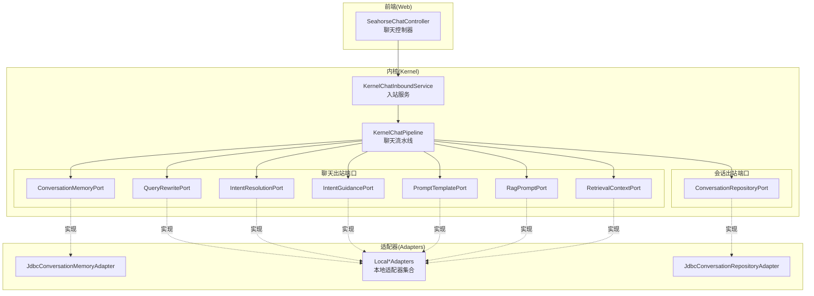

图表来源
- [KernelChatPipeline.java](file://seahorse-agent-kernel/src/main/java/com/miracle/ai/seahorse/agent/kernel/application/chat/KernelChatPipeline.java)
- [KernelChatInboundService.java](file://seahorse-agent-kernel/src/main/java/com/miracle/ai/seahorse/agent/kernel/application/chat/KernelChatInboundService.java)
- [ConversationMemoryPort.java](file://seahorse-agent-kernel/src/main/java/com/miracle/ai/seahorse/agent/ports/outbound/chat/ConversationMemoryPort.java)
- [QueryRewritePort.java](file://seahorse-agent-kernel/src/main/java/com/miracle/ai/seahorse/agent/ports/outbound/chat/QueryRewritePort.java)
- [IntentResolutionPort.java](file://seahorse-agent-kernel/src/main/java/com/miracle/ai/seahorse/agent/ports/outbound/chat/IntentResolutionPort.java)
- [IntentGuidancePort.java](file://seahorse-agent-kernel/src/main/java/com/miracle/ai/seahorse/agent/ports/outbound/chat/IntentGuidancePort.java)
- [PromptTemplatePort.java](file://seahorse-agent-kernel/src/main/java/com/miracle/ai/seahorse/agent/ports/outbound/chat/PromptTemplatePort.java)
- [RagPromptPort.java](file://seahorse-agent-kernel/src/main/java/com/miracle/ai/seahorse/agent/ports/outbound/chat/RagPromptPort.java)
- [RetrievalContextPort.java](file://seahorse-agent-kernel/src/main/java/com/miracle/ai/seahorse/agent/ports/outbound/chat/RetrievalContextPort.java)
- [ConversationRepositoryPort.java](file://seahorse-agent-kernel/src/main/java/com/miracle/ai/seahorse/agent/ports/outbound/conversation/ConversationRepositoryPort.java)
- [JdbcConversationMemoryAdapter.java](file://seahorse-agent-adapter-repository-jdbc/src/main/java/com/miracle/ai/seahorse/agent/adapters/repository/jdbc/JdbcConversationMemoryAdapter.java)
- [JdbcConversationRepositoryAdapter.java](file://seahorse-agent-adapter-repository-jdbc/src/main/java/com/miracle/ai/seahorse/agent/adapters/repository/jdbc/JdbcConversationRepositoryAdapter.java)
- [LocalIntentGuidanceAdapter.java](file://seahorse-agent-adapter-web/src/main/java/com/miracle/ai/seahorse/agent/adapters/local/LocalIntentGuidanceAdapter.java)
- [LocalIntentResolutionAdapter.java](file://seahorse-agent-adapter-web/src/main/java/com/miracle/ai/seahorse/agent/adapters/local/LocalIntentResolutionAdapter.java)
- [LocalQueryRewriteAdapter.java](file://seahorse-agent-adapter-web/src/main/java/com/miracle/ai/seahorse/agent/adapters/local/LocalQueryRewriteAdapter.java)
- [LocalRagPromptAdapter.java](file://seahorse-agent-adapter-web/src/main/java/com/miracle/ai/seahorse/agent/adapters/local/LocalRagPromptAdapter.java)
- [LocalRetrievalContextFormatAdapter.java](file://seahorse-agent-adapter-web/src/main/java/com/miracle/ai/seahorse/agent/adapters/local/LocalRetrievalContextFormatAdapter.java)
- [ClasspathPromptTemplateAdapter.java](file://seahorse-agent-adapter-web/src/main/java/com/miracle/ai/seahorse/agent/adapters/local/ClasspathPromptTemplateAdapter.java)

章节来源
- [KernelChatPipeline.java](file://seahorse-agent-kernel/src/main/java/com/miracle/ai/seahorse/agent/kernel/application/chat/KernelChatPipeline.java)
- [KernelChatInboundService.java](file://seahorse-agent-kernel/src/main/java/com/miracle/ai/seahorse/agent/kernel/application/chat/KernelChatInboundService.java)
- [SeahorseChatController.java](file://seahorse-agent-adapter-web/src/main/java/com/miracle/ai/seahorse/agent/adapters/web/SeahorseChatController.java)

## 核心组件
本节对每个聊天出站端口进行职责与接口要点说明，并给出典型实现参考位置。

- 会话记忆端口（ConversationMemoryPort）
  - 职责：加载历史并追加当前消息；可选的直接追加方法；空实现。
  - 关键方法：loadAndAppend、append（默认空实现）、noop 工厂方法。
  - 典型实现：JDBC 实现用于持久化与查询历史消息。
  - 章节来源
    - [ConversationMemoryPort.java:27-52](file://seahorse-agent-kernel/src/main/java/com/miracle/ai/seahorse/agent/ports/outbound/chat/ConversationMemoryPort.java#L27-L52)
    - [JdbcConversationMemoryAdapter.java](file://seahorse-agent-adapter-repository-jdbc/src/main/java/com/miracle/ai/seahorse/agent/adapters/repository/jdbc/JdbcConversationMemoryAdapter.java)

- 查询重写端口（QueryRewritePort）
  - 职责：结合会话历史对用户问题进行改写与拆分，输出改写结果。
  - 关键方法：rewriteWithSplit；passthrough 工厂方法用于直通实现。
  - 章节来源
    - [QueryRewritePort.java:28-45](file://seahorse-agent-kernel/src/main/java/com/miracle/ai/seahorse/agent/ports/outbound/chat/QueryRewritePort.java#L28-L45)

- 意图解析端口（IntentResolutionPort）
  - 职责：从改写结果解析子问题意图；判断系统交互意图；合并意图分组。
  - 关键方法：resolve、isSystemOnly、mergeIntentGroup；empty 工厂方法。
  - 章节来源
    - [IntentResolutionPort.java:30-74](file://seahorse-agent-kernel/src/main/java/com/miracle/ai/seahorse/agent/ports/outbound/chat/IntentResolutionPort.java#L30-L74)

- 歧义引导端口（IntentGuidancePort）
  - 职责：检测是否需要引导用户澄清歧义问题。
  - 关键方法：detectAmbiguity；none 工厂方法。
  - 章节来源
    - [IntentGuidancePort.java:28-42](file://seahorse-agent-kernel/src/main/java/com/miracle/ai/seahorse/agent/ports/outbound/chat/IntentGuidancePort.java#L28-L42)

- 提示模板端口（PromptTemplatePort）
  - 职责：按路径加载模板内容；empty 工厂方法。
  - 关键方法：load；empty 工厂方法。
  - 章节来源
    - [PromptTemplatePort.java:23-36](file://seahorse-agent-kernel/src/main/java/com/miracle/ai/seahorse/agent/ports/outbound/chat/PromptTemplatePort.java#L23-L36)
    - [ClasspathPromptTemplateAdapter.java](file://seahorse-agent-adapter-web/src/main/java/com/miracle/ai/seahorse/agent/adapters/local/ClasspathPromptTemplateAdapter.java)

- RAG 提示端口（RagPromptPort）
  - 职责：根据上下文、历史、问题与子问题列表构造模型消息。
  - 关键方法：buildStructuredMessages；simple 工厂方法。
  - 章节来源
    - [RagPromptPort.java:28-48](file://seahorse-agent-kernel/src/main/java/com/miracle/ai/seahorse/agent/ports/outbound/chat/RagPromptPort.java#L28-L48)
    - [LocalRagPromptAdapter.java](file://seahorse-agent-adapter-web/src/main/java/com/miracle/ai/seahorse/agent/adapters/local/LocalRagPromptAdapter.java)

- 检索上下文端口（RetrievalContextPort）
  - 职责：基于子意图检索并合并知识库与 MCP 的上下文。
  - 关键方法：retrieve。
  - 章节来源
    - [RetrievalContextPort.java:28-38](file://seahorse-agent-kernel/src/main/java/com/miracle/ai/seahorse/agent/ports/outbound/chat/RetrievalContextPort.java#L28-L38)
    - [LocalRetrievalContextFormatAdapter.java](file://seahorse-agent-adapter-web/src/main/java/com/miracle/ai/seahorse/agent/adapters/local/LocalRetrievalContextFormatAdapter.java)

- 会话仓库端口（ConversationRepositoryPort）
  - 职责：列出会话、重命名、删除、列出消息。
  - 关键方法：listConversations、rename、delete、listMessages。
  - 章节来源
    - [ConversationRepositoryPort.java:25-34](file://seahorse-agent-kernel/src/main/java/com/miracle/ai/seahorse/agent/ports/outbound/conversation/ConversationRepositoryPort.java#L25-L34)
    - [JdbcConversationRepositoryAdapter.java](file://seahorse-agent-adapter-repository-jdbc/src/main/java/com/miracle/ai/seahorse/agent/adapters/repository/jdbc/JdbcConversationRepositoryAdapter.java)

## 架构总览
下图展示了从 Web 控制器到内核聊天管线，再到各出站端口的调用链路与数据流：

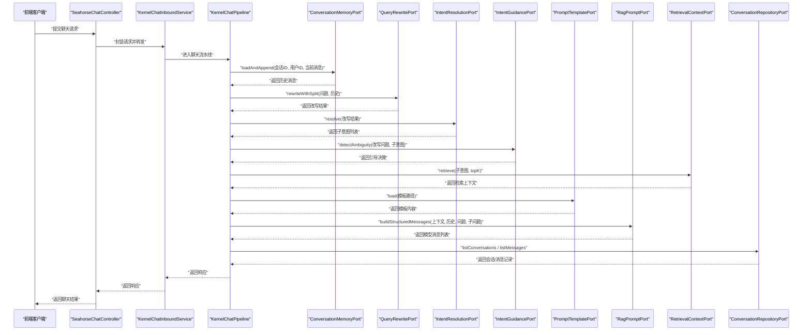

图表来源
- [SeahorseChatController.java](file://seahorse-agent-adapter-web/src/main/java/com/miracle/ai/seahorse/agent/adapters/web/SeahorseChatController.java)
- [KernelChatInboundService.java](file://seahorse-agent-kernel/src/main/java/com/miracle/ai/seahorse/agent/kernel/application/chat/KernelChatInboundService.java)
- [KernelChatPipeline.java](file://seahorse-agent-kernel/src/main/java/com/miracle/ai/seahorse/agent/kernel/application/chat/KernelChatPipeline.java)
- [ConversationMemoryPort.java](file://seahorse-agent-kernel/src/main/java/com/miracle/ai/seahorse/agent/ports/outbound/chat/ConversationMemoryPort.java)
- [QueryRewritePort.java](file://seahorse-agent-kernel/src/main/java/com/miracle/ai/seahorse/agent/ports/outbound/chat/QueryRewritePort.java)
- [IntentResolutionPort.java](file://seahorse-agent-kernel/src/main/java/com/miracle/ai/seahorse/agent/ports/outbound/chat/IntentResolutionPort.java)
- [IntentGuidancePort.java](file://seahorse-agent-kernel/src/main/java/com/miracle/ai/seahorse/agent/ports/outbound/chat/IntentGuidancePort.java)
- [PromptTemplatePort.java](file://seahorse-agent-kernel/src/main/java/com/miracle/ai/seahorse/agent/ports/outbound/chat/PromptTemplatePort.java)
- [RagPromptPort.java](file://seahorse-agent-kernel/src/main/java/com/miracle/ai/seahorse/agent/ports/outbound/chat/RagPromptPort.java)
- [RetrievalContextPort.java](file://seahorse-agent-kernel/src/main/java/com/miracle/ai/seahorse/agent/ports/outbound/chat/RetrievalContextPort.java)
- [ConversationRepositoryPort.java](file://seahorse-agent-kernel/src/main/java/com/miracle/ai/seahorse/agent/ports/outbound/conversation/ConversationRepositoryPort.java)

## 详细组件分析

### 会话记忆端口（ConversationMemoryPort）
- 设计要点
  - 以会话维度管理历史消息，支持“加载历史并追加当前消息”的原子操作，确保上下文一致性。
  - 提供默认空实现，便于在不需要持久化的场景快速运行。
- 数据结构与复杂度
  - 历史消息列表通常为 O(n) 追加与查询；具体复杂度取决于底层存储实现。
- 错误处理
  - 在空实现中返回空列表；实际实现需处理并发写入与事务一致性。
- 性能建议
  - 使用分页或游标式加载历史，避免一次性加载过长历史导致延迟。
- 代码片段路径
  - [ConversationMemoryPort.loadAndAppend:37-37](file://seahorse-agent-kernel/src/main/java/com/miracle/ai/seahorse/agent/ports/outbound/chat/ConversationMemoryPort.java#L37-L37)
  - [ConversationMemoryPort.append 默认实现:46-47](file://seahorse-agent-kernel/src/main/java/com/miracle/ai/seahorse/agent/ports/outbound/chat/ConversationMemoryPort.java#L46-L47)
  - [JDBC 适配器实现](file://seahorse-agent-adapter-repository-jdbc/src/main/java/com/miracle/ai/seahorse/agent/adapters/repository/jdbc/JdbcConversationMemoryAdapter.java)

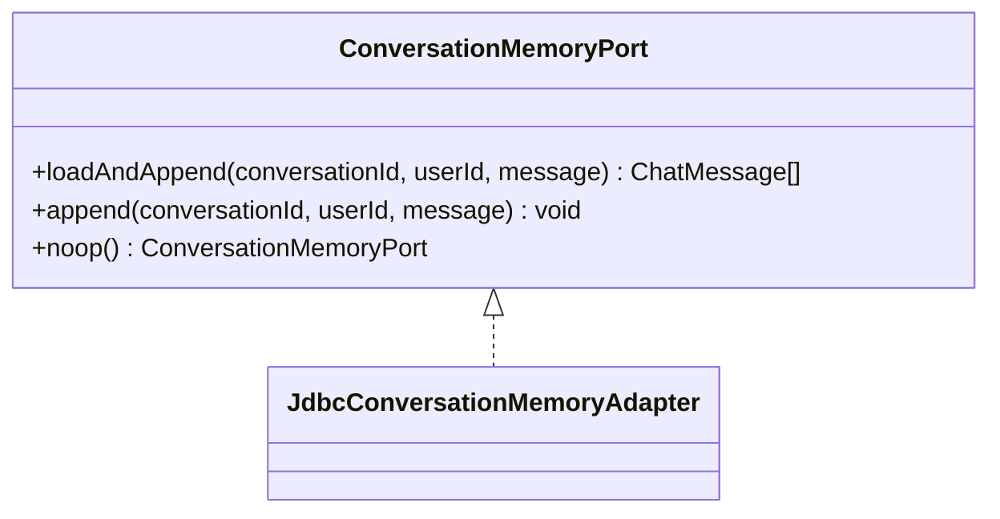

图表来源
- [ConversationMemoryPort.java:27-52](file://seahorse-agent-kernel/src/main/java/com/miracle/ai/seahorse/agent/ports/outbound/chat/ConversationMemoryPort.java#L27-L52)
- [JdbcConversationMemoryAdapter.java](file://seahorse-agent-adapter-repository-jdbc/src/main/java/com/miracle/ai/seahorse/agent/adapters/repository/jdbc/JdbcConversationMemoryAdapter.java)

章节来源
- [ConversationMemoryPort.java:27-52](file://seahorse-agent-kernel/src/main/java/com/miracle/ai/seahorse/agent/ports/outbound/chat/ConversationMemoryPort.java#L27-L52)
- [JdbcConversationMemoryAdapter.java](file://seahorse-agent-adapter-repository-jdbc/src/main/java/com/miracle/ai/seahorse/agent/adapters/repository/jdbc/JdbcConversationMemoryAdapter.java)

### 查询重写端口（QueryRewritePort）
- 设计要点
  - 将用户问题与历史上下文融合，生成更清晰、可检索的改写结果，并可拆分为多个子问题。
  - 提供 passthrough 实现，便于绕过重写逻辑进行快速验证。
- 数据结构与复杂度
  - 输入为字符串与消息列表；输出为改写结果对象，包含改写后的主问题与子问题列表。
- 错误处理
  - 空输入时使用安全默认值，避免空指针。
- 性能建议
  - 重写过程可引入缓存命中策略，减少重复计算。
- 代码片段路径
  - [QueryRewritePort.rewriteWithSplit:37-37](file://seahorse-agent-kernel/src/main/java/com/miracle/ai/seahorse/agent/ports/outbound/chat/QueryRewritePort.java#L37-L37)
  - [QueryRewritePort.passthrough:39-44](file://seahorse-agent-kernel/src/main/java/com/miracle/ai/seahorse/agent/ports/outbound/chat/QueryRewritePort.java#L39-L44)
  - [LocalQueryRewriteAdapter 实现](file://seahorse-agent-adapter-web/src/main/java/com/miracle/ai/seahorse/agent/adapters/local/LocalQueryRewriteAdapter.java)

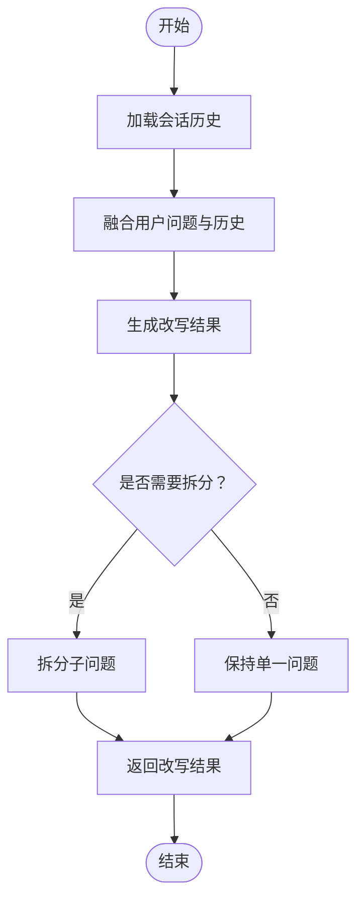

图表来源
- [QueryRewritePort.java:28-45](file://seahorse-agent-kernel/src/main/java/com/miracle/ai/seahorse/agent/ports/outbound/chat/QueryRewritePort.java#L28-L45)

章节来源
- [QueryRewritePort.java:28-45](file://seahorse-agent-kernel/src/main/java/com/miracle/ai/seahorse/agent/ports/outbound/chat/QueryRewritePort.java#L28-L45)
- [LocalQueryRewriteAdapter.java](file://seahorse-agent-adapter-web/src/main/java/com/miracle/ai/seahorse/agent/adapters/local/LocalQueryRewriteAdapter.java)

### 意图解析端口（IntentResolutionPort）
- 设计要点
  - 将改写结果映射为子问题意图列表；支持判断是否仅系统交互；合并意图分组。
  - 提供 empty 实现，便于在无意图识别能力时降级。
- 数据结构与复杂度
  - 输入为改写结果；输出为子意图列表与意图分组对象。
- 错误处理
  - 空输入或空列表时返回空结果或默认分组。
- 性能建议
  - 意图识别可采用向量化检索与阈值过滤，减少无效分支。
- 代码片段路径
  - [IntentResolutionPort.resolve:38-38](file://seahorse-agent-kernel/src/main/java/com/miracle/ai/seahorse/agent/ports/outbound/chat/IntentResolutionPort.java#L38-L38)
  - [IntentResolutionPort.isSystemOnly:46-46](file://seahorse-agent-kernel/src/main/java/com/miracle/ai/seahorse/agent/ports/outbound/chat/IntentResolutionPort.java#L46-L46)
  - [IntentResolutionPort.mergeIntentGroup:54-54](file://seahorse-agent-kernel/src/main/java/com/miracle/ai/seahorse/agent/ports/outbound/chat/IntentResolutionPort.java#L54-L54)
  - [LocalIntentResolutionAdapter 实现](file://seahorse-agent-adapter-web/src/main/java/com/miracle/ai/seahorse/agent/adapters/local/LocalIntentResolutionAdapter.java)

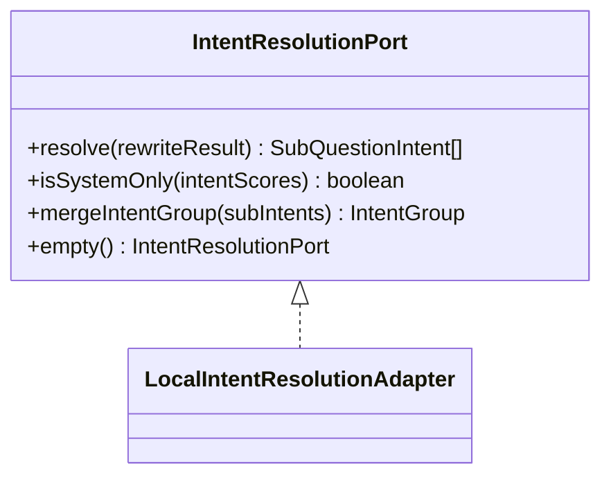

图表来源
- [IntentResolutionPort.java:30-74](file://seahorse-agent-kernel/src/main/java/com/miracle/ai/seahorse/agent/ports/outbound/chat/IntentResolutionPort.java#L30-L74)
- [LocalIntentResolutionAdapter.java](file://seahorse-agent-adapter-web/src/main/java/com/miracle/ai/seahorse/agent/adapters/local/LocalIntentResolutionAdapter.java)

章节来源
- [IntentResolutionPort.java:30-74](file://seahorse-agent-kernel/src/main/java/com/miracle/ai/seahorse/agent/ports/outbound/chat/IntentResolutionPort.java#L30-L74)
- [LocalIntentResolutionAdapter.java](file://seahorse-agent-adapter-web/src/main/java/com/miracle/ai/seahorse/agent/adapters/local/LocalIntentResolutionAdapter.java)

### 歧义引导端口（IntentGuidancePort）
- 设计要点
  - 针对存在歧义的子意图，决定是否需要向用户发起澄清引导。
  - 提供 none 实现，表示不进行歧义处理。
- 数据结构与复杂度
  - 输入为改写问题与子意图列表；输出为引导决策对象。
- 错误处理
  - 无歧义时返回“无需引导”。
- 性能建议
  - 引导触发条件可配置阈值，避免过度引导。
- 代码片段路径
  - [IntentGuidancePort.detectAmbiguity:37-37](file://seahorse-agent-kernel/src/main/java/com/miracle/ai/seahorse/agent/ports/outbound/chat/IntentGuidancePort.java#L37-L37)
  - [LocalIntentGuidanceAdapter 实现](file://seahorse-agent-adapter-web/src/main/java/com/miracle/ai/seahorse/agent/adapters/local/LocalIntentGuidanceAdapter.java)

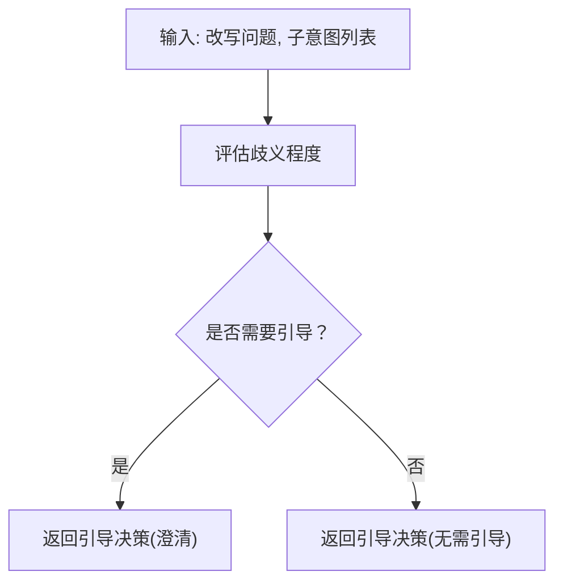

图表来源
- [IntentGuidancePort.java:28-42](file://seahorse-agent-kernel/src/main/java/com/miracle/ai/seahorse/agent/ports/outbound/chat/IntentGuidancePort.java#L28-L42)

章节来源
- [IntentGuidancePort.java:28-42](file://seahorse-agent-kernel/src/main/java/com/miracle/ai/seahorse/agent/ports/outbound/chat/IntentGuidancePort.java#L28-L42)
- [LocalIntentGuidanceAdapter.java](file://seahorse-agent-adapter-web/src/main/java/com/miracle/ai/seahorse/agent/adapters/local/LocalIntentGuidanceAdapter.java)

### 提示模板端口（PromptTemplatePort）
- 设计要点
  - 通过路径加载模板内容，便于统一管理提示词模板。
  - 提供 empty 实现，便于在无模板场景下运行。
- 数据结构与复杂度
  - 输入为模板路径；输出为模板文本。
- 错误处理
  - 未找到模板时返回空字符串或抛出异常（由具体实现决定）。
- 性能建议
  - 模板内容可缓存，减少 IO 开销。
- 代码片段路径
  - [PromptTemplatePort.load:31-31](file://seahorse-agent-kernel/src/main/java/com/miracle/ai/seahorse/agent/ports/outbound/chat/PromptTemplatePort.java#L31-L31)
  - [ClasspathPromptTemplateAdapter 实现](file://seahorse-agent-adapter-web/src/main/java/com/miracle/ai/seahorse/agent/adapters/local/ClasspathPromptTemplateAdapter.java)

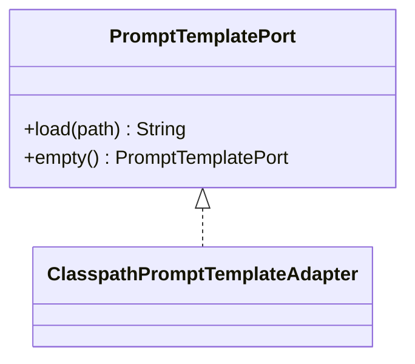

图表来源
- [PromptTemplatePort.java:23-36](file://seahorse-agent-kernel/src/main/java/com/miracle/ai/seahorse/agent/ports/outbound/chat/PromptTemplatePort.java#L23-L36)
- [ClasspathPromptTemplateAdapter.java](file://seahorse-agent-adapter-web/src/main/java/com/miracle/ai/seahorse/agent/adapters/local/ClasspathPromptTemplateAdapter.java)

章节来源
- [PromptTemplatePort.java:23-36](file://seahorse-agent-kernel/src/main/java/com/miracle/ai/seahorse/agent/ports/outbound/chat/PromptTemplatePort.java#L23-L36)
- [ClasspathPromptTemplateAdapter.java](file://seahorse-agent-adapter-web/src/main/java/com/miracle/ai/seahorse/agent/adapters/local/ClasspathPromptTemplateAdapter.java)

### RAG 提示端口（RagPromptPort）
- 设计要点
  - 将上下文、历史、问题与子问题整合为模型可消费的消息列表。
  - 提供 simple 实现，便于快速验证提示构造流程。
- 数据结构与复杂度
  - 输入为上下文、历史、问题与子问题列表；输出为消息列表。
- 错误处理
  - 空输入时使用安全默认值。
- 性能建议
  - 可对消息进行长度截断与去重，控制上下文窗口大小。
- 代码片段路径
  - [RagPromptPort.buildStructuredMessages:39-42](file://seahorse-agent-kernel/src/main/java/com/miracle/ai/seahorse/agent/ports/outbound/chat/RagPromptPort.java#L39-L42)
  - [LocalRagPromptAdapter 实现](file://seahorse-agent-adapter-web/src/main/java/com/miracle/ai/seahorse/agent/adapters/local/LocalRagPromptAdapter.java)

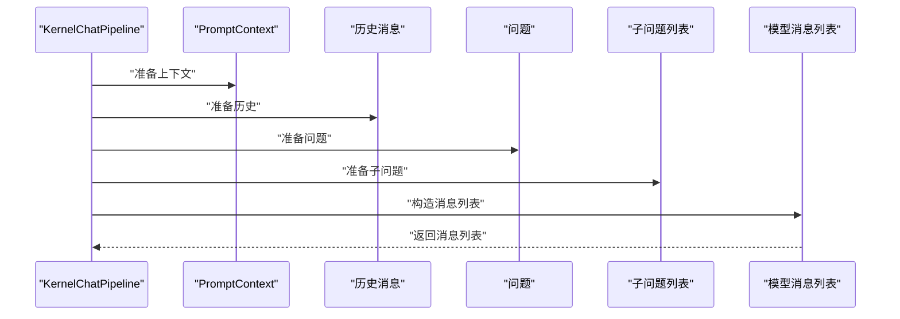

图表来源
- [RagPromptPort.java:28-48](file://seahorse-agent-kernel/src/main/java/com/miracle/ai/seahorse/agent/ports/outbound/chat/RagPromptPort.java#L28-L48)

章节来源
- [RagPromptPort.java:28-48](file://seahorse-agent-kernel/src/main/java/com/miracle/ai/seahorse/agent/ports/outbound/chat/RagPromptPort.java#L28-L48)
- [LocalRagPromptAdapter.java](file://seahorse-agent-adapter-web/src/main/java/com/miracle/ai/seahorse/agent/adapters/local/LocalRagPromptAdapter.java)

### 检索上下文端口（RetrievalContextPort）
- 设计要点
  - 基于子意图检索知识库与 MCP 上下文，并进行合并。
  - 支持 topK 参数控制返回数量。
- 数据结构与复杂度
  - 输入为子意图列表与 topK；输出为检索上下文对象。
- 错误处理
  - 无匹配结果时返回空上下文或部分上下文。
- 性能建议
  - 检索阶段可并行执行多个子意图，缩短等待时间。
- 代码片段路径
  - [RetrievalContextPort.retrieve:37-37](file://seahorse-agent-kernel/src/main/java/com/miracle/ai/seahorse/agent/ports/outbound/chat/RetrievalContextPort.java#L37-L37)
  - [LocalRetrievalContextFormatAdapter 实现](file://seahorse-agent-adapter-web/src/main/java/com/miracle/ai/seahorse/agent/adapters/local/LocalRetrievalContextFormatAdapter.java)

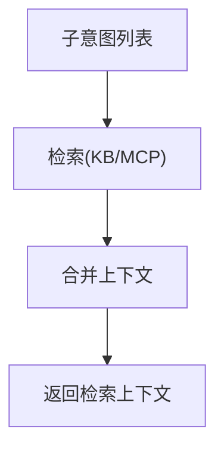

图表来源
- [RetrievalContextPort.java:28-38](file://seahorse-agent-kernel/src/main/java/com/miracle/ai/seahorse/agent/ports/outbound/chat/RetrievalContextPort.java#L28-L38)

章节来源
- [RetrievalContextPort.java:28-38](file://seahorse-agent-kernel/src/main/java/com/miracle/ai/seahorse/agent/ports/outbound/chat/RetrievalContextPort.java#L28-L38)
- [LocalRetrievalContextFormatAdapter.java](file://seahorse-agent-adapter-web/src/main/java/com/miracle/ai/seahorse/agent/adapters/local/LocalRetrievalContextFormatAdapter.java)

### 会话仓库端口（ConversationRepositoryPort）
- 设计要点
  - 提供会话与消息的 CRUD 查询能力，支撑前端会话列表与消息展示。
- 数据结构与复杂度
  - 列表查询通常为 O(n)；分页可降低复杂度。
- 错误处理
  - 权限校验失败时返回空或抛出异常（由具体实现决定）。
- 性能建议
  - 对常用查询建立索引，优化分页查询性能。
- 代码片段路径
  - [ConversationRepositoryPort.listConversations:27-27](file://seahorse-agent-kernel/src/main/java/com/miracle/ai/seahorse/agent/ports/outbound/conversation/ConversationRepositoryPort.java#L27-L27)
  - [ConversationRepositoryPort.rename:29-29](file://seahorse-agent-kernel/src/main/java/com/miracle/ai/seahorse/agent/ports/outbound/conversation/ConversationRepositoryPort.java#L29-L29)
  - [ConversationRepositoryPort.delete:31-31](file://seahorse-agent-kernel/src/main/java/com/miracle/ai/seahorse/agent/ports/outbound/conversation/ConversationRepositoryPort.java#L31-L31)
  - [ConversationRepositoryPort.listMessages:33-33](file://seahorse-agent-kernel/src/main/java/com/miracle/ai/seahorse/agent/ports/outbound/conversation/ConversationRepositoryPort.java#L33-L33)
  - [JdbcConversationRepositoryAdapter 实现](file://seahorse-agent-adapter-repository-jdbc/src/main/java/com/miracle/ai/seahorse/agent/adapters/repository/jdbc/JdbcConversationRepositoryAdapter.java)

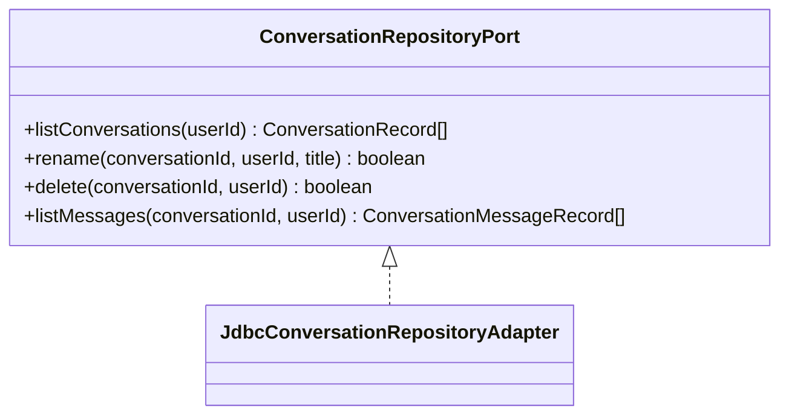

图表来源
- [ConversationRepositoryPort.java:25-34](file://seahorse-agent-kernel/src/main/java/com/miracle/ai/seahorse/agent/ports/outbound/conversation/ConversationRepositoryPort.java#L25-L34)
- [JdbcConversationRepositoryAdapter.java](file://seahorse-agent-adapter-repository-jdbc/src/main/java/com/miracle/ai/seahorse/agent/adapters/repository/jdbc/JdbcConversationRepositoryAdapter.java)

章节来源
- [ConversationRepositoryPort.java:25-34](file://seahorse-agent-kernel/src/main/java/com/miracle/ai/seahorse/agent/ports/outbound/conversation/ConversationRepositoryPort.java#L25-L34)
- [JdbcConversationRepositoryAdapter.java](file://seahorse-agent-adapter-repository-jdbc/src/main/java/com/miracle/ai/seahorse/agent/adapters/repository/jdbc/JdbcConversationRepositoryAdapter.java)

## 依赖关系分析
- 端口与实现的耦合
  - 所有出站端口均定义在 kernel 中，实现分散在各 adapter 模块，遵循“接口在内核、实现在外围”的整洁架构原则。
- 内核编排
  - KernelChatPipeline 作为编排者，依次调用各端口完成完整的聊天处理链路。
- 数据模型依赖
  - 各端口广泛使用 ChatMessage、RewriteResult、PromptContext、SubQuestionIntent、IntentScore、IntentGroup、RetrievalContext 等领域模型。

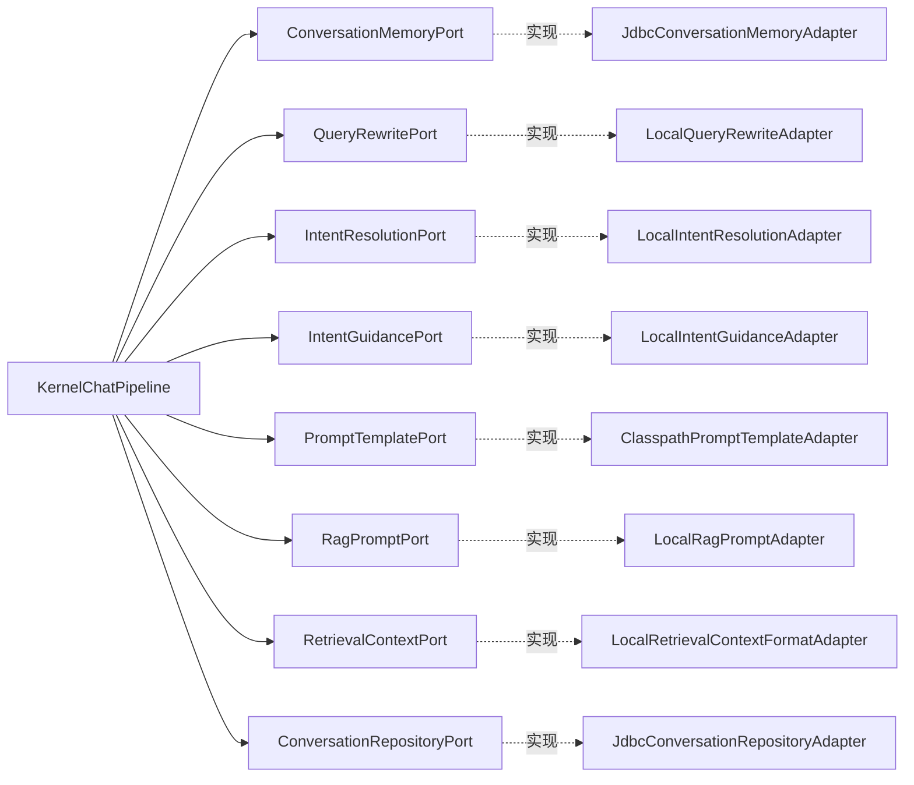

图表来源
- [KernelChatPipeline.java](file://seahorse-agent-kernel/src/main/java/com/miracle/ai/seahorse/agent/kernel/application/chat/KernelChatPipeline.java)
- [ConversationMemoryPort.java](file://seahorse-agent-kernel/src/main/java/com/miracle/ai/seahorse/agent/ports/outbound/chat/ConversationMemoryPort.java)
- [QueryRewritePort.java](file://seahorse-agent-kernel/src/main/java/com/miracle/ai/seahorse/agent/ports/outbound/chat/QueryRewritePort.java)
- [IntentResolutionPort.java](file://seahorse-agent-kernel/src/main/java/com/miracle/ai/seahorse/agent/ports/outbound/chat/IntentResolutionPort.java)
- [IntentGuidancePort.java](file://seahorse-agent-kernel/src/main/java/com/miracle/ai/seahorse/agent/ports/outbound/chat/IntentGuidancePort.java)
- [PromptTemplatePort.java](file://seahorse-agent-kernel/src/main/java/com/miracle/ai/seahorse/agent/ports/outbound/chat/PromptTemplatePort.java)
- [RagPromptPort.java](file://seahorse-agent-kernel/src/main/java/com/miracle/ai/seahorse/agent/ports/outbound/chat/RagPromptPort.java)
- [RetrievalContextPort.java](file://seahorse-agent-kernel/src/main/java/com/miracle/ai/seahorse/agent/ports/outbound/chat/RetrievalContextPort.java)
- [ConversationRepositoryPort.java](file://seahorse-agent-kernel/src/main/java/com/miracle/ai/seahorse/agent/ports/outbound/conversation/ConversationRepositoryPort.java)
- [JdbcConversationMemoryAdapter.java](file://seahorse-agent-adapter-repository-jdbc/src/main/java/com/miracle/ai/seahorse/agent/adapters/repository/jdbc/JdbcConversationMemoryAdapter.java)
- [JdbcConversationRepositoryAdapter.java](file://seahorse-agent-adapter-repository-jdbc/src/main/java/com/miracle/ai/seahorse/agent/adapters/repository/jdbc/JdbcConversationRepositoryAdapter.java)
- [LocalIntentResolutionAdapter.java](file://seahorse-agent-adapter-web/src/main/java/com/miracle/ai/seahorse/agent/adapters/local/LocalIntentResolutionAdapter.java)
- [LocalIntentGuidanceAdapter.java](file://seahorse-agent-adapter-web/src/main/java/com/miracle/ai/seahorse/agent/adapters/local/LocalIntentGuidanceAdapter.java)
- [LocalQueryRewriteAdapter.java](file://seahorse-agent-adapter-web/src/main/java/com/miracle/ai/seahorse/agent/adapters/local/LocalQueryRewriteAdapter.java)
- [LocalRagPromptAdapter.java](file://seahorse-agent-adapter-web/src/main/java/com/miracle/ai/seahorse/agent/adapters/local/LocalRagPromptAdapter.java)
- [LocalRetrievalContextFormatAdapter.java](file://seahorse-agent-adapter-web/src/main/java/com/miracle/ai/seahorse/agent/adapters/local/LocalRetrievalContextFormatAdapter.java)
- [ClasspathPromptTemplateAdapter.java](file://seahorse-agent-adapter-web/src/main/java/com/miracle/ai/seahorse/agent/adapters/local/ClasspathPromptTemplateAdapter.java)

章节来源
- [KernelChatPipeline.java](file://seahorse-agent-kernel/src/main/java/com/miracle/ai/seahorse/agent/kernel/application/chat/KernelChatPipeline.java)
- [KernelChatInboundService.java](file://seahorse-agent-kernel/src/main/java/com/miracle/ai/seahorse/agent/kernel/application/chat/KernelChatInboundService.java)

## 性能考虑
- 缓存策略
  - 会话历史、模板内容、检索结果可引入缓存，减少重复 IO 与计算。
- 并行化
  - 意图解析与检索上下文可并行执行，缩短端到端延迟。
- 分页与截断
  - 历史消息与检索上下文应设置上限，避免上下文窗口过大影响性能。
- 适配器选择
  - 根据部署环境选择合适的存储与检索实现（如 JDBC、Redis、向量数据库）。

## 故障排查指南
- 会话记忆为空
  - 检查 ConversationMemoryPort 的实现是否正确加载历史；确认会话 ID 与用户 ID 一致。
  - 参考路径：[ConversationMemoryPort.loadAndAppend:37-37](file://seahorse-agent-kernel/src/main/java/com/miracle/ai/seahorse/agent/ports/outbound/chat/ConversationMemoryPort.java#L37-L37)
- 意图解析为空
  - 检查 QueryRewritePort 是否正确生成改写结果；确认 IntentResolutionPort 的 empty 实现未被误用。
  - 参考路径：[IntentResolutionPort.resolve:38-38](file://seahorse-agent-kernel/src/main/java/com/miracle/ai/seahorse/agent/ports/outbound/chat/IntentResolutionPort.java#L38-L38)
- 提示构造异常
  - 检查 PromptTemplatePort 的模板路径是否存在；确认 RagPromptPort 的消息构造逻辑。
  - 参考路径：[PromptTemplatePort.load:31-31](file://seahorse-agent-kernel/src/main/java/com/miracle/ai/seahorse/agent/ports/outbound/chat/PromptTemplatePort.java#L31-L31)
- 检索上下文缺失
  - 检查 RetrievalContextPort 的检索实现与 topK 设置；确认子意图映射正确。
  - 参考路径：[RetrievalContextPort.retrieve:37-37](file://seahorse-agent-kernel/src/main/java/com/miracle/ai/seahorse/agent/ports/outbound/chat/RetrievalContextPort.java#L37-L37)
- 会话列表为空
  - 检查 ConversationRepositoryPort 的权限与查询条件；确认 JDBC 适配器连接正常。
  - 参考路径：[ConversationRepositoryPort.listConversations:27-27](file://seahorse-agent-kernel/src/main/java/com/miracle/ai/seahorse/agent/ports/outbound/conversation/ConversationRepositoryPort.java#L27-L27)

章节来源
- [ConversationMemoryPort.java:27-52](file://seahorse-agent-kernel/src/main/java/com/miracle/ai/seahorse/agent/ports/outbound/chat/ConversationMemoryPort.java#L27-L52)
- [IntentResolutionPort.java:30-74](file://seahorse-agent-kernel/src/main/java/com/miracle/ai/seahorse/agent/ports/outbound/chat/IntentResolutionPort.java#L30-L74)
- [PromptTemplatePort.java:23-36](file://seahorse-agent-kernel/src/main/java/com/miracle/ai/seahorse/agent/ports/outbound/chat/PromptTemplatePort.java#L23-L36)
- [RetrievalContextPort.java:28-38](file://seahorse-agent-kernel/src/main/java/com/miracle/ai/seahorse/agent/ports/outbound/chat/RetrievalContextPort.java#L28-L38)
- [ConversationRepositoryPort.java:25-34](file://seahorse-agent-kernel/src/main/java/com/miracle/ai/seahorse/agent/ports/outbound/conversation/ConversationRepositoryPort.java#L25-L34)

## 结论
通过将聊天与对话的关键能力抽象为一组清晰的出站端口，系统实现了高内聚、低耦合的架构设计。内核负责编排，适配器负责实现，既保证了灵活性，又便于测试与替换。围绕多轮对话管理、意图识别、提示工程与检索增强生成的完整链路得以稳定落地，为构建智能对话系统提供了坚实基础。

## 附录
- 关键领域模型
  - [ChatMessage](file://seahorse-agent-kernel/src/main/java/com/miracle/ai/seahorse/agent/kernel/domain/chat/ChatMessage.java)
  - [RewriteResult](file://seahorse-agent-kernel/src/main/java/com/miracle/ai/seahorse/agent/kernel/domain/chat/RewriteResult.java)
  - [GuidanceDecision](file://seahorse-agent-kernel/src/main/java/com/miracle/ai/seahorse/agent/kernel/domain/chat/GuidanceDecision.java)
  - [PromptContext](file://seahorse-agent-kernel/src/main/java/com/miracle/ai/seahorse/agent/kernel/domain/chat/PromptContext.java)
  - [SubQuestionIntent](file://seahorse-agent-kernel/src/main/java/com/miracle/ai/seahorse/agent/kernel/domain/intent/SubQuestionIntent.java)
  - [IntentScore](file://seahorse-agent-kernel/src/main/java/com/miracle/ai/seahorse/agent/kernel/domain/intent/IntentScore.java)
  - [IntentGroup](file://seahorse-agent-kernel/src/main/java/com/miracle/ai/seahorse/agent/kernel/domain/intent/IntentGroup.java)
  - [RetrievalContext](file://seahorse-agent-kernel/src/main/java/com/miracle/ai/seahorse/agent/kernel/domain/retrieval/RetrievalContext.java)