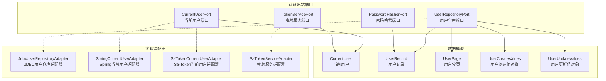
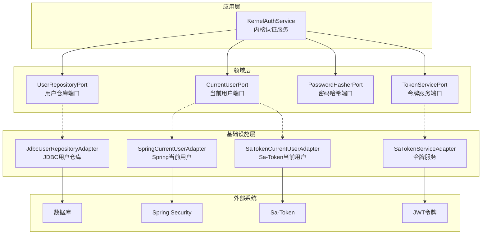
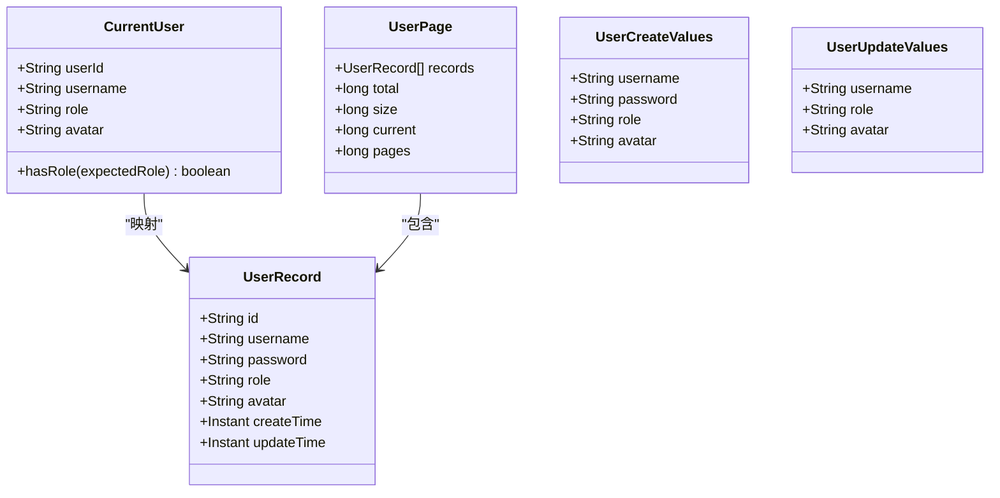
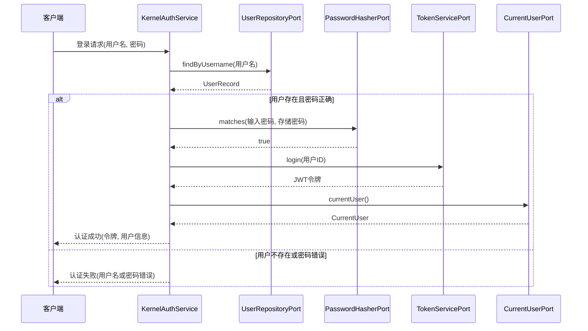
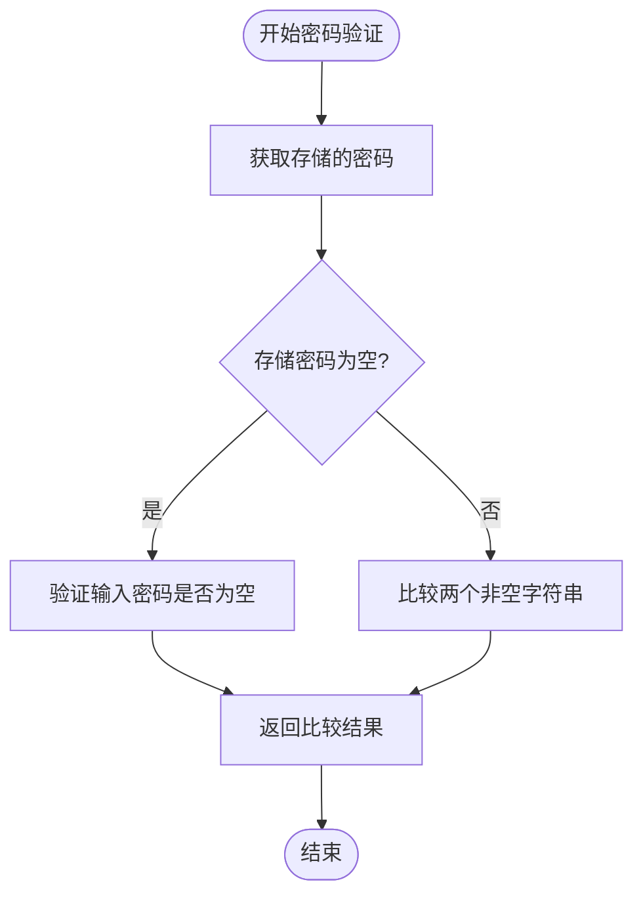
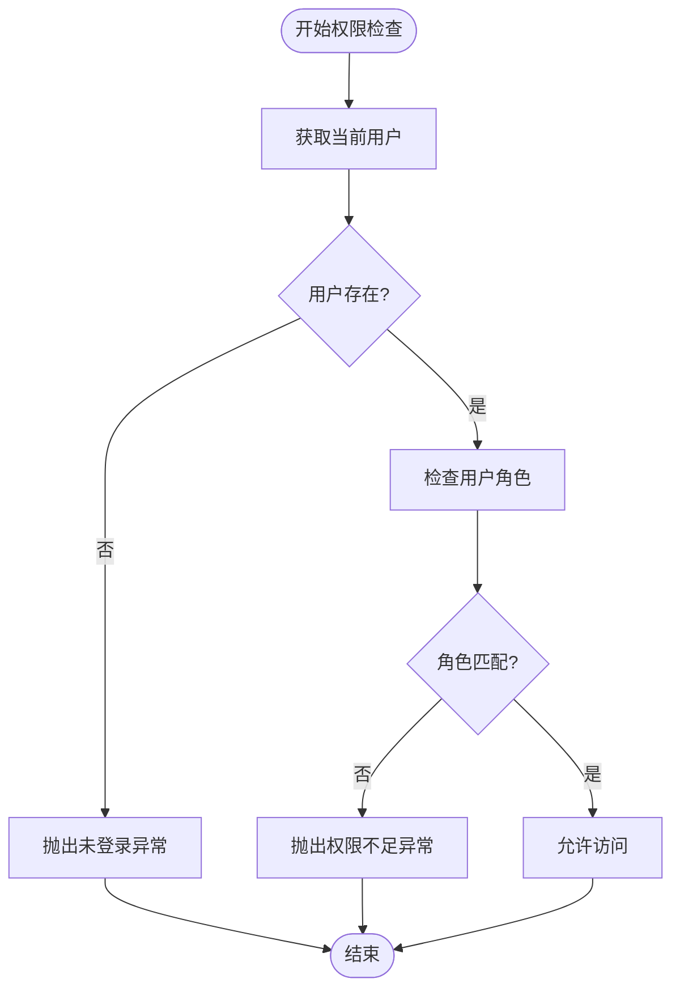
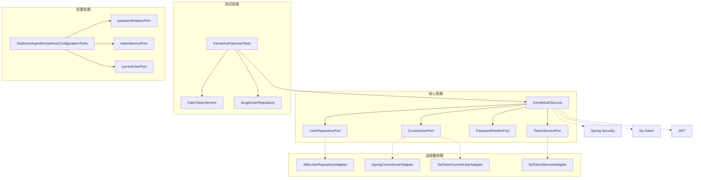

# 认证出站端口

<cite>
**本文档引用的文件**
- [CurrentUserPort.java](file://seahorse-agent-kernel/src/main/java/com/miracle/ai/seahorse/agent/ports/outbound/auth/CurrentUserPort.java)
- [UserRepositoryPort.java](file://seahorse-agent-kernel/src/main/java/com/miracle/ai/seahorse/agent/ports/outbound/auth/UserRepositoryPort.java)
- [PasswordHasherPort.java](file://seahorse-agent-kernel/src/main/java/com/miracle/ai/seahorse/agent/ports/outbound/auth/PasswordHasherPort.java)
- [TokenServicePort.java](file://seahorse-agent-kernel/src/main/java/com/miracle/ai/seahorse/agent/ports/outbound/auth/TokenServicePort.java)
- [CurrentUser.java](file://seahorse-agent-kernel/src/main/java/com/miracle/ai/seahorse/agent/ports/outbound/auth/CurrentUser.java)
- [UserRecord.java](file://seahorse-agent-kernel/src/main/java/com/miracle/ai/seahorse/agent/ports/outbound/auth/UserRecord.java)
- [UserPage.java](file://seahorse-agent-kernel/src/main/java/com/miracle/ai/seahorse/agent/ports/outbound/auth/UserPage.java)
- [UserCreateValues.java](file://seahorse-agent-kernel/src/main/java/com/miracle/ai/seahorse/agent/ports/outbound/auth/UserCreateValues.java)
- [UserUpdateValues.java](file://seahorse-agent-kernel/src/main/java/com/miracle/ai/seahorse/agent/ports/outbound/auth/UserUpdateValues.java)
- [KernelAuthService.java](file://seahorse-agent-kernel/src/main/java/com/miracle/ai/seahorse/agent/kernel/application/auth/KernelAuthService.java)
- [KernelAuthServiceTests.java](file://seahorse-agent-tests/src/test/java/com/miracle/ai/seahorse/agent/kernel/application/auth/KernelAuthServiceTests.java)
- [SeahorseAgentKernelAutoConfigurationTests.java](file://seahorse-agent-tests/src/test/java/com/miracle/ai/seahorse/agent/adapters/spring/SeahorseAgentKernelAutoConfigurationTests.java)
- [JdbcUserRepositoryAdapter.java](file://seahorse-agent-adapter-repository-jdbc/src/main/java/com/miracle/ai/seahorse/agent/adapters/repository/jdbc/JdbcUserRepositoryAdapter.java)
- [SpringCurrentUserAdapter.java](file://seahorse-agent-adapter-web/src/main/java/com/miracle/ai/seahorse/agent/adapters/web/SpringCurrentUserAdapter.java)
- [SaTokenCurrentUserAdapter.java](file://seahorse-agent-adapter-web/src/main/java/com/miracle/ai/seahorse/agent/adapters/web/SaTokenCurrentUserAdapter.java)
- [SeahorseSaTokenStpInterface.java](file://seahorse-agent-adapter-web/src/main/java/com/miracle/ai/seahorse/agent/adapters/web/SeahorseSaTokenStpInterface.java)
- [SaTokenServiceAdapter.java](file://seahorse-agent-adapter-web/src/main/java/com/miracle/ai/seahorse/agent/adapters/web/SaTokenServiceAdapter.java)
</cite>

## 目录
1. [简介](#简介)
2. [项目结构](#项目结构)
3. [核心组件](#核心组件)
4. [架构概览](#架构概览)
5. [详细组件分析](#详细组件分析)
6. [依赖关系分析](#依赖关系分析)
7. [性能考虑](#性能考虑)
8. [故障排除指南](#故障排除指南)
9. [结论](#结论)

## 简介

本文件详细介绍认证相关的出站端口设计，涵盖当前用户端口(CurrentUserPort)、用户仓库端口(UserRepositoryPort)、密码哈希端口(PasswordHasherPort)、令牌服务端口(TokenServicePort)等核心组件。这些端口构成了系统认证体系的基础设施层，为用户身份验证、密码加密存储、JWT令牌生成和验证、用户信息查询和更新等功能提供标准化接口。

认证出站端口采用整洁架构设计，通过接口抽象与具体实现分离，实现了业务逻辑与外部系统的解耦。每个端口都有明确的职责边界和清晰的契约定义，支持多种适配器实现以满足不同部署环境的需求。

## 项目结构

认证出站端口位于seahorse-agent-kernel模块的ports.outbound.auth包中，包含以下核心文件：

**图表来源**
- [CurrentUserPort.java:1-37](file://seahorse-agent-kernel/src/main/java/com/miracle/ai/seahorse/agent/ports/outbound/auth/CurrentUserPort.java#L1-L37)
- [UserRepositoryPort.java:1-38](file://seahorse-agent-kernel/src/main/java/com/miracle/ai/seahorse/agent/ports/outbound/auth/UserRepositoryPort.java#L1-L38)
- [PasswordHasherPort.java:1-40](file://seahorse-agent-kernel/src/main/java/com/miracle/ai/seahorse/agent/ports/outbound/auth/PasswordHasherPort.java#L1-L40)
- [TokenServicePort.java:1-26](file://seahorse-agent-kernel/src/main/java/com/miracle/ai/seahorse/agent/ports/outbound/auth/TokenServicePort.java#L1-L26)

**章节来源**
- [CurrentUserPort.java:1-37](file://seahorse-agent-kernel/src/main/java/com/miracle/ai/seahorse/agent/ports/outbound/auth/CurrentUserPort.java#L1-L37)
- [UserRepositoryPort.java:1-38](file://seahorse-agent-kernel/src/main/java/com/miracle/ai/seahorse/agent/ports/outbound/auth/UserRepositoryPort.java#L1-L38)
- [PasswordHasherPort.java:1-40](file://seahorse-agent-kernel/src/main/java/com/miracle/ai/seahorse/agent/ports/outbound/auth/PasswordHasherPort.java#L1-L40)
- [TokenServicePort.java:1-26](file://seahorse-agent-kernel/src/main/java/com/miracle/ai/seahorse/agent/ports/outbound/auth/TokenServicePort.java#L1-L26)

## 核心组件

### CurrentUserPort 当前用户端口

CurrentUserPort是认证系统的核心入口端口，负责提供当前登录用户的信息。该接口提供了三种主要能力：

1. **currentUser()**: 返回当前用户的可选包装，如果用户未登录则返回空
2. **requireCurrentUser()**: 强制获取当前用户，如果不存在则抛出状态异常
3. **requireRole()**: 验证用户是否具有指定角色，否则抛出权限不足异常

该端口的设计体现了防御性编程原则，通过Optional类型避免null值传播，并提供清晰的错误语义。

**章节来源**
- [CurrentUserPort.java:22-36](file://seahorse-agent-kernel/src/main/java/com/miracle/ai/seahorse/agent/ports/outbound/auth/CurrentUserPort.java#L22-L36)

### UserRepositoryPort 用户仓库端口

UserRepositoryPort定义了用户数据访问的完整接口，支持CRUD操作和分页查询：

- **查询操作**: findById、findByUsername、usernameExists
- **分页查询**: page(current, size, keyword)
- **创建操作**: create(UserCreateValues)
- **更新操作**: update(id, UserUpdateValues)
- **删除操作**: delete(id)

该接口采用值对象模式，通过UserCreateValues和UserUpdateValues确保数据传输的一致性和完整性。

**章节来源**
- [UserRepositoryPort.java:22-37](file://seahorse-agent-kernel/src/main/java/com/miracle/ai/seahorse/agent/ports/outbound/auth/UserRepositoryPort.java#L22-L37)

### PasswordHasherPort 密码哈希端口

PasswordHasherPort提供了密码安全处理的能力，包含两个核心方法：

- **matches(rawPassword, storedPassword)**: 验证原始密码与存储密码的匹配性
- **encode(rawPassword)**: 对原始密码进行编码处理

同时提供了一个便捷工厂方法plainText()，用于测试环境下的明文密码处理。

**章节来源**
- [PasswordHasherPort.java:20-39](file://seahorse-agent-kernel/src/main/java/com/miracle/ai/seahorse/agent/ports/outbound/auth/PasswordHasherPort.java#L20-L39)

### TokenServicePort 令牌服务端口

TokenServicePort负责JWT令牌的生命周期管理：

- **login(userId)**: 为指定用户生成登录令牌
- **logout()**: 执行用户登出操作

该接口简化了令牌管理的复杂性，为上层应用提供统一的认证服务接口。

**章节来源**
- [TokenServicePort.java:20-25](file://seahorse-agent-kernel/src/main/java/com/miracle/ai/seahorse/agent/ports/outbound/auth/TokenServicePort.java#L20-L25)

## 架构概览

认证系统采用分层架构设计，通过出站端口实现业务逻辑与外部系统的解耦：

**图表来源**
- [KernelAuthService.java](file://seahorse-agent-kernel/src/main/java/com/miracle/ai/seahorse/agent/kernel/application/auth/KernelAuthService.java)
- [JdbcUserRepositoryAdapter.java](file://seahorse-agent-adapter-repository-jdbc/src/main/java/com/miracle/ai/seahorse/agent/adapters/repository/jdbc/JdbcUserRepositoryAdapter.java)
- [SpringCurrentUserAdapter.java](file://seahorse-agent-adapter-web/src/main/java/com/miracle/ai/seahorse/agent/adapters/web/SpringCurrentUserAdapter.java)
- [SaTokenCurrentUserAdapter.java](file://seahorse-agent-adapter-web/src/main/java/com/miracle/ai/seahorse/agent/adapters/web/SaTokenCurrentUserAdapter.java)
- [SaTokenServiceAdapter.java](file://seahorse-agent-adapter-web/src/main/java/com/miracle/ai/seahorse/agent/adapters/web/SaTokenServiceAdapter.java)

## 详细组件分析

### 数据模型设计

认证系统使用值对象(record)来封装数据，确保不可变性和类型安全：

**图表来源**
- [CurrentUser.java:20-25](file://seahorse-agent-kernel/src/main/java/com/miracle/ai/seahorse/agent/ports/outbound/auth/CurrentUser.java#L20-L25)
- [UserRecord.java:22-24](file://seahorse-agent-kernel/src/main/java/com/miracle/ai/seahorse/agent/ports/outbound/auth/UserRecord.java#L22-L24)
- [UserPage.java:22-23](file://seahorse-agent-kernel/src/main/java/com/miracle/ai/seahorse/agent/ports/outbound/auth/UserPage.java#L22-L23)
- [UserCreateValues.java:20-21](file://seahorse-agent-kernel/src/main/java/com/miracle/ai/seahorse/agent/ports/outbound/auth/UserCreateValues.java#L20-L21)

### 认证流程序列图

下面展示了完整的用户认证流程，从登录到权限验证的全过程：

**图表来源**
- [KernelAuthService.java](file://seahorse-agent-kernel/src/main/java/com/miracle/ai/seahorse/agent/kernel/application/auth/KernelAuthService.java)
- [UserRepositoryPort.java:24-28](file://seahorse-agent-kernel/src/main/java/com/miracle/ai/seahorse/agent/ports/outbound/auth/UserRepositoryPort.java#L24-L28)
- [PasswordHasherPort.java:22-24](file://seahorse-agent-kernel/src/main/java/com/miracle/ai/seahorse/agent/ports/outbound/auth/PasswordHasherPort.java#L22-L24)
- [TokenServicePort.java:22-24](file://seahorse-agent-kernel/src/main/java/com/miracle/ai/seahorse/agent/ports/outbound/auth/TokenServicePort.java#L22-L24)
- [CurrentUserPort.java:24-28](file://seahorse-agent-kernel/src/main/java/com/miracle/ai/seahorse/agent/ports/outbound/auth/CurrentUserPort.java#L24-L28)

### 密码验证算法流程

密码验证过程采用了安全的比较策略：

**图表来源**
- [PasswordHasherPort.java:26-38](file://seahorse-agent-kernel/src/main/java/com/miracle/ai/seahorse/agent/ports/outbound/auth/PasswordHasherPort.java#L26-L38)

### 权限检查流程

权限验证确保只有具备适当角色的用户才能访问特定资源：

**图表来源**
- [CurrentUserPort.java:30-35](file://seahorse-agent-kernel/src/main/java/com/miracle/ai/seahorse/agent/ports/outbound/auth/CurrentUserPort.java#L30-L35)

**章节来源**
- [KernelAuthService.java](file://seahorse-agent-kernel/src/main/java/com/miracle/ai/seahorse/agent/kernel/application/auth/KernelAuthService.java)
- [KernelAuthServiceTests.java:56-96](file://seahorse-agent-tests/src/test/java/com/miracle/ai/seahorse/agent/kernel/application/auth/KernelAuthServiceTests.java#L56-L96)

## 依赖关系分析

认证系统的依赖关系体现了整洁架构的核心原则：

**图表来源**
- [KernelAuthService.java](file://seahorse-agent-kernel/src/main/java/com/miracle/ai/seahorse/agent/kernel/application/auth/KernelAuthService.java)
- [KernelAuthServiceTests.java:63-75](file://seahorse-agent-tests/src/test/java/com/miracle/ai/seahorse/agent/kernel/application/auth/KernelAuthServiceTests.java#L63-L75)
- [SeahorseAgentKernelAutoConfigurationTests.java:830-851](file://seahorse-agent-tests/src/test/java/com/miracle/ai/seahorse/agent/adapters/spring/SeahorseAgentKernelAutoConfigurationTests.java#L830-L851)

**章节来源**
- [KernelAuthServiceTests.java:830-851](file://seahorse-agent-tests/src/test/java/com/miracle/ai/seahorse/agent/adapters/spring/SeahorseAgentKernelAutoConfigurationTests.java#L830-L851)

## 性能考虑

### 缓存策略

建议在UserRepositoryPort实现中引入多级缓存机制：
- **一级缓存**: 基于用户ID的内存缓存
- **二级缓存**: 基于Redis的分布式缓存
- **查询缓存**: 对常用查询结果进行缓存

### 连接池优化

JDBC连接池配置建议：
- 最小连接数: 5
- 最大连接数: 20
- 连接超时: 30秒
- 查询超时: 60秒

### 异步处理

对于高并发场景，可以考虑异步处理认证请求：
- 使用线程池处理密码哈希计算
- 异步执行令牌生成操作
- 实现非阻塞的用户信息查询

## 故障排除指南

### 常见问题及解决方案

**问题1: 用户名或密码错误**
- 检查密码哈希算法是否正确实现
- 验证数据库中存储的密码格式
- 确认密码比较逻辑的边界条件

**问题2: 权限不足异常**
- 验证用户角色分配是否正确
- 检查角色权限映射配置
- 确认权限检查逻辑的大小写敏感性

**问题3: 令牌生成失败**
- 检查JWT密钥配置
- 验证令牌过期时间设置
- 确认令牌签名算法配置

**问题4: 用户会话丢失**
- 检查会话存储配置
- 验证会话超时设置
- 确认跨域会话共享配置

**章节来源**
- [KernelAuthServiceTests.java:56-61](file://seahorse-agent-tests/src/test/java/com/miracle/ai/seahorse/agent/kernel/application/auth/KernelAuthServiceTests.java#L56-L61)

## 结论

认证出站端口设计充分体现了整洁架构的设计原则，通过明确的接口定义和职责分离，为系统提供了高度模块化和可测试的认证基础设施。各个端口之间松耦合的设计使得系统能够灵活地集成不同的认证方案，如Spring Security、Sa-Token等。

该设计的主要优势包括：
1. **接口清晰**: 每个端口都有明确的职责和契约
2. **易于测试**: 支持模拟实现和单元测试
3. **可扩展性强**: 新的认证方案可以通过适配器轻松集成
4. **安全性高**: 密码处理和令牌管理遵循安全最佳实践

通过合理使用这些出站端口，开发者可以构建健壮、可维护的认证系统，满足各种复杂的业务需求。