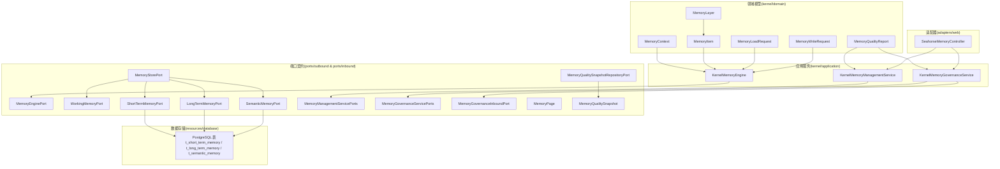
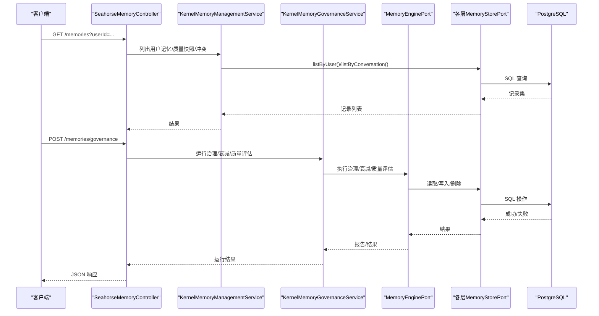
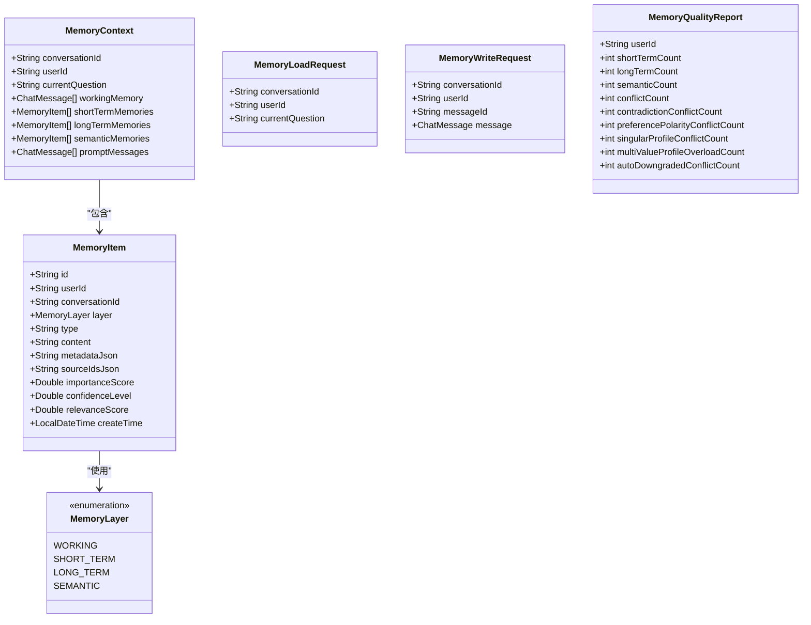
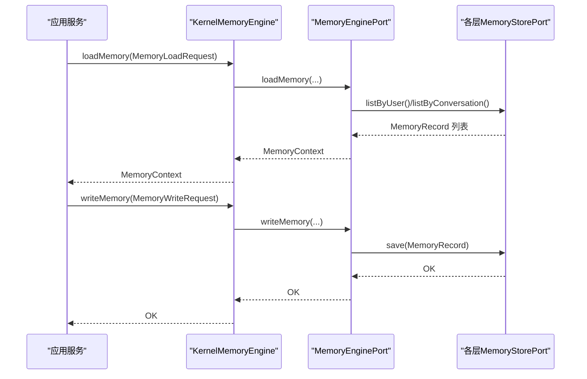
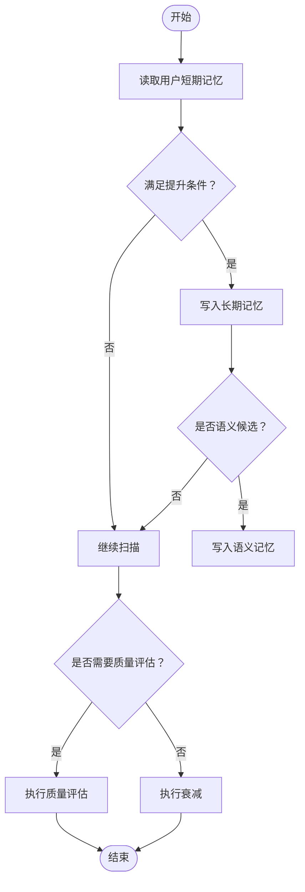
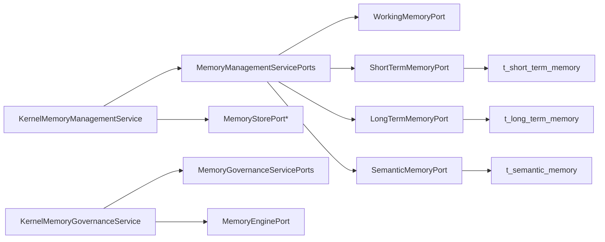

# 内存管理领域模型

<cite>
**本文引用的文件**
- [MemoryEnginePort.java](file://seahorse-agent-kernel/src/main/java/com/miracle/ai/seahorse/agent/ports/outbound/memory/MemoryEnginePort.java)
- [MemoryStorePort.java](file://seahorse-agent-kernel/src/main/java/com/miracle/ai/seahorse/agent/ports/outbound/memory/MemoryStorePort.java)
- [MemoryRecord.java](file://seahorse-agent-kernel/src/main/java/com/miracle/ai/seahorse/agent/ports/outbound/memory/MemoryRecord.java)
- [WorkingMemoryPort.java](file://seahorse-agent-kernel/src/main/java/com/miracle/ai/seahorse/agent/ports/outbound/memory/WorkingMemoryPort.java)
- [ShortTermMemoryPort.java](file://seahorse-agent-kernel/src/main/java/com/miracle/ai/seahorse/agent/ports/outbound/memory/ShortTermMemoryPort.java)
- [LongTermMemoryPort.java](file://seahorse-agent-kernel/src/main/java/com/miracle/ai/seahorse/agent/ports/outbound/memory/LongTermMemoryPort.java)
- [SemanticMemoryPort.java](file://seahorse-agent-kernel/src/main/java/com/miracle/ai/seahorse/agent/ports/outbound/memory/SemanticMemoryPort.java)
- [MemoryQualitySnapshotRepositoryPort.java](file://seahorse-agent-kernel/src/main/java/com/miracle/ai/seahorse/agent/ports/outbound/memory/MemoryQualitySnapshotRepositoryPort.java)
- [MemoryQualitySnapshot.java](file://seahorse-agent-kernel/src/main/java/com/miracle/ai/seahorse/agent/ports/outbound/memory/MemoryQualitySnapshot.java)
- [MemoryPage.java](file://seahorse-agent-kernel/src/main/java/com/miracle/ai/seahorse/agent/ports/inbound/memory/MemoryPage.java)
- [MemoryGovernanceInboundPort.java](file://seahorse-agent-kernel/src/main/java/com/miracle/ai/seahorse/agent/ports/inbound/memory/MemoryGovernanceInboundPort.java)
- [MemoryManagementServicePorts.java](file://seahorse-agent-kernel/src/main/java/com/miracle/ai/seahorse/agent/kernel/application/memory/MemoryManagementServicePorts.java)
- [MemoryGovernanceServicePorts.java](file://seahorse-agent-kernel/src/main/java/com/miracle/ai/seahorse/agent/kernel/application/memory/MemoryGovernanceServicePorts.java)
- [KernelMemoryEngine.java](file://seahorse-agent-kernel/src/main/java/com/miracle/ai/seahorse/agent/kernel/application/memory/KernelMemoryEngine.java)
- [KernelMemoryManagementService.java](file://seahorse-agent-kernel/src/main/java/com/miracle/ai/seahorse/agent/kernel/application/memory/KernelMemoryManagementService.java)
- [KernelMemoryGovernanceService.java](file://seahorse-agent-kernel/src/main/java/com/miracle/ai/seahorse/agent/kernel/application/memory/KernelMemoryGovernanceService.java)
- [MemoryContext.java](file://seahorse-agent-kernel/src/main/java/com/miracle/ai/seahorse/agent/kernel/domain/memory/MemoryContext.java)
- [MemoryItem.java](file://seahorse-agent-kernel/src/main/java/com/miracle/ai/seahorse/agent/kernel/domain/memory/MemoryItem.java)
- [MemoryLoadRequest.java](file://seahorse-agent-kernel/src/main/java/com/miracle/ai/seahorse/agent/kernel/domain/memory/MemoryLoadRequest.java)
- [MemoryWriteRequest.java](file://seahorse-agent-kernel/src/main/java/com/miracle/ai/seahorse/agent/kernel/domain/memory/MemoryWriteRequest.java)
- [MemoryLayer.java](file://seahorse-agent-kernel/src/main/java/com/miracle/ai/seahorse/agent/kernel/domain/memory/MemoryLayer.java)
- [MemoryQualityReport.java](file://seahorse-agent-kernel/src/main/java/com/miracle/ai/seahorse/agent/kernel/domain/memory/MemoryQualityReport.java)
- [SeahorseMemoryController.java](file://seahorse-agent-adapter-web/src/main/java/com/miracle/ai/seahorse/agent/adapters/web/SeahorseMemoryController.java)
- [seahorse_init.sql](file://resources/database/seahorse_init.sql)
- [seahorse_init.sql](file://resources/database/seahorse_init.sql)
</cite>

## 目录
1. [引言](#引言)
2. [项目结构](#项目结构)
3. [核心组件](#核心组件)
4. [架构总览](#架构总览)
5. [详细组件分析](#详细组件分析)
6. [依赖关系分析](#依赖关系分析)
7. [性能考量](#性能考量)
8. [故障排查指南](#故障排查指南)
9. [结论](#结论)
10. [附录](#附录)

## 引言
本文件面向“内存管理领域模型”的技术文档，系统化梳理多层记忆架构（工作记忆、短期记忆、长期记忆、语义记忆）的领域模型设计与实现边界，重点覆盖以下核心模型与流程：
- 领域模型：MemoryContext、MemoryItem、MemoryLayer、MemoryLoadRequest、MemoryQualityReport、MemoryWriteRequest
- 存储接口：MemoryStorePort 及其分层实现 WorkingMemoryPort、ShortTermMemoryPort、LongTermMemoryPort、SemanticMemoryPort
- 引擎与治理：MemoryEnginePort、KernelMemoryEngine、KernelMemoryGovernanceService、KernelMemoryManagementService
- 数据持久化：PostgreSQL 表结构与索引设计
- 控制器入口：SeahorseMemoryController 提供 REST 接口

目标是帮助读者快速理解多层记忆的抽象、读写规则、治理策略以及与数据库的映射关系。

## 项目结构
围绕内存管理的关键模块分布如下：
- kernel/domain：定义领域模型与请求/响应对象
- kernel/application：封装应用服务（管理、治理）
- ports/outbound/inbound：定义对外端口与对内端口契约
- adapters/web：提供 HTTP 控制器入口
- resources/database：数据库表结构与索引定义

图表来源
- [KernelMemoryEngine.java:35-62](file://seahorse-agent-kernel/src/main/java/com/miracle/ai/seahorse/agent/kernel/application/memory/KernelMemoryEngine.java#L35-L62)
- [KernelMemoryManagementService.java:59-90](file://seahorse-agent-kernel/src/main/java/com/miracle/ai/seahorse/agent/kernel/application/memory/KernelMemoryManagementService.java#L59-L90)
- [KernelMemoryGovernanceService.java:31-91](file://seahorse-agent-kernel/src/main/java/com/miracle/ai/seahorse/agent/kernel/application/memory/KernelMemoryGovernanceService.java#L31-L91)
- [MemoryEnginePort.java:34-81](file://seahorse-agent-kernel/src/main/java/com/miracle/ai/seahorse/agent/ports/outbound/memory/MemoryEnginePort.java#L34-L81)
- [MemoryStorePort.java:29-71](file://seahorse-agent-kernel/src/main/java/com/miracle/ai/seahorse/agent/ports/outbound/memory/MemoryStorePort.java#L29-L71)
- [WorkingMemoryPort.java:20-25](file://seahorse-agent-kernel/src/main/java/com/miracle/ai/seahorse/agent/ports/outbound/memory/WorkingMemoryPort.java#L20-L25)
- [ShortTermMemoryPort.java](file://seahorse-agent-kernel/src/main/java/com/miracle/ai/seahorse/agent/ports/outbound/memory/ShortTermMemoryPort.java)
- [LongTermMemoryPort.java](file://seahorse-agent-kernel/src/main/java/com/miracle/ai/seahorse/agent/ports/outbound/memory/LongTermMemoryPort.java)
- [SemanticMemoryPort.java](file://seahorse-agent-kernel/src/main/java/com/miracle/ai/seahorse/agent/ports/outbound/memory/SemanticMemoryPort.java)
- [MemoryPage.java:25-30](file://seahorse-agent-kernel/src/main/java/com/miracle/ai/seahorse/agent/ports/inbound/memory/MemoryPage.java#L25-L30)
- [MemoryQualitySnapshotRepositoryPort.java:22-28](file://seahorse-agent-kernel/src/main/java/com/miracle/ai/seahorse/agent/ports/outbound/memory/MemoryQualitySnapshotRepositoryPort.java#L22-L28)
- [MemoryQualitySnapshot.java:24-36](file://seahorse-agent-kernel/src/main/java/com/miracle/ai/seahorse/agent/ports/outbound/memory/MemoryQualitySnapshot.java#L24-L36)
- [SeahorseMemoryController.java:35-52](file://seahorse-agent-adapter-web/src/main/java/com/miracle/ai/seahorse/agent/adapters/web/SeahorseMemoryController.java#L35-L52)
- [seahorse_init.sql:774-807](file://resources/database/seahorse_init.sql#L774-L807)
- [seahorse_init.sql:41-76](file://resources/database/seahorse_init.sql#L41-L76)

章节来源
- [KernelMemoryEngine.java:35-62](file://seahorse-agent-kernel/src/main/java/com/miracle/ai/seahorse/agent/kernel/application/memory/KernelMemoryEngine.java#L35-L62)
- [KernelMemoryManagementService.java:59-90](file://seahorse-agent-kernel/src/main/java/com/miracle/ai/seahorse/agent/kernel/application/memory/KernelMemoryManagementService.java#L59-L90)
- [KernelMemoryGovernanceService.java:31-91](file://seahorse-agent-kernel/src/main/java/com/miracle/ai/seahorse/agent/kernel/application/memory/KernelMemoryGovernanceService.java#L31-L91)
- [MemoryEnginePort.java:34-81](file://seahorse-agent-kernel/src/main/java/com/miracle/ai/seahorse/agent/ports/outbound/memory/MemoryEnginePort.java#L34-L81)
- [MemoryStorePort.java:29-71](file://seahorse-agent-kernel/src/main/java/com/miracle/ai/seahorse/agent/ports/outbound/memory/MemoryStorePort.java#L29-L71)
- [WorkingMemoryPort.java:20-25](file://seahorse-agent-kernel/src/main/java/com/miracle/ai/seahorse/agent/ports/outbound/memory/WorkingMemoryPort.java#L20-L25)
- [ShortTermMemoryPort.java](file://seahorse-agent-kernel/src/main/java/com/miracle/ai/seahorse/agent/ports/outbound/memory/ShortTermMemoryPort.java)
- [LongTermMemoryPort.java](file://seahorse-agent-kernel/src/main/java/com/miracle/ai/seahorse/agent/ports/outbound/memory/LongTermMemoryPort.java)
- [SemanticMemoryPort.java](file://seahorse-agent-kernel/src/main/java/com/miracle/ai/seahorse/agent/ports/outbound/memory/SemanticMemoryPort.java)
- [MemoryPage.java:25-30](file://seahorse-agent-kernel/src/main/java/com/miracle/ai/seahorse/agent/ports/inbound/memory/MemoryPage.java#L25-L30)
- [MemoryQualitySnapshotRepositoryPort.java:22-28](file://seahorse-agent-kernel/src/main/java/com/miracle/ai/seahorse/agent/ports/outbound/memory/MemoryQualitySnapshotRepositoryPort.java#L22-L28)
- [MemoryQualitySnapshot.java:24-36](file://seahorse-agent-kernel/src/main/java/com/miracle/ai/seahorse/agent/ports/outbound/memory/MemoryQualitySnapshot.java#L24-L36)
- [SeahorseMemoryController.java:35-52](file://seahorse-agent-adapter-web/src/main/java/com/miracle/ai/seahorse/agent/adapters/web/SeahorseMemoryController.java#L35-L52)
- [seahorse_init.sql:774-807](file://resources/database/seahorse_init.sql#L774-L807)
- [seahorse_init.sql:41-76](file://resources/database/seahorse_init.sql#L41-L76)

## 核心组件
本节聚焦于内存管理领域的关键模型与端口，解释其职责、字段含义与约束。

- MemoryContext：加载后的多层记忆上下文，包含会话标识、用户标识、当前问题、工作记忆、短期/长期/语义记忆列表以及提示消息集合。
- MemoryItem：记忆条目的领域对象，包含唯一标识、用户/会话、层级、类型、内容、元数据JSON、来源记忆ID JSON、重要性/置信度/相关性评分及创建时间。
- MemoryLayer：枚举型分层类型，涵盖 WORKING、SHORT_TERM、LONG_TERM、SEMANTIC。
- MemoryLoadRequest：记忆加载请求，携带会话ID、用户ID与当前问题。
- MemoryWriteRequest：记忆写入请求，携带会话ID、用户ID、消息ID与聊天消息对象。
- MemoryQualityReport：记忆质量评估结果，统计各类冲突与计数指标。
- MemoryStorePort：统一的记忆存储端口，定义按ID查询、按会话/用户查询、保存与逻辑删除等通用能力。
- MemoryEnginePort：记忆引擎端口，定义加载、写入、检索、执行衰减与质量评估等能力，并提供空实现。

章节来源
- [MemoryContext.java:29-41](file://seahorse-agent-kernel/src/main/java/com/miracle/ai/seahorse/agent/kernel/domain/memory/MemoryContext.java#L29-L41)
- [MemoryItem.java:28-44](file://seahorse-agent-kernel/src/main/java/com/miracle/ai/seahorse/agent/kernel/domain/memory/MemoryItem.java#L28-L44)
- [MemoryLayer.java:20-28](file://seahorse-agent-kernel/src/main/java/com/miracle/ai/seahorse/agent/kernel/domain/memory/MemoryLayer.java#L20-L28)
- [MemoryLoadRequest.java:25-27](file://seahorse-agent-kernel/src/main/java/com/miracle/ai/seahorse/agent/kernel/domain/memory/MemoryLoadRequest.java#L25-L27)
- [MemoryWriteRequest.java:26-28](file://seahorse-agent-kernel/src/main/java/com/miracle/ai/seahorse/agent/kernel/domain/memory/MemoryWriteRequest.java#L26-L28)
- [MemoryQualityReport.java:23-40](file://seahorse-agent-kernel/src/main/java/com/miracle/ai/seahorse/agent/kernel/domain/memory/MemoryQualityReport.java#L23-L40)
- [MemoryStorePort.java:23-71](file://seahorse-agent-kernel/src/main/java/com/miracle/ai/seahorse/agent/ports/outbound/memory/MemoryStorePort.java#L23-L71)
- [MemoryEnginePort.java:29-81](file://seahorse-agent-kernel/src/main/java/com/miracle/ai/seahorse/agent/ports/outbound/memory/MemoryEnginePort.java#L29-L81)

## 架构总览
下图展示从控制器到应用服务再到端口与数据库的整体调用链路与数据流。

图表来源
- [SeahorseMemoryController.java:54-120](file://seahorse-agent-adapter-web/src/main/java/com/miracle/ai/seahorse/agent/adapters/web/SeahorseMemoryController.java#L54-L120)
- [KernelMemoryManagementService.java:59-90](file://seahorse-agent-kernel/src/main/java/com/miracle/ai/seahorse/agent/kernel/application/memory/KernelMemoryManagementService.java#L59-L90)
- [KernelMemoryGovernanceService.java:44-91](file://seahorse-agent-kernel/src/main/java/com/miracle/ai/seahorse/agent/kernel/application/memory/KernelMemoryGovernanceService.java#L44-L91)
- [MemoryEnginePort.java:34-81](file://seahorse-agent-kernel/src/main/java/com/miracle/ai/seahorse/agent/ports/outbound/memory/MemoryEnginePort.java#L34-L81)
- [MemoryStorePort.java:29-71](file://seahorse-agent-kernel/src/main/java/com/miracle/ai/seahorse/agent/ports/outbound/memory/MemoryStorePort.java#L29-L71)
- [seahorse_init.sql:774-807](file://resources/database/seahorse_init.sql#L774-L807)

## 详细组件分析

### 领域模型类图

图表来源
- [MemoryContext.java:29-41](file://seahorse-agent-kernel/src/main/java/com/miracle/ai/seahorse/agent/kernel/domain/memory/MemoryContext.java#L29-L41)
- [MemoryItem.java:28-44](file://seahorse-agent-kernel/src/main/java/com/miracle/ai/seahorse/agent/kernel/domain/memory/MemoryItem.java#L28-L44)
- [MemoryLayer.java:20-28](file://seahorse-agent-kernel/src/main/java/com/miracle/ai/seahorse/agent/kernel/domain/memory/MemoryLayer.java#L20-L28)
- [MemoryLoadRequest.java:25-27](file://seahorse-agent-kernel/src/main/java/com/miracle/ai/seahorse/agent/kernel/domain/memory/MemoryLoadRequest.java#L25-L27)
- [MemoryWriteRequest.java:26-28](file://seahorse-agent-kernel/src/main/java/com/miracle/ai/seahorse/agent/kernel/domain/memory/MemoryWriteRequest.java#L26-L28)
- [MemoryQualityReport.java:23-40](file://seahorse-agent-kernel/src/main/java/com/miracle/ai/seahorse/agent/kernel/domain/memory/MemoryQualityReport.java#L23-L40)

章节来源
- [MemoryContext.java:29-41](file://seahorse-agent-kernel/src/main/java/com/miracle/ai/seahorse/agent/kernel/domain/memory/MemoryContext.java#L29-L41)
- [MemoryItem.java:28-44](file://seahorse-agent-kernel/src/main/java/com/miracle/ai/seahorse/agent/kernel/domain/memory/MemoryItem.java#L28-L44)
- [MemoryLayer.java:20-28](file://seahorse-agent-kernel/src/main/java/com/miracle/ai/seahorse/agent/kernel/domain/memory/MemoryLayer.java#L20-L28)
- [MemoryLoadRequest.java:25-27](file://seahorse-agent-kernel/src/main/java/com/miracle/ai/seahorse/agent/kernel/domain/memory/MemoryLoadRequest.java#L25-L27)
- [MemoryWriteRequest.java:26-28](file://seahorse-agent-kernel/src/main/java/com/miracle/ai/seahorse/agent/kernel/domain/memory/MemoryWriteRequest.java#L26-L28)
- [MemoryQualityReport.java:23-40](file://seahorse-agent-kernel/src/main/java/com/miracle/ai/seahorse/agent/kernel/domain/memory/MemoryQualityReport.java#L23-L40)

### 多层内存架构与数据结构
- 分层抽象：MemoryLayer 定义四层记忆类型；MemoryStorePort 为各层提供统一的 CRUD 能力；各层端口 WorkingMemoryPort、ShortTermMemoryPort、LongTermMemoryPort、SemanticMemoryPort 在实现上可绑定不同存储后端。
- 记忆记录：MemoryRecord 作为跨层传输载体，包含 id、layer、type、content、metadata、updatedAt 等字段，确保不被降级为简单键值对。
- 页面模型：MemoryPage 以“层”为单位聚合 MemoryRecord 列表，便于控制器按层返回。
- 质量快照：MemoryQualitySnapshotRepositoryPort 与 MemoryQualitySnapshot 提供质量快照的查询能力，支持按用户与限制条数返回。

章节来源
- [MemoryLayer.java:20-28](file://seahorse-agent-kernel/src/main/java/com/miracle/ai/seahorse/agent/kernel/domain/memory/MemoryLayer.java#L20-L28)
- [MemoryStorePort.java:23-71](file://seahorse-agent-kernel/src/main/java/com/miracle/ai/seahorse/agent/ports/outbound/memory/MemoryStorePort.java#L23-L71)
- [WorkingMemoryPort.java:20-25](file://seahorse-agent-kernel/src/main/java/com/miracle/ai/seahorse/agent/ports/outbound/memory/WorkingMemoryPort.java#L20-L25)
- [ShortTermMemoryPort.java](file://seahorse-agent-kernel/src/main/java/com/miracle/ai/seahorse/agent/ports/outbound/memory/ShortTermMemoryPort.java)
- [LongTermMemoryPort.java](file://seahorse-agent-kernel/src/main/java/com/miracle/ai/seahorse/agent/ports/outbound/memory/LongTermMemoryPort.java)
- [SemanticMemoryPort.java](file://seahorse-agent-kernel/src/main/java/com/miracle/ai/seahorse/agent/ports/outbound/memory/SemanticMemoryPort.java)
- [MemoryRecord.java:24-56](file://seahorse-agent-kernel/src/main/java/com/miracle/ai/seahorse/agent/ports/outbound/memory/MemoryRecord.java#L24-L56)
- [MemoryPage.java:25-30](file://seahorse-agent-kernel/src/main/java/com/miracle/ai/seahorse/agent/ports/inbound/memory/MemoryPage.java#L25-L30)
- [MemoryQualitySnapshotRepositoryPort.java:22-28](file://seahorse-agent-kernel/src/main/java/com/miracle/ai/seahorse/agent/ports/outbound/memory/MemoryQualitySnapshotRepositoryPort.java#L22-L28)
- [MemoryQualitySnapshot.java:24-36](file://seahorse-agent-kernel/src/main/java/com/miracle/ai/seahorse/agent/ports/outbound/memory/MemoryQualitySnapshot.java#L24-L36)

### 记忆读写流程与业务规则
- 加载流程：KernelMemoryEngine 通过 MemoryEnginePort.loadMemory 接收 MemoryLoadRequest，返回包含多层记忆的 MemoryContext。
- 写入流程：KernelMemoryEngine.writeMemory 接收 MemoryWriteRequest，将消息写入对应层（通常为工作记忆或短期记忆）。
- 检索流程：retrieveMemories 支持基于请求进行检索，返回 MemoryItem 列表。
- 质量评估：assessMemoryQuality 返回 MemoryQualityReport，用于统计冲突与计数。
- 衰减执行：executeMemoryDecay 由治理服务触发，清理过期或低价值记忆。

图表来源
- [KernelMemoryEngine.java:43-61](file://seahorse-agent-kernel/src/main/java/com/miracle/ai/seahorse/agent/kernel/application/memory/KernelMemoryEngine.java#L43-L61)
- [MemoryEnginePort.java:36-44](file://seahorse-agent-kernel/src/main/java/com/miracle/ai/seahorse/agent/ports/outbound/memory/MemoryEnginePort.java#L36-L44)
- [MemoryStorePort.java:37-70](file://seahorse-agent-kernel/src/main/java/com/miracle/ai/seahorse/agent/ports/outbound/memory/MemoryStorePort.java#L37-L70)

章节来源
- [KernelMemoryEngine.java:43-61](file://seahorse-agent-kernel/src/main/java/com/miracle/ai/seahorse/agent/kernel/application/memory/KernelMemoryEngine.java#L43-L61)
- [MemoryEnginePort.java:36-44](file://seahorse-agent-kernel/src/main/java/com/miracle/ai/seahorse/agent/ports/outbound/memory/MemoryEnginePort.java#L36-L44)
- [MemoryStorePort.java:37-70](file://seahorse-agent-kernel/src/main/java/com/miracle/ai/seahorse/agent/ports/outbound/memory/MemoryStorePort.java#L37-L70)

### 治理与管理服务
- KernelMemoryGovernanceService：负责将短期记忆提升至长期与语义记忆，执行衰减与质量评估；根据权重阈值与类型权重决定是否提升，并生成治理运行结果。
- KernelMemoryManagementService：负责路由到具体层（工作/短期/长期/语义）的存储端口，提供质量快照与冲突查询、解决等能力。
- KernelMemoryEngine：作为 L1 门面，封装旧引擎的激活、写入、衰减与质量评估语义。

图表来源
- [KernelMemoryGovernanceService.java:44-91](file://seahorse-agent-kernel/src/main/java/com/miracle/ai/seahorse/agent/kernel/application/memory/KernelMemoryGovernanceService.java#L44-L91)
- [KernelMemoryEngine.java:55-61](file://seahorse-agent-kernel/src/main/java/com/miracle/ai/seahorse/agent/kernel/application/memory/KernelMemoryEngine.java#L55-L61)

章节来源
- [KernelMemoryGovernanceService.java:31-174](file://seahorse-agent-kernel/src/main/java/com/miracle/ai/seahorse/agent/kernel/application/memory/KernelMemoryGovernanceService.java#L31-L174)
- [KernelMemoryManagementService.java:59-90](file://seahorse-agent-kernel/src/main/java/com/miracle/ai/seahorse/agent/kernel/application/memory/KernelMemoryManagementService.java#L59-L90)
- [KernelMemoryEngine.java:35-62](file://seahorse-agent-kernel/src/main/java/com/miracle/ai/seahorse/agent/kernel/application/memory/KernelMemoryEngine.java#L35-L62)

### 控制器与外部交互
- SeahorseMemoryController：提供 REST 接口，接收 X-User-Id 请求头与查询参数，调用管理与治理端口，返回统一格式的响应体（code/data）。

章节来源
- [SeahorseMemoryController.java:35-120](file://seahorse-agent-adapter-web/src/main/java/com/miracle/ai/seahorse/agent/adapters/web/SeahorseMemoryController.java#L35-L120)

## 依赖关系分析
- 应用服务依赖端口契约：KernelMemoryManagementService 与 KernelMemoryGovernanceService 通过 Ports 记录类注入各层端口与引擎端口。
- 端口实现解耦：MemoryStorePort 与 MemoryEnginePort 仅定义行为，具体实现可替换为本地缓存、Redis、PostgreSQL 等。
- 数据持久化：PostgreSQL 表 t_short_term_memory、t_long_term_memory、t_semantic_memory 映射三层记忆，包含索引优化与 JSON 字段存储元数据与标签。

图表来源
- [MemoryManagementServicePorts.java:29-45](file://seahorse-agent-kernel/src/main/java/com/miracle/ai/seahorse/agent/kernel/application/memory/MemoryManagementServicePorts.java#L29-L45)
- [MemoryGovernanceServicePorts.java:27-30](file://seahorse-agent-kernel/src/main/java/com/miracle/ai/seahorse/agent/kernel/application/memory/MemoryGovernanceServicePorts.java#L27-L30)
- [seahorse_init.sql:774-807](file://resources/database/seahorse_init.sql#L774-L807)

章节来源
- [MemoryManagementServicePorts.java:29-45](file://seahorse-agent-kernel/src/main/java/com/miracle/ai/seahorse/agent/kernel/application/memory/MemoryManagementServicePorts.java#L29-L45)
- [MemoryGovernanceServicePorts.java:27-30](file://seahorse-agent-kernel/src/main/java/com/miracle/ai/seahorse/agent/kernel/application/memory/MemoryGovernanceServicePorts.java#L27-L30)
- [seahorse_init.sql:774-807](file://resources/database/seahorse_init.sql#L774-L807)

## 性能考量
- 索引优化：短期记忆表对用户、会话、时间与衰减分数建立复合索引；长期记忆表对用户、类别与重要性分数建立索引；语义记忆表对用户与类型建立索引，有助于高效查询与排序。
- 元数据存储：使用 JSONB 存储元数据与标签，配合 GIN 索引提升过滤与匹配性能。
- 层级选择：工作记忆建议使用低延迟存储（如 Redis），短期/长期/语义记忆可使用 PostgreSQL，结合分页与限制返回条数控制内存占用。
- 质量评估与治理：治理扫描限制在固定上限，避免全量扫描造成压力；质量评估与衰减操作建议异步执行或定时任务调度。

章节来源
- [seahorse_init.sql:774-807](file://resources/database/seahorse_init.sql#L774-L807)
- [seahorse_init.sql:41-76](file://resources/database/seahorse_init.sql#L41-L76)

## 故障排查指南
- 参数校验：所有字符串参数均需非空校验，非法参数将抛出异常；治理阈值默认值与类型权重可导致提升策略差异。
- 错误收集：治理运行过程中捕获异常并汇总错误列表，便于定位失败记录与质量评估异常。
- 日志与监控：建议在控制器与应用服务中增加请求追踪与耗时日志，结合质量报告与冲突日志定位问题。

章节来源
- [KernelMemoryGovernanceService.java:44-91](file://seahorse-agent-kernel/src/main/java/com/miracle/ai/seahorse/agent/kernel/application/memory/KernelMemoryGovernanceService.java#L44-L91)
- [KernelMemoryManagementService.java:91-107](file://seahorse-agent-kernel/src/main/java/com/miracle/ai/seahorse/agent/kernel/application/memory/KernelMemoryManagementService.java#L91-L107)

## 结论
本领域模型以清晰的分层抽象与端口契约实现了多层记忆的统一管理与治理。通过 MemoryContext/MemoryItem 的领域建模、MemoryEnginePort/MemoryStorePort 的能力封装，以及 PostgreSQL 的结构化存储与索引优化，系统在保证扩展性的同时兼顾了性能与可维护性。建议在生产环境中结合异步治理与定时任务，持续优化提升阈值与权重配置，以获得更佳的记忆质量与用户体验。

## 附录
- 数据库表结构概览
  - t_short_term_memory：短期记忆表，包含用户、会话、类型、内容、元数据、重要性与置信度等字段，以及多维索引。
  - t_long_term_memory：长期记忆表，包含用户、类别、标题、内容、来源类型与ID、标签、重要性与置信度、向量引用等字段，以及多维索引。
  - t_semantic_memory：语义记忆表，包含用户、语义键、语义类型、值JSON、置信度、来源记忆ID等字段，以及唯一与普通索引。

章节来源
- [seahorse_init.sql:774-807](file://resources/database/seahorse_init.sql#L774-L807)
- [seahorse_init.sql:41-76](file://resources/database/seahorse_init.sql#L41-L76)