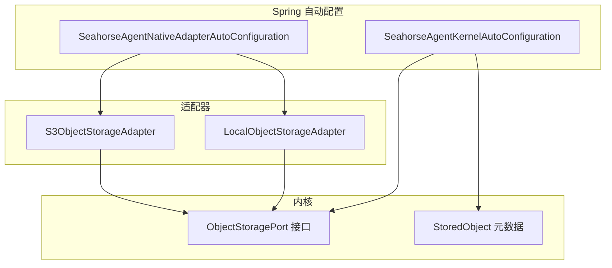
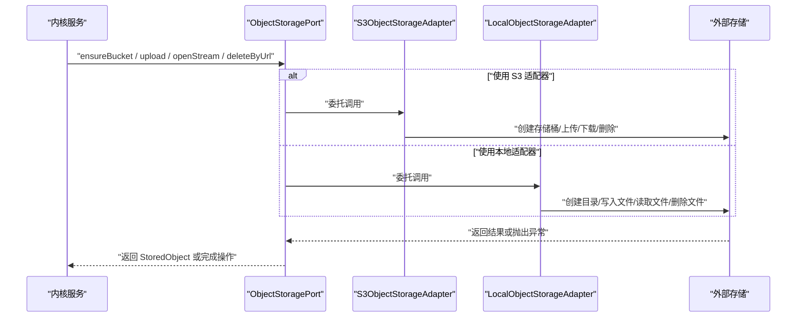
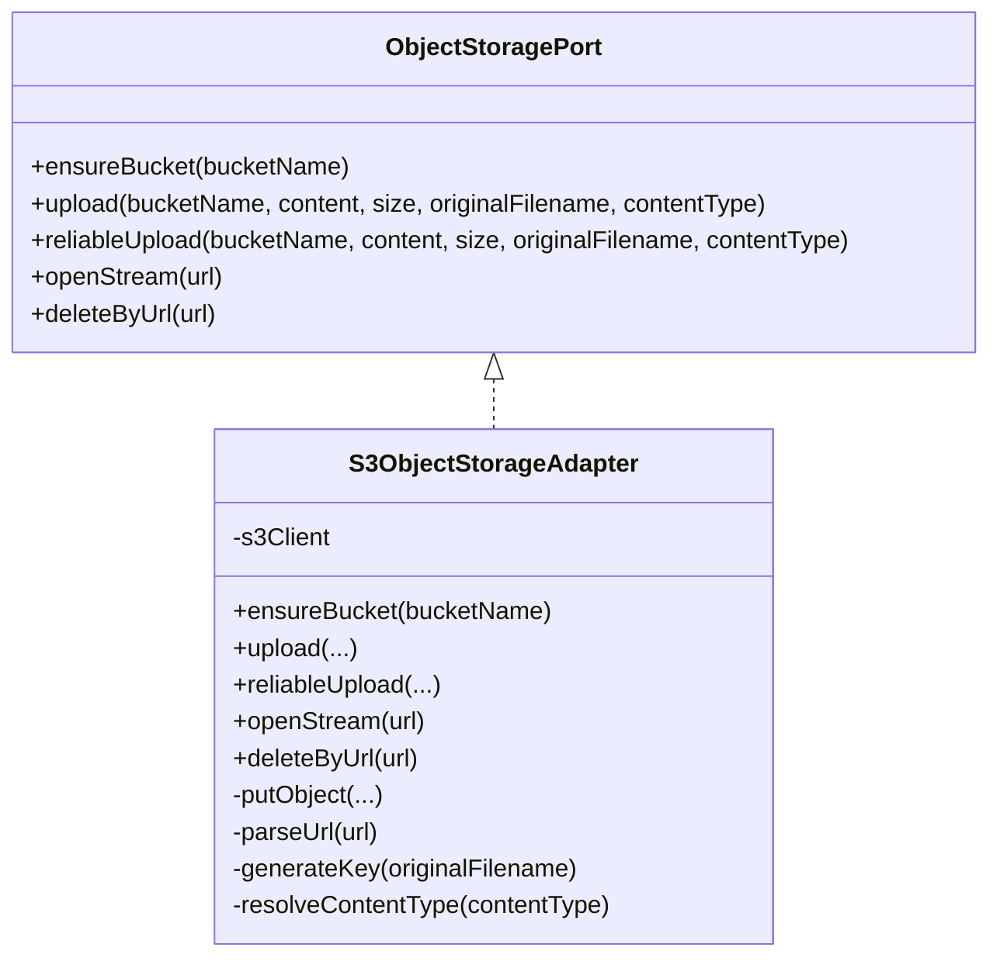
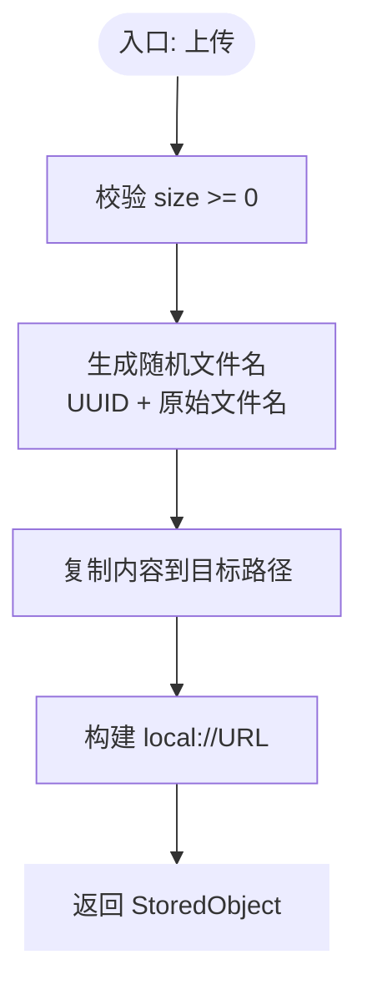
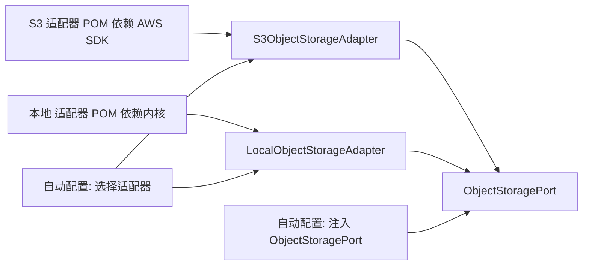

# 存储适配器

<cite>
**本文引用的文件**
- [S3ObjectStorageAdapter.java](file://seahorse-agent-adapter-storage-s3/src/main/java/com/miracle/ai/seahorse/agent/adapters/storage/s3/S3ObjectStorageAdapter.java)
- [LocalObjectStorageAdapter.java](file://seahorse-agent-adapter-storage-local/src/main/java/com/miracle/ai/seahorse/agent/adapters/storage/local/LocalObjectStorageAdapter.java)
- [ObjectStoragePort.java](file://seahorse-agent-kernel/src/main/java/com/miracle/ai/seahorse/agent/ports/outbound/storage/ObjectStoragePort.java)
- [StoredObject.java](file://seahorse-agent-kernel/src/main/java/com/miracle/ai/seahorse/agent/ports/outbound/storage/StoredObject.java)
- [SeahorseAgentNativeAdapterAutoConfiguration.java](file://seahorse-agent-spring-boot-starter/src/main/java/com/miracle/ai/seahorse/agent/adapters/spring/SeahorseAgentNativeAdapterAutoConfiguration.java)
- [SeahorseAgentKernelAutoConfiguration.java](file://seahorse-agent-spring-boot-starter/src/main/java/com/miracle/ai/seahorse/agent/adapters/spring/SeahorseAgentKernelAutoConfiguration.java)
- [application.properties](file://seahorse-agent-spring-boot-starter/src/main/resources/application.properties)
- [pom.xml（S3 适配器）](file://seahorse-agent-adapter-storage-s3/pom.xml)
- [pom.xml（本地适配器）](file://seahorse-agent-adapter-storage-local/pom.xml)
</cite>

## 目录
1. [简介](#简介)
2. [项目结构](#项目结构)
3. [核心组件](#核心组件)
4. [架构总览](#架构总览)
5. [详细组件分析](#详细组件分析)
6. [依赖关系分析](#依赖关系分析)
7. [性能考虑](#性能考虑)
8. [故障排查指南](#故障排查指南)
9. [结论](#结论)
10. [附录](#附录)

## 简介
本技术文档聚焦于“存储适配器”，系统性阐述对象存储统一接口的设计与实现，以及两种具体适配器：Amazon S3 对象存储适配器与本地文件系统对象存储适配器。文档涵盖以下主题：
- 统一接口设计与职责边界
- 文件上传、下载、删除与元数据封装
- 配置参数、访问权限与安全机制
- 性能优化、断点续传与批量操作能力现状与建议
- 成本优化、生命周期管理与灾难恢复策略
- 在不同环境中的选型建议

## 项目结构
存储适配器位于独立的适配器模块中，并通过 Spring Boot 自动配置注入到内核服务中：
- 接口与模型定义位于内核模块，确保领域无关的抽象
- S3 适配器与本地适配器分别实现统一接口
- Spring 自动配置根据属性选择启用对应适配器

图表来源
- [ObjectStoragePort.java:25-47](file://seahorse-agent-kernel/src/main/java/com/miracle/ai/seahorse/agent/ports/outbound/storage/ObjectStoragePort.java#L25-L47)
- [StoredObject.java:28-29](file://seahorse-agent-kernel/src/main/java/com/miracle/ai/seahorse/agent/ports/outbound/storage/StoredObject.java#L28-L29)
- [S3ObjectStorageAdapter.java:37-151](file://seahorse-agent-adapter-storage-s3/src/main/java/com/miracle/ai/seahorse/agent/adapters/storage/s3/S3ObjectStorageAdapter.java#L37-L151)
- [LocalObjectStorageAdapter.java:34-128](file://seahorse-agent-adapter-storage-local/src/main/java/com/miracle/ai/seahorse/agent/adapters/storage/local/LocalObjectStorageAdapter.java#L34-L128)
- [SeahorseAgentNativeAdapterAutoConfiguration.java:226-241](file://seahorse-agent-spring-boot-starter/src/main/java/com/miracle/ai/seahorse/agent/adapters/spring/SeahorseAgentNativeAdapterAutoConfiguration.java#L226-L241)
- [SeahorseAgentKernelAutoConfiguration.java:516-525](file://seahorse-agent-spring-boot-starter/src/main/java/com/miracle/ai/seahorse/agent/adapters/spring/SeahorseAgentKernelAutoConfiguration.java#L516-L525)

章节来源
- [application.properties:1-2](file://seahorse-agent-spring-boot-starter/src/main/resources/application.properties#L1-L2)
- [pom.xml（S3 适配器）:18-28](file://seahorse-agent-adapter-storage-s3/pom.xml#L18-L28)
- [pom.xml（本地适配器）:18-24](file://seahorse-agent-adapter-storage-local/pom.xml#L18-L24)

## 核心组件
- 统一接口：ObjectStoragePort 定义了存储桶确保、上传、可靠上传、打开流、按 URL 删除等能力，默认空实现用于兼容旧有“创建知识库即创建存储空间”的行为。
- 元数据模型：StoredObject 封装对象访问 URL、检测到的类型、大小与原始文件名。
- S3 适配器：基于 AWS SDK v2 的 S3Client 实现，支持创建存储桶、上传、按 s3:// URL 打开与删除。
- 本地适配器：基于本地文件系统，支持创建目录、上传、按 local:// URL 打开与删除。

章节来源
- [ObjectStoragePort.java:25-47](file://seahorse-agent-kernel/src/main/java/com/miracle/ai/seahorse/agent/ports/outbound/storage/ObjectStoragePort.java#L25-L47)
- [StoredObject.java:28-29](file://seahorse-agent-kernel/src/main/java/com/miracle/ai/seahorse/agent/ports/outbound/storage/StoredObject.java#L28-L29)
- [S3ObjectStorageAdapter.java:37-151](file://seahorse-agent-adapter-storage-s3/src/main/java/com/miracle/ai/seahorse/agent/adapters/storage/s3/S3ObjectStorageAdapter.java#L37-L151)
- [LocalObjectStorageAdapter.java:34-128](file://seahorse-agent-adapter-storage-local/src/main/java/com/miracle/ai/seahorse/agent/adapters/storage/local/LocalObjectStorageAdapter.java#L34-L128)

## 架构总览
下图展示了从内核服务到适配器再到外部系统的调用关系与职责划分：

图表来源
- [SeahorseAgentKernelAutoConfiguration.java:516-525](file://seahorse-agent-spring-boot-starter/src/main/java/com/miracle/ai/seahorse/agent/adapters/spring/SeahorseAgentKernelAutoConfiguration.java#L516-L525)
- [ObjectStoragePort.java:25-47](file://seahorse-agent-kernel/src/main/java/com/miracle/ai/seahorse/agent/ports/outbound/storage/ObjectStoragePort.java#L25-L47)
- [S3ObjectStorageAdapter.java:47-101](file://seahorse-agent-adapter-storage-s3/src/main/java/com/miracle/ai/seahorse/agent/adapters/storage/s3/S3ObjectStorageAdapter.java#L47-L101)
- [LocalObjectStorageAdapter.java:49-96](file://seahorse-agent-adapter-storage-local/src/main/java/com/miracle/ai/seahorse/agent/adapters/storage/local/LocalObjectStorageAdapter.java#L49-L96)

## 详细组件分析

### 统一接口设计（ObjectStoragePort）
- 能力范围：确保存储空间存在、上传、可靠上传、打开输入流、按 URL 删除。
- 设计要点：
  - ensureBucket 默认空实现，便于适配器按自身语义覆盖。
  - reliableUpload 当前由 ObjectStoragePort 默认委托 upload；只有适配器提供幂等、重试、断点续传、多段上传或校验能力时才覆盖。
  - openStream 与 deleteByUrl 使用统一的 URL 协议前缀区分不同后端。

章节来源
- [ObjectStoragePort.java:25-47](file://seahorse-agent-kernel/src/main/java/com/miracle/ai/seahorse/agent/ports/outbound/storage/ObjectStoragePort.java#L25-L47)

### S3 对象存储适配器（S3ObjectStorageAdapter）
- 关键实现
  - 存储桶确保：通过 S3Client 创建桶，处理“已归本账户拥有”与“已存在但非本账户”的异常。
  - 上传：生成唯一 key（UUID），设置内容类型，调用 putObject 写入并返回 StoredObject。
  - 下载：解析 s3://URL，构造 GetObjectRequest 并返回 InputStream。
  - 删除：解析 s3://URL，调用 deleteObject。
  - URL 解析：校验 scheme 与 host/key，保证格式正确。
  - 内容类型：若未提供则回退为二进制流类型。
  - 异常处理：对空参数、非法 URL、负大小进行校验与错误提示。

图表来源
- [ObjectStoragePort.java:25-47](file://seahorse-agent-kernel/src/main/java/com/miracle/ai/seahorse/agent/ports/outbound/storage/ObjectStoragePort.java#L25-L47)
- [S3ObjectStorageAdapter.java:37-151](file://seahorse-agent-adapter-storage-s3/src/main/java/com/miracle/ai/seahorse/agent/adapters/storage/s3/S3ObjectStorageAdapter.java#L37-L151)

章节来源
- [S3ObjectStorageAdapter.java:47-101](file://seahorse-agent-adapter-storage-s3/src/main/java/com/miracle/ai/seahorse/agent/adapters/storage/s3/S3ObjectStorageAdapter.java#L47-L101)
- [S3ObjectStorageAdapter.java:104-113](file://seahorse-agent-adapter-storage-s3/src/main/java/com/miracle/ai/seahorse/agent/adapters/storage/s3/S3ObjectStorageAdapter.java#L104-L113)
- [S3ObjectStorageAdapter.java:115-140](file://seahorse-agent-adapter-storage-s3/src/main/java/com/miracle/ai/seahorse/agent/adapters/storage/s3/S3ObjectStorageAdapter.java#L115-L140)

### 本地对象存储适配器（LocalObjectStorageAdapter）
- 关键实现
  - 存储桶确保：在根目录下创建与桶名对应的子目录。
  - 上传：生成随机文件名（UUID 前缀 + 原始文件名），写入目标路径，返回 StoredObject。
  - 下载：解析 local://URL，校验路径不逃逸根目录，返回 InputStream。
  - 删除：解析 URL 并删除文件。
  - 路径安全：对路径分隔符进行替换与规范化，防止目录穿越。
  - 默认桶名：当未提供时使用默认桶名。

图表来源
- [LocalObjectStorageAdapter.java:88-97](file://seahorse-agent-adapter-storage-local/src/main/java/com/miracle/ai/seahorse/agent/adapters/storage/local/LocalObjectStorageAdapter.java#L88-L97)
- [LocalObjectStorageAdapter.java:99-106](file://seahorse-agent-adapter-storage-local/src/main/java/com/miracle/ai/seahorse/agent/adapters/storage/local/LocalObjectStorageAdapter.java#L99-L106)

章节来源
- [LocalObjectStorageAdapter.java:49-97](file://seahorse-agent-adapter-storage-local/src/main/java/com/miracle/ai/seahorse/agent/adapters/storage/local/LocalObjectStorageAdapter.java#L49-L97)
- [LocalObjectStorageAdapter.java:108-118](file://seahorse-agent-adapter-storage-local/src/main/java/com/miracle/ai/seahorse/agent/adapters/storage/local/LocalObjectStorageAdapter.java#L108-L118)
- [LocalObjectStorageAdapter.java:120-127](file://seahorse-agent-adapter-storage-local/src/main/java/com/miracle/ai/seahorse/agent/adapters/storage/local/LocalObjectStorageAdapter.java#L120-L127)

### 元数据与 URL 规范
- StoredObject 字段：url、detectedType、size、originalFilename，用于上层业务记录与展示。
- URL 前缀：
  - S3：s3://bucket/key
  - 本地：local://bucket/filename
- 一致性：内核服务通过统一接口与 URL 前缀解耦具体后端。

章节来源
- [StoredObject.java:28-29](file://seahorse-agent-kernel/src/main/java/com/miracle/ai/seahorse/agent/ports/outbound/storage/StoredObject.java#L28-L29)
- [S3ObjectStorageAdapter.java:39-39](file://seahorse-agent-adapter-storage-s3/src/main/java/com/miracle/ai/seahorse/agent/adapters/storage/s3/S3ObjectStorageAdapter.java#L39-L39)
- [LocalObjectStorageAdapter.java:36-36](file://seahorse-agent-adapter-storage-local/src/main/java/com/miracle/ai/seahorse/agent/adapters/storage/local/LocalObjectStorageAdapter.java#L36-L36)

## 依赖关系分析
- 适配器依赖
  - S3 适配器依赖 AWS SDK S3 模块与内核接口。
  - 本地适配器仅依赖内核接口与 Java NIO。
- Spring 自动配置
  - 根据属性选择启用 S3 或本地适配器 Bean。
  - 内核服务在装配 ObjectStoragePort 时被条件化注入。

图表来源
- [pom.xml（S3 适配器）:18-28](file://seahorse-agent-adapter-storage-s3/pom.xml#L18-L28)
- [pom.xml（本地适配器）:18-24](file://seahorse-agent-adapter-storage-local/pom.xml#L18-L24)
- [SeahorseAgentNativeAdapterAutoConfiguration.java:226-241](file://seahorse-agent-spring-boot-starter/src/main/java/com/miracle/ai/seahorse/agent/adapters/spring/SeahorseAgentNativeAdapterAutoConfiguration.java#L226-L241)
- [SeahorseAgentKernelAutoConfiguration.java:516-525](file://seahorse-agent-spring-boot-starter/src/main/java/com/miracle/ai/seahorse/agent/adapters/spring/SeahorseAgentKernelAutoConfiguration.java#L516-L525)

章节来源
- [SeahorseAgentNativeAdapterAutoConfiguration.java:226-241](file://seahorse-agent-spring-boot-starter/src/main/java/com/miracle/ai/seahorse/agent/adapters/spring/SeahorseAgentNativeAdapterAutoConfiguration.java#L226-L241)
- [SeahorseAgentKernelAutoConfiguration.java:516-525](file://seahorse-agent-spring-boot-starter/src/main/java/com/miracle/ai/seahorse/agent/adapters/spring/SeahorseAgentKernelAutoConfiguration.java#L516-L525)

## 性能考虑
- 上传路径
  - S3：当前实现为一次性 putObject，未实现多段上传与断点续传。对于大文件，建议在适配器层引入分片上传与断点续传逻辑，结合服务端校验与并发控制。
  - 本地：直接复制到目标路径，适合小文件与开发测试场景；生产环境建议引入缓冲与流式处理以降低内存峰值。
- 并发与吞吐
  - S3：可结合 AWS SDK 的传输管理器与线程池配置，提升并发上传效率。
  - 本地：避免阻塞 IO，必要时采用异步或流式写入。
- 元数据与索引
  - 当前 StoredObject 返回 size 与 detectedType，建议在上层服务中维护额外索引字段以加速查询与统计。
- 批量操作
  - 当前未提供批量上传/删除接口，可在适配器层扩展批量操作，或在上层聚合请求以减少网络往返。

[本节为通用性能建议，不直接分析具体文件]

## 故障排查指南
- 常见问题定位
  - 参数校验失败：空 bucket 名称、空内容、负 size、非法 URL 前缀。
  - S3 异常：存储桶已存在但非本账户拥有、存储桶名称冲突。
  - 本地异常：目录创建失败、路径逃逸、文件读写失败。
- 建议排查步骤
  - 检查 URL 前缀与格式是否匹配适配器预期。
  - 核对存储桶/目录是否存在且具备相应权限。
  - 查看异常堆栈中的具体失败阶段（创建、写入、读取、删除）。
  - 对于 S3，确认凭证、区域与网络连通性。

章节来源
- [S3ObjectStorageAdapter.java:47-57](file://seahorse-agent-adapter-storage-s3/src/main/java/com/miracle/ai/seahorse/agent/adapters/storage/s3/S3ObjectStorageAdapter.java#L47-L57)
- [S3ObjectStorageAdapter.java:104-113](file://seahorse-agent-adapter-storage-s3/src/main/java/com/miracle/ai/seahorse/agent/adapters/storage/s3/S3ObjectStorageAdapter.java#L104-L113)
- [LocalObjectStorageAdapter.java:108-118](file://seahorse-agent-adapter-storage-local/src/main/java/com/miracle/ai/seahorse/agent/adapters/storage/local/LocalObjectStorageAdapter.java#L108-L118)
- [LocalObjectStorageAdapter.java:120-127](file://seahorse-agent-adapter-storage-local/src/main/java/com/miracle/ai/seahorse/agent/adapters/storage/local/LocalObjectStorageAdapter.java#L120-L127)

## 结论
- 统一接口使上层服务与具体存储后端解耦，便于在 S3 与本地之间切换。
- 当前实现满足基础上传/下载/删除与元数据封装需求；断点续传、多段上传与批量操作需在适配器层扩展。
- 通过 Spring 属性即可快速切换存储后端，满足开发、测试与生产的差异化需求。

[本节为总结性内容，不直接分析具体文件]

## 附录

### 配置参数与启用方式
- 启用 S3 适配器
  - 条件：存在 S3Client Bean，且属性 seahorse-agent.adapters.storage.type=s3。
  - 行为：自动装配 S3ObjectStorageAdapter。
- 启用本地适配器
  - 条件：属性 seahorse-agent.adapters.storage.type=local。
  - 行为：自动装配 LocalObjectStorageAdapter，并支持自定义根目录路径。
- 内核服务注入
  - 内核自动配置在满足依赖时注入 ObjectStoragePort，供知识库与文档服务使用。

章节来源
- [SeahorseAgentNativeAdapterAutoConfiguration.java:226-241](file://seahorse-agent-spring-boot-starter/src/main/java/com/miracle/ai/seahorse/agent/adapters/spring/SeahorseAgentNativeAdapterAutoConfiguration.java#L226-L241)
- [SeahorseAgentKernelAutoConfiguration.java:516-525](file://seahorse-agent-spring-boot-starter/src/main/java/com/miracle/ai/seahorse/agent/adapters/spring/SeahorseAgentKernelAutoConfiguration.java#L516-L525)
- [application.properties:1-2](file://seahorse-agent-spring-boot-starter/src/main/resources/application.properties#L1-L2)

### 访问权限与安全机制
- S3
  - 凭证与区域：由 S3Client 配置决定；建议使用 IAM 角色或最小权限策略。
  - 加密：可启用服务端加密（SSE）与客户端加密（KMS）策略。
  - 访问控制：通过存储桶策略与 IAM 策略限制访问范围。
- 本地
  - 文件系统权限：确保运行用户对根目录具有读写权限。
  - 路径安全：已内置路径规范化与逃逸检测，避免目录穿越。

章节来源
- [S3ObjectStorageAdapter.java:104-113](file://seahorse-agent-adapter-storage-s3/src/main/java/com/miracle/ai/seahorse/agent/adapters/storage/s3/S3ObjectStorageAdapter.java#L104-L113)
- [LocalObjectStorageAdapter.java:108-118](file://seahorse-agent-adapter-storage-local/src/main/java/com/miracle/ai/seahorse/agent/adapters/storage/local/LocalObjectStorageAdapter.java#L108-L118)

### 生命周期管理与灾难恢复
- 生命周期管理
  - S3：可配置生命周期规则（如过渡到低频/归档存储、过期删除）以降低成本。
  - 本地：可通过外部工具定期清理过期文件或迁移至归档位置。
- 灾难恢复
  - S3：启用跨区复制与版本控制，定期备份关键数据。
  - 本地：建议将存储根目录置于可备份的持久化卷，并制定快照与异地备份策略。

[本节为通用运维建议，不直接分析具体文件]

### 断点续传与批量操作建议
- 断点续传
  - S3：实现多段上传（Multipart Upload），记录已上传分片，失败后仅重传缺失分片。
  - 本地：记录已写入偏移，重启后继续写入。
- 批量操作
  - 扩展 ObjectStoragePort 提供批量上传/删除方法，或在上层聚合请求。
  - 注意幂等性与去重，避免重复写入。

[本节为通用实现建议，不直接分析具体文件]
