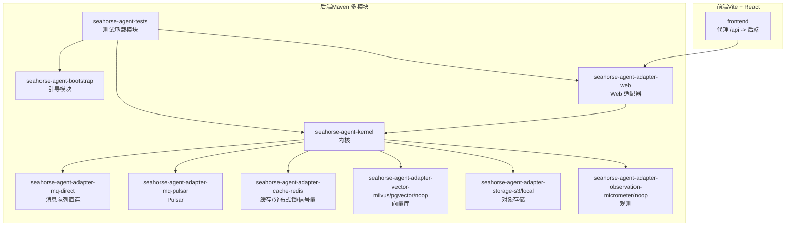
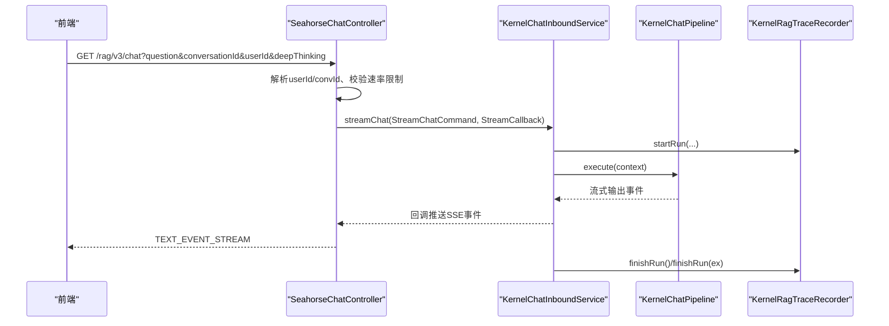
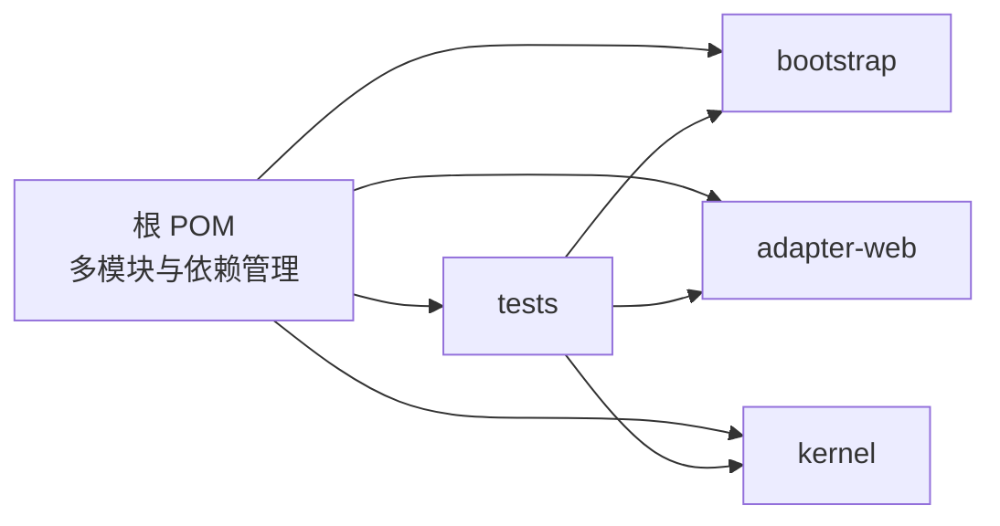

# 开发流程

<cite>
**本文引用的文件**
- [pom.xml](file://pom.xml)
- [USER_GUIDE.md](file://docs/USER_GUIDE.md)
- [application.properties](file://seahorse-agent-bootstrap/src/main/resources/application.properties)
- [SeahorseChatController.java](file://seahorse-agent-adapter-web/src/main/java/com/miracle/ai/seahorse/agent/adapters/web/SeahorseChatController.java)
- [KernelChatInboundService.java](file://seahorse-agent-kernel/src/main/java/com/miracle/ai/seahorse/agent/kernel/application/chat/KernelChatInboundService.java)
- [vite.config.ts](file://frontend/vite.config.ts)
- [TESTING.md](file://frontend/TESTING.md)
- [package.json](file://frontend/package.json)
- [.eslintrc.cjs](file://frontend/.eslintrc.cjs)
- [tailwind.config.cjs](file://frontend/tailwind.config.cjs)
- [docker-compose.yml（轻量部署）](file://docker-compose.yml)
- [seahorse-agent-tests/pom.xml](file://seahorse-agent-tests/pom.xml)
</cite>

## 目录
1. [简介](#简介)
2. [项目结构](#项目结构)
3. [核心组件](#核心组件)
4. [架构总览](#架构总览)
5. [详细组件分析](#详细组件分析)
6. [依赖分析](#依赖分析)
7. [性能考虑](#性能考虑)
8. [故障排查指南](#故障排查指南)
9. [结论](#结论)
10. [附录](#附录)

## 简介
本指南面向新功能开发的全流程，覆盖从需求分析、技术设计、任务分解、开发实现、测试验证到上线发布的全过程。结合本仓库的实际工程实践，明确分支创建、代码编写、本地测试、代码审查、合并发布等标准流程；介绍测试驱动开发（TDD）在本项目中的落地方式；梳理持续集成与持续部署（CI/CD）的自动化构建与测试执行策略；给出代码审查清单与质量标准；说明问题跟踪与缺陷管理流程；并提供文档编写与维护要求。

## 项目结构
本项目采用多模块 Maven 架构，后端由 Spring Boot 引导，前端基于 Vite + React。核心模块包括内核（kernel）、Web 适配器（adapter-web）、各类适配器（消息队列、缓存、向量库、对象存储、观察等）、Spring Boot Starter、以及测试模块。前端通过代理将 /api 请求转发至后端服务，便于本地联调。

图表来源
- [pom.xml:37-60](file://pom.xml#L37-L60)
- [USER_GUIDE.md:15-22](file://docs/USER_GUIDE.md#L15-L22)
- [vite.config.ts:12-21](file://frontend/vite.config.ts#L12-L21)

章节来源
- [pom.xml:37-60](file://pom.xml#L37-L60)
- [USER_GUIDE.md:15-22](file://docs/USER_GUIDE.md#L15-L22)

## 核心组件
- 引导与运行
  - 引导模块负责启用内核与迁移模式，确保系统以原生内核路径启动。
  - 参考：[application.properties:1-4](file://seahorse-agent-bootstrap/src/main/resources/application.properties#L1-L4)
- Web 控制器
  - 提供 SSE 流式对话接口与停止任务接口，内置速率限制与用户/会话 ID 解析。
  - 参考：[SeahorseChatController.java:83-132](file://seahorse-agent-adapter-web/src/main/java/com/miracle/ai/seahorse/agent/adapters/web/SeahorseChatController.java#L83-L132)
- 内核应用服务
  - 将请求封装为上下文并交由内核流水线执行，同时记录追踪。
  - 参考：[KernelChatInboundService.java:56-92](file://seahorse-agent-kernel/src/main/java/com/miracle/ai/seahorse/agent/kernel/application/chat/KernelChatInboundService.java#L56-L92)
- 前端代理与测试
  - Vite 代理将 /api 转发至后端；TESTING.md 提供本地联调步骤与常见问题。
  - 参考：[vite.config.ts:12-21](file://frontend/vite.config.ts#L12-L21)，[TESTING.md:1-112](file://frontend/TESTING.md#L1-L112)

章节来源
- [application.properties:1-4](file://seahorse-agent-bootstrap/src/main/resources/application.properties#L1-L4)
- [SeahorseChatController.java:83-132](file://seahorse-agent-adapter-web/src/main/java/com/miracle/ai/seahorse/agent/adapters/web/SeahorseChatController.java#L83-L132)
- [KernelChatInboundService.java:56-92](file://seahorse-agent-kernel/src/main/java/com/miracle/ai/seahorse/agent/kernel/application/chat/KernelChatInboundService.java#L56-L92)
- [vite.config.ts:12-21](file://frontend/vite.config.ts#L12-L21)
- [TESTING.md:1-112](file://frontend/TESTING.md#L1-L112)

## 架构总览
下图展示从前端到后端内核的典型交互路径，涵盖鉴权、速率限制、SSE 流式回调、内核执行与追踪记录。

图表来源
- [SeahorseChatController.java:83-102](file://seahorse-agent-adapter-web/src/main/java/com/miracle/ai/seahorse/agent/adapters/web/SeahorseChatController.java#L83-L102)
- [KernelChatInboundService.java:56-78](file://seahorse-agent-kernel/src/main/java/com/miracle/ai/seahorse/agent/kernel/application/chat/KernelChatInboundService.java#L56-L78)

章节来源
- [SeahorseChatController.java:83-132](file://seahorse-agent-adapter-web/src/main/java/com/miracle/ai/seahorse/agent/adapters/web/SeahorseChatController.java#L83-L132)
- [KernelChatInboundService.java:56-92](file://seahorse-agent-kernel/src/main/java/com/miracle/ai/seahorse/agent/kernel/application/chat/KernelChatInboundService.java#L56-L92)

## 详细组件分析

### 新功能开发标准流程
- 需求评审
  - 明确功能边界、输入输出、性能与可用性目标；评估对内核、适配器与前端的影响。
- 技术设计
  - 设计领域模型、端口与适配器映射；确定是否引入新适配器或扩展现有端口。
- 任务分解
  - 将需求拆分为可测试的子任务，分配到具体模块（kernel/web/adapter）。
- 分支创建
  - 基于主干创建特性分支，遵循命名规范（如 feature/xxx），避免在主分支直接提交。
- 代码编写
  - 遵循现有代码风格与静态检查规则；优先实现内核逻辑，再补充适配器与前端。
- 本地测试
  - 使用 Maven 单元/集成测试与前端代理联调；参考快速开始与测试指南。
- 代码审查
  - 提交 PR，至少一名 reviewer 通过；关注设计一致性、性能与可维护性。
- 合并发布
  - 通过 CI/CD 自动化构建与测试；合并后进行灰度或全量发布。

章节来源
- [USER_GUIDE.md:83-88](file://docs/USER_GUIDE.md#L83-L88)

### 测试驱动开发（TDD）实践
- 单元测试
  - 使用 Surefire 插件与 Mockito；在 seahorse-agent-tests 中组织边界与契约测试。
  - 参考：[pom.xml（Surefire 配置）:230-236](file://pom.xml#L230-L236)，[seahorse-agent-tests/pom.xml:14-35](file://seahorse-agent-tests/pom.xml#L14-L35)
- 集成测试
  - 通过 seahorse-agent-tests 组合 kernel、web 适配器与 starter，验证端到端流程。
- 性能测试
  - 使用性能对比脚本与基线 JSON 文件进行回归门禁。
  - 参考：[USER_GUIDE.md（性能门禁命令）:51-55](file://docs/USER_GUIDE.md#L51-L55)

章节来源
- [pom.xml:230-236](file://pom.xml#L230-L236)
- [seahorse-agent-tests/pom.xml:14-35](file://seahorse-agent-tests/pom.xml#L14-L35)
- [USER_GUIDE.md:51-55](file://docs/USER_GUIDE.md#L51-L55)

### 持续集成与持续部署（CI/CD）
- 自动化构建
  - Maven 多模块构建，统一 Java 版本与插件版本；使用 Spring Boot Maven 插件打包。
  - 参考：[pom.xml（属性与插件）:15-35](file://pom.xml#L15-L35)，[pom.xml（插件管理与执行）:185-201](file://pom.xml#L185-L201)
- 测试执行
  - Surefire 跳过集成分组，配合 Mockito 注入；seahorse-agent-tests 承载组合测试。
  - 参考：[pom.xml（Surefire 配置）:230-236](file://pom.xml#L230-L236)，[seahorse-agent-tests/pom.xml:14-35](file://seahorse-agent-tests/pom.xml#L14-L35)
- 部署策略
  - 提供轻量级 Docker Compose 方案，适合本地与低配环境；生产环境使用默认配置。
  - 参考：[docker-compose.yml（轻量部署）](file://docker-compose.yml)

章节来源
- [pom.xml:15-35](file://pom.xml#L15-L35)
- [pom.xml:185-201](file://pom.xml#L185-L201)
- [pom.xml:230-236](file://pom.xml#L230-L236)
- [seahorse-agent-tests/pom.xml:14-35](file://seahorse-agent-tests/pom.xml#L14-L35)
- [docker-compose.yml（轻量部署）](file://docker-compose.yml)

### 代码审查标准与流程
- 审查清单
  - 设计一致性：是否符合内核/端口契约；是否引入不必要的耦合。
  - 可测试性：是否易于单元/集成测试；是否提供必要的 SPI/Port。
  - 性能与稳定性：是否满足性能门禁；是否考虑并发与资源限制。
  - 文档与注释：是否更新相关文档与 API 说明。
- 质量标准
  - 代码风格：遵循 Spotless 许可证头与格式化规则。
    - 参考：[pom.xml（Spotless 配置）:238-258](file://pom.xml#L238-L258)
  - 前端质量：ESLint 规则与 Prettier 格式化。
    - 参考：[package.json（脚本与依赖）:6-12](file://frontend/package.json#L6-L12)，[.eslintrc.cjs:1-27](file://frontend/.eslintrc.cjs#L1-L27)
- 反馈处理
  - 明确修改点与验证方式；必要时补充测试用例与回归测试。

章节来源
- [pom.xml:238-258](file://pom.xml#L238-L258)
- [package.json:6-12](file://frontend/package.json#L6-L12)
- [.eslintrc.cjs:1-27](file://frontend/.eslintrc.cjs#L1-L27)

### 问题跟踪与缺陷管理
- Bug 报告
  - 提供最小复现步骤、期望结果、实际结果、日志片段与环境信息。
- 修复验证
  - 修复后在本地与测试环境验证；必要时补充回归测试。
- 回归测试
  - 使用性能对比脚本与测试模块确保无回归。
  - 参考：[USER_GUIDE.md（性能门禁命令）:51-55](file://docs/USER_GUIDE.md#L51-L55)，[seahorse-agent-tests/pom.xml:14-35](file://seahorse-agent-tests/pom.xml#L14-L35)

章节来源
- [USER_GUIDE.md:51-55](file://docs/USER_GUIDE.md#L51-L55)
- [seahorse-agent-tests/pom.xml:14-35](file://seahorse-agent-tests/pom.xml#L14-L35)

### 文档编写与维护
- 技术文档
  - 更新 USER_GUIDE 与架构评审文档，同步任务计划与进度。
  - 参考：[USER_GUIDE.md（后续开发约束）:83-88](file://docs/USER_GUIDE.md#L83-L88)
- API 文档
  - Web 接口路径与参数在 Web 适配器中定义，保持前后端一致。
  - 参考：[SeahorseChatController.java（接口定义）:83-109](file://seahorse-agent-adapter-web/src/main/java/com/miracle/ai/seahorse/agent/adapters/web/SeahorseChatController.java#L83-L109)
- 用户手册
  - 前端 TESTING.md 提供本地联调步骤与常见问题，便于用户自测。
  - 参考：[TESTING.md:1-112](file://frontend/TESTING.md#L1-L112)

章节来源
- [USER_GUIDE.md:83-88](file://docs/USER_GUIDE.md#L83-L88)
- [SeahorseChatController.java:83-109](file://seahorse-agent-adapter-web/src/main/java/com/miracle/ai/seahorse/agent/adapters/web/SeahorseChatController.java#L83-L109)
- [TESTING.md:1-112](file://frontend/TESTING.md#L1-L112)

## 依赖分析
- 模块依赖
  - 引导模块启用内核与迁移模式；Web 适配器依赖内核；测试模块聚合 kernel/web/starter。
  - 参考：[pom.xml（模块列表）:37-60](file://pom.xml#L37-L60)，[seahorse-agent-tests/pom.xml:14-35](file://seahorse-agent-tests/pom.xml#L14-L35)
- 外部依赖
  - Spring Boot、MyBatis Plus、Milvus、Pulsar、S3、Sa-Token、Redisson、OkHttp 等版本集中管理。
  - 参考：[pom.xml（依赖管理）:62-165](file://pom.xml#L62-L165)

图表来源
- [pom.xml:37-60](file://pom.xml#L37-L60)
- [seahorse-agent-tests/pom.xml:14-35](file://seahorse-agent-tests/pom.xml#L14-L35)

章节来源
- [pom.xml:37-60](file://pom.xml#L37-L60)
- [pom.xml:62-165](file://pom.xml#L62-L165)
- [seahorse-agent-tests/pom.xml:14-35](file://seahorse-agent-tests/pom.xml#L14-L35)

## 性能考虑
- 性能门禁
  - 使用性能对比脚本与 JSON 基线进行回归门禁，设定最大允许回归阈值。
  - 参考：[USER_GUIDE.md（性能门禁命令）:51-55](file://docs/USER_GUIDE.md#L51-L55)
- 资源限制
  - 轻量级部署为各容器设置内存上限，适合本地与低配环境；生产环境使用默认配置。
  - 参考：[docker-compose.yml（轻量部署）](file://docker-compose.yml)

章节来源
- [USER_GUIDE.md:51-55](file://docs/USER_GUIDE.md#L51-L55)
- [docker-compose.yml（轻量部署）](file://docker-compose.yml)

## 故障排查指南
- 前端代理问题
  - 确认 Vite 代理配置与后端端口一致；重启开发服务器使配置生效。
  - 参考：[vite.config.ts（代理配置）:12-21](file://frontend/vite.config.ts#L12-L21)，[TESTING.md（常见问题）:62-77](file://frontend/TESTING.md#L62-L77)
- 后端接口返回 401
  - 需要先登录获取 Token；确认鉴权中间件与用户角色。
  - 参考：[TESTING.md（登录测试步骤）:48-52](file://frontend/TESTING.md#L48-L52)
- 端口占用
  - Vite 自动尝试下一个端口；若冲突请释放或调整配置。
  - 参考：[TESTING.md（常见问题）:64-66](file://frontend/TESTING.md#L64-L66)
- 管理员账号创建
  - 在数据库中将用户 role 设置为 'admin' 以进入管理后台。
  - 参考：[TESTING.md（管理员账号）:73-77](file://frontend/TESTING.md#L73-L77)

章节来源
- [vite.config.ts:12-21](file://frontend/vite.config.ts#L12-L21)
- [TESTING.md:48-77](file://frontend/TESTING.md#L48-L77)

## 结论
本指南基于仓库现有工程实践，给出了新功能开发的完整流程与质量保障机制。通过明确的需求评审、技术设计、任务分解与分支管理，结合 TDD、CI/CD 与代码审查，能够有效提升交付质量与效率。同时，前端代理与测试指南、性能门禁与轻量级部署方案，为本地开发与生产部署提供了可靠支撑。

## 附录
- 快速开始与常用验证
  - 参考：[USER_GUIDE.md（默认入口与常用验证）:7-36](file://docs/USER_GUIDE.md#L7-L36)
- 前端开发与质量工具
  - 参考：[package.json（脚本与依赖）:6-12](file://frontend/package.json#L6-L12)，[.eslintrc.cjs:1-27](file://frontend/.eslintrc.cjs#L1-L27)，[tailwind.config.cjs:1-83](file://frontend/tailwind.config.cjs#L1-L83)

章节来源
- [USER_GUIDE.md:7-36](file://docs/USER_GUIDE.md#L7-L36)
- [package.json:6-12](file://frontend/package.json#L6-L12)
- [.eslintrc.cjs:1-27](file://frontend/.eslintrc.cjs#L1-L27)
- [tailwind.config.cjs:1-83](file://frontend/tailwind.config.cjs#L1-L83)
