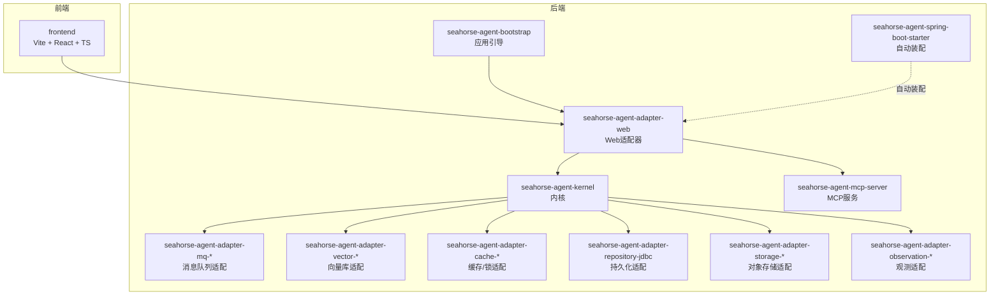
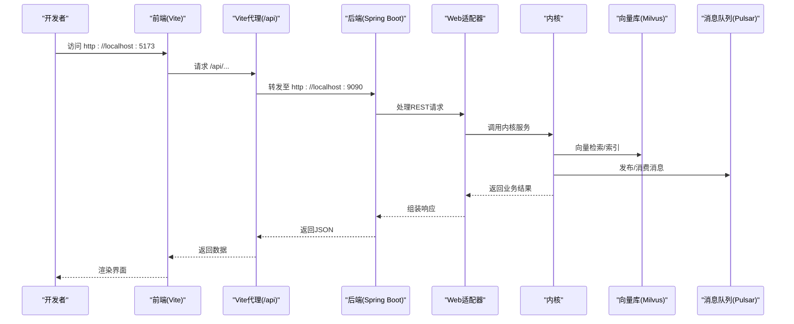
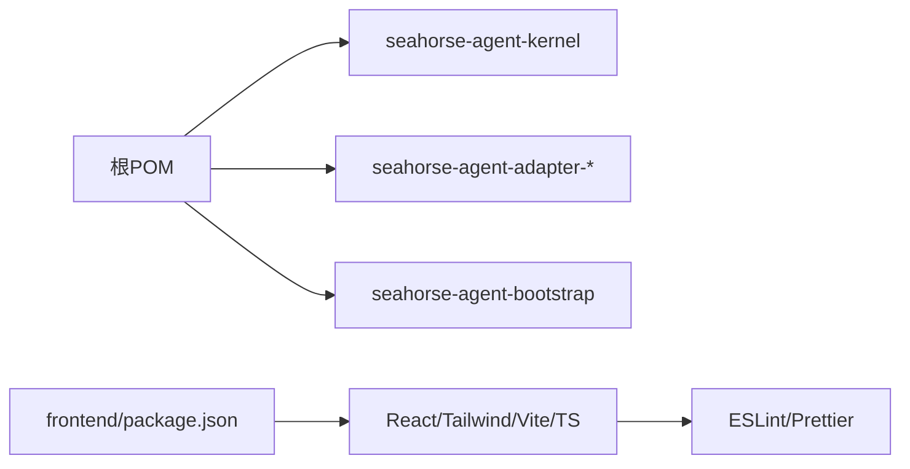

# 开发环境配置

<cite>
**本文引用的文件**
- [pom.xml](file://pom.xml)
- [package.json](file://frontend/package.json)
- [docker-compose.full.yml](file://docker-compose.full.yml)
- [docker-compose.full.yml](file://docker-compose.full.yml)
- [application.properties](file://seahorse-agent-bootstrap/src/main/resources/application.properties)
- [vite.config.js](file://frontend/vite.config.js)
- [.eslintrc.cjs](file://frontend/.eslintrc.cjs)
- [.prettierrc](file://frontend/.prettierrc)
- [lombok.config](file://lombok.config)
- [.gitignore](file://.gitignore)
- [quick-start.md](file://docs/USER_GUIDE.md)
- [TESTING.md](file://frontend/TESTING.md)
- [README.md](file://docker-compose.yml)
- [AgentPluginProperties.java](file://seahorse-agent-spring-boot-autoconfigure/src/main/java/com/miracle/ai/seahorse/agent/adapters/spring/config/AgentPluginProperties.java)
- [AgentAdapterProperties.java](file://seahorse-agent-spring-boot-autoconfigure/src/main/java/com/miracle/ai/seahorse/agent/adapters/spring/config/AgentAdapterProperties.java)
- [SeahorseAgentNativeAdapterAutoConfiguration.java](file://seahorse-agent-spring-boot-autoconfigure/src/main/java/com/miracle/ai/seahorse/agent/adapters/spring/SeahorseAgentNativeAdapterAutoConfiguration.java)
- [MilvusVectorAdapter.java](file://seahorse-agent-adapter-vector-milvus/src/main/java/com/miracle/ai/seahorse/agent/adapters/vector/milvus/MilvusVectorAdapter.java)
</cite>

## 目录
1. [简介](#简介)
2. [项目结构](#项目结构)
3. [核心组件](#核心组件)
4. [架构总览](#架构总览)
5. [详细组件分析](#详细组件分析)
6. [依赖分析](#依赖分析)
7. [性能考虑](#性能考虑)
8. [故障排除指南](#故障排除指南)
9. [结论](#结论)
10. [附录](#附录)

## 简介
本文件面向首次参与 SeaHorse Agent 项目的开发者，提供从零搭建开发环境的完整指南。内容覆盖硬件与软件最低要求、工具链安装与配置、后端与前端依赖安装、数据库与向量数据库、消息队列等基础设施的本地安装与配置、环境变量与配置文件、代码格式化工具（Spotless、ESLint、Prettier）的配置、Git 与分支管理策略，以及常见问题排查方法。

## 项目结构
该项目采用多模块 Maven 架构，后端由 Spring Boot 驱动，前端基于 Vite + React + TypeScript。基础设施通过 Docker Compose 提供 Milvus（向量数据库）、Pulsar（消息队列）等组件。开发流程遵循“后端启动 + 前端代理”的模式，确保前后端联调顺畅。

图表来源
- [pom.xml:37-60](file://pom.xml#L37-L60)
- [quick-start.md:15-22](file://docs/USER_GUIDE.md#L15-L22)

章节来源
- [pom.xml:1-262](file://pom.xml#L1-L262)
- [quick-start.md:1-88](file://docs/USER_GUIDE.md#L1-L88)

## 核心组件
- 后端基础
  - JDK 17+：Java 版本由属性统一管理，编译插件与目标版本均为 17。
  - Maven：使用 Maven Wrapper（mvnw.cmd），根 POM 管理模块与依赖版本。
  - Spring Boot 3.5.7：统一依赖管理与自动装配。
- 前端基础
  - Node.js 18+：前端 package.json 明确类型为 module，脚本与依赖版本稳定。
  - Vite 5、React 18、TypeScript 5、TailwindCSS 3 等主流技术栈。
- 基础设施
  - 向量数据库：Milvus（2.6.6/2.5.8），提供 S3 兼容对象存储（rustfs）与 Attu 管理界面。
  - 消息队列：Apache Pulsar（3.1.3），包含 ZooKeeper、Bookie、Broker 与初始化任务。
- 开发工具
  - Spotless（Java 代码版权头与格式化）
  - ESLint + Prettier（前端代码风格与格式化）

章节来源
- [pom.xml:15-35](file://pom.xml#L15-L35)
- [package.json:1-70](file://frontend/package.json#L1-L70)
- [docker-compose.full.yml](file://docker-compose.full.yml)
- [docker-compose.full.yml](file://docker-compose.full.yml)
- [.eslintrc.cjs:1-27](file://frontend/.eslintrc.cjs#L1-L27)
- [.prettierrc:1-8](file://frontend/.prettierrc#L1-L8)

## 架构总览
下图展示开发环境中的典型交互：前端通过 Vite 代理访问后端服务，后端通过 Web 适配器暴露 REST 接口，内核协调向量库、消息队列、缓存、持久化与对象存储等适配器完成业务流程。

图表来源
- [vite.config.js:11-21](file://frontend/vite.config.js#L11-L21)
- [application.properties:1-4](file://seahorse-agent-bootstrap/src/main/resources/application.properties#L1-L4)

章节来源
- [vite.config.js:1-22](file://frontend/vite.config.js#L1-L22)
- [application.properties:1-4](file://seahorse-agent-bootstrap/src/main/resources/application.properties#L1-L4)

## 详细组件分析

### 后端：Maven 与 Java 环境
- JDK 与编译
  - Java 版本：17（属性与编译插件统一）
  - 编码：UTF-8
  - 参数传递：启用
- 依赖管理
  - Spring Boot 依赖集中管理
  - Milvus、MyBatis Plus、S3、Pulsar、OkHttp、Redisson、Sa-Token 等生态组件版本集中定义
- 插件
  - maven-compiler-plugin：源/目标版本 17，编码 UTF-8
  - maven-surefire-plugin：集成测试分组与 Mockito agent 注入
  - spotless-maven-plugin：Java 版权头注入，执行 phase compile

章节来源
- [pom.xml:15-35](file://pom.xml#L15-L35)
- [pom.xml:185-260](file://pom.xml#L185-L260)

### 前端：Node.js 与包管理
- Node.js 18+：前端工程明确使用 ES Module，TypeScript 5、React 18、Vite 5
- 依赖安装
  - 使用 npm（package-lock.json 存在），安装命令：npm install
- 开发与构建
  - 开发：npm run dev（默认端口 5173，带代理）
  - 构建：npm run build
  - 预览：npm run preview
- 代码质量
  - ESLint：npm run lint（严格规则，关闭 react/jsx 检查）
  - Prettier：npm run format（统一格式）

章节来源
- [package.json:1-70](file://frontend/package.json#L1-L70)
- [vite.config.js:1-22](file://frontend/vite.config.js#L1-L22)
- [.eslintrc.cjs:1-27](file://frontend/.eslintrc.cjs#L1-L27)
- [.prettierrc:1-8](file://frontend/.prettierrc#L1-L8)

### 基础设施：本地安装与配置
- 向量数据库：Milvus
  - 使用 Docker Compose 启动 Milvus standalone、etcd、rustfs（S3 兼容）、Attu
  - 端口映射：19530（Milvus）、9000/9001（rustfs）、8000（Attu）
  - 网络：milvus-net
  - 降级方案：2.5.8 版本 compose 文件，适用于老内核环境
- 消息队列：Apache Pulsar
  - 使用 Docker Compose 启动 ZooKeeper、Bookie、Broker 与初始化任务
  - 端口映射：2181（ZK）、3181（Bookie）、6650/8080（Broker）
  - 初始化：创建集群、租户、命名空间与分区主题
- 轻量级部署
  - 提供内存限制的 compose 配置，适合本地或低配服务器
  - 2.6.6 与 2.5.8 版本对比与切换说明

章节来源
- [docker-compose.full.yml](file://docker-compose.full.yml)
- [docker-compose.full.yml](file://docker-compose.full.yml)
- [README.md](file://docker-compose.yml)

### 环境变量与配置
- 应用基础配置
  - 应用名：seahorse-agent-service
  - 内核开关：启用 kernel 模式
- 配置绑定与自动装配
  - 插件配置前缀：seahorse-agent.plugins.*
  - 适配器配置前缀：seahorse-agent.adapters.*
  - 自动装配根据属性条件加载 Redis、本地缓存、向量库、消息队列等实现
- 向量库适配器参数校验
  - 默认集合名等关键参数必须非空，否则抛出非法参数异常

章节来源
- [application.properties:1-4](file://seahorse-agent-bootstrap/src/main/resources/application.properties#L1-L4)
- [AgentPluginProperties.java:30-64](file://seahorse-agent-spring-boot-autoconfigure/src/main/java/com/miracle/ai/seahorse/agent/adapters/spring/config/AgentPluginProperties.java#L30-L64)
- [AgentAdapterProperties.java:29-34](file://seahorse-agent-spring-boot-autoconfigure/src/main/java/com/miracle/ai/seahorse/agent/adapters/spring/config/AgentAdapterProperties.java#L29-L34)
- [SeahorseAgentNativeAdapterAutoConfiguration.java:190-219](file://seahorse-agent-spring-boot-autoconfigure/src/main/java/com/miracle/ai/seahorse/agent/adapters/spring/SeahorseAgentNativeAdapterAutoConfiguration.java#L190-L219)
- [MilvusVectorAdapter.java:304-318](file://seahorse-agent-adapter-vector-milvus/src/main/java/com/miracle/ai/seahorse/agent/adapters/vector/milvus/MilvusVectorAdapter.java#L304-L318)

### 代码格式化工具配置
- Spotless（Java）
  - 版权头文件：resources/format/copyright.txt
  - 执行阶段：compile
  - 作用范围：Java 源码
- ESLint（TypeScript/React）
  - 规则：推荐规则 + TypeScript ESLint + React/React Hooks + React Refresh + Prettier
  - 忽略：dist、node_modules
  - 解析器：@typescript-eslint/parser
- Prettier
  - 配置：单引号、分号、缩进宽度、尾随逗号、打印宽度
  - 命令：npm run format

章节来源
- [pom.xml:238-258](file://pom.xml#L238-L258)
- [.eslintrc.cjs:1-27](file://frontend/.eslintrc.cjs#L1-L27)
- [.prettierrc:1-8](file://frontend/.prettierrc#L1-L8)

### Git 配置与分支管理策略
- 忽略清单
  - 后端：target、.m2、Maven Wrapper jar、IDE/NetBeans/VSCode 特定文件
  - 前端：node_modules、dist、.vite、.env.local
- 分支与提交建议
  - 建议采用功能分支开发，合并前进行本地验证与代码格式化
  - 提交信息建议遵循“类型: 内容”格式，配合 PR 描述说明变更点与影响面
  - 与 CI/CD 集成时，确保本地已执行 lint 与格式化

章节来源
- [.gitignore:1-46](file://.gitignore#L1-L46)

## 依赖分析
- 后端依赖层次
  - 核心：Spring Boot Starter、Lombok
  - 数据库：MyBatis Plus、JDBC 适配器
  - 搜索/向量：Milvus SDK、pgvector 适配器
  - 消息队列：Pulsar 客户端与管理客户端
  - 缓存/分布式：Redisson、Sa-Token
  - 观测：Micrometer 或 Noop
- 前端依赖层次
  - 前端框架：React、React Router、Axios
  - UI：Radix UI、Recharts、TailwindCSS
  - 工具：Zustand、Zod、date-fns、react-markdown
  - 开发：Vite、TypeScript、ESLint、Prettier、PostCSS

图表来源
- [pom.xml:37-60](file://pom.xml#L37-L60)
- [package.json:13-68](file://frontend/package.json#L13-L68)

章节来源
- [pom.xml:62-165](file://pom.xml#L62-L165)
- [package.json:13-68](file://frontend/package.json#L13-L68)

## 性能考虑
- 轻量级部署
  - 提供内存限制的 compose 配置，适合本地开发与体验
  - 高并发或大规模数据操作可能触发 OOM，生产环境请使用默认配置
- 启动与验证
  - 快速启动：在 seahorse-agent-bootstrap 模块执行 spring-boot:run
  - 组合回归与根验证：使用 Maven 命令进行依赖树与验证
- 性能门禁
  - 提供性能对比脚本与基线 JSON，建议在变更后运行以避免回归

章节来源
- [quick-start.md:51-55](file://docs/USER_GUIDE.md#L51-L55)
- [README.md](file://docker-compose.yml)

## 故障排除指南
- 前端静态资源 404
  - 症状：浏览器提示 No static resource /api/seahorse-agent/...
  - 原因：Vite 代理未生效或后端未启动
  - 解决：确认 vite.config.ts 的代理配置，重启前端开发服务器；确保后端在 9090 端口运行
- 后端 401 未登录
  - 症状：API 返回未登录
  - 解决：先登录获取 token，再进行受保护接口测试
- Milvus 启动失败（CentOS 7）
  - 症状：2.6.6 版本启动报兼容性错误
  - 解决：切换到 2.5.8 compose 文件
- Pulsar 主题未创建
  - 症状：消息发送/接收异常
  - 解决：确认 pulsar-init 完成，检查租户、命名空间与分区主题是否创建
- Spotless 报错
  - 症状：版权头注入失败
  - 解决：确认 copyright.txt 路径正确，重新执行 Maven 编译阶段

章节来源
- [TESTING.md:3-112](file://frontend/TESTING.md#L3-L112)
- [vite.config.js:11-21](file://frontend/vite.config.js#L11-L21)
- [docker-compose.full.yml](file://docker-compose.full.yml)
- [docker-compose.full.yml](file://docker-compose.full.yml)
- [pom.xml:238-258](file://pom.xml#L238-L258)

## 结论
通过本指南，您可以快速完成 SeaHorse Agent 的开发环境搭建：安装 JDK 17+、Node.js 18+、Maven 与 IDE（IntelliJ IDEA 或 VS Code），分别安装后端与前端依赖，使用 Docker Compose 启动 Milvus 与 Pulsar，配置 Spotless、ESLint、Prettier，理解应用配置前缀与自动装配机制，并掌握常见问题的排查方法。建议在本地完成基础验证后再接入更复杂的基础设施。

## 附录
- 快速启动命令参考
  - 后端：在 seahorse-agent-bootstrap 模块执行 spring-boot:run
  - 前端：在 frontend 目录执行 npm run dev
- 依赖安装顺序
  - 后端：mvnw.cmd clean install（或直接使用 Maven Wrapper）
  - 前端：npm install
- 代码格式化
  - 后端：mvn compile（触发 Spotless）
  - 前端：npm run lint 与 npm run format