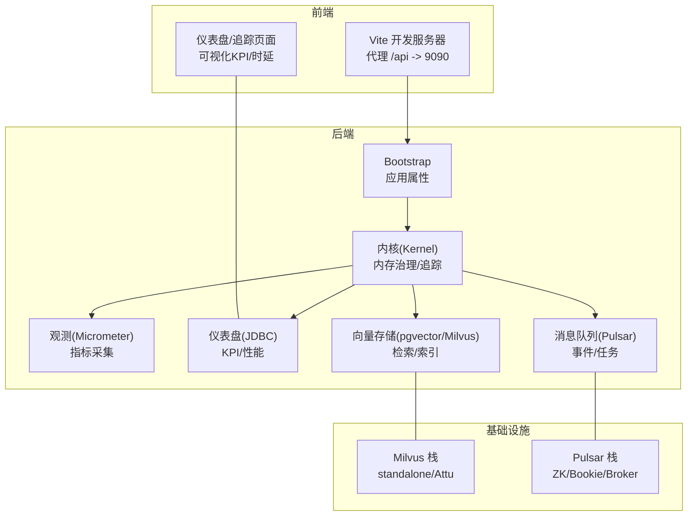
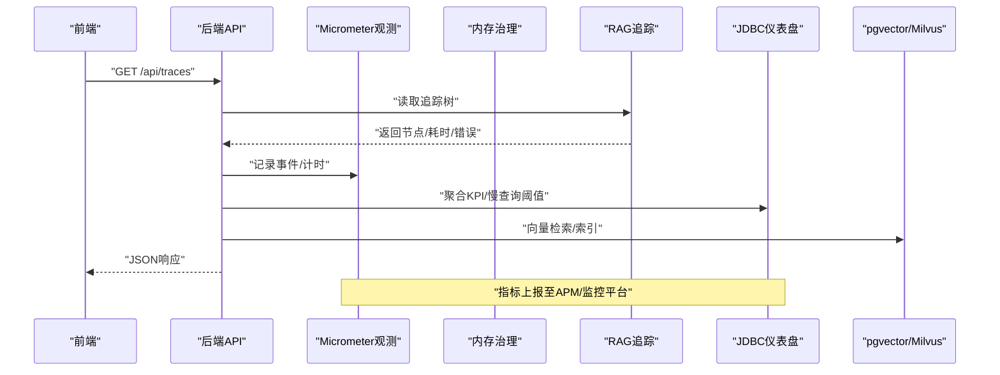
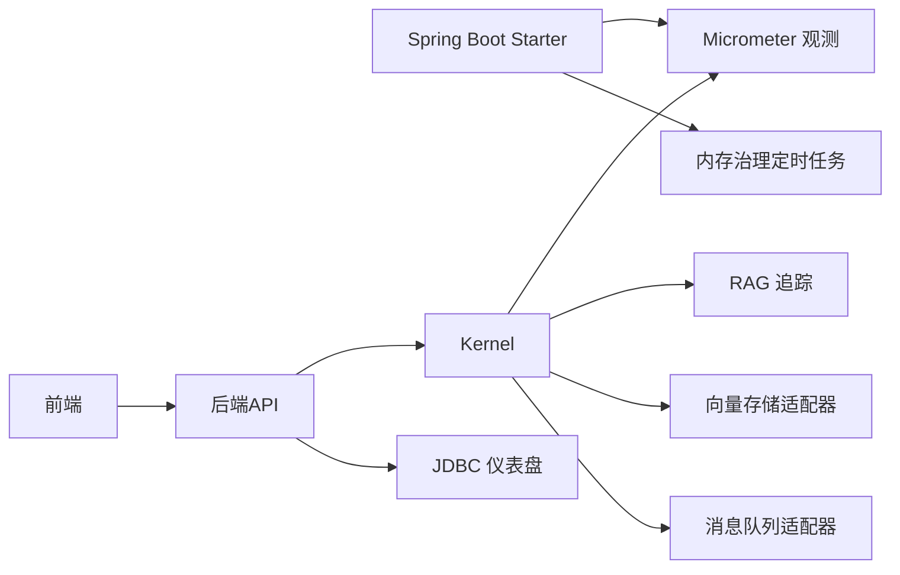

# 调试与优化

<cite>
**本文引用的文件**
- [application.properties](file://seahorse-agent-bootstrap/src/main/resources/application.properties)
- [application.properties](file://seahorse-agent-spring-boot-autoconfigure/src/main/resources/application.properties)
- [pom.xml](file://pom.xml)
- [docker-compose.full.yml](file://docker-compose.full.yml)
- [docker-compose.full.yml](file://docker-compose.full.yml)
- [vite.config.js](file://frontend/vite.config.js)
- [package.json](file://frontend/package.json)
- [MicrometerObservationAdapter.java](file://seahorse-agent-adapter-observation-micrometer/src/main/java/com/miracle/ai/seahorse/agent/adapters/observation/micrometer/MicrometerObservationAdapter.java)
- [SeahorseMemoryGovernanceJob.java](file://seahorse-agent-spring-boot-autoconfigure/src/main/java/com/miracle/ai/seahorse/agent/adapters/spring/SeahorseMemoryGovernanceJob.java)
- [KernelMemoryGovernanceService.java](file://seahorse-agent-kernel/src/main/java/com/miracle/ai/seahorse/agent/kernel/application/memory/KernelMemoryGovernanceService.java)
- [KernelRagTraceRecorder.java](file://seahorse-agent-kernel/src/main/java/com/miracle/ai/seahorse/agent/kernel/application/trace/KernelRagTraceRecorder.java)
- [traceUtils.ts](file://frontend/src/pages/admin/traces/traceUtils.ts)
- [PgVectorAdapter.java](file://seahorse-agent-adapter-vector-pgvector/src/main/java/com/miracle/ai/seahorse/agent/adapters/vector/pgvector/PgVectorAdapter.java)
- [JdbcDashboardRepositoryAdapter.java](file://seahorse-agent-adapter-repository-jdbc/src/main/java/com/miracle/ai/seahorse/agent/adapters/repository/jdbc/JdbcDashboardRepositoryAdapter.java)
- [JdbcDashboardRepositoryAdapterTests.java](file://seahorse-agent-adapter-repository-jdbc/src/test/java/com/miracle/ai/seahorse/agent/adapters/repository/jdbc/JdbcDashboardRepositoryAdapterTests.java)
- [DashboardPage.tsx](file://frontend/src/pages/admin/dashboard/DashboardPage.tsx)
- [LocalCacheAdapter.java](file://seahorse-agent-adapter-cache-local/src/main/java/com/miracle/ai/seahorse/agent/adapters/cache/local/LocalCacheAdapter.java)
- [RedisCacheAdapter.java](file://seahorse-agent-adapter-cache-redis/src/main/java/com/miracle/ai/seahorse/agent/adapters/cache/redis/RedisCacheAdapter.java)
- [RedisSemaphoreAdapter.java](file://seahorse-agent-adapter-cache-redis/src/main/java/com/miracle/ai/seahorse/agent/adapters/cache/redis/RedisSemaphoreAdapter.java)
- [LocalSemaphoreAdapter.java](file://seahorse-agent-adapter-cache-local/src/main/java/com/miracle/ai/seahorse/agent/adapters/cache/local/LocalSemaphoreAdapter.java)
- [JdbcRagTraceRepositoryAdapter.java](file://seahorse-agent-adapter-repository-jdbc/src/main/java/com/miracle/ai/seahorse/agent/adapters/repository/jdbc/JdbcRagTraceRepositoryAdapter.java)
</cite>

## 目录
1. [简介](#简介)
2. [项目结构](#项目结构)
3. [核心组件](#核心组件)
4. [架构总览](#架构总览)
5. [详细组件分析](#详细组件分析)
6. [依赖分析](#依赖分析)
7. [性能考虑](#性能考虑)
8. [故障排查指南](#故障排查指南)
9. [结论](#结论)
10. [附录](#附录)

## 简介
本指南面向后端、前端、数据库与向量数据库的调试与性能优化，结合仓库中的实际实现，提供可操作的配置、断点策略、日志与观测、远程调试、SQL/索引优化、向量检索调优、性能分析工具使用、内存与GC优化、并发调试与死锁检测、以及常见性能问题的诊断与解决路径。

## 项目结构
该项目采用多模块 Maven 结构，包含 Spring Boot 启动模块、内核与适配器、前端、容器化栈（Milvus、Pulsar）等。后端通过 Micrometer 观测、内存治理定时任务、RAG 追踪与仪表盘；前端通过 Vite 开发服务器与代理访问后端 API；数据库与向量库通过 Docker Compose 提供本地/测试环境。

图表来源
- [application.properties](file://seahorse-agent-bootstrap/src/main/resources/application.properties)
- [MicrometerObservationAdapter.java](file://seahorse-agent-adapter-observation-micrometer/src/main/java/com/miracle/ai/seahorse/agent/adapters/observation/micrometer/MicrometerObservationAdapter.java)
- [JdbcDashboardRepositoryAdapter.java](file://seahorse-agent-adapter-repository-jdbc/src/main/java/com/miracle/ai/seahorse/agent/adapters/repository/jdbc/JdbcDashboardRepositoryAdapter.java)
- [docker-compose.full.yml](file://docker-compose.full.yml)
- [docker-compose.full.yml](file://docker-compose.full.yml)
- [vite.config.js](file://frontend/vite.config.js)

章节来源
- [pom.xml](file://pom.xml)
- [application.properties](file://seahorse-agent-bootstrap/src/main/resources/application.properties)
- [application.properties](file://seahorse-agent-spring-boot-autoconfigure/src/main/resources/application.properties)

## 核心组件
- 后端启动与模式：通过应用属性启用内核与迁移模式，确保服务按预期加载内核功能。
- 观测与指标：基于 Micrometer 的观察适配器，统一计数/计时与标签维度，便于 APM/监控平台接入。
- 内存治理与定时任务：内核服务负责短期/长期记忆晋升与衰减；Spring 定时任务配合分布式锁执行周期清理。
- RAG 追踪与前端可视化：内核记录节点级耗时、错误与状态；前端提供追踪列表与 KPI 可视化。
- 数据库与向量库：JDBC 仪表盘聚合 KPI 与慢查询阈值；pgvector 实现 Upsert/索引/查询；Milvus 通过 Compose 提供本地检索。
- 缓存与并发控制：本地/Redis 缓存、分布式锁、信号量，支持限流与资源协调。
- 前端开发与代理：Vite 开发服务器代理 /api 到后端 9090 端口，便于联调。

章节来源
- [application.properties](file://seahorse-agent-bootstrap/src/main/resources/application.properties)
- [application.properties](file://seahorse-agent-spring-boot-autoconfigure/src/main/resources/application.properties)
- [MicrometerObservationAdapter.java](file://seahorse-agent-adapter-observation-micrometer/src/main/java/com/miracle/ai/seahorse/agent/adapters/observation/micrometer/MicrometerObservationAdapter.java)
- [SeahorseMemoryGovernanceJob.java](file://seahorse-agent-spring-boot-autoconfigure/src/main/java/com/miracle/ai/seahorse/agent/adapters/spring/SeahorseMemoryGovernanceJob.java)
- [KernelMemoryGovernanceService.java](file://seahorse-agent-kernel/src/main/java/com/miracle/ai/seahorse/agent/kernel/application/memory/KernelMemoryGovernanceService.java)
- [KernelRagTraceRecorder.java](file://seahorse-agent-kernel/src/main/java/com/miracle/ai/seahorse/agent/kernel/application/trace/KernelRagTraceRecorder.java)
- [traceUtils.ts](file://frontend/src/pages/admin/traces/traceUtils.ts)
- [PgVectorAdapter.java](file://seahorse-agent-adapter-vector-pgvector/src/main/java/com/miracle/ai/seahorse/agent/adapters/vector/pgvector/PgVectorAdapter.java)
- [JdbcDashboardRepositoryAdapter.java](file://seahorse-agent-adapter-repository-jdbc/src/main/java/com/miracle/ai/seahorse/agent/adapters/repository/jdbc/JdbcDashboardRepositoryAdapter.java)
- [vite.config.js](file://frontend/vite.config.js)

## 架构总览
后端通过 Micrometer 统一采集指标，内核服务在各阶段打点记录，前端通过 API 获取追踪与仪表盘数据进行可视化。数据库与向量库通过 Compose 快速搭建，消息队列用于异步事件。

图表来源
- [MicrometerObservationAdapter.java](file://seahorse-agent-adapter-observation-micrometer/src/main/java/com/miracle/ai/seahorse/agent/adapters/observation/micrometer/MicrometerObservationAdapter.java)
- [JdbcDashboardRepositoryAdapter.java](file://seahorse-agent-adapter-repository-jdbc/src/main/java/com/miracle/ai/seahorse/agent/adapters/repository/jdbc/JdbcDashboardRepositoryAdapter.java)
- [KernelRagTraceRecorder.java](file://seahorse-agent-kernel/src/main/java/com/miracle/ai/seahorse/agent/kernel/application/trace/KernelRagTraceRecorder.java)
- [PgVectorAdapter.java](file://seahorse-agent-adapter-vector-pgvector/src/main/java/com/miracle/ai/seahorse/agent/adapters/vector/pgvector/PgVectorAdapter.java)

## 详细组件分析

### 后端调试配置与远程调试
- 启动参数与测试插件：Maven Surefire 插件注入 Mockito JavaAgent，便于单元测试桩替换；可结合 JVM 参数启用远程调试。
- 应用属性：确认内核开关与迁移模式，避免启动阶段误加载或跳过关键模块。
- 观测与指标：Micrometer 适配器以标签维度区分租户、命令名与属性，便于在 Prometheus/Grafana 中筛选与告警。

章节来源
- [pom.xml](file://pom.xml)
- [application.properties](file://seahorse-agent-bootstrap/src/main/resources/application.properties)
- [application.properties](file://seahorse-agent-spring-boot-autoconfigure/src/main/resources/application.properties)
- [MicrometerObservationAdapter.java](file://seahorse-agent-adapter-observation-micrometer/src/main/java/com/miracle/ai/seahorse/agent/adapters/observation/micrometer/MicrometerObservationAdapter.java)

### 断点设置与日志分析
- 内核追踪：在追踪记录器中对节点开始/结束时间、错误清洗、耗时计算处设置断点，验证时间戳与错误消息截断逻辑。
- 仪表盘聚合：在 JDBC 仪表盘适配器中对 KPI 计算、慢查询阈值、成功率/错误率计算断点，检查窗口期与环比逻辑。
- 前端可视化：在追踪工具函数中对时长格式化、百分位计算断点，确保前端展示正确。

章节来源
- [KernelRagTraceRecorder.java](file://seahorse-agent-kernel/src/main/java/com/miracle/ai/seahorse/agent/kernel/application/trace/KernelRagTraceRecorder.java)
- [JdbcDashboardRepositoryAdapter.java](file://seahorse-agent-adapter-repository-jdbc/src/main/java/com/miracle/ai/seahorse/agent/adapters/repository/jdbc/JdbcDashboardRepositoryAdapter.java)
- [traceUtils.ts](file://frontend/src/pages/admin/traces/traceUtils.ts)

### 远程调试
- 在启动参数中添加远程调试 JVM 参数，结合 IDE 远程调试配置连接目标进程。
- 对定时任务与并发组件（如分布式锁/信号量）设置条件断点，观察锁竞争与超时场景。

章节来源
- [pom.xml](file://pom.xml)
- [SeahorseMemoryGovernanceJob.java](file://seahorse-agent-spring-boot-autoconfigure/src/main/java/com/miracle/ai/seahorse/agent/adapters/spring/SeahorseMemoryGovernanceJob.java)
- [RedisSemaphoreAdapter.java](file://seahorse-agent-adapter-cache-redis/src/main/java/com/miracle/ai/seahorse/agent/adapters/cache/redis/RedisSemaphoreAdapter.java)

### 前端调试技巧
- 开发服务器与代理：Vite 将 /api 代理到后端 9090，便于前后端联调；可在代理规则中增加路径前缀或变更目标端口。
- 浏览器开发者工具：Network 面板观察请求耗时、重试与错误码；Console 查看异常堆栈；Performance 面板捕获主线程卡顿。
- React DevTools：定位渲染热点组件、检查 props 与状态变化；结合 React Profiler 分析重渲染路径。
- 性能分析：前端页面中对图表与列表组件使用虚拟化与懒加载，减少大列表渲染压力。

章节来源
- [vite.config.js](file://frontend/vite.config.js)
- [package.json](file://frontend/package.json)
- [DashboardPage.tsx](file://frontend/src/pages/admin/dashboard/DashboardPage.tsx)

### 数据库调试与优化
- 慢查询阈值：仪表盘适配器定义慢查询阈值常量，作为前端展示与告警依据；可结合数据库 EXPLAIN/ANALYZE 分析执行计划。
- Upsert/批量写入：JDBC 仪表盘在内存中构造统计，数据库侧建议使用批量插入/更新以降低往返开销。
- 索引与表结构：确保常用过滤字段（用户、时间窗）建立索引；对 JSON 元数据字段使用合适的表达式索引（如 pgvector metadata 字段）。

章节来源
- [JdbcDashboardRepositoryAdapter.java](file://seahorse-agent-adapter-repository-jdbc/src/main/java/com/miracle/ai/seahorse/agent/adapters/repository/jdbc/JdbcDashboardRepositoryAdapter.java)
- [JdbcDashboardRepositoryAdapterTests.java](file://seahorse-agent-adapter-repository-jdbc/src/test/java/com/miracle/ai/seahorse/agent/adapters/repository/jdbc/JdbcDashboardRepositoryAdapterTests.java)

### 向量数据库调试与性能优化
- pgvector 实现：Upsert/更新/删除均通过预编译语句与批处理执行；确保已安装扩展与索引存在；查询时限制 topK 并使用合适距离度量。
- Milvus 栈：通过 Compose 快速拉起 standalone 与 Attu 管理界面；关注健康检查端口与数据卷挂载，避免重启丢失数据。
- 检索性能：控制 topK、过滤条件与元数据匹配；必要时分桶/分区与预过滤；对高并发场景评估连接池与客户端重试策略。

章节来源
- [PgVectorAdapter.java](file://seahorse-agent-adapter-vector-pgvector/src/main/java/com/miracle/ai/seahorse/agent/adapters/vector/pgvector/PgVectorAdapter.java)
- [docker-compose.full.yml](file://docker-compose.full.yml)

### 性能分析工具使用指南
- JVM 工具：JFR/JMC 采集火焰图与 GC 日志；VisualVM/JConsole 监控线程与堆；Arthas/TProfiler 进行在线诊断。
- 前端工具：Chrome DevTools Performance/Heap；React DevTools Profiler；Webpack Bundle Analyzer 分析包体积。
- APM 监控：Micrometer 指标对接 Prometheus/Grafana；结合日志平台（如 ELK）做关联分析。

章节来源
- [MicrometerObservationAdapter.java](file://seahorse-agent-adapter-observation-micrometer/src/main/java/com/miracle/ai/seahorse/agent/adapters/observation/micrometer/MicrometerObservationAdapter.java)

### 内存管理与垃圾回收优化
- JVM 参数：合理设置新生代/老年代比例、G1 并发回收器参数；开启 GC 日志以便分析停顿与吞吐。
- 对象生命周期：避免长生命周期持有短生命周期对象；及时释放监听器与定时任务；注意线程池拒绝策略与队列长度。
- 本地缓存：本地缓存仅单 JVM 可见，多实例需切换 Redis；对热点键设置 TTL，避免内存膨胀。

章节来源
- [LocalCacheAdapter.java](file://seahorse-agent-adapter-cache-local/src/main/java/com/miracle/ai/seahorse/agent/adapters/cache/local/LocalCacheAdapter.java)
- [RedisCacheAdapter.java](file://seahorse-agent-adapter-cache-redis/src/main/java/com/miracle/ai/seahorse/agent/adapters/cache/redis/RedisCacheAdapter.java)

### 并发编程调试与死锁检测
- 分布式锁：使用带租约的锁，避免死锁与脑裂；在定时任务中先尝试获取锁再执行业务。
- 信号量：对高并发资源进行许可控制，注意许可回收与过期处理；在失败路径回滚已获取许可。
- 死锁检测：优先使用无阻塞 API；对需要等待的场景设置超时；避免嵌套锁与不同顺序加锁。

章节来源
- [SeahorseMemoryGovernanceJob.java](file://seahorse-agent-spring-boot-autoconfigure/src/main/java/com/miracle/ai/seahorse/agent/adapters/spring/SeahorseMemoryGovernanceJob.java)
- [RedisSemaphoreAdapter.java](file://seahorse-agent-adapter-cache-redis/src/main/java/com/miracle/ai/seahorse/agent/adapters/cache/redis/RedisSemaphoreAdapter.java)
- [LocalSemaphoreAdapter.java](file://seahorse-agent-adapter-cache-local/src/main/java/com/miracle/ai/seahorse/agent/adapters/cache/local/LocalSemaphoreAdapter.java)

## 依赖分析
后端模块通过 Spring Boot 自动装配与适配器 SPI 注册，Micrometer 观测默认启用；定时任务与分布式锁通过 Starter 模块提供；向量与消息队列通过独立适配器模块引入。

图表来源
- [pom.xml](file://pom.xml)
- [MicrometerObservationAdapter.java](file://seahorse-agent-adapter-observation-micrometer/src/main/java/com/miracle/ai/seahorse/agent/adapters/observation/micrometer/MicrometerObservationAdapter.java)
- [SeahorseMemoryGovernanceJob.java](file://seahorse-agent-spring-boot-autoconfigure/src/main/java/com/miracle/ai/seahorse/agent/adapters/spring/SeahorseMemoryGovernanceJob.java)

章节来源
- [pom.xml](file://pom.xml)

## 性能考虑
- 后端
  - 使用 Micrometer 统一打点，结合标签维度进行细粒度分析。
  - 控制追踪节点数量与层级，避免过度记录导致可观测性开销过大。
  - 定时任务加分布式锁，避免重复执行与资源争用。
- 前端
  - 使用虚拟滚动与懒加载，减少 DOM 与渲染压力。
  - 图表组件按需加载，避免一次性渲染大量数据。
- 数据库
  - 合理设置慢查询阈值，结合 EXPLAIN 分析热点 SQL。
  - 批量写入与索引维护，避免频繁小事务。
- 向量库
  - 控制 topK 与过滤条件，必要时分桶/分区；确保索引类型与参数匹配业务场景。

## 故障排查指南
- 追踪与可视化
  - 若前端显示时长异常，检查追踪工具函数的时长解析与格式化逻辑。
  - 若追踪缺失，检查内核追踪记录器是否正确记录开始/结束时间与错误信息。
- 仪表盘与KPI
  - 若成功率/错误率异常，检查仪表盘适配器的窗口期与阈值设置。
  - 单测验证 KPI 计算逻辑，确保边界值与空集处理正确。
- 缓存与并发
  - 本地缓存仅单实例有效，多实例需切换 Redis；检查 TTL 与过期回收。
  - 信号量许可未释放会导致后续获取阻塞，检查异常路径回滚。
- 向量检索
  - pgvector 扩展未安装或表不存在会导致初始化失败；Milvus 健康检查失败需检查端口映射与数据卷。
- 消息队列
  - Pulsar 初始化脚本创建主题与分区，若消费异常检查集群状态与权限。

章节来源
- [traceUtils.ts](file://frontend/src/pages/admin/traces/traceUtils.ts)
- [KernelRagTraceRecorder.java](file://seahorse-agent-kernel/src/main/java/com/miracle/ai/seahorse/agent/kernel/application/trace/KernelRagTraceRecorder.java)
- [JdbcDashboardRepositoryAdapter.java](file://seahorse-agent-adapter-repository-jdbc/src/main/java/com/miracle/ai/seahorse/agent/adapters/repository/jdbc/JdbcDashboardRepositoryAdapter.java)
- [JdbcDashboardRepositoryAdapterTests.java](file://seahorse-agent-adapter-repository-jdbc/src/test/java/com/miracle/ai/seahorse/agent/adapters/repository/jdbc/JdbcDashboardRepositoryAdapterTests.java)
- [LocalCacheAdapter.java](file://seahorse-agent-adapter-cache-local/src/main/java/com/miracle/ai/seahorse/agent/adapters/cache/local/LocalCacheAdapter.java)
- [RedisCacheAdapter.java](file://seahorse-agent-adapter-cache-redis/src/main/java/com/miracle/ai/seahorse/agent/adapters/cache/redis/RedisCacheAdapter.java)
- [RedisSemaphoreAdapter.java](file://seahorse-agent-adapter-cache-redis/src/main/java/com/miracle/ai/seahorse/agent/adapters/cache/redis/RedisSemaphoreAdapter.java)
- [PgVectorAdapter.java](file://seahorse-agent-adapter-vector-pgvector/src/main/java/com/miracle/ai/seahorse/agent/adapters/vector/pgvector/PgVectorAdapter.java)
- [docker-compose.full.yml](file://docker-compose.full.yml)
- [docker-compose.full.yml](file://docker-compose.full.yml)

## 结论
通过统一的观测体系、完善的追踪与仪表盘、合理的缓存与并发控制、以及数据库与向量库的索引与查询优化，可以系统性提升系统的可观测性与性能。结合本文提供的断点、日志、代理与容器化调试手段，能够快速定位问题并制定针对性优化方案。

## 附录
- 常用断点位置
  - 追踪记录器：节点耗时计算、错误清洗、追踪 ID 生成。
  - 仪表盘适配器：KPI 计算、慢查询阈值、成功率/错误率。
  - pgvector：Upsert/索引/查询 SQL 绑定与执行。
- 前端调试要点
  - Vite 代理配置与跨域；React Profiler 与性能面板；图表组件懒加载与虚拟化。
- 基础设施
  - Milvus 与 Attu 健康检查端口；Pulsar 集群初始化脚本与主题分区。