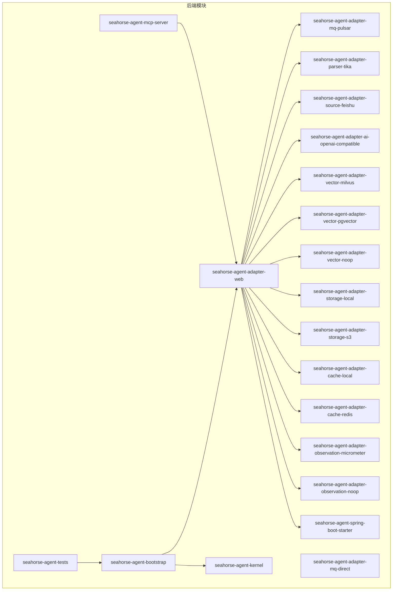
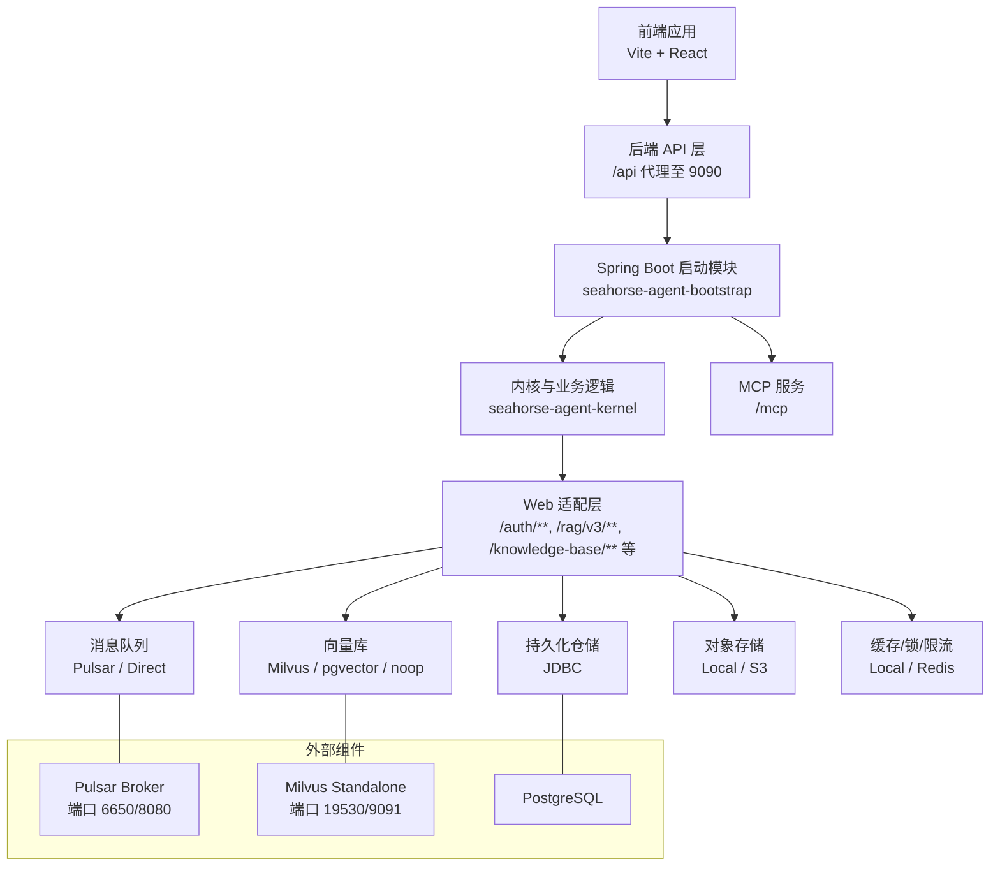
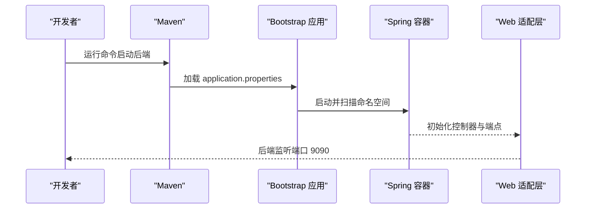
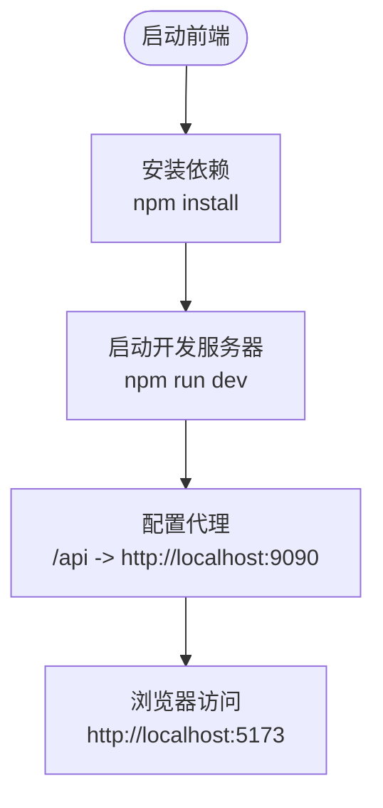
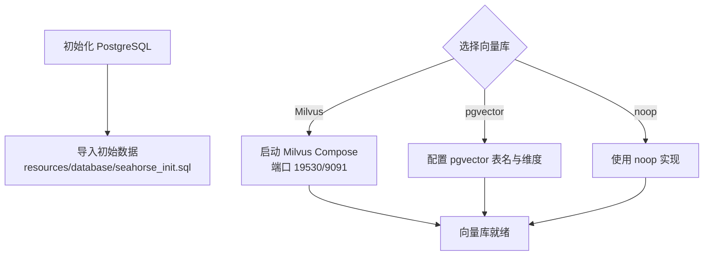
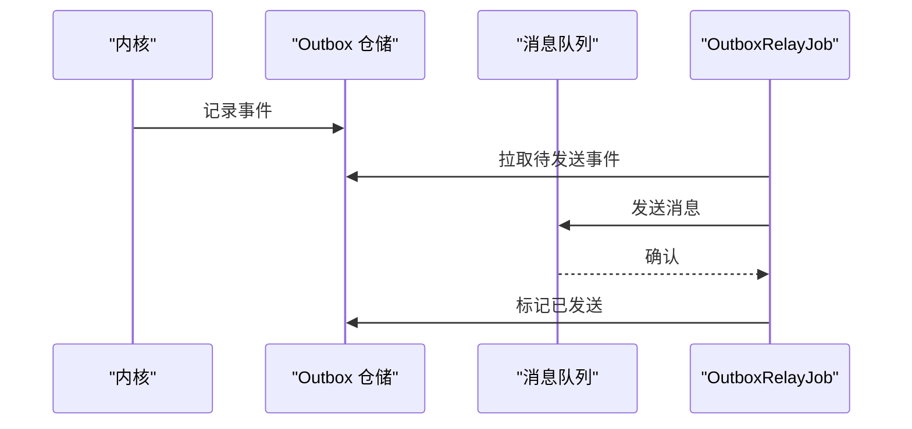
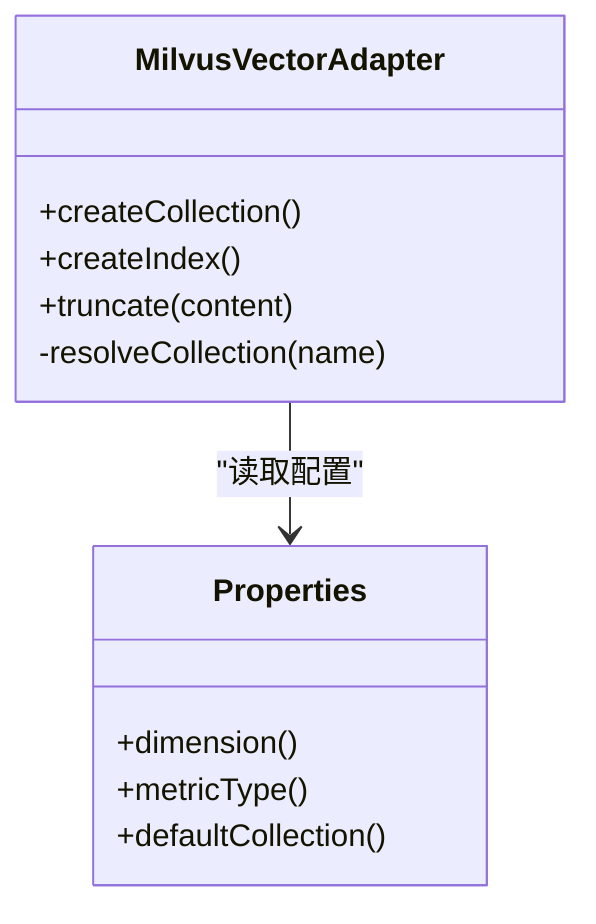
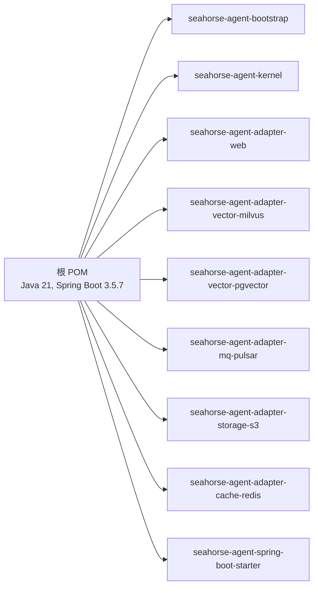

# 快速开始

> 当前状态提示：Docker 快速部署请优先使用根目录 `README.md`、`docs/PRE_EXECUTION_CHECKLIST.md` 和 `docs/USER_GUIDE.md`。本文保留较多开发环境说明，例如 Vite dev server `5173`；本地 Docker 前端入口当前是 `http://localhost`。

<cite>
**本文引用的文件**
- [pom.xml](file://pom.xml)
- [docs/USER_GUIDE.md](file://docs/USER_GUIDE.md)
- [seahorse-agent-bootstrap/src/main/java/com/miracle/ai/seahorse/agent/SeahorseAgentApplication.java](file://seahorse-agent-bootstrap/src/main/java/com/miracle/ai/seahorse/agent/SeahorseAgentApplication.java)
- [seahorse-agent-bootstrap/src/main/resources/application.properties](file://seahorse-agent-bootstrap/src/main/resources/application.properties)
- [seahorse-agent-spring-boot-autoconfigure/src/main/resources/application.properties](file://seahorse-agent-spring-boot-autoconfigure/src/main/resources/application.properties)
- [frontend/package.json](file://frontend/package.json)
- [frontend/vite.config.js](file://frontend/vite.config.js)
- [docker-compose.full.yml](file://docker-compose.full.yml)
- [docker-compose.yml](file://docker-compose.yml)
- [docker-compose.full.yml](file://docker-compose.full.yml)
- [resources/database/seahorse_init.sql](file://resources/database/seahorse_init.sql)
- [seahorse-agent-adapter-web/src/main/java/com/miracle/ai/seahorse/agent/adapters/web/SeahorseWebExceptionHandler.java](file://seahorse-agent-adapter-web/src/main/java/com/miracle/ai/seahorse/agent/adapters/web/SeahorseWebExceptionHandler.java)
- [seahorse-agent-spring-boot-autoconfigure/src/main/java/com/miracle/ai/seahorse/agent/adapters/spring/SeahorseAgentNativeAdapterAutoConfiguration.java](file://seahorse-agent-spring-boot-autoconfigure/src/main/java/com/miracle/ai/seahorse/agent/adapters/spring/SeahorseAgentNativeAdapterAutoConfiguration.java)
- [seahorse-agent-adapter-vector-pgvector/src/main/java/com/miracle/ai/seahorse/agent/adapters/vector/pgvector/PgVectorProperties.java](file://seahorse-agent-adapter-vector-pgvector/src/main/java/com/miracle/ai/seahorse/agent/adapters/vector/pgvector/PgVectorProperties.java)
- [seahorse-agent-adapter-vector-milvus/src/main/java/com/miracle/ai/seahorse/agent/adapters/vector/milvus/MilvusVectorAdapter.java](file://seahorse-agent-adapter-vector-milvus/src/main/java/com/miracle/ai/seahorse/agent/adapters/vector/milvus/MilvusVectorAdapter.java)
</cite>

## 目录
1. [简介](#简介)
2. [项目结构](#项目结构)
3. [核心组件](#核心组件)
4. [架构总览](#架构总览)
5. [详细组件分析](#详细组件分析)
6. [依赖关系分析](#依赖关系分析)
7. [性能注意事项](#性能注意事项)
8. [故障排查指南](#故障排查指南)
9. [结论](#结论)
10. [附录](#附录)

## 简介
本指南面向首次接触 Seahorse Agent 的开发者与运维人员，提供从环境准备、项目克隆、依赖安装、数据库与向量数据库初始化，到后端与前端启动的完整流程。同时给出常见问题排查方法、首次使用示例（创建知识库、上传文档、问答）、开发与生产环境差异要点，以及项目结构与关键配置文件说明。

## 项目结构
该项目采用多模块 Maven 结构，后端基于 Spring Boot 3.5.7，前端采用 Vite + React。核心模块包括：
- 启动模块：seahorse-agent-bootstrap
- 内核与领域逻辑：seahorse-agent-kernel
- Web 适配层：seahorse-agent-adapter-web
- MQ 适配：seahorse-agent-adapter-mq-pulsar、seahorse-agent-adapter-mq-direct
- 解析器：seahorse-agent-adapter-parser-tika
- 文档来源：seahorse-agent-adapter-source-feishu
- 大模型适配：seahorse-agent-adapter-ai-openai-compatible
- 向量库适配：seahorse-agent-adapter-vector-milvus、seahorse-agent-adapter-vector-pgvector、seahorse-agent-adapter-vector-noop
- 存储适配：seahorse-agent-adapter-storage-local、seahorse-agent-adapter-storage-s3
- 缓存适配：seahorse-agent-adapter-cache-local、seahorse-agent-adapter-cache-redis
- 观测性：seahorse-agent-adapter-observation-micrometer、seahorse-agent-adapter-observation-noop
- Spring Boot Starter：`seahorse-agent-spring-boot-starter`（精简入口） / `seahorse-agent-spring-boot-starter-all`（全量官方适配器聚合）
- 测试：seahorse-agent-tests
- MCP 服务：seahorse-agent-mcp-server

图表来源
- [pom.xml:37-60](file://pom.xml#L37-L60)
- [docs/USER_GUIDE.md:15-22](file://docs/USER_GUIDE.md#L15-L22)

章节来源
- [pom.xml:37-60](file://pom.xml#L37-L60)
- [docs/USER_GUIDE.md:15-22](file://docs/USER_GUIDE.md#L15-L22)

## 核心组件
- 启动入口：Spring Boot 应用入口类负责扫描指定命名空间并启用调度。
- 配置入口：统一使用 seahorse-agent.* 命名空间的配置，旧配置别名已移除。
- Web API：保持原有路径兼容，前端无需立即改造路径。
- 异常处理：全局异常响应适配器，标准化错误返回格式。

章节来源
- [seahorse-agent-bootstrap/src/main/java/com/miracle/ai/seahorse/agent/SeahorseAgentApplication.java:24-36](file://seahorse-agent-bootstrap/src/main/java/com/miracle/ai/seahorse/agent/SeahorseAgentApplication.java#L24-L36)
- [docs/USER_GUIDE.md:57-82](file://docs/USER_GUIDE.md#L57-L82)
- [seahorse-agent-adapter-web/src/main/java/com/miracle/ai/seahorse/agent/adapters/web/SeahorseWebExceptionHandler.java:28-59](file://seahorse-agent-adapter-web/src/main/java/com/miracle/ai/seahorse/agent/adapters/web/SeahorseWebExceptionHandler.java#L28-L59)

## 架构总览
下图展示后端启动、前端代理、消息队列与向量数据库的交互关系。

图表来源
- [frontend/vite.config.js:11-20](file://frontend/vite.config.js#L11-L20)
- [docker-compose.full.yml](file://docker-compose.full.yml)
- [docker-compose.full.yml](file://docker-compose.full.yml)
- [docs/USER_GUIDE.md:70-81](file://docs/USER_GUIDE.md#L70-L81)

## 详细组件分析

### 后端启动流程
- 使用 Maven 在 seahorse-agent-bootstrap 模块启动 Spring Boot 应用。
- 应用扫描 com.miracle.ai.seahorse.agent 命名空间，默认启用内核迁移模式。

图表来源
- [docs/USER_GUIDE.md:7-11](file://docs/USER_GUIDE.md#L7-L11)
- [seahorse-agent-bootstrap/src/main/resources/application.properties:1-4](file://seahorse-agent-bootstrap/src/main/resources/application.properties#L1-L4)
- [seahorse-agent-bootstrap/src/main/java/com/miracle/ai/seahorse/agent/SeahorseAgentApplication.java:24-36](file://seahorse-agent-bootstrap/src/main/java/com/miracle/ai/seahorse/agent/SeahorseAgentApplication.java#L24-L36)

章节来源
- [docs/USER_GUIDE.md:7-11](file://docs/USER_GUIDE.md#L7-L11)
- [seahorse-agent-bootstrap/src/main/resources/application.properties:1-4](file://seahorse-agent-bootstrap/src/main/resources/application.properties#L1-L4)
- [seahorse-agent-bootstrap/src/main/java/com/miracle/ai/seahorse/agent/SeahorseAgentApplication.java:24-36](file://seahorse-agent-bootstrap/src/main/java/com/miracle/ai/seahorse/agent/SeahorseAgentApplication.java#L24-L36)

### 前端启动流程
- 前端通过 Vite 在 5173 端口启动，配置了对 /api 的代理，转发到后端 9090 端口。
- 依赖管理在 package.json 中定义。

图表来源
- [frontend/package.json:6-12](file://frontend/package.json#L6-L12)
- [frontend/vite.config.js:11-20](file://frontend/vite.config.js#L11-L20)

章节来源
- [frontend/package.json:6-12](file://frontend/package.json#L6-L12)
- [frontend/vite.config.js:11-20](file://frontend/vite.config.js#L11-L20)

### 数据库与向量数据库初始化
- PostgreSQL 初始数据：插入管理员用户初始数据。
- 向量库：提供 Milvus 与 pgvector 两种实现，可通过配置选择。
- 轻量级部署：提供内存受限的 Docker Compose 方案，适用于本地开发与体验。

图表来源
- [resources/database/seahorse_init.sql:1-5](file://resources/database/seahorse_init.sql#L1-L5)
- [docker-compose.full.yml](file://docker-compose.full.yml)
- [docker-compose.yml](file://docker-compose.yml)
- [seahorse-agent-adapter-vector-pgvector/src/main/java/com/miracle/ai/seahorse/agent/adapters/vector/pgvector/PgVectorProperties.java:25-37](file://seahorse-agent-adapter-vector-pgvector/src/main/java/com/miracle/ai/seahorse/agent/adapters/vector/pgvector/PgVectorProperties.java#L25-L37)

章节来源
- [resources/database/seahorse_init.sql:1-5](file://resources/database/seahorse_init.sql#L1-L5)
- [docker-compose.full.yml](file://docker-compose.full.yml)
- [docker-compose.yml](file://docker-compose.yml)
- [seahorse-agent-adapter-vector-pgvector/src/main/java/com/miracle/ai/seahorse/agent/adapters/vector/pgvector/PgVectorProperties.java:25-37](file://seahorse-agent-adapter-vector-pgvector/src/main/java/com/miracle/ai/seahorse/agent/adapters/vector/pgvector/PgVectorProperties.java#L25-L37)

### 消息队列与任务出站
- 支持 Pulsar 与 Direct 两种消息队列适配。
- 提供 Outbox 事件中继作业，将仓储事件可靠投递到消息队列。

图表来源
- [seahorse-agent-spring-boot-autoconfigure/src/main/java/com/miracle/ai/seahorse/agent/adapters/spring/SeahorseAgentNativeAdapterAutoConfiguration.java:583-595](file://seahorse-agent-spring-boot-autoconfigure/src/main/java/com/miracle/ai/seahorse/agent/adapters/spring/SeahorseAgentNativeAdapterAutoConfiguration.java#L583-L595)
- [docker-compose.full.yml](file://docker-compose.full.yml)

章节来源
- [seahorse-agent-spring-boot-autoconfigure/src/main/java/com/miracle/ai/seahorse/agent/adapters/spring/SeahorseAgentNativeAdapterAutoConfiguration.java:583-595](file://seahorse-agent-spring-boot-autoconfigure/src/main/java/com/miracle/ai/seahorse/agent/adapters/spring/SeahorseAgentNativeAdapterAutoConfiguration.java#L583-L595)
- [docker-compose.full.yml](file://docker-compose.full.yml)

### 向量库适配（Milvus）
- 自动创建集合、字段与索引参数，支持 HNSW 索引与自定义度量类型。
- 提供默认集合解析与内容截断策略。

图表来源
- [seahorse-agent-adapter-vector-milvus/src/main/java/com/miracle/ai/seahorse/agent/adapters/vector/milvus/MilvusVectorAdapter.java:204-234](file://seahorse-agent-adapter-vector-milvus/src/main/java/com/miracle/ai/seahorse/agent/adapters/vector/milvus/MilvusVectorAdapter.java#L204-L234)
- [seahorse-agent-adapter-vector-milvus/src/main/java/com/miracle/ai/seahorse/agent/adapters/vector/milvus/MilvusVectorAdapter.java#L304-L318)

章节来源
- [seahorse-agent-adapter-vector-milvus/src/main/java/com/miracle/ai/seahorse/agent/adapters/vector/milvus/MilvusVectorAdapter.java:204-234](file://seahorse-agent-adapter-vector-milvus/src/main/java/com/miracle/ai/seahorse/agent/adapters/vector/milvus/MilvusVectorAdapter.java#L204-L234)
- [seahorse-agent-adapter-vector-milvus/src/main/java/com/miracle/ai/seahorse/agent/adapters/vector/milvus/MilvusVectorAdapter.java:304-318](file://seahorse-agent-adapter-vector-milvus/src/main/java/com/miracle/ai/seahorse/agent/adapters/vector/milvus/MilvusVectorAdapter.java#L304-L318)

## 依赖关系分析
- Java 版本要求：Java 21+
- Spring Boot 版本：3.5.7
- 向量库 SDK：Milvus 2.6.6
- 文档解析：Apache Tika
- 对象存储：AWS S3 SDK
- 消息队列：Apache Pulsar 3.1.3
- 缓存：Redisson
- 安全认证：Sa-Token

图表来源
- [pom.xml:15-35](file://pom.xml#L15-L35)
- [pom.xml:62-165](file://pom.xml#L62-L165)
- [pom.xml:37-60](file://pom.xml#L37-L60)

章节来源
- [pom.xml:15-35](file://pom.xml#L15-L35)
- [pom.xml:62-165](file://pom.xml#L62-L165)
- [pom.xml:37-60](file://pom.xml#L37-L60)

## 性能注意事项
- 轻量级部署：内存受限环境下，容器设置 memory limits，适合本地开发与体验，高并发或大规模数据可能触发 OOM。
- 生产环境：使用默认 Compose 配置，避免内存限制导致的性能退化。
- 向量库索引：Milvus 使用 HNSW 索引，合理设置 M 与 efConstruction 参数以平衡召回与性能。

章节来源
- [docker-compose.yml](file://docker-compose.yml)
- [seahorse-agent-adapter-vector-milvus/src/main/java/com/miracle/ai/seahorse/agent/adapters/vector/milvus/MilvusVectorAdapter.java:220-228](file://seahorse-agent-adapter-vector-milvus/src/main/java/com/miracle/ai/seahorse/agent/adapters/vector/milvus/MilvusVectorAdapter.java#L220-L228)

## 故障排查指南
- 启动失败（端口占用）：确认后端 9090、前端 5173、Milvus 19530/9091、Pulsar 6650/8080 未被占用。
- 数据库连接异常：检查 JDBC 连接串、用户名与密码，确保 PostgreSQL 已初始化并导入初始数据。
- 向量库不可用：确认 Milvus 容器健康状态，查看日志与健康检查端点。
- 前端代理无效：检查 Vite 代理配置是否正确指向后端地址。
- 全局异常：后端统一返回 code 与 message 字段，便于前端统一处理。

章节来源
- [frontend/vite.config.js:11-20](file://frontend/vite.config.js#L11-L20)
- [docker-compose.full.yml](file://docker-compose.full.yml)
- [resources/database/seahorse_init.sql:1-5](file://resources/database/seahorse_init.sql#L1-L5)
- [seahorse-agent-adapter-web/src/main/java/com/miracle/ai/seahorse/agent/adapters/web/SeahorseWebExceptionHandler.java:34-58](file://seahorse-agent-adapter-web/src/main/java/com/miracle/ai/seahorse/agent/adapters/web/SeahorseWebExceptionHandler.java#L34-L58)

## 结论
通过本指南，您可以在本地完成环境准备、项目启动与基础功能验证。建议先使用轻量级部署体验系统，再逐步迁移到生产配置。若遇到问题，优先检查端口占用、数据库初始化与向量库健康状态。

## 附录

### 环境准备清单
- JDK 21+：用于编译与运行后端。
- Maven：用于构建与启动后端。
- Node.js 与 npm：用于前端开发与构建。
- Docker 与 Docker Compose：用于启动 Milvus 与 Pulsar。
- Git：用于克隆仓库。

章节来源
- [pom.xml:15-35](file://pom.xml#L15-L35)
- [frontend/package.json:1-70](file://frontend/package.json#L1-L70)
- [docker-compose.full.yml](file://docker-compose.full.yml)
- [docker-compose.full.yml](file://docker-compose.full.yml)

### 项目克隆与依赖安装
- 克隆仓库后，使用 Maven 在根目录执行构建与启动。
- 前端在 frontend 目录执行依赖安装与启动。

章节来源
- [docs/USER_GUIDE.md:7-11](file://docs/USER_GUIDE.md#L7-L11)
- [frontend/package.json:6-12](file://frontend/package.json#L6-L12)

### 数据库与向量数据库初始化
- PostgreSQL：导入初始数据脚本。
- Milvus：使用 Compose 启动，等待健康检查通过。
- pgvector：配置表名与维度，确保与嵌入维度一致。

章节来源
- [resources/database/seahorse_init.sql:1-5](file://resources/database/seahorse_init.sql#L1-L5)
- [docker-compose.full.yml](file://docker-compose.full.yml)
- [seahorse-agent-adapter-vector-pgvector/src/main/java/com/miracle/ai/seahorse/agent/adapters/vector/pgvector/PgVectorProperties.java:25-37](file://seahorse-agent-adapter-vector-pgvector/src/main/java/com/miracle/ai/seahorse/agent/adapters/vector/pgvector/PgVectorProperties.java#L25-L37)

### 启动流程总览
- 后端：在 seahorse-agent-bootstrap 模块启动 Spring Boot 应用。
- 前端：在 frontend 目录启动 Vite 开发服务器。
- 外部服务：使用 Docker Compose 启动 Milvus 与 Pulsar。

章节来源
- [docs/USER_GUIDE.md:7-11](file://docs/USER_GUIDE.md#L7-L11)
- [frontend/vite.config.js:11-20](file://frontend/vite.config.js#L11-L20)
- [docker-compose.full.yml](file://docker-compose.full.yml)
- [docker-compose.full.yml](file://docker-compose.full.yml)

### 首次使用示例
- 创建知识库：通过后端 API 创建知识库。
- 上传文档：通过 ingestion 接口上传文档，触发解析与向量化。
- 进行问答：调用聊天接口发起对话，后端根据知识库检索生成回答。

章节来源
- [docs/USER_GUIDE.md:70-81](file://docs/USER_GUIDE.md#L70-L81)

### 开发与生产环境差异
- 轻量级部署：容器设置 memory limits，适合本地与体验。
- 生产部署：使用默认 Compose 配置，避免内存限制影响性能。
- 配置入口：统一使用 seahorse-agent.* 命名空间，旧配置别名已移除。

章节来源
- [docker-compose.yml](file://docker-compose.yml)
- [docs/USER_GUIDE.md:57-82](file://docs/USER_GUIDE.md#L57-L82)

### 关键配置文件说明
- 后端启动配置：application.properties（应用名称、内核开关与迁移模式）。
- Spring Boot Starter 配置：kernel 运行模式。
- Web 异常处理：统一错误响应格式。
- 向量库配置：pgvector 表名与维度校验。

章节来源
- [seahorse-agent-bootstrap/src/main/resources/application.properties:1-4](file://seahorse-agent-bootstrap/src/main/resources/application.properties#L1-L4)
- [seahorse-agent-spring-boot-autoconfigure/src/main/resources/application.properties:1-2](file://seahorse-agent-spring-boot-autoconfigure/src/main/resources/application.properties#L1-L2)
- [seahorse-agent-adapter-web/src/main/java/com/miracle/ai/seahorse/agent/adapters/web/SeahorseWebExceptionHandler.java:34-58](file://seahorse-agent-adapter-web/src/main/java/com/miracle/ai/seahorse/agent/adapters/web/SeahorseWebExceptionHandler.java#L34-L58)
- [seahorse-agent-adapter-vector-pgvector/src/main/java/com/miracle/ai/seahorse/agent/adapters/vector/pgvector/PgVectorProperties.java:25-37](file://seahorse-agent-adapter-vector-pgvector/src/main/java/com/miracle/ai/seahorse/agent/adapters/vector/pgvector/PgVectorProperties.java#L25-L37)
