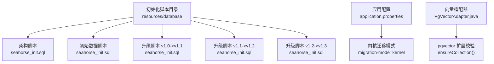
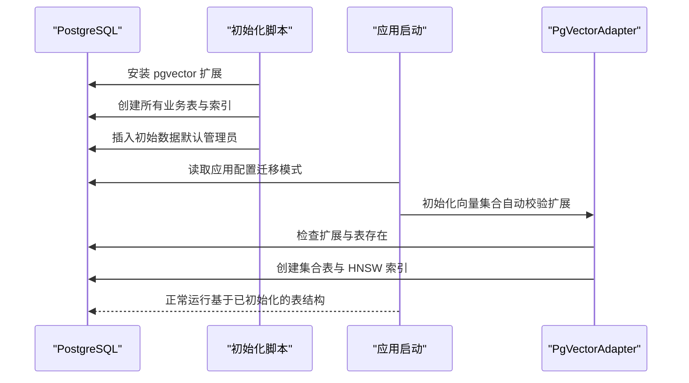
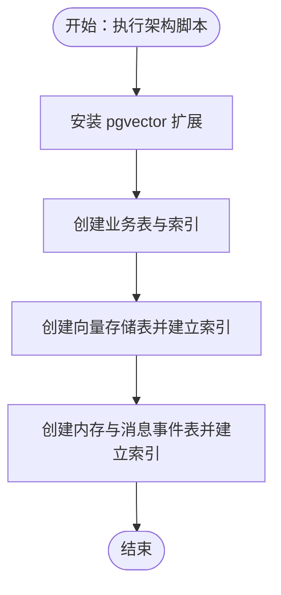
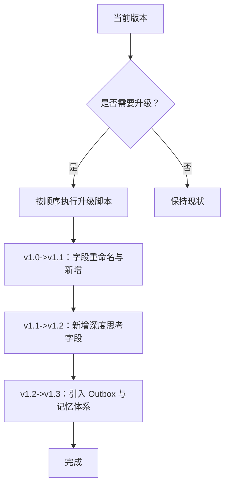
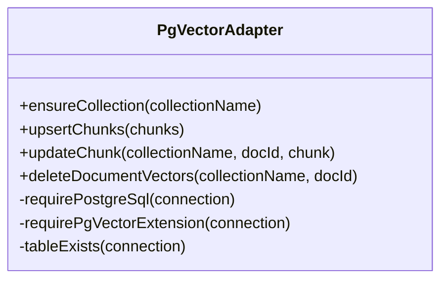
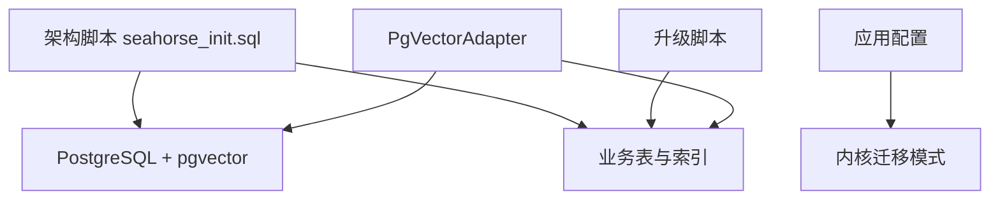

# 数据库初始化

<cite>
**本文引用的文件**
- [seahorse_init.sql](file://resources/database/seahorse_init.sql)
- [seahorse_init.sql](file://resources/database/seahorse_init.sql)
- [seahorse_init.sql](file://resources/database/seahorse_init.sql)
- [seahorse_init.sql](file://resources/database/seahorse_init.sql)
- [seahorse_init.sql](file://resources/database/seahorse_init.sql)
- [application.properties](file://seahorse-agent-bootstrap/src/main/resources/application.properties)
- [application.properties](file://seahorse-agent-spring-boot-starter/src/main/resources/application.properties)
- [PgVectorAdapter.java](file://seahorse-agent-adapter-vector-pgvector/src/main/java/com/miracle/ai/seahorse/agent/adapters/vector/pgvector/PgVectorAdapter.java)
</cite>

## 目录
1. [简介](#简介)
2. [项目结构](#项目结构)
3. [核心组件](#核心组件)
4. [架构总览](#架构总览)
5. [详细组件分析](#详细组件分析)
6. [依赖关系分析](#依赖关系分析)
7. [性能考量](#性能考量)
8. [故障排查指南](#故障排查指南)
9. [结论](#结论)
10. [附录](#附录)

## 简介
本文件面向 Seahorse Agent 的数据库初始化流程，系统化梳理从数据库到表结构、索引、初始数据、版本升级脚本的完整步骤与执行顺序，并解释关键配置（如 pgvector 扩展与 HNSW 索引）对系统运行的影响。同时提供常见失败原因与排查建议、安全配置要点以及初始化后的验证清单，帮助运维与开发人员高效、稳定地完成数据库初始化。

## 项目结构
数据库初始化相关资源集中在 resources/database 目录，包含：
- PostgreSQL 架构脚本：seahorse_init.sql
- 初始数据脚本：seahorse_init.sql
- 版本升级脚本：seahorse_init.sql、seahorse_init.sql、seahorse_init.sql
- 备份样例：schema_table.sql（MySQL 原版）、init_data.sql（备份示例）

应用启动配置位于 seahorse-agent-bootstrap 与 seahorse-agent-spring-boot-starter 的 application.properties 中，控制内核迁移模式与运行模式。

**图表来源**
- [seahorse_init.sql](file://resources/database/seahorse_init.sql)
- [seahorse_init.sql](file://resources/database/seahorse_init.sql)
- [seahorse_init.sql](file://resources/database/seahorse_init.sql)
- [seahorse_init.sql](file://resources/database/seahorse_init.sql)
- [seahorse_init.sql](file://resources/database/seahorse_init.sql)
- [application.properties](file://seahorse-agent-bootstrap/src/main/resources/application.properties)
- [application.properties](file://seahorse-agent-spring-boot-starter/src/main/resources/application.properties)
- [PgVectorAdapter.java](file://seahorse-agent-adapter-vector-pgvector/src/main/java/com/miracle/ai/seahorse/agent/adapters/vector/pgvector/PgVectorAdapter.java)

**章节来源**
- [seahorse_init.sql](file://resources/database/seahorse_init.sql)
- [seahorse_init.sql](file://resources/database/seahorse_init.sql)
- [seahorse_init.sql](file://resources/database/seahorse_init.sql)
- [seahorse_init.sql](file://resources/database/seahorse_init.sql)
- [seahorse_init.sql](file://resources/database/seahorse_init.sql)
- [application.properties](file://seahorse-agent-bootstrap/src/main/resources/application.properties)
- [application.properties](file://seahorse-agent-spring-boot-starter/src/main/resources/application.properties)

## 核心组件
- 架构脚本（seahorse_init.sql）
  - 安装 pgvector 扩展
  - 创建用户与对话、消息、反馈、示例问题等表
  - 创建知识库、文档、分块、分块日志、定时刷新任务等表
  - 创建意图树、查询词映射、RAG Trace 等表
  - 创建摄取流水线、任务、节点等表
  - 创建向量存储表（含 GIN 元数据索引与 HNSW 向量索引）
  - 创建内存与消息事件表（Outbox、短期/长期记忆、语义记忆、冲突日志、质量快照等），并建立相应索引
- 初始数据脚本（seahorse_init.sql）
  - 插入默认管理员用户
- 升级脚本
  - v1.0->v1.1：调整分块日志计时字段命名与新增持久化耗时字段
  - v1.1->v1.2：为消息表增加“深度思考”相关内容与耗时字段
  - v1.2->v1.3：引入 Outbox 与四层记忆体系（短期、长期、语义记忆、冲突日志、质量快照）及对应的 HNSW 向量索引
- 应用配置
  - 内核迁移模式：控制内核侧迁移行为
- 向量适配器（PgVectorAdapter）
  - 在写入/查询前校验 PostgreSQL 与 pgvector 扩展可用性
  - 自动确保集合（表）存在并创建 HNSW 索引

**章节来源**
- [seahorse_init.sql](file://resources/database/seahorse_init.sql)
- [seahorse_init.sql](file://resources/database/seahorse_init.sql)
- [seahorse_init.sql](file://resources/database/seahorse_init.sql)
- [seahorse_init.sql](file://resources/database/seahorse_init.sql)
- [seahorse_init.sql](file://resources/database/seahorse_init.sql)
- [application.properties](file://seahorse-agent-bootstrap/src/main/resources/application.properties)
- [application.properties](file://seahorse-agent-spring-boot-starter/src/main/resources/application.properties)
- [PgVectorAdapter.java](file://seahorse-agent-adapter-vector-pgvector/src/main/java/com/miracle/ai/seahorse/agent/adapters/vector/pgvector/PgVectorAdapter.java)

## 架构总览
数据库初始化的端到端流程如下：

**图表来源**
- [seahorse_init.sql](file://resources/database/seahorse_init.sql)
- [seahorse_init.sql](file://resources/database/seahorse_init.sql)
- [application.properties](file://seahorse-agent-bootstrap/src/main/resources/application.properties)
- [application.properties](file://seahorse-agent-spring-boot-starter/src/main/resources/application.properties)
- [PgVectorAdapter.java](file://seahorse-agent-adapter-vector-pgvector/src/main/java/com/miracle/ai/seahorse/agent/adapters/vector/pgvector/PgVectorAdapter.java)

## 详细组件分析

### 架构脚本（seahorse_init.sql）解析
- 扩展安装
  - 明确安装 pgvector 扩展，为后续向量存储与检索提供基础
- 表结构与索引
  - 用户与对话、消息、反馈、示例问题等核心表
  - 知识库、文档、分块、分块日志、定时刷新任务等知识管理表
  - 意图树、查询词映射、RAG Trace 等检索与追踪表
  - 摄取流水线、任务、节点等数据处理表
  - 向量存储表（t_knowledge_vector）：包含元数据 JSONB 与向量字段；建立 GIN 元数据索引与 HNSW 向量索引
  - 内存与消息事件表：Outbox、短期/长期记忆、语义记忆、冲突日志、质量快照等，并建立相应索引
- 关键索引设计
  - HNSW 向量索引：使用余弦距离，支持大规模向量近似最近邻检索
  - GIN 元数据索引：加速 JSONB 字段的查询
  - 多列组合索引：覆盖用户、会话、时间等高频查询维度

**图表来源**
- [seahorse_init.sql](file://resources/database/seahorse_init.sql)

**章节来源**
- [seahorse_init.sql](file://resources/database/seahorse_init.sql)

### 初始数据脚本（seahorse_init.sql）解析
- 默认管理员用户插入
  - 提供初始登录凭据，便于首次访问与系统配置
- 安全建议
  - 首次部署后应立即修改默认密码
  - 结合应用安全策略限制访问来源与接口权限

**章节来源**
- [seahorse_init.sql](file://resources/database/seahorse_init.sql)

### 升级脚本（upgrade_*）解析
- v1.0->v1.1：分块日志计时字段拆分与命名规范化
- v1.1->v1.2：消息表新增“深度思考”相关字段，增强推理过程可观测性
- v1.2->v1.3：引入 Outbox 与四层记忆体系，完善事件驱动与记忆治理能力，并配套 HNSW 向量索引

**图表来源**
- [seahorse_init.sql](file://resources/database/seahorse_init.sql)
- [seahorse_init.sql](file://resources/database/seahorse_init.sql)
- [seahorse_init.sql](file://resources/database/seahorse_init.sql)

**章节来源**
- [seahorse_init.sql](file://resources/database/seahorse_init.sql)
- [seahorse_init.sql](file://resources/database/seahorse_init.sql)
- [seahorse_init.sql](file://resources/database/seahorse_init.sql)

### 应用配置与迁移模式
- 内核迁移模式
  - 控制内核侧迁移行为，确保初始化阶段与运行阶段的配置一致性
- 运行模式
  - 通过启动配置启用内核功能，保证数据库初始化后系统可正常加载与运行

**章节来源**
- [application.properties](file://seahorse-agent-bootstrap/src/main/resources/application.properties)
- [application.properties](file://seahorse-agent-spring-boot-starter/src/main/resources/application.properties)

### 向量适配器（PgVectorAdapter）与 pgvector 扩展
- 扩展校验
  - 启动时校验数据库产品名与 pgvector 扩展是否存在，否则抛出异常
- 集合保障
  - 自动创建集合表与 HNSW 索引，确保向量检索可用
- 查询与写入
  - 绑定元数据（包含集合名、文档 ID、分块索引等），批量写入并支持 UPSERT

**图表来源**
- [PgVectorAdapter.java](file://seahorse-agent-adapter-vector-pgvector/src/main/java/com/miracle/ai/seahorse/agent/adapters/vector/pgvector/PgVectorAdapter.java)

**章节来源**
- [PgVectorAdapter.java](file://seahorse-agent-adapter-vector-pgvector/src/main/java/com/miracle/ai/seahorse/agent/adapters/vector/pgvector/PgVectorAdapter.java)

## 依赖关系分析
- 架构脚本依赖 PostgreSQL 与 pgvector 扩展
- 向量适配器在运行时依赖架构脚本创建的表与索引
- 升级脚本依赖现有表结构，需按版本顺序执行
- 应用配置影响内核迁移行为，间接影响初始化阶段的数据一致性

**图表来源**
- [seahorse_init.sql](file://resources/database/seahorse_init.sql)
- [seahorse_init.sql](file://resources/database/seahorse_init.sql)
- [seahorse_init.sql](file://resources/database/seahorse_init.sql)
- [seahorse_init.sql](file://resources/database/seahorse_init.sql)
- [application.properties](file://seahorse-agent-bootstrap/src/main/resources/application.properties)
- [application.properties](file://seahorse-agent-spring-boot-starter/src/main/resources/application.properties)
- [PgVectorAdapter.java](file://seahorse-agent-adapter-vector-pgvector/src/main/java/com/miracle/ai/seahorse/agent/adapters/vector/pgvector/PgVectorAdapter.java)

**章节来源**
- [seahorse_init.sql](file://resources/database/seahorse_init.sql)
- [seahorse_init.sql](file://resources/database/seahorse_init.sql)
- [seahorse_init.sql](file://resources/database/seahorse_init.sql)
- [seahorse_init.sql](file://resources/database/seahorse_init.sql)
- [application.properties](file://seahorse-agent-bootstrap/src/main/resources/application.properties)
- [application.properties](file://seahorse-agent-spring-boot-starter/src/main/resources/application.properties)
- [PgVectorAdapter.java](file://seahorse-agent-adapter-vector-pgvector/src/main/java/com/miracle/ai/seahorse/agent/adapters/vector/pgvector/PgVectorAdapter.java)

## 性能考量
- HNSW 向量索引
  - 使用余弦距离，适合大规模高维向量检索；合理设置探测参数可平衡召回率与延迟
- 索引选择
  - GIN 元数据索引提升 JSONB 查询效率；多列组合索引优化常见查询路径
- 批量写入
  - 向量写入采用批量提交，减少往返开销；注意批次大小与内存占用的平衡
- 升级脚本
  - v1.2->v1.3 引入大量新表与索引，建议在低峰期执行并监控资源占用

[本节为通用指导，不直接分析具体文件]

## 故障排查指南
- 权限问题
  - 安装 pgvector 扩展需要具备扩展安装权限；确保数据库超级用户或具备足够权限的账户执行初始化
- 依赖缺失
  - 若未安装 pgvector 扩展，向量相关表与索引无法创建；请先执行扩展安装步骤
- 版本兼容性
  - 向量适配器要求 PostgreSQL 环境；若非 PostgreSQL 将触发异常
  - 升级脚本需按顺序执行，跳过中间版本可能导致字段缺失或索引不一致
- 索引与表结构
  - HNSW 索引创建失败通常与扩展未安装或向量维度不匹配有关；检查扩展状态与向量字段类型
- 初始数据
  - 默认管理员密码过于简单，建议初始化后立即修改；避免弱口令导致的安全风险

**章节来源**
- [PgVectorAdapter.java](file://seahorse-agent-adapter-vector-pgvector/src/main/java/com/miracle/ai/seahorse/agent/adapters/vector/pgvector/PgVectorAdapter.java)
- [seahorse_init.sql](file://resources/database/seahorse_init.sql)
- [seahorse_init.sql](file://resources/database/seahorse_init.sql)

## 结论
Seahorse Agent 的数据库初始化以架构脚本为核心，结合初始数据与升级脚本，形成完整的数据库演进路径。pgvector 扩展与 HNSW 索引是实现高效向量检索的关键。通过严格的执行顺序、完善的索引设计与必要的安全加固，可确保系统在初始化阶段即具备稳定的运行基础。

[本节为总结性内容，不直接分析具体文件]

## 附录

### 初始化执行顺序与依赖关系
- 必须先安装 pgvector 扩展，再创建表与索引
- 先执行架构脚本，再执行升级脚本（按版本顺序）
- 最后插入初始数据
- 应用启动时由向量适配器进行扩展与表存在性校验，确保运行期可用

**章节来源**
- [seahorse_init.sql](file://resources/database/seahorse_init.sql)
- [seahorse_init.sql](file://resources/database/seahorse_init.sql)
- [seahorse_init.sql](file://resources/database/seahorse_init.sql)
- [seahorse_init.sql](file://resources/database/seahorse_init.sql)
- [seahorse_init.sql](file://resources/database/seahorse_init.sql)

### 安全配置要点
- 修改默认管理员密码
- 限制数据库访问来源与接口权限
- 定期审计扩展安装与表结构变更

**章节来源**
- [seahorse_init.sql](file://resources/database/seahorse_init.sql)

### 初始化后验证清单
- 数据库连接正常
- pgvector 扩展已安装且可用
- 所有业务表与索引创建完成
- 向量存储表存在且 HNSW 索引可用
- 初始管理员用户可登录
- 升级脚本按版本顺序执行完毕

**章节来源**
- [seahorse_init.sql](file://resources/database/seahorse_init.sql)
- [seahorse_init.sql](file://resources/database/seahorse_init.sql)
- [seahorse_init.sql](file://resources/database/seahorse_init.sql)
- [seahorse_init.sql](file://resources/database/seahorse_init.sql)
- [seahorse_init.sql](file://resources/database/seahorse_init.sql)
- [PgVectorAdapter.java](file://seahorse-agent-adapter-vector-pgvector/src/main/java/com/miracle/ai/seahorse/agent/adapters/vector/pgvector/PgVectorAdapter.java)