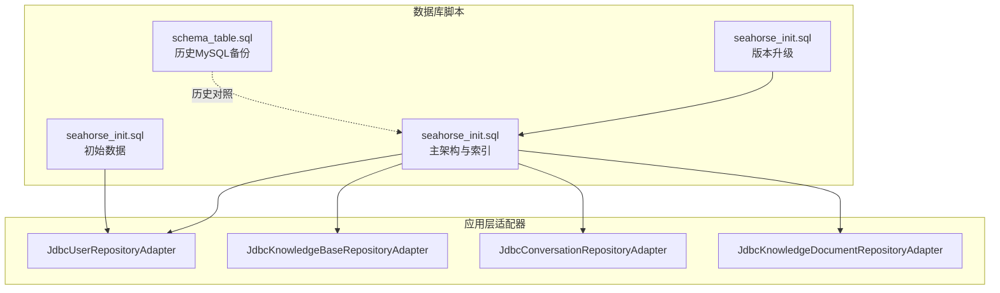
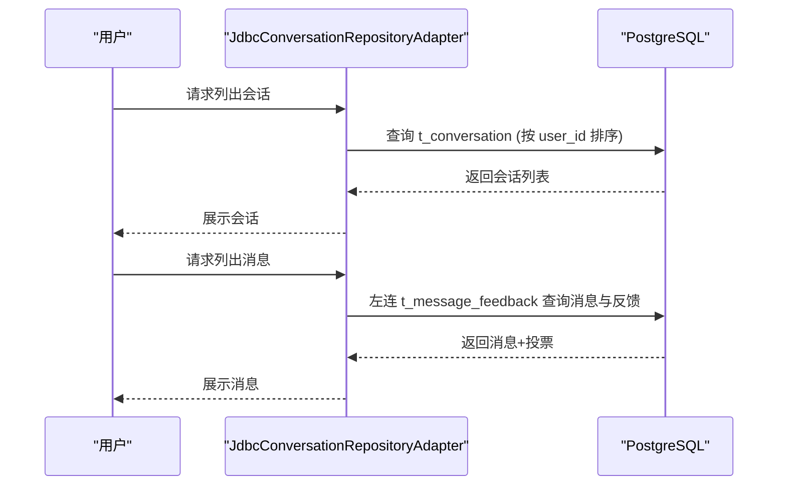
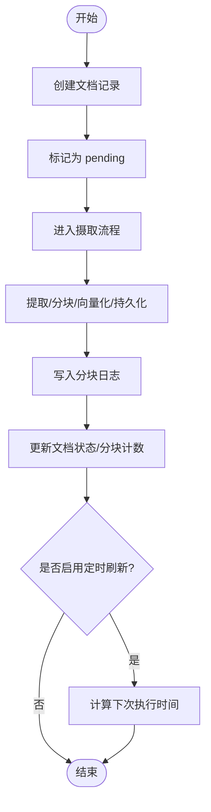
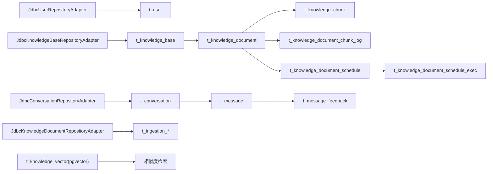

# 数据库设计

<cite>
**本文引用的文件**
- [seahorse_init.sql](file://resources/database/seahorse_init.sql)
- [seahorse_init.sql](file://resources/database/seahorse_init.sql)
- [seahorse_init.sql](file://resources/database/seahorse_init.sql)
- [seahorse_init.sql](file://resources/database/seahorse_init.sql)
- [seahorse_init.sql](file://resources/database/seahorse_init.sql)
- [schema_table.sql](file://resources/database/backups/schema_table.sql)
- [JdbcUserRepositoryAdapter.java](file://seahorse-agent-adapter-repository-jdbc/src/main/java/com/miracle/ai/seahorse/agent/adapters/repository/jdbc/JdbcUserRepositoryAdapter.java)
- [JdbcKnowledgeBaseRepositoryAdapter.java](file://seahorse-agent-adapter-repository-jdbc/src/main/java/com/miracle/ai/seahorse/agent/adapters/repository/jdbc/JdbcKnowledgeBaseRepositoryAdapter.java)
- [JdbcConversationRepositoryAdapter.java](file://seahorse-agent-adapter-repository-jdbc/src/main/java/com/miracle/ai/seahorse/agent/adapters/repository/jdbc/JdbcConversationRepositoryAdapter.java)
- [JdbcKnowledgeDocumentRepositoryAdapter.java](file://seahorse-agent-adapter-repository-jdbc/src/main/java/com/miracle/ai/seahorse/agent/adapters/repository/jdbc/JdbcKnowledgeDocumentRepositoryAdapter.java)
- [application.properties](file://seahorse-agent-bootstrap/src/main/resources/application.properties)
- [application.properties](file://seahorse-agent-spring-boot-starter/src/main/resources/application.properties)
</cite>

## 目录
1. [简介](#简介)
2. [项目结构](#项目结构)
3. [核心组件](#核心组件)
4. [架构总览](#架构总览)
5. [详细组件分析](#详细组件分析)
6. [依赖分析](#依赖分析)
7. [性能考虑](#性能考虑)
8. [故障排查指南](#故障排查指南)
9. [结论](#结论)
10. [附录](#附录)

## 简介
本文件系统性梳理 Seahorse Agent 的 PostgreSQL 数据库设计，覆盖整体架构、表结构、索引策略、关系约束、初始化与迁移脚本、版本演进、性能优化、安全配置、连接池与事务、监控与运维等内容。数据库采用统一的业务主键策略（字符串型）、软删除设计，并围绕“用户-会话-消息-知识库-文档-分块-向量”形成完整闭环，支撑 RAG 与对话场景。

## 项目结构
数据库相关资源集中于 resources/database 目录，包含：
- 初始化与主架构脚本：seahorse_init.sql
- 初始数据：seahorse_init.sql
- 多统一初始化脚本：seahorse_init.sql、seahorse_init.sql、seahorse_init.sql
- 历史备份（MySQL 脚本）：backups/schema_table.sql
- JDBC 适配器：位于 seahorse-agent-adapter-repository-jdbc 模块，负责对各表的 CRUD 与分页查询

图表来源
- [seahorse_init.sql:1-850](file://resources/database/seahorse_init.sql#L1-L850)
- [seahorse_init.sql:1-5](file://resources/database/seahorse_init.sql#L1-L5)
- [seahorse_init.sql:1-9](file://resources/database/seahorse_init.sql#L1-L9)
- [seahorse_init.sql:1-6](file://resources/database/seahorse_init.sql#L1-L6)
- [seahorse_init.sql:1-115](file://resources/database/seahorse_init.sql#L1-L115)
- [schema_table.sql:1-402](file://resources/database/backups/schema_table.sql#L1-L402)
- [JdbcUserRepositoryAdapter.java:1-205](file://seahorse-agent-adapter-repository-jdbc/src/main/java/com/miracle/ai/seahorse/agent/adapters/repository/jdbc/JdbcUserRepositoryAdapter.java#L1-L205)
- [JdbcKnowledgeBaseRepositoryAdapter.java:1-251](file://seahorse-agent-adapter-repository-jdbc/src/main/java/com/miracle/ai/seahorse/agent/adapters/repository/jdbc/JdbcKnowledgeBaseRepositoryAdapter.java#L1-L251)
- [JdbcConversationRepositoryAdapter.java:1-143](file://seahorse-agent-adapter-repository-jdbc/src/main/java/com/miracle/ai/seahorse/agent/adapters/repository/jdbc/JdbcConversationRepositoryAdapter.java#L1-L143)
- [JdbcKnowledgeDocumentRepositoryAdapter.java:1-520](file://seahorse-agent-adapter-repository-jdbc/src/main/java/com/miracle/ai/seahorse/agent/adapters/repository/jdbc/JdbcKnowledgeDocumentRepositoryAdapter.java#L1-L520)

章节来源
- [seahorse_init.sql:1-850](file://resources/database/seahorse_init.sql#L1-L850)
- [seahorse_init.sql:1-5](file://resources/database/seahorse_init.sql#L1-L5)
- [seahorse_init.sql:1-9](file://resources/database/seahorse_init.sql#L1-L9)
- [seahorse_init.sql:1-6](file://resources/database/seahorse_init.sql#L1-L6)
- [seahorse_init.sql:1-115](file://resources/database/seahorse_init.sql#L1-L115)
- [schema_table.sql:1-402](file://resources/database/backups/schema_table.sql#L1-L402)

## 核心组件
- 用户与会话：t_user、t_conversation、t_conversation_summary、t_message、t_message_feedback
- 知识库与文档：t_knowledge_base、t_knowledge_document、t_knowledge_chunk、t_knowledge_document_chunk_log、t_knowledge_document_schedule、t_knowledge_document_schedule_exec
- RAG 与检索：t_intent_node、t_query_term_mapping、t_rag_trace_run、t_rag_trace_node
- 摄取流水线：t_ingestion_pipeline、t_ingestion_pipeline_node、t_ingestion_task、t_ingestion_task_node
- 向量存储：t_knowledge_vector（pgvector）
- 内存与事件：t_outbox_event、t_short_term_memory、t_long_term_memory、t_long_term_memory_vector、t_semantic_memory、t_memory_conflict_log、t_memory_quality_snapshot
- 元数据与注释：大量列级注释，便于审计与维护

章节来源
- [seahorse_init.sql:11-850](file://resources/database/seahorse_init.sql#L11-L850)

## 架构总览
数据库以“用户-会话-消息”为对话基座，结合“知识库-文档-分块-向量”实现 RAG 能力；通过“摄取流水线”与“定时刷新”保障知识库数据新鲜度；通过“内存与事件”支持多层记忆与可靠投递。

```mermaid
erDiagram
T_USER {
varchar id PK
varchar username UK
varchar password
varchar role
varchar avatar
timestamp create_time
timestamp update_time
smallint deleted
}
T_CONVERSATION {
varchar id PK
varchar conversation_id
varchar user_id
varchar title
timestamp last_time
timestamp create_time
timestamp update_time
smallint deleted
}
T_CONVERSATION_SUMMARY {
varchar id PK
varchar conversation_id
varchar user_id
varchar last_message_id
text content
timestamp create_time
timestamp update_time
smallint deleted
}
T_MESSAGE {
varchar id PK
varchar conversation_id
varchar user_id
varchar role
text content
text thinking_content
integer thinking_duration
timestamp create_time
timestamp update_time
smallint deleted
}
T_MESSAGE_FEEDBACK {
varchar id PK
varchar message_id
varchar conversation_id
varchar user_id
smallint vote
varchar reason
varchar comment
timestamp create_time
timestamp update_time
smallint deleted
}
T_KNOWLEDGE_BASE {
varchar id PK
varchar name
varchar embedding_model
varchar collection_name UK
varchar created_by
varchar updated_by
timestamp create_time
timestamp update_time
smallint deleted
}
T_KNOWLEDGE_DOCUMENT {
varchar id PK
varchar kb_id
varchar doc_name
smallint enabled
integer chunk_count
varchar file_url
varchar file_type
bigint file_size
varchar process_mode
varchar status
varchar source_type
varchar source_location
smallint schedule_enabled
varchar schedule_cron
varchar chunk_strategy
jsonb chunk_config
varchar pipeline_id
varchar created_by
varchar updated_by
timestamp create_time
timestamp update_time
smallint deleted
}
T_KNOWLEDGE_CHUNK {
varchar id PK
varchar kb_id
varchar doc_id
integer chunk_index
text content
varchar content_hash
integer char_count
integer token_count
smallint enabled
varchar created_by
varchar updated_by
timestamp create_time
timestamp update_time
smallint deleted
}
T_KNOWLEDGE_VECTOR {
varchar id PK
text content
jsonb metadata
vector embedding
}
T_INTENT_NODE {
varchar id PK
varchar kb_id
varchar intent_code
varchar name
smallint level
varchar parent_code
varchar description
text examples
varchar collection_name
integer top_k
varchar mcp_tool_id
smallint kind
text prompt_snippet
text prompt_template
text param_prompt_template
integer sort_order
smallint enabled
varchar create_by
varchar update_by
timestamp create_time
timestamp update_time
smallint deleted
}
T_QUERY_TERM_MAPPING {
varchar id PK
varchar domain
varchar source_term
varchar target_term
smallint match_type
integer priority
smallint enabled
varchar remark
varchar create_by
varchar update_by
timestamp create_time
timestamp update_time
smallint deleted
}
T_RAG_TRACE_RUN {
varchar id PK
varchar trace_id UK
varchar trace_name
varchar entry_method
varchar conversation_id
varchar task_id
varchar user_id
varchar status
varchar error_message
timestamp start_time
timestamp end_time
bigint duration_ms
text extra_data
timestamp create_time
timestamp update_time
smallint deleted
}
T_RAG_TRACE_NODE {
varchar id PK
varchar trace_id
varchar node_id
varchar parent_node_id
integer depth
varchar node_type
varchar node_name
varchar class_name
varchar method_name
varchar status
varchar error_message
timestamp start_time
timestamp end_time
bigint duration_ms
text extra_data
timestamp create_time
timestamp update_time
smallint deleted
}
T_INGESTION_PIPELINE {
varchar id PK
varchar name UK
text description
varchar created_by
varchar updated_by
timestamp create_time
timestamp update_time
smallint deleted
}
T_INGESTION_PIPELINE_NODE {
varchar id PK
varchar pipeline_id
varchar node_id
varchar node_type
varchar next_node_id
jsonb settings_json
jsonb condition_json
varchar created_by
varchar updated_by
timestamp create_time
timestamp update_time
smallint deleted
}
T_INGESTION_TASK {
varchar id PK
varchar pipeline_id
varchar source_type
text source_location
varchar source_file_name
varchar status
integer chunk_count
text error_message
jsonb logs_json
jsonb metadata_json
timestamp started_at
timestamp completed_at
varchar created_by
varchar updated_by
timestamp create_time
timestamp update_time
smallint deleted
}
T_INGESTION_TASK_NODE {
varchar id PK
varchar task_id
varchar pipeline_id
varchar node_id
varchar node_type
integer node_order
varchar status
bigint duration_ms
text message
text error_message
text output_json
timestamp create_time
timestamp update_time
smallint deleted
}
T_OUTBOX_EVENT {
varchar id PK
varchar topic
varchar message_key
varchar event_type
jsonb payload_json
varchar status
integer retry_count
timestamp next_retry_time
text last_error
timestamp create_time
timestamp update_time
smallint deleted
}
T_SHORT_TERM_MEMORY {
varchar id PK
varchar user_id
varchar conversation_id
varchar memory_type
text content
jsonb metadata_json
jsonb source_message_ids
numeric importance_score
integer access_count
timestamp last_access_time
numeric decay_score
timestamp expires_time
timestamp create_time
timestamp update_time
smallint deleted
}
T_LONG_TERM_MEMORY {
varchar id PK
varchar user_id
varchar memory_category
varchar title
text content
varchar source_type
jsonb source_ids
jsonb tags
numeric importance_score
numeric confidence_level
varchar embedding_model
varchar vector_ref_id
timestamp create_time
timestamp update_time
smallint deleted
}
T_LONG_TERM_MEMORY_VECTOR {
varchar id PK
varchar user_id
text content
vector embedding
timestamp create_time
timestamp update_time
}
T_SEMANTIC_MEMORY {
varchar id PK
varchar user_id
varchar semantic_key
varchar semantic_type
jsonb value_json
numeric confidence_level
jsonb source_memory_ids
timestamp create_time
timestamp update_time
smallint deleted
}
T_MEMORY_CONFLICT_LOG {
varchar id PK
varchar user_id
varchar memory_id_1
varchar memory_id_2
varchar conflict_type
varchar severity
varchar resolution_status
varchar resolution_action
varchar resolved_by
timestamp resolved_at
timestamp create_time
timestamp update_time
smallint deleted
}
T_MEMORY_QUALITY_SNAPSHOT {
varchar id PK
varchar user_id
jsonb snapshot_json
timestamp create_time
}
T_KNOWLEDGE_BASE ||--o{ T_KNOWLEDGE_DOCUMENT : "拥有"
T_KNOWLEDGE_DOCUMENT ||--o{ T_KNOWLEDGE_CHUNK : "包含"
T_KNOWLEDGE_DOCUMENT ||--o{ T_KNOWLEDGE_DOCUMENT_CHUNK_LOG : "产生"
T_KNOWLEDGE_DOCUMENT ||--o{ T_KNOWLEDGE_DOCUMENT_SCHEDULE : "被调度"
T_KNOWLEDGE_DOCUMENT_SCHEDULE ||--o{ T_KNOWLEDGE_DOCUMENT_SCHEDULE_EXEC : "执行"
T_KNOWLEDGE_BASE ||--o{ T_INTENT_NODE : "关联"
T_CONVERSATION ||--o{ T_MESSAGE : "包含"
T_CONVERSATION ||--o{ T_CONVERSATION_SUMMARY : "摘要"
T_MESSAGE ||--o{ T_MESSAGE_FEEDBACK : "被反馈"
T_KNOWLEDGE_BASE ||--o{ T_KNOWLEDGE_VECTOR : "向量化"
T_USER ||--o{ T_CONVERSATION : "拥有"
T_USER ||--o{ T_MESSAGE : "参与"
T_USER ||--o{ T_SHORT_TERM_MEMORY : "拥有"
T_USER ||--o{ T_LONG_TERM_MEMORY : "拥有"
T_USER ||--o{ T_SEMANTIC_MEMORY : "拥有"
T_USER ||--o{ T_MEMORY_CONFLICT_LOG : "涉及"
T_USER ||--o{ T_MEMORY_QUALITY_SNAPSHOT : "生成"
T_LONG_TERM_MEMORY ||--o{ T_LONG_TERM_MEMORY_VECTOR : "向量化"
```

图表来源
- [seahorse_init.sql:11-850](file://resources/database/seahorse_init.sql#L11-L850)

## 详细组件分析

### 用户与会话模块
- t_user：用户主表，软删除，唯一用户名，包含角色、头像等。
- t_conversation：会话列表，联合唯一(conversation_id, user_id)，按(user_id, last_time)建立索引，便于用户侧会话列表与最新消息排序。
- t_conversation_summary：会话摘要独立表，与消息分离存储，降低消息表膨胀。
- t_message：消息表，含思维内容与耗时字段，按(conversation_id, user_id, create_time)建立索引，支持消息分页与时间序列检索。
- t_message_feedback：消息反馈，按(conversation_id, user_id)建立索引，支持按会话与用户维度查询。

图表来源
- [JdbcConversationRepositoryAdapter.java:38-72](file://seahorse-agent-adapter-repository-jdbc/src/main/java/com/miracle/ai/seahorse/agent/adapters/repository/jdbc/JdbcConversationRepositoryAdapter.java#L38-L72)
- [seahorse_init.sql:32-98](file://resources/database/seahorse_init.sql#L32-L98)

章节来源
- [seahorse_init.sql:11-98](file://resources/database/seahorse_init.sql#L11-L98)
- [JdbcConversationRepositoryAdapter.java:1-143](file://seahorse-agent-adapter-repository-jdbc/src/main/java/com/miracle/ai/seahorse/agent/adapters/repository/jdbc/JdbcConversationRepositoryAdapter.java#L1-L143)

### 知识库与文档模块
- t_knowledge_base：知识库元信息，唯一集合名(collection_name)，按(name)索引。
- t_knowledge_document：文档元数据与状态，按(kb_id)索引；支持定时刷新配置与处理模式。
- t_knowledge_chunk：文档分块，按(doc_id)索引；支持内容哈希与统计字段。
- t_knowledge_document_chunk_log：分块处理日志，拆分计时字段，便于性能分析。
- t_knowledge_document_schedule / exec：定时刷新任务与执行记录，按(next_run_time, lock_until)索引。

图表来源
- [seahorse_init.sql:116-242](file://resources/database/seahorse_init.sql#L116-L242)
- [JdbcKnowledgeDocumentRepositoryAdapter.java:109-123](file://seahorse-agent-adapter-repository-jdbc/src/main/java/com/miracle/ai/seahorse/agent/adapters/repository/jdbc/JdbcKnowledgeDocumentRepositoryAdapter.java#L109-L123)

章节来源
- [seahorse_init.sql:116-242](file://resources/database/seahorse_init.sql#L116-L242)
- [JdbcKnowledgeDocumentRepositoryAdapter.java:1-520](file://seahorse-agent-adapter-repository-jdbc/src/main/java/com/miracle/ai/seahorse/agent/adapters/repository/jdbc/JdbcKnowledgeDocumentRepositoryAdapter.java#L1-L520)

### RAG 与检索模块
- t_intent_node：意图树节点，支持层级、提示词模板、MCP 工具绑定等。
- t_query_term_mapping：关键词归一化映射，按(domain, source_term)索引。
- t_rag_trace_run/node：链路追踪，支持运行状态、耗时、错误信息等。

章节来源
- [seahorse_init.sql:248-337](file://resources/database/seahorse_init.sql#L248-L337)

### 摄取流水线模块
- t_ingestion_pipeline / node：流水线定义与节点配置，支持条件与设置 JSON。
- t_ingestion_task / node：任务执行记录，按(pipeline_id, status)索引，便于任务治理。

章节来源
- [seahorse_init.sql:343-416](file://resources/database/seahorse_init.sql#L343-L416)

### 向量存储模块
- t_knowledge_vector：pgvector 扩展，支持 GIN 元数据索引与 HNSW 向量索引，满足相似度检索。

章节来源
- [seahorse_init.sql:422-431](file://resources/database/seahorse_init.sql#L422-L431)

### 内存与事件模块
- t_outbox_event：事件可靠投递，按(status, next_retry_time, create_time)索引。
- t_short_term_memory / long_term_memory / semantic_memory：多层记忆，分别按(user_id, ...)建立索引与 GIN 索引。

章节来源
- [seahorse_init.sql:743-850](file://resources/database/seahorse_init.sql#L743-L850)
- [seahorse_init.sql:4-115](file://resources/database/seahorse_init.sql#L4-L115)

## 依赖分析
- 应用层通过 JDBC 适配器访问数据库，遵循统一的 CRUD 与分页接口。
- 表间外键未显式声明，但通过业务逻辑保证一致性（如文档与分块、任务与节点）。
- 索引覆盖高频查询路径：用户会话、消息分页、知识库分页、定时任务调度、内存检索等。

图表来源
- [JdbcUserRepositoryAdapter.java:1-205](file://seahorse-agent-adapter-repository-jdbc/src/main/java/com/miracle/ai/seahorse/agent/adapters/repository/jdbc/JdbcUserRepositoryAdapter.java#L1-L205)
- [JdbcKnowledgeBaseRepositoryAdapter.java:1-251](file://seahorse-agent-adapter-repository-jdbc/src/main/java/com/miracle/ai/seahorse/agent/adapters/repository/jdbc/JdbcKnowledgeBaseRepositoryAdapter.java#L1-L251)
- [JdbcConversationRepositoryAdapter.java:1-143](file://seahorse-agent-adapter-repository-jdbc/src/main/java/com/miracle/ai/seahorse/agent/adapters/repository/jdbc/JdbcConversationRepositoryAdapter.java#L1-L143)
- [JdbcKnowledgeDocumentRepositoryAdapter.java:1-520](file://seahorse-agent-adapter-repository-jdbc/src/main/java/com/miracle/ai/seahorse/agent/adapters/repository/jdbc/JdbcKnowledgeDocumentRepositoryAdapter.java#L1-L520)
- [seahorse_init.sql:11-850](file://resources/database/seahorse_init.sql#L11-L850)

章节来源
- [JdbcUserRepositoryAdapter.java:1-205](file://seahorse-agent-adapter-repository-jdbc/src/main/java/com/miracle/ai/seahorse/agent/adapters/repository/jdbc/JdbcUserRepositoryAdapter.java#L1-L205)
- [JdbcKnowledgeBaseRepositoryAdapter.java:1-251](file://seahorse-agent-adapter-repository-jdbc/src/main/java/com/miracle/ai/seahorse/agent/adapters/repository/jdbc/JdbcKnowledgeBaseRepositoryAdapter.java#L1-L251)
- [JdbcConversationRepositoryAdapter.java:1-143](file://seahorse-agent-adapter-repository-jdbc/src/main/java/com/miracle/ai/seahorse/agent/adapters/repository/jdbc/JdbcConversationRepositoryAdapter.java#L1-L143)
- [JdbcKnowledgeDocumentRepositoryAdapter.java:1-520](file://seahorse-agent-adapter-repository-jdbc/src/main/java/com/miracle/ai/seahorse/agent/adapters/repository/jdbc/JdbcKnowledgeDocumentRepositoryAdapter.java#L1-L520)

## 性能考虑
- 索引策略
  - 会话与消息：(user_id, last_time)、(conversation_id, user_id, create_time) 保证用户侧会话列表与消息分页高效。
  - 定时任务：(next_run_time)、(lock_until) 保证调度扫描与锁释放高效。
  - 文档与分块：(kb_id)、(doc_id)、(collection_name) 提升知识库与分块查询效率。
  - JSONB 字段：对 metadata、tags、source_ids 等使用 GIN 索引，提升模糊匹配与数组检索性能。
  - pgvector：HNSW 向量索引配合余弦距离，满足大规模相似度检索。
- 查询优化
  - 使用 LIMIT/OFFSET 实现分页，避免全表扫描；对高频字段建立复合索引。
  - 将大字段（content、examples、extra_data）与频繁过滤字段分离（如摘要表），减少 IO。
  - 对 JSONB 字段进行条件下推与选择性过滤，避免全表 JSON 解析。
- 分区策略
  - 可按 create_time 对 t_message、t_knowledge_document_chunk_log、t_outbox_event 等表进行范围分区，滚动清理历史数据。
- 缓存与批处理
  - 对热点知识库与文档元数据引入应用层缓存，降低数据库压力。
  - 对批量导入/导出操作使用 COPY 或批量插入，减少往返开销。

[本节为通用性能建议，不直接分析具体文件]

## 故障排查指南
- 常见问题定位
  - 查询慢：检查是否存在复合索引命中；确认 ORDER BY 与 WHERE 字段是否在索引中连续。
  - 内存不足：关注 JSONB 与大文本字段占用；必要时拆表或压缩。
  - 向量检索异常：确认 pgvector 扩展已安装且向量维度一致。
- 日志与追踪
  - 使用 t_rag_trace_run/node 记录链路状态与耗时，定位瓶颈环节。
  - t_outbox_event 记录事件投递状态，排查消息积压与失败。
- 数据一致性
  - 软删除字段 deleted 统一为 0/1，避免误删；对重要操作增加事务包裹。
- 回滚与修复
  - 升级脚本按版本顺序执行；若失败，回滚到上一版本并重新执行增量脚本。

章节来源
- [seahorse_init.sql:293-337](file://resources/database/seahorse_init.sql#L293-L337)
- [seahorse_init.sql:743-756](file://resources/database/seahorse_init.sql#L743-L756)
- [seahorse_init.sql:1-9](file://resources/database/seahorse_init.sql#L1-L9)
- [seahorse_init.sql:1-6](file://resources/database/seahorse_init.sql#L1-L6)
- [seahorse_init.sql:1-115](file://resources/database/seahorse_init.sql#L1-L115)

## 结论
该数据库设计以清晰的表结构、完善的索引策略与版本化迁移机制，支撑了从对话到 RAG 的完整业务闭环。通过 pgvector 与多层记忆体系，进一步强化了检索与上下文能力。建议在生产环境中结合容量规划与分区策略，持续优化查询与写入性能，并完善监控与备份方案。

[本节为总结性内容，不直接分析具体文件]

## 附录

### 数据库初始化与迁移
- 初始化脚本：创建扩展与所有表结构，插入默认管理员账户。
- 迁移策略：按 v1.0 → v1.1 → v1.2 → v1.3 顺序执行，逐步新增字段与表，确保向后兼容。

章节来源
- [seahorse_init.sql:1-8](file://resources/database/seahorse_init.sql#L1-L8)
- [seahorse_init.sql:1-5](file://resources/database/seahorse_init.sql#L1-L5)
- [seahorse_init.sql:1-9](file://resources/database/seahorse_init.sql#L1-L9)
- [seahorse_init.sql:1-6](file://resources/database/seahorse_init.sql#L1-L6)
- [seahorse_init.sql:1-115](file://resources/database/seahorse_init.sql#L1-L115)

### 历史对比（MySQL → PostgreSQL）
- 历史备份保留了 MySQL 版本的建表语句，便于理解字段语义与约束。
- PostgreSQL 版本统一使用 varchar 主键、JSONB、GIN/HNSW 索引，提升可维护性与性能。

章节来源
- [schema_table.sql:1-402](file://resources/database/backups/schema_table.sql#L1-L402)
- [seahorse_init.sql:1-8](file://resources/database/seahorse_init.sql#L1-L8)

### 运行时配置与集成
- Spring 配置：服务名称、内核模式与迁移模式由 application.properties 控制。
- JDBC 适配器：封装了各表的 CRUD、分页与条件查询，统一返回值对象，便于前端消费。

章节来源
- [application.properties:1-4](file://seahorse-agent-bootstrap/src/main/resources/application.properties#L1-L4)
- [application.properties:1-2](file://seahorse-agent-spring-boot-starter/src/main/resources/application.properties#L1-L2)
- [JdbcUserRepositoryAdapter.java:1-205](file://seahorse-agent-adapter-repository-jdbc/src/main/java/com/miracle/ai/seahorse/agent/adapters/repository/jdbc/JdbcUserRepositoryAdapter.java#L1-L205)
- [JdbcKnowledgeBaseRepositoryAdapter.java:1-251](file://seahorse-agent-adapter-repository-jdbc/src/main/java/com/miracle/ai/seahorse/agent/adapters/repository/jdbc/JdbcKnowledgeBaseRepositoryAdapter.java#L1-L251)
- [JdbcConversationRepositoryAdapter.java:1-143](file://seahorse-agent-adapter-repository-jdbc/src/main/java/com/miracle/ai/seahorse/agent/adapters/repository/jdbc/JdbcConversationRepositoryAdapter.java#L1-L143)
- [JdbcKnowledgeDocumentRepositoryAdapter.java:1-520](file://seahorse-agent-adapter-repository-jdbc/src/main/java/com/miracle/ai/seahorse/agent/adapters/repository/jdbc/JdbcKnowledgeDocumentRepositoryAdapter.java#L1-L520)