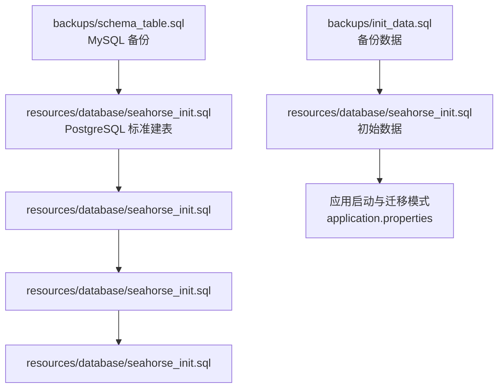
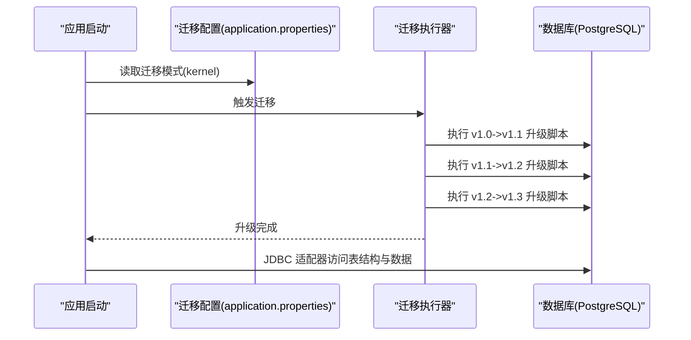
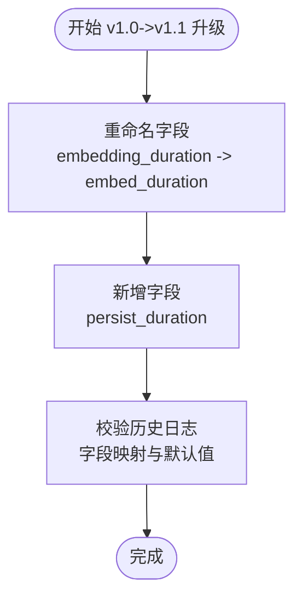
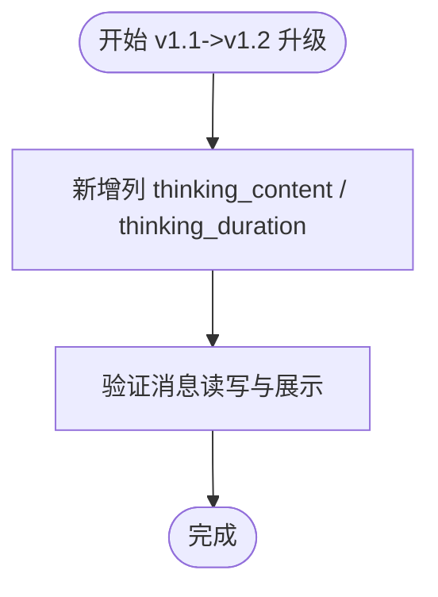
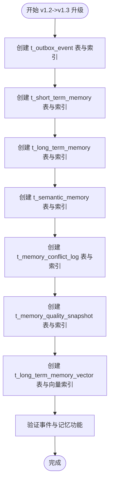
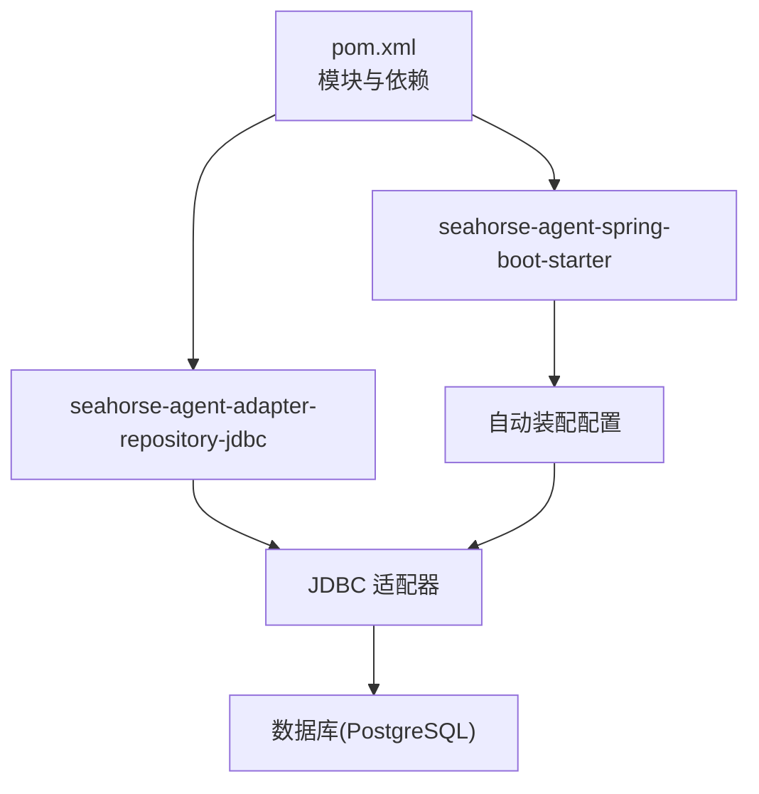

# 数据迁移策略

<cite>
**本文引用的文件**
- [seahorse_init.sql](file://resources/database/seahorse_init.sql)
- [seahorse_init.sql](file://resources/database/seahorse_init.sql)
- [seahorse_init.sql](file://resources/database/seahorse_init.sql)
- [seahorse_init.sql](file://resources/database/seahorse_init.sql)
- [seahorse_init.sql](file://resources/database/seahorse_init.sql)
- [schema_table.sql](file://resources/database/seahorse_init.sql)
- [init_data.sql](file://resources/database/seahorse_init.sql)
- [application.properties](file://seahorse-agent-bootstrap/src/main/resources/application.properties)
- [JdbcPipelineDefinitionRepositoryAdapter.java](file://seahorse-agent-adapter-repository-jdbc/src/main/java/com/miracle/ai/seahorse/agent/adapters/repository/jdbc/JdbcPipelineDefinitionRepositoryAdapter.java)
- [JdbcMemorySupport.java](file://seahorse-agent-adapter-repository-jdbc/src/main/java/com/miracle/ai/seahorse/agent/adapters/repository/jdbc/JdbcMemorySupport.java)
- [JdbcMemoryConflictLogRepositoryAdapter.java](file://seahorse-agent-adapter-repository-jdbc/src/main/java/com/miracle/ai/seahorse/agent/adapters/repository/jdbc/JdbcMemoryConflictLogRepositoryAdapter.java)
- [SeahorseAgentNativeAdapterAutoConfiguration.java](file://seahorse-agent-spring-boot-autoconfigure/src/main/java/com/miracle/ai/seahorse/agent/adapters/spring/SeahorseAgentNativeAdapterAutoConfiguration.java)
- [SeahorseDocumentRefreshJob.java](file://seahorse-agent-spring-boot-autoconfigure/src/main/java/com/miracle/ai/seahorse/agent/adapters/spring/SeahorseDocumentRefreshJob.java)
- [pom.xml](file://pom.xml)
</cite>

## 目录
1. [简介](#简介)
2. [项目结构](#项目结构)
3. [核心组件](#核心组件)
4. [架构总览](#架构总览)
5. [详细组件分析](#详细组件分析)
6. [依赖分析](#依赖分析)
7. [性能考虑](#性能考虑)
8. [故障排查指南](#故障排查指南)
9. [结论](#结论)
10. [附录](#附录)

## 简介
本文件面向 Seahorse Agent 的数据库版本升级与迁移，系统梳理从 v1.0 到 v1.3 的数据结构演进，逐次说明每次升级的变更内容、升级原因与影响范围；并基于现有迁移脚本与应用实现，总结迁移设计思路（数据转换、兼容性、回滚）、增量升级最佳实践、生产环境升级的风险控制流程、迁移脚本编写规范与测试策略，以及迁移后的性能优化建议与常见问题诊断。

## 项目结构
数据库相关资源集中在 resources/database 目录，包含：
- 初始化与备份：seahorse_init.sql（PostgreSQL 标准建表）、seahorse_init.sql（初始数据）、backups 下的 schema_table.sql（MySQL 备份）与 init_data.sql（备份数据）
- 版本升级脚本：seahorse_init.sql、seahorse_init.sql、seahorse_init.sql
- 应用侧配置与适配器：application.properties（迁移模式）、JDBC 仓库适配器、内存相关支持类与自动装配配置

图表来源
- [seahorse_init.sql:1-850](file://resources/database/seahorse_init.sql#L1-L850)
- [seahorse_init.sql:1-9](file://resources/database/seahorse_init.sql#L1-L9)
- [seahorse_init.sql:1-6](file://resources/database/seahorse_init.sql#L1-L6)
- [seahorse_init.sql:1-115](file://resources/database/seahorse_init.sql#L1-L115)
- [application.properties:1-4](file://seahorse-agent-bootstrap/src/main/resources/application.properties#L1-L4)

章节来源
- [seahorse_init.sql:1-850](file://resources/database/seahorse_init.sql#L1-L850)
- [seahorse_init.sql:1-9](file://resources/database/seahorse_init.sql#L1-L9)
- [seahorse_init.sql:1-6](file://resources/database/seahorse_init.sql#L1-L6)
- [seahorse_init.sql:1-115](file://resources/database/seahorse_init.sql#L1-L115)
- [application.properties:1-4](file://seahorse-agent-bootstrap/src/main/resources/application.properties#L1-L4)

## 核心组件
- 数据库模式与索引：PostgreSQL 建表脚本定义了用户、会话、消息、反馈、知识库、文档、分块、定时刷新、摄取流水线、任务、向量存储、Trace、Outbox 事件与四层记忆体系等核心表，并为高频查询建立索引。
- 升级脚本：按版本逐步演进，涵盖字段重命名、新增列、新增表与索引等。
- 应用迁移模式：通过 application.properties 启用内核迁移模式，驱动数据库迁移流程。
- JDBC 适配器：负责与数据库交互，承载数据读写、分页、条件查询等能力，支撑迁移后功能运行。
- 内存与冲突日志：v1.3 引入的短期/长期记忆、语义记忆、冲突日志与质量快照等表，提升记忆治理能力。

章节来源
- [seahorse_init.sql:1-850](file://resources/database/seahorse_init.sql#L1-L850)
- [seahorse_init.sql:1-115](file://resources/database/seahorse_init.sql#L1-L115)
- [application.properties:1-4](file://seahorse-agent-bootstrap/src/main/resources/application.properties#L1-L4)
- [JdbcPipelineDefinitionRepositoryAdapter.java:104-132](file://seahorse-agent-adapter-repository-jdbc/src/main/java/com/miracle/ai/seahorse/agent/adapters/repository/jdbc/JdbcPipelineDefinitionRepositoryAdapter.java#L104-L132)
- [JdbcMemorySupport.java:1-71](file://seahorse-agent-adapter-repository-jdbc/src/main/java/com/miracle/ai/seahorse/agent/adapters/repository/jdbc/JdbcMemorySupport.java#L1-L71)

## 架构总览
下图展示了数据库版本升级在应用中的整体流程：应用启动时根据迁移模式加载迁移脚本，按顺序执行升级；JDBC 适配器在运行期访问数据库，确保新旧版本字段与表结构兼容。

图表来源
- [application.properties:1-4](file://seahorse-agent-bootstrap/src/main/resources/application.properties#L1-L4)
- [seahorse_init.sql:1-9](file://resources/database/seahorse_init.sql#L1-L9)
- [seahorse_init.sql:1-6](file://resources/database/seahorse_init.sql#L1-L6)
- [seahorse_init.sql:1-115](file://resources/database/seahorse_init.sql#L1-L115)

## 详细组件分析

### v1.0 → v1.1：分块日志计时字段拆分
- 变更内容
  - 将 t_knowledge_document_chunk_log 表的 embedding_duration 字段重命名为 embed_duration（语义更贴合嵌入 API 耗时）
  - 新增 persist_duration 字段（原 embedding_duration 中的部分含义被拆分为独立的持久化耗时）
- 升级原因
  - 更清晰地反映各阶段耗时：提取、分块、嵌入、持久化
- 影响范围
  - 摄取日志统计与监控需适配新的字段名与新增字段
  - 历史数据中 embedding_duration 需映射到 embed_duration 与 persist_duration 的合理分配策略
- 兼容性与回滚
  - 兼容性：保留历史日志，仅字段名变化；新增字段默认值为 NULL 或 0，需在查询侧兼容
  - 回滚：重命名字段需逆向操作；新增字段可通过删除列实现回滚（注意数据丢失风险）

图表来源
- [seahorse_init.sql:1-9](file://resources/database/seahorse_init.sql#L1-L9)

章节来源
- [seahorse_init.sql:1-9](file://resources/database/seahorse_init.sql#L1-L9)

### v1.1 → v1.2：消息表新增“深度思考”字段
- 变更内容
  - 在 t_message 表新增 thinking_content 与 thinking_duration 两列
- 升级原因
  - 支持深度思考内容与耗时记录，便于分析与优化推理链路
- 影响范围
  - 消息读写接口需兼容空值；前端展示与导出需适配新增字段
- 兼容性与回滚
  - 兼容性：新增列默认 NULL，不影响已有数据
  - 回滚：删除两列即可恢复原状

图表来源
- [seahorse_init.sql:1-6](file://resources/database/seahorse_init.sql#L1-L6)

章节来源
- [seahorse_init.sql:1-6](file://resources/database/seahorse_init.sql#L1-L6)

### v1.2 → v1.3：Pulsar Outbox 与四层记忆体系
- 变更内容
  - 新增 t_outbox_event 表（事件出站队列），含主题、消息键、事件类型、载荷、状态、重试计数、下次重试时间、错误信息等
  - 新增 t_short_term_memory（短期记忆）与 t_long_term_memory（长期记忆）表，支持重要性评分、衰减分数、过期时间、向量引用等
  - 新增 t_semantic_memory（语义记忆）表，支持语义键、类型、置信度、来源记忆 ID 等
  - 新增 t_memory_conflict_log（记忆冲突日志）与 t_memory_quality_snapshot（记忆质量快照）表
  - 新增 t_long_term_memory_vector（长期记忆向量）表，支持 HNSW 向量索引
- 升级原因
  - 引入事件驱动与记忆治理能力，支撑更复杂的对话与知识管理场景
- 影响范围
  - 记忆模块与事件模块需要新的表结构支撑；向量索引对性能与存储有额外要求
- 兼容性与回滚
  - 兼容性：新增表与索引不影响既有业务表；需在应用侧引入对应适配器
  - 回滚：删除新增表与索引，注意数据与索引清理

图表来源
- [seahorse_init.sql:1-115](file://resources/database/seahorse_init.sql#L1-L115)

章节来源
- [seahorse_init.sql:1-115](file://resources/database/seahorse_init.sql#L1-L115)

### 数据库模式与索引概览（v1.3）
- 用户与会话：t_user、t_conversation、t_conversation_summary、t_message、t_message_feedback、t_sample_question
- 知识库与文档：t_knowledge_base、t_knowledge_document、t_knowledge_chunk、t_knowledge_document_chunk_log、t_knowledge_document_schedule、t_knowledge_document_schedule_exec
- 摄取流水线与任务：t_ingestion_pipeline、t_ingestion_pipeline_node、t_ingestion_task、t_ingestion_task_node
- 向量存储：t_knowledge_vector（pgvector）
- 记忆与事件：t_outbox_event、t_short_term_memory、t_long_term_memory、t_semantic_memory、t_memory_conflict_log、t_memory_quality_snapshot、t_long_term_memory_vector
- 索引覆盖高频查询与 JSONB 字段，提升检索与治理效率

章节来源
- [seahorse_init.sql:1-850](file://resources/database/seahorse_init.sql#L1-L850)

### 应用侧适配与运行期兼容
- 自动装配与适配器
  - Spring 自动装配注册 JDBC 仓库适配器，确保在存在 DataSource 时启用相应端口实现
  - 记忆模块适配器使用 JSONB 字段与时间戳转换工具，保证序列化与反序列化稳定
- 运行期访问
  - JDBC 适配器通过 SQL 访问表结构，支持分页、条件查询与更新，保障迁移后功能可用

章节来源
- [SeahorseAgentNativeAdapterAutoConfiguration.java:383-483](file://seahorse-agent-spring-boot-autoconfigure/src/main/java/com/miracle/ai/seahorse/agent/adapters/spring/SeahorseAgentNativeAdapterAutoConfiguration.java#L383-L483)
- [JdbcMemorySupport.java:1-71](file://seahorse-agent-adapter-repository-jdbc/src/main/java/com/miracle/ai/seahorse/agent/adapters/repository/jdbc/JdbcMemorySupport.java#L1-L71)
- [JdbcPipelineDefinitionRepositoryAdapter.java:104-132](file://seahorse-agent-adapter-repository-jdbc/src/main/java/com/miracle/ai/seahorse/agent/adapters/repository/jdbc/JdbcPipelineDefinitionRepositoryAdapter.java#L104-L132)

## 依赖分析
- Maven 模块组织：项目采用多模块结构，数据库迁移脚本与 JDBC 适配器分别位于 resources/database 与 seahorse-agent-adapter-repository-jdbc 模块
- Spring 配置：application.properties 中的迁移模式属性驱动迁移执行
- 记忆模块：JdbcMemorySupport 提供 JSONB 解析与序列化工具，JdbcMemoryConflictLogRepositoryAdapter 提供冲突记录更新能力

图表来源
- [pom.xml:1-200](file://pom.xml#L1-L200)
- [SeahorseAgentNativeAdapterAutoConfiguration.java:383-483](file://seahorse-agent-spring-boot-autoconfigure/src/main/java/com/miracle/ai/seahorse/agent/adapters/spring/SeahorseAgentNativeAdapterAutoConfiguration.java#L383-L483)

章节来源
- [pom.xml:1-200](file://pom.xml#L1-L200)
- [SeahorseAgentNativeAdapterAutoConfiguration.java:383-483](file://seahorse-agent-spring-boot-autoconfigure/src/main/java/com/miracle/ai/seahorse/agent/adapters/spring/SeahorseAgentNativeAdapterAutoConfiguration.java#L383-L483)

## 性能考虑
- 向量索引与查询
  - pgvector 向量维度与相似度函数选择直接影响检索性能；建议结合业务规模评估索引参数与硬件资源
- JSONB 查询
  - 使用 GIN 索引加速 JSONB 字段查询；注意写入时的序列化成本与存储膨胀
- 记忆表索引
  - 短期/长期记忆与语义记忆均建立复合索引，建议定期分析表统计信息以优化执行计划
- 事件表
  - outbox_event 建立状态与重试时间索引，建议配合批处理与限流策略降低峰值压力

## 故障排查指南
- 升级失败
  - 现象：执行升级脚本报错或中断
  - 排查：确认数据库权限、连接参数与脚本语法；检查字段是否存在、索引是否已创建
- 数据不一致
  - 现象：历史日志字段映射异常
  - 排查：核对 v1.0->v1.1 升级脚本字段映射规则；必要时手动补全或回填
- 记忆功能异常
  - 现象：短期/长期记忆或语义记忆查询结果为空
  - 排查：确认表结构与索引是否完整；检查 JSONB 字段序列化/反序列化是否报错；核对时间戳转换逻辑
- 事件投递失败
  - 现象：outbox_event 状态长时间停留在待重试
  - 排查：检查重试计数与下次重试时间；核对下游消费者处理能力与网络状况

章节来源
- [seahorse_init.sql:1-9](file://resources/database/seahorse_init.sql#L1-L9)
- [JdbcMemorySupport.java:1-71](file://seahorse-agent-adapter-repository-jdbc/src/main/java/com/miracle/ai/seahorse/agent/adapters/repository/jdbc/JdbcMemorySupport.java#L1-L71)
- [SeahorseDocumentRefreshJob.java:57-69](file://seahorse-agent-spring-boot-autoconfigure/src/main/java/com/miracle/ai/seahorse/agent/adapters/spring/SeahorseDocumentRefreshJob.java#L57-L69)

## 结论
Seahorse Agent 的数据库迁移策略遵循“小步快跑、可回滚”的原则：v1.0→v1.1 拆分计时字段、v1.1→v1.2 增加“深度思考”能力、v1.2→v1.3 引入事件与记忆体系。通过明确的升级脚本、兼容性处理与运行期适配器，确保在生产环境中安全推进版本演进。建议在生产部署前完善备份与验证流程，并持续关注索引与向量性能指标。

## 附录

### 增量升级最佳实践
- 严格顺序执行：按版本顺序依次执行升级脚本，避免跨版本跳跃
- 无锁与幂等：尽量使用条件判断与 IF NOT EXISTS，减少锁竞争与重复执行风险
- 渐进式发布：先在预生产验证，再灰度到生产
- 回滚预案：保留回滚脚本与数据备份，确保可快速恢复

### 生产环境升级流程
- 升级前
  - 完整备份数据库与关键表
  - 校验当前版本与目标版本的差异
  - 准备回滚脚本与应急方案
- 升级中
  - 选择低峰时段执行
  - 分批执行并观察日志与指标
- 升级后
  - 运行健康检查与关键路径回归测试
  - 监控慢查询、索引使用率与向量检索延迟

### 迁移脚本编写规范
- 文件命名：upgrade_vX.Y_to_vX.Z.sql
- 注释规范：明确变更目的、影响范围与兼容性说明
- 幂等性：使用 IF EXISTS/IF NOT EXISTS，避免重复执行导致异常
- 可追踪性：记录执行时间、版本与负责人信息（可在脚本注释中体现）

### 测试策略
- 单元测试：针对 JSONB 解析与序列化、时间戳转换等工具方法进行单元测试
- 集成测试：在内存数据库中执行完整升级流程，验证表结构与索引
- 回归测试：验证消息、知识库、记忆、事件等核心功能在新版本下的行为一致性