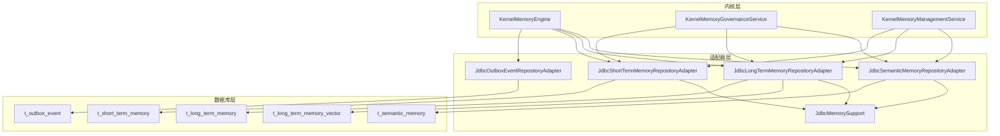
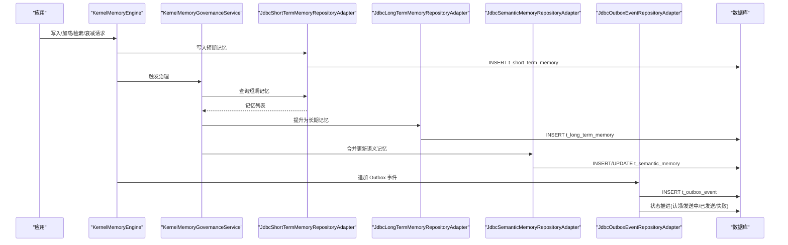
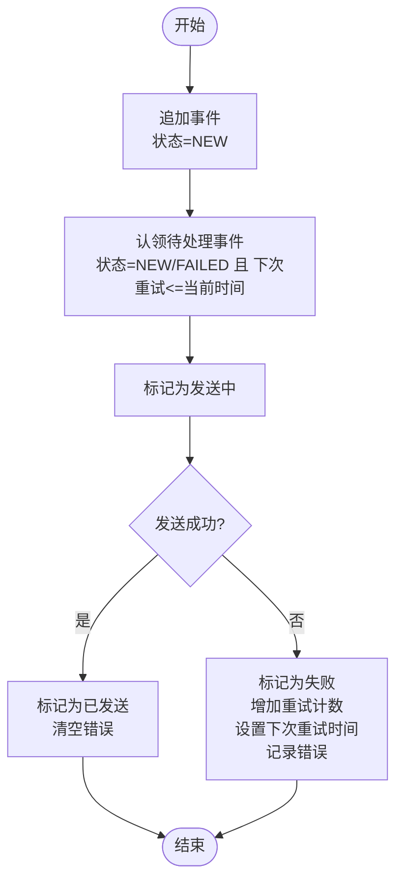
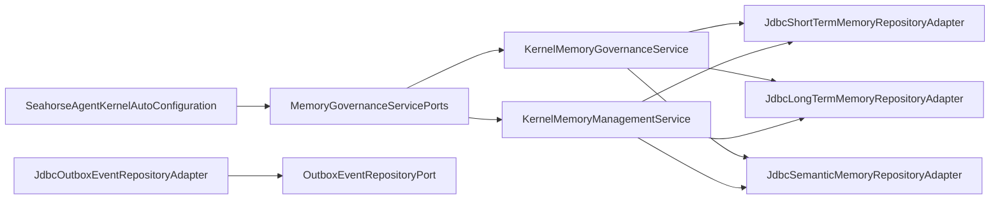

# 内存与消息相关表

<cite>
**本文引用的文件**
- [seahorse_init.sql](file://resources/database/seahorse_init.sql)
- [seahorse_init.sql](file://resources/database/seahorse_init.sql)
- [JdbcOutboxEventRepositoryAdapter.java](file://seahorse-agent-adapter-repository-jdbc/src/main/java/com/miracle/ai/seahorse/agent/adapters/repository/jdbc/JdbcOutboxEventRepositoryAdapter.java)
- [JdbcShortTermMemoryRepositoryAdapter.java](file://seahorse-agent-adapter-repository-jdbc/src/main/java/com/miracle/ai/seahorse/agent/adapters/repository/jdbc/JdbcShortTermMemoryRepositoryAdapter.java)
- [JdbcLongTermMemoryRepositoryAdapter.java](file://seahorse-agent-adapter-repository-jdbc/src/main/java/com/miracle/ai/seahorse/agent/adapters/repository/jdbc/JdbcLongTermMemoryRepositoryAdapter.java)
- [JdbcSemanticMemoryRepositoryAdapter.java](file://seahorse-agent-adapter-repository-jdbc/src/main/java/com/miracle/ai/seahorse/agent/adapters/repository/jdbc/JdbcSemanticMemoryRepositoryAdapter.java)
- [JdbcMemorySupport.java](file://seahorse-agent-adapter-repository-jdbc/src/main/java/com/miracle/ai/seahorse/agent/adapters/repository/jdbc/JdbcMemorySupport.java)
- [KernelMemoryEngine.java](file://seahorse-agent-kernel/src/main/java/com/miracle/ai/seahorse/agent/kernel/application/memory/KernelMemoryEngine.java)
- [KernelMemoryGovernanceService.java](file://seahorse-agent-kernel/src/main/java/com/miracle/ai/seahorse/agent/kernel/application/memory/KernelMemoryGovernanceService.java)
- [KernelMemoryManagementService.java](file://seahorse-agent-kernel/src/main/java/com/miracle/ai/seahorse/agent/kernel/application/memory/KernelMemoryManagementService.java)
- [OutboxEventRepositoryPort.java](file://seahorse-agent-kernel/src/main/java/com/miracle/ai/seahorse/agent/ports/outbound/mq/OutboxEventRepositoryPort.java)
- [SeahorseAgentNativeAdapterAutoConfiguration.java](file://seahorse-agent-spring-boot-autoconfigure/src/main/java/com/miracle/ai/seahorse/agent/adapters/spring/SeahorseAgentNativeAdapterAutoConfiguration.java)
- [SeahorseAgentKernelAutoConfiguration.java](file://seahorse-agent-spring-boot-autoconfigure/src/main/java/com/miracle/ai/seahorse/agent/adapters/spring/SeahorseAgentKernelAutoConfiguration.java)
- [JdbcOutboxEventRepositoryAdapterTests.java](file://seahorse-agent-adapter-repository-jdbc/src/test/java/com/miracle/ai/seahorse/agent/adapters/repository/jdbc/JdbcOutboxEventRepositoryAdapterTests.java)
- [JdbcMemoryRepositoryAdapterTests.java](file://seahorse-agent-adapter-repository-jdbc/src/test/java/com/miracle/ai/seahorse/agent/adapters/repository/jdbc/JdbcMemoryRepositoryAdapterTests.java)
</cite>

## 目录
1. [简介](#简介)
2. [项目结构](#项目结构)
3. [核心组件](#核心组件)
4. [架构总览](#架构总览)
5. [详细组件分析](#详细组件分析)
6. [依赖分析](#依赖分析)
7. [性能考量](#性能考量)
8. [故障排查指南](#故障排查指南)
9. [结论](#结论)
10. [附录](#附录)

## 简介
本文件聚焦于内存与消息相关表的设计与实现，围绕以下主题展开：
- 事件驱动架构与可靠消息传递：基于 t_outbox_event 的 Outbox 模式，结合适配器层的状态机推进与批处理拉取。
- 短期记忆的时效性管理：通过到期时间与衰减分数控制短期记忆的生命周期与检索权重。
- 长期记忆的重要性评分机制：综合重要度与置信度进行记忆提升与治理决策。
- 语义记忆的向量化存储：以 JSONB 存储语义键值对，配合唯一约束与检索索引。
- 分布式消息的可靠传递：通过状态机、重试计数与下一次重试时间保障消息不丢失。
- 内存数据生命周期管理：短期记忆的过期清理、长期记忆的持久化与语义记忆的合并更新。
- 消息去重与幂等性：消息键与状态机配合，避免重复投递与重复处理。
- JSONB 字段在元数据存储中的应用：统一序列化/反序列化与兼容回退策略。
- 内存索引优化策略：GIN 索引、HNSW 向量索引与复合查询索引。
- 消息队列可靠性设计：批处理、状态推进、失败重试与错误记录。

## 项目结构
本项目采用分层与端口适配器模式，数据库层通过 JDBC 适配器对接表结构，内核层提供治理与引擎门面，Spring 自动装配负责端口绑定与 Bean 注册。

图表来源
- [KernelMemoryEngine.java:30-62](file://seahorse-agent-kernel/src/main/java/com/miracle/ai/seahorse/agent/kernel/application/memory/KernelMemoryEngine.java#L30-L62)
- [KernelMemoryGovernanceService.java:31-174](file://seahorse-agent-kernel/src/main/java/com/miracle/ai/seahorse/agent/kernel/application/memory/KernelMemoryGovernanceService.java#L31-L174)
- [KernelMemoryManagementService.java:32-108](file://seahorse-agent-kernel/src/main/java/com/miracle/ai/seahorse/agent/kernel/application/memory/KernelMemoryManagementService.java#L32-L108)
- [JdbcOutboxEventRepositoryAdapter.java:40-187](file://seahorse-agent-adapter-repository-jdbc/src/main/java/com/miracle/ai/seahorse/agent/adapters/repository/jdbc/JdbcOutboxEventRepositoryAdapter.java#L40-L187)
- [JdbcShortTermMemoryRepositoryAdapter.java:34-133](file://seahorse-agent-adapter-repository-jdbc/src/main/java/com/miracle/ai/seahorse/agent/adapters/repository/jdbc/JdbcShortTermMemoryRepositoryAdapter.java#L34-L133)
- [JdbcLongTermMemoryRepositoryAdapter.java:34-147](file://seahorse-agent-adapter-repository-jdbc/src/main/java/com/miracle/ai/seahorse/agent/adapters/repository/jdbc/JdbcLongTermMemoryRepositoryAdapter.java#L34-L147)
- [JdbcSemanticMemoryRepositoryAdapter.java:35-170](file://seahorse-agent-adapter-repository-jdbc/src/main/java/com/miracle/ai/seahorse/agent/adapters/repository/jdbc/JdbcSemanticMemoryRepositoryAdapter.java#L35-L170)
- [JdbcMemorySupport.java:30-81](file://seahorse-agent-adapter-repository-jdbc/src/main/java/com/miracle/ai/seahorse/agent/adapters/repository/jdbc/JdbcMemorySupport.java#L30-L81)
- [seahorse_init.sql:743-850](file://resources/database/seahorse_init.sql#L743-L850)

章节来源
- [seahorse_init.sql:743-850](file://resources/database/seahorse_init.sql#L743-L850)
- [JdbcOutboxEventRepositoryAdapter.java:40-187](file://seahorse-agent-adapter-repository-jdbc/src/main/java/com/miracle/ai/seahorse/agent/adapters/repository/jdbc/JdbcOutboxEventRepositoryAdapter.java#L40-L187)
- [JdbcShortTermMemoryRepositoryAdapter.java:34-133](file://seahorse-agent-adapter-repository-jdbc/src/main/java/com/miracle/ai/seahorse/agent/adapters/repository/jdbc/JdbcShortTermMemoryRepositoryAdapter.java#L34-L133)
- [JdbcLongTermMemoryRepositoryAdapter.java:34-147](file://seahorse-agent-adapter-repository-jdbc/src/main/java/com/miracle/ai/seahorse/agent/adapters/repository/jdbc/JdbcLongTermMemoryRepositoryAdapter.java#L34-L147)
- [JdbcSemanticMemoryRepositoryAdapter.java:35-170](file://seahorse-agent-adapter-repository-jdbc/src/main/java/com/miracle/ai/seahorse/agent/adapters/repository/jdbc/JdbcSemanticMemoryRepositoryAdapter.java#L35-L170)
- [JdbcMemorySupport.java:30-81](file://seahorse-agent-adapter-repository-jdbc/src/main/java/com/miracle/ai/seahorse/agent/adapters/repository/jdbc/JdbcMemorySupport.java#L30-L81)

## 核心组件
- t_outbox_event：事件出站表，承载可靠消息发布，包含主题、消息键、事件类型、载荷、状态、重试计数、下一次重试时间与错误信息。
- t_short_term_memory：短期记忆表，支持按用户与会话检索，具备重要度评分、访问计数、衰减分数与到期时间。
- t_long_term_memory：长期记忆表，支持重要度评分与置信度，并可关联向量引用。
- t_semantic_memory：语义记忆表，以用户+语义键+类型唯一，存储 JSONB 载荷与来源记忆 ID 列表。
- JdbcOutboxEventRepositoryAdapter：基于 t_outbox_event 的 JDBC 实现，提供追加、认领、发送中、已发送、失败标记等状态推进。
- JdbcShortTermMemoryRepositoryAdapter：短期记忆的 CRUD 与查询，含 JSONB 元数据与到期时间设置。
- JdbcLongTermMemoryRepositoryAdapter：长期记忆的 CRUD 与查询，含重要度与置信度评分。
- JdbcSemanticMemoryRepositoryAdapter：语义记忆的 CRUD，支持按用户检索与唯一键合并更新。
- JdbcMemorySupport：通用 JSONB 序列化/反序列化、ID 生成、时间戳转换与辅助方法。
- KernelMemoryEngine：记忆内核门面，封装加载、写入、检索、衰减与质量评估。
- KernelMemoryGovernanceService：记忆治理服务，负责短期记忆到长期记忆的提升与语义记忆的合并更新。
- KernelMemoryManagementService：记忆管理门面，按层路由到具体存储端口。

章节来源
- [seahorse_init.sql:743-850](file://resources/database/seahorse_init.sql#L743-L850)
- [JdbcOutboxEventRepositoryAdapter.java:40-187](file://seahorse-agent-adapter-repository-jdbc/src/main/java/com/miracle/ai/seahorse/agent/adapters/repository/jdbc/JdbcOutboxEventRepositoryAdapter.java#L40-L187)
- [JdbcShortTermMemoryRepositoryAdapter.java:34-133](file://seahorse-agent-adapter-repository-jdbc/src/main/java/com/miracle/ai/seahorse/agent/adapters/repository/jdbc/JdbcShortTermMemoryRepositoryAdapter.java#L34-L133)
- [JdbcLongTermMemoryRepositoryAdapter.java:34-147](file://seahorse-agent-adapter-repository-jdbc/src/main/java/com/miracle/ai/seahorse/agent/adapters/repository/jdbc/JdbcLongTermMemoryRepositoryAdapter.java#L34-L147)
- [JdbcSemanticMemoryRepositoryAdapter.java:35-170](file://seahorse-agent-adapter-repository-jdbc/src/main/java/com/miracle/ai/seahorse/agent/adapters/repository/jdbc/JdbcSemanticMemoryRepositoryAdapter.java#L35-L170)
- [JdbcMemorySupport.java:30-81](file://seahorse-agent-adapter-repository-jdbc/src/main/java/com/miracle/ai/seahorse/agent/adapters/repository/jdbc/JdbcMemorySupport.java#L30-L81)
- [KernelMemoryEngine.java:30-62](file://seahorse-agent-kernel/src/main/java/com/miracle/ai/seahorse/agent/kernel/application/memory/KernelMemoryEngine.java#L30-L62)
- [KernelMemoryGovernanceService.java:31-174](file://seahorse-agent-kernel/src/main/java/com/miracle/ai/seahorse/agent/kernel/application/memory/KernelMemoryGovernanceService.java#L31-L174)
- [KernelMemoryManagementService.java:32-108](file://seahorse-agent-kernel/src/main/java/com/miracle/ai/seahorse/agent/kernel/application/memory/KernelMemoryManagementService.java#L32-L108)

## 架构总览
事件驱动与内存治理的整体流程如下：

图表来源
- [KernelMemoryEngine.java:43-61](file://seahorse-agent-kernel/src/main/java/com/miracle/ai/seahorse/agent/kernel/application/memory/KernelMemoryEngine.java#L43-L61)
- [KernelMemoryGovernanceService.java:44-91](file://seahorse-agent-kernel/src/main/java/com/miracle/ai/seahorse/agent/kernel/application/memory/KernelMemoryGovernanceService.java#L44-L91)
- [JdbcShortTermMemoryRepositoryAdapter.java:72-94](file://seahorse-agent-adapter-repository-jdbc/src/main/java/com/miracle/ai/seahorse/agent/adapters/repository/jdbc/JdbcShortTermMemoryRepositoryAdapter.java#L72-L94)
- [JdbcLongTermMemoryRepositoryAdapter.java:67-89](file://seahorse-agent-adapter-repository-jdbc/src/main/java/com/miracle/ai/seahorse/agent/adapters/repository/jdbc/JdbcLongTermMemoryRepositoryAdapter.java#L67-L89)
- [JdbcSemanticMemoryRepositoryAdapter.java:68-111](file://seahorse-agent-adapter-repository-jdbc/src/main/java/com/miracle/ai/seahorse/agent/adapters/repository/jdbc/JdbcSemanticMemoryRepositoryAdapter.java#L68-L111)
- [JdbcOutboxEventRepositoryAdapter.java:82-143](file://seahorse-agent-adapter-repository-jdbc/src/main/java/com/miracle/ai/seahorse/agent/adapters/repository/jdbc/JdbcOutboxEventRepositoryAdapter.java#L82-L143)

## 详细组件分析

### 表结构与索引设计
- t_outbox_event
  - 关键字段：主题、消息键、事件类型、JSONB 载荷、状态、重试计数、下一次重试时间、错误信息。
  - 索引：按状态与下一次重试时间排序，支持高效批处理认领。
  - 设计要点：状态机推进与重试策略由适配器实现，数据库仅承担持久化与查询。
- t_short_term_memory
  - 关键字段：用户 ID、会话 ID、记忆类型、内容、JSONB 元数据、来源消息 ID、重要度评分、访问计数、最后访问时间、衰减分数、到期时间。
  - 索引：按用户+会话+创建时间降序、按用户+类型+衰减分数降序、JSONB 元数据 GIN 索引。
  - 设计要点：到期时间用于生命周期管理；衰减分数与重要度评分共同影响检索权重。
- t_long_term_memory
  - 关键字段：用户 ID、记忆类别、标题、内容、来源类型、来源 ID 列表、标签、重要度评分、置信度、嵌入模型、向量引用 ID。
  - 索引：按用户+类别+重要度降序、标签 JSONB GIN 索引。
  - 设计要点：重要度与置信度用于治理决策；可选向量引用支持检索增强。
- t_semantic_memory
  - 关键字段：用户 ID、语义键、语义类型、JSONB 值、置信度、来源记忆 ID 列表。
  - 索引：按用户+类型排序，唯一约束：用户+语义键+类型。
  - 设计要点：唯一约束保证同一语义键的幂等更新；JSONB 存储结构化语义数据。
- t_long_term_memory_vector
  - 关键字段：用户 ID、内容、向量。
  - 索引：用户 ID 排序、HNSW 向量索引。
  - 设计要点：与长期记忆配合，支持向量相似度检索。

章节来源
- [seahorse_init.sql:743-850](file://resources/database/seahorse_init.sql#L743-L850)

### 事件驱动与可靠消息传递
- Outbox 端口定义：提供追加、认领、状态推进与失败标记能力。
- JDBC 适配器实现：
  - 追加：写入初始状态 NEW。
  - 认领：按状态与下一次重试时间筛选，支持批大小限制。
  - 发送中/已发送/失败：原子更新状态与时间戳，失败时记录重试计数与错误。
  - 幂等性：消息键与状态机配合，避免重复投递。
- 测试验证：通过内存仓库模拟状态流转，覆盖新增、认领、发送中、已发送与失败场景。

图表来源
- [OutboxEventRepositoryPort.java:23-39](file://seahorse-agent-kernel/src/main/java/com/miracle/ai/seahorse/agent/ports/outbound/mq/OutboxEventRepositoryPort.java#L23-L39)
- [JdbcOutboxEventRepositoryAdapter.java:82-143](file://seahorse-agent-adapter-repository-jdbc/src/main/java/com/miracle/ai/seahorse/agent/adapters/repository/jdbc/JdbcOutboxEventRepositoryAdapter.java#L82-L143)
- [JdbcOutboxEventRepositoryAdapterTests.java:46-67](file://seahorse-agent-adapter-repository-jdbc/src/test/java/com/miracle/ai/seahorse/agent/adapters/repository/jdbc/JdbcOutboxEventRepositoryAdapterTests.java#L46-L67)

章节来源
- [OutboxEventRepositoryPort.java:23-39](file://seahorse-agent-kernel/src/main/java/com/miracle/ai/seahorse/agent/ports/outbound/mq/OutboxEventRepositoryPort.java#L23-L39)
- [JdbcOutboxEventRepositoryAdapter.java:40-187](file://seahorse-agent-adapter-repository-jdbc/src/main/java/com/miracle/ai/seahorse/agent/adapters/repository/jdbc/JdbcOutboxEventRepositoryAdapter.java#L40-L187)
- [JdbcOutboxEventRepositoryAdapterTests.java:32-67](file://seahorse-agent-adapter-repository-jdbc/src/test/java/com/miracle/ai/seahorse/agent/adapters/repository/jdbc/JdbcOutboxEventRepositoryAdapterTests.java#L32-L67)

### 短期记忆的时效性管理
- 生命周期：通过到期时间字段控制短期记忆的有效期，默认设置为约 30 天。
- 权重与检索：重要度评分与衰减分数共同决定检索权重；按用户+类型+衰减分数降序排序。
- 元数据：JSONB 存储来源消息 ID、重要度、衰减分数等，便于治理与检索。
- 适配器行为：保存时写入到期时间与默认访问计数；查询时支持按会话与用户检索。

章节来源
- [JdbcShortTermMemoryRepositoryAdapter.java:72-94](file://seahorse-agent-adapter-repository-jdbc/src/main/java/com/miracle/ai/seahorse/agent/adapters/repository/jdbc/JdbcShortTermMemoryRepositoryAdapter.java#L72-L94)
- [seahorse_init.sql:759-775](file://resources/database/seahorse_init.sql#L759-L775)

### 长期记忆的重要性评分机制
- 评分维度：重要度评分与置信度共同参与治理阈值计算。
- 类型权重：不同记忆类型赋予不同权重，如 PROFILE、PREFERENCE 等。
- 提升流程：治理服务扫描短期记忆，满足阈值后写入长期记忆，并可选写入语义记忆。
- 适配器行为：保存时写入重要度、置信度、来源类型与来源 ID 列表。

章节来源
- [KernelMemoryGovernanceService.java:109-128](file://seahorse-agent-kernel/src/main/java/com/miracle/ai/seahorse/agent/kernel/application/memory/KernelMemoryGovernanceService.java#L109-L128)
- [JdbcLongTermMemoryRepositoryAdapter.java:67-89](file://seahorse-agent-adapter-repository-jdbc/src/main/java/com/miracle/ai/seahorse/agent/adapters/repository/jdbc/JdbcLongTermMemoryRepositoryAdapter.java#L67-L89)
- [seahorse_init.sql:780-796](file://resources/database/seahorse_init.sql#L780-L796)

### 语义记忆的向量化存储
- 结构：以用户+语义键+类型唯一，JSONB 存储语义值与元数据，支持来源记忆 ID 列表。
- 合并更新：若存在相同键则更新，取更高置信度；否则插入新记录。
- 检索：按用户与更新时间倒序检索，便于获取最新语义。
- 适配器行为：保存时校验必要字段，唯一键冲突时执行更新；查询支持按用户分页。

章节来源
- [JdbcSemanticMemoryRepositoryAdapter.java:68-111](file://seahorse-agent-adapter-repository-jdbc/src/main/java/com/miracle/ai/seahorse/agent/adapters/repository/jdbc/JdbcSemanticMemoryRepositoryAdapter.java#L68-L111)
- [seahorse_init.sql:800-812](file://resources/database/seahorse_init.sql#L800-L812)

### JSONB 字段在元数据存储中的应用
- 统一序列化：通过支持类将 Map 写入 JSONB，异常时抛出明确错误。
- 兼容回退：解析失败时回退为包含原始字符串的 Map，避免数据丢失。
- 辅助方法：提供 ID 生成、时间戳转换与文本判断，简化适配器实现。

章节来源
- [JdbcMemorySupport.java:52-75](file://seahorse-agent-adapter-repository-jdbc/src/main/java/com/miracle/ai/seahorse/agent/adapters/repository/jdbc/JdbcMemorySupport.java#L52-L75)

### 内存索引优化策略
- 短期记忆：复合索引优化按用户+会话+时间与按用户+类型+衰减分数的查询。
- 长期记忆：按重要度降序与标签 JSONB GIN 索引，提升检索效率。
- 语义记忆：按用户+类型排序索引，唯一约束保证幂等。
- 向量检索：HNSW 向量索引支持高维向量相似度检索。

章节来源
- [seahorse_init.sql:757-779](file://resources/database/seahorse_init.sql#L757-L779)
- [seahorse_init.sql:797-799](file://resources/database/seahorse_init.sql#L797-L799)
- [seahorse_init.sql:813-813](file://resources/database/seahorse_init.sql#L813-L813)
- [seahorse_init.sql:848-849](file://resources/database/seahorse_init.sql#L848-L849)

### 消息队列的可靠性设计
- 状态机：NEW → SENDING → SENT 或 FAILED。
- 批处理：认领时支持批量大小限制，避免一次性拉取过多。
- 重试策略：失败时更新重试计数与下次重试时间，错误信息保留以便诊断。
- 幂等性：消息键与状态机配合，避免重复投递与重复处理。

章节来源
- [JdbcOutboxEventRepositoryAdapter.java:49-73](file://seahorse-agent-adapter-repository-jdbc/src/main/java/com/miracle/ai/seahorse/agent/adapters/repository/jdbc/JdbcOutboxEventRepositoryAdapter.java#L49-L73)
- [JdbcOutboxEventRepositoryAdapterTests.java:58-67](file://seahorse-agent-adapter-repository-jdbc/src/test/java/com/miracle/ai/seahorse/agent/adapters/repository/jdbc/JdbcOutboxEventRepositoryAdapterTests.java#L58-L67)

## 依赖分析
- 端口绑定：Spring 自动配置根据属性选择 JDBC 适配器并注册到内核门面。
- 适配器依赖：JDBC 适配器依赖数据源与对象映射器，使用 JdbcTemplate 执行 SQL。
- 内核依赖：治理与管理服务依赖各层存储端口，形成清晰的分层调用。

图表来源
- [SeahorseAgentKernelAutoConfiguration.java:718-736](file://seahorse-agent-spring-boot-autoconfigure/src/main/java/com/miracle/ai/seahorse/agent/adapters/spring/SeahorseAgentKernelAutoConfiguration.java#L718-L736)
- [KernelMemoryGovernanceService.java:31-40](file://seahorse-agent-kernel/src/main/java/com/miracle/ai/seahorse/agent/kernel/application/memory/KernelMemoryGovernanceService.java#L31-L40)
- [KernelMemoryManagementService.java:81-89](file://seahorse-agent-kernel/src/main/java/com/miracle/ai/seahorse/agent/kernel/application/memory/KernelMemoryManagementService.java#L81-L89)
- [OutboxEventRepositoryPort.java:23-39](file://seahorse-agent-kernel/src/main/java/com/miracle/ai/seahorse/agent/ports/outbound/mq/OutboxEventRepositoryPort.java#L23-L39)

章节来源
- [SeahorseAgentKernelAutoConfiguration.java:706-736](file://seahorse-agent-spring-boot-autoconfigure/src/main/java/com/miracle/ai/seahorse/agent/adapters/spring/SeahorseAgentKernelAutoConfiguration.java#L706-L736)
- [SeahorseAgentNativeAdapterAutoConfiguration.java:434-458](file://seahorse-agent-spring-boot-autoconfigure/src/main/java/com/miracle/ai/seahorse/agent/adapters/spring/SeahorseAgentNativeAdapterAutoConfiguration.java#L434-L458)

## 性能考量
- 查询优化
  - 使用复合索引覆盖高频查询路径（用户+会话+时间、用户+类型+衰减分数、用户+类别+重要度）。
  - JSONB GIN 索引加速标签与元数据过滤。
  - 向量 HNSW 索引支持大规模相似度检索。
- 写入优化
  - Outbox 批处理认领减少事务开销；状态推进使用原子更新避免竞争。
  - JSONB 写入采用对象映射器统一序列化，失败时抛错便于定位。
- 生命周期管理
  - 短期记忆到期时间与衰减分数结合，降低无效数据对查询的影响。
  - 长期记忆重要度与置信度评分用于治理裁剪与质量评估。
- 可扩展性
  - 端口适配器模式支持替换存储实现（如 Redis、PGVector 等）。
  - Spring 条件装配允许按需启用 JDBC 或其他适配器。

## 故障排查指南
- Outbox 事件状态异常
  - 现象：事件长时间处于 NEW 或 FAILED。
  - 排查：检查认领批大小与时间窗口；确认重试计数与下次重试时间是否合理。
  - 参考：适配器状态推进逻辑与测试用例。
- 短期记忆未被提升
  - 现象：短期记忆未进入长期记忆。
  - 排查：检查重要度评分与置信度权重；确认治理阈值与类型权重配置。
- 语义记忆未合并
  - 现象：相同语义键未合并更新。
  - 排查：确认唯一键（用户+语义键+类型）是否一致；检查置信度更新逻辑。
- JSONB 解析失败
  - 现象：元数据读取异常。
  - 排查：检查 JSONB 内容格式；支持类会回退为包含原始字符串的 Map。
- 初始化数据
  - 现象：首次启动缺少管理员账户。
  - 处理：导入初始化数据脚本。

章节来源
- [JdbcOutboxEventRepositoryAdapter.java:100-143](file://seahorse-agent-adapter-repository-jdbc/src/main/java/com/miracle/ai/seahorse/agent/adapters/repository/jdbc/JdbcOutboxEventRepositoryAdapter.java#L100-L143)
- [KernelMemoryGovernanceService.java:109-128](file://seahorse-agent-kernel/src/main/java/com/miracle/ai/seahorse/agent/kernel/application/memory/KernelMemoryGovernanceService.java#L109-L128)
- [JdbcSemanticMemoryRepositoryAdapter.java:137-147](file://seahorse-agent-adapter-repository-jdbc/src/main/java/com/miracle/ai/seahorse/agent/adapters/repository/jdbc/JdbcSemanticMemoryRepositoryAdapter.java#L137-L147)
- [JdbcMemorySupport.java:52-75](file://seahorse-agent-adapter-repository-jdbc/src/main/java/com/miracle/ai/seahorse/agent/adapters/repository/jdbc/JdbcMemorySupport.java#L52-L75)
- [seahorse_init.sql:3-5](file://resources/database/seahorse_init.sql#L3-L5)

## 结论
本方案通过 Outbox 模式与多层记忆表实现了事件驱动与可靠消息传递，结合短期记忆的时效性管理、长期记忆的重要性评分机制与语义记忆的唯一键合并更新，构建了完整的记忆治理体系。JSONB 字段与索引策略提升了灵活性与查询性能，Spring 自动装配与端口适配器模式保证了系统的可扩展性与可维护性。建议在生产环境中结合监控与告警完善重试与失败处理策略，并定期运行治理任务以维持记忆质量。

## 附录
- 实际 SQL 建表语句分析与最佳实践
  - t_outbox_event：建议为状态与下次重试时间建立复合索引，支持高效批处理认领；消息键用于幂等性保障。
  - t_short_term_memory：建议为元数据建立 GIN 索引，按用户+类型+衰减分数排序索引提升检索效率；到期时间用于自动清理。
  - t_long_term_memory：建议为标签建立 GIN 索引，按重要度降序索引提升检索效率；可选向量引用支持检索增强。
  - t_semantic_memory：建议为用户+类型建立排序索引，唯一约束保证幂等更新。
  - t_long_term_memory_vector：建议为用户建立排序索引，向量建立 HNSW 索引支持相似度检索。
- 最佳实践建议
  - 内存优化：合理设置短期记忆到期时间与衰减策略，定期清理过期数据。
  - 消息处理性能：控制 Outbox 批大小，避免单次认领过多导致延迟；失败重试指数退避。
  - 系统可扩展性：通过端口适配器替换底层存储与向量库，支持水平扩展与多云部署。