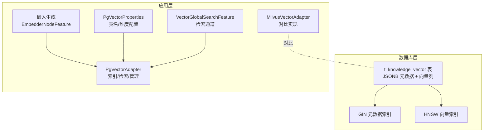
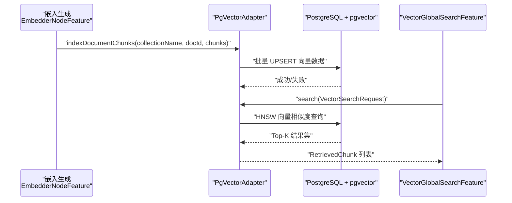
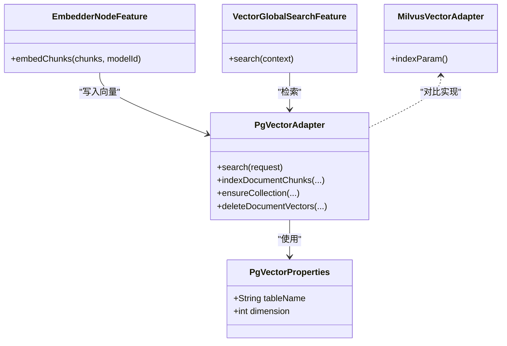

# 向量存储表

<cite>
**本文引用的文件**
- [seahorse_init.sql](file://resources/database/seahorse_init.sql)
- [PgVectorAdapter.java](file://seahorse-agent-adapter-vector-pgvector/src/main/java/com/miracle/ai/seahorse/agent/adapters/vector/pgvector/PgVectorAdapter.java)
- [PgVectorProperties.java](file://seahorse-agent-adapter-vector-pgvector/src/main/java/com/miracle/ai/seahorse/agent/adapters/vector/pgvector/PgVectorProperties.java)
- [EmbedderNodeFeature.java](file://seahorse-agent-kernel/src/main/java/com/miracle/ai/seahorse/agent/kernel/feature/ingestion/EmbedderNodeFeature.java)
- [VectorGlobalSearchFeature.java](file://seahorse-agent-kernel/src/main/java/com/miracle/ai/seahorse/agent/kernel/feature/retrieval/VectorGlobalSearchFeature.java)
- [MilvusVectorAdapter.java](file://seahorse-agent-adapter-vector-milvus/src/main/java/com/miracle/ai/seahorse/agent/adapters/vector/milvus/MilvusVectorAdapter.java)
- [seahorse_init.sql](file://resources/database/seahorse_init.sql)
</cite>

## 目录
1. [简介](#简介)
2. [项目结构](#项目结构)
3. [核心组件](#核心组件)
4. [架构概览](#架构概览)
5. [详细组件分析](#详细组件分析)
6. [依赖关系分析](#依赖关系分析)
7. [性能考量](#性能考量)
8. [故障排查指南](#故障排查指南)
9. [结论](#结论)
10. [附录](#附录)

## 简介
本文件聚焦于向量存储表 t_knowledge_vector 的设计理念与实现细节，系统性解析以下主题：
- pgvector 扩展的使用与 HNSW 索引配置
- 向量维度选择与索引类型设计
- 元数据存储的 JSONB 优化
- 向量相似度搜索的优化策略与检索性能
- 内存管理策略与批量插入效率
- 与知识库分块表的关联设计、嵌入模型版本管理、向量质量评估机制
- 实际 SQL 建表语句分析与最佳实践建议

## 项目结构
围绕向量存储表的关键文件分布如下：
- 数据库模式定义：resources/database/seahorse_init.sql
- PostgreSQL 向量适配器：seahorse-agent-adapter-vector-pgvector/PgVectorAdapter.java
- 向量适配器配置：PgVectorProperties.java
- 嵌入生成与模型版本管理：kernel/feature/ingestion/EmbedderNodeFeature.java
- 向量检索通道：kernel/feature/retrieval/VectorGlobalSearchFeature.java
- 可选 Milvus 向量适配器对比：seahorse-agent-adapter-vector-milvus/MilvusVectorAdapter.java
- 初始化数据：resources/database/seahorse_init.sql

图表来源
- [seahorse_init.sql:419-436](file://resources/database/seahorse_init.sql#L419-L436)
- [PgVectorAdapter.java:48-331](file://seahorse-agent-adapter-vector-pgvector/src/main/java/com/miracle/ai/seahorse/agent/adapters/vector/pgvector/PgVectorAdapter.java#L48-L331)
- [PgVectorProperties.java:28-38](file://seahorse-agent-adapter-vector-pgvector/src/main/java/com/miracle/ai/seahorse/agent/adapters/vector/pgvector/PgVectorProperties.java#L28-L38)
- [EmbedderNodeFeature.java:72-95](file://seahorse-agent-kernel/src/main/java/com/miracle/ai/seahorse/agent/kernel/feature/ingestion/EmbedderNodeFeature.java#L72-L95)
- [VectorGlobalSearchFeature.java:94-128](file://seahorse-agent-kernel/src/main/java/com/miracle/ai/seahorse/agent/kernel/feature/retrieval/VectorGlobalSearchFeature.java#L94-L128)
- [MilvusVectorAdapter.java:220-228](file://seahorse-agent-adapter-vector-milvus/src/main/java/com/miracle/ai/seahorse/agent/adapters/vector/milvus/MilvusVectorAdapter.java#L220-L228)

章节来源
- [seahorse_init.sql:419-436](file://resources/database/seahorse_init.sql#L419-L436)
- [PgVectorAdapter.java:48-331](file://seahorse-agent-adapter-vector-pgvector/src/main/java/com/miracle/ai/seahorse/agent/adapters/vector/pgvector/PgVectorAdapter.java#L48-L331)
- [PgVectorProperties.java:28-38](file://seahorse-agent-adapter-vector-pgvector/src/main/java/com/miracle/ai/seahorse/agent/adapters/vector/pgvector/PgVectorProperties.java#L28-L38)
- [EmbedderNodeFeature.java:72-95](file://seahorse-agent-kernel/src/main/java/com/miracle/ai/seahorse/agent/kernel/feature/ingestion/EmbedderNodeFeature.java#L72-L95)
- [VectorGlobalSearchFeature.java:94-128](file://seahorse-agent-kernel/src/main/java/com/miracle/ai/seahorse/agent/kernel/feature/retrieval/VectorGlobalSearchFeature.java#L94-L128)
- [MilvusVectorAdapter.java:220-228](file://seahorse-agent-adapter-vector-milvus/src/main/java/com/miracle/ai/seahorse/agent/adapters/vector/milvus/MilvusVectorAdapter.java#L220-L228)

## 核心组件
- t_knowledge_vector 表：存储分块 ID、文本内容、JSONB 元数据、向量列；提供 GIN 元数据索引与 HNSW 向量索引。
- PgVectorAdapter：封装 PostgreSQL + pgvector 的索引构建、向量检索、文档向量管理（新增/更新/删除）。
- PgVectorProperties：定义表名与向量维度，确保维度正数约束。
- EmbedderNodeFeature：负责对分块内容进行嵌入生成，并将向量写回 VectorChunk。
- VectorGlobalSearchFeature：聚合多知识库集合的向量检索请求，作为检索通道入口。
- MilvusVectorAdapter：提供 HNSW 索引配置参数的对比实现，便于横向比较。

章节来源
- [seahorse_init.sql:419-436](file://resources/database/seahorse_init.sql#L419-L436)
- [PgVectorAdapter.java:48-331](file://seahorse-agent-adapter-vector-pgvector/src/main/java/com/miracle/ai/seahorse/agent/adapters/vector/pgvector/PgVectorAdapter.java#L48-L331)
- [PgVectorProperties.java:28-38](file://seahorse-agent-adapter-vector-pgvector/src/main/java/com/miracle/ai/seahorse/agent/adapters/vector/pgvector/PgVectorProperties.java#L28-L38)
- [EmbedderNodeFeature.java:72-95](file://seahorse-agent-kernel/src/main/java/com/miracle/ai/seahorse/agent/kernel/feature/ingestion/EmbedderNodeFeature.java#L72-L95)
- [VectorGlobalSearchFeature.java:94-128](file://seahorse-agent-kernel/src/main/java/com/miracle/ai/seahorse/agent/kernel/feature/retrieval/VectorGlobalSearchFeature.java#L94-L128)
- [MilvusVectorAdapter.java:220-228](file://seahorse-agent-adapter-vector-milvus/src/main/java/com/miracle/ai/seahorse/agent/adapters/vector/milvus/MilvusVectorAdapter.java#L220-L228)

## 架构概览
下图展示了从“嵌入生成”到“向量检索”的端到端流程，以及 t_knowledge_vector 的索引与查询路径。

图表来源
- [EmbedderNodeFeature.java:72-95](file://seahorse-agent-kernel/src/main/java/com/miracle/ai/seahorse/agent/kernel/feature/ingestion/EmbedderNodeFeature.java#L72-L95)
- [PgVectorAdapter.java:83-109](file://seahorse-agent-adapter-vector-pgvector/src/main/java/com/miracle/ai/seahorse/agent/adapters/vector/pgvector/PgVectorAdapter.java#L83-L109)
- [PgVectorAdapter.java:163-178](file://seahorse-agent-adapter-vector-pgvector/src/main/java/com/miracle/ai/seahorse/agent/adapters/vector/pgvector/PgVectorAdapter.java#L163-L178)
- [seahorse_init.sql:419-436](file://resources/database/seahorse_init.sql#L419-L436)

## 详细组件分析

### 表设计：t_knowledge_vector
- 字段与约束
  - id：主键，分块 ID
  - content：文本内容
  - metadata：JSONB，用于存储集合名、文档 ID、分块索引等检索过滤与溯源信息
  - embedding：向量列，维度由 Embedding 模型解析；当前全量默认 `nomic-embed-text` 为 768 维
- 索引设计
  - GIN 元数据索引：加速 metadata 上的过滤与检索
  - HNSW 向量索引：基于向量余弦距离，支持高效近似最近邻搜索
- 注释与用途
  - 表与列注释明确其职责，便于维护与审计

章节来源
- [seahorse_init.sql:419-436](file://resources/database/seahorse_init.sql#L419-L436)

### 向量维度选择与索引类型
- 维度选择
  - 表定义中的 embedding 维度必须与当前 Embedding 模型一致；当前全量默认 `nomic-embed-text` 为 768 维
  - PgVectorProperties 对维度进行正数校验，避免运行时错误
- 索引类型
  - HNSW：支持 ef_search、M、efConstruction 等参数调优，适合大规模向量检索
  - GIN：针对 JSONB 元数据的快速过滤

章节来源
- [seahorse_init.sql:422-427](file://resources/database/seahorse_init.sql#L422-L427)
- [PgVectorProperties.java:32-37](file://seahorse-agent-adapter-vector-pgvector/src/main/java/com/miracle/ai/seahorse/agent/adapters/vector/pgvector/PgVectorProperties.java#L32-L37)
- [PgVectorAdapter.java:274-277](file://seahorse-agent-adapter-vector-pgvector/src/main/java/com/miracle/ai/seahorse/agent/adapters/vector/pgvector/PgVectorAdapter.java#L274-L277)

### 元数据存储与 JSONB 优化
- 元数据结构
  - 固定键：collection_name、doc_id、chunk_index
  - 动态键：来自 VectorChunk 的其他元数据
- JSONB 优势
  - 支持高效查询与更新；GIN 索引可显著降低过滤成本
- 序列化与反序列化
  - 使用 Jackson 将 Map 转换为 JSONB 字符串，保证一致性与可读性

章节来源
- [PgVectorAdapter.java:197-210](file://seahorse-agent-adapter-vector-pgvector/src/main/java/com/miracle/ai/seahorse/agent/adapters/vector/pgvector/PgVectorAdapter.java#L197-L210)

### 向量相似度搜索与优化策略
- 查询语义
  - 使用余弦距离（cosine_ops），返回相似度分数
  - 通过 metadata->>'collection_name' 过滤集合范围
- 性能优化
  - 设置 hnsw.ef_search 参数以平衡召回与延迟
  - 使用 Top-K 限制结果规模
- 并发与连接
  - 单次查询在连接内执行，避免跨连接状态泄漏

章节来源
- [PgVectorAdapter.java:67-80](file://seahorse-agent-adapter-vector-pgvector/src/main/java/com/miracle/ai/seahorse/agent/adapters/vector/pgvector/PgVectorAdapter.java#L67-L80)
- [PgVectorAdapter.java:163-178](file://seahorse-agent-adapter-vector-pgvector/src/main/java/com/miracle/ai/seahorse/agent/adapters/vector/pgvector/PgVectorAdapter.java#L163-L178)
- [PgVectorAdapter.java:53-55](file://seahorse-agent-adapter-vector-pgvector/src/main/java/com/miracle/ai/seahorse/agent/adapters/vector/pgvector/PgVectorAdapter.java#L53-L55)

### 批量插入与内存管理
- 批量插入
  - 使用 PreparedStatement.addBatch 与 executeBatch 提升写入吞吐
  - UPSERT 语义避免重复插入，同时更新内容与向量
- 内存管理
  - 流式绑定 VectorChunk，避免大对象复制
  - 严格校验向量维度，防止异常导致资源占用

章节来源
- [PgVectorAdapter.java:83-97](file://seahorse-agent-adapter-vector-pgvector/src/main/java/com/miracle/ai/seahorse/agent/adapters/vector/pgvector/PgVectorAdapter.java#L83-L97)
- [PgVectorAdapter.java:256-261](file://seahorse-agent-adapter-vector-pgvector/src/main/java/com/miracle/ai/seahorse/agent/adapters/vector/pgvector/PgVectorAdapter.java#L256-L261)
- [PgVectorAdapter.java:279-287](file://seahorse-agent-adapter-vector-pgvector/src/main/java/com/miracle/ai/seahorse/agent/adapters/vector/pgvector/PgVectorAdapter.java#L279-L287)

### 与知识库分块表的关联设计
- 关联字段
  - metadata 中包含 collection_name、doc_id、chunk_index，实现从向量到分块的溯源
- 分块表与向量表的生命周期
  - 分块表承载内容与统计信息；向量表承载检索所需的向量与元数据
- 检索通道
  - VectorGlobalSearchFeature 聚合多个知识库集合，按集合维度进行检索

章节来源
- [PgVectorAdapter.java:197-210](file://seahorse-agent-adapter-vector-pgvector/src/main/java/com/miracle/ai/seahorse/agent/adapters/vector/pgvector/PgVectorAdapter.java#L197-L210)
- [VectorGlobalSearchFeature.java:94-128](file://seahorse-agent-kernel/src/main/java/com/miracle/ai/seahorse/agent/kernel/feature/retrieval/VectorGlobalSearchFeature.java#L94-L128)

### 嵌入模型版本管理
- 模型标识
  - 知识库表包含 embedding_model 字段，用于标识所用嵌入模型
- 检索一致性
  - 向量维度需与模型一致；PgVectorProperties 对维度进行强约束
- 版本演进
  - 当模型维度变化时，应同步调整表定义与适配器配置

章节来源
- [seahorse_init.sql:116-127](file://resources/database/seahorse_init.sql#L116-L127)
- [PgVectorProperties.java:32-37](file://seahorse-agent-adapter-vector-pgvector/src/main/java/com/miracle/ai/seahorse/agent/adapters/vector/pgvector/PgVectorProperties.java#L32-L37)
- [EmbedderNodeFeature.java:80-91](file://seahorse-agent-kernel/src/main/java/com/miracle/ai/seahorse/agent/kernel/feature/ingestion/EmbedderNodeFeature.java#L80-L91)

### 向量质量评估机制
- 评估维度
  - 可结合向量相似度、召回率、检索延迟等指标进行评估
- 存储与报告
  - 长期记忆向量表与冲突日志、质量快照表可用于质量评估与治理
- 建议
  - 定期抽样检查向量分布与检索效果，必要时重建索引

章节来源
- [seahorse_init.sql:840-849](file://resources/database/seahorse_init.sql#L840-L849)
- [seahorse_init.sql:815-838](file://resources/database/seahorse_init.sql#L815-L838)

## 依赖关系分析
- 组件耦合
  - PgVectorAdapter 依赖 DataSource、ObjectMapper、PgVectorProperties
  - 检索通道依赖 VectorSearchPort 接口，便于替换不同后端（如 Milvus）
- 外部依赖
  - PostgreSQL + pgvector 扩展
  - JSONB 与 HNSW 索引能力

图表来源
- [PgVectorAdapter.java:48-331](file://seahorse-agent-adapter-vector-pgvector/src/main/java/com/miracle/ai/seahorse/agent/adapters/vector/pgvector/PgVectorAdapter.java#L48-L331)
- [PgVectorProperties.java:28-38](file://seahorse-agent-adapter-vector-pgvector/src/main/java/com/miracle/ai/seahorse/agent/adapters/vector/pgvector/PgVectorProperties.java#L28-L38)
- [EmbedderNodeFeature.java:72-95](file://seahorse-agent-kernel/src/main/java/com/miracle/ai/seahorse/agent/kernel/feature/ingestion/EmbedderNodeFeature.java#L72-L95)
- [VectorGlobalSearchFeature.java:94-128](file://seahorse-agent-kernel/src/main/java/com/miracle/ai/seahorse/agent/kernel/feature/retrieval/VectorGlobalSearchFeature.java#L94-L128)
- [MilvusVectorAdapter.java:220-228](file://seahorse-agent-adapter-vector-milvus/src/main/java/com/miracle/ai/seahorse/agent/adapters/vector/milvus/MilvusVectorAdapter.java#L220-L228)

## 性能考量
- 索引参数调优
  - HNSW ef_search：提高查询召回与稳定性
  - HNSW efConstruction：影响索引构建质量与构建时间
  - 参考实现中的 ef_search 设置与 Milvus 的 efConstruction 配置
- 批量写入
  - 使用 addBatch + executeBatch 提升吞吐
  - UPSERT 语义减少重复写入
- 查询优化
  - 限定 Top-K，避免全表扫描
  - 使用 GIN 元数据索引进行集合过滤
- 维度与硬件
  - 向量维度越高，存储、索引和检索成本越高；切换模型后需要重建既有向量索引
  - 硬件资源紧张时可考虑降维或混合索引策略

章节来源
- [PgVectorAdapter.java:53-55](file://seahorse-agent-adapter-vector-pgvector/src/main/java/com/miracle/ai/seahorse/agent/adapters/vector/pgvector/PgVectorAdapter.java#L53-L55)
- [PgVectorAdapter.java:83-97](file://seahorse-agent-adapter-vector-pgvector/src/main/java/com/miracle/ai/seahorse/agent/adapters/vector/pgvector/PgVectorAdapter.java#L83-L97)
- [PgVectorAdapter.java:163-178](file://seahorse-agent-adapter-vector-pgvector/src/main/java/com/miracle/ai/seahorse/agent/adapters/vector/pgvector/PgVectorAdapter.java#L163-L178)
- [MilvusVectorAdapter.java:220-228](file://seahorse-agent-adapter-vector-milvus/src/main/java/com/miracle/ai/seahorse/agent/adapters/vector/milvus/MilvusVectorAdapter.java#L220-L228)

## 故障排查指南
- 常见错误与定位
  - pgvector 扩展未安装：在 ensureCollection 时检测并抛出异常
  - 非 PostgreSQL 连接：在 requirePostgreSql 中校验
  - 向量维度不匹配：在 requireVector 中校验
  - 空集合名/分块 ID：在 requireText 中校验
- 排查步骤
  - 确认数据库为 PostgreSQL 并已安装 vector 扩展
  - 校验嵌入模型维度与表定义一致
  - 检查 JSONB 元数据键值是否正确写入
  - 观察 ef_search 设置与 Top-K 是否合理

章节来源
- [PgVectorAdapter.java:230-244](file://seahorse-agent-adapter-vector-pgvector/src/main/java/com/miracle/ai/seahorse/agent/adapters/vector/pgvector/PgVectorAdapter.java#L230-L244)
- [PgVectorAdapter.java:279-287](file://seahorse-agent-adapter-vector-pgvector/src/main/java/com/miracle/ai/seahorse/agent/adapters/vector/pgvector/PgVectorAdapter.java#L279-L287)
- [PgVectorAdapter.java:324-329](file://seahorse-agent-adapter-vector-pgvector/src/main/java/com/miracle/ai/seahorse/agent/adapters/vector/pgvector/PgVectorAdapter.java#L324-L329)

## 结论
t_knowledge_vector 表通过 pgvector + HNSW 的组合，实现了高召回与低延迟的向量检索能力。配合 JSONB 元数据索引与严格的维度校验，系统在可维护性与性能之间取得平衡。建议在生产环境中持续监控 ef_search、Top-K 与索引构建参数，并根据业务负载动态调整，以获得最优的检索体验与资源利用率。

## 附录

### 实际 SQL 建表语句分析
- 创建扩展与表
  - 启用 vector 扩展
  - 创建 t_knowledge_vector 表，定义主键、文本、JSONB 元数据、向量列
- 创建索引
  - GIN 元数据索引：加速 metadata 过滤
  - HNSW 向量索引：基于余弦距离，支持 ef_search 调优
- 注释
  - 明确各列用途，便于后续维护与审计

章节来源
- [seahorse_init.sql:419-436](file://resources/database/seahorse_init.sql#L419-L436)

### 最佳实践建议
- 向量检索优化
  - 合理设置 ef_search 与 Top-K，兼顾召回与延迟
  - 使用 metadata 过滤缩小候选集，再进行向量检索
- 存储空间管理
  - 控制单条记录的 content 长度，避免超长文本影响 IO
  - 定期清理无效/过期文档向量，释放空间
- 系统性能调优
  - 批量写入时使用 addBatch + executeBatch
  - 在高并发场景下，合理配置数据库连接池与查询超时
  - 监控索引构建与查询延迟，必要时重建 HNSW 索引

章节来源
- [PgVectorAdapter.java:83-97](file://seahorse-agent-adapter-vector-pgvector/src/main/java/com/miracle/ai/seahorse/agent/adapters/vector/pgvector/PgVectorAdapter.java#L83-L97)
- [PgVectorAdapter.java:163-178](file://seahorse-agent-adapter-vector-pgvector/src/main/java/com/miracle/ai/seahorse/agent/adapters/vector/pgvector/PgVectorAdapter.java#L163-L178)
- [seahorse_init.sql:419-436](file://resources/database/seahorse_init.sql#L419-L436)
