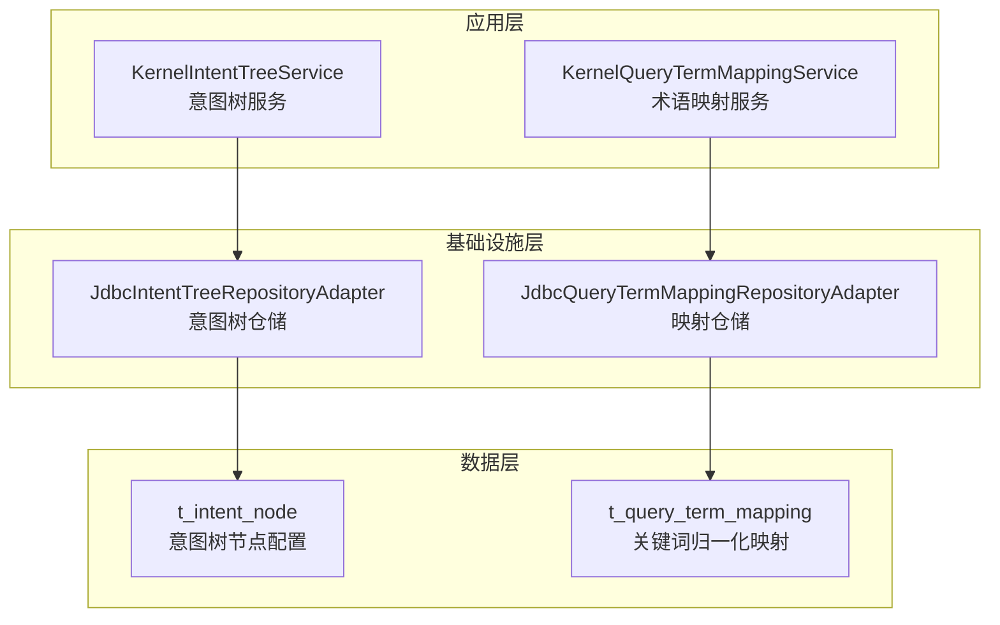
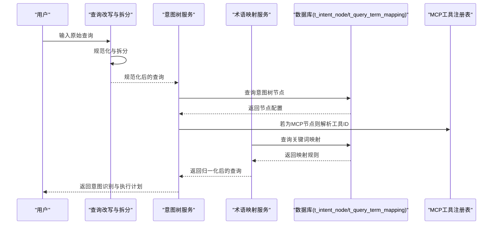
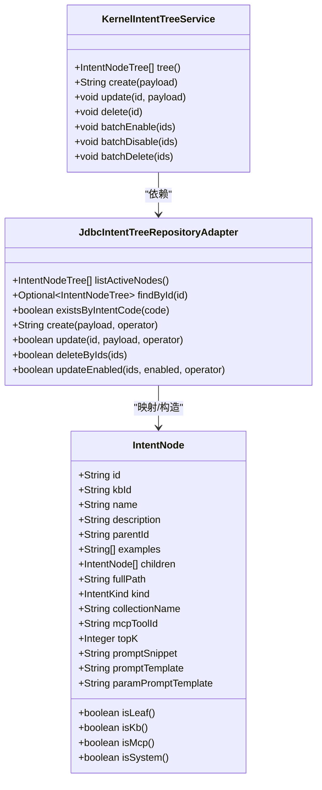
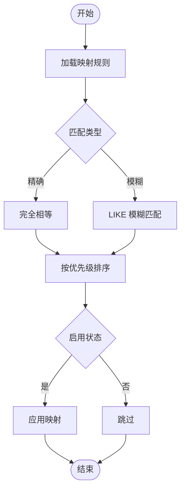
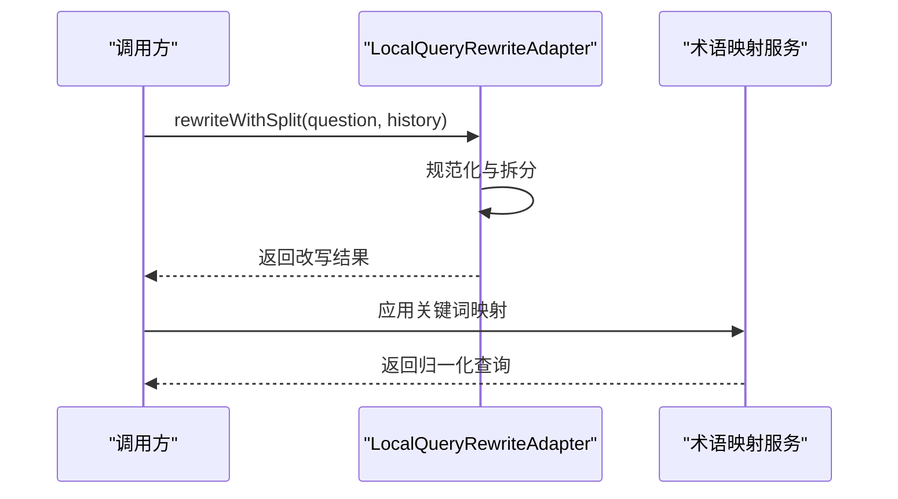
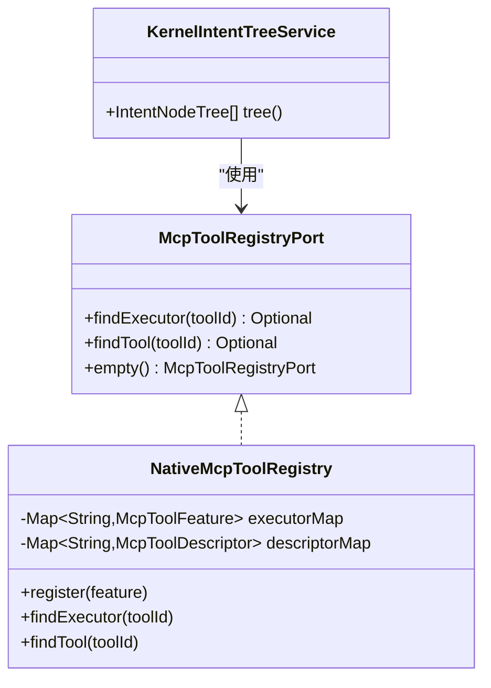
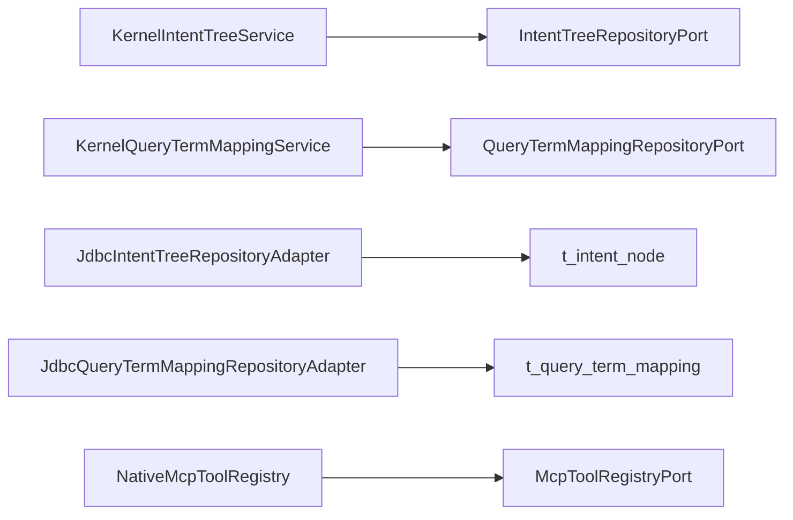

# 意图与查询相关表

<cite>
**本文引用的文件**
- [seahorse_init.sql](file://resources/database/seahorse_init.sql)
- [JdbcIntentTreeRepositoryAdapter.java](file://seahorse-agent-adapter-repository-jdbc/src/main/java/com/miracle/ai/seahorse/agent/adapters/repository/jdbc/JdbcIntentTreeRepositoryAdapter.java)
- [JdbcQueryTermMappingRepositoryAdapter.java](file://seahorse-agent-adapter-repository-jdbc/src/main/java/com/miracle/ai/seahorse/agent/adapters/repository/jdbc/JdbcQueryTermMappingRepositoryAdapter.java)
- [KernelIntentTreeService.java](file://seahorse-agent-kernel/src/main/java/com/miracle/ai/seahorse/agent/kernel/application/intent/KernelIntentTreeService.java)
- [KernelQueryTermMappingService.java](file://seahorse-agent-kernel/src/main/java/com/miracle/ai/seahorse/agent/kernel/application/mapping/KernelQueryTermMappingService.java)
- [IntentNode.java](file://seahorse-agent-kernel/src/main/java/com/miracle/ai/seahorse/agent/kernel/domain/intent/IntentNode.java)
- [IntentScore.java](file://seahorse-agent-kernel/src/main/java/com/miracle/ai/seahorse/agent/kernel/domain/intent/IntentScore.java)
- [LocalQueryRewriteAdapter.java](file://seahorse-agent-adapter-web/src/main/java/com/miracle/ai/seahorse/agent/adapters/local/LocalQueryRewriteAdapter.java)
- [QueryRewritePort.java](file://seahorse-agent-kernel/src/main/java/com/miracle/ai/seahorse/agent/ports/outbound/chat/QueryRewritePort.java)
- [NativeMcpToolRegistry.java](file://seahorse-agent-adapter-mcp-http/src/main/java/com/miracle/ai/seahorse/agent/adapters/mcp/http/NativeMcpToolRegistry.java)
- [McpToolRegistryPort.java](file://seahorse-agent-kernel/src/main/java/com/miracle/ai/seahorse/agent/ports/outbound/mcp/McpToolRegistryPort.java)
</cite>

## 目录
1. [简介](#简介)
2. [项目结构](#项目结构)
3. [核心组件](#核心组件)
4. [架构总览](#架构总览)
5. [详细组件分析](#详细组件分析)
6. [依赖分析](#依赖分析)
7. [性能考量](#性能考量)
8. [故障排查指南](#故障排查指南)
9. [结论](#结论)
10. [附录](#附录)

## 简介
本文件聚焦于意图理解与查询处理相关的数据库表与配套实现，重点解析以下两个核心表：
- t_intent_node：意图树节点配置表，承载意图分类的层级化设计、节点配置的灵活存储、父子关系维护、MCP工具集成等能力。
- t_query_term_mapping：关键词归一化映射表，支持查询词规范化处理与匹配策略。

同时，结合后端服务层与JDBC仓储适配器，说明JSONB字段在配置存储中的应用、查询重写与拆分、以及系统可扩展性与性能优化建议。

## 项目结构
围绕意图与查询相关表，涉及三层：
- 数据层：PostgreSQL 表定义与注释（含索引、约束）
- 应用层：Kernel 服务封装业务规则与校验
- 基础设施层：JDBC 仓储适配器负责与数据库交互

图表来源
- [seahorse_init.sql:248-291](file://resources/database/seahorse_init.sql#L248-L291)
- [KernelIntentTreeService.java:41-231](file://seahorse-agent-kernel/src/main/java/com/miracle/ai/seahorse/agent/kernel/application/intent/KernelIntentTreeService.java#L41-L231)
- [KernelQueryTermMappingService.java:32-137](file://seahorse-agent-kernel/src/main/java/com/miracle/ai/seahorse/agent/kernel/application/mapping/KernelQueryTermMappingService.java#L32-L137)
- [JdbcIntentTreeRepositoryAdapter.java:42-307](file://seahorse-agent-adapter-repository-jdbc/src/main/java/com/miracle/ai/seahorse/agent/adapters/repository/jdbc/JdbcIntentTreeRepositoryAdapter.java#L42-L307)
- [JdbcQueryTermMappingRepositoryAdapter.java:40-207](file://seahorse-agent-adapter-repository-jdbc/src/main/java/com/miracle/ai/seahorse/agent/adapters/repository/jdbc/JdbcQueryTermMappingRepositoryAdapter.java#L40-L207)

章节来源
- [seahorse_init.sql:248-291](file://resources/database/seahorse_init.sql#L248-L291)

## 核心组件
- t_intent_node：存储意图树节点的业务标识、层级、父子关系、提示词模板、MCP工具ID、TopK检索等配置，支持按排序字段与启用状态进行组织。
- t_query_term_mapping：存储查询词的归一化映射规则，包含匹配类型（精确/模糊）、优先级、启用状态等，支撑查询规范化与重写。

章节来源
- [seahorse_init.sql:248-291](file://resources/database/seahorse_init.sql#L248-L291)

## 架构总览
意图与查询处理的端到端流程如下：
- 查询输入经“查询改写与拆分”模块进行规范化与切分
- 意图识别通过“意图树服务”构建树形结构并进行匹配
- 关键词映射通过“术语映射服务”进行归一化
- 最终调用MCP工具或知识库检索完成执行

图表来源
- [LocalQueryRewriteAdapter.java:32-63](file://seahorse-agent-adapter-web/src/main/java/com/miracle/ai/seahorse/agent/adapters/local/LocalQueryRewriteAdapter.java#L32-L63)
- [KernelIntentTreeService.java:56-134](file://seahorse-agent-kernel/src/main/java/com/miracle/ai/seahorse/agent/kernel/application/intent/KernelIntentTreeService.java#L56-L134)
- [KernelQueryTermMappingService.java:47-81](file://seahorse-agent-kernel/src/main/java/com/miracle/ai/seahorse/agent/kernel/application/mapping/KernelQueryTermMappingService.java#L47-L81)
- [JdbcIntentTreeRepositoryAdapter.java:80-182](file://seahorse-agent-adapter-repository-jdbc/src/main/java/com/miracle/ai/seahorse/agent/adapters/repository/jdbc/JdbcIntentTreeRepositoryAdapter.java#L80-L182)
- [JdbcQueryTermMappingRepositoryAdapter.java:62-137](file://seahorse-agent-adapter-repository-jdbc/src/main/java/com/miracle/ai/seahorse/agent/adapters/repository/jdbc/JdbcQueryTermMappingRepositoryAdapter.java#L62-L137)
- [NativeMcpToolRegistry.java:37-76](file://seahorse-agent-adapter-mcp-http/src/main/java/com/miracle/ai/seahorse/agent/adapters/mcp/http/NativeMcpToolRegistry.java#L37-L76)

## 详细组件分析

### t_intent_node 表设计与实现
- 字段要点
  - 业务唯一标识：intent_code
  - 层级与父子关系：level、parent_code
  - 配置灵活性：examples（JSON数组）、prompt_snippet、prompt_template、param_prompt_template（MCP专属）
  - 执行策略：kind（KB/系统/工具）、mcp_tool_id、top_k
  - 排序与启用：sort_order、enabled
  - 知识库绑定：kb_id、collection_name
- 父子关系维护
  - 通过 parent_code 与 intent_code 构建 children 映射，根节点以 "ROOT" 分组
  - 提供批量启用/禁用/删除时的后代节点校验，确保先处理子节点再处理父节点
- MCP 工具集成
  - 当 kind 为 MCP 且存在 mcp_tool_id 时，由工具注册表解析执行器与描述符
- JSONB 字段使用
  - examples 使用 JSON 存储，便于灵活扩展与查询端解析
- 建表语句与注释
  - 参见 seahorse_init.sql 中 t_intent_node 定义与列注释

图表来源
- [IntentNode.java:29-83](file://seahorse-agent-kernel/src/main/java/com/miracle/ai/seahorse/agent/kernel/domain/intent/IntentNode.java#L29-L83)
- [KernelIntentTreeService.java:41-231](file://seahorse-agent-kernel/src/main/java/com/miracle/ai/seahorse/agent/kernel/application/intent/KernelIntentTreeService.java#L41-L231)
- [JdbcIntentTreeRepositoryAdapter.java:42-307](file://seahorse-agent-adapter-repository-jdbc/src/main/java/com/miracle/ai/seahorse/agent/adapters/repository/jdbc/JdbcIntentTreeRepositoryAdapter.java#L42-L307)

章节来源
- [seahorse_init.sql:248-271](file://resources/database/seahorse_init.sql#L248-L271)
- [seahorse_init.sql:596-618](file://resources/database/seahorse_init.sql#L596-L618)
- [KernelIntentTreeService.java:56-134](file://seahorse-agent-kernel/src/main/java/com/miracle/ai/seahorse/agent/kernel/application/intent/KernelIntentTreeService.java#L56-L134)
- [JdbcIntentTreeRepositoryAdapter.java:80-182](file://seahorse-agent-adapter-repository-jdbc/src/main/java/com/miracle/ai/seahorse/agent/adapters/repository/jdbc/JdbcIntentTreeRepositoryAdapter.java#L80-L182)

### t_query_term_mapping 表设计与实现
- 字段要点
  - domain、source_term、target_term、match_type（精确/模糊）、priority、enabled
  - 支持按 domain/source_term/target_term 建立索引，便于快速查找
- 匹配策略
  - 精确匹配：完全相等
  - 模糊匹配：LIKE 模式，支持关键词检索
- 分页与缓存
  - 提供分页查询接口，结合缓存键统一清理，保障一致性

图表来源
- [seahorse_init.sql:274-288](file://resources/database/seahorse_init.sql#L274-L288)
- [seahorse_init.sql:621-634](file://resources/database/seahorse_init.sql#L621-L634)
- [JdbcQueryTermMappingRepositoryAdapter.java:139-147](file://seahorse-agent-adapter-repository-jdbc/src/main/java/com/miracle/ai/seahorse/agent/adapters/repository/jdbc/JdbcQueryTermMappingRepositoryAdapter.java#L139-L147)
- [KernelQueryTermMappingService.java:47-81](file://seahorse-agent-kernel/src/main/java/com/miracle/ai/seahorse/agent/kernel/application/mapping/KernelQueryTermMappingService.java#L47-L81)

章节来源
- [seahorse_init.sql:274-288](file://resources/database/seahorse_init.sql#L274-L288)
- [JdbcQueryTermMappingRepositoryAdapter.java:62-137](file://seahorse-agent-adapter-repository-jdbc/src/main/java/com/miracle/ai/seahorse/agent/adapters/repository/jdbc/JdbcQueryTermMappingRepositoryAdapter.java#L62-L137)
- [KernelQueryTermMappingService.java:47-81](file://seahorse-agent-kernel/src/main/java/com/miracle/ai/seahorse/agent/kernel/application/mapping/KernelQueryTermMappingService.java#L47-L81)

### 查询改写与拆分
- 规范化策略
  - 去除首尾空白
  - 按换行、问号、问号全角、分号等符号拆分为子问题
  - 去重与过滤空串
- 与映射规则协同
  - 在改写后进一步应用关键词映射，提升召回质量

图表来源
- [LocalQueryRewriteAdapter.java:32-63](file://seahorse-agent-adapter-web/src/main/java/com/miracle/ai/seahorse/agent/adapters/local/LocalQueryRewriteAdapter.java#L32-L63)
- [QueryRewritePort.java:28-45](file://seahorse-agent-kernel/src/main/java/com/miracle/ai/seahorse/agent/ports/outbound/chat/QueryRewritePort.java#L28-L45)

章节来源
- [LocalQueryRewriteAdapter.java:32-63](file://seahorse-agent-adapter-web/src/main/java/com/miracle/ai/seahorse/agent/adapters/local/LocalQueryRewriteAdapter.java#L32-L63)
- [QueryRewritePort.java:28-45](file://seahorse-agent-kernel/src/main/java/com/miracle/ai/seahorse/agent/ports/outbound/chat/QueryRewritePort.java#L28-L45)

### MCP 工具集成
- 工具注册表
  - NativeMcpToolRegistry 聚合本地与远程工具特征，按 toolId 建立执行器与描述符映射
  - 支持按工具ID查找执行器与元数据
- 与意图树协作
  - 当意图节点 kind 为 MCP 且存在 mcp_tool_id 时，由注册表解析并执行

图表来源
- [McpToolRegistryPort.java:34-55](file://seahorse-agent-kernel/src/main/java/com/miracle/ai/seahorse/agent/ports/outbound/mcp/McpToolRegistryPort.java#L34-L55)
- [NativeMcpToolRegistry.java:37-76](file://seahorse-agent-adapter-mcp-http/src/main/java/com/miracle/ai/seahorse/agent/adapters/mcp/http/NativeMcpToolRegistry.java#L37-L76)
- [KernelIntentTreeService.java:56-63](file://seahorse-agent-kernel/src/main/java/com/miracle/ai/seahorse/agent/kernel/application/intent/KernelIntentTreeService.java#L56-L63)

章节来源
- [NativeMcpToolRegistry.java:37-76](file://seahorse-agent-adapter-mcp-http/src/main/java/com/miracle/ai/seahorse/agent/adapters/mcp/http/NativeMcpToolRegistry.java#L37-L76)
- [McpToolRegistryPort.java:34-55](file://seahorse-agent-kernel/src/main/java/com/miracle/ai/seahorse/agent/ports/outbound/mcp/McpToolRegistryPort.java#L34-L55)

## 依赖分析
- Kernel 服务依赖仓储端口，实现业务规则与校验
- JDBC 仓储适配器直接操作数据库表，负责 SQL 构造与参数绑定
- MCP 工具注册表与意图树服务解耦，通过工具ID进行动态解析

图表来源
- [KernelIntentTreeService.java:41-231](file://seahorse-agent-kernel/src/main/java/com/miracle/ai/seahorse/agent/kernel/application/intent/KernelIntentTreeService.java#L41-L231)
- [KernelQueryTermMappingService.java:32-137](file://seahorse-agent-kernel/src/main/java/com/miracle/ai/seahorse/agent/kernel/application/mapping/KernelQueryTermMappingService.java#L32-L137)
- [JdbcIntentTreeRepositoryAdapter.java:42-307](file://seahorse-agent-adapter-repository-jdbc/src/main/java/com/miracle/ai/seahorse/agent/adapters/repository/jdbc/JdbcIntentTreeRepositoryAdapter.java#L42-L307)
- [JdbcQueryTermMappingRepositoryAdapter.java:40-207](file://seahorse-agent-adapter-repository-jdbc/src/main/java/com/miracle/ai/seahorse/agent/adapters/repository/jdbc/JdbcQueryTermMappingRepositoryAdapter.java#L40-L207)
- [NativeMcpToolRegistry.java:37-76](file://seahorse-agent-adapter-mcp-http/src/main/java/com/miracle/ai/seahorse/agent/adapters/mcp/http/NativeMcpToolRegistry.java#L37-L76)

## 性能考量
- 索引与查询
  - t_query_term_mapping 对 domain、source_term 建有索引，有利于高频查询与分页
  - t_intent_node 按 sort_order、id 排序，利于前端渲染与快速定位
- 缓存策略
  - Kernel 服务在变更后主动清理缓存键，避免脏读
- JSONB 字段
  - examples 使用 JSON 存储，减少多字段冗余；查询端注意仅在需要时解析
- TopK 限制
  - 服务层对 topK 进行正数校验，避免无效检索

章节来源
- [seahorse_init.sql:289-291](file://resources/database/seahorse_init.sql#L289-L291)
- [KernelIntentTreeService.java:210-214](file://seahorse-agent-kernel/src/main/java/com/miracle/ai/seahorse/agent/kernel/application/intent/KernelIntentTreeService.java#L210-L214)
- [JdbcIntentTreeRepositoryAdapter.java:266-274](file://seahorse-agent-adapter-repository-jdbc/src/main/java/com/miracle/ai/seahorse/agent/adapters/repository/jdbc/JdbcIntentTreeRepositoryAdapter.java#L266-L274)

## 故障排查指南
- 意图树
  - 父子关系异常：检查 parent_code 与 intent_code 是否正确对应
  - 启用/禁用失败：确认后代节点是否已选中或全部禁用/删除
  - TopK 非法：确保 topK > 0
- 术语映射
  - 查询无结果：确认 match_type 与 priority 设置，检查 enabled 状态
  - 分页异常：核对 keyword 参数与 SQL 构造逻辑
- MCP 工具
  - 工具不可用：确认工具ID是否存在、注册表是否已注册

章节来源
- [KernelIntentTreeService.java:103-134](file://seahorse-agent-kernel/src/main/java/com/miracle/ai/seahorse/agent/kernel/application/intent/KernelIntentTreeService.java#L103-L134)
- [KernelQueryTermMappingService.java:76-81](file://seahorse-agent-kernel/src/main/java/com/miracle/ai/seahorse/agent/kernel/application/mapping/KernelQueryTermMappingService.java#L76-L81)
- [JdbcQueryTermMappingRepositoryAdapter.java:139-147](file://seahorse-agent-adapter-repository-jdbc/src/main/java/com/miracle/ai/seahorse/agent/adapters/repository/jdbc/JdbcQueryTermMappingRepositoryAdapter.java#L139-L147)

## 结论
t_intent_node 与 t_query_term_mapping 共同构成了意图理解与查询处理的核心数据基础。通过 Kernel 服务层的规则校验、JDBC 仓储适配器的SQL封装，以及 MCP 工具注册表的动态集成，系统实现了灵活的意图分类、可扩展的节点配置、高效的关键词归一化与可维护的执行链路。配合合理的索引与缓存策略，可在保证一致性的同时提升查询与渲染性能。

## 附录
- 实际建表语句分析（摘自 seahorse_init.sql）
  - t_intent_node：定义了节点主键、业务标识、层级、父子关系、提示词模板、MCP工具ID、TopK、排序与启用状态等字段，并提供列注释
  - t_query_term_mapping：定义了领域、源词、目标词、匹配类型、优先级、启用状态等字段，并提供列注释
- 最佳实践建议
  - 意图理解优化
    - 合理设置层级与父子关系，避免层级过深导致渲染与匹配复杂度上升
    - 使用 examples 存储示例，便于训练与可视化
    - MCP 节点需明确工具ID与参数提取模板
  - 查询性能提升
    - 为高频查询字段建立索引（如 domain、source_term）
    - 控制 topK 合理范围，避免过度检索
    - 利用缓存键在变更后及时失效
  - 系统可扩展性
    - 通过 kind 与 mcp_tool_id 支持多种执行路径
    - JSONB 字段用于灵活配置，但需注意序列化与解析成本
    - 仓储适配器与服务层解耦，便于替换与扩展

章节来源
- [seahorse_init.sql:248-291](file://resources/database/seahorse_init.sql#L248-L291)