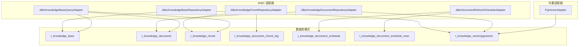
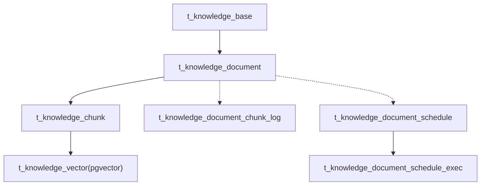
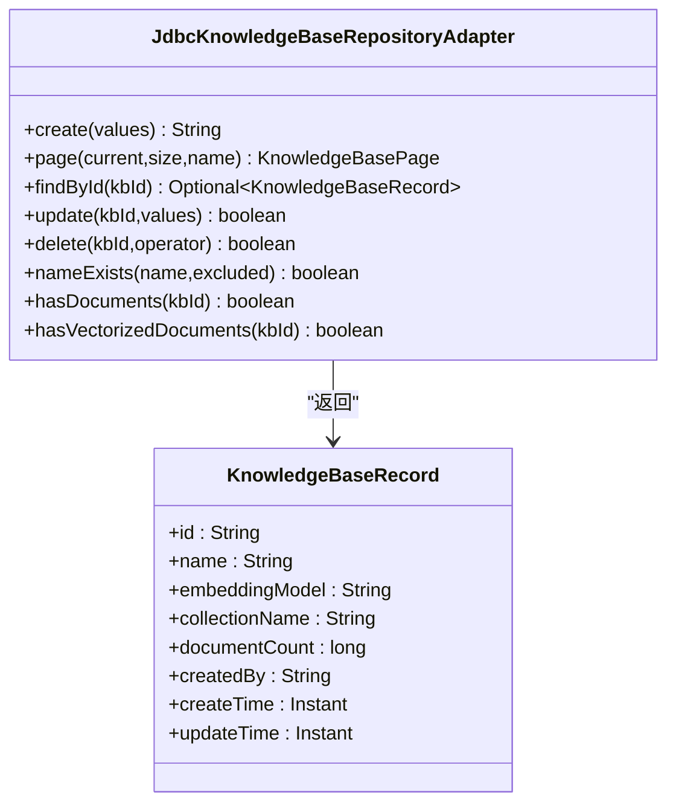
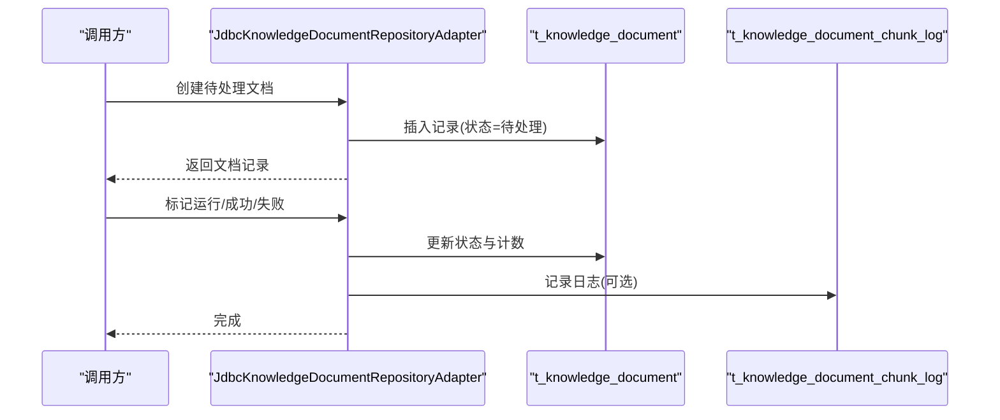
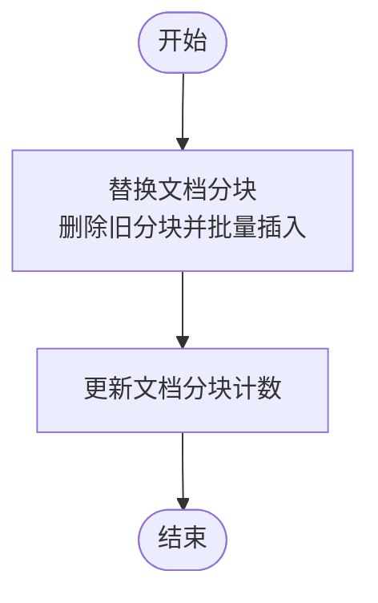
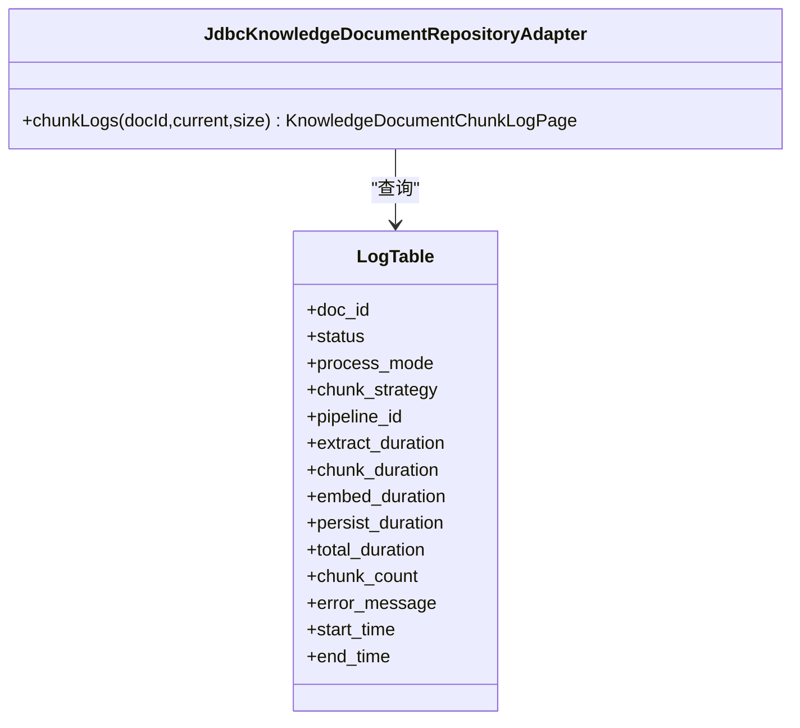
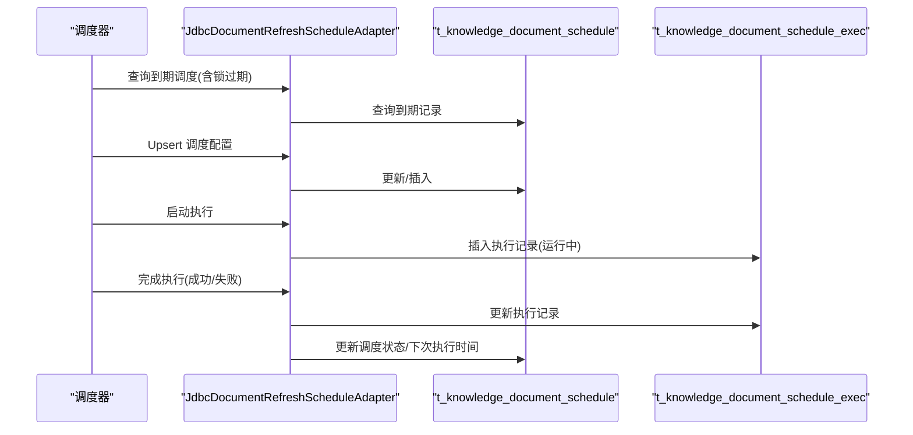
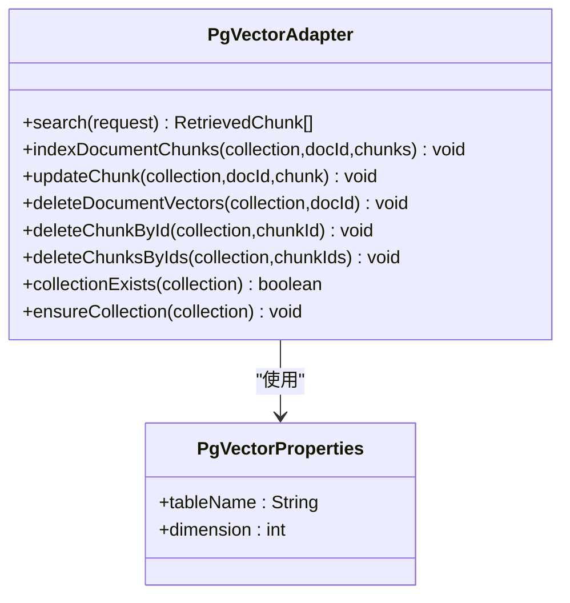
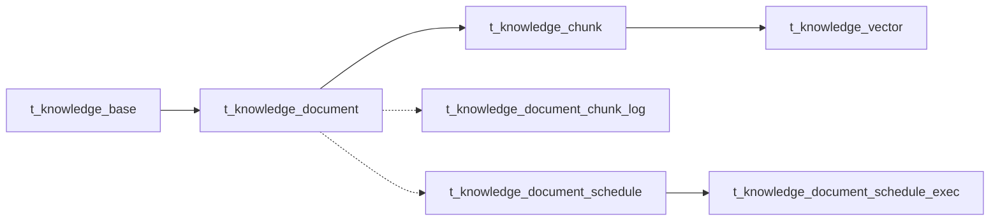

# 知识库相关表

<cite>
**本文引用的文件**
- [seahorse_init.sql](file://resources/database/seahorse_init.sql)
- [JdbcKnowledgeBaseRepositoryAdapter.java](file://seahorse-agent-adapter-repository-jdbc/src/main/java/com/miracle/ai/seahorse/agent/adapters/repository/jdbc/JdbcKnowledgeBaseRepositoryAdapter.java)
- [JdbcKnowledgeDocumentRepositoryAdapter.java](file://seahorse-agent-adapter-repository-jdbc/src/main/java/com/miracle/ai/seahorse/agent/adapters/repository/jdbc/JdbcKnowledgeDocumentRepositoryAdapter.java)
- [JdbcKnowledgeChunkRepositoryAdapter.java](file://seahorse-agent-adapter-repository-jdbc/src/main/java/com/miracle/ai/seahorse/agent/adapters/repository/jdbc/JdbcKnowledgeChunkRepositoryAdapter.java)
- [JdbcDocumentRefreshScheduleAdapter.java](file://seahorse-agent-adapter-repository-jdbc/src/main/java/com/miracle/ai/seahorse/agent/adapters/repository/jdbc/JdbcDocumentRefreshScheduleAdapter.java)
- [JdbcKnowledgeBaseQueryAdapter.java](file://seahorse-agent-adapter-repository-jdbc/src/main/java/com/miracle/ai/seahorse/agent/adapters/repository/jdbc/JdbcKnowledgeBaseQueryAdapter.java)
- [PgVectorAdapter.java](file://seahorse-agent-adapter-vector-pgvector/src/main/java/com/miracle/ai/seahorse/agent/adapters/vector/pgvector/PgVectorAdapter.java)
- [PgVectorProperties.java](file://seahorse-agent-adapter-vector-pgvector/src/main/java/com/miracle/ai/seahorse/agent/adapters/vector/pgvector/PgVectorProperties.java)
- [KnowledgeBaseRecord.java](file://seahorse-agent-kernel/src/main/java/com/miracle/ai/seahorse/agent/ports/outbound/knowledge/KnowledgeBaseRecord.java)
- [KnowledgeDocumentDetail.java](file://seahorse-agent-kernel/src/main/java/com/miracle/ai/seahorse/agent/ports/outbound/knowledge/KnowledgeDocumentDetail.java)
</cite>

## 目录
1. [简介](#简介)
2. [项目结构](#项目结构)
3. [核心组件](#核心组件)
4. [架构总览](#架构总览)
5. [详细组件分析](#详细组件分析)
6. [依赖分析](#依赖分析)
7. [性能考量](#性能考量)
8. [故障排查指南](#故障排查指南)
9. [结论](#结论)
10. [附录](#附录)

## 简介
本文件聚焦于知识库相关的核心表及其在系统中的实现与使用，涵盖以下主题：
- 知识库表 t_knowledge_base 的嵌入模型配置与集合命名策略
- 文档表 t_knowledge_document 的文件处理状态管理与分块策略配置
- 分块表 t_knowledge_chunk 的内容存储与索引策略
- 调度表 t_knowledge_document_schedule 的定时刷新机制
- 向量存储表 t_knowledge_vector 的索引与检索优化
- JSONB 字段在配置与日志中的应用
- 表间复杂关联关系与生命周期管理
- 实际 SQL 建表语句分析与最佳实践建议

## 项目结构
知识库相关表位于数据库模式文件中，并通过 JDBC 适配器在应用层进行读写；向量检索由 pgvector 适配器提供。

图表来源
- [seahorse_init.sql:116-242](file://resources/database/seahorse_init.sql#L116-L242)
- [JdbcKnowledgeBaseRepositoryAdapter.java:40-251](file://seahorse-agent-adapter-repository-jdbc/src/main/java/com/miracle/ai/seahorse/agent/adapters/repository/jdbc/JdbcKnowledgeBaseRepositoryAdapter.java#L40-L251)
- [JdbcKnowledgeDocumentRepositoryAdapter.java:49-520](file://seahorse-agent-adapter-repository-jdbc/src/main/java/com/miracle/ai/seahorse/agent/adapters/repository/jdbc/JdbcKnowledgeDocumentRepositoryAdapter.java#L49-L520)
- [JdbcKnowledgeChunkRepositoryAdapter.java:46-372](file://seahorse-agent-adapter-repository-jdbc/src/main/java/com/miracle/ai/seahorse/agent/adapters/repository/jdbc/JdbcKnowledgeChunkRepositoryAdapter.java#L46-L372)
- [JdbcDocumentRefreshScheduleAdapter.java:41-231](file://seahorse-agent-adapter-repository-jdbc/src/main/java/com/miracle/ai/seahorse/agent/adapters/repository/jdbc/JdbcDocumentRefreshScheduleAdapter.java#L41-L231)
- [JdbcKnowledgeBaseQueryAdapter.java:38-127](file://seahorse-agent-adapter-repository-jdbc/src/main/java/com/miracle/ai/seahorse/agent/adapters/repository/jdbc/JdbcKnowledgeBaseQueryAdapter.java#L38-L127)
- [PgVectorAdapter.java:48-331](file://seahorse-agent-adapter-vector-pgvector/src/main/java/com/miracle/ai/seahorse/agent/adapters/vector/pgvector/PgVectorAdapter.java#L48-L331)

章节来源
- [seahorse_init.sql:116-242](file://resources/database/seahorse_init.sql#L116-L242)

## 核心组件
- 知识库表 t_knowledge_base：存储知识库元信息，包含嵌入模型标识与集合名称，用于检索与向量化索引的组织。
- 文档表 t_knowledge_document：记录文档来源、状态、分块策略与配置、定时刷新设置等，支撑摄取与检索流程。
- 分块表 t_knowledge_chunk：保存文档切分后的文本块，支持启用/禁用与统计计数。
- 日志表 t_knowledge_document_chunk_log：记录单次摄取任务的各阶段耗时与结果，便于性能分析与排障。
- 调度表 t_knowledge_document_schedule 与执行表 t_knowledge_document_schedule_exec：实现基于 Cron 的定时刷新与执行状态跟踪。
- 向量表 t_knowledge_vector：基于 pgvector 的向量存储与检索，配合 Gin 索引与 HNSW 索引提升检索效率。

章节来源
- [seahorse_init.sql:116-242](file://resources/database/seahorse_init.sql#L116-L242)
- [seahorse_init.sql:422-431](file://resources/database/seahorse_init.sql#L422-L431)

## 架构总览
下图展示了知识库表在系统中的位置与交互关系，以及与向量存储的衔接。

图表来源
- [seahorse_init.sql:116-242](file://resources/database/seahorse_init.sql#L116-L242)
- [seahorse_init.sql:422-431](file://resources/database/seahorse_init.sql#L422-L431)

## 详细组件分析

### 知识库表 t_knowledge_base
- 设计要点
  - 主键 id、名称 name、嵌入模型 embedding_model、集合名称 collection_name（唯一约束）
  - 记录创建/更新时间与软删除标记 deleted
  - 提供按名称与分页查询、文档数量统计等能力
- 关键索引
  - 名称索引 idx_kb_name
- 应用侧实现
  - JDBC 适配器负责创建、分页查询、更新、删除与存在性校验
  - 返回领域对象 KnowledgeBaseRecord，包含文档数量统计

图表来源
- [JdbcKnowledgeBaseRepositoryAdapter.java:40-251](file://seahorse-agent-adapter-repository-jdbc/src/main/java/com/miracle/ai/seahorse/agent/adapters/repository/jdbc/JdbcKnowledgeBaseRepositoryAdapter.java#L40-L251)
- [KnowledgeBaseRecord.java:25-99](file://seahorse-agent-kernel/src/main/java/com/miracle/ai/seahorse/agent/ports/outbound/knowledge/KnowledgeBaseRecord.java#L25-L99)

章节来源
- [seahorse_init.sql:116-129](file://resources/database/seahorse_init.sql#L116-L129)
- [JdbcKnowledgeBaseRepositoryAdapter.java:40-251](file://seahorse-agent-adapter-repository-jdbc/src/main/java/com/miracle/ai/seahorse/agent/adapters/repository/jdbc/JdbcKnowledgeBaseRepositoryAdapter.java#L40-L251)
- [KnowledgeBaseRecord.java:25-99](file://seahorse-agent-kernel/src/main/java/com/miracle/ai/seahorse/agent/ports/outbound/knowledge/KnowledgeBaseRecord.java#L25-L99)

### 文档表 t_knowledge_document
- 设计要点
  - 外键 kb_id 指向知识库；记录文档来源类型/地址、文件信息、处理模式、状态、分块策略与配置、定时刷新开关与表达式
  - chunk_count 统计分块数量；enabled 控制启用状态
  - JSONB 字段 chunk_config 存储分块策略配置
- 关键索引
  - kb_id 索引 idx_kb_id
- 应用侧实现
  - JDBC 适配器负责创建待处理文档、分页查询、详情查询、状态变更（运行/成功/失败）、启用/禁用、删除、替换文件信息、分块日志分页等
  - 返回领域对象 KnowledgeDocumentDetail，包含知识库名称、集合名、嵌入模型等上下文

图表来源
- [JdbcKnowledgeDocumentRepositoryAdapter.java:49-520](file://seahorse-agent-adapter-repository-jdbc/src/main/java/com/miracle/ai/seahorse/agent/adapters/repository/jdbc/JdbcKnowledgeDocumentRepositoryAdapter.java#L49-L520)
- [seahorse_init.sql:131-156](file://resources/database/seahorse_init.sql#L131-L156)
- [seahorse_init.sql:177-197](file://resources/database/seahorse_init.sql#L177-L197)

章节来源
- [seahorse_init.sql:131-156](file://resources/database/seahorse_init.sql#L131-L156)
- [JdbcKnowledgeDocumentRepositoryAdapter.java:49-520](file://seahorse-agent-adapter-repository-jdbc/src/main/java/com/miracle/ai/seahorse/agent/adapters/repository/jdbc/JdbcKnowledgeDocumentRepositoryAdapter.java#L49-L520)
- [KnowledgeDocumentDetail.java:25-243](file://seahorse-agent-kernel/src/main/java/com/miracle/ai/seahorse/agent/ports/outbound/knowledge/KnowledgeDocumentDetail.java#L25-L243)

### 分块表 t_knowledge_chunk
- 设计要点
  - 外键 doc_id 指向文档；chunk_index 为分块序号；content 存储文本；content_hash 用于去重/变更检测
  - char_count、token_count 便于统计与成本估算；enabled 控制是否参与检索
- 关键索引
  - doc_id 索引 idx_doc_id
- 应用侧实现
  - JDBC 适配器支持批量替换文档分块、按文档分页查询、启用/禁用、删除、计算最大索引并生成新 ID 等
  - 内容哈希通过 SHA-256 计算，确保一致性

图表来源
- [JdbcKnowledgeChunkRepositoryAdapter.java:46-372](file://seahorse-agent-adapter-repository-jdbc/src/main/java/com/miracle/ai/seahorse/agent/adapters/repository/jdbc/JdbcKnowledgeChunkRepositoryAdapter.java#L46-L372)
- [seahorse_init.sql:158-175](file://resources/database/seahorse_init.sql#L158-L175)

章节来源
- [seahorse_init.sql:158-175](file://resources/database/seahorse_init.sql#L158-L175)
- [JdbcKnowledgeChunkRepositoryAdapter.java:46-372](file://seahorse-agent-adapter-repository-jdbc/src/main/java/com/miracle/ai/seahorse/agent/adapters/repository/jdbc/JdbcKnowledgeChunkRepositoryAdapter.java#L46-L372)

### 分块日志表 t_knowledge_document_chunk_log
- 设计要点
  - 记录单次分块处理的起止时间、各阶段耗时（抽取/分块/向量化/持久化）、总耗时、分块数量、错误信息等
  - 关联文档与流水线（如适用）
- 应用侧实现
  - JDBC 适配器提供按文档分页查询日志的能力，支持计算“其他阶段”耗时（根据处理模式区分）

图表来源
- [JdbcKnowledgeDocumentRepositoryAdapter.java:49-520](file://seahorse-agent-adapter-repository-jdbc/src/main/java/com/miracle/ai/seahorse/agent/adapters/repository/jdbc/JdbcKnowledgeDocumentRepositoryAdapter.java#L49-L520)
- [seahorse_init.sql:177-197](file://resources/database/seahorse_init.sql#L177-L197)

章节来源
- [seahorse_init.sql:177-197](file://resources/database/seahorse_init.sql#L177-L197)
- [JdbcKnowledgeDocumentRepositoryAdapter.java:49-520](file://seahorse-agent-adapter-repository-jdbc/src/main/java/com/miracle/ai/seahorse/agent/adapters/repository/jdbc/JdbcKnowledgeDocumentRepositoryAdapter.java#L49-L520)

### 调度表 t_knowledge_document_schedule 与执行表 t_knowledge_document_schedule_exec
- 设计要点
  - 调度表维护 Cron 表达式、启用状态、下次/上次执行时间、锁持有者与过期时间、内容哈希/ETag/Last-Modified 等
  - 执行表记录每次调度执行的状态、消息、文件名/大小、内容哈希等
- 应用侧实现
  - JDBC 适配器提供按到期时间查询、Upsert、状态更新、启动与完成执行记录等能力
  - 查询到期任务时同时检查锁过期，避免并发冲突

图表来源
- [JdbcDocumentRefreshScheduleAdapter.java:41-231](file://seahorse-agent-adapter-repository-jdbc/src/main/java/com/miracle/ai/seahorse/agent/adapters/repository/jdbc/JdbcDocumentRefreshScheduleAdapter.java#L41-L231)
- [seahorse_init.sql:199-242](file://resources/database/seahorse_init.sql#L199-L242)

章节来源
- [seahorse_init.sql:199-242](file://resources/database/seahorse_init.sql#L199-L242)
- [JdbcDocumentRefreshScheduleAdapter.java:41-231](file://seahorse-agent-adapter-repository-jdbc/src/main/java/com/miracle/ai/seahorse/agent/adapters/repository/jdbc/JdbcDocumentRefreshScheduleAdapter.java#L41-L231)

### 向量存储表 t_knowledge_vector 与检索
- 设计要点
  - 使用 pgvector 扩展，列 embedding 为向量类型；metadata 为 JSONB，承载分块元信息（集合名、文档ID、分块索引等）
  - Gin 索引用于 metadata 查询，HNSW 索引用于向量近似最近邻检索
- 应用侧实现
  - PgVectorAdapter 负责搜索、索引、更新、删除等操作；自动注入集合（表）并创建 HNSW 索引
  - 搜索时按集合名过滤，使用向量距离排序并限制 TopK

图表来源
- [PgVectorAdapter.java:48-331](file://seahorse-agent-adapter-vector-pgvector/src/main/java/com/miracle/ai/seahorse/agent/adapters/vector/pgvector/PgVectorAdapter.java#L48-L331)
- [PgVectorProperties.java:28-38](file://seahorse-agent-adapter-vector-pgvector/src/main/java/com/miracle/ai/seahorse/agent/adapters/vector/pgvector/PgVectorProperties.java#L28-L38)
- [seahorse_init.sql:422-431](file://resources/database/seahorse_init.sql#L422-L431)

章节来源
- [seahorse_init.sql:422-431](file://resources/database/seahorse_init.sql#L422-L431)
- [PgVectorAdapter.java:48-331](file://seahorse-agent-adapter-vector-pgvector/src/main/java/com/miracle/ai/seahorse/agent/adapters/vector/pgvector/PgVectorAdapter.java#L48-L331)
- [PgVectorProperties.java:28-38](file://seahorse-agent-adapter-vector-pgvector/src/main/java/com/miracle/ai/seahorse/agent/adapters/vector/pgvector/PgVectorProperties.java#L28-L38)

## 依赖分析
- 表间依赖
  - t_knowledge_document → t_knowledge_base (外键 kb_id)
  - t_knowledge_chunk → t_knowledge_document (外键 doc_id)
  - t_knowledge_document_schedule → t_knowledge_document (唯一索引 doc_id)
  - t_knowledge_document_schedule_exec → t_knowledge_document_schedule (外键 schedule_id)
  - t_knowledge_vector 通过 metadata 中的 doc_id 与集合名与上述表关联
- 端到端依赖
  - 文档创建/更新 → 分块写入 → 向量索引 → 检索

图表来源
- [seahorse_init.sql:116-242](file://resources/database/seahorse_init.sql#L116-L242)
- [seahorse_init.sql:422-431](file://resources/database/seahorse_init.sql#L422-L431)

章节来源
- [seahorse_init.sql:116-242](file://resources/database/seahorse_init.sql#L116-L242)

## 性能考量
- 索引与查询
  - 文档/分块/调度表均建立必要索引，减少扫描范围
  - 向量检索使用 HNSW 并设置 hnsw.ef_search 参数以平衡精度与性能
- 分页与限制
  - JDBC 适配器对分页大小进行上限控制，避免超大结果集
- JSONB 利用
  - 使用 Gin 索引加速 metadata 查询；在检索时按集合名过滤，降低无关数据扫描
- 成本控制
  - 分块表记录字符/Token 数，便于成本与阈值控制
- 可扩展性
  - 通过集合名隔离不同知识库的向量数据，便于独立扩展与迁移

[本节为通用指导，无需特定文件引用]

## 故障排查指南
- 文档状态异常
  - 检查 t_knowledge_document 的状态字段与对应日志表 t_knowledge_document_chunk_log 的错误信息
  - 使用 JDBC 适配器提供的状态更新方法回滚/推进流程
- 分块缺失或不一致
  - 对比文档计数与分块数量，确认是否完成替换；检查 content_hash 是否变化
- 定时刷新未触发
  - 校验调度表 next_run_time、enabled、lock_until；确认 Cron 表达式正确
- 向量检索异常
  - 确认 pgvector 扩展已安装、表存在且索引已创建；检查集合名与维度配置

章节来源
- [JdbcKnowledgeDocumentRepositoryAdapter.java:49-520](file://seahorse-agent-adapter-repository-jdbc/src/main/java/com/miracle/ai/seahorse/agent/adapters/repository/jdbc/JdbcKnowledgeDocumentRepositoryAdapter.java#L49-L520)
- [JdbcKnowledgeChunkRepositoryAdapter.java:46-372](file://seahorse-agent-adapter-repository-jdbc/src/main/java/com/miracle/ai/seahorse/agent/adapters/repository/jdbc/JdbcKnowledgeChunkRepositoryAdapter.java#L46-L372)
- [JdbcDocumentRefreshScheduleAdapter.java:41-231](file://seahorse-agent-adapter-repository-jdbc/src/main/java/com/miracle/ai/seahorse/agent/adapters/repository/jdbc/JdbcDocumentRefreshScheduleAdapter.java#L41-L231)
- [PgVectorAdapter.java:48-331](file://seahorse-agent-adapter-vector-pgvector/src/main/java/com/miracle/ai/seahorse/agent/adapters/vector/pgvector/PgVectorAdapter.java#L48-L331)

## 结论
知识库相关表围绕“文档—分块—向量”的主干流程构建，辅以调度与日志完善生命周期管理。通过 JSONB 配置与策略化分块、基于 pgvector 的高效检索索引，系统在灵活性与性能之间取得平衡。JDBC 与向量适配器清晰地将业务逻辑与底层存储解耦，便于扩展与维护。

[本节为总结，无需特定文件引用]

## 附录

### 建表语句与字段说明（节选）
- t_knowledge_base
  - 字段：id、name、embedding_model、collection_name、created_by、updated_by、create_time、update_time、deleted
  - 约束：唯一索引 collection_name
  - 索引：idx_kb_name
- t_knowledge_document
  - 字段：id、kb_id、doc_name、enabled、chunk_count、file_url、file_type、file_size、process_mode、status、source_type、source_location、schedule_enabled、schedule_cron、chunk_strategy、chunk_config(JSONB)、pipeline_id、created_by、updated_by、create_time、update_time、deleted
  - 索引：idx_kb_id
- t_knowledge_chunk
  - 字段：id、kb_id、doc_id、chunk_index、content、content_hash、char_count、token_count、enabled、created_by、updated_by、create_time、update_time、deleted
  - 索引：idx_doc_id
- t_knowledge_document_chunk_log
  - 字段：id、doc_id、status、process_mode、chunk_strategy、pipeline_id、extract_duration、chunk_duration、embed_duration、persist_duration、total_duration、chunk_count、error_message、start_time、end_time、create_time、update_time
  - 索引：idx_doc_id_log
- t_knowledge_document_schedule
  - 字段：id、doc_id、kb_id、cron_expr、enabled、next_run_time、last_run_time、last_success_time、last_status、last_error、last_etag、last_modified、last_content_hash、lock_owner、lock_until、create_time、update_time
  - 索引：idx_next_run、idx_lock_until
- t_knowledge_document_schedule_exec
  - 字段：id、schedule_id、doc_id、kb_id、status、message、start_time、end_time、file_name、file_size、content_hash、etag、last_modified、create_time、update_time
  - 索引：idx_schedule_time、idx_doc_id_exec
- t_knowledge_vector
  - 字段：id、content、metadata(JSONB)、embedding(vector)
  - 索引：idx_kv_metadata(Gin)、idx_kv_embedding(HNSW)

章节来源
- [seahorse_init.sql:116-242](file://resources/database/seahorse_init.sql#L116-L242)
- [seahorse_init.sql:422-431](file://resources/database/seahorse_init.sql#L422-L431)