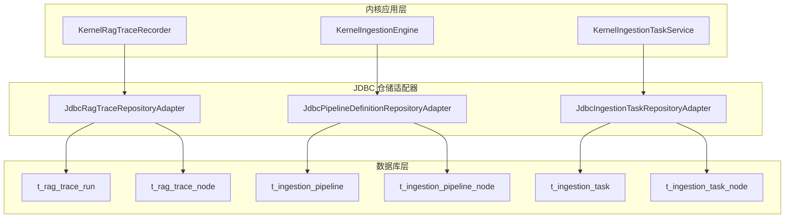
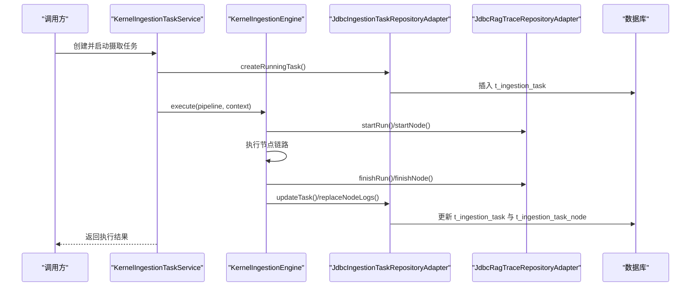
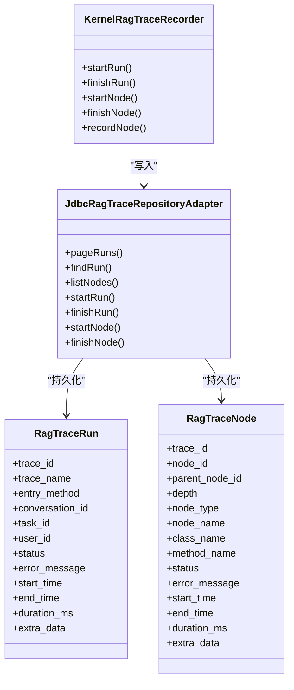
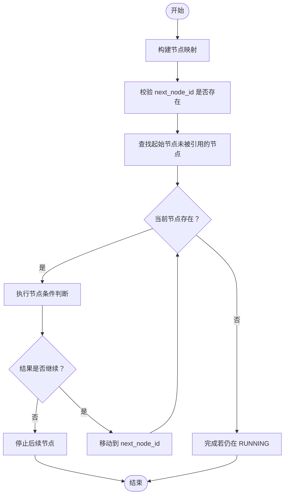
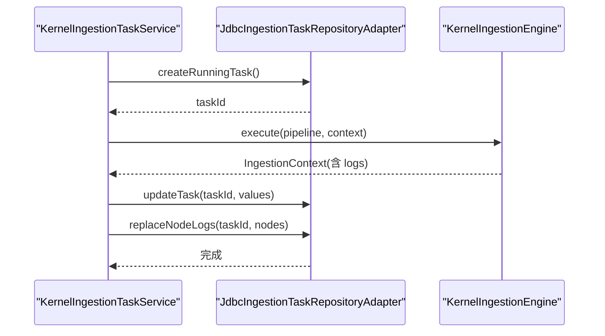
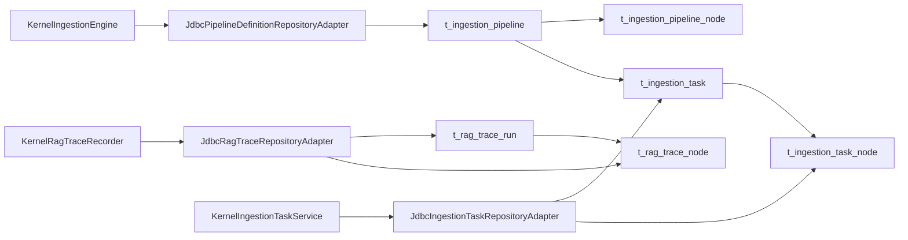

# 追踪与摄取相关表

<cite>
**本文引用的文件**
- [seahorse_init.sql](file://resources/database/seahorse_init.sql)
- [seahorse_init.sql](file://resources/database/seahorse_init.sql)
- [JdbcRagTraceRepositoryAdapter.java](file://seahorse-agent-adapter-repository-jdbc/src/main/java/com/miracle/ai/seahorse/agent/adapters/repository/jdbc/JdbcRagTraceRepositoryAdapter.java)
- [JdbcIngestionTaskRepositoryAdapter.java](file://seahorse-agent-adapter-repository-jdbc/src/main/java/com/miracle/ai/seahorse/agent/adapters/repository/jdbc/JdbcIngestionTaskRepositoryAdapter.java)
- [JdbcPipelineDefinitionRepositoryAdapter.java](file://seahorse-agent-adapter-repository-jdbc/src/main/java/com/miracle/ai/seahorse/agent/adapters/repository/jdbc/JdbcPipelineDefinitionRepositoryAdapter.java)
- [KernelRagTraceRecorder.java](file://seahorse-agent-kernel/src/main/java/com/miracle/ai/seahorse/agent/kernel/application/trace/KernelRagTraceRecorder.java)
- [KernelIngestionEngine.java](file://seahorse-agent-kernel/src/main/java/com/miracle/ai/seahorse/agent/kernel/application/ingestion/KernelIngestionEngine.java)
- [KernelIngestionTaskService.java](file://seahorse-agent-kernel/src/main/java/com/miracle/ai/seahorse/agent/kernel/application/ingestion/KernelIngestionTaskService.java)
- [IngestionPipelinePayload.java](file://seahorse-agent-kernel/src/main/java/com/miracle/ai/seahorse/agent/ports/inbound/ingestion/IngestionPipelinePayload.java)
</cite>

## 目录
1. [简介](#简介)
2. [项目结构](#项目结构)
3. [核心组件](#核心组件)
4. [架构总览](#架构总览)
5. [详细组件分析](#详细组件分析)
6. [依赖关系分析](#依赖关系分析)
7. [性能考量](#性能考量)
8. [故障排查指南](#故障排查指南)
9. [结论](#结论)
10. [附录](#附录)

## 简介
本文件聚焦于追踪与摄取相关的核心数据库表及其在系统中的实现与使用，涵盖以下主题：
- RAG 追踪表 t_rag_trace_run、t_rag_trace_node 的设计理念与状态机
- 数据摄取流水线表 t_ingestion_pipeline、t_ingestion_pipeline_node 的节点配置与执行生命周期
- 摄取任务表 t_ingestion_task、t_ingestion_task_node 的任务执行与日志存储
- 分布式追踪的实现方案、节点执行状态管理、并行处理与可靠性保障
- JSONB 字段在配置与日志存储中的应用、索引与查询优化
- 实际 SQL 建表语句分析与最佳实践建议（性能监控、故障排查、系统稳定性）

## 项目结构
围绕追踪与摄取的相关文件主要分布在数据库脚本与 Java 适配器层：
- 数据库模式与注释：resources/database/seahorse_init.sql
- 初始数据：resources/database/seahorse_init.sql
- 追踪与摄取的 JDBC 仓储适配器：seahorse-agent-adapter-repository-jdbc 下的 JdbcRagTraceRepositoryAdapter、JdbcIngestionTaskRepositoryAdapter、JdbcPipelineDefinitionRepositoryAdapter
- 内核应用层：KernelRagTraceRecorder、KernelIngestionEngine、KernelIngestionTaskService
- 摄取流水线载荷定义：IngestionPipelinePayload

图表来源
- [seahorse_init.sql:293-416](file://resources/database/seahorse_init.sql#L293-L416)
- [JdbcRagTraceRepositoryAdapter.java:43-86](file://seahorse-agent-adapter-repository-jdbc/src/main/java/com/miracle/ai/seahorse/agent/adapters/repository/jdbc/JdbcRagTraceRepositoryAdapter.java#L43-L86)
- [JdbcIngestionTaskRepositoryAdapter.java:47-109](file://seahorse-agent-adapter-repository-jdbc/src/main/java/com/miracle/ai/seahorse/agent/adapters/repository/jdbc/JdbcIngestionTaskRepositoryAdapter.java#L47-L109)
- [JdbcPipelineDefinitionRepositoryAdapter.java:106-112](file://seahorse-agent-adapter-repository-jdbc/src/main/java/com/miracle/ai/seahorse/agent/adapters/repository/jdbc/JdbcPipelineDefinitionRepositoryAdapter.java#L106-L112)

章节来源
- [seahorse_init.sql:293-416](file://resources/database/seahorse_init.sql#L293-L416)

## 核心组件
本节从数据库表结构出发，结合内核与适配器层的实现，梳理各组件职责与协作方式。

- t_rag_trace_run：记录一次 RAG 链路运行的全局状态，包含入口方法、会话与任务关联、用户、状态、耗时、错误信息与扩展数据。
- t_rag_trace_node：记录链路上每个节点的执行状态，支持父子关系、深度、类名与方法名、耗时与错误信息。
- t_ingestion_pipeline：定义一条摄取流水线的基本信息（名称、描述、创建/更新人）。
- t_ingestion_pipeline_node：定义流水线节点的类型、顺序、下一节点、设置与条件（均以 JSONB 存储），并建立到流水线的外键关系。
- t_ingestion_task：记录一次摄取任务的来源、状态、分块计数、错误信息、日志与元数据（JSONB），以及开始/完成时间。
- t_ingestion_task_node：记录任务中每个节点的执行顺序、状态、耗时、消息、错误与输出（JSONB）。

章节来源
- [seahorse_init.sql:293-416](file://resources/database/seahorse_init.sql#L293-L416)

## 架构总览
下图展示了从内核应用层到数据库层的数据流与状态流转，强调追踪与摄取两条主线的协同。

图表来源
- [KernelIngestionTaskService.java:128-138](file://seahorse-agent-kernel/src/main/java/com/miracle/ai/seahorse/agent/kernel/application/ingestion/KernelIngestionTaskService.java#L128-L138)
- [KernelIngestionEngine.java:79-90](file://seahorse-agent-kernel/src/main/java/com/miracle/ai/seahorse/agent/kernel/application/ingestion/KernelIngestionEngine.java#L79-L90)
- [JdbcIngestionTaskRepositoryAdapter.java:112-139](file://seahorse-agent-adapter-repository-jdbc/src/main/java/com/miracle/ai/seahorse/agent/adapters/repository/jdbc/JdbcIngestionTaskRepositoryAdapter.java#L112-L139)
- [JdbcRagTraceRepositoryAdapter.java:128-202](file://seahorse-agent-adapter-repository-jdbc/src/main/java/com/miracle/ai/seahorse/agent/adapters/repository/jdbc/JdbcRagTraceRepositoryAdapter.java#L128-L202)

## 详细组件分析

### RAG 追踪表：t_rag_trace_run 与 t_rag_trace_node
- 设计理念
  - 全局链路运行记录（t_rag_trace_run）与节点级执行记录（t_rag_trace_node）分离，便于聚合查询与细粒度诊断。
  - 使用统一的 trace_id 关联运行与节点，确保跨模块可追踪性。
  - 时间戳精度为毫秒级（TIMESTAMP(3)），便于高精度耗时统计。
- 状态机
  - 运行状态：RUNNING/SUCCESS/FAILED；节点状态：RUNNING/SUCCESS/FAILED。
  - 错误信息长度限制（最大 1000），避免异常堆栈导致的存储膨胀。
- JSONB 应用
  - t_rag_trace_run.extra_data：用于存放扩展字段（如上下文、元数据）。
  - t_rag_trace_node.extra_data：用于节点级扩展数据。
- 索引与查询
  - t_rag_trace_run：按 task_id、user_id 建有索引，支持按任务与用户维度快速筛选。
  - t_rag_trace_node：按 trace_id 建有索引，支持按链路查询节点序列。
- 内核与适配器
  - KernelRagTraceRecorder 提供 startRun/startNode/finishRun/finishNode 的生命周期管理，并在异常时自动标记 FAILED。
  - JdbcRagTraceRepositoryAdapter 将生命周期事件持久化至数据库，支持分页查询与过滤。

图表来源
- [seahorse_init.sql:293-337](file://resources/database/seahorse_init.sql#L293-L337)
- [KernelRagTraceRecorder.java:66-185](file://seahorse-agent-kernel/src/main/java/com/miracle/ai/seahorse/agent/kernel/application/trace/KernelRagTraceRecorder.java#L66-L185)
- [JdbcRagTraceRepositoryAdapter.java:43-86](file://seahorse-agent-adapter-repository-jdbc/src/main/java/com/miracle/ai/seahorse/agent/adapters/repository/jdbc/JdbcRagTraceRepositoryAdapter.java#L43-L86)

章节来源
- [seahorse_init.sql:293-337](file://resources/database/seahorse_init.sql#L293-L337)
- [KernelRagTraceRecorder.java:66-185](file://seahorse-agent-kernel/src/main/java/com/miracle/ai/seahorse/agent/kernel/application/trace/KernelRagTraceRecorder.java#L66-L185)
- [JdbcRagTraceRepositoryAdapter.java:88-202](file://seahorse-agent-adapter-repository-jdbc/src/main/java/com/miracle/ai/seahorse/agent/adapters/repository/jdbc/JdbcRagTraceRepositoryAdapter.java#L88-L202)

### 摄取流水线表：t_ingestion_pipeline 与 t_ingestion_pipeline_node
- 设计理念
  - 流水线（t_ingestion_pipeline）与节点（t_ingestion_pipeline_node）解耦，节点通过 next_node_id 形成单向链路。
  - 节点配置与条件以 JSONB 存储，支持灵活扩展与动态配置。
- 节点执行状态管理
  - 节点顺序由 node_order 控制，便于可视化与审计。
  - 条件 JSONB 支持根据上下文决定是否执行，实现分支与跳过。
- 内核与适配器
  - KernelIngestionEngine 负责解析节点链路、校验环路、按 next_node_id 串行执行、失败中断。
  - JdbcPipelineDefinitionRepositoryAdapter 提供流水线的创建、查询与删除操作，内部通过 SQL JOIN t_ingestion_pipeline_node 获取完整节点配置。

图表来源
- [KernelIngestionEngine.java:92-144](file://seahorse-agent-kernel/src/main/java/com/miracle/ai/seahorse/agent/kernel/application/ingestion/KernelIngestionEngine.java#L92-L144)

章节来源
- [seahorse_init.sql:343-372](file://resources/database/seahorse_init.sql#L343-L372)
- [KernelIngestionEngine.java:79-144](file://seahorse-agent-kernel/src/main/java/com/miracle/ai/seahorse/agent/kernel/application/ingestion/KernelIngestionEngine.java#L79-L144)
- [JdbcPipelineDefinitionRepositoryAdapter.java:114-132](file://seahorse-agent-adapter-repository-jdbc/src/main/java/com/miracle/ai/seahorse/agent/adapters/repository/jdbc/JdbcPipelineDefinitionRepositoryAdapter.java#L114-L132)

### 摄取任务表：t_ingestion_task 与 t_ingestion_task_node
- 设计理念
  - 任务表记录来源、状态、分块计数、错误信息与 JSONB 日志/元数据，便于异步处理与重试。
  - 节点表记录每个节点的执行顺序、状态、耗时、消息与输出，支持按任务维度回溯。
- 生命周期控制
  - KernelIngestionTaskService 在创建任务后调用 KernelIngestionEngine 执行流水线，完成后更新任务状态与节点日志。
  - JdbcIngestionTaskRepositoryAdapter 提供任务创建、更新、分页查询与节点日志替换（先删除旧日志再插入新日志）。
- JSONB 应用
  - logs_json：节点执行日志集合（NodeLog 列表）
  - metadata_json：任务级元数据
  - output_json：节点输出（全量 JSON）
- 索引与查询
  - t_ingestion_task：按 pipeline_id、status 建有索引，支持按状态分页与按流水线筛选。
  - t_ingestion_task_node：按 task_id、pipeline_id、status 建有索引，支持按任务与状态查询。

图表来源
- [KernelIngestionTaskService.java:128-138](file://seahorse-agent-kernel/src/main/java/com/miracle/ai/seahorse/agent/kernel/application/ingestion/KernelIngestionTaskService.java#L128-L138)
- [JdbcIngestionTaskRepositoryAdapter.java:112-148](file://seahorse-agent-adapter-repository-jdbc/src/main/java/com/miracle/ai/seahorse/agent/adapters/repository/jdbc/JdbcIngestionTaskRepositoryAdapter.java#L112-L148)

章节来源
- [seahorse_init.sql:374-416](file://resources/database/seahorse_init.sql#L374-L416)
- [KernelIngestionTaskService.java:128-138](file://seahorse-agent-kernel/src/main/java/com/miracle/ai/seahorse/agent/kernel/application/ingestion/KernelIngestionTaskService.java#L128-L138)
- [JdbcIngestionTaskRepositoryAdapter.java:111-184](file://seahorse-agent-adapter-repository-jdbc/src/main/java/com/miracle/ai/seahorse/agent/adapters/repository/jdbc/JdbcIngestionTaskRepositoryAdapter.java#L111-L184)

### JSONB 字段在配置与日志存储中的应用
- 配置存储
  - t_ingestion_pipeline_node.settings_json：节点配置（如解析器参数、索引器参数等）
  - t_ingestion_pipeline_node.condition_json：执行条件（如基于上下文的分支逻辑）
  - t_ingestion_task.metadata_json：任务元数据（如来源标识、版本信息）
- 日志与输出
  - t_ingestion_task.logs_json：节点日志集合（NodeLog 列表）
  - t_ingestion_task_node.output_json：节点输出（全量 JSON）
- 解析与序列化
  - JdbcIngestionTaskRepositoryAdapter 使用 Jackson 将对象序列化为 JSON 并反序列化，提供容错处理（异常时返回空集合或空映射）。

章节来源
- [seahorse_init.sql:356-416](file://resources/database/seahorse_init.sql#L356-L416)
- [JdbcIngestionTaskRepositoryAdapter.java:247-270](file://seahorse-agent-adapter-repository-jdbc/src/main/java/com/miracle/ai/seahorse/agent/adapters/repository/jdbc/JdbcIngestionTaskRepositoryAdapter.java#L247-L270)

### 分布式追踪的实现方案
- 全局链路 ID：trace_id 作为跨模块追踪的唯一标识，贯穿运行与节点记录。
- 生命周期管理：KernelRagTraceRecorder 提供 startRun/startNode/finishRun/finishNode 的统一入口，异常自动标记 FAILED。
- 降级与容错：当追踪记录失败时，记录器会降级为无追踪模式，避免影响主流程。
- 查询与分页：JdbcRagTraceRepositoryAdapter 支持按 trace_id、conversation_id、task_id、status 等条件分页查询。

章节来源
- [KernelRagTraceRecorder.java:66-110](file://seahorse-agent-kernel/src/main/java/com/miracle/ai/seahorse/agent/kernel/application/trace/KernelRagTraceRecorder.java#L66-L110)
- [JdbcRagTraceRepositoryAdapter.java:88-125](file://seahorse-agent-adapter-repository-jdbc/src/main/java/com/miracle/ai/seahorse/agent/adapters/repository/jdbc/JdbcRagTraceRepositoryAdapter.java#L88-L125)

### 流水线节点的并行处理与可靠性
- 串行执行：KernelIngestionEngine 按 next_node_id 串行执行，确保依赖顺序与一致性。
- 失败中断：任一节点失败将导致后续节点停止，避免无效工作与数据不一致。
- 条件执行：通过 condition_json 与 IngestionConditionPort 控制节点是否执行，提升灵活性。
- 日志与输出：节点执行结果通过 NodeResult 返回，日志通过 IngestionNodeLogPort 记录，便于审计与重放。

章节来源
- [KernelIngestionEngine.java:146-186](file://seahorse-agent-kernel/src/main/java/com/miracle/ai/seahorse/agent/kernel/application/ingestion/KernelIngestionEngine.java#L146-L186)

### 任务调度的可靠性保证
- 任务状态：t_ingestion_task.status 维护 RUNNING/SUCCESS/FAILED，配合 logs_json 与 error_message 提供完整可观测性。
- 节点日志替换：replaceNodeLogs 先删除旧日志再插入新日志，确保最终一致性。
- 分页查询：按状态分页查询，支持后台作业与前端 UI 的任务监控。

章节来源
- [seahorse_init.sql:374-416](file://resources/database/seahorse_init.sql#L374-L416)
- [JdbcIngestionTaskRepositoryAdapter.java:142-148](file://seahorse-agent-adapter-repository-jdbc/src/main/java/com/miracle/ai/seahorse/agent/adapters/repository/jdbc/JdbcIngestionTaskRepositoryAdapter.java#L142-L148)

## 依赖关系分析
- 表间依赖
  - t_ingestion_task_node 依赖 t_ingestion_task（task_id）
  - t_ingestion_task 依赖 t_ingestion_pipeline（pipeline_id）
  - t_ingestion_pipeline_node 依赖 t_ingestion_pipeline（pipeline_id）
  - t_rag_trace_node 依赖 t_rag_trace_run（trace_id）
- 适配器依赖
  - JdbcRagTraceRepositoryAdapter 依赖 t_rag_trace_run、t_rag_trace_node
  - JdbcIngestionTaskRepositoryAdapter 依赖 t_ingestion_task、t_ingestion_task_node
  - JdbcPipelineDefinitionRepositoryAdapter 依赖 t_ingestion_pipeline、t_ingestion_pipeline_node
- 内核依赖
  - KernelIngestionTaskService 依赖 KernelIngestionEngine、JdbcIngestionTaskRepositoryAdapter
  - KernelRagTraceRecorder 依赖 JdbcRagTraceRepositoryAdapter

图表来源
- [seahorse_init.sql:343-416](file://resources/database/seahorse_init.sql#L343-L416)
- [JdbcRagTraceRepositoryAdapter.java:43-86](file://seahorse-agent-adapter-repository-jdbc/src/main/java/com/miracle/ai/seahorse/agent/adapters/repository/jdbc/JdbcRagTraceRepositoryAdapter.java#L43-L86)
- [JdbcIngestionTaskRepositoryAdapter.java:47-109](file://seahorse-agent-adapter-repository-jdbc/src/main/java/com/miracle/ai/seahorse/agent/adapters/repository/jdbc/JdbcIngestionTaskRepositoryAdapter.java#L47-L109)
- [JdbcPipelineDefinitionRepositoryAdapter.java:106-112](file://seahorse-agent-adapter-repository-jdbc/src/main/java/com/miracle/ai/seahorse/agent/adapters/repository/jdbc/JdbcPipelineDefinitionRepositoryAdapter.java#L106-L112)

## 性能考量
- 索引策略
  - t_rag_trace_run：按 task_id、user_id 建有索引，适合按任务与用户维度查询。
  - t_ingestion_task：按 pipeline_id、status 建有索引，适合按流水线与状态分页。
  - t_ingestion_task_node：按 task_id、pipeline_id、status 建有索引，适合按任务与状态查询。
- JSONB 查询
  - 当前模式主要通过字符串存储 JSONB，查询时需注意索引与解析成本。如需复杂查询，可考虑引入 GIN 索引或物化视图。
- 时间戳精度
  - 追踪表使用 TIMESTAMP(3)，有助于高精度耗时统计与排序。
- 并发与锁
  - 任务日志替换采用“删除+插入”策略，建议在高并发场景下评估批量插入与事务开销。

[本节为通用性能建议，无需特定文件来源]

## 故障排查指南
- 追踪记录失败
  - 现象：KernelRagTraceRecorder 在 startRun/finishRun 或 startNode/finishNode 抛出异常。
  - 排查：检查数据库连接、表权限与字段约束；查看日志降级提示。
  - 参考：[KernelRagTraceRecorder.java:84-87](file://seahorse-agent-kernel/src/main/java/com/miracle/ai/seahorse/agent/kernel/application/trace/KernelRagTraceRecorder.java#L84-L87)
- 任务状态异常
  - 现象：t_ingestion_task.status 长期为 RUNNING。
  - 排查：检查任务执行日志（logs_json）、错误信息（error_message），确认节点是否抛出异常。
  - 参考：[JdbcIngestionTaskRepositoryAdapter.java:129-139](file://seahorse-agent-adapter-repository-jdbc/src/main/java/com/miracle/ai/seahorse/agent/adapters/repository/jdbc/JdbcIngestionTaskRepositoryAdapter.java#L129-L139)
- 节点日志缺失
  - 现象：t_ingestion_task_node 中缺少节点日志。
  - 排查：确认 KernelIngestionTaskService 是否调用了 replaceNodeLogs；检查 JSONB 解析异常。
  - 参考：[KernelIngestionTaskService.java:136-137](file://seahorse-agent-kernel/src/main/java/com/miracle/ai/seahorse/agent/kernel/application/ingestion/KernelIngestionTaskService.java#L136-L137)
- 流水线执行中断
  - 现象：某节点失败导致后续节点未执行。
  - 排查：检查节点返回的 NodeResult，确认是否 isSuccess() 且 isShouldContinue()。
  - 参考：[KernelIngestionEngine.java:174-186](file://seahorse-agent-kernel/src/main/java/com/miracle/ai/seahorse/agent/kernel/application/ingestion/KernelIngestionEngine.java#L174-L186)

章节来源
- [KernelRagTraceRecorder.java:84-87](file://seahorse-agent-kernel/src/main/java/com/miracle/ai/seahorse/agent/kernel/application/trace/KernelRagTraceRecorder.java#L84-L87)
- [JdbcIngestionTaskRepositoryAdapter.java:129-139](file://seahorse-agent-adapter-repository-jdbc/src/main/java/com/miracle/ai/seahorse/agent/adapters/repository/jdbc/JdbcIngestionTaskRepositoryAdapter.java#L129-L139)
- [KernelIngestionTaskService.java:136-137](file://seahorse-agent-kernel/src/main/java/com/miracle/ai/seahorse/agent/kernel/application/ingestion/KernelIngestionTaskService.java#L136-L137)
- [KernelIngestionEngine.java:174-186](file://seahorse-agent-kernel/src/main/java/com/miracle/ai/seahorse/agent/kernel/application/ingestion/KernelIngestionEngine.java#L174-L186)

## 结论
本文件系统性地梳理了追踪与摄取相关表的设计理念、实现细节与最佳实践。通过将链路运行与节点执行分离、以 JSONB 存储灵活配置与日志、在内核层提供统一的状态机与生命周期管理，系统实现了可观测、可扩展、可维护的 RAG 与数据摄取能力。建议在生产环境中结合索引策略、JSONB 查询优化与监控告警，持续提升性能与稳定性。

[本节为总结性内容，无需特定文件来源]

## 附录

### 实际 SQL 建表语句分析（节选）
- t_rag_trace_run
  - 主键：id；唯一索引：trace_id；索引：task_id、user_id；字段：trace_id、trace_name、entry_method、conversation_id、task_id、user_id、status、error_message、start_time、end_time、duration_ms、extra_data。
  - 参考：[seahorse_init.sql:293-314](file://resources/database/seahorse_init.sql#L293-L314)
- t_rag_trace_node
  - 主键：id；唯一索引：trace_id,node_id；字段：trace_id、node_id、parent_node_id、depth、node_type、node_name、class_name、method_name、status、error_message、start_time、end_time、duration_ms、extra_data。
  - 参考：[seahorse_init.sql:316-337](file://resources/database/seahorse_init.sql#L316-L337)
- t_ingestion_pipeline
  - 主键：id；唯一索引：name,deleted；字段：id、name、description、created_by、updated_by、create_time、update_time、deleted。
  - 参考：[seahorse_init.sql:343-354](file://resources/database/seahorse_init.sql#L343-L354)
- t_ingestion_pipeline_node
  - 主键：id；唯一索引：pipeline_id,node_id,deleted；索引：pipeline_id；字段：pipeline_id、node_id、node_type、next_node_id、settings_json、condition_json、created_by、updated_by、create_time、update_time、deleted。
  - 参考：[seahorse_init.sql:356-372](file://resources/database/seahorse_init.sql#L356-L372)
- t_ingestion_task
  - 主键：id；索引：pipeline_id、status；字段：id、pipeline_id、source_type、source_location、source_file_name、status、chunk_count、error_message、logs_json、metadata_json、started_at、completed_at、created_by、updated_by、create_time、update_time、deleted。
  - 参考：[seahorse_init.sql:374-396](file://resources/database/seahorse_init.sql#L374-L396)
- t_ingestion_task_node
  - 主键：id；索引：task_id、pipeline_id、status；字段：id、task_id、pipeline_id、node_id、node_type、node_order、status、duration_ms、message、error_message、output_json、create_time、update_time、deleted。
  - 参考：[seahorse_init.sql:397-416](file://resources/database/seahorse_init.sql#L397-L416)

### 最佳实践建议
- 追踪
  - 保持 trace_id 的全局唯一性，避免跨模块冲突。
  - 对关键节点使用 startNode/finishNode 包裹，确保异常时也能记录失败节点。
  - 控制 error_message 长度，避免超长异常堆栈导致存储压力。
- 摄取
  - 使用 JSONB 存储配置与日志时，尽量规范化结构，便于后续查询与分析。
  - 对高频查询字段（如 status、task_id）建立索引，避免全表扫描。
  - 在高并发场景下，评估批量插入与事务提交的成本，必要时采用批处理策略。
- 稳定性
  - 为关键表添加合理的索引与分区策略（如按时间分区），提升查询性能。
  - 对 JSONB 字段进行定期清理与压缩，避免碎片化与膨胀。

[本节为通用建议，无需特定文件来源]